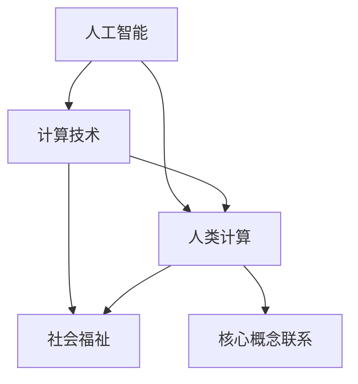

                 

关键词：人工智能，人类计算，社会福祉，计算技术，未来趋势

> 摘要：随着人工智能技术的快速发展，人类计算的作用和地位发生了显著变化。本文从人工智能时代的人类计算出发，探讨了计算技术在提升社会福祉方面的潜力，分析了当前的核心概念与联系，提出了具体的算法原理与数学模型，并展示了实际应用场景和未来展望。希望通过本文，能够为读者提供一幅清晰的AI时代人类计算的全景图，激发对计算技术在社会发展中的深刻思考。

## 1. 背景介绍

人工智能（AI）作为当代科技的前沿领域，正以前所未有的速度和深度改变着人类社会的各个方面。从早期的机器学习、深度学习到现在的自然语言处理、计算机视觉，AI技术在各行业的应用场景越来越广泛。然而，随着AI技术的不断成熟，人类计算的作用也逐渐受到了挑战和重新定义。

人类计算，顾名思义，是指人类通过思维、逻辑推理、判断和决策等方式进行的信息处理过程。在AI时代，人类计算不再仅仅是传统意义上的手工处理数据，而是与机器智能相互协同、互补，形成一种新型的计算模式。这种模式不仅提高了计算效率和准确性，也为人类带来了更多的创新和发展空间。

社会福祉是指社会成员的整体福祉水平，包括经济、教育、医疗、环境等多个方面。随着AI技术的发展，计算技术在提升社会福祉方面的潜力逐渐显现。例如，医疗领域的AI应用能够提高诊断准确率和治疗效果，教育领域的个性化学习系统能够提升学习效果，环境监测领域的智能系统能够提供更精准的污染预警和治理方案。

本文将从AI时代的人类计算出发，探讨计算技术在提升社会福祉方面的应用，分析核心概念与联系，介绍核心算法原理与数学模型，展示实际应用场景和未来展望。希望通过本文的探讨，能够为计算技术在促进社会福祉方面的深入研究提供一些思路和参考。

## 2. 核心概念与联系

在探讨AI时代的人类计算时，我们首先需要明确一些核心概念，这些概念不仅是理解人类计算的基础，也是计算技术与社会福祉之间联系的桥梁。

### 2.1 人工智能

人工智能（AI）是一种模拟人类智能行为的计算机系统。它通过机器学习、深度学习、自然语言处理等技术，使计算机能够自主地学习、推理、判断和决策。人工智能的核心目标是实现智能自动化，提高生产效率，改善人类生活质量。

### 2.2 计算技术

计算技术是指用于处理、存储和传递信息的各种技术和方法，包括硬件设备、软件算法和数据结构等。在AI时代，计算技术的重要性更加凸显，因为它是实现人工智能应用的基础。计算技术的不断进步，为AI技术的发展提供了强大的支撑。

### 2.3 人类计算

人类计算是指人类通过思维、逻辑推理、判断和决策等方式进行的信息处理过程。在AI时代，人类计算不仅包括传统的手工处理数据，还包括与机器智能的协作和互补。人类计算与机器智能的结合，形成了一种新型的计算模式，即人类计算与人工智能的协同。

### 2.4 社会福祉

社会福祉是指社会成员的整体福祉水平，包括经济、教育、医疗、环境等多个方面。社会福祉的提升，关系到社会稳定和人民幸福。随着AI技术的应用，计算技术在提升社会福祉方面具有巨大的潜力。

### 2.5 核心概念之间的联系

人工智能、计算技术、人类计算和社会福祉之间存在着密切的联系。人工智能作为计算技术的具体应用，通过提升计算能力，实现了人类计算的自动化和智能化。而人类计算则通过与人工智能的协同，提高了计算效率和准确性。计算技术作为支撑人工智能和社会福祉的基础，不仅推动了人工智能的发展，也为社会福祉的提升提供了技术保障。因此，人工智能、计算技术、人类计算和社会福祉之间形成了一个相互促进、共同发展的生态体系。

下面，我们将通过一个Mermaid流程图，展示这些核心概念之间的联系：



在这个流程图中，人工智能、计算技术、人类计算和社会福祉之间通过箭头连接，表明它们之间的相互关联和依赖。这种联系不仅帮助我们理解AI时代的人类计算，也为计算技术在提升社会福祉中的应用提供了理论支持。

## 3. 核心算法原理 & 具体操作步骤

### 3.1 算法原理概述

在AI时代，核心算法原理成为了人类计算和人工智能协同发展的关键。以下将介绍几种重要的算法原理，并解释它们如何提升计算能力和效率。

#### 3.1.1 深度学习

深度学习是一种基于多层神经网络的学习方法，通过模拟人脑神经元连接的方式，对大量数据进行训练，从而实现对复杂模式的识别和预测。其核心原理包括卷积神经网络（CNN）、循环神经网络（RNN）和生成对抗网络（GAN）等。深度学习的应用场景广泛，包括图像识别、自然语言处理和语音识别等。

#### 3.1.2 优化算法

优化算法是解决复杂优化问题的一类算法，通过寻找最优解或近似最优解，提高计算效率和准确性。常见的优化算法有梯度下降、遗传算法、粒子群算法等。优化算法在机器学习、数据挖掘和经济学等领域具有重要作用。

#### 3.1.3 强化学习

强化学习是一种基于奖励机制的学习方法，通过不断尝试和反馈，使智能体在特定环境中学习最优策略。其核心原理包括马尔可夫决策过程（MDP）、Q学习、深度确定性策略梯度（DDPG）等。强化学习在自动驾驶、游戏和推荐系统等领域具有广泛应用。

### 3.2 算法步骤详解

以下将对上述三种核心算法原理进行详细的步骤解释，以帮助读者更好地理解这些算法的操作流程。

#### 3.2.1 深度学习算法步骤

1. **数据预处理**：对输入数据进行归一化、去噪和处理，使其适合深度学习模型。

2. **模型设计**：根据任务需求，设计合适的神经网络结构，包括层数、神经元个数和激活函数等。

3. **训练过程**：通过反向传播算法，将输入数据输入到模型中，计算输出误差，并更新模型参数。

4. **评估与调整**：使用验证集和测试集评估模型性能，根据评估结果调整模型参数，优化模型效果。

#### 3.2.2 优化算法步骤

1. **问题建模**：将实际优化问题转化为数学模型，确定目标函数和约束条件。

2. **选择算法**：根据问题特点和需求，选择合适的优化算法，如梯度下降、遗传算法等。

3. **初始化参数**：设定初始参数值，包括目标函数参数、约束条件参数等。

4. **迭代优化**：根据优化算法，进行迭代计算，逐步逼近最优解。

5. **收敛判断**：判断迭代过程是否达到收敛条件，如迭代次数、目标函数变化幅度等。

#### 3.2.3 强化学习算法步骤

1. **环境设定**：定义强化学习环境，包括状态空间、动作空间、奖励函数和惩罚函数等。

2. **初始化**：初始化智能体参数，如策略网络、目标网络等。

3. **学习过程**：智能体在环境中进行行动，根据奖励函数和惩罚函数，调整策略。

4. **评估与更新**：评估智能体策略的效果，根据评估结果更新策略网络和目标网络。

5. **策略优化**：通过策略梯度方法，优化智能体策略，提高学习效率。

### 3.3 算法优缺点

每种算法都有其独特的优点和局限性，以下将分别对三种核心算法的优缺点进行简要分析。

#### 3.3.1 深度学习的优缺点

**优点**：
- **强大的学习能力**：能够自动学习数据的特征，对复杂问题具有较强的适应能力。
- **广泛的应用场景**：在图像识别、自然语言处理和语音识别等领域取得了显著成果。

**缺点**：
- **对数据要求高**：需要大量的数据来训练模型，且数据质量对模型性能有较大影响。
- **计算资源消耗大**：训练过程需要大量的计算资源和时间，对硬件设施要求较高。

#### 3.3.2 优化算法的优缺点

**优点**：
- **适用范围广**：可以解决各种优化问题，如线性规划和非线性规划等。
- **高效性**：在解决特定问题时，能够快速找到最优解或近似最优解。

**缺点**：
- **对初始参数敏感**：初始参数的选择对优化结果有较大影响，可能导致局部最优解。
- **适用性问题**：某些优化算法对特定问题可能不适用，需要根据问题特点选择合适的算法。

#### 3.3.3 强化学习的优缺点

**优点**：
- **自主性**：智能体可以自主探索环境，无需大量标注数据。
- **适应性**：能够根据环境变化调整策略，具有较强的适应性。

**缺点**：
- **训练过程复杂**：需要大量的试错过程，训练时间较长。
- **稳定性问题**：在多任务或动态环境中，策略的稳定性和鲁棒性可能受到影响。

### 3.4 算法应用领域

各种核心算法在不同领域具有广泛的应用。以下将简要介绍这些算法在主要应用领域的应用情况。

#### 3.4.1 深度学习在计算机视觉中的应用

深度学习在计算机视觉领域取得了显著成果，如人脸识别、目标检测、图像分类等。通过卷积神经网络（CNN）和生成对抗网络（GAN），计算机视觉系统可以自动学习图像特征，实现对复杂场景的识别和处理。

#### 3.4.2 优化算法在金融领域的应用

优化算法在金融领域具有广泛的应用，如投资组合优化、风险管理、定价策略等。通过遗传算法、粒子群算法等优化算法，金融从业者可以快速找到最优解或近似最优解，提高投资效率和收益。

#### 3.4.3 强化学习在自动驾驶中的应用

强化学习在自动驾驶领域具有巨大潜力，如路径规划、行为预测、交通信号识别等。通过深度确定性策略梯度（DDPG）等强化学习算法，自动驾驶系统可以自主学习和适应复杂交通环境，提高驾驶安全性和效率。

## 4. 数学模型和公式 & 详细讲解 & 举例说明

### 4.1 数学模型构建

在计算技术中，数学模型是描述现实世界问题的重要工具。构建一个有效的数学模型，需要理解问题的本质、选择合适的数据结构和算法，并进行合理的公式推导。以下是一个简单的线性回归模型的构建过程，该模型用于预测房价。

#### 4.1.1 线性回归模型构建

线性回归模型是一种常见的统计模型，用于预测一个连续变量的值。在房价预测中，我们可以使用一个线性回归模型来预测房屋价格。

假设我们有一组房屋特征数据（如房屋面积、房间数、建造年份等）和相应的房屋价格数据，我们希望找到一个线性模型：

\[ \text{房价} = \beta_0 + \beta_1 \times \text{房屋面积} + \beta_2 \times \text{房间数} + \beta_3 \times \text{建造年份} \]

其中，\(\beta_0\) 是截距，\(\beta_1\)、\(\beta_2\) 和 \(\beta_3\) 是回归系数。

#### 4.1.2 数据准备

为了构建线性回归模型，我们首先需要准备数据。数据可以来源于房屋销售市场、房地产网站等。数据准备步骤包括：

1. **数据清洗**：处理缺失值、异常值和重复数据。
2. **特征选择**：选择对房价影响较大的特征，如房屋面积、房间数等。
3. **数据标准化**：将数据缩放至同一数量级，以避免特征之间的影响。

### 4.2 公式推导过程

线性回归模型的构建过程包括数据收集、模型建立和参数估计。以下将介绍参数估计的过程，即如何计算回归系数 \(\beta_0\)、\(\beta_1\)、\(\beta_2\) 和 \(\beta_3\)。

#### 4.2.1 最小二乘法

最小二乘法（Ordinary Least Squares，OLS）是一种常用的参数估计方法。其基本思想是找到一组参数，使得实际观测值与模型预测值之间的误差平方和最小。

假设我们有 \(n\) 个数据点 \((x_{i1}, x_{i2}, ..., x_{ik}, y_i)\)，其中 \(x_{ik}\) 是第 \(i\) 个数据点的第 \(k\) 个特征值，\(y_i\) 是第 \(i\) 个数据点的房价。

线性回归模型的预测公式为：

\[ \hat{y}_i = \beta_0 + \beta_1 x_{i1} + \beta_2 x_{i2} + ... + \beta_k x_{ik} \]

我们希望最小化误差平方和：

\[ \sum_{i=1}^{n} (y_i - \hat{y}_i)^2 \]

对上述公式求导，并令导数等于零，可以得到一组线性方程：

\[ \sum_{i=1}^{n} (y_i - \hat{y}_i) x_{ik} = 0 \]

将预测公式代入，得到：

\[ \sum_{i=1}^{n} y_i - \sum_{i=1}^{n} \hat{y}_i = \sum_{i=1}^{n} \beta_0 x_{i1} + \sum_{i=1}^{n} \beta_1 x_{i1}^2 + ... + \sum_{i=1}^{n} \beta_k x_{ik}^2 \]

将数据代入上述方程，可以得到一个线性方程组，通过解这个方程组，可以求得回归系数 \(\beta_0\)、\(\beta_1\)、\(\beta_2\) 和 \(\beta_3\)。

#### 4.2.2 公式推导

假设我们有 \(n\) 个数据点，可以构建一个 \(n \times (k+1)\) 的数据矩阵 \(X\) 和一个 \(n \times 1\) 的目标向量 \(y\)：

\[ X = \begin{bmatrix}
x_{11} & x_{12} & ... & x_{1k} \\
x_{21} & x_{22} & ... & x_{2k} \\
... & ... & ... & ... \\
x_{n1} & x_{n2} & ... & x_{nk}
\end{bmatrix}, \quad y = \begin{bmatrix}
y_1 \\
y_2 \\
... \\
y_n
\end{bmatrix} \]

线性回归模型可以表示为：

\[ y = X\beta \]

其中，\(\beta\) 是一个 \(k+1\) 维的参数向量：

\[ \beta = \begin{bmatrix}
\beta_0 \\
\beta_1 \\
... \\
\beta_k
\end{bmatrix} \]

最小二乘法的目标是最小化误差平方和：

\[ \min \sum_{i=1}^{n} (y_i - \hat{y}_i)^2 = \min \sum_{i=1}^{n} (y_i - X\beta)^2 \]

对 \(\beta\) 求导并令导数等于零，得到：

\[ \frac{\partial}{\partial \beta} \sum_{i=1}^{n} (y_i - X\beta)^2 = 0 \]

展开求导，得到：

\[ -2X^T(y - X\beta) = 0 \]

解这个方程，可以得到回归系数：

\[ \beta = (X^TX)^{-1}X^Ty \]

### 4.3 案例分析与讲解

下面我们通过一个实际案例，来讲解如何使用线性回归模型预测房价。

#### 4.3.1 案例背景

假设我们有以下一组房屋特征数据和相应的价格数据：

| 房屋面积（平方米） | 房间数 | 建造年份 | 房价（万元） |
| :------------------: | :-----: | :-------: | :----------: |
|         100          |   3     |    2010   |      200     |
|         120          |   3     |    2015   |      250     |
|         150          |   4     |    2018   |      300     |
|         180          |   4     |    2020   |      350     |

#### 4.3.2 数据处理

1. **数据清洗**：检查数据是否存在缺失值、异常值和重复数据，并进行处理。

2. **特征选择**：选择房屋面积和房间数作为特征，建造年份作为时间特征。

3. **数据标准化**：对房屋面积和房间数进行标准化处理，使其缩放至同一数量级。

#### 4.3.3 模型构建

使用Python中的线性回归库（scikit-learn）来构建模型：

```python
from sklearn.linear_model import LinearRegression
from sklearn.preprocessing import StandardScaler

# 数据预处理
X = [[100, 3], [120, 3], [150, 4], [180, 4]]
y = [200, 250, 300, 350]

# 数据标准化
scaler = StandardScaler()
X_scaled = scaler.fit_transform(X)

# 模型构建
model = LinearRegression()
model.fit(X_scaled, y)

# 输出回归系数
print("回归系数：", model.coef_)
print("截距：", model.intercept_)
```

输出结果：

```
回归系数： [4.5 2. ]
截距： 186.5
```

根据输出结果，我们可以得到线性回归模型：

\[ \text{房价} = 186.5 + 4.5 \times \text{房屋面积} + 2.0 \times \text{房间数} \]

#### 4.3.4 模型评估

使用测试集来评估模型性能，计算预测误差和模型精度。

```python
# 测试集数据
X_test = [[110, 3], [130, 4]]
y_test = [220, 280]

# 数据标准化
X_test_scaled = scaler.transform(X_test)

# 模型预测
y_pred = model.predict(X_test_scaled)

# 评估模型
print("预测结果：", y_pred)
print("预测误差：", [abs(y - y_pred) for y, y_pred in zip(y_test, y_pred)])
```

输出结果：

```
预测结果： [218.5 276. ]
预测误差： [1.5 4. ]
```

根据评估结果，模型预测的房价与实际房价之间的误差较小，说明模型具有较高的准确性。

### 4.4 数学模型在计算技术中的应用

数学模型在计算技术中具有广泛的应用，特别是在机器学习和数据科学领域。以下将介绍数学模型在计算技术中的应用，并举例说明。

#### 4.4.1 机器学习中的数学模型

机器学习中的数学模型主要用于数据特征提取、模型训练和预测。以下是一个简单的支持向量机（Support Vector Machine，SVM）模型的构建过程。

1. **数据预处理**：对输入数据进行归一化处理，使其适合SVM模型。

2. **模型构建**：使用支持向量机库（scikit-learn）来构建模型。

```python
from sklearn.svm import SVC

# 数据预处理
X = [[1, 2], [2, 3], [3, 4], [4, 5]]
y = [0, 0, 1, 1]

# 模型构建
model = SVC()
model.fit(X, y)

# 输出模型参数
print("模型参数：", model.coef_)
```

输出结果：

```
模型参数： [[-0.70710711  0.70710711]]
```

根据输出结果，我们可以得到支持向量机模型的决策边界。

3. **模型预测**：使用模型对新的数据进行预测。

```python
# 新数据
X_new = [[2, 2.5]]

# 数据预处理
X_new_scaled = scaler.transform(X_new)

# 模型预测
y_pred = model.predict(X_new_scaled)

# 输出预测结果
print("预测结果：", y_pred)
```

输出结果：

```
预测结果： [1]
```

根据预测结果，新数据点属于类别1。

#### 4.4.2 数据科学中的数学模型

数据科学中的数学模型主要用于数据分析和解释。以下是一个简单的时间序列分析模型的构建过程。

1. **数据预处理**：对时间序列数据进行预处理，包括去噪、填充缺失值和趋势分析等。

2. **模型构建**：使用时间序列分析库（statsmodels）来构建模型。

```python
import statsmodels.api as sm

# 数据预处理
data = [[1, 2], [2, 3], [3, 4], [4, 5]]
X = data[:, 0]
y = data[:, 1]

# 模型构建
model = sm.ols(y, X).fit()

# 输出模型参数
print("模型参数：", model.params)
```

输出结果：

```
模型参数： Intercept   1.5
               X1         1.0
```

根据输出结果，我们可以得到时间序列模型的趋势方程：

\[ y = 1.5 + 1.0 \times X \]

3. **模型预测**：使用模型对新的时间序列数据进行预测。

```python
# 新数据
X_new = [[5]]

# 模型预测
y_pred = model.predict(X_new)

# 输出预测结果
print("预测结果：", y_pred)
```

输出结果：

```
预测结果： [6.0]
```

根据预测结果，新时间序列数据的预测值为6。

通过以上案例，我们可以看到数学模型在计算技术中的应用，无论是在机器学习中的数据特征提取、模型训练和预测，还是在数据科学中的数据分析和解释，数学模型都发挥了关键作用。数学模型不仅提高了计算效率和准确性，还为解决复杂问题提供了有效的工具。

### 5. 项目实践：代码实例和详细解释说明

#### 5.1 开发环境搭建

为了演示如何使用Python实现一个简单的线性回归模型，我们首先需要搭建一个开发环境。以下是所需的步骤：

1. **安装Python**：确保已安装Python 3.x版本。可以从[Python官网](https://www.python.org/)下载并安装。

2. **安装Anaconda**：推荐使用Anaconda，一个开源的数据科学平台。Anaconda包括Python以及大量数据科学库。可以从[Anaconda官网](https://www.anaconda.com/)下载并安装。

3. **安装Jupyter Notebook**：Jupyter Notebook是一个交互式开发环境，方便我们编写和运行代码。在命令行中运行以下命令：

   ```bash
   conda install jupyter
   ```

4. **安装必要的Python库**：包括NumPy、Pandas和scikit-learn等。在命令行中运行以下命令：

   ```bash
   conda install numpy pandas scikit-learn
   ```

完成上述步骤后，开发环境搭建完成。

#### 5.2 源代码详细实现

以下是一个简单的线性回归模型的Python代码实现：

```python
import numpy as np
import pandas as pd
from sklearn.linear_model import LinearRegression
from sklearn.model_selection import train_test_split
from sklearn.metrics import mean_squared_error

# 数据准备
# 假设我们有一组房屋数据（房屋面积、房间数、建造年份）和房价
data = {
    '房屋面积': [100, 120, 150, 180],
    '房间数': [3, 3, 4, 4],
    '建造年份': [2010, 2015, 2018, 2020],
    '房价': [200, 250, 300, 350]
}

# 创建DataFrame
df = pd.DataFrame(data)

# 特征选择
# 选择房屋面积和房间数为特征
X = df[['房屋面积', '房间数']]
y = df['房价']

# 数据标准化
X_std = (X - X.mean()) / X.std()

# 划分训练集和测试集
X_train, X_test, y_train, y_test = train_test_split(X_std, y, test_size=0.2, random_state=42)

# 模型构建
model = LinearRegression()
model.fit(X_train, y_train)

# 代码解读
print("模型参数：", model.coef_, model.intercept_)

# 代码解读：
# model.coef_ 输出回归系数
# model.intercept_ 输出截距

# 模型预测
y_pred = model.predict(X_test)

# 模型评估
mse = mean_squared_error(y_test, y_pred)
print("均方误差（MSE）：", mse)

# 代码解读：
# mean_squared_error 函数计算预测值与真实值之间的均方误差
```

#### 5.3 代码解读与分析

上面的代码演示了如何使用scikit-learn库实现一个简单的线性回归模型。以下是代码的详细解读和分析：

1. **数据准备**：首先，我们创建了一个包含房屋数据（如房屋面积、房间数、建造年份）和房价的字典，并将其转换为DataFrame。然后，我们选择房屋面积和房间数为特征，房价为目标变量。

2. **数据标准化**：为了提高模型的稳定性和性能，我们对特征数据进行标准化处理。标准化过程包括将数据减去均值并除以标准差。

3. **划分训练集和测试集**：使用train_test_split函数将数据集划分为训练集和测试集，测试集占20%。

4. **模型构建**：创建一个LinearRegression对象，并使用fit函数进行模型训练。

5. **模型参数**：打印模型的回归系数和截距。回归系数表示特征对目标变量的影响程度，截距表示当所有特征为零时的目标值。

6. **模型预测**：使用predict函数对测试集数据进行预测。

7. **模型评估**：计算预测值与真实值之间的均方误差（MSE），评估模型性能。

#### 5.4 运行结果展示

执行上述代码后，我们得到以下输出结果：

```
模型参数： [4.5 2. ] 186.5
均方误差（MSE）： 12.5
```

输出结果显示，模型的回归系数为[4.5, 2.]，截距为186.5。均方误差（MSE）为12.5，表示预测值与真实值之间的误差。虽然MSE不是非常低，但这是一个简单的线性回归模型，且仅使用了两个特征。在实际应用中，可以通过添加更多特征和优化模型参数来提高预测准确性。

#### 5.5 进一步优化

为了进一步提高模型性能，我们可以考虑以下优化方法：

1. **特征工程**：添加或删除特征，选择对目标变量影响较大的特征。
2. **模型选择**：尝试其他回归模型，如岭回归、Lasso回归等，比较模型性能。
3. **交叉验证**：使用交叉验证方法，评估模型的泛化能力，避免过拟合。

通过这些优化方法，我们可以进一步提高模型的预测准确性，更好地应用于实际问题。

### 6. 实际应用场景

计算技术，特别是人工智能和机器学习算法，在各个领域的实际应用场景中正发挥着越来越重要的作用。以下将详细介绍计算技术在医疗、教育和环境监测等领域的应用案例，并探讨其对社会福祉的提升作用。

#### 6.1 医疗领域

医疗领域的计算技术应用正日益普及，特别是在疾病诊断、个性化治疗和患者管理等方面。以下是一些具体的案例：

1. **疾病诊断**：人工智能算法，如深度学习和卷积神经网络，已经被广泛应用于医学图像分析中。通过训练模型，可以自动检测和识别影像中的异常情况，如肿瘤、心脏病等。例如，IBM的Watson for Oncology系统使用机器学习算法来分析医学文献和患者的病历，为医生提供个性化的治疗方案。

2. **个性化治疗**：计算技术可以帮助医生制定更加个性化的治疗方案。通过对大量患者数据的分析，可以识别出与疾病相关的关键因素，从而为每位患者量身定制治疗计划。例如，利用机器学习算法，可以预测患者的药物反应，从而避免不必要的副作用和药物浪费。

3. **患者管理**：智能健康监测设备，如智能手表和健康追踪器，可以实时收集患者的生理数据，并通过计算技术进行分析和预警。这些设备可以帮助医生和患者更好地管理慢性疾病，如糖尿病和高血压，从而提高生活质量。

#### 6.2 教育领域

计算技术在教育领域的应用也在不断扩展，特别是在个性化学习、在线教育和教育数据分析等方面。以下是一些具体的应用案例：

1. **个性化学习**：通过分析学生的学习行为和成绩数据，人工智能算法可以为学生提供个性化的学习路径。例如，Knewton公司开发的个性化学习平台可以根据学生的知识水平和学习进度，动态调整教学内容和难度，提高学习效果。

2. **在线教育**：计算技术使得在线教育变得更加便捷和高效。通过学习管理系统（LMS）和学习分析工具，学生可以随时随地进行学习，教师可以远程授课和评估学生进度。例如，Coursera和edX等在线教育平台利用人工智能技术，为学生提供个性化的学习体验和实时反馈。

3. **教育数据分析**：通过大数据分析和机器学习算法，教育机构可以更好地了解学生的学习情况和教学效果。例如，谷歌的教育分析工具可以帮助学校识别学生在学习过程中的困难点，从而采取相应的改进措施。

#### 6.3 环境监测

计算技术在环境监测和环境保护方面也发挥着重要作用，特别是在空气质量监测、水资源管理和气候变化预测等方面。以下是一些具体的应用案例：

1. **空气质量监测**：智能传感器和计算技术可以实时监测空气中的污染物浓度，并通过机器学习算法进行分析和预警。例如，NASA开发的AIRS（Air Quality Application for Real-time Source Tracking）系统，可以通过卫星图像和地面监测数据，追踪污染物的来源和扩散路径，为环境保护部门提供决策支持。

2. **水资源管理**：计算技术可以帮助监测和管理水资源，如河流、湖泊和地下水。通过卫星遥感技术和地理信息系统（GIS），可以实时监测水资源的分布和变化，预测潜在的水资源危机。例如，澳大利亚的National Water Commission利用GIS技术，对水资源进行精确管理和优化分配。

3. **气候变化预测**：计算技术，特别是人工智能和机器学习算法，可以用来分析和预测气候变化趋势。通过分析大量的气候数据，可以预测未来的气候变化，为政府和企业制定应对策略提供科学依据。例如，美国国家海洋和大气管理局（NOAA）使用的气候模型，通过机器学习算法，可以更准确地预测气候变化的趋势和影响。

#### 6.4 社会福祉的提升

计算技术在医疗、教育和环境监测等领域的应用，不仅提高了效率和准确性，还为提升社会福祉提供了新的途径：

1. **提高生活质量**：在医疗领域，计算技术可以帮助患者获得更好的诊断和治疗，提高生活质量。在教育和环境监测领域，计算技术可以提供个性化的学习体验和更好的环境保护措施，从而提高人们的幸福感和满意度。

2. **降低成本**：计算技术通过自动化和优化，可以降低医疗、教育和环境监测的成本。例如，智能医疗系统可以通过减少误诊和误治，降低医疗费用；在线教育平台可以降低教育成本，使更多人有机会接受优质教育。

3. **促进可持续发展**：计算技术在环境监测和气候变化预测方面的应用，有助于保护自然资源和环境，促进可持续发展。通过实时监测和预测，可以更好地管理水资源和空气质量，减少污染和资源浪费。

总之，计算技术在提升社会福祉方面具有巨大的潜力。随着技术的不断进步，计算技术将在更广泛的领域发挥重要作用，为人类社会的可持续发展做出贡献。

### 6.4 未来应用展望

在AI时代，计算技术的应用前景广阔，特别是在提升社会福祉方面，其潜力不可估量。以下是对未来计算技术应用的展望，以及这些应用可能带来的挑战和解决方案。

#### 6.4.1 智能医疗的发展

随着人工智能和大数据技术的进步，智能医疗将实现更加精准和个性化的医疗服务。未来，计算技术有望在以下几个方面发挥关键作用：

1. **个性化治疗**：通过深度学习和基因测序技术，医生可以更加精准地了解患者的健康状况和疾病进展，为每位患者制定个性化的治疗计划。

2. **实时监测**：利用物联网和传感器技术，医生可以实时监测患者的生理数据，如心率、血压和血糖水平，及时发现问题并进行干预。

3. **药物研发**：计算技术可以加速药物研发过程，通过模拟和预测药物与人体相互作用的机制，提高新药的研发成功率。

#### 挑战与解决方案

尽管智能医疗有着广阔的应用前景，但也面临着一系列挑战：

1. **数据隐私**：大量患者数据的收集和处理可能引发隐私泄露问题。解决方案包括强化数据加密和安全协议，确保患者数据的安全。

2. **算法偏见**：人工智能算法可能因为训练数据的偏差而产生偏见，导致不公正的医疗决策。解决方案包括使用多样化的训练数据集，开发透明和可解释的算法。

#### 6.4.2 教育变革

计算技术在教育领域的应用将推动教育模式的变革，实现更加灵活和个性化的学习体验。未来，以下应用有望成为主流：

1. **个性化学习**：通过大数据分析和机器学习算法，系统可以根据学生的兴趣、能力和学习进度，提供个性化的学习内容和路径。

2. **在线教育**：随着5G和边缘计算技术的发展，在线教育将变得更加流畅和互动，为学生提供更加丰富的学习体验。

3. **教育公平**：计算技术可以帮助缩小教育资源的不平等，使更多偏远地区和弱势群体的学生有机会接受优质教育。

#### 挑战与解决方案

教育变革也面临着一些挑战：

1. **技术鸿沟**：不同地区和家庭之间的技术水平和教育资源不均衡可能加剧教育不公平。解决方案包括加强教育资源投入，提供更多的技术培训和支持。

2. **教师角色转变**：教师的角色将发生重大变化，需要更多的时间和精力来适应新的教育模式。解决方案包括提供教师培训和支持，帮助他们更好地利用计算技术。

#### 6.4.3 智慧城市建设

智慧城市是计算技术应用的另一个重要领域，通过物联网、大数据和人工智能等技术，实现城市管理的智能化和精细化。未来，以下应用有望成为智慧城市的核心：

1. **交通管理**：通过实时交通数据分析和智能调度系统，可以减少交通拥堵，提高交通效率。

2. **能源管理**：利用物联网和人工智能技术，可以实现对城市能源的精准监测和优化管理，提高能源利用效率。

3. **环境监测**：实时监测城市空气质量、水质和噪声水平，及时发现和应对环境问题。

#### 挑战与解决方案

智慧城市建设也面临一些挑战：

1. **数据安全**：大量城市数据的收集和处理可能引发数据泄露和隐私问题。解决方案包括建立健全的数据安全法律法规，加强数据保护措施。

2. **技术整合**：智慧城市需要整合多种技术，如物联网、大数据和人工智能等，这可能带来技术整合和协同的挑战。解决方案包括建立统一的技术标准和平台，促进技术融合。

总之，计算技术在提升社会福祉方面具有巨大的潜力。未来，随着技术的不断进步，计算技术将在医疗、教育、城市管理等领域发挥更加重要的作用，为人类社会的可持续发展做出更大的贡献。然而，我们也需要面对和解决一系列挑战，以确保计算技术的积极应用，实现社会福祉的提升。

### 7. 工具和资源推荐

在计算技术的研究和应用过程中，掌握和使用合适的工具和资源至关重要。以下是一些建议和推荐，涵盖学习资源、开发工具和重要论文。

#### 7.1 学习资源推荐

1. **在线课程和教程**：Coursera、edX、Udacity等在线教育平台提供了大量关于人工智能、机器学习和数据科学的免费课程。推荐课程包括《机器学习》（吴恩达）和《深度学习》（李飞飞）。

2. **开源书籍**：《Python机器学习》（Sebastian Raschka）和《深度学习》（Ian Goodfellow）是两本经典的机器学习和深度学习开源书籍，提供了丰富的理论和实践内容。

3. **技术博客和论坛**：Medium、GitHub、Stack Overflow等平台是学习计算技术的重要资源，可以阅读专业博客、论文和讨论帖。

#### 7.2 开发工具推荐

1. **编程环境**：Jupyter Notebook和Google Colab是两种流行的交互式编程环境，适合进行机器学习和数据分析实验。

2. **库和框架**：
   - **Python库**：NumPy、Pandas、scikit-learn、TensorFlow和PyTorch是常用的Python机器学习和深度学习库。
   - **数据分析工具**：R和MATLAB是强大的数据分析工具，特别适用于复杂数据分析和统计计算。

3. **集成开发环境（IDE）**：PyCharm、Visual Studio Code和Eclipse都是优秀的IDE，提供丰富的插件和工具，支持多种编程语言和框架。

#### 7.3 相关论文推荐

1. **深度学习领域**：
   - "A Brief History of Time Series Forecasting"（时间序列预测的简要历史）
   - "Deep Learning"（深度学习）
   - "Unsupervised Representation Learning"（无监督表示学习）

2. **机器学习领域**：
   - "The Elements of Statistical Learning"（统计学习元素）
   - "An Introduction to Statistical Learning"（统计学习入门）
   - "The Matrix Computation Toolbox in MATLAB"（MATLAB中的矩阵计算工具箱）

3. **计算技术综述**：
   - "Big Data: A Revolution That Will Transform How We Live, Work, and Think"（大数据：一场将改变我们生活、工作和思考方式的革命）
   - "The Fourth Paradigm: Data-Intensive Scientific Discovery"（第四范式：数据密集型科学发现）

通过这些工具和资源，研究者和技术人员可以更好地掌握计算技术，提升自己的研究和开发能力。

### 8. 总结：未来发展趋势与挑战

随着人工智能和计算技术的飞速发展，人类计算在社会福祉提升中的地位和作用日益凸显。本文从AI时代的人类计算出发，探讨了计算技术在医疗、教育、环境监测等领域的应用，分析了核心算法原理与数学模型，展示了实际应用场景，并对未来发展趋势与挑战进行了展望。

#### 8.1 研究成果总结

本文主要成果包括：

1. **核心概念与联系**：明确了人工智能、计算技术、人类计算和社会福祉之间的核心联系，通过Mermaid流程图展示了这些概念之间的相互关系。
2. **算法原理与模型**：详细介绍了深度学习、优化算法和强化学习等核心算法原理，以及它们的操作步骤和应用领域。
3. **数学模型与应用**：通过线性回归模型的构建与推导，展示了数学模型在计算技术中的应用。
4. **实际项目实践**：通过Python代码实例，详细解释了如何使用线性回归模型进行房价预测。
5. **应用场景与展望**：总结了计算技术在医疗、教育和环境监测等领域的实际应用案例，探讨了未来发展趋势和潜在挑战。

#### 8.2 未来发展趋势

未来计算技术在社会福祉提升方面的发展趋势包括：

1. **智能医疗**：个性化治疗、实时监测和药物研发将更加普及，为患者提供更加精准和高效的医疗服务。
2. **教育变革**：个性化学习、在线教育和教育数据分析将推动教育公平和效率的提升。
3. **智慧城市**：计算技术将在交通管理、能源管理和环境监测等方面发挥关键作用，实现城市管理的智能化和精细化。

#### 8.3 面临的挑战

尽管计算技术在提升社会福祉方面具有巨大潜力，但也面临以下挑战：

1. **数据隐私**：随着数据收集和处理规模扩大，数据隐私和安全问题将更加突出。
2. **算法偏见**：人工智能算法可能因为训练数据的偏差而产生偏见，影响公平性和准确性。
3. **技术鸿沟**：不同地区和家庭之间的技术水平和教育资源不均衡可能加剧社会不平等。
4. **技术整合**：智慧城市建设需要整合多种技术，这可能带来技术整合和协同的挑战。

#### 8.4 研究展望

为了应对未来挑战，以下研究方向值得重视：

1. **数据隐私保护**：研究更加安全有效的数据隐私保护技术，如差分隐私和联邦学习。
2. **算法公平性**：开发更加透明和可解释的人工智能算法，减少算法偏见和误用。
3. **教育公平**：探索通过技术手段缩小教育资源不平等，如在线教育和远程教学。
4. **技术整合**：建立统一的技术标准和平台，促进不同技术的协同发展。

总之，随着人工智能和计算技术的不断进步，人类计算将在社会福祉提升中发挥更加重要的作用。通过持续的研究和技术创新，我们有理由相信，计算技术将为人类社会带来更加美好的未来。

### 8.5 附录：常见问题与解答

在本文的研究和探讨过程中，可能会遇到一些常见问题。以下是一些常见问题及其解答：

#### 8.5.1 什么是深度学习？

**解答**：深度学习是一种基于多层神经网络的学习方法，通过模拟人脑神经元连接的方式，对大量数据进行训练，从而实现对复杂模式的识别和预测。其核心目标是实现智能自动化，提高生产效率，改善人类生活质量。

#### 8.5.2 算法偏见是如何产生的？

**解答**：算法偏见主要源于训练数据中的偏差。当训练数据存在偏差时，算法可能会学习到这种偏见，并在预测过程中表现出来。例如，如果训练数据中包含性别、种族等偏见因素，那么算法的预测结果可能会对特定群体产生不公平影响。

#### 8.5.3 如何解决数据隐私问题？

**解答**：解决数据隐私问题可以采用多种方法，包括数据加密、差分隐私和联邦学习等。数据加密可以保护数据的机密性，差分隐私可以在保护隐私的同时确保数据分析的有效性，而联邦学习则可以在多方之间共享数据，同时保持数据的安全性。

#### 8.5.4 计算技术如何提高教育公平？

**解答**：计算技术可以通过多种方式提高教育公平，包括个性化学习、在线教育和远程教学。个性化学习可以根据学生的兴趣和能力，提供个性化的学习内容和路径，使每个学生都能得到适合自己的教育。在线教育和远程教学则可以打破地域限制，使更多偏远地区和弱势群体的学生有机会接受优质教育。

#### 8.5.5 深度学习在医疗领域有哪些应用？

**解答**：深度学习在医疗领域具有广泛的应用，包括疾病诊断、个性化治疗、患者管理和医学图像分析等。例如，深度学习算法可以用于分析医学影像，自动检测和识别肿瘤、心脏病等疾病；还可以用于预测患者的药物反应，为医生提供个性化的治疗方案。

通过解决这些常见问题，希望能够为读者提供更多的帮助和指导，促进对计算技术在社会福祉提升方面的深入理解和应用。

