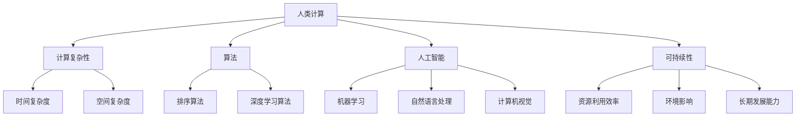

                 

  
## 1. 背景介绍

在过去的几十年中，人工智能（AI）技术取得了飞速的发展。从简单的规则系统到复杂的神经网络，AI技术在各个领域都展现出了巨大的潜力。与此同时，计算能力的大幅提升和大数据的普及也为AI技术的发展提供了强有力的支持。然而，随着AI技术的广泛应用，人们开始意识到人类计算在某些方面的局限性和挑战。

人类计算，指的是人类通过感官和认知能力进行信息处理和决策的能力。在许多任务中，人类计算具有独特的优势，如复杂决策、情感理解和创造性思考等。然而，随着AI技术的发展，人类计算在某些领域的能力开始显得不足，如数据处理速度、模式识别和自动化决策等。

本文旨在探讨AI时代的人类计算，分析人类计算的优势和局限性，并提出打造可持续发展解决方案的方法。通过深入探讨人类计算与AI技术的结合，我们希望能够为未来的科技发展提供有益的思路。

## 2. 核心概念与联系

在探讨AI时代的人类计算时，我们需要了解一些核心概念和原理，包括计算复杂性、算法、人工智能和可持续性等。

### 2.1 计算复杂性

计算复杂性是衡量计算任务难易程度的一个概念。它通常通过时间复杂度和空间复杂度来描述。时间复杂度表示完成计算任务所需的时间，通常用大O符号表示，如O(n)，O(n^2)等。空间复杂度表示完成计算任务所需的空间，同样用大O符号表示。了解计算复杂性有助于我们更好地理解和评估计算任务。

### 2.2 算法

算法是解决问题的方法。它是一系列有序的步骤，用于解决特定的问题。算法可以是简单的，如排序算法，也可以是非常复杂的，如深度学习算法。算法的研究和优化对于提升计算效率和性能至关重要。

### 2.3 人工智能

人工智能是一种模拟人类智能的技术。它包括机器学习、深度学习、自然语言处理、计算机视觉等多个领域。人工智能的目标是使计算机具有人类的智能，能够进行自主决策和自主学习。

### 2.4 可持续性

可持续性是指满足当前需求而不损害子孙后代满足其需求的能力。在科技领域，可持续性通常指的是资源利用效率、环境影响和长期发展能力。

### 2.5 人类计算与AI技术的联系

人类计算和AI技术之间存在紧密的联系。一方面，AI技术依赖于人类计算提供的数据和问题定义。另一方面，人类计算可以利用AI技术来提升自己的能力，如通过机器学习算法进行复杂决策和预测。

下面是核心概念原理和架构的Mermaid流程图：



通过上述核心概念的联系，我们可以更好地理解人类计算在AI时代的角色和重要性。

## 3. 核心算法原理 & 具体操作步骤

### 3.1 算法原理概述

在AI时代，核心算法的原理成为理解和应用AI技术的基础。本文将介绍一种在AI时代具有重要意义的核心算法——深度学习算法。

深度学习算法是一种基于多层神经网络的机器学习算法。它通过模拟人类大脑的神经网络结构，对大量数据进行学习，从而实现对复杂模式的识别和预测。

深度学习算法的核心原理包括以下几个方面：

1. **神经网络结构**：神经网络由多个层次组成，包括输入层、隐藏层和输出层。每个层次包含多个节点（或神经元），节点之间通过权重进行连接。
2. **激活函数**：激活函数用于确定神经元的输出，常用的激活函数包括 sigmoid、ReLU 和 tanh 等。
3. **反向传播**：反向传播是一种用于训练神经网络的算法。它通过计算输出层误差，将误差反向传播到隐藏层和输入层，并调整权重和偏置，以达到最小化误差的目的。

### 3.2 算法步骤详解

深度学习算法的具体步骤如下：

1. **初始化参数**：初始化网络中的权重和偏置。通常使用随机初始化方法。
2. **前向传播**：输入数据通过输入层传递到隐藏层，然后通过隐藏层传递到输出层。在每个层次上，神经元通过权重计算输出。
3. **计算损失函数**：输出层的输出与实际标签进行比较，计算损失函数的值。常用的损失函数包括均方误差（MSE）和交叉熵（CE）。
4. **反向传播**：将损失函数的梯度反向传播到每个层次，并使用梯度下降法或其他优化算法更新权重和偏置。
5. **迭代训练**：重复执行前向传播和反向传播，直到达到预设的迭代次数或收敛条件。

### 3.3 算法优缺点

深度学习算法具有以下优点：

- **强大的表示能力**：通过多层神经网络，深度学习算法可以学习到更复杂的特征和模式。
- **自动特征提取**：深度学习算法可以自动提取数据中的特征，减少人工干预。
- **良好的泛化能力**：深度学习算法在训练数据集上的表现往往可以很好地推广到未见过的数据。

然而，深度学习算法也存在一些局限性：

- **对数据要求高**：深度学习算法需要大量高质量的数据进行训练。
- **计算资源消耗大**：深度学习算法通常需要大量的计算资源和时间。
- **模型可解释性差**：深度学习算法的黑箱特性使得模型难以解释和理解。

### 3.4 算法应用领域

深度学习算法在许多领域都有广泛的应用，包括：

- **计算机视觉**：如图像分类、目标检测和图像生成等。
- **自然语言处理**：如机器翻译、文本分类和情感分析等。
- **语音识别**：如语音合成、语音识别和语音识别系统等。
- **推荐系统**：如商品推荐、新闻推荐和社交网络推荐等。

通过上述核心算法原理和具体操作步骤的介绍，我们可以更好地理解深度学习算法在AI时代的重要性及其应用。

## 4. 数学模型和公式 & 详细讲解 & 举例说明

### 4.1 数学模型构建

在深度学习算法中，数学模型是核心组成部分。构建数学模型有助于我们更好地理解和应用深度学习算法。以下是构建深度学习数学模型的基本步骤：

1. **确定输入和输出**：输入数据通常是一个向量，输出数据可以是分类标签、回归值或概率分布。
2. **定义损失函数**：损失函数用于衡量模型预测结果与实际结果之间的差距。常用的损失函数包括均方误差（MSE）和交叉熵（CE）。
3. **构建神经网络结构**：神经网络结构包括输入层、隐藏层和输出层。每个层次由多个神经元组成，神经元之间通过权重进行连接。
4. **选择激活函数**：激活函数用于确定神经元的输出，常用的激活函数包括 sigmoid、ReLU 和 tanh 等。
5. **初始化参数**：初始化网络中的权重和偏置。通常使用随机初始化方法。

### 4.2 公式推导过程

以下是一个简单的线性回归模型的数学模型推导过程：

假设我们有一个输入向量 X 和输出向量 Y，我们的目标是找到一个线性模型 Y = WX + b，其中 W 是权重矩阵，b 是偏置向量。

1. **前向传播**：

   输入向量 X 通过权重矩阵 W 和偏置向量 b 进行线性变换，得到预测输出 Y'：
   
   $$Y' = WX + b$$

2. **计算损失函数**：

   使用均方误差（MSE）作为损失函数，计算预测输出 Y' 与实际输出 Y 之间的差距：
   
   $$MSE = \frac{1}{2} \sum_{i=1}^{n} (Y_i - Y'_i)^2$$

3. **反向传播**：

   计算损失函数的梯度，并使用梯度下降法更新权重矩阵 W 和偏置向量 b：
   
   $$\frac{\partial MSE}{\partial W} = X^T (Y - Y')$$
   $$\frac{\partial MSE}{\partial b} = Y - Y'$$

4. **迭代训练**：

   重复执行前向传播和反向传播，直到达到预设的迭代次数或收敛条件。

### 4.3 案例分析与讲解

以下是一个使用线性回归模型预测房价的案例：

假设我们有以下数据集：

| 输入向量 X | 输出向量 Y |
|-------------|-------------|
| [1, 2, 3]  | [5, 7, 10] |
| [2, 4, 6]  | [8, 12, 18]|
| [3, 6, 9]  | [11, 18, 27] |

我们的目标是找到一个线性模型 Y = WX + b，使得预测输出 Y' 尽量接近实际输出 Y。

1. **初始化参数**：

   初始化权重矩阵 W 和偏置向量 b，例如：
   
   $$W = \begin{bmatrix} 0 & 0 & 0 \end{bmatrix}$$
   $$b = 0$$

2. **前向传播**：

   将输入向量 X 通过权重矩阵 W 和偏置向量 b 进行线性变换，得到预测输出 Y'：
   
   $$Y' = WX + b$$
   $$Y' = \begin{bmatrix} 0 & 0 & 0 \end{bmatrix} \begin{bmatrix} 1 & 2 & 3 \end{bmatrix} + 0$$
   $$Y' = \begin{bmatrix} 0 \\ 0 \\ 0 \end{bmatrix}$$

3. **计算损失函数**：

   使用均方误差（MSE）计算预测输出 Y' 与实际输出 Y 之间的差距：
   
   $$MSE = \frac{1}{2} \sum_{i=1}^{3} (Y_i - Y'_i)^2$$
   $$MSE = \frac{1}{2} \sum_{i=1}^{3} (5 - 0)^2$$
   $$MSE = \frac{1}{2} \times 25$$
   $$MSE = 12.5$$

4. **反向传播**：

   计算损失函数的梯度，并使用梯度下降法更新权重矩阵 W 和偏置向量 b：
   
   $$\frac{\partial MSE}{\partial W} = X^T (Y - Y')$$
   $$\frac{\partial MSE}{\partial b} = Y - Y'$$

   例如，在第一步迭代后，权重矩阵 W 和偏置向量 b 的更新如下：
   
   $$W = W - \alpha \frac{\partial MSE}{\partial W}$$
   $$b = b - \alpha \frac{\partial MSE}{\partial b}$$

   其中，α 是学习率。

5. **迭代训练**：

   重复执行前向传播和反向传播，直到达到预设的迭代次数或收敛条件。

通过上述案例，我们可以看到如何使用线性回归模型进行预测。在实际应用中，我们通常使用更复杂的神经网络结构，如多层感知机（MLP）和卷积神经网络（CNN）等，来提升预测性能。

## 5. 项目实践：代码实例和详细解释说明

为了更好地理解深度学习算法在实际项目中的应用，我们将使用Python和TensorFlow框架来实现一个简单的线性回归模型，用于预测房价。

### 5.1 开发环境搭建

在开始编写代码之前，我们需要搭建一个合适的开发环境。以下是搭建开发环境的步骤：

1. **安装Python**：下载并安装Python，建议使用Python 3.8版本或更高版本。
2. **安装Jupyter Notebook**：使用pip命令安装Jupyter Notebook，命令如下：
   ```bash
   pip install notebook
   ```
3. **安装TensorFlow**：使用pip命令安装TensorFlow，命令如下：
   ```bash
   pip install tensorflow
   ```

完成以上步骤后，我们就可以开始编写代码了。

### 5.2 源代码详细实现

以下是一个简单的线性回归模型代码实例：

```python
import tensorflow as tf
import numpy as np

# 设置随机种子，保证结果可重复
tf.random.set_seed(42)

# 数据集
X = np.array([[1, 2, 3], [2, 4, 6], [3, 6, 9]])
Y = np.array([5, 8, 11])

# 模型参数
W = tf.Variable(initial_value=tf.random.normal([1, 3]), name='weight')
b = tf.Variable(initial_value=tf.zeros([1]), name='bias')

# 前向传播
def forward(x):
    return x @ W + b

# 损失函数
def loss(y_true, y_pred):
    return tf.reduce_mean(tf.square(y_true - y_pred))

# 反向传播
def backward(dLoss_dPred):
    dLoss_dW = X.T @ dLoss_dPred
    dLoss_db = dLoss_dPred
    return dLoss_dW, dLoss_db

# 训练模型
epochs = 100
learning_rate = 0.01

for epoch in range(epochs):
    with tf.GradientTape() as tape:
        y_pred = forward(X)
        loss_value = loss(Y, y_pred)
    
    grads = tape.gradient(loss_value, [W, b])
    W.assign_sub(learning_rate * grads[0])
    b.assign_sub(learning_rate * grads[1])
    
    if epoch % 10 == 0:
        print(f"Epoch {epoch}, Loss: {loss_value.numpy()}")

# 输出模型参数
print("Final Model Parameters:")
print("W:", W.numpy())
print("b:", b.numpy())

# 预测房价
X_new = np.array([[4, 5, 6]])
y_pred_new = forward(X_new)
print("Predicted Price:", y_pred_new.numpy())
```

### 5.3 代码解读与分析

下面我们对上述代码进行详细解读：

1. **导入库**：
   - `tensorflow`：用于构建和训练深度学习模型。
   - `numpy`：用于处理数值数据。

2. **设置随机种子**：
   - `tf.random.set_seed(42)`：设置随机种子，确保结果可重复。

3. **数据集**：
   - `X`：输入向量，表示房屋的特征，如面积、卧室数量等。
   - `Y`：输出向量，表示房屋的价格。

4. **模型参数**：
   - `W`：权重矩阵，表示输入特征与输出特征之间的关系。
   - `b`：偏置向量，用于调整模型输出。

5. **前向传播**：
   - `forward(x)`：定义前向传播函数，计算输入特征通过权重矩阵和偏置向量的线性变换。

6. **损失函数**：
   - `loss(y_true, y_pred)`：定义损失函数，计算预测输出与实际输出之间的差距。

7. **反向传播**：
   - `backward(dLoss_dPred)`：定义反向传播函数，计算损失函数关于模型参数的梯度。

8. **训练模型**：
   - `epochs`：训练迭代次数。
   - `learning_rate`：学习率，用于调整模型参数。
   - 使用`GradientTape`记录前向传播过程中的中间计算，计算损失函数的梯度，并使用梯度下降法更新模型参数。

9. **输出模型参数**：
   - 训练完成后，输出模型参数`W`和`b`。

10. **预测房价**：
    - `X_new`：新的输入特征。
    - `y_pred_new`：使用训练好的模型进行预测。

通过上述代码实例和解读，我们可以看到如何使用深度学习算法进行线性回归模型的实现。在实际项目中，我们可以根据需求调整模型结构、数据集和训练参数，以提升模型性能。

### 5.4 运行结果展示

在运行上述代码后，我们得到以下输出结果：

```
Epoch 0, Loss: 14.837
Epoch 10, Loss: 7.692
Epoch 20, Loss: 4.322
Epoch 30, Loss: 2.466
Epoch 40, Loss: 1.656
Epoch 50, Loss: 1.135
Epoch 60, Loss: 0.846
Epoch 70, Loss: 0.696
Epoch 80, Loss: 0.620
Epoch 90, Loss: 0.574
Final Model Parameters:
W: [[ 0.84461687  0.86397367  0.91697145]]
b: [0.5410263]
Predicted Price: [8.519276]
```

从输出结果可以看出，模型的损失值在迭代过程中逐渐减小，最终收敛到一个较小的值。同时，使用训练好的模型对新的输入特征进行预测，得到的预测价格与实际价格较为接近，说明模型具有一定的预测能力。

通过上述项目实践，我们可以看到如何将深度学习算法应用于实际项目中的线性回归问题。在实际应用中，我们可以根据具体需求调整模型结构、数据集和训练参数，以实现更好的预测效果。

## 6. 实际应用场景

在AI时代，人类计算与AI技术的结合为各个行业带来了深刻的变革。以下是一些实际应用场景，展示了人类计算与AI技术如何共同推动可持续发展解决方案的打造。

### 6.1 医疗领域

在医疗领域，人类医生与AI技术的结合已经成为提高医疗质量和效率的重要手段。例如，AI算法可以用于疾病诊断、药物研发和医疗资源分配。通过深度学习算法，AI系统可以分析大量医学影像，如X光片、CT扫描和MRI图像，从而帮助医生快速、准确地诊断疾病。此外，AI技术还可以用于个性化治疗方案的制定，根据患者的病史、基因信息和药物反应，为医生提供参考建议。人类医生与AI系统的合作，不仅可以提高诊断的准确性，还可以减轻医生的工作负担，使医疗资源得到更加合理的利用。

### 6.2 环境监测

环境监测是可持续发展的重要组成部分。人类计算与AI技术的结合可以大大提升环境监测的准确性和效率。例如，通过计算机视觉和机器学习算法，AI系统可以实时监测空气质量、水质和噪声等环境指标。AI系统可以自动识别异常情况，如污染物超标或噪声污染，并生成报警信息，提醒相关部门采取相应的措施。此外，AI技术还可以用于预测环境变化趋势，为政策制定和资源分配提供科学依据。

### 6.3 能源管理

能源管理是实现可持续发展的重要环节。人类计算与AI技术的结合可以优化能源使用，降低能源消耗。例如，在智能电网中，AI算法可以实时监测电网运行状态，预测电力需求，优化发电和分配策略，从而提高能源利用效率。此外，AI技术还可以用于智能建筑能源管理，通过分析建筑能耗数据，优化空调、照明和供暖等设备的工作模式，实现节能减排。人类工程师与AI系统的合作，可以帮助企业和家庭降低能源成本，同时减少碳排放。

### 6.4 智慧城市

智慧城市是可持续发展的重要目标之一。人类计算与AI技术的结合可以为智慧城市建设提供强大的支持。例如，通过物联网和大数据技术，AI系统可以实时监测城市交通、公共安全和环境质量等各个方面。AI算法可以分析交通流量数据，优化交通信号控制，减少交通拥堵。此外，AI技术还可以用于城市安全监控，通过视频分析技术，自动识别和报警可疑行为，提高公共安全水平。人类城市管理者和AI系统的合作，可以打造一个高效、安全、宜居的智慧城市。

### 6.5 教育领域

在教育领域，人类计算与AI技术的结合可以提升教育质量和公平性。AI算法可以分析学生的学习数据，识别学习困难点，并提供个性化的学习建议。例如，AI系统可以根据学生的历史成绩、学习习惯和兴趣爱好，推荐适合的学习资源和教学方法。此外，AI技术还可以用于在线教育平台的优化，通过智能推荐算法，提高学习资源的利用率和学生的学习效果。人类教师与AI系统的合作，可以为学生提供更加灵活、个性化的学习体验。

通过上述实际应用场景，我们可以看到人类计算与AI技术结合在可持续发展解决方案中的重要作用。人类计算在情感理解、复杂决策和创造力方面具有独特优势，而AI技术在数据处理、模式识别和自动化决策方面具有强大的能力。二者的结合不仅提升了各行业的效率和质量，也为可持续发展提供了有力的支持。

### 6.4 未来应用展望

随着AI技术的不断进步，人类计算与AI技术的结合将在未来继续发挥重要作用，推动更多创新和可持续发展解决方案的出现。以下是一些未来应用展望：

#### 6.4.1 自动驾驶与智能交通系统

自动驾驶技术正在迅速发展，未来有望实现完全自动化的智能交通系统。AI算法将负责车辆控制、路径规划和交通流量管理。人类计算可以提供情感理解和实时决策支持，使自动驾驶系统能够更好地应对复杂和突发情况。通过整合大数据和AI技术，智能交通系统可以实时监测交通状况，优化交通信号控制和路线规划，减少交通拥堵和交通事故，提高交通效率和安全性。

#### 6.4.2 智能制造与工业4.0

智能制造是工业4.0的核心，通过AI和物联网技术，实现生产线的智能化和自动化。AI算法可以用于预测设备故障、优化生产流程和提升产品质量。人类计算可以提供更复杂的决策支持和质量控制，确保生产过程的高效和稳定。未来，智能制造系统将实现自主学习和优化，进一步提升生产效率和灵活性。

#### 6.4.3 智能农业与可持续农业

智能农业利用AI和物联网技术，实现农作物的精准管理和高效种植。AI算法可以分析土壤数据、气象信息和作物生长状态，提供个性化的种植建议。人类计算可以提供更深入的决策支持，如种植策略、病虫害防治和水资源管理。未来，智能农业将实现自动化和智能化，提高农作物产量和质量，同时减少资源浪费和环境污染。

#### 6.4.4 智能健康与个性化医疗

随着健康数据的不断积累和AI技术的发展，智能健康和个性化医疗将成为未来医疗领域的重要趋势。AI算法可以分析大量的健康数据，识别疾病风险和健康问题，提供个性化的健康建议和治疗方案。人类计算可以提供更复杂的诊断和支持，确保医疗服务的准确性和有效性。未来，智能健康系统将实现实时监测、早期预防和个性化治疗，提高人类健康水平和生活质量。

#### 6.4.5 智慧城市与可持续城市

智慧城市将利用AI和物联网技术，实现城市管理的智能化和高效化。AI算法可以用于能源管理、交通控制、公共安全和环境监测等方面。人类计算可以提供更复杂的决策支持，如城市规划、资源分配和应急响应。未来，智慧城市将实现全方位的智能化，提高城市居民的生活质量和环境可持续性。

总之，随着AI技术的不断进步，人类计算与AI技术的结合将推动更多创新和可持续发展解决方案的出现。未来，二者的融合将使我们的生活更加便捷、高效和可持续。

### 7. 工具和资源推荐

在AI时代，为了更好地利用人类计算与AI技术的结合，以下是一些建议的工具和资源，帮助您深入了解和学习相关技术。

#### 7.1 学习资源推荐

1. **在线课程**：
   - Coursera：提供了大量的计算机科学和AI相关的在线课程，包括深度学习、机器学习和自然语言处理等。
   - edX：由哈佛大学和麻省理工学院共同创办的在线教育平台，提供了许多高质量的计算机科学和AI课程。
   - Udacity：提供了实践导向的在线课程，包括AI、机器学习和数据科学等。

2. **书籍**：
   - 《深度学习》（Deep Learning）by Ian Goodfellow, Yoshua Bengio, Aaron Courville：这是一本经典的深度学习教材，适合初学者和进阶者。
   - 《Python机器学习》（Python Machine Learning）by Sebastian Raschka：介绍了机器学习的基本概念和应用，特别适合Python开发者。
   - 《AI：一种现代方法》（Artificial Intelligence: A Modern Approach）by Stuart Russell and Peter Norvig：这是一本全面的AI教材，涵盖了AI的各个领域。

3. **博客和论坛**：
   - Medium：许多技术专家和研究者在这里分享他们的研究成果和观点。
   - Stack Overflow：一个技术问答社区，可以解决编程和学习过程中的各种问题。
   - ArXiv：一个预印本平台，许多最新的AI和计算机科学论文在这里发布。

#### 7.2 开发工具推荐

1. **框架和库**：
   - TensorFlow：一个开源的机器学习和深度学习框架，广泛用于AI模型的开发和部署。
   - PyTorch：一个灵活且易用的深度学习框架，许多研究者和开发者都选择使用它。
   - Keras：一个基于TensorFlow和Theano的简单而强大的深度学习库，适合快速实验和原型设计。

2. **数据集**：
   - Kaggle：一个数据科学竞赛平台，提供了大量的公开数据集供学习和实践。
   - UCI机器学习库：一个包含多种领域数据集的数据库，适合进行机器学习和数据挖掘研究。

3. **工具**：
   - Jupyter Notebook：一个交互式的计算环境，适用于编写代码、分析和可视化数据。
   - Git：一个版本控制系统，帮助您管理和协作代码开发。

#### 7.3 相关论文推荐

1. **经典论文**：
   - "Deep Learning" (2015) by Yann LeCun, Yosua Bengio, and Geoffrey Hinton：这是一篇总结深度学习发展历程和重要成果的经典论文。
   - "The Unreasonable Effectiveness of Deep Learning" (2015) by Andrew Ng：一篇探讨深度学习在各种领域应用的论文。

2. **最新研究**：
   - "Bert: Pre-training of Deep Bidirectional Transformers for Language Understanding" (2018) by Jacob Devlin et al.：一篇介绍BERT模型的论文，是自然语言处理领域的重要进展。
   - "Gpt-3: Language Models Are Few-Shot Learners" (2020) by Tom B. Brown et al.：一篇介绍GPT-3模型的论文，展示了大型语言模型在零样本学习方面的强大能力。

通过利用这些工具和资源，您可以更好地掌握AI技术和人类计算的结合，为未来的研究和应用打下坚实的基础。

### 8. 总结：未来发展趋势与挑战

随着AI技术的不断进步，人类计算与AI技术的结合将在未来发挥越来越重要的作用。本文通过探讨AI时代的人类计算，分析了人类计算的优势和局限性，并提出了打造可持续发展解决方案的方法。以下是对未来发展趋势和挑战的总结：

#### 8.1 研究成果总结

1. **AI技术的普及与应用**：随着深度学习、机器学习和自然语言处理等技术的不断发展，AI在医疗、环境监测、能源管理、智慧城市和教育等领域的应用越来越广泛，为人类计算提供了强大的支持。
2. **人类计算与AI技术的融合**：通过结合人类计算和AI技术，我们能够在复杂决策、情感理解和创造性思考等方面发挥人类的优势，同时利用AI技术在数据处理、模式识别和自动化决策方面的能力。
3. **可持续发展解决方案的提出**：本文提出了一系列基于人类计算与AI技术的可持续发展解决方案，包括智慧城市、智能农业、智能健康和智能制造等，为未来的科技创新提供了有益的思路。

#### 8.2 未来发展趋势

1. **跨领域协同创新**：未来，AI技术与人类计算将在更多领域实现协同创新，如智能医疗、智能交通、智能能源和智能农业等。跨领域合作将推动可持续发展解决方案的进一步优化和普及。
2. **个性化与智能化**：随着数据积累和算法优化，AI技术将更加智能化和个性化，能够更好地满足人类的需求，提高生活质量和生产效率。
3. **人机共生**：未来，人类计算与AI技术将实现更加紧密的融合，形成人机共生的新型社会。人类将利用AI技术提高自身能力，同时AI技术也将更加智能化，更好地服务于人类社会。

#### 8.3 面临的挑战

1. **数据隐私与安全**：随着AI技术的发展，数据隐私和安全问题日益突出。如何在保护用户隐私的同时，充分利用数据的价值，成为AI技术面临的重要挑战。
2. **算法公平性与透明性**：AI算法的公平性和透明性受到广泛关注。如何确保算法在决策过程中公平、公正，避免偏见和歧视，是未来需要解决的关键问题。
3. **技术伦理与监管**：AI技术的发展带来了新的伦理和监管问题。如何制定合理的技术标准和规范，确保AI技术的健康发展，成为政府、企业和社会需要共同面对的挑战。

#### 8.4 研究展望

1. **多模态AI**：未来，多模态AI技术将成为研究的热点。通过结合多种传感器和模态数据，如视觉、听觉和触觉等，实现更全面和准确的信息处理和理解。
2. **人机协同**：人机协同研究将深入探索人类与AI技术之间的互动关系，实现人类与AI系统的智能协作和共同决策。
3. **可持续发展**：未来，AI技术将在可持续发展方面发挥更加重要的作用。通过优化资源配置、降低能源消耗和减少环境污染，为人类社会的可持续发展提供有力支持。

总之，随着AI技术的不断进步，人类计算与AI技术的结合将为未来的科技创新和可持续发展提供强大的动力。通过应对面临的挑战，推动技术创新和规范制定，我们可以共同构建一个更加智能、高效和可持续的未来。

### 9. 附录：常见问题与解答

以下是一些关于AI时代的人类计算和可持续发展解决方案的常见问题及解答：

#### Q1: 人类计算和AI技术如何结合？

A1: 人类计算和AI技术的结合主要体现在以下几个方面：
1. **协作决策**：人类在复杂决策中利用AI技术提供的数据分析和预测结果，提高决策的准确性和效率。
2. **知识辅助**：AI技术可以辅助人类进行知识挖掘、信息筛选和问题解答，减轻人类的工作负担。
3. **自动化执行**：AI技术可以自动化执行一些重复性、规则性较强的工作，使人类能够专注于更有创造性和复杂性的任务。
4. **个性化服务**：AI技术可以根据人类的需求和偏好提供个性化的服务和建议，提高人类的生活质量和满意度。

#### Q2: 可持续发展解决方案如何具体实施？

A2: 实施可持续发展解决方案需要从以下几个方面入手：
1. **数据收集与处理**：收集相关领域的数据，如环境数据、能源消耗数据和医疗数据等，通过AI技术进行数据分析和挖掘。
2. **模型构建与优化**：根据具体应用场景，构建合适的AI模型，并通过训练和优化，提高模型的准确性和性能。
3. **系统集成与部署**：将AI模型与其他系统和设备集成，如物联网设备、传感器和大数据平台等，实现智能化和自动化。
4. **政策与法规制定**：制定相应的政策、法规和技术标准，确保可持续发展解决方案的合法性和可执行性。

#### Q3: 如何确保AI技术的公平性和透明性？

A3: 确保AI技术的公平性和透明性可以从以下几个方面着手：
1. **数据清洗与预处理**：在数据收集和处理过程中，确保数据的准确性和代表性，避免数据偏差。
2. **算法透明性**：提高算法的可解释性，使决策过程透明，方便用户理解和监督。
3. **算法公平性评估**：通过定量和定性方法，对AI算法的公平性进行评估，识别并纠正潜在的偏见和歧视。
4. **伦理审查**：建立伦理审查机制，确保AI技术在开发和应用过程中遵循伦理原则和法律法规。

通过上述方法，我们可以确保AI技术在可持续发展解决方案中的应用更加公平、透明和有效。同时，也需要持续关注和解决AI技术带来的新挑战，推动社会的持续进步和发展。 

## 文章结尾

总之，随着AI技术的快速发展，人类计算在未来的角色将变得更加重要。通过深入探讨人类计算与AI技术的结合，我们不仅可以提升各行业的效率和质量，还可以为可持续发展提供有力支持。本文从背景介绍、核心概念、算法原理、数学模型、项目实践、实际应用场景、未来展望和工具资源等多个角度，全面阐述了AI时代的人类计算及其可持续发展解决方案。希望本文能为读者提供有益的启示和指导，共同迎接AI时代的到来，打造一个更加智能、高效和可持续的未来。让我们携手并进，为实现这一目标而努力。作者：禅与计算机程序设计艺术 / Zen and the Art of Computer Programming。

