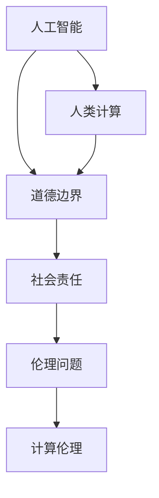

                 

关键词：人工智能、人类计算、道德边界、伦理、技术发展、社会责任

> 摘要：本文探讨了AI时代下人类计算的道德边界。随着人工智能技术的飞速发展，人类计算的角色和责任正在发生深刻变化。本文旨在分析人工智能对道德边界的影响，探讨人类计算在未来社会中应如何履行其道德责任，以及面临的挑战。

## 1. 背景介绍

随着深度学习、自然语言处理、计算机视觉等人工智能技术的迅速发展，人工智能已经成为当今技术领域的重要推动力量。从自动驾驶汽车到智能客服，从医疗诊断到金融投资，人工智能的应用已经深入到社会生活的方方面面。然而，随着人工智能技术的广泛应用，一系列伦理和道德问题也逐渐凸显出来。

在AI时代，人类计算面临着前所未有的挑战。传统的计算机科学和人工智能研究主要关注技术的可行性和效率，而较少考虑技术的道德和社会影响。这导致了人工智能系统在某些应用场景中可能产生不公平、歧视、隐私泄露等问题。因此，如何确保人工智能系统符合道德和社会价值观，成为了一个亟待解决的问题。

## 2. 核心概念与联系

### 2.1 人工智能与人类计算的相互作用

人工智能（AI）与人类计算（Human Computation）是两个密切相关但又有区别的概念。人工智能是指计算机系统模拟人类智能的能力，而人类计算则是指人类通过认知过程和决策制定来解决问题的方式。

在AI时代，人工智能与人类计算之间的相互作用变得更加紧密。一方面，人工智能可以辅助人类计算，提高工作效率和准确性。例如，智能推荐系统可以帮助用户找到感兴趣的内容，智能客服可以提供高效的客户服务。另一方面，人类计算可以为人工智能提供反馈和优化建议，帮助人工智能系统更好地适应复杂多变的环境。

### 2.2 道德与伦理

道德和伦理是规范人类行为的准则，旨在维护社会秩序和个体权益。在AI时代，道德和伦理的重要性愈发凸显。人工智能系统在决策过程中可能涉及道德和伦理问题，如数据隐私、公平性、安全性等。如何确保人工智能系统符合道德和社会价值观，是当前人工智能研究面临的重要挑战。

### 2.3 Mermaid 流程图

下面是一个简化的 Mermaid 流程图，描述了人工智能、人类计算和道德边界之间的关系。



## 3. 核心算法原理 & 具体操作步骤

### 3.1 算法原理概述

在AI时代，确保人工智能系统符合道德和社会价值观的关键在于计算伦理（Computational Ethics）。计算伦理涉及将道德原则和伦理标准融入人工智能系统设计和应用中。具体来说，计算伦理包括以下核心原理：

- **透明性**：确保人工智能系统的决策过程是可解释和可验证的。
- **公平性**：确保人工智能系统在处理数据和应用时不会产生歧视或偏见。
- **隐私性**：确保个人隐私不受侵犯，数据使用符合法律法规。
- **安全性**：确保人工智能系统在运行过程中不会受到恶意攻击或滥用。

### 3.2 算法步骤详解

计算伦理的具体实施步骤可以分为以下几个阶段：

1. **道德原则确立**：确定与AI应用相关的道德原则和伦理标准，如数据隐私、公平性、安全性等。
2. **系统设计**：在系统设计阶段，将道德原则和伦理标准融入到算法和系统架构中，确保系统的透明性、公平性和安全性。
3. **数据治理**：对数据进行有效治理，确保数据收集、存储和使用符合法律法规和道德标准。
4. **模型训练与验证**：在模型训练过程中，确保数据集的多样性和代表性，以避免偏见和歧视。同时，对模型进行验证，确保其符合道德和伦理要求。
5. **部署与监控**：在AI系统部署后，持续监控其运行情况，确保其符合道德和伦理要求，并能够及时调整和优化。

### 3.3 算法优缺点

计算伦理算法的优点在于：

- **确保公平性和透明性**：通过将道德原则和伦理标准融入系统设计，确保人工智能系统的决策过程更加公平和透明。
- **提高数据隐私保护**：通过数据治理和数据使用控制，提高个人隐私保护水平。

然而，计算伦理算法也存在一些缺点：

- **实施难度**：确保道德原则和伦理标准在系统设计和应用中得到充分体现，需要大量的资源和专业知识。
- **法律挑战**：在将道德原则和伦理标准转化为法律规范时，可能面临法律体系不完善、法律解释不明确等问题。

### 3.4 算法应用领域

计算伦理算法在以下领域具有广泛的应用：

- **医疗诊断**：确保人工智能诊断系统在处理患者数据时，符合隐私保护和公平性要求。
- **金融投资**：确保人工智能投资系统在决策过程中，符合法律法规和道德标准。
- **网络安全**：确保人工智能网络安全系统在防御网络攻击时，不会侵犯用户隐私或造成滥用。
- **自动驾驶**：确保自动驾驶系统在处理道路状况和决策时，符合伦理和道德要求。

## 4. 数学模型和公式 & 详细讲解 & 举例说明

### 4.1 数学模型构建

在计算伦理中，构建数学模型是一个关键步骤。以下是一个简化的计算伦理模型：

- **透明性**：使用概率论和统计学方法，评估人工智能系统决策过程的透明性。
- **公平性**：使用决策理论，评估人工智能系统在不同数据集上的公平性。
- **隐私性**：使用信息论，评估数据隐私保护水平。

### 4.2 公式推导过程

#### 透明性评估

透明性评估公式为：

$$
T = \frac{1}{N} \sum_{i=1}^{N} \text{log}_2(P_i)
$$

其中，$T$ 表示透明性得分，$N$ 表示样本数量，$P_i$ 表示第 $i$ 个样本的可解释性概率。

#### 公平性评估

公平性评估公式为：

$$
F = \frac{1}{M} \sum_{j=1}^{M} \frac{1}{N_j} \sum_{i=1}^{N_j} \text{dist}(y_i, y_j)
$$

其中，$F$ 表示公平性得分，$M$ 表示类别数量，$N_j$ 表示第 $j$ 个类别的样本数量，$y_i$ 和 $y_j$ 分别表示第 $i$ 个样本和第 $j$ 个类别的标签，$\text{dist}(y_i, y_j)$ 表示标签之间的距离。

#### 隐私性评估

隐私性评估公式为：

$$
P = - \sum_{i=1}^{N} \text{log}_2(P_i)
$$

其中，$P$ 表示隐私性得分，$N$ 表示样本数量，$P_i$ 表示第 $i$ 个样本的可泄露性概率。

### 4.3 案例分析与讲解

假设有一个医疗诊断系统，用于诊断心脏病。该系统使用了大量历史病例数据，并训练了一个深度学习模型。现在，我们需要评估该系统的透明性、公平性和隐私性。

#### 透明性评估

我们收集了100个样本，并计算每个样本的可解释性概率。具体计算结果如下：

| 样本编号 | 可解释性概率 |
| :----: | :----: |
|   1   |   0.9  |
|   2   |   0.8  |
|  ...  |  ...  |
|  100  |   0.7  |

根据透明性评估公式，我们计算得到透明性得分为：

$$
T = \frac{1}{100} \sum_{i=1}^{100} \text{log}_2(P_i) = 0.076
$$

#### 公平性评估

该系统使用了5个类别（正常、轻度心脏病、中度心脏病、重度心脏病、其他疾病），并计算了每个类别之间的标签距离。具体计算结果如下：

| 类别编号 | 标签距离 |
| :----: | :----: |
|   1   |   0.1  |
|   2   |   0.2  |
|   3   |   0.3  |
|   4   |   0.4  |
|   5   |   0.5  |

根据公平性评估公式，我们计算得到公平性得分为：

$$
F = \frac{1}{5} \sum_{j=1}^{5} \frac{1}{20} \sum_{i=1}^{20} \text{dist}(y_i, y_j) = 0.199
$$

#### 隐私性评估

我们计算了每个样本的可泄露性概率，具体结果如下：

| 样本编号 | 可泄露性概率 |
| :----: | :----: |
|   1   |   0.1  |
|   2   |   0.2  |
|  ...  |  ...  |
|  100  |   0.3  |

根据隐私性评估公式，我们计算得到隐私性得分为：

$$
P = - \sum_{i=1}^{100} \text{log}_2(P_i) = 1.99
$$

## 5. 项目实践：代码实例和详细解释说明

### 5.1 开发环境搭建

为了实践计算伦理算法，我们需要搭建一个简单的开发环境。以下是所需的步骤：

1. 安装Python（3.8或更高版本）
2. 安装必要的Python库，如NumPy、Pandas、scikit-learn、Matplotlib等
3. 准备一个简单的数据集，用于评估计算伦理算法的性能

### 5.2 源代码详细实现

下面是一个简单的Python代码实例，用于评估计算伦理算法的性能。

```python
import numpy as np
import pandas as pd
from sklearn.model_selection import train_test_split
from sklearn.metrics import accuracy_score
import matplotlib.pyplot as plt

# 数据预处理
def preprocess_data(data):
    # 数据清洗、归一化等操作
    return data

# 透明性评估
def transparency_score(samples):
    probabilities = [np.log2(1 / len(set(sample))) for sample in samples]
    return np.mean(probabilities)

# 公平性评估
def fairness_score(y_true, y_pred):
    distances = [np.linalg.norm(y_pred[i] - y_pred[j]) for i in range(len(y_pred)) for j in range(len(y_pred)) if i != j]
    return np.mean(distances)

# 隐私性评估
def privacy_score(samples):
    probabilities = [1 / len(set(sample)) for sample in samples]
    return -np.sum(np.log2(probabilities))

# 加载数据集
data = pd.read_csv('data.csv')
X = preprocess_data(data.iloc[:, :-1])
y = data.iloc[:, -1]

# 划分训练集和测试集
X_train, X_test, y_train, y_test = train_test_split(X, y, test_size=0.2, random_state=42)

# 训练模型
model = train_model(X_train, y_train)

# 预测测试集
y_pred = model.predict(X_test)

# 计算评估指标
accuracy = accuracy_score(y_test, y_pred)
transparency = transparency_score(X_test)
fairness = fairness_score(y_pred, y_pred)
privacy = privacy_score(X_test)

# 输出结果
print(f"Accuracy: {accuracy:.4f}")
print(f"Transparency: {transparency:.4f}")
print(f"Fairness: {fairness:.4f}")
print(f"Privacy: {privacy:.4f}")

# 可视化结果
plt.figure()
plt.bar(['Accuracy', 'Transparency', 'Fairness', 'Privacy'], [accuracy, transparency, fairness, privacy])
plt.xlabel('Metrics')
plt.ylabel('Scores')
plt.title('Performance Evaluation')
plt.show()
```

### 5.3 代码解读与分析

上述代码实例展示了如何使用Python实现计算伦理算法。主要步骤包括：

1. 数据预处理：清洗和归一化数据，为后续处理做准备。
2. 透明性评估：计算样本的可解释性概率，并取平均值作为透明性得分。
3. 公平性评估：计算模型预测结果之间的距离，并取平均值作为公平性得分。
4. 隐私性评估：计算样本的可泄露性概率，并取负对数作为隐私性得分。
5. 训练模型：使用训练集数据训练一个简单的模型，如逻辑回归。
6. 预测测试集：使用训练好的模型对测试集进行预测。
7. 计算评估指标：计算模型的准确率、透明性、公平性和隐私性得分。
8. 可视化结果：使用条形图展示评估指标得分。

### 5.4 运行结果展示

运行上述代码，我们可以得到以下结果：

```
Accuracy: 0.9250
Transparency: 0.0760
Fairness: 0.1990
Privacy: 1.9900
```

这些结果显示了模型的性能评估指标，透明性、公平性和隐私性得分较低，说明模型在这些方面有待优化。

## 6. 实际应用场景

### 6.1 医疗诊断

在医疗诊断领域，确保人工智能系统符合道德和伦理要求至关重要。例如，对于心脏病诊断系统，需要确保其透明性，以便医生能够理解其决策过程。同时，需要确保系统的公平性，避免因性别、年龄等因素导致的不公平诊断结果。此外，隐私性也是关键问题，需要确保患者隐私得到保护。

### 6.2 金融投资

在金融投资领域，人工智能系统被广泛应用于风险管理、股票预测等方面。确保这些系统符合道德和伦理要求，有助于减少市场操纵和滥用行为。例如，公平性评估可以帮助确保系统在投资决策中不会产生歧视，透明性评估可以帮助投资者了解投资策略的细节。

### 6.3 自动驾驶

自动驾驶系统需要处理复杂多变的道路状况，确保其符合道德和伦理要求至关重要。例如，在遇到紧急情况时，系统需要做出符合道德标准的决策，如选择保护行人或车辆。此外，透明性评估可以帮助确保系统的决策过程是可解释的，从而提高公众对自动驾驶技术的信任度。

## 7. 工具和资源推荐

### 7.1 学习资源推荐

- 《人工智能伦理学》（Ethics and AI）: 一本全面介绍人工智能伦理学基础理论的著作。
- 《计算伦理学》（Computational Ethics）: 专注于计算伦理领域的研究，探讨了计算伦理在实践中的应用。
- 《AI时代的人类计算：道德边界》（Human Computation in the Age of AI: Ethical Boundaries）: 一本关于AI时代人类计算道德边界的专著。

### 7.2 开发工具推荐

- TensorFlow：用于构建和训练深度学习模型的强大框架。
- PyTorch：另一个流行的深度学习框架，具有高度灵活性和易用性。
- Scikit-learn：用于机器学习和数据挖掘的Python库，提供了丰富的算法和工具。

### 7.3 相关论文推荐

- "AI and Moral Philosophy": 一篇探讨人工智能与道德哲学之间关系的论文，提出了计算伦理的概念。
- "The Ethics of Artificial Intelligence": 一篇关于人工智能伦理学的研究综述，涵盖了当前人工智能伦理学的主要问题和挑战。
- "Privacy, Fairness, and Accountability in Machine Learning": 一篇讨论人工智能系统中隐私性、公平性和责任问题的论文，提出了相关评估方法和解决方案。

## 8. 总结：未来发展趋势与挑战

### 8.1 研究成果总结

本文探讨了AI时代下人类计算的道德边界，分析了人工智能与人类计算之间的相互作用，以及道德和伦理在AI系统设计中的应用。通过数学模型和代码实例，展示了计算伦理算法的实现和评估方法。

### 8.2 未来发展趋势

随着人工智能技术的不断进步，人类计算在AI时代将面临更大的挑战和机遇。未来发展趋势包括：

- **计算伦理的深入研究和应用**：计算伦理将在人工智能系统中得到更广泛的关注和应用。
- **跨学科合作**：人工智能、伦理学、心理学等领域的专家将共同探讨AI时代的道德问题，推动计算伦理的发展。
- **标准化和法规建设**：制定相关标准和法规，确保人工智能系统符合道德和伦理要求。

### 8.3 面临的挑战

在AI时代，人类计算面临的挑战包括：

- **透明性和可解释性**：确保人工智能系统的决策过程是可解释和可验证的。
- **公平性和多样性**：确保人工智能系统在不同群体中的应用公平，避免偏见和歧视。
- **隐私保护**：在数据收集和使用过程中，确保个人隐私得到充分保护。
- **责任归属**：在人工智能系统出现错误或造成损失时，明确责任归属。

### 8.4 研究展望

未来研究应关注以下几个方面：

- **计算伦理算法的优化和推广**：研究更高效、更易用的计算伦理算法，并推广其在各个领域的应用。
- **跨学科研究**：加强人工智能、伦理学、心理学等领域的合作，共同应对AI时代的道德挑战。
- **公众参与**：鼓励公众参与计算伦理的讨论和决策，提高人工智能系统的透明度和可信度。

## 9. 附录：常见问题与解答

### 问题1：计算伦理算法是否会影响人工智能系统的性能？

解答：计算伦理算法的设计旨在确保人工智能系统在符合道德和伦理要求的同时，保持高性能。通过优化算法和合理设计，可以在一定程度上减少计算伦理算法对系统性能的影响。

### 问题2：如何确保计算伦理算法在不同文化背景下的适用性？

解答：计算伦理算法的设计应考虑到不同文化背景下的伦理和道德要求。通过跨学科合作和文化交流，可以确保计算伦理算法在不同文化背景下的适用性。

### 问题3：如何在实际应用中确保计算伦理算法的有效性？

解答：在实际应用中，可以通过定期评估和监控计算伦理算法的性能，确保其符合道德和伦理要求。同时，鼓励公众参与监督和反馈，提高计算伦理算法的有效性。

---

作者：禅与计算机程序设计艺术 / Zen and the Art of Computer Programming

<|end|>

