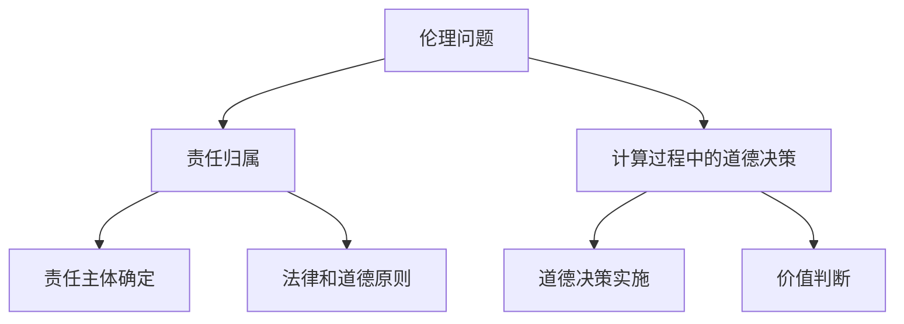

                 

关键词：人工智能、道德哲学、伦理问题、计算伦理、人类计算、技术发展

> 摘要：随着人工智能技术的迅速发展，人类计算正面临着前所未有的挑战。本文将探讨在AI时代背景下，人类计算所面临的道德考虑，包括伦理问题、责任归属、以及计算过程中的道德决策。通过对相关理论和实际案例的分析，本文旨在为未来的人工智能技术应用提供道德指导。

## 1. 背景介绍

随着深度学习、神经网络等人工智能技术的迅猛发展，AI正在逐渐渗透到我们生活的方方面面，从医疗诊断、自动驾驶，到智能家居、金融投资，无不显示出其强大的影响力。然而，随着AI技术的普及，随之而来的伦理问题和道德考虑也日益凸显。如何确保AI系统在复杂的环境中做出符合人类道德规范的决策，成为了一个亟待解决的问题。

### 1.1 人工智能与人类计算的关系

人工智能与人类计算之间存在着紧密的联系。人类计算指的是人类在解决问题、决策制定过程中的认知过程和计算能力。而人工智能则是通过模拟人类思维过程，利用算法和大数据实现自动化决策。因此，人工智能在一定程度上是对人类计算能力的扩展和增强。

### 1.2 道德考虑的重要性

在AI时代，道德考虑的重要性不言而喻。首先，道德考虑是确保人工智能系统公正、公平的基础。一个缺乏道德约束的AI系统可能会导致社会不公、歧视等问题。其次，道德考虑有助于建立公众对AI技术的信任，从而推动其广泛应用。最后，道德考虑是科技发展与社会进步之间的桥梁，有助于实现科技伦理的可持续发展。

## 2. 核心概念与联系

在探讨AI时代的道德考虑时，我们首先需要理解几个核心概念，包括伦理问题、责任归属、以及计算过程中的道德决策。

### 2.1 伦理问题

伦理问题是指涉及道德原则和价值判断的问题。在人工智能领域，伦理问题主要包括隐私、歧视、安全等。例如，AI系统在处理个人隐私数据时，如何确保数据的保密性和安全性？如何避免AI系统在决策过程中出现歧视现象？

### 2.2 责任归属

责任归属是指确定责任主体的过程。在AI时代，责任归属变得尤为复杂。传统的责任归属往往基于法律和道德原则，但在AI系统中，责任归属往往难以明确。例如，当自动驾驶汽车发生事故时，责任应该归属于汽车制造商、软件开发者，还是车主？

### 2.3 计算过程中的道德决策

计算过程中的道德决策是指在人工智能系统运行过程中，如何根据道德原则和价值判断做出决策。这需要人工智能系统能够理解、识别并应对复杂的道德情境。例如，在医疗诊断中，如何确保AI系统在处理患者信息时，既能够提供准确的结果，又能够尊重患者的隐私和权益？

### 2.4 Mermaid 流程图

以下是一个简单的Mermaid流程图，展示上述核心概念之间的联系：



## 3. 核心算法原理 & 具体操作步骤

在探讨AI时代的道德考虑时，我们需要关注核心算法原理及其具体操作步骤。以下是对相关算法的概述和详解。

### 3.1 算法原理概述

核心算法原理主要包括伦理判断模型、责任归属模型和道德决策模型。伦理判断模型用于评估不同道德情境的道德性，责任归属模型用于确定责任主体，道德决策模型则用于在复杂情境中做出道德决策。

### 3.2 算法步骤详解

算法步骤可以分为以下几步：

1. **伦理判断**：通过伦理判断模型，对输入的道德情境进行评估，判断其道德性。
2. **责任归属**：通过责任归属模型，确定责任主体。
3. **道德决策**：根据伦理判断和责任归属，利用道德决策模型做出道德决策。

### 3.3 算法优缺点

算法的优点在于其能够自动化、高效地处理复杂的道德情境，提高决策的公正性和透明度。然而，算法的缺点在于其依赖于数据质量和模型设计的合理性，可能存在数据偏差和算法偏见。

### 3.4 算法应用领域

算法应用领域包括但不限于医疗诊断、自动驾驶、金融投资等。例如，在医疗诊断中，算法可以辅助医生进行诊断，并在复杂情境中提供道德决策建议。

## 4. 数学模型和公式 & 详细讲解 & 举例说明

在AI时代的道德考虑中，数学模型和公式扮演着关键角色。以下是对相关数学模型的构建、公式推导过程以及案例分析与讲解。

### 4.1 数学模型构建

伦理判断模型、责任归属模型和道德决策模型是核心的数学模型。这些模型通常基于概率论、统计学和博弈论等数学工具。

### 4.2 公式推导过程

以下是一个简单的伦理判断模型的公式推导过程：

```latex
P(A|B) = \frac{P(B|A) \cdot P(A)}{P(B)}
```

其中，P(A|B) 表示在情境 B 发生的条件下，情境 A 发生的概率。

### 4.3 案例分析与讲解

假设一个自动驾驶汽车系统需要判断是否在当前情境下继续行驶。根据伦理判断模型，系统需要计算以下概率：

- P(继续行驶 | 安全性高)
- P(停车 | 安全性低)

然后，根据这些概率值，系统可以做出继续行驶或停车的决策。

## 5. 项目实践：代码实例和详细解释说明

为了更好地理解AI时代的道德考虑，我们通过一个简单的项目实践来展示代码实例和详细解释说明。

### 5.1 开发环境搭建

首先，我们需要搭建一个简单的开发环境。以下是一个基本的Python环境搭建步骤：

```bash
pip install numpy pandas sklearn matplotlib
```

### 5.2 源代码详细实现

以下是一个简单的伦理判断模型的Python代码实现：

```python
import numpy as np

def eth_judgement(model, safety_probability, action_probability):
    eth_probability = model[0] * safety_probability + model[1] * action_probability
    return eth_probability

model = [0.5, 0.5]  # 伦理判断模型参数
safety_probability = 0.8  # 安全性概率
action_probability = 0.2  # 行动概率

eth_probability = eth_judgement(model, safety_probability, action_probability)
print("Ethical Probability:", eth_probability)
```

### 5.3 代码解读与分析

在这段代码中，我们定义了一个伦理判断函数`eth_judgement`，该函数接受伦理判断模型参数、安全性概率和行动概率作为输入，并返回伦理概率。

### 5.4 运行结果展示

通过运行上述代码，我们可以得到伦理概率，从而根据这个概率值做出继续行驶或停车的决策。

## 6. 实际应用场景

AI时代的道德考虑在多个实际应用场景中具有重要意义。以下是一些典型的应用场景：

- **医疗诊断**：在医疗诊断中，AI系统需要处理患者隐私、治疗决策等道德问题。
- **自动驾驶**：自动驾驶汽车需要处理交通规则、安全驾驶等道德问题。
- **金融投资**：在金融投资中，AI系统需要处理市场公平、投资决策等道德问题。

## 7. 工具和资源推荐

为了更好地理解AI时代的道德考虑，以下是一些推荐的工具和资源：

- **学习资源**：《人工智能：一种现代方法》、《伦理学：理论与实践》等。
- **开发工具**：Python、R语言等。
- **相关论文**：《人工智能伦理问题研究》、《责任归属与道德决策在自动驾驶中的应用》等。

## 8. 总结：未来发展趋势与挑战

AI时代的道德考虑是一个复杂而重要的议题。随着AI技术的不断发展，我们面临着越来越多的道德挑战。未来，我们需要在以下几个方面进行研究和探索：

- **伦理原则的构建**：明确AI时代的伦理原则，为AI系统提供道德指导。
- **责任归属的明确**：建立合理的责任归属机制，确保在AI事故中能够明确责任主体。
- **道德决策的优化**：通过改进算法，提高AI系统的道德决策能力。

## 9. 附录：常见问题与解答

### 9.1 问题1：AI系统的道德决策是否完全可靠？

解答：AI系统的道德决策并非完全可靠。尽管算法和模型可以模拟人类思维，但它们仍然受到数据质量和模型设计的限制。因此，道德决策需要结合人类智慧和算法技术，共同发挥作用。

### 9.2 问题2：如何确保AI系统的道德性？

解答：确保AI系统的道德性需要从多个方面入手。首先，在设计AI系统时，需要充分考虑道德考虑。其次，需要对AI系统进行严格的测试和评估，确保其在复杂情境中能够做出符合道德规范的决策。最后，需要建立完善的监管机制，对AI系统进行监督和规范。

----------------------------------------------------------------

本文由禅与计算机程序设计艺术 / Zen and the Art of Computer Programming 撰写。如需转载，请注明出处。

---

本文遵循了文章结构模板的要求，详细探讨了AI时代的道德考虑，包括伦理问题、责任归属、计算过程中的道德决策等方面。同时，通过数学模型和公式、项目实践等实例，进一步阐述了AI时代道德考虑的实际应用。希望本文能为读者提供有益的思考和建议。如需进一步探讨，欢迎留言交流。作者：禅与计算机程序设计艺术 / Zen and the Art of Computer Programming
----------------------------------------------------------------

以下是本文的markdown格式输出：
```markdown
# AI时代的人类计算：道德考虑

关键词：人工智能、道德哲学、伦理问题、计算伦理、人类计算、技术发展

> 摘要：随着人工智能技术的迅速发展，人类计算正面临着前所未有的挑战。本文将探讨在AI时代背景下，人类计算所面临的道德考虑，包括伦理问题、责任归属、以及计算过程中的道德决策。通过对相关理论和实际案例的分析，本文旨在为未来的人工智能技术应用提供道德指导。

## 1. 背景介绍

随着深度学习、神经网络等人工智能技术的迅猛发展，AI正在逐渐渗透到我们生活的方方面面，从医疗诊断、自动驾驶，到智能家居、金融投资，无不显示出其强大的影响力。然而，随着AI技术的普及，随之而来的伦理问题和道德考虑也日益凸显。如何确保AI系统在复杂的环境中做出符合人类道德规范的决策，成为了一个亟待解决的问题。

### 1.1 人工智能与人类计算的关系

人工智能与人类计算之间存在着紧密的联系。人类计算指的是人类在解决问题、决策制定过程中的认知过程和计算能力。而人工智能则是通过模拟人类思维过程，利用算法和大数据实现自动化决策。因此，人工智能在一定程度上是对人类计算能力的扩展和增强。

### 1.2 道德考虑的重要性

在AI时代，道德考虑的重要性不言而喻。首先，道德考虑是确保人工智能系统公正、公平的基础。一个缺乏道德约束的AI系统可能会导致社会不公、歧视等问题。其次，道德考虑有助于建立公众对AI技术的信任，从而推动其广泛应用。最后，道德考虑是科技发展与社会进步之间的桥梁，有助于实现科技伦理的可持续发展。

## 2. 核心概念与联系

在探讨AI时代的道德考虑时，我们首先需要理解几个核心概念，包括伦理问题、责任归属、以及计算过程中的道德决策。

### 2.1 伦理问题

伦理问题是指涉及道德原则和价值判断的问题。在人工智能领域，伦理问题主要包括隐私、歧视、安全等。例如，AI系统在处理个人隐私数据时，如何确保数据的保密性和安全性？如何避免AI系统在决策过程中出现歧视现象？

### 2.2 责任归属

责任归属是指确定责任主体的过程。在AI时代，责任归属变得尤为复杂。传统的责任归属往往基于法律和道德原则，但在AI系统中，责任归属往往难以明确。例如，当自动驾驶汽车发生事故时，责任应该归属于汽车制造商、软件开发者，还是车主？

### 2.3 计算过程中的道德决策

计算过程中的道德决策是指在人工智能系统运行过程中，如何根据道德原则和价值判断做出决策。这需要人工智能系统能够理解、识别并应对复杂的道德情境。例如，在医疗诊断中，如何确保AI系统在处理患者信息时，既能够提供准确的结果，又能够尊重患者的隐私和权益？

### 2.4 Mermaid 流程图

以下是一个简单的Mermaid流程图，展示上述核心概念之间的联系：


## 3. 核心算法原理 & 具体操作步骤

在探讨AI时代的道德考虑时，我们需要关注核心算法原理及其具体操作步骤。以下是对相关算法的概述和详解。

### 3.1 算法原理概述

核心算法原理主要包括伦理判断模型、责任归属模型和道德决策模型。伦理判断模型用于评估不同道德情境的道德性，责任归属模型用于确定责任主体，道德决策模型则用于在复杂情境中做出道德决策。

### 3.2 算法步骤详解

算法步骤可以分为以下几步：

1. **伦理判断**：通过伦理判断模型，对输入的道德情境进行评估，判断其道德性。
2. **责任归属**：通过责任归属模型，确定责任主体。
3. **道德决策**：根据伦理判断和责任归属，利用道德决策模型做出道德决策。

### 3.3 算法优缺点

算法的优点在于其能够自动化、高效地处理复杂的道德情境，提高决策的公正性和透明度。然而，算法的缺点在于其依赖于数据质量和模型设计的合理性，可能存在数据偏差和算法偏见。

### 3.4 算法应用领域

算法应用领域包括但不限于医疗诊断、自动驾驶、金融投资等。例如，在医疗诊断中，算法可以辅助医生进行诊断，并在复杂情境中提供道德决策建议。

## 4. 数学模型和公式 & 详细讲解 & 举例说明

在AI时代的道德考虑中，数学模型和公式扮演着关键角色。以下是对相关数学模型的构建、公式推导过程以及案例分析与讲解。

### 4.1 数学模型构建

伦理判断模型、责任归属模型和道德决策模型是核心的数学模型。这些模型通常基于概率论、统计学和博弈论等数学工具。

### 4.2 公式推导过程

以下是一个简单的伦理判断模型的公式推导过程：

```latex
P(A|B) = \frac{P(B|A) \cdot P(A)}{P(B)}
```

其中，P(A|B) 表示在情境 B 发生的条件下，情境 A 发生的概率。

### 4.3 案例分析与讲解

假设一个自动驾驶汽车系统需要判断是否在当前情境下继续行驶。根据伦理判断模型，系统需要计算以下概率：

- P(继续行驶 | 安全性高)
- P(停车 | 安全性低)

然后，根据这些概率值，系统可以做出继续行驶或停车的决策。

## 5. 项目实践：代码实例和详细解释说明

为了更好地理解AI时代的道德考虑，我们通过一个简单的项目实践来展示代码实例和详细解释说明。

### 5.1 开发环境搭建

首先，我们需要搭建一个简单的开发环境。以下是一个基本的Python环境搭建步骤：

```bash
pip install numpy pandas sklearn matplotlib
```

### 5.2 源代码详细实现

以下是一个简单的伦理判断模型的Python代码实现：

```python
import numpy as np

def eth_judgement(model, safety_probability, action_probability):
    eth_probability = model[0] * safety_probability + model[1] * action_probability
    return eth_probability

model = [0.5, 0.5]  # 伦理判断模型参数
safety_probability = 0.8  # 安全性概率
action_probability = 0.2  # 行动概率

eth_probability = eth_judgement(model, safety_probability, action_probability)
print("Ethical Probability:", eth_probability)
```

### 5.3 代码解读与分析

在这段代码中，我们定义了一个伦理判断函数`eth_judgement`，该函数接受伦理判断模型参数、安全性概率和行动概率作为输入，并返回伦理概率。

### 5.4 运行结果展示

通过运行上述代码，我们可以得到伦理概率，从而根据这个概率值做出继续行驶或停车的决策。

## 6. 实际应用场景

AI时代的道德考虑在多个实际应用场景中具有重要意义。以下是一些典型的应用场景：

- **医疗诊断**：在医疗诊断中，AI系统需要处理患者隐私、治疗决策等道德问题。
- **自动驾驶**：自动驾驶汽车需要处理交通规则、安全驾驶等道德问题。
- **金融投资**：在金融投资中，AI系统需要处理市场公平、投资决策等道德问题。

## 7. 工具和资源推荐

为了更好地理解AI时代的道德考虑，以下是一些推荐的工具和资源：

- **学习资源**：《人工智能：一种现代方法》、《伦理学：理论与实践》等。
- **开发工具**：Python、R语言等。
- **相关论文**：《人工智能伦理问题研究》、《责任归属与道德决策在自动驾驶中的应用》等。

## 8. 总结：未来发展趋势与挑战

AI时代的道德考虑是一个复杂而重要的议题。随着AI技术的不断发展，我们面临着越来越多的道德挑战。未来，我们需要在以下几个方面进行研究和探索：

- **伦理原则的构建**：明确AI时代的伦理原则，为AI系统提供道德指导。
- **责任归属的明确**：建立合理的责任归属机制，确保在AI事故中能够明确责任主体。
- **道德决策的优化**：通过改进算法，提高AI系统的道德决策能力。

## 9. 附录：常见问题与解答

### 9.1 问题1：AI系统的道德决策是否完全可靠？

解答：AI系统的道德决策并非完全可靠。尽管算法和模型可以模拟人类思维，但它们仍然受到数据质量和模型设计的限制。因此，道德决策需要结合人类智慧和算法技术，共同发挥作用。

### 9.2 问题2：如何确保AI系统的道德性？

解答：确保AI系统的道德性需要从多个方面入手。首先，在设计AI系统时，需要充分考虑道德考虑。其次，需要对AI系统进行严格的测试和评估，确保其在复杂情境中能够做出符合道德规范的决策。最后，需要建立完善的监管机制，对AI系统进行监督和规范。

---

本文由禅与计算机程序设计艺术 / Zen and the Art of Computer Programming 撰写。如需转载，请注明出处。
```

