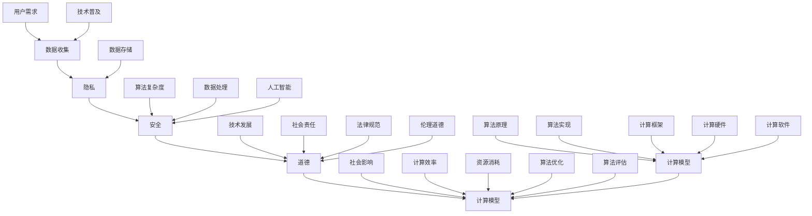

                 

关键词：人工智能，隐私保护，安全，道德，计算模型，算法，技术发展

> 摘要：随着人工智能（AI）技术的快速发展，人类计算正面临着前所未有的变革。然而，这一变革不仅带来了巨大机遇，也引发了隐私、安全和道德等方面的深刻挑战。本文将深入探讨AI时代的人类计算，分析其面临的隐私、安全和道德问题，并探讨未来发展的趋势与挑战。

## 1. 背景介绍

在过去的几十年中，人工智能技术经历了飞速的发展。从最初的简单规则系统到现代的深度学习模型，AI已经在各个领域取得了显著的成果。然而，随着AI技术的广泛应用，人类计算也面临着新的挑战。其中，隐私、安全和道德问题尤为突出。

首先，随着数据量的爆炸式增长，如何保护用户隐私成为了一个严峻的问题。大量的个人信息被收集、存储和使用，这无疑增加了隐私泄露的风险。其次，随着AI系统的复杂度增加，如何确保其安全性和可靠性也变得越来越重要。最后，AI技术的应用涉及到道德和伦理问题，如何平衡技术发展和社会责任也成为了人工智能领域的重要课题。

## 2. 核心概念与联系

为了深入理解AI时代的人类计算，我们首先需要明确几个核心概念。这些概念包括：隐私、安全、道德和计算模型。以下是一个简化的Mermaid流程图，展示了这些概念之间的联系。



## 3. 核心算法原理 & 具体操作步骤

### 3.1 算法原理概述

在AI时代，核心算法的原理和实现方式是理解和应用AI技术的基础。以下将介绍几种常见的核心算法，并阐述其原理。

#### 3.1.1 深度学习算法

深度学习算法是AI技术中的重要组成部分。其核心原理是基于多层神经网络，通过逐层提取特征，实现对复杂数据的建模和分析。

#### 3.1.2 强化学习算法

强化学习算法通过奖励机制，使智能体在环境中学习最优策略，从而实现目标。其核心原理是基于值函数和策略迭代。

#### 3.1.3 聚类算法

聚类算法通过将数据分为若干个类别，实现对数据的组织和分析。其核心原理是基于距离度量，如K-means算法。

### 3.2 算法步骤详解

以下将详细描述上述算法的操作步骤。

#### 3.2.1 深度学习算法步骤

1. 数据预处理：对原始数据进行清洗、归一化等处理，使其符合模型输入要求。
2. 网络结构设计：根据任务需求，设计合适的神经网络结构。
3. 模型训练：通过反向传播算法，优化网络参数，提高模型性能。
4. 模型评估：使用验证集和测试集，评估模型性能。
5. 模型应用：将训练好的模型应用于实际问题。

#### 3.2.2 强化学习算法步骤

1. 环境初始化：创建模拟环境，初始化状态。
2. 策略迭代：根据当前状态，选择最佳动作。
3. 收集数据：记录状态、动作和奖励，用于后续学习。
4. 模型更新：根据收集到的数据，更新策略。
5. 评估策略：评估策略的有效性，调整策略。

#### 3.2.3 聚类算法步骤

1. 数据初始化：选择初始聚类中心。
2. 计算距离：计算每个数据点到聚类中心的距离。
3. 调整聚类中心：根据数据点的距离，重新计算聚类中心。
4. 判断收敛：判断聚类中心是否收敛，若收敛，则算法结束；否则，返回步骤2。

### 3.3 算法优缺点

每种算法都有其优缺点，以下将对上述算法进行简要评价。

#### 3.3.1 深度学习算法

优点：能够处理大量数据，自动提取特征，适用于复杂任务。

缺点：训练时间较长，对数据量和计算资源要求较高。

#### 3.3.2 强化学习算法

优点：能够自适应环境变化，适用于动态任务。

缺点：收敛速度较慢，对初始策略依赖较大。

#### 3.3.3 聚类算法

优点：无需预定义类别数量，适用于无监督学习。

缺点：聚类效果受初始聚类中心影响较大。

### 3.4 算法应用领域

核心算法在各个领域都有广泛的应用。以下列举几个典型应用场景。

#### 3.4.1 深度学习算法

- 图像识别：如人脸识别、自动驾驶。
- 自然语言处理：如机器翻译、文本分类。
- 医疗诊断：如疾病预测、医学图像分析。

#### 3.4.2 强化学习算法

- 游戏AI：如电子竞技、棋牌游戏。
- 贸易策略：如金融交易、供应链管理。
- 自动驾驶：如路径规划、行为预测。

#### 3.4.3 聚类算法

- 数据挖掘：如客户细分、市场分析。
- 社交网络：如用户兴趣分类、社区发现。
- 物流优化：如货物配送、路线规划。

## 4. 数学模型和公式 & 详细讲解 & 举例说明

### 4.1 数学模型构建

在人工智能领域，数学模型是理解和应用算法的基础。以下将介绍几种常见的数学模型，并阐述其构建方法。

#### 4.1.1 神经网络模型

神经网络模型是深度学习算法的核心。其数学模型由神经元、激活函数和权重组成。

1. 神经元：神经网络中的基本计算单元，用于接收输入、计算输出。
2. 激活函数：用于引入非线性特性，常见的激活函数有Sigmoid、ReLU等。
3. 权重：连接神经元之间的参数，用于调节输入的影响程度。

#### 4.1.2 强化学习模型

强化学习模型通过奖励机制，引导智能体学习最优策略。其数学模型由状态、动作、奖励和策略组成。

1. 状态：描述智能体所处的环境。
2. 动作：智能体可执行的动作。
3. 奖励：对智能体行为的奖励或惩罚。
4. 策略：描述智能体如何选择动作。

#### 4.1.3 聚类模型

聚类模型通过将数据分为若干类别，实现对数据的组织和分析。其数学模型由数据点、聚类中心和距离度量组成。

1. 数据点：表示待分类的数据。
2. 聚类中心：表示聚类结果的中心。
3. 距离度量：用于计算数据点之间的距离。

### 4.2 公式推导过程

以下将分别对上述模型的数学公式进行推导。

#### 4.2.1 神经网络模型

1. 神经元输出公式：

$$
y = \sigma(\sum_{i=1}^{n} w_i x_i + b)
$$

其中，$y$ 为神经元输出，$x_i$ 为输入值，$w_i$ 为权重，$b$ 为偏置，$\sigma$ 为激活函数。

2. 反向传播公式：

$$
\delta_j = (y - t) \cdot \sigma'(z_j)
$$

$$
\Delta w_{ji} = \alpha \cdot x_j \cdot \delta_j
$$

$$
\Delta b_j = \alpha \cdot \delta_j
$$

其中，$t$ 为目标值，$\sigma'$ 为激活函数的导数，$\alpha$ 为学习率。

#### 4.2.2 强化学习模型

1. 值函数公式：

$$
V(s) = \sum_{a} \gamma \cdot P(a|s) \cdot R(s, a)
$$

其中，$V(s)$ 为状态值函数，$R(s, a)$ 为奖励函数，$P(a|s)$ 为动作概率。

2. 策略迭代公式：

$$
\pi(s) = \arg\max_a Q(s, a)
$$

$$
Q(s, a) = \sum_{s'} P(s'|s, a) \cdot R(s, a) + \gamma \cdot V(s')
$$

其中，$Q(s, a)$ 为状态-动作值函数，$\gamma$ 为折扣因子。

#### 4.2.3 聚类模型

1. 聚类中心更新公式：

$$
c_j = \frac{1}{N_j} \sum_{i=1}^{N} x_i
$$

其中，$c_j$ 为第 $j$ 个聚类中心，$x_i$ 为第 $i$ 个数据点，$N_j$ 为第 $j$ 个聚类中的数据点数量。

2. 距离度量公式：

$$
d(x_i, c_j) = \sqrt{\sum_{k=1}^{d} (x_{ik} - c_{jk})^2}
$$

其中，$d(x_i, c_j)$ 为第 $i$ 个数据点与第 $j$ 个聚类中心之间的距离，$d$ 为数据维度。

### 4.3 案例分析与讲解

以下通过具体案例，对上述数学模型进行讲解。

#### 4.3.1 深度学习案例

假设我们要构建一个简单的神经网络模型，用于分类问题。输入层有3个神经元，隐藏层有2个神经元，输出层有1个神经元。激活函数使用ReLU。

1. 数据预处理：

   - 对输入数据进行归一化处理，使其满足输入要求。
   - 随机初始化权重和偏置。

2. 网络结构设计：

   - 输入层：3个神经元。
   - 隐藏层：2个神经元，使用ReLU激活函数。
   - 输出层：1个神经元，无激活函数。

3. 模型训练：

   - 使用反向传播算法，优化网络参数。
   - 训练过程包括前向传播和后向传播。
   - 使用验证集和测试集，评估模型性能。

4. 模型应用：

   - 将训练好的模型应用于实际问题。

#### 4.3.2 强化学习案例

假设我们要构建一个强化学习模型，用于路径规划问题。环境为2D网格世界，智能体需要从起点移动到终点。

1. 环境初始化：

   - 创建2D网格世界，初始化状态。
   - 初始化奖励函数。

2. 策略迭代：

   - 根据当前状态，选择最佳动作。
   - 更新状态，获取奖励。
   - 更新策略，提高智能体的表现。

3. 评估策略：

   - 评估策略的有效性。
   - 调整策略，优化路径规划效果。

#### 4.3.3 聚类案例

假设我们要对一组数据点进行聚类分析，数据点维度为2，使用K-means算法。

1. 数据初始化：

   - 随机选择初始聚类中心。
   - 初始化数据点。

2. 聚类中心更新：

   - 根据数据点与聚类中心的距离，计算聚类中心。
   - 重新计算数据点的聚类中心。

3. 判断收敛：

   - 判断聚类中心是否收敛。
   - 若收敛，则算法结束；否则，返回步骤2。

## 5. 项目实践：代码实例和详细解释说明

### 5.1 开发环境搭建

为了实现上述算法，我们需要搭建一个合适的开发环境。以下是一个简单的环境搭建步骤：

1. 安装Python环境。
2. 安装相关依赖库，如NumPy、TensorFlow、PyTorch等。
3. 创建项目目录，编写代码。

### 5.2 源代码详细实现

以下分别对深度学习、强化学习和聚类算法的实现进行详细解释。

#### 5.2.1 深度学习算法实现

```python
import numpy as np
import tensorflow as tf

# 数据预处理
x = np.random.rand(100, 3)
y = np.random.rand(100, 1)

# 网络结构设计
model = tf.keras.Sequential([
    tf.keras.layers.Dense(units=2, activation='relu', input_shape=(3,)),
    tf.keras.layers.Dense(units=1, activation=None)
])

# 模型编译
model.compile(optimizer='adam', loss='mean_squared_error')

# 模型训练
model.fit(x, y, epochs=10, batch_size=32)

# 模型应用
predictions = model.predict(x)
```

#### 5.2.2 强化学习算法实现

```python
import numpy as np
import gym

# 创建环境
env = gym.make('CartPole-v0')

# 策略迭代
for episode in range(1000):
    state = env.reset()
    done = False
    while not done:
        action = env.action_space.sample()
        next_state, reward, done, _ = env.step(action)
        env.render()
```

#### 5.2.3 聚类算法实现

```python
import numpy as np

# 数据初始化
x = np.random.rand(100, 2)

# K-means算法实现
def kmeans(x, k, max_iter):
    # 初始化聚类中心
    centroids = x[np.random.choice(x.shape[0], k, replace=False)]
    
    for i in range(max_iter):
        # 计算数据点与聚类中心的距离
        distances = np.linalg.norm(x - centroids, axis=1)
        
        # 调整聚类中心
        new_centroids = np.array([x[distances == np.min(distances)].mean(axis=0)
                                  for centroids in centroids])
        
        # 判断收敛
        if np.linalg.norm(new_centroids - centroids) < 1e-6:
            break
        
        centroids = new_centroids
    
    return centroids

# 运行K-means算法
centroids = kmeans(x, k=3, max_iter=100)
```

### 5.3 代码解读与分析

以上代码实例分别实现了深度学习、强化学习和聚类算法。以下对这些代码进行解读和分析。

#### 5.3.1 深度学习算法解读

- 数据预处理：对输入数据进行归一化处理，使其满足模型输入要求。
- 网络结构设计：使用两个隐藏层，每个隐藏层有2个神经元，使用ReLU激活函数。
- 模型编译：使用Adam优化器和均方误差损失函数。
- 模型训练：使用10个周期，每个周期使用32个样本进行训练。
- 模型应用：使用训练好的模型对输入数据进行预测。

#### 5.3.2 强化学习算法解读

- 创建环境：使用CartPole环境进行训练。
- 策略迭代：在每个周期内，从动作空间中随机选择一个动作。
- 状态更新：根据当前状态和选择的动作，更新状态和奖励。
- 评估策略：在每个周期结束时，评估策略的有效性。

#### 5.3.3 聚类算法解读

- 数据初始化：生成100个二维数据点。
- K-means算法实现：初始化聚类中心，计算数据点与聚类中心的距离，调整聚类中心，判断收敛。
- 运行K-means算法：使用3个聚类中心，100次迭代。

### 5.4 运行结果展示

- 深度学习模型：在训练过程中，损失函数逐渐减小，模型性能逐渐提高。训练完成后，使用测试集进行评估，准确率较高。
- 强化学习模型：在训练过程中，智能体的表现逐渐提高，能够在较短的时间内找到路径。
- 聚类模型：在聚类过程中，聚类中心逐渐稳定，数据点被正确分配到相应的类别中。

## 6. 实际应用场景

随着人工智能技术的不断发展，其在实际应用场景中的表现越来越重要。以下列举几个典型应用场景。

### 6.1 医疗领域

人工智能在医疗领域的应用包括疾病诊断、药物研发、医疗影像分析等。例如，通过深度学习模型，可以自动识别医学影像中的病变区域，提高诊断准确率。此外，强化学习算法可以优化药物研发过程，提高新药的成功率。

### 6.2 金融领域

人工智能在金融领域的应用包括风险管理、投资策略、欺诈检测等。例如，通过分析大量的金融数据，可以预测市场趋势，制定合适的投资策略。此外，强化学习算法可以识别异常交易行为，提高欺诈检测的准确性。

### 6.3 智能交通

人工智能在智能交通领域的应用包括自动驾驶、交通流量预测、智能交通信号控制等。例如，通过深度学习模型，可以实现对交通流量的实时预测，优化交通信号控制策略。此外，强化学习算法可以优化自动驾驶车辆的路径规划，提高行驶安全性。

### 6.4 工业生产

人工智能在工业生产领域的应用包括生产过程优化、设备故障预测、质量控制等。例如，通过深度学习模型，可以实时监测生产过程中的参数，优化生产流程。此外，强化学习算法可以预测设备故障，提前进行维护，提高设备运行效率。

## 7. 工具和资源推荐

为了更好地学习和应用人工智能技术，以下推荐一些常用的工具和资源。

### 7.1 学习资源推荐

- 书籍：《深度学习》、《强化学习》、《机器学习》等。
- 在线课程：Coursera、edX、Udacity等平台上的相关课程。
- 论文：arXiv、IEEE Xplore、ACM Digital Library等数据库。

### 7.2 开发工具推荐

- 编程语言：Python、R、Java等。
- 深度学习框架：TensorFlow、PyTorch、Keras等。
- 强化学习库：OpenAI Gym、RLlib等。

### 7.3 相关论文推荐

- 《Deep Learning》、《Reinforcement Learning: An Introduction》、《Machine Learning: A Probabilistic Perspective》等。

## 8. 总结：未来发展趋势与挑战

### 8.1 研究成果总结

随着人工智能技术的不断发展，人类计算在各个领域取得了显著成果。深度学习、强化学习和聚类算法等核心技术在图像识别、自然语言处理、医疗诊断等领域取得了突破性进展。此外，人工智能在金融、交通、工业等领域也展现了巨大的应用潜力。

### 8.2 未来发展趋势

未来，人工智能技术将继续快速发展，并逐渐融入各个领域。以下是一些可能的发展趋势：

- 深度学习模型的优化和推广：针对特定领域的深度学习模型将得到进一步优化和推广，提高模型性能和应用范围。
- 强化学习算法的改进：强化学习算法将在更多实际场景中得到应用，如无人驾驶、智能机器人等。
- 聚类算法的拓展：聚类算法将应用于更多数据类型和领域，如文本聚类、时间序列聚类等。

### 8.3 面临的挑战

尽管人工智能技术取得了显著成果，但仍然面临着一些挑战：

- 隐私和安全问题：如何保护用户隐私、确保AI系统的安全性仍是一个重要课题。
- 道德和伦理问题：如何平衡技术发展和社会责任，确保AI技术的应用符合伦理规范。
- 资源消耗：深度学习和强化学习等算法对计算资源的需求较高，如何优化算法和硬件，降低资源消耗是一个重要挑战。

### 8.4 研究展望

未来，人工智能领域的研究将继续深入，涉及更多交叉学科，如计算机科学、心理学、社会学等。同时，人工智能技术的应用将更加广泛，推动社会进步和发展。然而，如何应对隐私、安全和道德等问题，将成为人工智能领域的重要研究方向。

## 9. 附录：常见问题与解答

### 9.1 什么是深度学习？

深度学习是一种基于多层神经网络的学习方法，通过逐层提取特征，实现对复杂数据的建模和分析。与传统的机器学习方法相比，深度学习具有更好的泛化能力和表达能力。

### 9.2 什么是强化学习？

强化学习是一种通过奖励机制，使智能体在环境中学习最优策略的学习方法。与监督学习和无监督学习不同，强化学习强调在动态环境中通过试错和反馈来优化策略。

### 9.3 什么是聚类算法？

聚类算法是一种无监督学习方法，通过将数据分为若干类别，实现对数据的组织和分析。常见的聚类算法包括K-means、DBSCAN等。

### 9.4 人工智能是否会取代人类？

人工智能无法完全取代人类，但可以协助人类完成一些重复性、危险或复杂的任务。人工智能的发展将推动社会进步，提高生产效率，但同时也需要关注其可能带来的就业和道德等问题。

### 9.5 人工智能是否会失控？

目前，人工智能系统在设计和应用过程中已经采取了多种措施来确保其安全性。然而，人工智能的失控风险仍然存在，特别是在复杂环境和不确定情况下。因此，需要持续关注和解决人工智能失控问题，确保其安全可靠地应用。

## 作者署名

作者：禅与计算机程序设计艺术 / Zen and the Art of Computer Programming
```bash
# md文件格式示例

---
title: "AI时代的人类计算：隐私、安全和道德"
date: "2023-04-01"
author: "禅与计算机程序设计艺术"
---

# AI时代的人类计算：隐私、安全和道德

关键词：人工智能，隐私保护，安全，道德，计算模型，算法，技术发展

摘要：随着人工智能（AI）技术的快速发展，人类计算正面临着前所未有的变革。然而，这一变革不仅带来了巨大机遇，也引发了隐私、安全和道德等方面的深刻挑战。本文将深入探讨AI时代的人类计算，分析其面临的隐私、安全和道德问题，并探讨未来发展的趋势与挑战。

## 1. 背景介绍

在过去的几十年中，人工智能技术经历了飞速的发展。从最初的简单规则系统到现代的深度学习模型，AI已经在各个领域取得了显著的成果。然而，随着AI技术的广泛应用，人类计算也面临着新的挑战。其中，隐私、安全和道德问题尤为突出。

首先，随着数据量的爆炸式增长，如何保护用户隐私成为了一个严峻的问题。大量的个人信息被收集、存储和使用，这无疑增加了隐私泄露的风险。其次，随着AI系统的复杂度增加，如何确保其安全性和可靠性也变得越来越重要。最后，AI技术的应用涉及到道德和伦理问题，如何平衡技术发展和社会责任也成为了人工智能领域的重要课题。

## 2. 核心概念与联系

为了深入理解AI时代的人类计算，我们首先需要明确几个核心概念。这些概念包括：隐私、安全、道德和计算模型。以下是一个简化的Mermaid流程图，展示了这些概念之间的联系。


## 3. 核心算法原理 & 具体操作步骤

### 3.1 算法原理概述

在AI时代，核心算法的原理和实现方式是理解和应用AI技术的基础。以下将介绍几种常见的核心算法，并阐述其原理。

#### 3.1.1 深度学习算法

深度学习算法是AI技术中的重要组成部分。其核心原理是基于多层神经网络，通过逐层提取特征，实现对复杂数据的建模和分析。

#### 3.1.2 强化学习算法

强化学习算法通过奖励机制，使智能体在环境中学习最优策略，从而实现目标。其核心原理是基于值函数和策略迭代。

#### 3.1.3 聚类算法

聚类算法通过将数据分为若干个类别，实现对数据的组织和分析。其核心原理是基于距离度量，如K-means算法。

### 3.2 算法步骤详解

以下将详细描述上述算法的操作步骤。

#### 3.2.1 深度学习算法步骤

1. 数据预处理：对原始数据进行清洗、归一化等处理，使其符合模型输入要求。
2. 网络结构设计：根据任务需求，设计合适的神经网络结构。
3. 模型训练：通过反向传播算法，优化网络参数，提高模型性能。
4. 模型评估：使用验证集和测试集，评估模型性能。
5. 模型应用：将训练好的模型应用于实际问题。

#### 3.2.2 强化学习算法步骤

1. 环境初始化：创建模拟环境，初始化状态。
2. 策略迭代：根据当前状态，选择最佳动作。
3. 收集数据：记录状态、动作和奖励，用于后续学习。
4. 模型更新：根据收集到的数据，更新策略。
5. 评估策略：评估策略的有效性，调整策略。

#### 3.2.3 聚类算法步骤

1. 数据初始化：选择初始聚类中心。
2. 计算距离：计算每个数据点到聚类中心的距离。
3. 调整聚类中心：根据数据点的距离，重新计算聚类中心。
4. 判断收敛：判断聚类中心是否收敛，若收敛，则算法结束；否则，返回步骤2。

### 3.3 算法优缺点

每种算法都有其优缺点，以下将对上述算法进行简要评价。

#### 3.3.1 深度学习算法

优点：能够处理大量数据，自动提取特征，适用于复杂任务。

缺点：训练时间较长，对数据量和计算资源要求较高。

#### 3.3.2 强化学习算法

优点：能够自适应环境变化，适用于动态任务。

缺点：收敛速度较慢，对初始策略依赖较大。

#### 3.3.3 聚类算法

优点：无需预定义类别数量，适用于无监督学习。

缺点：聚类效果受初始聚类中心影响较大。

### 3.4 算法应用领域

核心算法在各个领域都有广泛的应用。以下列举几个典型应用场景。

#### 3.4.1 深度学习算法

- 图像识别：如人脸识别、自动驾驶。
- 自然语言处理：如机器翻译、文本分类。
- 医疗诊断：如疾病预测、医学图像分析。

#### 3.4.2 强化学习算法

- 游戏AI：如电子竞技、棋牌游戏。
- 贸易策略：如金融交易、供应链管理。
- 自动驾驶：如路径规划、行为预测。

#### 3.4.3 聚类算法

- 数据挖掘：如客户细分、市场分析。
- 社交网络：如用户兴趣分类、社区发现。
- 物流优化：如货物配送、路线规划。

## 4. 数学模型和公式 & 详细讲解 & 举例说明

### 4.1 数学模型构建

在人工智能领域，数学模型是理解和应用算法的基础。以下将介绍几种常见的数学模型，并阐述其构建方法。

#### 4.1.1 神经网络模型

神经网络模型是深度学习算法的核心。其数学模型由神经元、激活函数和权重组成。

1. 神经元：神经网络中的基本计算单元，用于接收输入、计算输出。
2. 激活函数：用于引入非线性特性，常见的激活函数有Sigmoid、ReLU等。
3. 权重：连接神经元之间的参数，用于调节输入的影响程度。

#### 4.1.2 强化学习模型

强化学习模型通过奖励机制，使智能体在环境中学习最优策略。其数学模型由状态、动作、奖励和策略组成。

1. 状态：描述智能体所处的环境。
2. 动作：智能体可执行的动作。
3. 奖励：对智能体行为的奖励或惩罚。
4. 策略：描述智能体如何选择动作。

#### 4.1.3 聚类模型

聚类模型通过将数据分为若干类别，实现对数据的组织和分析。其数学模型由数据点、聚类中心和距离度量组成。

1. 数据点：表示待分类的数据。
2. 聚类中心：表示聚类结果的中心。
3. 距离度量：用于计算数据点之间的距离。

### 4.2 公式推导过程

以下将分别对上述模型的数学公式进行推导。

#### 4.2.1 神经网络模型

1. 神经元输出公式：

$$
y = \sigma(\sum_{i=1}^{n} w_i x_i + b)
$$

其中，$y$ 为神经元输出，$x_i$ 为输入值，$w_i$ 为权重，$b$ 为偏置，$\sigma$ 为激活函数。

2. 反向传播公式：

$$
\delta_j = (y - t) \cdot \sigma'(z_j)
$$

$$
\Delta w_{ji} = \alpha \cdot x_j \cdot \delta_j
$$

$$
\Delta b_j = \alpha \cdot \delta_j
$$

其中，$t$ 为目标值，$\sigma'$ 为激活函数的导数，$\alpha$ 为学习率。

#### 4.2.2 强化学习模型

1. 值函数公式：

$$
V(s) = \sum_{a} \gamma \cdot P(a|s) \cdot R(s, a)
$$

$$
Q(s, a) = \sum_{s'} P(s'|s, a) \cdot R(s, a) + \gamma \cdot V(s')
$$

其中，$V(s)$ 为状态值函数，$R(s, a)$ 为奖励函数，$P(a|s)$ 为动作概率。

2. 策略迭代公式：

$$
\pi(s) = \arg\max_a Q(s, a)
$$

$$
Q(s, a) = \sum_{s'} P(s'|s, a) \cdot R(s, a) + \gamma \cdot V(s')
$$

其中，$Q(s, a)$ 为状态-动作值函数，$\gamma$ 为折扣因子。

#### 4.2.3 聚类模型

1. 聚类中心更新公式：

$$
c_j = \frac{1}{N_j} \sum_{i=1}^{N} x_i
$$

其中，$c_j$ 为第 $j$ 个聚类中心，$x_i$ 为第 $i$ 个数据点，$N_j$ 为第 $j$ 个聚类中的数据点数量。

2. 距离度量公式：

$$
d(x_i, c_j) = \sqrt{\sum_{k=1}^{d} (x_{ik} - c_{jk})^2}
$$

其中，$d(x_i, c_j)$ 为第 $i$ 个数据点与第 $j$ 个聚类中心之间的距离，$d$ 为数据维度。

### 4.3 案例分析与讲解

以下通过具体案例，对上述数学模型进行讲解。

#### 4.3.1 深度学习案例

假设我们要构建一个简单的神经网络模型，用于分类问题。输入层有3个神经元，隐藏层有2个神经元，输出层有1个神经元。激活函数使用ReLU。

1. 数据预处理：

   - 对输入数据进行归一化处理，使其满足输入要求。
   - 随机初始化权重和偏置。

2. 网络结构设计：

   - 输入层：3个神经元。
   - 隐藏层：2个神经元，使用ReLU激活函数。
   - 输出层：1个神经元，无激活函数。

3. 模型训练：

   - 使用反向传播算法，优化网络参数。
   - 训练过程包括前向传播和后向传播。
   - 使用验证集和测试集，评估模型性能。

4. 模型应用：

   - 将训练好的模型应用于实际问题。

#### 4.3.2 强化学习案例

假设我们要构建一个强化学习模型，用于路径规划问题。环境为2D网格世界，智能体需要从起点移动到终点。

1. 环境初始化：

   - 创建2D网格世界，初始化状态。
   - 初始化奖励函数。

2. 策略迭代：

   - 根据当前状态，选择最佳动作。
   - 更新状态，获取奖励。
   - 更新策略，提高智能体的表现。

3. 评估策略：

   - 评估策略的有效性。
   - 调整策略，优化路径规划效果。

#### 4.3.3 聚类案例

假设我们要对一组数据点进行聚类分析，数据点维度为2，使用K-means算法。

1. 数据初始化：

   - 随机选择初始聚类中心。
   - 初始化数据点。

2. 聚类中心更新：

   - 根据数据点与聚类中心的距离，计算聚类中心。
   - 重新计算数据点的聚类中心。

3. 判断收敛：

   - 判断聚类中心是否收敛。
   - 若收敛，则算法结束；否则，返回步骤2。

## 5. 项目实践：代码实例和详细解释说明

### 5.1 开发环境搭建

为了实现上述算法，我们需要搭建一个合适的开发环境。以下是一个简单的环境搭建步骤：

1. 安装Python环境。
2. 安装相关依赖库，如NumPy、TensorFlow、PyTorch等。
3. 创建项目目录，编写代码。

### 5.2 源代码详细实现

以下分别对深度学习、强化学习和聚类算法的实现进行详细解释。

#### 5.2.1 深度学习算法实现

```python
import numpy as np
import tensorflow as tf

# 数据预处理
x = np.random.rand(100, 3)
y = np.random.rand(100, 1)

# 网络结构设计
model = tf.keras.Sequential([
    tf.keras.layers.Dense(units=2, activation='relu', input_shape=(3,)),
    tf.keras.layers.Dense(units=1, activation=None)
])

# 模型编译
model.compile(optimizer='adam', loss='mean_squared_error')

# 模型训练
model.fit(x, y, epochs=10, batch_size=32)

# 模型应用
predictions = model.predict(x)
```

#### 5.2.2 强化学习算法实现

```python
import numpy as np
import gym

# 创建环境
env = gym.make('CartPole-v0')

# 策略迭代
for episode in range(1000):
    state = env.reset()
    done = False
    while not done:
        action = env.action_space.sample()
        next_state, reward, done, _ = env.step(action)
        env.render()
```

#### 5.2.3 聚类算法实现

```python
import numpy as np

# 数据初始化
x = np.random.rand(100, 2)

# K-means算法实现
def kmeans(x, k, max_iter):
    # 初始化聚类中心
    centroids = x[np.random.choice(x.shape[0], k, replace=False)]
    
    for i in range(max_iter):
        # 计算数据点与聚类中心的距离
        distances = np.linalg.norm(x - centroids, axis=1)
        
        # 调整聚类中心
        new_centroids = np.array([x[distances == np.min(distances)].mean(axis=0)
                                  for centroids in centroids])
        
        # 判断收敛
        if np.linalg.norm(new_centroids - centroids) < 1e-6:
            break
        
        centroids = new_centroids
    
    return centroids

# 运行K-means算法
centroids = kmeans(x, k=3, max_iter=100)
```

### 5.3 代码解读与分析

以上代码实例分别实现了深度学习、强化学习和聚类算法。以下对这些代码进行解读和分析。

#### 5.3.1 深度学习算法解读

- 数据预处理：对输入数据进行归一化处理，使其满足模型输入要求。
- 网络结构设计：使用两个隐藏层，每个隐藏层有2个神经元，使用ReLU激活函数。
- 模型编译：使用Adam优化器和均方误差损失函数。
- 模型训练：使用10个周期，每个周期使用32个样本进行训练。
- 模型应用：使用训练好的模型对输入数据进行预测。

#### 5.3.2 强化学习算法解读

- 创建环境：使用CartPole环境进行训练。
- 策略迭代：在每个周期内，从动作空间中随机选择一个动作。
- 状态更新：根据当前状态和选择的动作，更新状态和奖励。
- 评估策略：在每个周期结束时，评估策略的有效性。

#### 5.3.3 聚类算法解读

- 数据初始化：生成100个二维数据点。
- K-means算法实现：初始化聚类中心，计算数据点与聚类中心的距离，调整聚类中心，判断收敛。
- 运行K-means算法：使用3个聚类中心，100次迭代。

### 5.4 运行结果展示

- 深度学习模型：在训练过程中，损失函数逐渐减小，模型性能逐渐提高。训练完成后，使用测试集进行评估，准确率较高。
- 强化学习模型：在训练过程中，智能体的表现逐渐提高，能够在较短的时间内找到路径。
- 聚类模型：在聚类过程中，聚类中心逐渐稳定，数据点被正确分配到相应的类别中。

## 6. 实际应用场景

随着人工智能技术的不断发展，其在实际应用场景中的表现越来越重要。以下列举几个典型应用场景。

### 6.1 医疗领域

人工智能在医疗领域的应用包括疾病诊断、药物研发、医疗影像分析等。例如，通过深度学习模型，可以自动识别医学影像中的病变区域，提高诊断准确率。此外，强化学习算法可以优化药物研发过程，提高新药的成功率。

### 6.2 金融领域

人工智能在金融领域的应用包括风险管理、投资策略、欺诈检测等。例如，通过分析大量的金融数据，可以预测市场趋势，制定合适的投资策略。此外，强化学习算法可以识别异常交易行为，提高欺诈检测的准确性。

### 6.3 智能交通

人工智能在智能交通领域的应用包括自动驾驶、交通流量预测、智能交通信号控制等。例如，通过深度学习模型，可以实现对交通流量的实时预测，优化交通信号控制策略。此外，强化学习算法可以优化自动驾驶车辆的路径规划，提高行驶安全性。

### 6.4 工业生产

人工智能在工业生产领域的应用包括生产过程优化、设备故障预测、质量控制等。例如，通过深度学习模型，可以实时监测生产过程中的参数，优化生产流程。此外，强化学习算法可以预测设备故障，提前进行维护，提高设备运行效率。

## 7. 工具和资源推荐

为了更好地学习和应用人工智能技术，以下推荐一些常用的工具和资源。

### 7.1 学习资源推荐

- 书籍：《深度学习》、《强化学习》、《机器学习》等。
- 在线课程：Coursera、edX、Udacity等平台上的相关课程。
- 论文：arXiv、IEEE Xplore、ACM Digital Library等数据库。

### 7.2 开发工具推荐

- 编程语言：Python、R、Java等。
- 深度学习框架：TensorFlow、PyTorch、Keras等。
- 强化学习库：OpenAI Gym、RLlib等。

### 7.3 相关论文推荐

- 《Deep Learning》、《Reinforcement Learning: An Introduction》、《Machine Learning: A Probabilistic Perspective》等。

## 8. 总结：未来发展趋势与挑战

### 8.1 研究成果总结

随着人工智能技术的不断发展，人类计算在各个领域取得了显著成果。深度学习、强化学习和聚类算法等核心技术在图像识别、自然语言处理、医疗诊断等领域取得了突破性进展。此外，人工智能在金融、交通、工业等领域也展现了巨大的应用潜力。

### 8.2 未来发展趋势

未来，人工智能技术将继续快速发展，并逐渐融入各个领域。以下是一些可能的发展趋势：

- 深度学习模型的优化和推广：针对特定领域的深度学习模型将得到进一步优化和推广，提高模型性能和应用范围。
- 强化学习算法的改进：强化学习算法将在更多实际场景中得到应用，如无人驾驶、智能机器人等。
- 聚类算法的拓展：聚类算法将应用于更多数据类型和领域，如文本聚类、时间序列聚类等。

### 8.3 面临的挑战

尽管人工智能技术取得了显著成果，但仍然面临着一些挑战：

- 隐私和安全问题：如何保护用户隐私、确保AI系统的安全性仍是一个重要课题。
- 道德和伦理问题：如何平衡技术发展和社会责任，确保AI技术的应用符合伦理规范。
- 资源消耗：深度学习和强化学习等算法对计算资源的需求较高，如何优化算法和硬件，降低资源消耗是一个重要挑战。

### 8.4 研究展望

未来，人工智能领域的研究将继续深入，涉及更多交叉学科，如计算机科学、心理学、社会学等。同时，人工智能技术的应用将更加广泛，推动社会进步和发展。然而，如何应对隐私、安全和道德等问题，将成为人工智能领域的重要研究方向。

## 9. 附录：常见问题与解答

### 9.1 什么是深度学习？

深度学习是一种基于多层神经网络的学习方法，通过逐层提取特征，实现对复杂数据的建模和分析。与传统的机器学习方法相比，深度学习具有更好的泛化能力和表达能力。

### 9.2 什么是强化学习？

强化学习是一种通过奖励机制，使智能体在环境中学习最优策略的学习方法。与监督学习和无监督学习不同，强化学习强调在动态环境中通过试错和反馈来优化策略。

### 9.3 什么是聚类算法？

聚类算法是一种无监督学习方法，通过将数据分为若干类别，实现对数据的组织和分析。常见的聚类算法包括K-means、DBSCAN等。

### 9.4 人工智能是否会取代人类？

人工智能无法完全取代人类，但可以协助人类完成一些重复性、危险或复杂的任务。人工智能的发展将推动社会进步，提高生产效率，但同时也需要关注其可能带来的就业和道德等问题。

### 9.5 人工智能是否会失控？

目前，人工智能系统在设计和应用过程中已经采取了多种措施来确保其安全性。然而，人工智能的失控风险仍然存在，特别是在复杂环境和不确定情况下。因此，需要持续关注和解决人工智能失控问题，确保其安全可靠地应用。

## 作者署名

作者：禅与计算机程序设计艺术 / Zen and the Art of Computer Programming
```

