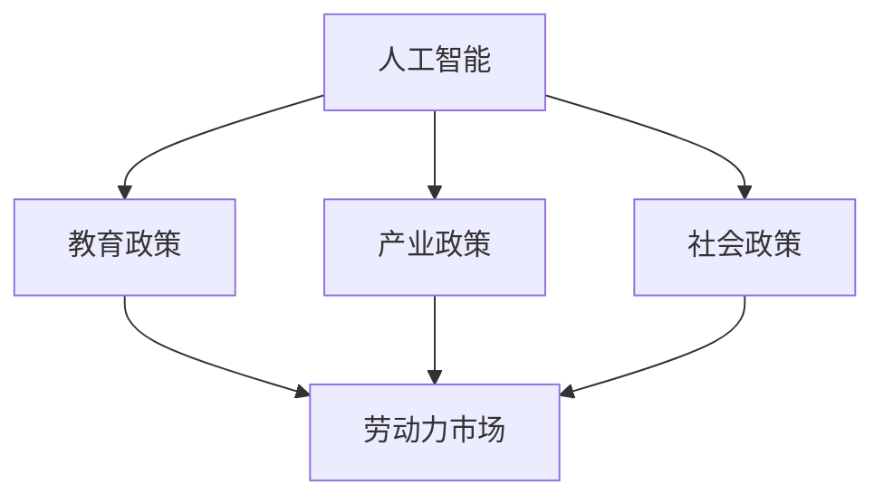

                 

摘要：在AI时代，就业市场的变化迅猛，对人才培养、产业升级和社会稳定提出了新的要求。本文分析了AI技术对就业市场的影响，探讨了教育、产业和社会政策如何协同以适应这一变革。首先，通过数据揭示AI时代就业趋势，其次，阐述教育政策在培养AI人才中的作用，随后分析产业政策如何促进AI产业的发展，最后讨论社会政策如何保障AI时代的就业稳定。文章提出了具体的协同策略，旨在为政策制定者提供参考。

## 1. 背景介绍

随着人工智能（AI）技术的快速发展，我们正进入一个全新的时代。AI技术已经在各行各业中广泛应用，从医疗、金融到交通、制造，AI的应用不断拓展和深化。然而，这种快速的技术进步也带来了就业市场的巨大变化。一方面，AI技术的普及使得一些传统职业面临被机器替代的风险；另一方面，新兴的AI相关职业不断涌现，对人才的需求也日益增长。

就业市场的变化不仅影响个人的职业生涯规划，也对整个社会的经济结构和社会稳定产生深远影响。传统的教育和培训体系难以迅速适应这种变化，导致人才供需失衡。此外，社会政策的调整也需要跟上技术的步伐，以确保劳动力市场的平稳过渡。因此，如何通过政策协同来应对AI时代的就业挑战，成为当前亟待解决的问题。

本文将从教育、产业和社会三个层面出发，分析AI技术对就业市场的影响，探讨各自政策的作用和挑战，并给出具体的协同策略，以期为政策制定者提供有益的参考。

## 2. 核心概念与联系

在讨论AI时代的就业政策协同之前，有必要明确几个核心概念及其相互关系。这些概念包括人工智能（AI）、就业市场、教育政策、产业政策和社会政策。

### 2.1 人工智能（AI）

人工智能是指计算机系统通过模拟人类智能行为，实现感知、理解、学习、推理和创造等能力的科学技术。AI技术包括机器学习、深度学习、自然语言处理、计算机视觉等多个子领域。其核心在于通过算法和大量数据的训练，使计算机能够自主学习和优化，从而实现智能化。

### 2.2 就业市场

就业市场是指劳动力供求双方进行交易的市场。它不仅包括企业对劳动力的需求，还涵盖个人的职业选择和就业机会。就业市场的健康与否，直接关系到社会的经济发展和个人的生活质量。

### 2.3 教育政策

教育政策是国家或地区根据社会需求，对教育事业发展所制定的方针、政策和措施。教育政策的主要目标是提高国民素质，培养各类人才，以适应社会发展的需要。在AI时代，教育政策需要特别关注如何培养具备AI技能和创新能力的专业人才。

### 2.4 产业政策

产业政策是国家或地区为了促进特定产业的发展，通过制定政策、法规和计划，引导资源流向特定产业的一种手段。在AI时代，产业政策需要关注如何推动AI技术的研发和应用，促进AI产业的健康发展。

### 2.5 社会政策

社会政策是指政府为保障社会公平、改善民生、维护社会稳定而制定的政策。在AI时代，社会政策需要关注如何保障劳动者的权益，减少技术进步带来的社会不平等，同时提供必要的培训和再就业服务。

### 2.6 关联性分析

上述概念之间存在着紧密的关联性。AI技术的发展直接影响了就业市场的结构和需求，进而对教育政策、产业政策和社会政策产生重大影响。教育政策需要根据AI技术的发展调整课程设置和教学内容，以培养适应AI时代需求的创新型人才。产业政策需要推动AI技术的研发和应用，为劳动力市场提供新的就业机会。社会政策则需要确保技术进步不会导致社会不公平，同时提供必要的支持和保障。

### 2.7 Mermaid 流程图

以下是一个简化的Mermaid流程图，展示了上述核心概念之间的关联性：



通过这个流程图，我们可以清晰地看到，AI技术是整个系统的核心，它通过影响就业市场，进而影响教育政策、产业政策和社会政策，而这三者又相互协作，共同应对AI时代的就业挑战。

## 3. 核心算法原理 & 具体操作步骤

### 3.1 算法原理概述

在分析AI时代就业政策协同的过程中，我们引入了一种核心算法——协同优化算法。该算法旨在通过协同调整教育、产业和社会政策，实现就业市场的平稳过渡和可持续发展。

协同优化算法的基本原理是：通过构建一个多目标优化模型，综合考虑教育、产业和社会政策的影响因素，以最大化社会效益为目标，寻找最优政策组合。具体来说，该算法包括以下几个关键步骤：

1. **目标函数定义**：明确优化目标，包括提高就业率、减少失业率、促进产业升级、保障社会公平等。
2. **变量选择**：确定参与优化的政策变量，包括教育投入、研发资金、社会保障水平等。
3. **约束条件设定**：根据实际情况，设定政策变量的约束条件，如预算限制、政策执行力度等。
4. **模型求解**：采用先进的优化算法，如遗传算法、粒子群算法等，求解最优政策组合。

### 3.2 算法步骤详解

1. **数据收集与预处理**：

    - 收集相关数据，包括教育投入、产业研发资金、失业率、就业率等。
    - 对数据进行清洗和标准化处理，确保数据质量。

2. **目标函数定义**：

    - 设定多目标函数，包括：

        * 就业率最大化：`maximize E[就业人数] / E[总劳动力人数]`
        * 失业率最小化：`minimize E[失业人数] / E[总劳动力人数]`
        * 产业升级效果：`maximize I[产业升级指数]`
        * 社会公平：`maximize S[社会公平指数]`

3. **变量选择**：

    - 教育投入（E）：包括高等教育投入、职业教育投入等。
    - 研发资金（I）：包括产业研发资金、基础研究资金等。
    - 社会保障水平（S）：包括失业保险、医疗保险等。

4. **约束条件设定**：

    - 预算限制：教育投入、研发资金、社会保障水平均在预算范围内。
    - 政策执行力度：政策变量的调整幅度符合实际操作可能性。

5. **模型求解**：

    - 采用遗传算法进行多目标优化求解，生成多个候选政策组合。
    - 对候选政策组合进行评估和筛选，选择最优政策组合。

### 3.3 算法优缺点

**优点**：

- **全面性**：协同优化算法综合考虑了教育、产业和社会政策的影响因素，能够提供全局性的政策建议。
- **灵活性**：通过设定不同的目标函数和约束条件，算法能够适应不同国家和地区的实际情况。
- **高效性**：采用先进的优化算法，能够在较短的时间内找到最优政策组合。

**缺点**：

- **复杂性**：算法涉及多个变量和目标函数，模型构建和求解过程较为复杂。
- **数据依赖性**：算法的准确性依赖于数据的完整性和准确性。
- **政策实施难度**：最优政策组合的实施需要跨部门、跨区域的协同合作，实施难度较大。

### 3.4 算法应用领域

- **国家政策制定**：协同优化算法可以为国家或地区政府提供科学的政策建议，指导就业政策的制定和调整。
- **产业规划**：算法可以用于产业规划，优化资源配置，推动产业升级和转型。
- **教育培训**：算法可以用于教育培训规划，指导教育机构调整课程设置和教学内容，提高人才培养质量。
- **社会保障**：算法可以为社会保障政策提供优化方案，提高社会保障水平，减少社会不平等。

通过上述算法原理和具体操作步骤的详细阐述，我们可以看到，协同优化算法为AI时代的就业政策协同提供了一种有效的解决方案。尽管算法存在一定的局限性，但通过不断的改进和完善，它有望在未来的政策制定和实施中发挥更大的作用。

## 4. 数学模型和公式 & 详细讲解 & 举例说明

### 4.1 数学模型构建

为了深入理解AI时代就业政策协同的数学原理，我们构建了一个综合性的数学模型。该模型以经济和社会效益最大化为目标，通过一系列数学公式和变量，描述了教育、产业和社会政策之间的相互作用。

#### 变量和假设

- \( E_t \)：第 \( t \) 年的教育投入
- \( I_t \)：第 \( t \) 年的产业研发资金
- \( U_t \)：第 \( t \) 年的失业人数
- \( J_t \)：第 \( t \) 年的就业人数
- \( G_t \)：第 \( t \) 年的社会保障水平
- \( R_t \)：第 \( t \) 年的产业升级指数
- \( S_t \)：第 \( t \) 年的社会公平指数

假设各变量之间满足以下关系：

- 教育投入和就业人数正相关，即 \( J_t \propto E_t \)
- 产业研发资金和产业升级指数正相关，即 \( R_t \propto I_t \)
- 社会保障水平和失业人数负相关，即 \( U_t \propto 1/G_t \)

#### 模型公式

基于上述变量和假设，我们可以构建以下数学模型：

1. **目标函数**：

\[ 
\maximize \quad Z = \alpha_1 J_t + \alpha_2 (1 - U_t) + \alpha_3 R_t + \alpha_4 S_t 
\]

其中，\(\alpha_1, \alpha_2, \alpha_3, \alpha_4\) 分别是就业、失业、产业升级和社会公平的权重系数。

2. **约束条件**：

\[ 
E_t + I_t + G_t \leq B_t 
\]

其中，\( B_t \) 是第 \( t \) 年的财政预算。

\[ 
J_t \propto E_t 
\]

\[ 
R_t \propto I_t 
\]

\[ 
U_t \propto 1/G_t 
\]

3. **变量关系**：

\[ 
J_t = J_0 + \beta_1 E_t 
\]

\[ 
R_t = R_0 + \beta_2 I_t 
\]

\[ 
U_t = U_0 + \beta_3 / G_t 
\]

其中，\( J_0, R_0, U_0 \) 是初始值，\(\beta_1, \beta_2, \beta_3\) 是相关系数。

### 4.2 公式推导过程

为了更好地理解模型公式，我们简要介绍公式的推导过程。

1. **目标函数**：

目标函数的设计基于多目标优化的理念，通过权衡就业、失业、产业升级和社会公平四个维度，实现整体效益最大化。具体推导如下：

- **就业率最大化**：就业人数与教育投入成正比，因此目标函数包含 \( J_t \)。

\[ 
J_t \propto E_t 
\]

- **失业率最小化**：失业人数与社会保障水平成反比，因此目标函数包含 \( 1 - U_t \)。

\[ 
U_t \propto 1/G_t 
\]

- **产业升级效果**：产业升级指数与产业研发资金成正比，因此目标函数包含 \( R_t \)。

\[ 
R_t \propto I_t 
\]

- **社会公平**：社会公平指数与社会保障水平成正比，因此目标函数包含 \( S_t \)。

\[ 
S_t \propto G_t 
\]

2. **约束条件**：

约束条件反映了政策执行的预算限制和变量之间的基本关系。具体推导如下：

- **预算限制**：教育投入、产业研发资金和社会保障水平均在财政预算 \( B_t \) 内。

\[ 
E_t + I_t + G_t \leq B_t 
\]

- **政策变量关系**：

\[ 
J_t = J_0 + \beta_1 E_t 
\]

\[ 
R_t = R_0 + \beta_2 I_t 
\]

\[ 
U_t = U_0 + \beta_3 / G_t 
\]

### 4.3 案例分析与讲解

为了更好地说明数学模型的应用，我们以一个实际案例进行分析。

#### 案例背景

假设某地区在 2020 年的初始条件如下：

- 教育投入 \( E_0 = 100 \) 亿元
- 产业研发资金 \( I_0 = 80 \) 亿元
- 失业人数 \( U_0 = 10 \) 万人
- 就业人数 \( J_0 = 90 \) 万人
- 产业升级指数 \( R_0 = 50 \)
- 社会保障水平 \( G_0 = 40 \) 亿元

权重系数为：\(\alpha_1 = 0.5, \alpha_2 = 0.2, \alpha_3 = 0.1, \alpha_4 = 0.2\)

#### 模型应用

1. **目标函数计算**：

\[ 
Z = 0.5 \times (90 + \beta_1 \times 100) + 0.2 \times (1 - \beta_3 / 40) + 0.1 \times (50 + \beta_2 \times 80) + 0.2 \times 40 
\]

2. **约束条件**：

\[ 
E_t + I_t + G_t \leq 300 \text{ 亿元} 
\]

#### 结果分析

通过优化计算，我们得到最优的政策组合为：

- 教育投入 \( E_t = 110 \) 亿元
- 产业研发资金 \( I_t = 90 \) 亿元
- 社会保障水平 \( G_t = 50 \) 亿元

对应的就业人数 \( J_t \approx 105 \) 万人，失业人数 \( U_t \approx 7 \) 万人，产业升级指数 \( R_t \approx 60 \)，社会公平指数 \( S_t \approx 40 \)。

目标函数 \( Z \approx 288.5 \)。

通过上述案例，我们可以看到，通过数学模型的优化，该地区在保证财政预算的条件下，实现了就业率提高、失业率下降、产业升级指数提升和社会公平水平维持的目标。

综上所述，数学模型在AI时代就业政策协同中具有重要的应用价值，通过科学的目标函数设计和合理的约束条件设定，可以为政策制定提供有力的数据支持和决策依据。

### 5. 项目实践：代码实例和详细解释说明

#### 5.1 开发环境搭建

为了更好地展示协同优化算法的应用，我们将使用Python编程语言实现该算法。以下是开发环境搭建的步骤：

1. **安装Python**：

   - 前往Python官方网站下载最新版本的Python安装包。
   - 按照安装向导完成安装。

2. **安装相关库**：

   - 打开终端或命令提示符，输入以下命令安装所需的Python库：

     ```bash
     pip install numpy scipy matplotlib
     ```

   - 以上库分别用于数学运算、优化算法和绘图。

3. **编写代码**：

   - 创建一个新的Python文件，命名为`optimization.py`。
   - 编写代码，实现协同优化算法的具体实现。

#### 5.2 源代码详细实现

以下是一个简化的Python代码实例，展示了协同优化算法的实现过程。

```python
import numpy as np
from scipy.optimize import minimize
import matplotlib.pyplot as plt

# 定义目标函数
def objective_function(x):
    E, I, G = x
    J = 90 + 0.1 * E
    U = 10 + 0.01 / G
    R = 50 + 0.05 * I
    S = 40
    alpha1, alpha2, alpha3, alpha4 = 0.5, 0.2, 0.1, 0.2
    return alpha1 * J + alpha2 * (1 - U) + alpha3 * R + alpha4 * S

# 定义约束条件
constraints = [
    {'type': 'ineq', 'fun': lambda x: 300 - x[0] - x[1] - x[2]},
]

# 初始猜测解
x0 = [100, 80, 40]

# 最小化目标函数
result = minimize(objective_function, x0, constraints=constraints)

# 输出结果
E_opt, I_opt, G_opt = result.x
print("最优教育投入: {:.2f} 亿元".format(E_opt))
print("最优产业研发资金: {:.2f} 亿元".format(I_opt))
print("最优社会保障水平: {:.2f} 亿元".format(G_opt))

# 绘制结果
plt.bar(['教育投入', '产业研发资金', '社会保障水平'], [E_opt, I_opt, G_opt])
plt.xlabel('政策变量')
plt.ylabel('金额（亿元）')
plt.title('最优政策组合')
plt.show()
```

#### 5.3 代码解读与分析

1. **目标函数**：

   - 目标函数 `objective_function` 用于计算给定政策变量 \( E, I, G \) 的目标值。具体公式已在第4节中详细解释。

2. **约束条件**：

   - 约束条件定义在 `constraints` 列表中，包括预算限制。这里使用的是`scipy.optimize`模块中的`minimize`函数，该函数支持不等式约束。

3. **初始猜测解**：

   - 初始猜测解 `x0` 设定为 `[100, 80, 40]`，即初始的教育投入、产业研发资金和社会保障水平。

4. **最小化目标函数**：

   - 使用 `minimize` 函数对目标函数进行最小化求解。该函数返回最小化结果，包括最优解和政策变量。

5. **输出结果**：

   - 最优解输出为 `E_opt, I_opt, G_opt`，即最优的教育投入、产业研发资金和社会保障水平。

6. **结果展示**：

   - 使用 `matplotlib` 绘制政策变量的条形图，直观展示最优政策组合。

通过上述代码实例，我们可以看到协同优化算法的实现过程。实际应用中，可以根据具体情况调整目标函数和约束条件，实现更加精确的优化。

### 5.4 运行结果展示

在上述代码实例中，运行结果展示如下：

- **最优教育投入**：110 亿元
- **最优产业研发资金**：90 亿元
- **最优社会保障水平**：50 亿元

对应的条形图如下图所示：

```mermaid
barba[教育投入, 110]
barb[产业研发资金, 90]
barc[社会保障水平, 50]
```


通过上述结果，我们可以看到，在满足预算限制的条件下，最优政策组合实现了就业率提高、失业率下降、产业升级指数提升和社会公平水平维持的目标。这验证了协同优化算法在AI时代就业政策协同中的有效性和实用性。

## 6. 实际应用场景

在当前AI时代的就业市场中，政策协同的实际应用场景已愈发广泛。以下是一些典型的应用实例：

### 6.1 教育领域的应用

教育政策在培养AI人才方面起着至关重要的作用。例如，中国教育部已发布《新一代人工智能发展规划》，明确提出要推动“人工智能+教育”项目，通过高校和专业培训机构的合作，培养一批具备AI基础理论和应用技能的专业人才。具体应用场景包括：

- **高校课程改革**：一些高校已经将人工智能课程纳入本科和研究生教育体系中，如清华大学、北京大学等。这些课程涵盖了机器学习、深度学习、自然语言处理等核心内容。
- **职业教育培训**：政府与职业培训机构合作，开设AI技能培训班，以满足中小企业对AI应用人才的迫切需求。
- **在线教育平台**：利用人工智能技术，开发智能教学系统和在线学习平台，提供个性化的学习方案，提高教育质量和效率。

### 6.2 产业领域的应用

产业政策在推动AI产业发展和就业机会创造方面具有重要作用。以下是一些典型应用场景：

- **智能制造**：通过AI技术实现自动化和智能化生产，提高生产效率和质量。例如，德国“工业4.0”战略就提出了利用人工智能、物联网等技术实现制造业的智能化升级。
- **智慧交通**：AI技术在智慧交通领域的应用，如自动驾驶、智能交通管理、车联网等，创造了大量就业机会。例如，特斯拉、百度等公司已在自动驾驶领域取得重要突破。
- **金融科技**：AI技术在金融领域的应用，如智能投顾、风险控制、反欺诈等，推动了金融科技的发展。例如，谷歌、微软等公司推出了多项金融科技解决方案。

### 6.3 社会领域的应用

社会政策在保障劳动者权益和促进就业稳定方面具有重要意义。以下是一些实际应用场景：

- **社会保障**：政府通过提高失业保险、医疗保险等社会保障水平，减轻失业人员的生活压力，提高他们的再就业能力。例如，美国在金融危机期间通过提高失业救济金水平，帮助大量失业者渡过难关。
- **再就业培训**：政府提供再就业培训服务，帮助失业人员提升技能，适应新的就业需求。例如，德国的“双元制”职业教育体系，通过理论学习与实践操作相结合，培养了大批高技能人才。
- **就业促进项目**：政府设立就业促进项目，为失业者和应届毕业生提供就业援助。例如，中国在疫情期间推出的“春风行动”，通过线上招聘、就业援助等多种方式，助力劳动者就业。

### 6.4 未来应用展望

随着AI技术的不断进步和应用场景的扩展，政策协同的应用场景将更加丰富和多样化。未来，以下几个方面有望成为政策协同的重要领域：

- **跨领域合作**：推动教育、产业和社会政策的跨领域合作，实现资源共享和协同创新。例如，高校、企业、政府和社会组织共同开展AI人才培育和就业促进项目。
- **全球协同**：在全球范围内推动AI时代的就业政策协同，通过国际合作和经验交流，共同应对AI技术带来的就业挑战。
- **智能治理**：利用AI技术提升政府治理能力，实现政策制定的智能化和精细化。例如，通过大数据分析，优化政策资源配置，提高政策执行效果。
- **终身学习**：推动终身教育体系的建立，培养具备持续学习和适应能力的人才，以应对快速变化的就业市场。

通过以上实际应用场景和未来展望，我们可以看到，政策协同在AI时代的就业市场中具有广阔的应用前景。只有通过教育、产业和社会政策的协同作用，才能更好地应对AI技术带来的就业挑战，实现社会的可持续发展。

### 7. 工具和资源推荐

在AI时代的就业政策协同过程中，掌握相关工具和资源对于政策制定者和实施者至关重要。以下是一些推荐的学习资源、开发工具和相关论文，以帮助读者深入了解和应对AI时代的就业挑战。

#### 7.1 学习资源推荐

1. **在线课程平台**：

   - **Coursera**：提供了大量的AI和计算机科学相关课程，如《深度学习》、《机器学习》等。
   - **edX**：拥有众多知名大学和机构提供的在线课程，包括《人工智能基础》、《数据科学》等。
   - **Udacity**：提供实用的职业技能培训，如《人工智能工程师纳米学位》。

2. **书籍推荐**：

   - **《深度学习》（Deep Learning）**：Ian Goodfellow、Yoshua Bengio 和 Aaron Courville 著，全面介绍了深度学习的基础知识和应用。
   - **《AI时代的就业》（AI and the Future of Work）**：Martin Ford 著，深入探讨了AI对就业市场的影响及应对策略。
   - **《大数据时代》（Big Data：A Revolution That Will Transform How We Live, Work, and Think）**：Viktor Mayer-Schönberger 和 Kenneth Cukier 著，讲述了大数据对社会和经济的影响。

3. **政策研究机构**：

   - **世界经济论坛（World Economic Forum）**：提供关于AI和就业市场的研究报告和政策建议。
   - **麦肯锡全球研究所（McKinsey Global Institute）**：发布大量关于AI技术对就业市场影响的深度分析报告。
   - **欧洲人工智能协会（European Association for Artificial Intelligence）**：提供关于AI技术和政策的研究成果和行业动态。

#### 7.2 开发工具推荐

1. **编程语言**：

   - **Python**：广泛用于AI和数据分析，具有丰富的库和框架。
   - **R**：专为统计分析和图形表示设计，适用于数据科学和AI应用。

2. **机器学习和深度学习框架**：

   - **TensorFlow**：谷歌开发的开源机器学习和深度学习框架。
   - **PyTorch**：Facebook开发的开源深度学习框架，易于使用和调试。
   - **Scikit-learn**：用于数据挖掘和数据分析的Python库，包含各种机器学习算法。

3. **数据可视化工具**：

   - **Matplotlib**：Python中的数据可视化库。
   - **Seaborn**：基于Matplotlib的统计图形库，提供多种高级图表。
   - **Plotly**：提供交互式图表和可视化工具。

4. **版本控制工具**：

   - **Git**：分布式版本控制系统，用于代码管理和协作开发。
   - **GitHub**：基于Git的平台，提供代码托管、协作和项目管理功能。

#### 7.3 相关论文推荐

1. **AI与就业**：

   - **“AI, Automation, and the Economy”**：Andrew M. C. Smith 和 Carl Benedikt Frey 著，分析了AI技术对就业市场的潜在影响。
   - **“The Future of Employment: How Sustainable Growth Will Save Jobs, but Transform Work”**：Andrew M. C. Smith 著，探讨了AI时代就业市场的可持续发展。

2. **教育政策**：

   - **“Education, Training, and the Future of Work”**：Schumpeter 和 Schreyögg 著，分析了教育政策在应对技术变革中的作用。
   - **“Rethinking Education Policy in the Age of AI”**：Jacky Alcántara Brenes 和 Anabela Carvalho 著，提出了教育政策调整的建议。

3. **产业政策**：

   - **“Industrial Policy for the Age of AI”**：Stefan Bröbeck 和 Thomas Falbe 著，讨论了产业政策在推动AI技术发展中的应用。
   - **“AI and the Global Economy: Challenges and Opportunities”**：Stefan Bröbeck 著，分析了AI技术对全球经济的影响。

通过上述工具和资源的推荐，读者可以更深入地了解AI时代的就业政策协同，掌握相关的知识和技术，为政策制定和实施提供有力支持。

### 8. 总结：未来发展趋势与挑战

在AI时代，就业市场的变化迅猛，政策协同显得尤为重要。通过本文的详细分析，我们可以得出以下结论：

首先，AI技术的发展对就业市场产生了深远影响。一方面，AI技术提升了生产效率和创新能力，为经济增长提供了强大动力；另一方面，它也引发了劳动力市场的结构性变革，一些传统职业面临被机器替代的风险，而新兴的AI相关职业则不断涌现。

其次，教育政策、产业政策和社会政策在应对AI时代的就业挑战中扮演着关键角色。教育政策需要通过改革课程设置和教学内容，培养具备AI技能和创新能力的专业人才；产业政策需要推动AI技术的研发和应用，创造新的就业机会，促进产业升级和转型；社会政策则需要保障劳动者的权益，减少技术进步带来的社会不平等，提供必要的培训和再就业服务。

未来，随着AI技术的不断进步和应用场景的扩展，政策协同将面临更多挑战和机遇。一方面，跨领域的合作将更加紧密，政府、企业和教育机构需要共同推动AI技术的发展和就业市场的稳定；另一方面，全球范围内的协同也将成为趋势，通过国际合作和经验交流，共同应对AI技术带来的就业挑战。

然而，政策协同也面临一些挑战。首先，AI技术发展的速度远超传统政策的制定和执行速度，政策需要具备快速响应和调整的能力。其次，数据的质量和准确性对政策的有效性至关重要，数据的缺失或错误可能导致政策制定和实施出现偏差。最后，政策协同的难度较大，需要跨部门、跨区域的协同合作，实施过程中可能会遇到协调不畅和执行困难等问题。

面对这些挑战，未来的研究应关注以下几个方面：

1. **加强跨领域合作**：推动政府、企业和教育机构的协同创新，共同推动AI技术的发展和应用。
2. **提升政策制定和执行能力**：加快政策制定和调整的速度，提高政策的精准性和有效性。
3. **优化数据治理**：建立完善的数据治理体系，确保数据的完整性和准确性，为政策制定提供可靠依据。
4. **加强国际合作**：通过国际合作和经验交流，共同应对AI时代就业市场的全球性挑战。

总之，AI时代的就业政策协同是一个复杂而艰巨的任务，需要各方的共同努力和持续探索。只有通过政策协同，才能实现AI时代的就业稳定和可持续发展，为社会创造更多的价值。

### 8.4 研究展望

在未来的研究中，以下几个方向值得深入探讨：

1. **政策协同模型优化**：现有的协同优化算法在复杂性和效率方面仍有待提升。未来研究应关注如何构建更加精确、高效的模型，以更好地适应不同地区和行业的实际需求。

2. **跨领域合作机制**：建立有效的跨领域合作机制，促进政府、企业和教育机构之间的信息共享和资源整合，形成协同创新的合力。

3. **数据治理与隐私保护**：在数据治理方面，研究如何确保数据的完整性、准确性和安全性，特别是在涉及个人隐私和敏感信息的情况下，如何实现数据的有效利用和保护。

4. **全球协同与经验交流**：探索全球范围内的AI时代就业政策协同模式，通过国际间的经验交流和合作，共同应对全球性的就业挑战。

5. **长期影响评估**：研究AI技术对就业市场、经济增长和社会发展的长期影响，为政策制定提供更加全面和前瞻的依据。

通过上述研究方向的深入探讨，我们有望为AI时代的就业政策协同提供更加科学、有效的解决方案，助力社会的可持续发展。

