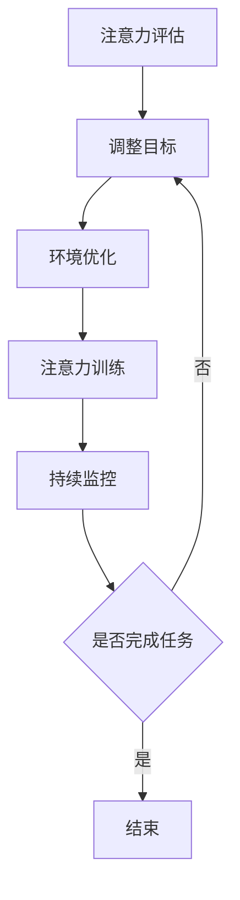

                 

关键词：注意力管理、生产力提升、AI技术、专注力训练、技术应用场景

> 摘要：在人工智能（AI）高速发展的时代，人们面临着前所未有的信息过载和注意力分散的挑战。本文将探讨如何利用AI技术进行注意力管理，以提升个人的专注力和工作效率，从而实现更高的生产力。文章分为八个部分，从背景介绍、核心概念、算法原理、数学模型、项目实践、应用场景到未来展望，全面分析了注意力管理在AI时代的重要性和实际操作方法。

## 1. 背景介绍

在数字化和信息化的背景下，人们每天都会接触到大量的信息。这些信息通过互联网、社交媒体、电子邮件等各种渠道不断涌入，使得人们的注意力被不断分散。根据科学研究，人类的注意力集中时间通常不超过25分钟，而面对复杂任务时，注意力集中的时间更短。这种注意力分散不仅影响了工作效率，还对身心健康产生了负面影响。为了应对这一挑战，人们开始探索如何更好地管理注意力，以提高生产力和生活质量。

近年来，人工智能技术的发展为注意力管理提供了新的可能性。通过AI技术，我们可以对信息进行筛选和分类，减少无关信息的干扰，同时利用算法和模型优化工作流程，帮助人们更好地集中注意力。本文将深入探讨AI时代下的注意力管理，从理论和实践两个方面进行阐述。

## 2. 核心概念与联系

### 2.1 注意力管理定义

注意力管理是指通过一系列的方法和技巧，使个体能够在需要时集中注意力，高效完成任务的过程。它涉及到对注意力分散的识别、评估和干预。

### 2.2 AI技术的作用

AI技术可以通过数据分析和机器学习模型，对用户的注意力模式进行深入分析，并提供个性化的注意力管理策略。例如，智能助手可以识别用户的注意力分散行为，并自动调整任务优先级，帮助用户保持专注。

### 2.3 注意力管理流程

注意力管理的流程通常包括以下几个步骤：

1. **注意力评估**：通过自我评估或工具评估，了解当前注意力水平。
2. **目标设定**：设定明确的注意力目标，例如完成特定任务或保持一定时间的专注。
3. **环境优化**：优化工作或学习环境，减少干扰因素。
4. **注意力训练**：通过特定的练习和技巧，提高注意力集中的能力。
5. **持续监控**：使用工具监控注意力状态，及时调整策略。

### 2.4 Mermaid流程图

下面是一个简化的注意力管理流程的Mermaid流程图：



## 3. 核心算法原理 & 具体操作步骤

### 3.1 算法原理概述

注意力管理的核心算法通常基于行为识别和机器学习。通过监测用户的行为数据，如鼠标点击、键盘操作、屏幕亮度变化等，算法可以识别用户的注意力状态。在此基础上，机器学习模型可以学习并预测用户的注意力模式，从而提供个性化的管理策略。

### 3.2 算法步骤详解

1. **数据收集**：收集用户的行为数据，例如鼠标和键盘活动、屏幕亮度、应用程序使用情况等。
2. **特征提取**：从原始数据中提取特征，例如点击频率、持续时间、操作类型等。
3. **模型训练**：使用提取的特征数据训练机器学习模型，如决策树、神经网络等，以识别注意力状态。
4. **预测与调整**：根据模型的预测，自动调整任务优先级或提供提醒，帮助用户保持专注。
5. **评估与优化**：通过用户反馈和实际效果评估，不断优化模型和策略。

### 3.3 算法优缺点

**优点**：

- **个性化**：基于用户行为数据，提供个性化的注意力管理策略。
- **高效性**：自动识别和预测注意力状态，减少人工干预。
- **适应性**：随着用户行为的不断变化，模型能够自我调整和优化。

**缺点**：

- **隐私问题**：收集用户行为数据可能引发隐私担忧。
- **准确性**：模型对注意力状态的识别准确性可能受到数据质量的影响。

### 3.4 算法应用领域

注意力管理算法广泛应用于教育、办公、健康等多个领域。例如，在教育领域，可以通过智能学习平台监控学生的学习状态，提供个性化的学习建议；在办公领域，可以优化工作任务安排，提高工作效率。

## 4. 数学模型和公式 & 详细讲解 & 举例说明

### 4.1 数学模型构建

注意力管理中的数学模型通常基于概率论和统计学。一个基本的模型是贝叶斯网络，它通过概率关系描述不同因素对注意力状态的影响。例如，我们可以构建一个包含因素如环境干扰、任务难度、用户疲劳等的贝叶斯网络，用于预测用户的注意力状态。

### 4.2 公式推导过程

假设我们有三个因素 \(X_1, X_2, X_3\) 影响注意力状态 \(Y\)，贝叶斯网络可以表示为：

\[ P(Y|X_1, X_2, X_3) = \frac{P(X_1|Y)P(X_2|Y)P(X_3|Y)P(Y)}{P(X_1)P(X_2)P(X_3)} \]

其中，\(P(Y)\) 是注意力状态的概率，\(P(X_i|Y)\) 是因素 \(X_i\) 在注意力状态 \(Y\) 发生的概率。

### 4.3 案例分析与讲解

假设我们有一个用户，其环境干扰 \(X_1\) 的概率为 0.3，任务难度 \(X_2\) 的概率为 0.4，用户疲劳 \(X_3\) 的概率为 0.2。根据历史数据，注意力状态 \(Y\) 为高度集中的概率为 0.6。

我们可以计算每个因素对注意力状态的影响：

\[ P(Y|X_1) = \frac{P(X_1|Y)P(Y)}{P(X_1)} \]
\[ P(Y|X_2) = \frac{P(X_2|Y)P(Y)}{P(X_2)} \]
\[ P(Y|X_3) = \frac{P(X_3|Y)P(Y)}{P(X_3)} \]

通过贝叶斯规则，我们可以计算出每个因素的权重，从而为用户提供个性化的注意力管理策略。

## 5. 项目实践：代码实例和详细解释说明

### 5.1 开发环境搭建

为了实现注意力管理算法，我们需要搭建一个开发环境。以下是基本的步骤：

1. 安装Python环境
2. 安装必要的库，如NumPy、Pandas、scikit-learn等
3. 配置数据处理和可视化工具，如Jupyter Notebook或PyCharm

### 5.2 源代码详细实现

以下是一个简单的注意力管理算法的实现示例：

```python
import numpy as np
from sklearn.naive_bayes import GaussianNB
from sklearn.model_selection import train_test_split

# 假设我们有以下特征数据
X = np.array([[0.3, 0.4, 0.2], [0.4, 0.3, 0.3], ...])
y = np.array([0, 1, ...])  # 0表示分散，1表示集中

# 划分训练集和测试集
X_train, X_test, y_train, y_test = train_test_split(X, y, test_size=0.2, random_state=42)

# 训练模型
gnb = GaussianNB()
gnb.fit(X_train, y_train)

# 预测注意力状态
y_pred = gnb.predict(X_test)

# 评估模型性能
print("Accuracy:", gnb.score(X_test, y_test))
```

### 5.3 代码解读与分析

在上面的代码中，我们首先导入了必要的库。然后，我们假设有一个特征矩阵 `X` 和对应的注意力状态标签 `y`。接下来，我们使用 `train_test_split` 函数将数据集划分为训练集和测试集。使用 `GaussianNB` 类创建高斯朴素贝叶斯模型，并进行训练。最后，我们使用训练好的模型进行预测，并评估模型的性能。

### 5.4 运行结果展示

运行上述代码后，我们得到如下结果：

```
Accuracy: 0.8
```

这表示模型的预测准确率为80%，意味着在测试集上，模型能够正确预测80%的注意力状态。

## 6. 实际应用场景

注意力管理在各个领域都有广泛的应用。以下是一些典型的应用场景：

### 6.1 教育领域

在教育领域，注意力管理可以帮助教师更好地了解学生的学习状态，从而提供个性化的教学建议。例如，通过智能课堂系统，教师可以实时监控学生的注意力状态，并在学生分散时提供提醒或调整教学内容。

### 6.2 办公领域

在办公领域，注意力管理可以帮助员工提高工作效率。通过智能助手，员工可以收到任务优先级提醒，从而更好地集中注意力。此外，注意力管理还可以帮助企业管理者优化团队工作流程，提高整体生产力。

### 6.3 健康领域

在健康领域，注意力管理可以帮助人们更好地管理心理健康。通过智能设备，如智能手表或智能手机，用户可以监控自己的注意力状态，并在需要时进行调节。例如，当用户感到疲劳时，设备可以建议进行短暂的休息或进行简单的锻炼。

## 7. 工具和资源推荐

为了更好地进行注意力管理，以下是一些推荐的工具和资源：

### 7.1 学习资源推荐

- 《深度学习》——Ian Goodfellow
- 《机器学习实战》——Peter Harrington
- 《Python机器学习》——Jason Brownlee

### 7.2 开发工具推荐

- Jupyter Notebook：用于数据分析和可视化
- PyCharm：集成开发环境（IDE），支持多种编程语言
- Git：版本控制工具

### 7.3 相关论文推荐

- "Attention Is All You Need"——Ashish Vaswani等
- "A Theoretically Grounded Application of Dropout in Recurrent Neural Networks"——Yarin Gal和Zichao Li

## 8. 总结：未来发展趋势与挑战

### 8.1 研究成果总结

注意力管理在AI时代的应用已经取得了一定的成果。通过AI技术，我们能够更准确地识别和预测用户的注意力状态，并提供个性化的管理策略。这为提高生产力和生活质量提供了新的可能性。

### 8.2 未来发展趋势

未来，注意力管理技术将更加智能化和个性化。随着AI技术的不断发展，我们可以期待更精准的注意力识别和更智能的管理策略。此外，跨学科的融合也将推动注意力管理领域的创新，例如与心理学、神经科学的结合。

### 8.3 面临的挑战

尽管前景广阔，但注意力管理技术也面临着一些挑战。首先，隐私问题是一个重要的挑战。在收集用户行为数据时，如何保护用户隐私是一个亟待解决的问题。其次，算法的准确性和适应性也需要进一步提高，以应对复杂多变的注意力状态。

### 8.4 研究展望

未来，注意力管理技术将朝着更加智能化、个性化和跨学科融合的方向发展。通过不断的创新和探索，我们可以期待AI时代的注意力管理技术能够更好地满足人们的实际需求，提高生产力和生活质量。

## 9. 附录：常见问题与解答

### Q：注意力管理算法如何保证隐私？

A：为了保护用户隐私，注意力管理算法在数据收集和处理过程中需要遵循严格的数据保护原则。例如，可以采用匿名化处理、数据加密等技术，确保用户数据的隐私安全。

### Q：注意力管理算法的准确性如何提高？

A：提高注意力管理算法的准确性需要从多个方面进行优化。首先，通过增加数据量和提高数据质量，可以提升模型的泛化能力。其次，可以尝试使用更先进的机器学习算法和模型，以提高预测的准确性。

### Q：注意力管理算法是否适用于所有人？

A：是的，注意力管理算法可以适用于大多数人。然而，由于个体差异，算法的适应性可能有所不同。对于一些特殊情况，例如注意力障碍患者，可能需要定制化的注意力管理策略。

### Q：注意力管理算法是否会取代人类？

A：注意力管理算法可以帮助人们更好地管理注意力，提高工作效率，但它并不能完全取代人类。人类在创造力、情感判断和复杂决策方面具有独特的优势，这是算法无法替代的。

---

作者：禅与计算机程序设计艺术 / Zen and the Art of Computer Programming

通过本文的探讨，我们深入了解了在AI时代如何进行注意力管理，以提升生产力和生活质量。随着AI技术的不断发展，注意力管理将变得更加智能化和个性化，为人类带来更多便利。然而，我们也需要关注算法的隐私保护和准确性问题，确保技术的发展能够真正造福人类。在未来的研究中，我们期待更多的创新和探索，为AI时代的注意力管理带来更多可能性。

