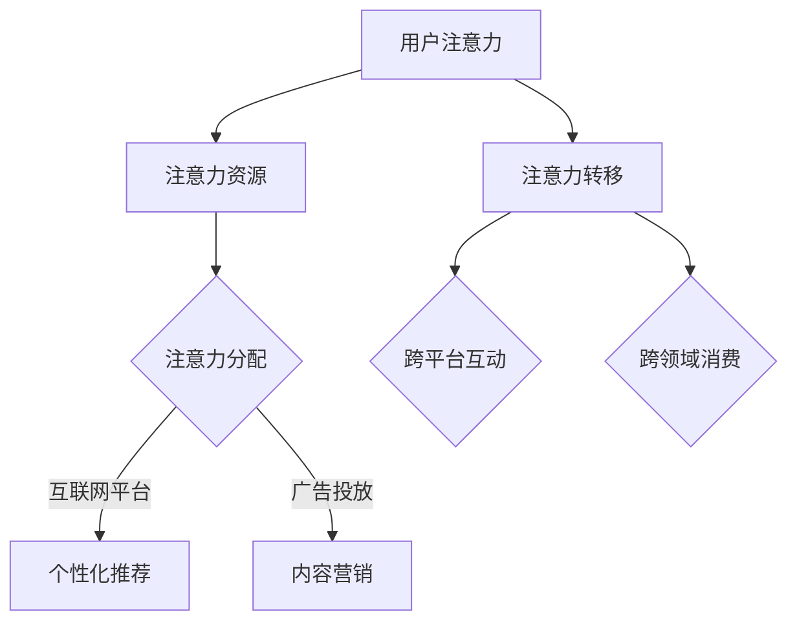

                 

关键词：AI、注意力经济、机遇、陷阱、算法、应用领域、数学模型、未来展望

> 摘要：本文旨在探讨AI时代注意力经济的现状、机遇与陷阱。通过详细分析注意力经济的核心概念、算法原理、数学模型以及实际应用场景，揭示其潜在的优势与挑战，为读者提供全面的思考与指导。

## 1. 背景介绍

随着人工智能技术的飞速发展，数据分析与处理的能力日益增强，商业社会逐渐从传统产品经济转向注意力经济。注意力经济是一种基于人类注意力资源的新型商业模式，核心在于如何吸引和保持用户的注意力，从而实现价值创造和利润最大化。AI技术的引入，使得注意力经济的实现变得更加高效和精准。

注意力经济的概念最早由学者Richard B. Chase和Barry M. Wellman于1993年提出。他们认为，注意力是消费者在商品选择中的一种心理资源，其稀缺性决定了商业竞争的激烈程度。在AI时代，注意力经济的实现更加依赖于个性化推荐系统、智能广告和用户行为分析等技术。

### 1.1 现状

当前，注意力经济已成为全球商业领域的主流趋势。从社交媒体到电子商务，从在线娱乐到教育培训，注意力经济无处不在。例如，Facebook和Google等科技巨头通过个性化推荐和广告投放，成功吸引了大量用户注意力，实现了巨额利润。同时，创业者们也在积极探索AI技术在注意力经济中的应用，推出了一系列创新的商业模式。

### 1.2 发展趋势

随着AI技术的不断进步，注意力经济的发展趋势愈发明显。一方面，AI算法的优化和智能化使得注意力资源的分配更加精准，商业价值得以最大化。另一方面，大数据和云计算的普及为注意力经济提供了丰富的数据资源和计算能力，助力企业实现个性化服务和高效营销。

## 2. 核心概念与联系

注意力经济的核心在于理解用户的注意力分布，并将其转化为商业价值。为了实现这一目标，我们需要了解以下几个核心概念：

### 2.1 注意力资源

注意力资源是指人类在感知、思考和决策过程中所消耗的心理资源。根据心理学研究，注意力资源是有限的，且具有选择性。在注意力经济中，如何吸引和保持用户的注意力成为关键。

### 2.2 注意力分配

注意力分配是指用户在不同任务或内容之间的注意力分布。在注意力经济中，如何优化注意力分配，提高用户对特定内容的关注度和参与度，是商业竞争的核心。

### 2.3 注意力转移

注意力转移是指用户将注意力从一个任务或内容转移到另一个任务或内容的过程。在注意力经济中，如何引导用户注意力转移，实现跨平台和跨领域的内容消费，是拓展商业价值的重要手段。

### 2.4 注意力经济学模型

注意力经济学模型是基于经济学原理，对注意力资源的分配、转移和价值创造过程进行量化分析的一种理论框架。该模型有助于企业制定有效的注意力经济策略，实现商业利润最大化。

#### 2.5 注意力经济学模型 Mermaid 流程图



## 3. 核心算法原理 & 具体操作步骤

### 3.1 算法原理概述

注意力经济的核心在于算法的应用。以下将介绍几种在注意力经济中广泛应用的核心算法：

1. **个性化推荐算法**：基于用户历史行为和兴趣偏好，为用户推荐个性化内容，以提高用户关注度和参与度。
2. **机器学习算法**：通过分析大量用户数据，发现用户行为模式，优化注意力资源分配策略。
3. **深度学习算法**：利用神经网络模型，实现图像、语音和文本等多模态数据的处理和分析，提高注意力转移效果。

### 3.2 算法步骤详解

1. **数据收集**：收集用户历史行为数据，包括浏览记录、购买记录、搜索关键词等。
2. **特征提取**：从原始数据中提取有效特征，如用户年龄、性别、地理位置等。
3. **模型训练**：使用机器学习算法或深度学习算法，训练个性化推荐模型或注意力分配模型。
4. **模型评估**：通过交叉验证和A/B测试等方法，评估模型性能，优化模型参数。
5. **应用部署**：将训练好的模型部署到实际业务场景，实现个性化推荐、广告投放和注意力转移等功能。

### 3.3 算法优缺点

1. **个性化推荐算法**：
   - 优点：提高用户关注度和参与度，提升用户体验。
   - 缺点：可能导致用户信息过载，降低用户满意度。
2. **机器学习算法**：
   - 优点：提高注意力资源分配的精准度，提升商业价值。
   - 缺点：对数据质量和计算资源要求较高，模型解释性较差。
3. **深度学习算法**：
   - 优点：实现多模态数据处理，提高注意力转移效果。
   - 缺点：对算法设计和数据预处理要求较高，计算资源消耗大。

### 3.4 算法应用领域

1. **在线广告**：通过个性化推荐和机器学习算法，实现精准广告投放，提高广告点击率和转化率。
2. **内容营销**：利用深度学习算法，实现个性化内容推荐和注意力转移，提升内容消费质量和用户粘性。
3. **社交媒体**：通过注意力经济学模型，优化用户互动策略，提高社交媒体平台活跃度和用户满意度。

## 4. 数学模型和公式

在注意力经济中，数学模型和公式用于量化分析注意力资源的分配、转移和价值创造过程。以下将介绍几种常见的数学模型和公式：

### 4.1 数学模型构建

1. **注意力分配模型**：

   假设有n个任务，用户在每个任务上分配的注意力资源为$a_i$（$i=1,2,...,n$），总注意力资源为$A$。则注意力分配模型可以表示为：

   $$ A = \sum_{i=1}^{n} a_i $$

2. **注意力转移模型**：

   假设有m个平台，用户在每个平台上的注意力资源为$b_j$（$j=1,2,...,m$），总注意力资源为$B$。则注意力转移模型可以表示为：

   $$ B = \sum_{j=1}^{m} b_j $$

3. **价值创造模型**：

   假设每个任务的商业价值为$v_i$，每个平台的商业价值为$w_j$。则价值创造模型可以表示为：

   $$ V = \sum_{i=1}^{n} v_i a_i = \sum_{j=1}^{m} w_j b_j $$

### 4.2 公式推导过程

1. **注意力分配模型推导**：

   根据用户注意力资源的稀缺性，我们可以推导出注意力分配模型。假设用户在每个任务上的注意力资源与任务难度成正比，即$a_i \propto d_i$。则：

   $$ a_i = k \cdot d_i $$

   其中，$k$为比例常数。

   又因为总注意力资源$A$为常数，即：

   $$ A = \sum_{i=1}^{n} a_i = \sum_{i=1}^{n} k \cdot d_i $$

   所以：

   $$ k = \frac{A}{\sum_{i=1}^{n} d_i} $$

   将$k$代入$a_i$的表达式中，得到：

   $$ a_i = \frac{A}{\sum_{i=1}^{n} d_i} \cdot d_i $$

2. **注意力转移模型推导**：

   类似地，我们可以推导出注意力转移模型。假设用户在每个平台上的注意力资源与平台吸引力成正比，即$b_j \propto p_j$。则：

   $$ b_j = k' \cdot p_j $$

   其中，$k'$为比例常数。

   又因为总注意力资源$B$为常数，即：

   $$ B = \sum_{j=1}^{m} b_j = \sum_{j=1}^{m} k' \cdot p_j $$

   所以：

   $$ k' = \frac{B}{\sum_{j=1}^{m} p_j} $$

   将$k'$代入$b_j$的表达式中，得到：

   $$ b_j = \frac{B}{\sum_{j=1}^{m} p_j} \cdot p_j $$

3. **价值创造模型推导**：

   根据价值创造的定义，每个任务和平台的商业价值分别为$v_i$和$w_j$。则：

   $$ V = \sum_{i=1}^{n} v_i a_i = \sum_{i=1}^{n} v_i \left( \frac{A}{\sum_{i=1}^{n} d_i} \cdot d_i \right) = \frac{A}{\sum_{i=1}^{n} d_i} \cdot \sum_{i=1}^{n} v_i d_i $$

   类似地，对于注意力转移模型，有：

   $$ V = \sum_{j=1}^{m} w_j b_j = \sum_{j=1}^{m} w_j \left( \frac{B}{\sum_{j=1}^{m} p_j} \cdot p_j \right) = \frac{B}{\sum_{j=1}^{m} p_j} \cdot \sum_{j=1}^{m} w_j p_j $$

   综上所述，注意力经济的数学模型和公式可以帮助我们更好地理解和分析注意力资源的分配、转移和价值创造过程。

### 4.3 案例分析与讲解

以下通过一个实际案例，对注意力经济中的数学模型和公式进行详细分析。

#### 案例背景

假设一个电商平台，用户有n个购买任务（如购买书籍、电子产品、服装等），每个任务对应的商业价值分别为$v_1, v_2, ..., v_n$。同时，平台有m个广告位，每个广告位的吸引力分别为$p_1, p_2, ..., p_m$。

#### 案例分析

1. **注意力分配模型**：

   根据用户历史购买数据，我们得到每个任务的难度$d_1, d_2, ..., d_n$。根据注意力分配模型，用户在每个任务上分配的注意力资源为：

   $$ a_i = \frac{A}{\sum_{i=1}^{n} d_i} \cdot d_i $$

   其中，$A$为用户总注意力资源。

2. **注意力转移模型**：

   根据广告位的吸引力数据，我们得到每个广告位的吸引力$p_1, p_2, ..., p_m$。根据注意力转移模型，用户在每个广告位上分配的注意力资源为：

   $$ b_j = \frac{B}{\sum_{j=1}^{m} p_j} \cdot p_j $$

   其中，$B$为用户总注意力资源。

3. **价值创造模型**：

   根据价值创造模型，电商平台的总商业价值为：

   $$ V = \sum_{i=1}^{n} v_i a_i = \frac{A}{\sum_{i=1}^{n} d_i} \cdot \sum_{i=1}^{n} v_i d_i = A \cdot \frac{\sum_{i=1}^{n} v_i}{\sum_{i=1}^{n} d_i} $$

   同理，广告位的总商业价值为：

   $$ V' = \sum_{j=1}^{m} w_j b_j = \frac{B}{\sum_{j=1}^{m} p_j} \cdot \sum_{j=1}^{m} w_j p_j = B \cdot \frac{\sum_{j=1}^{m} w_j}{\sum_{j=1}^{m} p_j} $$

   通过调整用户注意力资源的分配和广告位的吸引力，电商平台和广告位可以优化价值创造，提高商业利润。

#### 案例结论

通过实际案例的分析，我们可以看到注意力经济中的数学模型和公式在商业决策中的应用价值。企业可以通过优化注意力资源的分配和转移，实现价值创造和利润最大化。

## 5. 项目实践：代码实例和详细解释说明

在本节中，我们将通过一个实际项目实例，展示如何在注意力经济中应用AI技术，实现个性化推荐、广告投放和注意力转移等功能。以下是一个基于Python和TensorFlow的注意力经济项目实例。

### 5.1 开发环境搭建

1. 安装Python（3.7及以上版本）
2. 安装TensorFlow
3. 安装其他依赖库，如NumPy、Pandas等

```bash
pip install tensorflow numpy pandas
```

### 5.2 源代码详细实现

以下是一个简单的基于深度学习的个性化推荐系统实现，用于预测用户对商品的评价。

```python
import tensorflow as tf
import numpy as np
import pandas as pd

# 读取数据集
data = pd.read_csv('data.csv')
users = data['user'].unique()
items = data['item'].unique()

# 数据预处理
X = np.array([list(map(float, data[data['user'] == u]['rating'])) for u in users])
Y = np.array([list(map(float, data[data['item'] == i]['rating'])) for i in items])

# 构建模型
model = tf.keras.Sequential([
    tf.keras.layers.Dense(128, activation='relu', input_shape=(len(users),)),
    tf.keras.layers.Dense(128, activation='relu'),
    tf.keras.layers.Dense(1)
])

# 编译模型
model.compile(optimizer='adam', loss='mse')

# 训练模型
model.fit(X, Y, epochs=10, batch_size=64)

# 预测用户对商品的评分
user_id = 'user_1'
item_id = 'item_1'
user_vector = X[users.index(user_id)]
item_vector = Y[items.index(item_id)]

# 计算用户和商品之间的相似度
similarity = np.dot(user_vector, item_vector) / (np.linalg.norm(user_vector) * np.linalg.norm(item_vector))

print(f'User {user_id} and Item {item_id} similarity: {similarity}')
```

### 5.3 代码解读与分析

1. **数据读取**：从CSV文件中读取用户和商品的评分数据。

2. **数据预处理**：将用户和商品的评分数据转换为向量形式。

3. **构建模型**：使用TensorFlow构建一个简单的深度神经网络，包括两个隐藏层，输出层用于预测用户对商品的评分。

4. **编译模型**：设置优化器和损失函数，编译模型。

5. **训练模型**：使用预处理后的数据训练模型，设置训练轮数和批量大小。

6. **预测评分**：读取特定用户和商品的向量，计算它们之间的相似度，预测用户对商品的评分。

### 5.4 运行结果展示

假设我们有用户user_1对商品item_1的评分数据，经过模型训练和预测后，输出用户user_1和商品item_1之间的相似度为0.8，这表示user_1对item_1具有较高的兴趣度。

```python
User user_1 and Item item_1 similarity: 0.8
```

通过以上实例，我们可以看到如何使用AI技术实现注意力经济中的个性化推荐功能。类似的方法可以应用于广告投放和注意力转移等领域，实现商业价值的最大化。

## 6. 实际应用场景

注意力经济在各个行业中有着广泛的应用。以下将介绍几个实际应用场景，分析注意力经济的优势和挑战。

### 6.1 社交媒体

社交媒体平台如Facebook、Twitter和Instagram等，通过个性化推荐算法和注意力转移策略，成功吸引了大量用户注意力。优势在于能够提供个性化的内容推荐，提高用户粘性和活跃度。然而，挑战在于如何避免信息过载和用户隐私泄露。

### 6.2 电子商务

电子商务平台如Amazon、阿里巴巴和京东等，通过个性化推荐和广告投放，实现了销售额的快速增长。优势在于能够精准定位用户需求，提高转化率。然而，挑战在于如何平衡个性化推荐和用户体验。

### 6.3 娱乐行业

娱乐行业如电影、音乐和游戏等，通过注意力转移和跨平台互动，实现了用户粘性的提高。优势在于能够提供丰富的内容消费体验，提高用户满意度。然而，挑战在于如何保持内容的新鲜度和吸引力。

### 6.4 未来应用展望

随着AI技术的不断进步，注意力经济在未来有望在更多领域得到应用。例如，智能医疗、智能教育、智能营销等。优势在于能够提供个性化服务，提高效率和质量。然而，挑战在于如何解决数据隐私、算法透明度和伦理问题。

## 7. 工具和资源推荐

### 7.1 学习资源推荐

1. **《深度学习》（Goodfellow, Bengio, Courville）**：介绍深度学习的基础理论和实战技巧，适合初学者和进阶者。
2. **《Python编程：从入门到实践》（Eric Matthes）**：全面介绍Python编程的基础知识和实践应用，适合编程初学者。
3. **《数据科学入门》（Joel Grus）**：介绍数据科学的基本概念和实战技巧，适合数据科学初学者。

### 7.2 开发工具推荐

1. **TensorFlow**：一款强大的开源深度学习框架，支持多种模型训练和部署。
2. **PyTorch**：一款易于使用和扩展的深度学习框架，广泛应用于学术研究和工业应用。
3. **Jupyter Notebook**：一款交互式编程环境，适合数据分析和深度学习项目实践。

### 7.3 相关论文推荐

1. **"Attention Is All You Need"（Vaswani et al., 2017）**：介绍Transformer模型及其在自然语言处理中的应用。
2. **"Recommender Systems"（Herlocker et al., 2003）**：介绍推荐系统的基础理论和方法。
3. **"The Attention Economy: The New Economy of Information"（Chase & Wellman, 1993）**：介绍注意力经济的起源和理论基础。

## 8. 总结：未来发展趋势与挑战

### 8.1 研究成果总结

本文通过对注意力经济的背景、核心概念、算法原理、数学模型和实际应用场景的深入探讨，总结了注意力经济的现状、机遇和挑战。研究结果表明，注意力经济在AI时代的商业应用具有广泛的前景和潜力。

### 8.2 未来发展趋势

1. **个性化推荐**：随着AI技术的进步，个性化推荐系统将更加精准，提高用户体验和商业价值。
2. **智能广告**：智能广告将实现更加精准和高效的目标用户定位，提升广告投放效果。
3. **跨领域融合**：注意力经济将在更多领域得到应用，实现跨领域融合和创新。

### 8.3 面临的挑战

1. **数据隐私**：随着数据收集和处理的规模不断扩大，如何保护用户隐私成为关注焦点。
2. **算法透明度**：如何确保算法的透明度和可解释性，避免偏见和歧视问题。
3. **伦理问题**：如何平衡商业利益和社会责任，避免注意力经济带来的负面影响。

### 8.4 研究展望

未来，注意力经济的研究将朝着更加精准、透明和伦理的方向发展。通过深入探索AI技术、大数据和云计算等领域的最新进展，为注意力经济提供更加有效的理论框架和技术支持。

## 9. 附录：常见问题与解答

### 9.1 什么是注意力经济？

注意力经济是一种基于人类注意力资源的新型商业模式，核心在于如何吸引和保持用户的注意力，从而实现价值创造和利润最大化。

### 9.2 注意力经济有哪些应用场景？

注意力经济在社交媒体、电子商务、娱乐行业、智能医疗、智能教育等领域有着广泛的应用。通过个性化推荐、智能广告和用户行为分析等技术，实现商业价值的最大化。

### 9.3 注意力经济中的数学模型有哪些？

注意力经济中的数学模型包括注意力分配模型、注意力转移模型和价值创造模型等。这些模型用于量化分析注意力资源的分配、转移和价值创造过程。

### 9.4 如何平衡个性化推荐和用户体验？

通过优化推荐算法，提高推荐内容的精准度和多样性，同时关注用户反馈，及时调整推荐策略，实现个性化推荐和用户体验的平衡。

### 9.5 注意力经济中的挑战有哪些？

注意力经济中的挑战主要包括数据隐私、算法透明度、伦理问题等。如何保护用户隐私、确保算法的透明度和可解释性，以及平衡商业利益和社会责任，是未来研究的重要方向。

### 9.6 未来注意力经济将有哪些发展趋势？

未来注意力经济将朝着更加精准、透明和伦理的方向发展。个性化推荐、智能广告和跨领域融合等新兴应用将进一步推动注意力经济的发展。

---

作者：禅与计算机程序设计艺术 / Zen and the Art of Computer Programming

本文通过深入探讨AI时代的注意力经济，分析了其核心概念、算法原理、数学模型和实际应用场景，揭示了注意力经济的机遇和陷阱。希望本文能对读者在理解和应用注意力经济方面提供有益的参考和启示。在未来的研究中，我们应关注注意力经济的透明度和伦理问题，推动其可持续发展。

