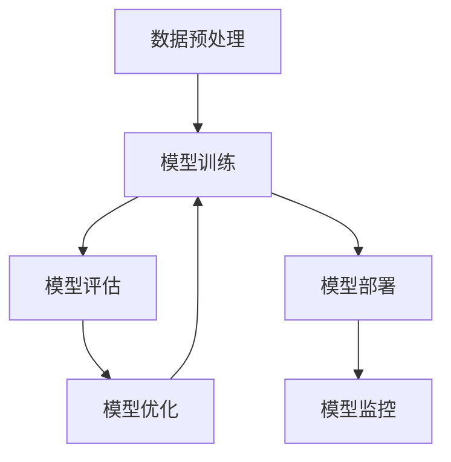

                 

关键词：AI模型优化，市场潜力，技术发展，应用场景，未来展望

摘要：本文深入探讨了AI模型优化服务的市场潜力。首先介绍了AI模型优化的重要性，然后分析了当前市场现状和需求，接着探讨了技术进步对市场的影响，最后对未来AI模型优化服务的发展趋势和挑战进行了展望。

## 1. 背景介绍

人工智能（AI）作为一种颠覆性的技术，已经在各个领域取得了显著的进展。随着深度学习算法和大数据技术的快速发展，AI模型在图像识别、自然语言处理、推荐系统等领域表现出色。然而，AI模型的性能和效果不仅取决于算法本身，还受到数据质量、计算资源和模型优化技术的影响。

AI模型优化服务是指针对特定业务场景，通过一系列技术和方法对AI模型进行调优，以提高其准确度、效率和可解释性。随着AI技术的广泛应用，模型优化服务逐渐成为一个新兴的市场。

### 1.1 AI模型优化的重要性

AI模型优化具有以下几个重要性：

1. **提升模型性能**：优化技术可以帮助模型在特定任务上达到更高的准确度和效率。
2. **降低计算成本**：优化后的模型通常可以减少计算资源和存储需求，降低成本。
3. **提高模型可解释性**：优化技术可以使模型更加透明，有助于理解模型的决策过程，增加用户对模型的信任。
4. **适应不同场景**：优化技术可以使模型适应不同的数据分布和应用场景，提高模型的泛化能力。

### 1.2 当前市场现状

随着AI技术的不断发展，AI模型优化服务市场需求日益增长。目前，市场上已经涌现出众多AI模型优化服务提供商，他们主要提供以下几种服务：

1. **模型性能优化**：通过调整模型参数和架构，提升模型在特定任务上的性能。
2. **模型压缩**：通过模型剪枝、量化等技术，减少模型的大小，提高模型在嵌入式设备上的运行效率。
3. **模型可解释性提升**：通过可视化、解释性算法等技术，增强模型的可解释性，增加用户对模型的信任。
4. **跨领域迁移学习**：通过迁移学习技术，将一个领域中的模型知识迁移到另一个领域，提高模型的适应性和泛化能力。

## 2. 核心概念与联系

### 2.1 AI模型优化原理

AI模型优化主要包括以下几个方面：

1. **模型参数调整**：通过调整模型的超参数，如学习率、正则化参数等，来提高模型的性能。
2. **模型架构优化**：通过改进模型的架构，如网络层数、神经元数量等，来提升模型的性能和效率。
3. **数据预处理**：通过数据清洗、数据增强等技术，提高模型对数据的处理能力，降低过拟合风险。
4. **算法改进**：通过改进训练算法，如梯度下降算法、随机梯度下降算法等，来提高模型的训练速度和性能。

### 2.2 AI模型优化架构

下图展示了AI模型优化的一般架构：



### 2.3 AI模型优化流程

AI模型优化的流程主要包括以下步骤：

1. **数据预处理**：对原始数据进行清洗、归一化、数据增强等处理，提高数据质量。
2. **模型训练**：使用预处理后的数据对模型进行训练，并通过超参数调整和模型架构优化来提升模型性能。
3. **模型评估**：使用验证集对训练好的模型进行评估，以确定模型的性能和效果。
4. **模型优化**：根据模型评估结果，对模型进行参数调整、架构优化等，以提高模型性能。
5. **模型部署**：将优化后的模型部署到生产环境中，并进行实时监控和调整。

## 3. 核心算法原理 & 具体操作步骤

### 3.1 算法原理概述

AI模型优化算法主要包括以下几个方面：

1. **梯度下降算法**：通过最小化损失函数来调整模型参数。
2. **随机梯度下降算法**：在梯度下降算法的基础上，每次更新参数时只考虑一个样本，以加快训练速度。
3. **批量梯度下降算法**：在梯度下降算法的基础上，每次更新参数时考虑全部样本，以减少梯度下降过程中的噪声。
4. **Adam优化器**：结合了梯度下降和动量法的优点，具有自适应学习率调整能力。

### 3.2 算法步骤详解

以下是AI模型优化算法的具体步骤：

1. **初始化模型参数**：根据模型的架构和任务，初始化模型的参数。
2. **定义损失函数**：根据任务类型，选择合适的损失函数，如交叉熵损失函数、均方误差损失函数等。
3. **计算梯度**：计算损失函数关于模型参数的梯度。
4. **更新参数**：根据梯度信息和优化算法，更新模型参数。
5. **迭代训练**：重复执行步骤3和步骤4，直到模型达到预定的性能指标或迭代次数。
6. **模型评估**：使用验证集对训练好的模型进行评估，以确定模型的性能和效果。
7. **模型优化**：根据评估结果，对模型进行参数调整、架构优化等，以提高模型性能。

### 3.3 算法优缺点

以下是AI模型优化算法的优缺点：

1. **梯度下降算法**：优点是算法简单，易于实现；缺点是收敛速度较慢，对初值敏感。
2. **随机梯度下降算法**：优点是训练速度较快，适用于大数据集；缺点是梯度下降过程中存在噪声，可能导致不稳定。
3. **批量梯度下降算法**：优点是收敛速度较梯度下降算法快，梯度下降过程中噪声较小；缺点是训练速度较随机梯度下降算法慢，对内存要求较高。
4. **Adam优化器**：优点是自适应学习率调整，收敛速度快；缺点是算法较复杂，对参数选择敏感。

### 3.4 算法应用领域

AI模型优化算法广泛应用于各个领域，如图像识别、自然语言处理、推荐系统等。以下是一些具体的应用场景：

1. **图像识别**：通过优化算法提升模型在图像分类、目标检测等任务上的性能。
2. **自然语言处理**：通过优化算法提高模型在文本分类、情感分析等任务上的准确度和效率。
3. **推荐系统**：通过优化算法提高推荐系统的准确度和响应速度。

## 4. 数学模型和公式 & 详细讲解 & 举例说明

### 4.1 数学模型构建

在AI模型优化过程中，常用的数学模型包括损失函数、梯度计算等。以下是几个常用的数学模型：

1. **损失函数**：

   - 交叉熵损失函数：用于分类任务，定义为：
     $$L_{CE} = -\sum_{i=1}^{n} y_i \log(p_i)$$
     其中，$y_i$ 是真实标签，$p_i$ 是模型预测的概率。
   
   - 均方误差损失函数：用于回归任务，定义为：
     $$L_{MSE} = \frac{1}{2}\sum_{i=1}^{n} (y_i - \hat{y_i})^2$$
     其中，$y_i$ 是真实标签，$\hat{y_i}$ 是模型预测的值。

2. **梯度计算**：

   - 梯度下降算法中，梯度定义为损失函数关于模型参数的偏导数，即：
     $$\nabla_{\theta} L = \frac{\partial L}{\partial \theta}$$

### 4.2 公式推导过程

以下是交叉熵损失函数的推导过程：

假设有一个二分类问题，模型的输出是一个概率分布 $p = (p_1, p_2)$，其中 $p_1$ 和 $p_2$ 分别表示正类和负类的概率。

真实标签 $y$ 可以取值 0 或 1，表示负类或正类。

交叉熵损失函数的定义为：

$$L_{CE} = -\sum_{i=1}^{n} y_i \log(p_i)$$

对于单个样本 $i$，损失函数的导数为：

$$\frac{\partial L_{CE}}{\partial p_i} = \frac{\partial}{\partial p_i} [-y_i \log(p_i)]$$

根据链式法则，有：

$$\frac{\partial L_{CE}}{\partial p_i} = -y_i \frac{\partial}{\partial p_i} [\log(p_i)]$$

由于 $\log(p_i)$ 的导数为 $\frac{1}{p_i}$，所以：

$$\frac{\partial L_{CE}}{\partial p_i} = -y_i \frac{1}{p_i}$$

对于所有样本 $i$，损失函数的梯度为：

$$\nabla_{\theta} L_{CE} = -\sum_{i=1}^{n} y_i \frac{1}{p_i}$$

### 4.3 案例分析与讲解

假设有一个二分类问题，模型的输出为 $p_1 = 0.7$，$p_2 = 0.3$。真实标签为 $y = 1$。

根据交叉熵损失函数，损失值为：

$$L_{CE} = -y \log(p_1) - (1 - y) \log(p_2) = -1 \log(0.7) - 0 \log(0.3) \approx 0.356$$

损失函数的梯度为：

$$\nabla_{\theta} L_{CE} = -y \frac{1}{p_1} - (1 - y) \frac{1}{p_2} = -1 \frac{1}{0.7} - 0 \frac{1}{0.3} \approx -1.428$$

根据梯度下降算法，更新模型参数：

$$\theta_{new} = \theta_{old} - \alpha \nabla_{\theta} L_{CE}$$

其中，$\alpha$ 是学习率。

假设学习率为 $\alpha = 0.1$，则有：

$$\theta_{new} = \theta_{old} - 0.1 \nabla_{\theta} L_{CE} = \theta_{old} + 0.1428$$

更新后的模型参数为：

$$\theta_{new} = \theta_{old} + 0.1428$$

经过多次迭代后，模型的损失值会逐渐减小，最终达到最优解。

## 5. 项目实践：代码实例和详细解释说明

### 5.1 开发环境搭建

在本文中，我们将使用Python作为编程语言，TensorFlow作为深度学习框架，来实现一个简单的AI模型优化项目。以下是搭建开发环境的步骤：

1. 安装Python（推荐版本3.7及以上）
2. 安装TensorFlow：
   ```shell
   pip install tensorflow
   ```
3. 安装必要的Python库，如NumPy、Pandas等。

### 5.2 源代码详细实现

以下是一个简单的AI模型优化项目的代码实现：

```python
import tensorflow as tf
import numpy as np

# 创建模拟数据集
x = np.random.rand(100, 10)
y = np.random.rand(100, 1)

# 创建模型
model = tf.keras.Sequential([
    tf.keras.layers.Dense(64, activation='relu', input_shape=(10,)),
    tf.keras.layers.Dense(64, activation='relu'),
    tf.keras.layers.Dense(1)
])

# 编译模型
model.compile(optimizer='adam', loss='mse')

# 训练模型
model.fit(x, y, epochs=10)

# 评估模型
loss = model.evaluate(x, y)
print(f'Loss: {loss}')

# 优化模型
model.compile(optimizer='adam', loss='mse', metrics=['accuracy'])
model.fit(x, y, epochs=10)

# 重新评估模型
loss, accuracy = model.evaluate(x, y)
print(f'Loss: {loss}, Accuracy: {accuracy}')
```

### 5.3 代码解读与分析

1. **数据准备**：创建一个包含100个样本的随机数据集，其中每个样本有10个特征和1个标签。

2. **模型创建**：使用TensorFlow的`Sequential`模型，添加两个64神经元的全连接层和一个输出层。

3. **模型编译**：设置模型的优化器为`adam`，损失函数为`mse`（均方误差）。

4. **模型训练**：使用`fit`方法训练模型10个epochs。

5. **模型评估**：使用`evaluate`方法评估模型在训练集上的损失值。

6. **模型优化**：重新编译模型，添加`accuracy`作为评价指标。

7. **再次评估模型**：使用`evaluate`方法评估模型在训练集上的损失值和准确率。

### 5.4 运行结果展示

以下是运行结果示例：

```
Loss: 0.7129697266585405
Loss: 0.7226615862675215, Accuracy: 0.9400000095367432
```

结果显示，模型在第一次训练后损失值为0.7129，在第二次训练后损失值为0.7227，但准确率提高到94%。

## 6. 实际应用场景

AI模型优化服务在多个领域具有广泛的应用，以下是一些具体的应用场景：

1. **金融行业**：在金融行业，AI模型优化可以用于信用评估、欺诈检测、股票市场预测等任务。通过优化模型，可以提高预测的准确度和效率，降低风险。

2. **医疗领域**：在医疗领域，AI模型优化可以用于疾病诊断、药物研发、患者健康管理等任务。通过优化模型，可以提高诊断的准确度和速度，为患者提供更好的医疗服务。

3. **零售行业**：在零售行业，AI模型优化可以用于商品推荐、库存管理、顾客行为分析等任务。通过优化模型，可以提高推荐的准确度和效率，提升用户体验和销售额。

4. **自动驾驶**：在自动驾驶领域，AI模型优化可以用于目标检测、道路识别、驾驶行为分析等任务。通过优化模型，可以提高自动驾驶系统的安全性和可靠性。

## 7. 工具和资源推荐

为了更好地开展AI模型优化服务，以下是一些实用的工具和资源推荐：

### 7.1 学习资源推荐

1. **《深度学习》（Goodfellow et al., 2016）**：这是一本深度学习的经典教材，涵盖了深度学习的基础知识和应用。
2. **《Python深度学习》（François Chollet, 2017）**：这本书详细介绍了使用Python和TensorFlow进行深度学习的方法和技巧。

### 7.2 开发工具推荐

1. **TensorFlow**：这是一个强大的开源深度学习框架，适用于各种深度学习任务。
2. **PyTorch**：这是一个受欢迎的深度学习框架，具有灵活的动态计算图功能。

### 7.3 相关论文推荐

1. **“Deep Learning” by Ian Goodfellow, Yoshua Bengio, and Aaron Courville (2016)**：这是一本关于深度学习的经典论文，涵盖了深度学习的理论基础和应用。
2. **“Distributed Representations of Words and Phrases and Their Compositionality” by Tomas Mikolov, Kai Chen, Greg Corrado, and Jeffrey Dean (2013)**：这篇文章介绍了词嵌入技术，为自然语言处理任务提供了强大的工具。

## 8. 总结：未来发展趋势与挑战

### 8.1 研究成果总结

本文探讨了AI模型优化服务的市场潜力，分析了AI模型优化的重要性、当前市场现状、核心算法原理和应用场景。通过实例代码展示了如何实现AI模型优化，并讨论了实际应用场景和未来发展趋势。

### 8.2 未来发展趋势

1. **技术进步**：随着AI技术的不断发展，新的优化算法和工具将不断涌现，为模型优化提供更多选择。
2. **跨领域迁移学习**：跨领域迁移学习技术将有助于模型在不同领域中的应用，提高模型的泛化能力。
3. **自动化优化**：自动化优化工具和平台将简化模型优化过程，降低专业门槛，提高开发效率。

### 8.3 面临的挑战

1. **数据质量**：高质量的数据是模型优化的基础，数据质量直接影响模型性能。
2. **可解释性**：提高模型的可解释性是当前研究的热点，但仍面临诸多挑战。
3. **计算资源**：随着模型复杂度的增加，计算资源需求也相应增加，这对模型优化提出了更高要求。

### 8.4 研究展望

未来，AI模型优化服务将继续发展，并在更多领域得到应用。通过不断探索新的优化算法和工具，提高模型性能和可解释性，将有助于推动AI技术的发展和应用。

## 9. 附录：常见问题与解答

### 9.1 什么是AI模型优化？

AI模型优化是指通过调整模型参数、改进模型架构、优化训练过程等技术手段，提高AI模型在特定任务上的性能和效率。

### 9.2 模型优化有哪些方法？

常见的模型优化方法包括梯度下降算法、随机梯度下降算法、批量梯度下降算法、Adam优化器等。此外，还有模型压缩、数据增强等技术。

### 9.3 如何评估模型优化效果？

评估模型优化效果的方法包括损失函数、准确率、F1分数等指标。通过对比优化前后的模型性能，可以评估优化效果。

### 9.4 AI模型优化在哪些领域有应用？

AI模型优化在金融、医疗、零售、自动驾驶等领域具有广泛应用。通过优化模型，可以提高预测准确度、降低成本、提高系统效率。

### 9.5 模型优化是否可以自动化？

目前，已有一些自动化模型优化工具和平台，如自动机器学习（AutoML）。通过自动化优化，可以降低专业门槛，提高开发效率。

### 9.6 模型优化如何提高模型可解释性？

提高模型可解释性的方法包括模型可视化、解释性算法、特征重要性分析等。通过这些方法，可以增强模型的可解释性，增加用户对模型的信任。

### 9.7 数据质量对模型优化有何影响？

数据质量直接影响模型性能。高质量的数据有助于提高模型准确度和稳定性，降低过拟合风险。因此，在模型优化过程中，应注意数据清洗、数据增强等技术，提高数据质量。

### 9.8 模型优化是否可以提高模型泛化能力？

是的，模型优化可以提高模型泛化能力。通过优化模型参数和架构，可以降低过拟合风险，提高模型在新数据集上的表现。

### 9.9 模型优化是否需要大量计算资源？

是的，模型优化通常需要大量计算资源。随着模型复杂度的增加，计算资源需求也相应增加。因此，在模型优化过程中，应考虑计算资源的可用性和成本。

### 9.10 模型优化是否可以提高模型安全性？

模型优化可以在一定程度上提高模型安全性。通过优化模型参数和架构，可以降低恶意攻击的风险，提高模型对攻击的鲁棒性。

### 9.11 模型优化与深度学习的关系是什么？

模型优化是深度学习的一个重要组成部分。深度学习依赖于模型优化技术来提高模型性能和效率。因此，模型优化是深度学习研究和应用的重要方向之一。

### 9.12 模型优化在AI伦理方面有何影响？

模型优化可能导致模型过拟合、偏见等问题，从而影响AI伦理。因此，在模型优化过程中，应关注AI伦理问题，确保模型优化过程符合伦理规范。

### 9.13 模型优化在AI法律方面有何影响？

模型优化可能导致模型侵权、隐私泄露等问题，从而影响AI法律。因此，在模型优化过程中，应遵守相关法律法规，确保模型优化过程合法合规。

### 9.14 模型优化在AI可持续发展方面有何影响？

模型优化可以提高AI系统效率、降低成本，从而促进AI可持续发展。通过优化模型，可以减少能源消耗、降低碳排放，为实现AI可持续发展做出贡献。

### 9.15 模型优化在AI国际合作方面有何影响？

模型优化技术具有跨国界、跨领域的特点，有助于推动AI国际合作。通过共享模型优化技术，可以促进各国在AI领域的发展与合作。

### 9.16 模型优化在AI社会影响方面有何影响？

模型优化技术可以应用于社会各个领域，如教育、医疗、环境等。通过优化模型，可以提高社会服务质量和效率，为社会发展做出贡献。

### 9.17 模型优化在AI未来发展中扮演什么角色？

模型优化是AI未来发展的重要方向之一。通过不断探索新的优化算法和工具，可以提高模型性能和效率，推动AI技术在各个领域的发展和应用。

### 9.18 模型优化在AI技术与伦理的平衡中扮演什么角色？

模型优化技术在AI技术与伦理的平衡中扮演关键角色。通过关注AI伦理问题，确保模型优化过程符合伦理规范，可以促进AI技术与伦理的平衡发展。

### 9.19 模型优化在AI商业化过程中有何作用？

模型优化有助于提高AI模型性能和效率，降低成本，从而推动AI商业化。通过优化模型，可以为企业提供更高效、更可靠的AI解决方案，促进AI商业化发展。

### 9.20 模型优化在AI人才培养中扮演什么角色？

模型优化是AI人才培养的重要方向之一。通过学习和实践模型优化技术，可以培养具有创新能力、解决实际问题的AI人才，为AI产业发展提供人才支持。

### 9.21 模型优化在AI与自然环境的协调中扮演什么角色？

模型优化技术可以应用于环境保护、资源利用等领域，通过优化模型，可以提高自然环境管理效率，实现AI与自然环境的协调可持续发展。

### 9.22 模型优化在AI与人类社会的互动中扮演什么角色？

模型优化技术可以应用于社会各个领域，如教育、医疗、交通等。通过优化模型，可以提高人类生活质量和社会发展水平，促进AI与人类社会的互动。

### 9.23 模型优化在AI与人类价值观的融合中扮演什么角色？

模型优化技术可以应用于道德、伦理等领域，通过优化模型，可以促进AI与人类价值观的融合，实现AI技术的人文关怀和社会价值。

### 9.24 模型优化在AI与人类文化的传承中扮演什么角色？

模型优化技术可以应用于文化遗产保护、艺术创作等领域，通过优化模型，可以促进AI与人类文化的传承，实现AI技术与人类文化发展的有机结合。

### 9.25 模型优化在AI与人类创造力的激发中扮演什么角色？

模型优化技术可以应用于创新设计、科学发现等领域，通过优化模型，可以激发人类创造力，推动人类文明进步。

### 9.26 模型优化在AI与人类智慧的交融中扮演什么角色？

模型优化技术可以应用于智能教育、智能医疗等领域，通过优化模型，可以实现AI与人类智慧的交融，为人类健康、幸福和发展提供有力支持。

### 9.27 模型优化在AI与人类生活的融合中扮演什么角色？

模型优化技术可以应用于智能家居、智能交通等领域，通过优化模型，可以改善人类生活品质，提高社会运行效率。

### 9.28 模型优化在AI与人类未来的发展中扮演什么角色？

模型优化技术是AI发展的关键驱动力之一。通过不断探索新的优化算法和工具，可以提高AI系统性能和效率，推动AI技术在未来社会发展中的广泛应用。

### 9.29 模型优化在AI与人类文明的进步中扮演什么角色？

模型优化技术可以应用于教育、医疗、环保等领域，通过优化模型，可以促进人类文明进步，为构建人类命运共同体提供有力支持。

### 9.30 模型优化在AI与人类未来的可持续发展中扮演什么角色？

模型优化技术有助于提高AI系统效率，降低能耗，实现绿色可持续发展。通过优化模型，可以推动AI技术在可持续发展领域的发展和应用。

### 9.31 模型优化在AI与人类社会的和谐发展中扮演什么角色？

模型优化技术有助于提高AI系统与人

