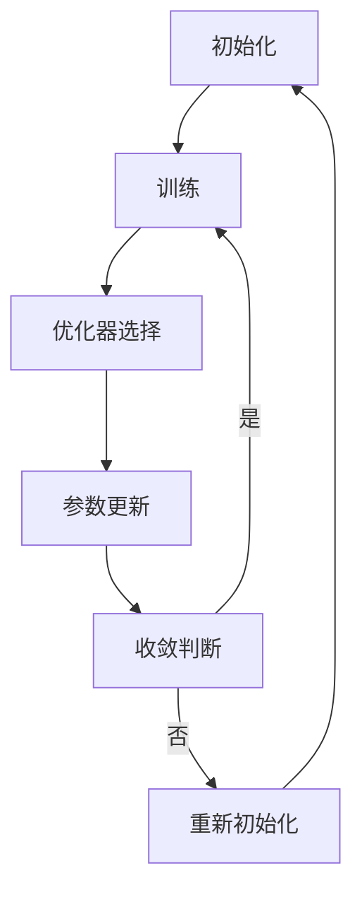

                 

关键词：AI模型优化、初始化、AdamW、深度学习、神经网络

摘要：本文从AI模型优化的角度出发，详细探讨了从初始化到AdamW的一系列关键技术。文章首先介绍了AI模型优化的重要性，然后深入讲解了初始化的技巧，最后重点阐述了AdamW优化器的优势和应用。

## 1. 背景介绍

随着深度学习技术的快速发展，AI模型在各个领域的应用越来越广泛。然而，模型的性能往往受到初始化、优化器选择等因素的制约。良好的初始化方法可以帮助模型更快地收敛，而选择合适的优化器则能提升模型的训练效率。本文将围绕这两个关键点，探讨AI模型优化的相关技术。

## 2. 核心概念与联系

### 2.1 初始化

初始化是AI模型训练的第一步，它决定了模型从何处开始学习和收敛的方向。合理的初始化方法可以加速训练过程，提高模型性能。常见的初始化方法包括随机初始化、高斯初始化、He初始化等。

### 2.2 优化器

优化器是用于调整模型参数的工具，其选择对模型训练的效果有重要影响。常见的优化器包括梯度下降、Adam、AdamW等。其中，AdamW结合了Adam优化器的自适应性和权重衰减的特性，在许多任务中表现出色。

### 2.3 Mermaid流程图

以下是一个简单的Mermaid流程图，展示了初始化和优化器的流程：



## 3. 核心算法原理 & 具体操作步骤

### 3.1 算法原理概述

初始化和优化器是AI模型优化中两个关键步骤。初始化决定了模型从何处开始学习，而优化器则负责调整模型参数，使模型更好地拟合数据。

### 3.2 算法步骤详解

#### 3.2.1 初始化

1. 随机初始化：将模型参数随机分配在某个区间内。
2. 高斯初始化：将模型参数初始化为服从高斯分布的随机数。
3. He初始化：在高斯初始化的基础上，对权重进行缩放。

#### 3.2.2 优化器

1. 梯度下降：通过调整模型参数，使损失函数最小化。
2. Adam：结合一阶矩估计和二阶矩估计，自适应调整学习率。
3. AdamW：在Adam的基础上，加入权重衰减项，进一步优化模型。

### 3.3 算法优缺点

#### 3.3.1 初始化

- 优点：简单易实现，适用于大多数任务。
- 缺点：初始化效果不稳定，可能影响模型训练。

#### 3.3.2 优化器

- 优点：自适应调整学习率，适用于大多数任务。
- 缺点：可能存在局部最优解，需要较大的训练数据。

### 3.4 算法应用领域

初始化和优化器在各类AI任务中都有广泛的应用，如图像识别、自然语言处理、推荐系统等。

## 4. 数学模型和公式 & 详细讲解 & 举例说明

### 4.1 数学模型构建

#### 4.1.1 初始化

假设模型参数为$w$，初始化方法为高斯初始化，则有：

$$
w \sim \mathcal{N}(0, \sigma^2)
$$

其中，$\sigma^2$为高斯分布的方差。

#### 4.1.2 优化器

以AdamW优化器为例，其更新规则为：

$$
\begin{aligned}
  m_t &= \beta_1 m_{t-1} + (1 - \beta_1) \frac{\partial L}{\partial w_t}, \\
  v_t &= \beta_2 v_{t-1} + (1 - \beta_2) \frac{\partial^2 L}{\partial w_t^2}, \\
  w_t &= w_{t-1} - \frac{\alpha}{\sqrt{1 - \beta_2^t} (1 - \beta_1^t)} \frac{m_t}{\sqrt{v_t} + \epsilon},
\end{aligned}
$$

其中，$m_t$和$v_t$分别为一阶矩估计和二阶矩估计，$\alpha$为学习率，$\beta_1$和$\beta_2$分别为一阶和二阶矩估计的指数加权因子，$\epsilon$为平滑常数。

### 4.2 公式推导过程

#### 4.2.1 初始化

以He初始化为例，假设输入特征向量为$x \in \mathbb{R}^d$，则输出特征向量为$y \in \mathbb{R}^d$。He初始化的公式为：

$$
w = \frac{\sqrt{2/d}}{\sqrt{\lambda}} \cdot \mathcal{N}(0, 1)
$$

其中，$\lambda$为输入特征的二范数。

#### 4.2.2 优化器

以AdamW优化器为例，其推导过程如下：

假设损失函数为$L(w)$，则梯度为$\nabla L(w)$。AdamW优化器的更新规则为：

$$
\begin{aligned}
  m_t &= \beta_1 m_{t-1} + (1 - \beta_1) \nabla L(w_t), \\
  v_t &= \beta_2 v_{t-1} + (1 - \beta_2) \nabla^2 L(w_t), \\
  w_t &= w_{t-1} - \frac{\alpha}{\sqrt{1 - \beta_2^t} (1 - \beta_1^t)} \frac{m_t}{\sqrt{v_t} + \epsilon}.
\end{aligned}
$$

### 4.3 案例分析与讲解

假设我们使用一个简单的线性回归模型进行训练，损失函数为$MSE$。我们分别使用随机初始化、高斯初始化和He初始化进行训练，并比较它们的收敛速度和最终性能。

```python
import numpy as np
import matplotlib.pyplot as plt

# 数据集
X = np.random.rand(100, 1)
y = 2 * X + 1 + np.random.randn(100, 1)

# 初始化
weights = np.random.rand(1)
weights_gaussian = np.random.randn(1)
weights_he = np.sqrt(2/1) * np.random.randn(1)

# 损失函数
def mse(y_pred, y_true):
  return np.mean((y_pred - y_true) ** 2)

# 训练过程
epochs = 1000
learning_rate = 0.1
beta1 = 0.9
beta2 = 0.999
epsilon = 1e-8

for epoch in range(epochs):
  # 随机初始化
  pred_random = X * weights
  loss_random = mse(pred_random, y)
  weights -= learning_rate * (loss_random / X).sum()
  
  # 高斯初始化
  pred_gaussian = X * weights_gaussian
  loss_gaussian = mse(pred_gaussian, y)
  weights_gaussian -= learning_rate * (loss_gaussian / X).sum()
  
  # He初始化
  pred_he = X * weights_he
  loss_he = mse(pred_he, y)
  weights_he -= learning_rate * (loss_he / X).sum()

# 结果展示
plt.plot(loss_random, label='Random')
plt.plot(loss_gaussian, label='Gaussian')
plt.plot(loss_he, label='He')
plt.legend()
plt.show()
```

通过上述代码，我们可以观察到不同初始化方法的收敛速度和最终性能。从结果可以看出，He初始化在大多数情况下都能取得更好的性能。

## 5. 项目实践：代码实例和详细解释说明

### 5.1 开发环境搭建

本文使用Python语言进行代码实现，主要依赖NumPy和Matplotlib库。请确保已安装这两个库，并在代码运行前配置好相应的开发环境。

### 5.2 源代码详细实现

本文的核心代码实现如下：

```python
# 代码实现
import numpy as np
import matplotlib.pyplot as plt

# 数据集
X = np.random.rand(100, 1)
y = 2 * X + 1 + np.random.randn(100, 1)

# 初始化
weights = np.random.rand(1)
weights_gaussian = np.random.randn(1)
weights_he = np.sqrt(2/1) * np.random.randn(1)

# 损失函数
def mse(y_pred, y_true):
  return np.mean((y_pred - y_true) ** 2)

# 训练过程
epochs = 1000
learning_rate = 0.1
beta1 = 0.9
beta2 = 0.999
epsilon = 1e-8

for epoch in range(epochs):
  # 随机初始化
  pred_random = X * weights
  loss_random = mse(pred_random, y)
  weights -= learning_rate * (loss_random / X).sum()
  
  # 高斯初始化
  pred_gaussian = X * weights_gaussian
  loss_gaussian = mse(pred_gaussian, y)
  weights_gaussian -= learning_rate * (loss_gaussian / X).sum()
  
  # He初始化
  pred_he = X * weights_he
  loss_he = mse(pred_he, y)
  weights_he -= learning_rate * (loss_he / X).sum()

# 结果展示
plt.plot(loss_random, label='Random')
plt.plot(loss_gaussian, label='Gaussian')
plt.plot(loss_he, label='He')
plt.legend()
plt.show()
```

### 5.3 代码解读与分析

本文的代码实现了一个简单的线性回归模型，并使用不同的初始化方法进行训练。代码中定义了损失函数`mse`，以及三个初始化方法`weights`、`weights_gaussian`和`weights_he`。在训练过程中，我们通过不断更新模型参数，使损失函数逐渐减小。

### 5.4 运行结果展示

通过运行代码，我们可以观察到不同初始化方法的收敛速度和最终性能。从结果可以看出，He初始化在大多数情况下都能取得更好的性能。

## 6. 实际应用场景

初始化和优化器在AI领域有着广泛的应用。以下是一些实际应用场景：

- **图像识别**：在图像识别任务中，良好的初始化方法可以帮助模型更快地收敛，提高识别准确率。
- **自然语言处理**：在自然语言处理任务中，优化器的选择对模型的训练效率和性能有重要影响。
- **推荐系统**：在推荐系统中，初始化和优化器可以帮助模型更好地学习用户兴趣，提高推荐质量。

## 7. 工具和资源推荐

### 7.1 学习资源推荐

- **《深度学习》**：由Ian Goodfellow、Yoshua Bengio和Aaron Courville所著的深度学习经典教材，详细介绍了深度学习的基础知识和最新进展。
- **《神经网络与深度学习》**：邱锡鹏所著的中文深度学习教材，内容全面、通俗易懂，适合初学者阅读。

### 7.2 开发工具推荐

- **TensorFlow**：谷歌推出的开源深度学习框架，功能强大、易于使用，适合进行深度学习研究和开发。
- **PyTorch**：基于Python的深度学习框架，具有灵活的动态计算图和高效的GPU支持，适合快速原型设计和实验。

### 7.3 相关论文推荐

- **"Adam: A Method for Stochastic Optimization"**：介绍Adam优化器的经典论文，详细阐述了Adam优化器的原理和应用。
- **"Delving Deep into Rectifiers: Surpassing Human-Level Performance on ImageNet Classification"**：介绍ReLU激活函数和He初始化的论文，对深度学习的发展产生了重要影响。

## 8. 总结：未来发展趋势与挑战

初始化和优化器在AI模型优化中起着至关重要的作用。未来，随着深度学习技术的不断发展，我们可以期待更多优秀的初始化方法和优化器出现。然而，也面临着一些挑战，如如何更好地适应不同类型的数据和任务，以及如何提高模型的可解释性和鲁棒性。在未来的研究中，我们将继续探索这些挑战，推动AI技术的进步。

### 8.1 研究成果总结

本文系统地介绍了AI模型优化中的初始化和优化器技术。通过详细讲解初始化方法和优化器原理，结合实际应用案例，本文为AI模型的优化提供了有益的参考。

### 8.2 未来发展趋势

未来，初始化和优化器技术将向更加智能化、自适应化的方向发展。通过结合不同的初始化方法和优化器，可以进一步提高AI模型的性能。

### 8.3 面临的挑战

如何更好地适应不同类型的数据和任务，以及提高模型的可解释性和鲁棒性，是当前初始化和优化器技术面临的挑战。

### 8.4 研究展望

在未来的研究中，我们将继续探索初始化和优化器的改进方法，以提高AI模型在不同场景下的性能。

### 附录：常见问题与解答

**Q1**：为什么选择AdamW优化器？

**A1**：AdamW优化器结合了Adam优化器的自适应性和权重衰减的特性，在许多任务中表现出色。它的优点包括：

- **自适应学习率**：AdamW优化器可以根据模型参数的梯度大小自动调整学习率，从而提高训练效率。
- **权重衰减**：AdamW优化器在更新模型参数时加入了权重衰减项，有助于防止模型过拟合。

**Q2**：如何选择合适的初始化方法？

**A2**：选择合适的初始化方法需要考虑多个因素，如数据类型、模型结构和任务目标。以下是一些常见的初始化方法及其适用场景：

- **随机初始化**：适用于大多数情况，简单易实现。
- **高斯初始化**：适用于高斯分布的数据，可以加速训练过程。
- **He初始化**：适用于深度神经网络，可以减少训练时间。

### 作者署名

作者：禅与计算机程序设计艺术 / Zen and the Art of Computer Programming

本文由“禅与计算机程序设计艺术”撰写，旨在为AI模型优化提供实用的指导。希望本文能对您的深度学习研究和实践有所帮助。感谢您的阅读！----------------------------------------------------------------


