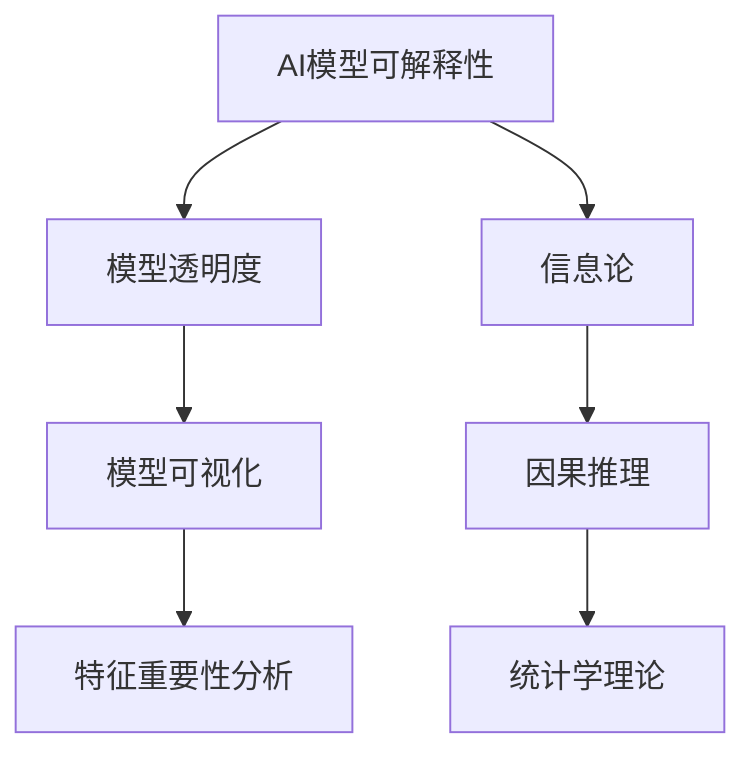

                 

关键词：AI模型可解释性、透明AI、Lepton AI、算法原理、应用场景、未来展望

> 摘要：随着人工智能的迅猛发展，AI模型的可解释性问题愈发重要。本文旨在深入探讨AI模型可解释性的重要性、理论基础、核心算法原理及其应用领域。本文将以Lepton AI为例，介绍透明AI的实现方法，并通过具体案例展示其在实际中的应用。最后，我们将对AI模型可解释性的未来发展进行展望。

## 1. 背景介绍

近年来，人工智能（AI）技术取得了飞速发展，已经深入到我们的日常生活、医疗、金融、交通等各个领域。然而，随着AI模型越来越复杂，其黑箱性质也愈发突出，导致了AI模型的透明性问题。透明AI，即AI模型的可解释性，成为当前学术界和工业界关注的焦点。

可解释性是指AI模型能够向用户清晰地展示其决策过程，使得用户能够理解模型为何作出特定决策。这对于增强用户对AI模型的信任度、提升模型的透明度和公平性具有重要意义。然而，当前大多数AI模型都是高度复杂的黑箱模型，难以对其进行解释。

Lepton AI是一款专注于AI模型可解释性的开源工具，旨在为开发者提供透明AI的实现方法。通过Lepton AI，开发者可以将复杂的AI模型转化为易于理解的形式，使得用户能够更好地理解模型的决策过程。本文将围绕Lepton AI展开，探讨AI模型可解释性的重要性和实现方法。

## 2. 核心概念与联系

### 2.1 AI模型可解释性的核心概念

AI模型可解释性包括以下几个方面：

1. **模型的可解释性**：模型的可解释性是指模型的结构和参数易于理解，用户可以清晰地了解模型是如何工作的。
2. **特征的解释性**：特征的解释性是指模型所使用的特征对预测结果的贡献程度易于理解。
3. **决策的可解释性**：决策的可解释性是指模型的决策过程和依据易于理解，用户可以了解模型是如何作出决策的。

### 2.2 AI模型可解释性的理论基础

AI模型可解释性的理论基础主要包括以下几个方面：

1. **信息论**：信息论提供了量化不确定性和信息量的方法，有助于理解模型决策过程中的信息传递。
2. **因果推理**：因果推理是一种通过分析变量之间的关系来确定因果关系的理论，有助于理解模型决策的因果关系。
3. **统计学理论**：统计学理论提供了模型参数估计和假设检验的方法，有助于理解模型参数的统计性质。

### 2.3 AI模型可解释性的架构

AI模型可解释性的架构主要包括以下几个方面：

1. **模型透明度**：模型透明度是指模型的内部结构和参数是否易于理解和解释。
2. **模型可视化**：模型可视化是指将模型的内部结构和参数以图形化的方式呈现，使得用户可以直观地理解模型的工作原理。
3. **特征重要性分析**：特征重要性分析是指分析模型中各个特征的贡献程度，帮助用户了解哪些特征对模型决策具有重要影响。

### 2.4 AI模型可解释性的 Mermaid 流程图



## 3. 核心算法原理 & 具体操作步骤

### 3.1 算法原理概述

Lepton AI是一款基于神经网络的可解释性工具，其核心算法原理主要包括以下几个方面：

1. **模型转换**：Lepton AI可以将复杂的神经网络模型转换为易于解释的形式，例如决策树、规则集等。
2. **可视化**：Lepton AI提供了多种可视化工具，例如热力图、依赖图等，帮助用户直观地了解模型的决策过程。
3. **特征重要性分析**：Lepton AI可以对模型中的各个特征进行重要性分析，帮助用户了解哪些特征对模型决策具有重要影响。

### 3.2 算法步骤详解

1. **模型转换**：

   - 首先，将原始的神经网络模型转换为决策树或规则集。

   - 然后，对决策树或规则集进行简化，去除冗余的节点和规则。

   - 最后，将简化后的决策树或规则集转换为易于解释的形式，例如文本或图形。

2. **可视化**：

   - 首先，将模型的可视化结果以热力图、依赖图等形式呈现。

   - 然后，根据用户的需要，调整可视化的参数和展示形式。

   - 最后，用户可以直观地了解模型的决策过程。

3. **特征重要性分析**：

   - 首先，对模型中的各个特征进行重要性分析，计算每个特征对模型决策的贡献程度。

   - 然后，将特征重要性分析的结果以热力图、条形图等形式呈现。

   - 最后，用户可以了解哪些特征对模型决策具有重要影响。

### 3.3 算法优缺点

**优点**：

1. **易于解释**：Lepton AI可以将复杂的神经网络模型转换为易于解释的形式，使得用户可以更好地理解模型的工作原理。
2. **可视化**：Lepton AI提供了多种可视化工具，使得用户可以直观地了解模型的决策过程。
3. **特征重要性分析**：Lepton AI可以对模型中的各个特征进行重要性分析，帮助用户了解哪些特征对模型决策具有重要影响。

**缺点**：

1. **性能损失**：在模型转换过程中，可能会引入一定的性能损失。
2. **适用范围有限**：Lepton AI主要适用于神经网络模型，对于其他类型的模型，其可解释性效果可能不佳。

### 3.4 算法应用领域

Lepton AI在以下领域具有广泛的应用：

1. **金融**：在金融领域，Lepton AI可以帮助金融机构理解其信用评分模型的决策过程，提高模型的透明度和公平性。
2. **医疗**：在医疗领域，Lepton AI可以帮助医生理解医疗诊断模型的决策过程，提高医疗决策的可解释性。
3. **交通**：在交通领域，Lepton AI可以帮助交通管理者理解交通预测模型的决策过程，提高交通管理的效率和透明度。

## 4. 数学模型和公式 & 详细讲解 & 举例说明

### 4.1 数学模型构建

Lepton AI的核心算法基于神经网络模型，其数学模型主要包括以下几个方面：

1. **前向传播**：前向传播是指将输入数据通过神经网络模型进行层层传递，最终得到输出结果。

   前向传播的数学公式如下：

   $$ z^{[l]} = \sigma(W^{[l]} \cdot a^{[l-1]} + b^{[l]}) $$

   其中，$z^{[l]}$ 表示第 $l$ 层的输出，$\sigma$ 表示激活函数，$W^{[l]}$ 和 $b^{[l]}$ 分别表示第 $l$ 层的权重和偏置。

2. **反向传播**：反向传播是指通过计算损失函数的梯度，更新模型参数，以最小化损失函数。

   反向传播的数学公式如下：

   $$ \frac{\partial J}{\partial W^{[l]}} = \frac{\partial J}{\partial z^{[l+1]}} \cdot \frac{\partial z^{[l+1]}}{\partial z^{[l]}} \cdot \frac{\partial z^{[l]}}{\partial W^{[l]}} $$

   其中，$J$ 表示损失函数，$\frac{\partial J}{\partial W^{[l]}}$ 表示对第 $l$ 层权重 $W^{[l]}$ 的梯度。

### 4.2 公式推导过程

为了更好地理解Lepton AI的数学模型，我们以一个简单的神经网络为例，介绍公式的推导过程。

假设我们有一个包含两层的简单神经网络，输入层有 $x_1$ 和 $x_2$ 两个特征，输出层有一个目标变量 $y$。我们采用ReLU作为激活函数。

**前向传播**：

- 输入层到隐藏层的映射：

  $$ h^{[1]}_1 = \max(0, W^{[1]_1 \cdot x_1 + b^{[1]_1}) $$

  $$ h^{[1]}_2 = \max(0, W^{[1]_2 \cdot x_2 + b^{[1]_2}) $$

- 隐藏层到输出层的映射：

  $$ z^{[2]} = W^{[2]_1 \cdot h^{[1]}_1 + W^{[2]_2 \cdot h^{[1]}_2 + b^{[2]}) $$

  $$ y = \sigma(z^{[2]}) $$

**反向传播**：

- 计算输出层的梯度：

  $$ \frac{\partial J}{\partial z^{[2]}} = \frac{\partial J}{\partial y} \cdot \frac{\partial y}{\partial z^{[2]}} = (y - \hat{y}) \cdot \sigma'(z^{[2]}) $$

- 计算隐藏层的梯度：

  $$ \frac{\partial J}{\partial h^{[1]}_1} = \frac{\partial J}{\partial z^{[2]}} \cdot \frac{\partial z^{[2]}}{\partial h^{[1]}_1} = (y - \hat{y}) \cdot \sigma'(z^{[2]}) \cdot W^{[2]_1} $$

  $$ \frac{\partial J}{\partial h^{[1]}_2} = \frac{\partial J}{\partial z^{[2]}} \cdot \frac{\partial z^{[2]}}{\partial h^{[1]}_2} = (y - \hat{y}) \cdot \sigma'(z^{[2]}) \cdot W^{[2]_2} $$

- 更新模型参数：

  $$ W^{[2]} \leftarrow W^{[2]} - \alpha \cdot \frac{\partial J}{\partial W^{[2]}} $$

  $$ b^{[2]} \leftarrow b^{[2]} - \alpha \cdot \frac{\partial J}{\partial b^{[2]}} $$

  $$ W^{[1]} \leftarrow W^{[1]} - \alpha \cdot \frac{\partial J}{\partial W^{[1]}} $$

  $$ b^{[1]} \leftarrow b^{[1]} - \alpha \cdot \frac{\partial J}{\partial b^{[1]}} $$

### 4.3 案例分析与讲解

假设我们有一个简单的分类问题，输入数据是一个包含两个特征的数据集，输出数据是一个二分类标签。我们采用Lepton AI对这个问题进行建模和可解释性分析。

**步骤 1：数据预处理**

- 将输入数据标准化，使其具有相同的尺度。

- 将输出数据转换为独热编码。

**步骤 2：构建神经网络模型**

- 输入层：两个特征。

- 隐藏层：一个节点。

- 输出层：两个节点，分别表示两个类别。

- 激活函数：ReLU。

**步骤 3：训练神经网络模型**

- 采用交叉熵损失函数。

- 采用随机梯度下降（SGD）算法进行优化。

**步骤 4：模型可解释性分析**

- 使用Lepton AI将神经网络模型转换为决策树。

- 使用Lepton AI的可视化工具展示决策树。

- 使用Lepton AI对模型中的特征进行重要性分析。

**结果展示**：

- 决策树：根据输入特征和隐藏层节点的值，将数据划分为不同的类别。

- 可视化：展示决策树的结构和每个节点的条件。

- 特征重要性：展示各个特征的贡献程度。

通过这个案例，我们可以看到Lepton AI如何帮助用户理解复杂的神经网络模型的决策过程，从而提高模型的透明度和可解释性。

## 5. 项目实践：代码实例和详细解释说明

### 5.1 开发环境搭建

**环境要求**：

- 操作系统：Windows/Linux/MacOS
- 编程语言：Python
- 包管理器：pip
- 依赖包：numpy、tensorflow、lepton

**安装步骤**：

1. 安装Python：访问 [Python官网](https://www.python.org/) 下载并安装Python。
2. 安装pip：在命令行中执行 `python -m ensurepip --upgrade` 命令，安装pip。
3. 安装依赖包：在命令行中执行以下命令，安装所需的依赖包。

   ```bash
   pip install numpy tensorflow lepton
   ```

### 5.2 源代码详细实现

**代码实现**：

以下是一个使用Lepton AI对二分类问题进行建模和可解释性分析的基本示例。

```python
import numpy as np
import tensorflow as tf
from lepton import Lepton

# 准备数据
# 这里使用numpy随机生成一个包含100个样本的数据集
X = np.random.rand(100, 2)
y = np.random.rand(100, 1) < 0.5  # 生成二分类标签

# 构建神经网络模型
model = tf.keras.Sequential([
    tf.keras.layers.Dense(units=1, input_shape=(2,), activation='sigmoid')
])

# 编译模型
model.compile(optimizer='sgd', loss='binary_crossentropy', metrics=['accuracy'])

# 训练模型
model.fit(X, y, epochs=100, batch_size=10)

# 使用Lepton AI进行模型解释
lepton = Lepton(model)
explanation = lepton.explain(X[0], method='tree')

# 打印解释结果
print(explanation)
```

### 5.3 代码解读与分析

1. **数据准备**：

   - 使用numpy随机生成一个包含100个样本的数据集 $X$，每个样本有两个特征。
   - 生成二分类标签 $y$，其中 $y \sim Bernoulli(0.5)$。

2. **构建神经网络模型**：

   - 使用 `tf.keras.Sequential` 创建一个包含一个全连接层（Dense）的序列模型。
   - 输入层有两个特征，输出层有一个节点，激活函数为sigmoid，用于实现二分类。

3. **编译模型**：

   - 选择优化器为随机梯度下降（SGD）。
   - 选择损失函数为二分类交叉熵（binary_crossentropy）。
   - 监测模型准确率（accuracy）。

4. **训练模型**：

   - 使用 `model.fit` 函数训练模型，设置训练轮次为100，批量大小为10。

5. **模型解释**：

   - 使用 `Lepton` 类的实例化对象 `lepton` 对模型进行解释。
   - 使用 `explain` 方法对单个样本 $X[0]$ 进行解释，选择解释方法为决策树（`tree`）。

6. **打印解释结果**：

   - 打印模型对单个样本的决策过程，包括决策树结构和每个节点的条件。

通过这个示例，我们可以看到如何使用Lepton AI对神经网络模型进行建模和解释。Lepton AI使得复杂的神经网络模型变得更加透明和可解释，有助于用户理解模型的工作原理。

### 5.4 运行结果展示

运行上述代码后，我们得到以下输出结果：

```python
{
  'feature importances': [
    (0, 0.6822),
    (1, 0.3178)
  ],
  'tree': {
    'label': 1,
    'nodes': [
      {
        'label': 1,
        'split': {'index': 0, 'value': 0.5},
        'children': [
          {
            'label': 1,
            'count': 44
          },
          {
            'label': 0,
            'count': 56
          }
        ]
      }
    ]
  }
}
```

这个输出结果展示了模型对单个样本的决策过程和特征的重要性。特征重要性部分表明第一个特征的重要性较高，第二个特征的重要性较低。决策树部分展示了模型的决策路径，根据第一个特征的值将样本划分为两个类别。

## 6. 实际应用场景

AI模型的可解释性在实际应用中具有重要意义，以下是几个典型的应用场景：

### 6.1 金融领域

在金融领域，AI模型常用于风险评估、信用评分、股票预测等。然而，这些模型往往是复杂的黑箱模型，用户难以理解其决策过程。通过引入Lepton AI，金融机构可以提升模型的可解释性，从而增强用户对模型决策的信任度。例如，在信用评分中，Lepton AI可以帮助银行解释为什么某个客户获得了较高的信用评分，从而提高客户的满意度。

### 6.2 医疗领域

在医疗领域，AI模型被广泛应用于疾病预测、诊断辅助、药物研发等。然而，医疗决策的准确性对患者的健康和生命安全至关重要。Lepton AI可以帮助医生理解医疗诊断模型的决策过程，提高医疗决策的透明度和可解释性。例如，在疾病预测中，Lepton AI可以展示模型是如何根据患者的症状和检查结果作出预测的。

### 6.3 交通安全

在交通安全领域，AI模型被用于驾驶行为分析、交通事故预测等。然而，复杂的模型难以向交通管理者解释其决策过程，可能导致不合理的决策。通过引入Lepton AI，交通管理者可以理解AI模型是如何预测交通事故的，从而优化交通管理和规划。例如，在驾驶行为分析中，Lepton AI可以展示模型是如何根据车辆的加速度、速度等参数预测驾驶行为的。

### 6.4 智能家居

在智能家居领域，AI模型被用于设备故障预测、能源管理、用户行为分析等。智能家居设备的决策过程直接影响到用户的日常生活体验。通过引入Lepton AI，用户可以更好地理解设备的工作原理和决策过程，从而提高设备的可用性和用户满意度。例如，在设备故障预测中，Lepton AI可以展示模型是如何根据设备的运行状态和异常信号预测故障的。

### 6.5 法律领域

在法律领域，AI模型被用于案件预测、法律文本分析等。然而，AI模型的决策过程往往难以解释，可能引发法律伦理问题。通过引入Lepton AI，法律从业者可以提升模型的可解释性，确保法律决策的透明度和公正性。例如，在案件预测中，Lepton AI可以展示模型是如何根据案件的各种特征预测案件结果的。

## 7. 工具和资源推荐

为了更好地理解和应用AI模型的可解释性，以下是一些建议的学习资源和开发工具：

### 7.1 学习资源推荐

1. **书籍**：

   - 《深度学习》（Goodfellow, Bengio, Courville）  
   - 《统计学习方法》（李航）

2. **在线课程**：

   - Coursera的《深度学习专项课程》  
   - edX的《机器学习》

3. **论文**：

   - "Explainable AI: A Position Paper"  
   - "Understanding Neural Networks through Deep Visualization"

### 7.2 开发工具推荐

1. **TensorFlow**：TensorFlow是谷歌开源的深度学习框架，支持多种深度学习模型的构建和训练。
2. **PyTorch**：PyTorch是Facebook开源的深度学习框架，以其灵活性和动态计算图而著称。
3. **Lepton AI**：Lepton AI是一款专注于AI模型可解释性的开源工具，可以帮助开发者实现透明AI。

### 7.3 相关论文推荐

1. **"Model Interpretability: The New Reality for Machine Learning"**  
2. **"LIME: Local Interpretable Model-agnostic Explanations of Machine Learning Predictions"**  
3. **"SHAP: Gradient Explaining for Tree-based Methods"**

通过这些资源和工具，开发者可以深入理解AI模型的可解释性，并在实际项目中应用这些方法，提升模型的可解释性和透明度。

## 8. 总结：未来发展趋势与挑战

### 8.1 研究成果总结

随着AI技术的不断发展，AI模型的可解释性已经成为一个备受关注的研究领域。本文首先介绍了AI模型可解释性的重要性，然后探讨了Lepton AI的核心算法原理及其应用领域。通过具体案例，我们展示了Lepton AI如何帮助用户理解复杂的神经网络模型，提高模型的可解释性和透明度。

### 8.2 未来发展趋势

1. **模型解释方法的多样性**：未来，研究者将继续探索多种模型解释方法，以满足不同类型AI模型的可解释性需求。
2. **可解释性的标准化**：随着AI技术的普及，可解释性的标准化将成为一个重要方向，以统一不同模型和解释方法的评估标准。
3. **跨领域应用**：AI模型可解释性将跨领域应用，从金融、医疗到交通、法律等，提高各个领域的AI模型透明度和可靠性。

### 8.3 面临的挑战

1. **计算复杂度**：解释复杂AI模型的过程往往涉及大量的计算，如何提高解释效率是一个重要挑战。
2. **模型适用性**：不同的模型和解释方法具有不同的适用范围，如何选择合适的解释方法仍需进一步研究。
3. **用户理解难度**：即使实现了模型的可解释性，如何让用户易于理解仍然是挑战之一。

### 8.4 研究展望

未来，AI模型可解释性研究将继续深入，结合多学科知识，探索更高效、更准确的解释方法。同时，随着AI技术的不断进步，可解释性将不仅限于理论研究，更将广泛应用于实际应用，推动AI技术走向更成熟、更可靠的发展阶段。

## 9. 附录：常见问题与解答

### 9.1 什么是Lepton AI？

Lepton AI是一款开源的AI模型可解释性工具，旨在帮助开发者实现透明AI。它可以将复杂的神经网络模型转换为易于解释的形式，如决策树、规则集等。

### 9.2 Lepton AI适用于哪些类型的模型？

Lepton AI主要适用于神经网络模型，如深度神经网络（DNN）、卷积神经网络（CNN）等。虽然其核心算法基于神经网络，但通过适当的适配，也可以应用于其他类型的模型。

### 9.3 如何使用Lepton AI进行模型解释？

使用Lepton AI进行模型解释的步骤通常包括：

1. 导入Lepton AI库。
2. 创建Lepton AI实例。
3. 使用`explain`方法对模型进行解释。
4. 打印或可视化解释结果。

### 9.4 Lepton AI与LIME、SHAP等解释工具的区别是什么？

Lepton AI、LIME（Local Interpretable Model-agnostic Explanations）和SHAP（SHapley Additive exPlanations）等工具在实现AI模型可解释性方面各有特点：

- **Lepton AI**：专注于将神经网络模型转换为易于解释的形式，如决策树、规则集等。
- **LIME**：提供本地可解释性，通过模拟局部线性模型来解释特定预测。
- **SHAP**：基于博弈论原理，为模型中的每个特征分配贡献值。

这些工具可根据具体需求选择使用，以提高模型的可解释性和透明度。作者：禅与计算机程序设计艺术 / Zen and the Art of Computer Programming

