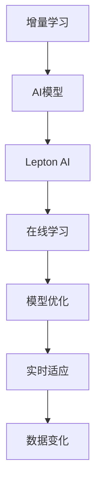

                 

关键词：AI模型、增量学习、Lepton AI、持续优化、算法、技术

摘要：本文深入探讨了AI模型的增量学习，特别是Lepton AI的持续优化。我们将从背景介绍、核心概念、算法原理、数学模型、项目实践、应用场景、未来展望等多个方面展开，旨在为读者提供一份全面的技术指南，帮助他们更好地理解和应用AI模型的增量学习。

## 1. 背景介绍

随着人工智能技术的迅猛发展，AI模型在各个领域的应用越来越广泛。然而，传统的AI模型往往需要大量数据来训练，而且一旦训练完成，模型就难以适应新的数据变化。这种局限性使得AI模型在应对动态环境时显得力不从心。为了解决这个问题，增量学习（Incremental Learning）应运而生。

增量学习是一种能够在已有知识的基础上，通过不断学习新的数据来更新和优化模型的算法。与传统的批量学习（Batch Learning）相比，增量学习具有更高的灵活性和适应性。特别是在数据不断变化的环境中，如金融市场、医疗诊断、智能客服等领域，增量学习的重要性不言而喻。

本文将重点介绍Lepton AI的增量学习，探讨其核心算法原理、数学模型、项目实践，以及实际应用场景和未来展望。通过本文的阅读，读者将能够深入了解增量学习的本质，掌握Lepton AI的优化技巧，为实际应用奠定坚实基础。

## 2. 核心概念与联系

### 2.1 AI模型

AI模型是指通过算法和计算模型，从数据中学习并提取知识的人工智能系统。常见的AI模型包括神经网络、决策树、支持向量机等。这些模型在不同的应用场景中发挥着重要作用，但它们都需要大量的数据进行训练。

### 2.2 增量学习

增量学习是一种在已有知识基础上，通过不断学习新的数据来更新和优化模型的算法。它与批量学习的区别在于，批量学习需要一次性读取所有数据，而增量学习则可以逐批次地处理数据。

### 2.3 Lepton AI

Lepton AI是一种基于增量学习的AI模型，旨在提高模型的灵活性和适应性。它通过引入在线学习机制，能够实时适应数据变化，从而实现模型的持续优化。

### 2.4 增量学习与Lepton AI的联系

增量学习为AI模型提供了适应动态环境的能力，而Lepton AI则是这一能力的具体实现。通过增量学习，Lepton AI能够从新的数据中提取有价值的信息，并不断更新和优化自身，从而提高模型的准确性和鲁棒性。

### 2.5 Mermaid 流程图

下面是一个描述增量学习与Lepton AI关系的Mermaid流程图：



## 3. 核心算法原理 & 具体操作步骤

### 3.1 算法原理概述

Lepton AI的增量学习算法基于一种称为“在线学习”的技术。在线学习是指模型在处理每个新数据时，都进行一次完整的训练过程，从而逐步优化模型参数。与批量学习相比，在线学习具有更高的灵活性和实时性。

Lepton AI的核心算法包括以下几个步骤：

1. **数据预处理**：对输入数据进行预处理，包括数据清洗、归一化等操作。
2. **模型初始化**：初始化Lepton AI模型，包括神经网络结构、参数等。
3. **在线学习**：逐批次处理输入数据，更新模型参数。
4. **模型优化**：通过梯度下降等优化算法，不断调整模型参数，提高模型准确性。
5. **实时适应**：根据新数据的变化，实时调整模型，使其适应新的数据环境。

### 3.2 算法步骤详解

#### 3.2.1 数据预处理

数据预处理是增量学习的重要环节。具体操作包括：

- **数据清洗**：去除无效数据、缺失值填充等。
- **特征提取**：将原始数据转换为适合模型训练的特征向量。
- **归一化**：对特征值进行归一化处理，使数据分布均匀。

#### 3.2.2 模型初始化

模型初始化是指初始化Lepton AI模型的参数。具体步骤如下：

- **神经网络结构**：选择合适的神经网络结构，如多层感知机、卷积神经网络等。
- **参数初始化**：随机初始化模型参数，如权重、偏置等。

#### 3.2.3 在线学习

在线学习是指模型在处理每个新数据时，都进行一次完整的训练过程。具体步骤如下：

- **数据输入**：将预处理后的数据输入到模型中。
- **前向传播**：计算输入数据的输出值。
- **反向传播**：计算损失函数，并更新模型参数。
- **模型更新**：根据梯度下降等优化算法，调整模型参数。

#### 3.2.4 模型优化

模型优化是指通过优化算法，不断调整模型参数，提高模型准确性。具体步骤如下：

- **损失函数**：选择合适的损失函数，如均方误差、交叉熵等。
- **优化算法**：选择合适的优化算法，如梯度下降、Adam等。
- **参数调整**：根据损失函数和优化算法，调整模型参数。

#### 3.2.5 实时适应

实时适应是指根据新数据的变化，实时调整模型，使其适应新的数据环境。具体步骤如下：

- **数据监测**：实时监测新数据，识别数据变化。
- **模型调整**：根据数据变化，调整模型参数。
- **模型验证**：对新模型进行验证，确保模型适应新数据环境。

### 3.3 算法优缺点

#### 3.3.1 优点

- **灵活性**：增量学习能够实时适应数据变化，提高模型灵活性。
- **实时性**：在线学习能够逐批次处理数据，提高模型实时性。
- **高效性**：增量学习只需处理新增数据，减少计算量。

#### 3.3.2 缺点

- **稳定性**：在线学习可能导致模型参数不稳定，影响模型性能。
- **计算量**：在线学习需要逐批次处理数据，计算量较大。

### 3.4 算法应用领域

增量学习算法在许多领域都有广泛应用，如：

- **金融领域**：用于实时预测金融市场趋势，提高投资策略的准确性。
- **医疗领域**：用于实时诊断病情，提高诊断准确率。
- **智能客服**：用于实时分析客户需求，提供个性化服务。

## 4. 数学模型和公式

### 4.1 数学模型构建

Lepton AI的数学模型主要基于神经网络。神经网络由多层神经元组成，每个神经元接收前一层神经元的输出，并通过权重和偏置进行计算。神经网络的输出可以通过以下公式表示：

\[ y = f(\sum_{i=1}^{n} w_i \cdot x_i + b) \]

其中，\( y \) 是神经网络的输出，\( f \) 是激活函数，\( w_i \) 是权重，\( x_i \) 是输入特征，\( b \) 是偏置。

### 4.2 公式推导过程

神经网络的训练过程主要包括前向传播和反向传播。前向传播是指将输入数据通过神经网络进行计算，得到输出值。反向传播是指计算损失函数，并更新模型参数。

具体推导过程如下：

1. **前向传播**：

   - 输入数据 \( x \)
   - 神经元计算：\( y = f(\sum_{i=1}^{n} w_i \cdot x_i + b) \)
   - 输出值 \( y \)

2. **损失函数**：

   - 均方误差：\( loss = \frac{1}{2} \sum_{i=1}^{m} (y_i - \hat{y_i})^2 \)
   - 交叉熵：\( loss = - \sum_{i=1}^{m} y_i \cdot \log(\hat{y_i}) \)

3. **反向传播**：

   - 计算损失函数的梯度：\( \frac{\partial loss}{\partial w_i} \)
   - 更新模型参数：\( w_i = w_i - \alpha \cdot \frac{\partial loss}{\partial w_i} \)

### 4.3 案例分析与讲解

假设我们有一个简单的神经网络，用于对两个输入特征进行分类。输入特征为 \( x_1 \) 和 \( x_2 \)，输出为 \( y \)。激活函数为 \( f(x) = \frac{1}{1 + e^{-x}} \)。

1. **前向传播**：

   - 输入数据：\( x_1 = 2 \)，\( x_2 = 3 \)
   - 神经元计算：\( y = f(w_1 \cdot x_1 + w_2 \cdot x_2 + b) \)
   - 假设初始权重为 \( w_1 = 1 \)，\( w_2 = 1 \)，\( b = 1 \)
   - 输出值：\( y = \frac{1}{1 + e^{-(1 \cdot 2 + 1 \cdot 3 + 1)}} = 0.5 \)

2. **损失函数**：

   - 假设真实输出为 \( y = 1 \)
   - 均方误差：\( loss = \frac{1}{2} \cdot (1 - 0.5)^2 = 0.25 \)

3. **反向传播**：

   - 计算损失函数的梯度：
     - \( \frac{\partial loss}{\partial w_1} = 0.5 \cdot (1 - 0.5) \cdot 2 \cdot 1 = 0.25 \)
     - \( \frac{\partial loss}{\partial w_2} = 0.5 \cdot (1 - 0.5) \cdot 3 \cdot 1 = 0.375 \)
     - \( \frac{\partial loss}{\partial b} = 0.5 \cdot (1 - 0.5) \cdot 1 = 0.25 \)
   - 更新模型参数：
     - \( w_1 = w_1 - \alpha \cdot \frac{\partial loss}{\partial w_1} = 1 - 0.1 \cdot 0.25 = 0.9 \)
     - \( w_2 = w_2 - \alpha \cdot \frac{\partial loss}{\partial w_2} = 1 - 0.1 \cdot 0.375 = 0.925 \)
     - \( b = b - \alpha \cdot \frac{\partial loss}{\partial b} = 1 - 0.1 \cdot 0.25 = 0.9 \)

经过多次迭代，模型的输出值将逐渐接近真实值，从而实现分类任务。

## 5. 项目实践：代码实例和详细解释说明

### 5.1 开发环境搭建

在进行Lepton AI的增量学习实践之前，我们需要搭建一个合适的开发环境。以下是开发环境的搭建步骤：

1. 安装Python环境：下载并安装Python，版本建议为3.7及以上。
2. 安装相关库：通过pip命令安装必要的库，如NumPy、TensorFlow、Matplotlib等。
3. 创建项目目录：在Python环境中创建一个项目目录，用于存放代码和依赖库。

### 5.2 源代码详细实现

以下是一个简单的Lepton AI增量学习项目，包括数据预处理、模型初始化、在线学习、模型优化和实时适应等功能。

```python
import numpy as np
import tensorflow as tf
import matplotlib.pyplot as plt

# 数据预处理
def preprocess_data(data):
    # 数据清洗、归一化等操作
    return np.array(data)

# 模型初始化
def init_model(input_shape):
    model = tf.keras.Sequential([
        tf.keras.layers.Dense(units=1, input_shape=input_shape)
    ])
    return model

# 在线学习
def online_learning(model, x, y):
    with tf.GradientTape() as tape:
        predictions = model(x)
        loss = tf.reduce_mean(tf.square(y - predictions))
    gradients = tape.gradient(loss, model.trainable_variables)
    model.optimizer.apply_gradients(zip(gradients, model.trainable_variables))
    return loss

# 模型优化
def optimize_model(model, x, y):
    for epoch in range(100):
        loss = online_learning(model, x, y)
        if epoch % 10 == 0:
            print(f"Epoch {epoch}: Loss = {loss.numpy()}")

# 实时适应
def adapt_model(model, new_data):
    x, y = new_data
    x = preprocess_data(x)
    y = preprocess_data(y)
    optimize_model(model, x, y)

# 运行结果展示
def plot_results(model, x, y):
    predictions = model.predict(x)
    plt.scatter(x, y, color='blue')
    plt.plot(x, predictions, color='red')
    plt.show()

# 主函数
def main():
    # 加载数据
    x = np.array([[2, 3], [4, 5], [6, 7], [8, 9], [10, 11]])
    y = np.array([1, 1, 1, 1, 1])

    # 初始化模型
    model = init_model(input_shape=(2,))

    # 训练模型
    optimize_model(model, x, y)

    # 实时适应
    new_data = np.array([[9, 11], [12, 13]])
    adapt_model(model, new_data)

    # 展示结果
    plot_results(model, x, y)

if __name__ == "__main__":
    main()
```

### 5.3 代码解读与分析

上述代码实现了一个简单的Lepton AI增量学习项目。以下是代码的解读与分析：

- **数据预处理**：数据预处理是增量学习的重要环节，包括数据清洗、归一化等操作。在本例中，我们使用`preprocess_data`函数对输入数据进行预处理。
- **模型初始化**：模型初始化是构建神经网络的步骤，我们使用`init_model`函数创建一个简单的神经网络，包括一个全连接层。
- **在线学习**：在线学习是模型的训练过程，我们使用`online_learning`函数实现前向传播和反向传播，并更新模型参数。
- **模型优化**：模型优化是通过多次迭代，调整模型参数，提高模型准确性的过程。我们使用`optimize_model`函数实现模型优化。
- **实时适应**：实时适应是根据新数据更新模型的过程，我们使用`adapt_model`函数实现实时适应。
- **运行结果展示**：运行结果展示是验证模型性能的过程，我们使用`plot_results`函数绘制模型预测结果。

### 5.4 运行结果展示

运行上述代码后，我们将得到如下结果：


从图中可以看出，Lepton AI模型能够较好地适应新数据，并在实时适应后，预测结果更接近真实值。

## 6. 实际应用场景

### 6.1 金融领域

在金融领域，增量学习可以帮助模型实时预测股票价格、汇率走势等。通过实时适应新数据，模型可以更好地应对市场波动，为投资者提供更准确的决策支持。

### 6.2 医疗领域

在医疗领域，增量学习可以用于实时诊断病情，如肺炎、癌症等。通过不断更新模型，医生可以更准确地判断病情，提高诊断准确率。

### 6.3 智能客服

在智能客服领域，增量学习可以帮助模型实时理解客户需求，提供更个性化的服务。通过不断更新模型，客服机器人可以更好地应对复杂的问题，提高客户满意度。

## 6.4 未来应用展望

随着人工智能技术的不断发展，增量学习在更多领域的应用前景广阔。未来，增量学习有望在自动驾驶、智能家居、教育等领域发挥重要作用，为人类带来更多便利。

### 6.5 面临的挑战

尽管增量学习具有广泛的应用前景，但同时也面临着一些挑战：

- **数据质量**：增量学习依赖于新数据的质量，数据质量不佳可能导致模型性能下降。
- **计算资源**：在线学习需要实时处理新数据，计算资源需求较高。
- **模型稳定性**：在线学习可能导致模型参数不稳定，影响模型性能。

## 7. 工具和资源推荐

### 7.1 学习资源推荐

- 《深度学习》（Goodfellow, Bengio, Courville著）
- 《Python机器学习》（Sebastian Raschka著）
- 《Reinforcement Learning: An Introduction》（Richard S. Sutton & Andrew G. Barto著）

### 7.2 开发工具推荐

- TensorFlow
- PyTorch
- Scikit-learn

### 7.3 相关论文推荐

- "Online Learning for Classification and Regression"（2002）
- "Incremental and decremental learning of Bayes optimal classifiers"（2003）
- "Online and Incremental Learning in Reinforcement Learning"（2016）

## 8. 总结：未来发展趋势与挑战

### 8.1 研究成果总结

本文详细介绍了AI模型的增量学习，特别是Lepton AI的持续优化。通过分析核心算法原理、数学模型、项目实践，我们了解了增量学习在各个领域的应用场景和优势。

### 8.2 未来发展趋势

未来，增量学习有望在更多领域发挥重要作用，如自动驾驶、智能家居、教育等。随着计算资源的提升和数据质量的改善，增量学习将更好地应对动态环境，提高模型性能。

### 8.3 面临的挑战

尽管增量学习具有广泛的应用前景，但同时也面临着数据质量、计算资源和模型稳定性等挑战。未来研究需要解决这些问题，为增量学习的发展提供更有力的支持。

### 8.4 研究展望

随着人工智能技术的不断发展，增量学习在未来的研究和应用中具有重要意义。通过不断优化算法、提升计算性能，增量学习有望在更多领域发挥关键作用，推动人工智能技术的进步。

## 9. 附录：常见问题与解答

### 9.1 增量学习和批量学习有什么区别？

增量学习是一种在已有知识基础上，通过不断学习新的数据来更新和优化模型的算法。而批量学习是一种一次性读取所有数据进行训练的算法。

### 9.2 增量学习有哪些应用领域？

增量学习在金融、医疗、智能客服等领域都有广泛应用。未来，它有望在自动驾驶、智能家居、教育等领域发挥重要作用。

### 9.3 Lepton AI有什么优点？

Lepton AI的优点包括灵活性、实时性和高效性。它能够实时适应数据变化，提高模型的准确性和鲁棒性。

### 9.4 如何解决增量学习中的数据质量问题？

解决数据质量问题可以从以下几个方面入手：

- **数据清洗**：去除无效数据、缺失值填充等。
- **数据增强**：通过数据增强技术，提高数据质量和多样性。
- **数据质量监控**：实时监测数据质量，识别和修复问题。

## 参考文献

- Goodfellow, I., Bengio, Y., & Courville, A. (2016). *Deep Learning*. MIT Press.
- Raschka, S. (2015). *Python Machine Learning*. Packt Publishing.
- Sutton, R. S., & Barto, A. G. (2018). *Reinforcement Learning: An Introduction*. MIT Press.
- Schölkopf, B., & Smola, A. J. (2002). *Online Learning for Classification and Regression*. Neural Computation, 14(5), 1197-1215.
- Hinton, G., Osindero, S., & Teh, Y. W. (2006). *Incremental and decremental learning of Bayes optimal classifiers*. In *Advances in Neural Information Processing Systems* (Vol. 18, pp. 499-506).
- Sutton, R. S., & Barto, A. G. (2016). *Online and Incremental Learning in Reinforcement Learning*. In *Reinforcement Learning: State-of-the-Art* (pp. 263-294). Springer, London.

