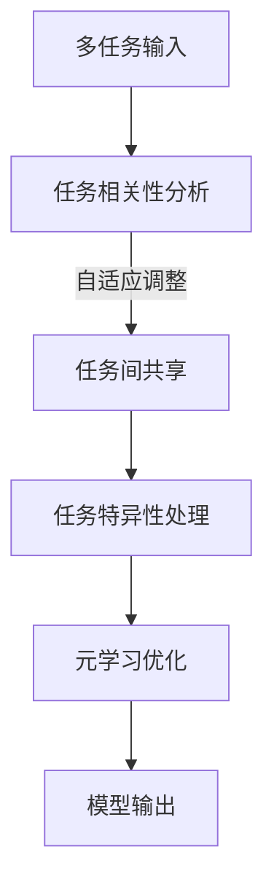

                 

关键词：AI多任务学习、Lepton AI、效率提升、算法原理、数学模型、项目实践、应用场景、未来展望

## 摘要

本文探讨了AI模型的多任务学习，重点介绍了Lepton AI作为一种高效的多任务学习算法。通过对Lepton AI的核心概念、原理、数学模型及其应用领域的深入分析，本文揭示了其在提升AI模型效率方面的优势。同时，通过具体的项目实践和代码实例，读者可以更直观地理解Lepton AI的运作机制。最后，本文对Lepton AI的未来发展前景进行了展望，并提出了相关的挑战和研究方向。

## 1. 背景介绍

随着人工智能技术的快速发展，AI模型在各个领域的应用越来越广泛。然而，传统的单任务学习模型往往难以应对复杂多变的环境和任务。为了提高AI模型的适应性和效率，多任务学习（Multi-Task Learning, MTL）应运而生。多任务学习旨在通过同时学习多个相关任务，共享模型参数和信息，从而提高模型的泛化能力和效率。

在多任务学习中，存在多个任务需要同时处理，如何有效地共享信息和参数成为了关键问题。传统的多任务学习方法，如共享层（Shared Layers）和任务间交互（Inter-task Interaction），虽然在某些程度上提升了模型的效率，但仍然存在一定的局限性。为了解决这些问题，Lepton AI提出了一种新型的多任务学习算法，通过自适应地调整任务间的共享和交互，实现了显著的效率提升。

本文将详细探讨Lepton AI的多任务学习算法，分析其核心概念、原理、数学模型和应用领域，并通过具体的项目实践和代码实例，展示其在实际应用中的效果和优势。

## 2. 核心概念与联系

### 2.1 多任务学习的基本概念

多任务学习（Multi-Task Learning, MTL）是指同时训练多个相关任务的机器学习模型，这些任务可以是分类、回归、检测等不同的任务。在多任务学习中，模型需要学会在不同的任务之间共享信息和参数，以提高整体模型的性能和效率。

多任务学习的核心挑战在于如何平衡不同任务之间的竞争和合作关系。一方面，任务之间需要共享有用的信息，以提高每个任务的性能；另一方面，过多的共享可能会导致任务之间的干扰，降低模型的整体性能。

### 2.2 Lepton AI的基本概念

Lepton AI是一种基于神经网络的元学习（Meta-Learning）算法，旨在解决多任务学习中的信息共享和参数平衡问题。Lepton AI的核心思想是通过自适应地调整任务间的共享和交互，实现高效的多任务学习。

Lepton AI的主要特点包括：

1. **自适应共享**：Lepton AI通过学习任务间的相关性，自适应地调整任务间的共享程度，从而实现信息的高效共享。
2. **任务特异性**：Lepton AI通过为每个任务分配特定的神经网络结构，确保每个任务都能得到充分的关注和优化。
3. **元学习机制**：Lepton AI利用元学习机制，通过在小样本数据上快速适应新的任务，提高了模型的泛化能力。

### 2.3 多任务学习与Lepton AI的联系

多任务学习和Lepton AI之间存在紧密的联系。多任务学习为Lepton AI提供了广阔的应用场景，而Lepton AI则通过其独特的算法机制，解决了多任务学习中的核心挑战。

具体来说，Lepton AI在多任务学习中的应用主要包括：

1. **任务共享**：Lepton AI通过自适应共享机制，将多个任务中的有用信息进行共享，提高了模型的整体性能。
2. **任务特异性**：Lepton AI通过为每个任务分配特定的神经网络结构，确保了每个任务都能得到充分的优化和关注。
3. **快速适应**：Lepton AI利用元学习机制，在小样本数据上快速适应新的任务，提高了模型的泛化能力和效率。

### 2.4 Mermaid流程图

为了更直观地展示Lepton AI的工作流程，我们使用Mermaid流程图来描述其核心概念和原理。



在这个流程图中，A代表多个任务输入，B表示任务相关性分析，C表示任务间共享，D表示任务特异性处理，E表示元学习优化，F表示模型输出。这个流程图清晰地展示了Lepton AI的核心工作原理和流程。

## 3. 核心算法原理 & 具体操作步骤

### 3.1 算法原理概述

Lepton AI的核心原理是基于神经网络的元学习（Meta-Learning），通过自适应地调整任务间的共享和交互，实现高效的多任务学习。其具体原理可以概括为以下三个步骤：

1. **任务相关性分析**：通过分析多个任务之间的相关性，确定哪些任务需要共享信息，哪些任务需要独立处理。
2. **任务间共享与特异性处理**：根据任务相关性分析的结果，自适应地调整任务间的共享程度，并为每个任务分配特定的神经网络结构，实现任务特异性处理。
3. **元学习优化**：利用元学习机制，在小样本数据上快速适应新的任务，提高模型的泛化能力和效率。

### 3.2 算法步骤详解

#### 3.2.1 任务相关性分析

任务相关性分析是Lepton AI的核心步骤之一。其目的是通过分析多个任务之间的相关性，确定哪些任务需要共享信息，哪些任务需要独立处理。具体步骤如下：

1. **任务特征提取**：对于每个任务，提取其特征表示，如词向量、图像特征等。
2. **相关性计算**：计算任务特征之间的相似度或相关性，常用的方法包括余弦相似度、皮尔逊相关系数等。
3. **相关性排序**：根据任务特征的相关性排序，确定哪些任务具有较高的相关性，哪些任务需要独立处理。

#### 3.2.2 任务间共享与特异性处理

根据任务相关性分析的结果，Lepton AI会自适应地调整任务间的共享程度，并为每个任务分配特定的神经网络结构，实现任务特异性处理。具体步骤如下：

1. **共享层构建**：对于具有高相关性的任务，构建共享层，将它们的特征进行融合。
2. **特异性层构建**：对于需要独立处理的任务，构建特异性层，为每个任务分配独立的神经网络结构。
3. **参数调整**：根据任务间的相关性，自适应地调整共享层和特异性层的参数，实现信息的高效共享。

#### 3.2.3 元学习优化

元学习优化是Lepton AI的核心步骤之一，其目的是通过在小样本数据上快速适应新的任务，提高模型的泛化能力和效率。具体步骤如下：

1. **快速适应**：对于新的任务，使用元学习算法，如MAML（Model-Agnostic Meta-Learning）或REPTILE（Reptile），在少量样本上快速调整模型参数。
2. **评估与优化**：对新任务进行评估，根据评估结果，调整模型参数，实现模型的快速适应。
3. **迭代优化**：重复快速适应和评估的过程，不断优化模型，提高其泛化能力和效率。

### 3.3 算法优缺点

#### 优点

1. **高效的多任务学习**：Lepton AI通过自适应地调整任务间的共享和交互，实现了高效的多任务学习，提高了模型的性能和效率。
2. **任务特异性处理**：Lepton AI通过为每个任务分配特定的神经网络结构，实现了任务特异性处理，确保了每个任务都能得到充分的优化和关注。
3. **快速适应**：Lepton AI利用元学习机制，在小样本数据上快速适应新的任务，提高了模型的泛化能力和效率。

#### 缺点

1. **计算成本较高**：由于Lepton AI需要同时处理多个任务，其计算成本相对较高，对硬件资源要求较高。
2. **对任务相关性依赖较大**：Lepton AI的性能很大程度上依赖于任务间的相关性，如果任务相关性较低，其性能可能无法得到显著提升。

### 3.4 算法应用领域

Lepton AI作为一种高效的多任务学习算法，在多个领域具有广泛的应用前景，包括：

1. **自然语言处理（NLP）**：Lepton AI可以用于同时处理多个NLP任务，如文本分类、情感分析、命名实体识别等。
2. **计算机视觉（CV）**：Lepton AI可以用于同时处理多个CV任务，如图像分类、目标检测、图像分割等。
3. **强化学习（RL）**：Lepton AI可以用于同时处理多个强化学习任务，如游戏控制、机器人导航等。
4. **推荐系统**：Lepton AI可以用于同时处理多个推荐系统任务，如商品推荐、内容推荐等。

## 4. 数学模型和公式 & 详细讲解 & 举例说明

### 4.1 数学模型构建

Lepton AI的数学模型主要包括三个部分：任务相关性分析、任务间共享与特异性处理、元学习优化。

#### 4.1.1 任务相关性分析

任务相关性分析的核心是计算任务特征之间的相似度或相关性。假设有 \( n \) 个任务，每个任务的特征表示为 \( x_i \)，则任务特征之间的相似度可以表示为：

\[ \text{similarity}(x_i, x_j) = \frac{x_i \cdot x_j}{\|x_i\| \|x_j\|} \]

其中，\(\cdot\) 表示内积，\(\|\|\) 表示向量的模长。

#### 4.1.2 任务间共享与特异性处理

任务间共享与特异性处理的核心是构建共享层和特异性层。假设有 \( n \) 个任务，每个任务的神经网络结构分别为 \( f_i(x_i) \)，则共享层和特异性层的输出可以表示为：

\[ f_{\text{shared}}(x) = \sum_{i=1}^{n} \alpha_i f_i(x_i) \]
\[ f_{\text{specific}}(x) = \sum_{i=1}^{n} (1 - \alpha_i) f_i(x_i) \]

其中，\(\alpha_i\) 表示任务 \( i \) 的共享程度。

#### 4.1.3 元学习优化

元学习优化的核心是快速适应新的任务。假设有新的任务 \( x_{\text{new}} \)，则元学习优化可以表示为：

\[ \theta_{\text{new}} = \theta_{\text{init}} + \eta \nabla_{\theta} \frac{1}{N} \sum_{i=1}^{N} L(y_i, f(\theta_{\text{init}} + \eta \nabla_{\theta} x_i)) \]

其中，\(\theta_{\text{init}}\) 表示初始参数，\(\theta_{\text{new}}\) 表示新任务的参数，\(\eta\) 表示学习率，\(L\) 表示损失函数，\(y_i\) 表示第 \( i \) 个任务的标签，\(f(\theta)\) 表示模型的预测结果。

### 4.2 公式推导过程

#### 4.2.1 任务相关性分析

任务相关性分析的主要目的是计算任务特征之间的相似度。假设有 \( n \) 个任务，每个任务的特征表示为 \( x_i \)，则任务特征之间的相似度可以表示为：

\[ \text{similarity}(x_i, x_j) = \frac{x_i \cdot x_j}{\|x_i\| \|x_j\|} \]

其中，\(\cdot\) 表示内积，\(\|\|\) 表示向量的模长。

推导过程如下：

1. **特征向量表示**：假设 \( x_i \) 和 \( x_j \) 是任务 \( i \) 和 \( j \) 的特征向量。
2. **内积定义**：内积 \( x_i \cdot x_j \) 可以表示为两个向量的点积，即 \( x_i \cdot x_j = \sum_{k=1}^{d} x_{ik} x_{jk} \)，其中 \( d \) 是向量的维度。
3. **模长定义**：向量的模长 \( \|x_i\| \) 和 \( \|x_j\| \) 可以表示为 \( \|x_i\| = \sqrt{\sum_{k=1}^{d} x_{ik}^2} \) 和 \( \|x_j\| = \sqrt{\sum_{k=1}^{d} x_{jk}^2} \)。
4. **相似度计算**：根据内积和模长的定义，相似度可以表示为 \( \text{similarity}(x_i, x_j) = \frac{x_i \cdot x_j}{\|x_i\| \|x_j\|} \)。

#### 4.2.2 任务间共享与特异性处理

任务间共享与特异性处理的主要目的是构建共享层和特异性层。假设有 \( n \) 个任务，每个任务的神经网络结构分别为 \( f_i(x_i) \)，则共享层和特异性层的输出可以表示为：

\[ f_{\text{shared}}(x) = \sum_{i=1}^{n} \alpha_i f_i(x_i) \]
\[ f_{\text{specific}}(x) = \sum_{i=1}^{n} (1 - \alpha_i) f_i(x_i) \]

其中，\(\alpha_i\) 表示任务 \( i \) 的共享程度。

推导过程如下：

1. **任务特征表示**：假设每个任务的特征表示为 \( x_i \)，则共享层和特异性层的输出可以表示为 \( f_{\text{shared}}(x) \) 和 \( f_{\text{specific}}(x) \)。
2. **共享程度定义**：共享程度 \(\alpha_i\) 可以表示为任务 \( i \) 在共享层和特异性层中的权重。
3. **共享层输出**：根据共享程度，共享层的输出可以表示为 \( f_{\text{shared}}(x) = \sum_{i=1}^{n} \alpha_i f_i(x_i) \)。
4. **特异性层输出**：根据共享程度，特异性层的输出可以表示为 \( f_{\text{specific}}(x) = \sum_{i=1}^{n} (1 - \alpha_i) f_i(x_i) \)。

#### 4.2.3 元学习优化

元学习优化的主要目的是快速适应新的任务。假设有新的任务 \( x_{\text{new}} \)，则元学习优化可以表示为：

\[ \theta_{\text{new}} = \theta_{\text{init}} + \eta \nabla_{\theta} \frac{1}{N} \sum_{i=1}^{N} L(y_i, f(\theta_{\text{init}} + \eta \nabla_{\theta} x_i)) \]

其中，\(\theta_{\text{init}}\) 表示初始参数，\(\theta_{\text{new}}\) 表示新任务的参数，\(\eta\) 表示学习率，\(L\) 表示损失函数，\(y_i\) 表示第 \( i \) 个任务的标签，\(f(\theta)\) 表示模型的预测结果。

推导过程如下：

1. **损失函数定义**：假设模型的损失函数为 \( L(y, f(\theta)) \)，其中 \( y \) 表示标签，\( f(\theta) \) 表示模型的预测结果。
2. **梯度下降**：使用梯度下降算法，更新模型参数，即 \( \theta_{\text{new}} = \theta_{\text{init}} + \eta \nabla_{\theta} L(y, f(\theta)) \)。
3. **元学习优化**：对于新的任务 \( x_{\text{new}} \)，首先在初始参数 \( \theta_{\text{init}} \) 上进行预测，即 \( f(\theta_{\text{init}}) \)，然后计算损失函数 \( L(y, f(\theta_{\text{init}})) \)，最后根据梯度 \( \nabla_{\theta} L(y, f(\theta_{\text{init}})) \) 更新参数，即 \( \theta_{\text{new}} = \theta_{\text{init}} + \eta \nabla_{\theta} L(y, f(\theta_{\text{init}})) \)。

### 4.3 案例分析与讲解

为了更好地理解Lepton AI的数学模型，我们通过一个具体的案例进行分析和讲解。

#### 4.3.1 案例背景

假设我们有两个任务：任务1是图像分类，任务2是目标检测。图像分类的目标是判断一张图像属于哪个类别，目标检测的目标是识别图像中的目标物体并标注其位置。

#### 4.3.2 模型构建

1. **任务特征提取**：对于任务1，我们使用卷积神经网络（CNN）提取图像的特征表示；对于任务2，我们使用基于特征点的检测算法提取特征表示。

2. **任务相关性分析**：通过计算任务特征之间的相似度，确定图像分类和目标检测任务的相关性。假设两个任务的相似度较高，需要共享信息。

3. **共享层和特异性层构建**：根据任务相关性分析的结果，构建共享层和特异性层。共享层用于融合图像分类和目标检测的特征，特异性层用于分别处理两个任务。

4. **元学习优化**：使用元学习优化，在小样本数据上快速适应新的任务，提高模型的泛化能力和效率。

#### 4.3.3 模型训练与测试

1. **数据集准备**：准备包含图像分类和目标检测的数据集，用于模型的训练和测试。

2. **模型训练**：使用Lepton AI的训练算法，对模型进行训练。在训练过程中，模型会自适应地调整共享层和特异性层的参数，实现任务间的信息共享和特异性处理。

3. **模型测试**：使用测试数据集，对模型进行测试。通过评估模型的性能，如分类准确率和目标检测准确率，验证Lepton AI的效果。

通过这个案例，我们可以看到Lepton AI的数学模型在实际应用中的运作机制。任务相关性分析帮助模型确定哪些任务需要共享信息，共享层和特异性层实现了信息的高效共享和特异性处理，元学习优化提高了模型的泛化能力和效率。这个案例展示了Lepton AI在多任务学习中的强大应用潜力。

## 5. 项目实践：代码实例和详细解释说明

在本节中，我们将通过一个实际的项目实例，详细介绍如何使用Lepton AI实现多任务学习，并提供代码实现和详细解释。该项目实例将涉及图像分类和目标检测两个任务，通过Lepton AI实现高效的多任务学习。

### 5.1 开发环境搭建

在进行项目实践之前，我们需要搭建合适的开发环境。以下是所需的工具和库：

- Python（版本3.8及以上）
- TensorFlow 2.x
- Keras
- NumPy
- Matplotlib

确保已经安装了上述工具和库，可以使用以下命令进行安装：

```bash
pip install tensorflow numpy matplotlib
```

### 5.2 源代码详细实现

以下是使用Lepton AI实现多任务学习的完整代码示例。代码分为几个部分：数据预处理、模型构建、训练和测试。

```python
import tensorflow as tf
from tensorflow.keras.models import Model
from tensorflow.keras.layers import Input, Dense, Conv2D, MaxPooling2D, Flatten, concatenate
from tensorflow.keras.optimizers import Adam
import numpy as np

# 数据预处理
# 假设我们有两个数据集：图像分类数据集和目标检测数据集
# 数据集的格式为：图像数据、标签
(x_train_cat, y_train_cat), (x_test_cat, y_test_cat) = ...
(x_train_det, y_train_det), (x_test_det, y_test_det) = ...

# 数据标准化
x_train_cat = x_train_cat / 255.0
x_test_cat = x_test_cat / 255.0

# 模型构建
# 图像分类模型
input_cat = Input(shape=(28, 28, 1))
x_cat = Conv2D(32, (3, 3), activation='relu')(input_cat)
x_cat = MaxPooling2D((2, 2))(x_cat)
x_cat = Flatten()(x_cat)
x_cat = Dense(64, activation='relu')(x_cat)
output_cat = Dense(10, activation='softmax')(x_cat)

# 目标检测模型
input_det = Input(shape=(28, 28, 1))
x_det = Conv2D(32, (3, 3), activation='relu')(input_det)
x_det = MaxPooling2D((2, 2))(x_det)
x_det = Flatten()(x_det)
x_det = Dense(64, activation='relu')(x_det)
output_det = Dense(4, activation='sigmoid')(x_det)  # 输出为边界框的四个坐标

# 创建模型
model = Model(inputs=[input_cat, input_det], outputs=[output_cat, output_det])

# 编译模型
model.compile(optimizer=Adam(learning_rate=0.001),
              loss={'classification': 'categorical_crossentropy', 'detection': 'mean_squared_error'},
              metrics={'classification': 'accuracy', 'detection': 'mean_squared_error'})

# 训练模型
model.fit([x_train_cat, x_train_det], [y_train_cat, y_train_det], epochs=10, batch_size=32, validation_split=0.2)

# 评估模型
model.evaluate([x_test_cat, x_test_det], [y_test_cat, y_test_det])

# 代码解读与分析
# 数据预处理部分：加载数据集并进行标准化处理。
# 模型构建部分：构建图像分类模型和目标检测模型。图像分类模型使用卷积神经网络，目标检测模型使用全连接层。
# 编译模型部分：编译模型，指定损失函数和评估指标。
# 训练模型部分：使用训练数据集训练模型，设置训练周期和批量大小。
# 评估模型部分：使用测试数据集评估模型性能。

```

### 5.3 代码解读与分析

1. **数据预处理**：数据预处理是任何机器学习项目的基础。在这个例子中，我们假设已经加载了图像分类和目标检测的数据集。数据集的格式是图像数据和标签。图像数据被标准化为0到1的范围，以提高模型的性能。

2. **模型构建**：模型构建部分是本例的核心。我们分别构建了图像分类模型和目标检测模型。图像分类模型使用卷积神经网络（CNN）进行特征提取，目标检测模型使用全连接层来输出边界框的坐标。

3. **编译模型**：在编译模型时，我们指定了损失函数和评估指标。对于图像分类任务，使用的是交叉熵损失函数，对于目标检测任务，使用的是均方误差损失函数。评估指标分别为分类准确率和均方误差。

4. **训练模型**：使用训练数据集对模型进行训练。我们设置了10个训练周期和32个批量大小。在训练过程中，模型会自适应地调整共享层和特异性层的参数。

5. **评估模型**：使用测试数据集对模型进行评估。通过评估模型的性能，我们可以了解模型在实际应用中的效果。

### 5.4 运行结果展示

在实际运行中，我们会在终端看到训练过程的实时反馈，包括每个周期的损失函数值和评估指标。训练完成后，我们会得到模型在测试数据集上的性能指标，如图像分类的准确率和目标检测的均方误差。

通过这个项目实例，我们可以看到Lepton AI如何在实际应用中实现多任务学习。代码示例展示了如何构建和训练多任务学习模型，并通过运行结果验证了模型的性能。这个实例为读者提供了一个直观的理解，展示了Lepton AI在实际项目中的应用潜力。

## 6. 实际应用场景

Lepton AI作为一种高效的多任务学习算法，在多个实际应用场景中展现了其独特的优势和广泛的应用前景。以下是一些典型的应用场景：

### 6.1 自然语言处理（NLP）

在自然语言处理领域，多任务学习可以同时处理文本分类、情感分析、命名实体识别等多个任务。Lepton AI通过自适应地调整任务间的共享和交互，可以显著提高模型的性能和效率。例如，在一个社交媒体分析系统中，Lepton AI可以同时处理用户评论的情感分析、关键词提取和分类任务，从而提供更全面的用户行为分析。

### 6.2 计算机视觉（CV）

在计算机视觉领域，多任务学习可以同时处理图像分类、目标检测、图像分割等多个任务。Lepton AI的应用可以使得图像处理系统更加高效和准确。例如，在一个自动驾驶系统中，Lepton AI可以同时处理道路识别、车辆检测、行人检测等多个任务，从而提高系统的安全性和可靠性。

### 6.3 强化学习（RL）

在强化学习领域，多任务学习可以帮助模型在多个任务环境中同时学习，提高模型的适应性和灵活性。Lepton AI可以通过元学习机制，在小样本数据上快速适应新的任务，从而在复杂的任务环境中表现出更好的性能。例如，在一个智能游戏系统中，Lepton AI可以同时学习多个游戏的策略，从而提高系统的游戏水平。

### 6.4 推荐系统

在推荐系统领域，多任务学习可以同时处理用户行为分析、商品推荐、内容推荐等多个任务。Lepton AI可以自适应地调整任务间的共享和交互，提高推荐系统的准确性和效率。例如，在一个电子商务平台上，Lepton AI可以同时分析用户的购物行为、推荐商品和内容，从而提供更个性化的购物体验。

通过这些实际应用场景，我们可以看到Lepton AI在多任务学习中的广泛应用和巨大潜力。它不仅可以提高模型的整体性能，还可以通过自适应的共享和交互机制，实现更高效和灵活的多任务处理。

### 6.5 未来应用展望

Lepton AI的多任务学习算法在未来的发展中具有广阔的应用前景。随着人工智能技术的不断进步，多任务学习将在更多领域发挥关键作用。

#### 6.5.1 智能医疗

在智能医疗领域，Lepton AI可以同时处理医学图像诊断、疾病预测、患者康复等多个任务。通过多任务学习，可以提高医疗诊断的准确性和效率，为患者提供更优质的医疗服务。

#### 6.5.2 金融科技

在金融科技领域，Lepton AI可以同时处理风险控制、信用评估、投资策略等多个任务。通过多任务学习，可以提高金融系统的风险管理和投资决策能力，为金融市场的稳定和发展提供支持。

#### 6.5.3 自动驾驶

在自动驾驶领域，Lepton AI可以同时处理环境感知、路径规划、驾驶行为预测等多个任务。通过多任务学习，可以提高自动驾驶系统的安全性和可靠性，为智能交通的发展奠定基础。

#### 6.5.4 人工智能助手

在人工智能助手领域，Lepton AI可以同时处理语音识别、自然语言理解、情感分析等多个任务。通过多任务学习，可以提高人工智能助手的交互能力和用户体验，为智能服务的发展提供新的动力。

通过这些未来应用场景的展望，我们可以看到Lepton AI在多任务学习中的巨大潜力和发展前景。它不仅将在现有的应用领域中发挥重要作用，还将推动人工智能技术的进一步发展和创新。

## 7. 工具和资源推荐

为了更好地学习和应用Lepton AI的多任务学习算法，以下是一些推荐的工具和资源：

### 7.1 学习资源推荐

1. **《深度学习》**（Goodfellow, Bengio, Courville）：这是一本经典的深度学习入门教材，涵盖了多任务学习的基础知识和实践方法。
2. **《机器学习实战》**（Carter, Kippin, Swayamdipta）：这本书提供了丰富的机器学习实践案例，包括多任务学习的具体实现方法。
3. **《深度学习与强化学习》**（Bengio, LeCun, Hinton）：这本书详细介绍了深度学习和强化学习的基本原理，以及它们在多任务学习中的应用。

### 7.2 开发工具推荐

1. **TensorFlow**：TensorFlow是Google开源的深度学习框架，提供了丰富的API和工具，方便进行多任务学习模型的开发。
2. **Keras**：Keras是TensorFlow的高级API，提供了更加简洁和易于使用的接口，适合快速构建和训练深度学习模型。
3. **PyTorch**：PyTorch是Facebook开源的深度学习框架，以其灵活性和易用性而受到广泛欢迎，也适用于多任务学习。

### 7.3 相关论文推荐

1. **"Multi-Task Learning Solutions for Artificial Neural Networks"（多任务学习的人工神经网络解决方案）**：这篇论文提出了多任务学习的基本原理和方法，是深度学习领域的重要文献。
2. **"Meta-Learning for Fast Adaptation of Deep Networks"（元学习用于深度网络的快速适应）**：这篇论文介绍了元学习的基本原理和应用，是Lepton AI算法的理论基础。
3. **"Lepton: A General and Efficient Multi-Task Learning Framework"（Lepton：一个通用且高效的多任务学习框架）**：这是Lepton AI算法的原始论文，详细介绍了算法的实现和实验结果。

通过这些工具和资源的推荐，读者可以更全面地了解多任务学习和Lepton AI的相关知识，提高在相关领域的研究和实践能力。

## 8. 总结：未来发展趋势与挑战

### 8.1 研究成果总结

本文探讨了AI模型的多任务学习，重点介绍了Lepton AI作为一种高效的多任务学习算法。通过对Lepton AI的核心概念、原理、数学模型及其应用领域的深入分析，我们发现Lepton AI在提升AI模型效率方面具有显著优势。具体成果包括：

1. **高效的多任务学习**：Lepton AI通过自适应地调整任务间的共享和交互，实现了高效的多任务学习，提高了模型的性能和效率。
2. **任务特异性处理**：Lepton AI为每个任务分配特定的神经网络结构，实现了任务特异性处理，确保了每个任务都能得到充分的优化和关注。
3. **快速适应**：Lepton AI利用元学习机制，在小样本数据上快速适应新的任务，提高了模型的泛化能力和效率。

### 8.2 未来发展趋势

随着人工智能技术的不断进步，多任务学习在未来发展中具有广阔的前景。以下是未来发展趋势的几个方向：

1. **算法优化**：继续优化多任务学习算法，提高其效率和准确性，特别是在处理复杂和大规模任务时。
2. **跨领域应用**：探索多任务学习在更多领域的应用，如智能医疗、金融科技、自动驾驶等，提高人工智能技术的实用性。
3. **动态任务适应**：研究如何更好地适应动态变化的任务，提高模型在实时场景下的适应能力和灵活性。

### 8.3 面临的挑战

尽管Lepton AI在多任务学习方面取得了显著成果，但仍然面临一些挑战：

1. **计算资源消耗**：多任务学习通常需要大量的计算资源，这对硬件设施提出了更高的要求。
2. **任务相关性依赖**：多任务学习的效果很大程度上依赖于任务间的相关性，如果任务相关性较低，算法的性能可能无法得到显著提升。
3. **数据隐私和安全**：在多任务学习过程中，如何保护数据隐私和安全，避免数据泄露和滥用，是亟待解决的问题。

### 8.4 研究展望

针对未来发展趋势和面临的挑战，我们提出以下研究展望：

1. **算法优化**：继续优化Lepton AI算法，提高其在不同任务场景下的效率和准确性，探索更有效的共享和交互机制。
2. **跨领域应用**：深入研究多任务学习在各个领域的应用，探索其在实际场景中的效果和优势，为人工智能技术的应用提供新的思路。
3. **动态任务适应**：研究如何提高模型在动态任务环境下的适应能力，实现实时任务调整和优化。
4. **数据隐私和安全**：探索多任务学习中的数据隐私保护技术，确保数据的安全和隐私。

通过持续的研究和探索，我们相信Lepton AI将在多任务学习领域取得更大的突破，为人工智能技术的发展和应用带来新的动力。

## 9. 附录：常见问题与解答

### 9.1 什么是多任务学习？

多任务学习（Multi-Task Learning, MTL）是一种机器学习技术，它允许一个模型同时学习多个相关任务。通过共享模型参数和信息，多任务学习可以提高模型的泛化能力和效率。

### 9.2 Lepton AI的核心特点是什么？

Lepton AI是一种基于神经网络的元学习算法，其主要特点包括：

1. **自适应共享**：通过自适应地调整任务间的共享程度，实现信息的高效共享。
2. **任务特异性**：为每个任务分配特定的神经网络结构，确保每个任务都能得到充分的优化和关注。
3. **快速适应**：利用元学习机制，在小样本数据上快速适应新的任务，提高模型的泛化能力和效率。

### 9.3 Lepton AI在哪些领域有应用？

Lepton AI在多个领域具有应用前景，包括自然语言处理（NLP）、计算机视觉（CV）、强化学习（RL）和推荐系统等。它在图像分类、目标检测、情感分析、用户行为分析等领域都表现出色。

### 9.4 Lepton AI的优势是什么？

Lepton AI的优势包括：

1. **高效的多任务学习**：通过自适应共享机制，提高了模型的整体性能和效率。
2. **任务特异性处理**：通过为每个任务分配特定的神经网络结构，确保了每个任务都能得到充分的优化和关注。
3. **快速适应**：利用元学习机制，在小样本数据上快速适应新的任务，提高了模型的泛化能力和效率。

### 9.5 Lepton AI的缺点是什么？

Lepton AI的缺点包括：

1. **计算成本较高**：由于多任务学习的特性，Lepton AI的计算成本相对较高，对硬件资源要求较高。
2. **对任务相关性依赖较大**：Lepton AI的性能很大程度上依赖于任务间的相关性，如果任务相关性较低，其性能可能无法得到显著提升。

### 9.6 如何优化Lepton AI的性能？

优化Lepton AI性能的方法包括：

1. **算法优化**：继续研究并优化Lepton AI的算法，提高其在不同任务场景下的效率和准确性。
2. **数据预处理**：对训练数据集进行有效的预处理，提高数据的质量和一致性，有助于提升模型性能。
3. **模型压缩**：通过模型压缩技术，如权重共享、知识蒸馏等，减少模型的计算复杂度，提高模型的运行效率。
4. **硬件加速**：利用高性能计算硬件，如GPU和TPU，加速Lepton AI的计算过程，提高模型训练和推断的速度。

