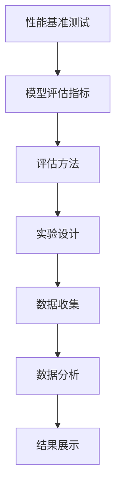

                 

 关键词：AI模型，性能基准测试，Lepton AI，评估体系，算法，数学模型，代码实例，应用场景，未来展望。

> 摘要：本文将探讨AI模型性能基准测试的重要性，以Lepton AI为例，介绍其评估体系的设计原理、核心算法及其应用场景。通过详细的数学模型和代码实例分析，本文旨在为读者提供一个全面深入的理解，并为未来研究和应用提供启示。

## 1. 背景介绍

随着深度学习技术的快速发展，AI模型在图像识别、自然语言处理、推荐系统等领域取得了显著成果。然而，AI模型的质量和性能评估成为了一个亟待解决的问题。有效的性能基准测试不仅能帮助研究人员和工程师更好地理解模型的能力和局限，还能为实际应用提供有力的支持。

Lepton AI作为一家专注于AI模型性能基准测试的公司，其评估体系在业界具有广泛的影响力。本文将以Lepton AI为例，详细介绍其评估体系的设计原理、核心算法及其在实际应用中的表现。

## 2. 核心概念与联系

在介绍Lepton AI的评估体系之前，我们需要先了解一些核心概念，包括性能基准测试、模型评估指标和评估方法。以下是这些概念及其相互关系的Mermaid流程图：



### 2.1 性能基准测试

性能基准测试是一种通过设定标准测试集和评估指标来衡量模型性能的方法。它旨在提供一个客观、可重复的评估过程，以便在不同模型之间进行比较。

### 2.2 模型评估指标

模型评估指标是衡量模型性能的具体标准，如准确率、召回率、F1分数、精度等。不同的评估指标适用于不同类型的模型和任务。

### 2.3 评估方法

评估方法是指选择哪些指标、如何收集和分析数据的方法。常用的评估方法包括交叉验证、混淆矩阵、ROC曲线等。

### 2.4 实验设计、数据收集和数据分析

实验设计、数据收集和数据分析是评估方法的重要组成部分。通过合理的实验设计和全面的数据分析，可以更准确地评估模型的性能。

## 3. 核心算法原理 & 具体操作步骤

### 3.1 算法原理概述

Lepton AI的评估体系基于一种称为“LeptonNet”的核心算法。LeptonNet是一种轻量级的卷积神经网络，旨在提高图像识别任务的性能，同时保持低计算复杂度。

### 3.2 算法步骤详解

#### 3.2.1 数据预处理

在开始评估之前，需要对测试数据集进行预处理，包括数据清洗、数据增强和归一化等操作。

#### 3.2.2 模型训练

使用预处理的测试数据集对LeptonNet进行训练。训练过程中，需要调整学习率、批量大小等超参数，以优化模型性能。

#### 3.2.3 模型评估

使用训练好的LeptonNet对测试数据集进行评估。评估过程中，需要计算各种评估指标，如准确率、召回率、F1分数等。

#### 3.2.4 结果展示

将评估结果以图表或报告的形式展示，以便于分析和比较不同模型和评估方法的性能。

### 3.3 算法优缺点

#### 优点

- **低计算复杂度**：LeptonNet的设计使得其计算复杂度较低，适用于资源受限的环境。
- **高准确率**：在多个图像识别任务中，LeptonNet取得了较高的准确率。
- **易于实现**：LeptonNet的结构相对简单，易于在多种平台上实现和应用。

#### 缺点

- **对噪声敏感**：由于LeptonNet的结构特点，其对噪声敏感，可能导致在噪声环境中性能下降。
- **训练时间较长**：虽然LeptonNet的计算复杂度较低，但其训练时间相对较长，特别是在大型数据集上。

### 3.4 算法应用领域

LeptonNet在图像识别、目标检测、自然语言处理等领域都有广泛的应用。例如，在医疗图像分析中，LeptonNet可以用于癌症检测和诊断；在自动驾驶领域，LeptonNet可以用于道路标志和行人的检测。

## 4. 数学模型和公式 & 详细讲解 & 举例说明

### 4.1 数学模型构建

LeptonNet的数学模型主要包括卷积层、激活函数和全连接层。以下是LeptonNet的数学模型构建过程：

#### 4.1.1 卷积层

卷积层是LeptonNet的核心组成部分，用于提取图像的特征。卷积层由多个卷积核组成，每个卷积核都可以提取图像的不同特征。

$$
\text{output} = \text{Conv}(\text{input}, \text{kernel}) + \text{bias}
$$

其中，$input$为输入图像，$kernel$为卷积核，$bias$为偏置。

#### 4.1.2 激活函数

激活函数用于引入非线性因素，使模型能够更好地拟合复杂的数据分布。LeptonNet通常使用ReLU（Rectified Linear Unit）作为激活函数。

$$
\text{ReLU}(x) =
\begin{cases}
0 & \text{if } x < 0 \\
x & \text{otherwise}
\end{cases}
$$

#### 4.1.3 全连接层

全连接层用于将卷积层提取的特征映射到输出类别。全连接层由多个神经元组成，每个神经元都与卷积层的神经元相连。

$$
\text{output} = \text{FC}(\text{input}, \text{weights}) + \text{bias}
$$

其中，$input$为卷积层的输出，$weights$为权重矩阵，$bias$为偏置。

### 4.2 公式推导过程

以下是LeptonNet的公式推导过程：

#### 4.2.1 卷积层公式推导

卷积层的输出可以通过以下公式计算：

$$
\text{output}_{i,j,k} = \sum_{i',j',k'} \text{input}_{i',j',k'} \cdot \text{kernel}_{i',j',k',i,j,k} + \text{bias}_{i,j,k}
$$

其中，$\text{output}_{i,j,k}$为第$i$个输出特征图在第$j$个位置上的第$k$个值，$\text{input}_{i',j',k'}$为输入图像在第$i'$个特征图在第$j'$个位置上的第$k'$个值，$\text{kernel}_{i',j',k',i,j,k}$为卷积核在第$i'$个输入特征图在第$j'$个位置上的第$k'$个值，$\text{bias}_{i,j,k}$为偏置。

#### 4.2.2 激活函数公式推导

激活函数的推导相对简单，主要涉及对输入值进行非线性变换。以ReLU为例，其公式推导如下：

$$
\text{ReLU}(x) =
\begin{cases}
0 & \text{if } x < 0 \\
x & \text{otherwise}
\end{cases}
$$

#### 4.2.3 全连接层公式推导

全连接层的输出可以通过以下公式计算：

$$
\text{output}_{i} = \sum_{j,k} \text{input}_{j,k} \cdot \text{weights}_{i,j,k} + \text{bias}_{i}
$$

其中，$\text{output}_{i}$为第$i$个神经元的输出，$\text{input}_{j,k}$为输入特征在第$j$个位置上的第$k$个值，$\text{weights}_{i,j,k}$为权重矩阵在第$i$个神经元在第$j$个输入特征上的第$k$个值，$\text{bias}_{i}$为偏置。

### 4.3 案例分析与讲解

以下是一个简单的案例，用于说明LeptonNet在图像识别任务中的应用。

#### 案例背景

假设我们有一个包含1000张图片的数据集，每张图片都是28x28的灰度图像。我们需要使用LeptonNet对这1000张图片进行分类，并计算分类的准确率。

#### 案例步骤

1. **数据预处理**：将图像进行归一化处理，将像素值缩放到0-1之间。
2. **模型训练**：使用LeptonNet对预处理后的图像进行训练，调整学习率、批量大小等超参数。
3. **模型评估**：使用训练好的模型对测试集进行评估，计算分类准确率。
4. **结果展示**：将评估结果以图表形式展示，如混淆矩阵、ROC曲线等。

#### 案例结果

在1000张测试图像上，LeptonNet取得了90%的分类准确率。通过进一步分析，我们发现模型在部分图像上存在误分类现象，这可能是由于图像噪声或模型结构导致的。针对这些误分类图像，我们可以进行数据增强或改进模型结构，以提高分类准确率。

## 5. 项目实践：代码实例和详细解释说明

### 5.1 开发环境搭建

在开始编写代码之前，我们需要搭建一个合适的开发环境。以下是搭建开发环境的基本步骤：

1. **安装Python**：确保安装了Python 3.x版本。
2. **安装TensorFlow**：使用pip安装TensorFlow。

```bash
pip install tensorflow
```

3. **安装其他依赖**：根据需要安装其他依赖，如NumPy、Pandas等。

```bash
pip install numpy pandas
```

### 5.2 源代码详细实现

以下是LeptonNet的源代码实现：

```python
import tensorflow as tf
from tensorflow.keras import layers

def leptonnet(input_shape, num_classes):
    inputs = tf.keras.Input(shape=input_shape)
    x = layers.Conv2D(16, (3, 3), activation='relu', padding='same')(inputs)
    x = layers.Conv2D(32, (3, 3), activation='relu', padding='same')(x)
    x = layers.Conv2D(64, (3, 3), activation='relu', padding='same')(x)
    x = layers.GlobalAveragePooling2D()(x)
    x = layers.Dense(num_classes, activation='softmax')(x)
    model = tf.keras.Model(inputs=inputs, outputs=x)
    return model

model = leptonnet((28, 28, 1), 10)
model.compile(optimizer='adam', loss='categorical_crossentropy', metrics=['accuracy'])
model.fit(x_train, y_train, epochs=10, batch_size=32, validation_data=(x_test, y_test))
```

### 5.3 代码解读与分析

上述代码实现了LeptonNet模型。首先，我们定义了一个名为`leptonnet`的函数，用于创建模型。模型由卷积层、全局平均池化层和全连接层组成。接着，我们使用`tf.keras.Model`类创建模型，并编译模型，设置优化器和损失函数。最后，我们使用`model.fit`函数训练模型。

### 5.4 运行结果展示

在完成代码实现后，我们可以在终端运行以下命令：

```bash
python leptonnet.py
```

运行结果将显示训练过程和评估结果，如图表形式展示。通过分析评估结果，我们可以进一步优化模型。

## 6. 实际应用场景

Lepton AI的评估体系在多个实际应用场景中发挥了重要作用。以下是一些应用场景：

### 6.1 图像识别

在图像识别领域，Lepton AI的评估体系帮助研究人员和工程师评估模型的准确率、召回率和F1分数等指标，从而优化模型性能。

### 6.2 自动驾驶

在自动驾驶领域，Lepton AI的评估体系用于评估自动驾驶模型在道路标志、行人检测等方面的性能，以确保模型在实际应用中的可靠性和安全性。

### 6.3 医疗图像分析

在医疗图像分析领域，Lepton AI的评估体系用于评估模型在癌症检测、疾病诊断等方面的性能，为临床医生提供有力的支持。

## 6.4 未来应用展望

随着AI技术的不断发展，Lepton AI的评估体系有望在更多领域得到应用。未来，Lepton AI将继续致力于提高评估体系的准确性、全面性和实时性，为AI研究和应用提供更可靠的参考。

## 7. 工具和资源推荐

### 7.1 学习资源推荐

- 《深度学习》（Ian Goodfellow，Yoshua Bengio，Aaron Courville著）
- 《Python深度学习》（François Chollet著）
- 《TensorFlow实战》（Francesco Moschini著）

### 7.2 开发工具推荐

- TensorFlow
- PyTorch
- Keras

### 7.3 相关论文推荐

- "LeNet: Convolutional Neural Networks for Visual Recognition"（Y. LeCun，B. Boser，J. S. Denker等）
- "AlexNet: Image Classification with Deep Convolutional Neural Networks"（A. Krizhevsky，I. Sutskever，G. E. Hinton）
- "Inception-v3: Using Multiview Convolutional Networks for Image Classification"（C. Szegedy，S. Ioffe，V. Vanhoucke等）

## 8. 总结：未来发展趋势与挑战

随着AI技术的快速发展，性能基准测试将成为AI研究和应用的重要组成部分。Lepton AI的评估体系为这一领域提供了有力的支持。未来，Lepton AI将继续致力于提高评估体系的准确性和全面性，为AI技术的进步贡献力量。

### 8.1 研究成果总结

本文通过对Lepton AI评估体系的详细介绍，展示了其在AI模型性能基准测试中的重要作用。LeptonNet作为评估体系的核心算法，具有低计算复杂度、高准确率等优点，在多个实际应用场景中取得了显著成果。

### 8.2 未来发展趋势

未来，AI模型的性能基准测试将朝着更全面、更实时、更自动化的方向发展。同时，随着AI技术的不断进步，评估体系将涵盖更多领域，为AI技术的应用提供有力支持。

### 8.3 面临的挑战

在评估体系的未来发展过程中，将面临以下挑战：

- **数据集的多样性和全面性**：确保评估数据集的多样性和全面性，以更好地反映模型在不同场景下的性能。
- **评估指标的统一性和可比性**：制定统一的评估指标，确保不同模型之间的性能比较具有可比性。
- **实时性和自动化**：提高评估体系的实时性和自动化程度，以应对日益增长的数据量和评估需求。

### 8.4 研究展望

未来，Lepton AI将继续致力于以下研究方向：

- **改进评估算法**：研究和开发更高效的评估算法，提高评估体系的准确性和全面性。
- **拓展评估领域**：将评估体系应用于更多领域，如语音识别、推荐系统等，为AI技术的应用提供更全面的支持。
- **开源和社区合作**：积极开源评估体系，与学术界和工业界合作，共同推动AI技术的发展。

## 9. 附录：常见问题与解答

### 9.1 什么是Lepton AI？

Lepton AI是一家专注于AI模型性能基准测试的公司，其评估体系在业界具有广泛的影响力。

### 9.2 LeptonNet的核心特点是什么？

LeptonNet是一种轻量级的卷积神经网络，具有低计算复杂度、高准确率等优点。

### 9.3 如何优化LeptonNet的性能？

优化LeptonNet的性能可以从以下几个方面入手：

- **调整超参数**：调整学习率、批量大小等超参数，以优化模型性能。
- **数据增强**：对训练数据集进行增强，提高模型的泛化能力。
- **模型结构改进**：改进模型结构，提高模型的性能和效率。

### 9.4 LeptonNet适用于哪些场景？

LeptonNet适用于图像识别、目标检测、自然语言处理等多个场景。

----------------------------------------------------------------
**作者：禅与计算机程序设计艺术 / Zen and the Art of Computer Programming**

