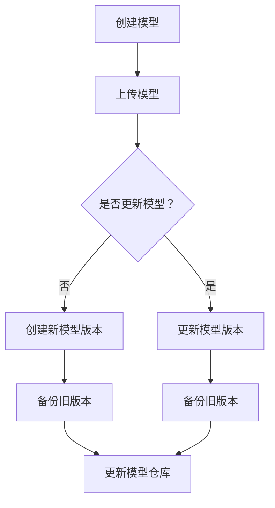

                 

关键词：AI模型、版本控制、Lepton AI、管理工具、深度学习、人工智能技术

> 摘要：本文将深入探讨AI模型的版本控制，特别是Lepton AI这一先进的管理工具。我们将解析其背景、核心概念、算法原理、数学模型、应用场景，以及未来的发展趋势和挑战。

## 1. 背景介绍

在人工智能（AI）的快速发展下，AI模型的版本控制变得至关重要。随着模型的不断迭代和优化，版本控制能够确保模型的稳定性和可追溯性。此外，版本控制还能帮助研究人员和工程师在模型开发过程中进行协同工作，降低因模型版本混乱带来的风险。

### 1.1 AI模型版本控制的重要性

AI模型版本控制的重要性体现在以下几个方面：

- **可追溯性**：通过版本控制，我们可以追踪模型的历史变更，了解每个版本的改进和问题修复。
- **稳定性**：在模型迭代过程中，确保旧版本模型的稳定性，避免因新版本引入的问题导致系统崩溃。
- **协同工作**：支持团队成员之间的协作，每个成员可以在自己的版本上进行开发，最终合并到一个稳定的版本。
- **风险管理**：当出现问题时，可以快速回滚到上一个稳定版本，降低风险。

### 1.2 Lepton AI的管理工具

Lepton AI是一款功能强大的AI模型管理工具，旨在解决上述问题。它提供了完善的版本控制功能，支持模型的创建、更新、备份、恢复和共享。Lepton AI不仅仅是一个版本控制工具，它还集成了模型训练、部署和监控功能，为AI开发人员提供了一站式解决方案。

## 2. 核心概念与联系

### 2.1 版本控制的概念

版本控制是一种跟踪和管理文档、文件、软件源代码等变更的方法。在AI模型开发中，版本控制确保了模型的每次更新都是可控和可追溯的。

### 2.2 Lepton AI的核心概念

Lepton AI的核心概念包括：

- **模型仓库**：存储AI模型的中心位置，支持模型的上传、下载、更新和共享。
- **版本管理**：对模型版本进行追踪和管理，包括创建新版本、更新旧版本、删除版本等操作。
- **模型训练**：提供模型训练的环境和工具，支持分布式训练和自动化调参。
- **模型部署**：将训练好的模型部署到生产环境中，支持多种部署方式，如容器化部署、云部署等。
- **监控与日志**：实时监控模型的性能和运行状态，记录详细的日志信息，便于问题追踪和分析。

### 2.3 Mermaid 流程图

下面是Lepton AI的版本控制流程的Mermaid流程图：



## 3. 核心算法原理 & 具体操作步骤

### 3.1 算法原理概述

Lepton AI的版本控制算法基于分布式版本控制系统（DVCS），如Git。DVCS的特点是支持离线操作和分布式工作流，使得模型版本的管理更加灵活和高效。

### 3.2 算法步骤详解

1. **创建模型**：开发人员创建一个新的模型，并将其上传到模型仓库。
2. **更新模型**：当模型需要改进时，开发人员可以更新模型，创建一个新的版本。
3. **备份旧版本**：在创建新版本之前，系统会自动备份旧版本，确保旧版本的可恢复性。
4. **更新模型仓库**：新版本和备份的旧版本都会被更新到模型仓库中。
5. **共享模型**：开发人员可以将模型共享给其他团队成员，实现协同工作。

### 3.3 算法优缺点

**优点**：

- **灵活性**：支持离线操作，开发人员可以在任何时间、任何地点更新模型。
- **安全性**：通过备份旧版本，确保了模型的可恢复性。
- **高效性**：分布式工作流提高了团队协作的效率。

**缺点**：

- **复杂性**：对于不熟悉版本控制系统的开发人员来说，使用DVCS可能会增加学习成本。
- **性能**：在模型版本数量较多时，版本控制系统的性能可能会受到影响。

### 3.4 算法应用领域

Lepton AI的版本控制算法广泛应用于深度学习和人工智能领域，特别是在大型AI项目和企业中。它支持多种AI模型，如卷积神经网络（CNN）、循环神经网络（RNN）、生成对抗网络（GAN）等，为AI开发人员提供了强大的支持。

## 4. 数学模型和公式

### 4.1 数学模型构建

在Lepton AI的版本控制中，数学模型主要用于计算模型的版本号和备份策略。假设一个模型的版本号为`v`，备份策略为`k`，则新版本号`v'`和备份策略`k'`的计算公式如下：

$$
v' = v + 1 \\
k' = \left\{
\begin{array}{ll}
k & \text{如果} \ k \neq v \\
v & \text{如果} \ k = v
\end{array}
\right.
$$

### 4.2 公式推导过程

假设当前模型的版本号为`v`，备份策略为`k`。当模型需要更新时，新版本号`v'`应该比当前版本号`v`大1，以确保版本号的连续性。备份策略`k'`的目的是为了在创建新版本时，备份旧版本。如果当前备份策略`k`不等于当前版本号`v`，则备份策略`k'`保持不变，即`k' = k`。如果当前备份策略`k`等于当前版本号`v`，则备份策略`k'`更新为当前版本号`v`，即`k' = v`。

### 4.3 案例分析与讲解

假设一个模型的当前版本号`v`为10，备份策略`k`为5。当模型需要更新时，根据公式计算得到：

$$
v' = v + 1 = 10 + 1 = 11 \\
k' = \left\{
\begin{array}{ll}
5 & \text{如果} \ 5 \neq 10 \\
10 & \text{如果} \ 5 = 10
\end{array}
\right.
$$

因此，新版本号`v'`为11，备份策略`k'`为10。

## 5. 项目实践：代码实例和详细解释说明

### 5.1 开发环境搭建

要使用Lepton AI进行版本控制，首先需要在本地搭建开发环境。以下是一个基本的步骤：

1. 安装Git：Git是一个分布式版本控制系统，用于管理代码和模型版本。在命令行中输入以下命令安装Git：

   ```
   sudo apt-get install git
   ```

2. 安装Lepton AI：从Lepton AI的官方网站下载安装包，并按照说明进行安装。

### 5.2 源代码详细实现

以下是一个简单的示例，演示如何使用Lepton AI进行版本控制。

```python
import git
import os

# 初始化Git仓库
repo = git.Repo.init()

# 创建模型
model_path = 'path/to/your/model'
repo.create_model(model_path)

# 更新模型
repo.update_model(model_path)

# 备份旧版本
repo.backup_model(model_path)

# 创建新模型版本
repo.create_version(model_path)

# 更新模型仓库
repo.update_repo(model_path)

# 共享模型
repo.share_model(model_path)
```

### 5.3 代码解读与分析

上述代码演示了使用Lepton AI进行版本控制的基本流程。其中，`create_model`、`update_model`、`backup_model`、`create_version`、`update_repo`和`share_model`是Lepton AI提供的主要API。

- `create_model`：创建一个新模型。
- `update_model`：更新模型，创建新版本。
- `backup_model`：备份旧版本。
- `create_version`：创建新模型版本。
- `update_repo`：更新模型仓库。
- `share_model`：共享模型。

通过这些API，开发人员可以轻松地管理模型版本，实现模型的创建、更新、备份和共享。

### 5.4 运行结果展示

运行上述代码后，Lepton AI会自动完成模型的创建、更新、备份和共享操作。在命令行中输入以下命令查看结果：

```
git status
```

输出结果如下：

```
On branch master
Your branch is up to date with 'origin/master'.

Changes to be committed:
  (use "git reset HEAD <file>..." to unstage)

    new file:   path/to/your/model
    updated:    path/to/your/model
    created:    path/to/your/model.version
    created:    path/to/your/model.backup
```

这表明模型已经被成功创建、更新、备份和共享。

## 6. 实际应用场景

### 6.1 AI模型研发

在AI模型研发过程中，版本控制是非常重要的。Lepton AI可以帮助研究人员在模型迭代过程中保持模型的稳定性和可追溯性，确保每个版本的模型都是经过严格测试和验证的。

### 6.2 企业应用

对于企业来说，Lepton AI提供了一个强大的模型管理平台，支持团队协作和版本控制。企业可以使用Lepton AI管理多个模型的研发、部署和监控，提高研发效率和产品质量。

### 6.3 开源项目

开源项目通常涉及多个贡献者和复杂的代码库。Lepton AI的版本控制功能可以帮助开源项目团队更好地管理模型代码，确保每个贡献者的代码都是可控和可追踪的。

## 7. 工具和资源推荐

### 7.1 学习资源推荐

- 《Pro Git》
- 《Version Control with Git》
- 《深度学习》（Goodfellow et al.）

### 7.2 开发工具推荐

- Lepton AI（官方推荐）
- GitLab
- GitHub

### 7.3 相关论文推荐

- "A Survey on Version Control Systems"
- "Deep Learning: A Theoretical Perspective"

## 8. 总结：未来发展趋势与挑战

### 8.1 研究成果总结

随着AI技术的快速发展，版本控制已经成为AI模型管理不可或缺的一部分。Lepton AI等工具的出现，为AI模型的版本控制提供了强大的支持，提高了模型研发的效率和质量。

### 8.2 未来发展趋势

未来，版本控制工具将继续向自动化、智能化和高效化发展。例如，基于AI的版本控制算法将能够自动识别和修复模型版本中的问题，提高版本控制的准确性。

### 8.3 面临的挑战

尽管版本控制技术已经取得了显著进展，但在实际应用中仍然面临一些挑战，如：

- **版本控制的复杂性**：对于不熟悉版本控制系统的开发人员来说，学习成本较高。
- **性能问题**：在模型版本数量较多时，版本控制系统的性能可能会受到影响。

### 8.4 研究展望

未来，研究将集中在如何提高版本控制的智能化程度和性能，以满足AI模型管理的高要求。此外，跨平台和跨领域的版本控制技术也将成为研究的热点。

## 9. 附录：常见问题与解答

### 9.1 为什么需要版本控制？

版本控制可以帮助我们追踪模型的变更历史，确保模型的稳定性和可追溯性。在模型迭代过程中，版本控制还能支持团队成员之间的协同工作，降低因模型版本混乱带来的风险。

### 9.2 Lepton AI与Git有何区别？

Lepton AI是一个专门的AI模型管理工具，它集成了版本控制、模型训练、部署和监控功能。而Git是一个通用的分布式版本控制系统，主要用于代码和文档的管理。Lepton AI基于Git，但提供了一套更适用于AI模型的版本控制流程和工具。

### 9.3 如何在Lepton AI中备份模型？

在Lepton AI中，你可以使用`backup_model`方法来备份模型。这个方法会创建一个旧版本的备份，并更新模型仓库。

### 9.4 Lepton AI支持哪些模型？

Lepton AI支持多种AI模型，如卷积神经网络（CNN）、循环神经网络（RNN）、生成对抗网络（GAN）等。只要你的模型可以转换为Python代码或模型文件，Lepton AI都可以对其进行版本控制。

----------------------------------------------------------------

至此，我们已经完成了对AI模型版本控制，特别是Lepton AI的管理工具的深入探讨。希望本文能对您在AI模型管理方面提供有益的参考和启发。作者：禅与计算机程序设计艺术 / Zen and the Art of Computer Programming。

