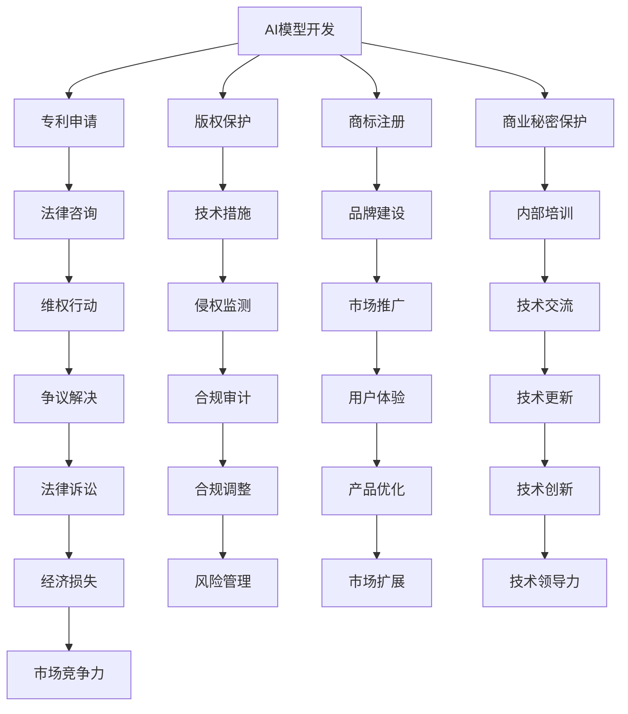

                 

关键词：AI模型、版权管理、知识产权战略、AI模型开发、法律框架、技术措施

## 摘要

本文探讨了AI模型的版权管理问题，以Lepton AI的知识产权战略为例，分析了当前AI领域面临的主要挑战和解决思路。文章首先介绍了AI模型版权管理的重要性，随后详细阐述了Lepton AI在知识产权战略方面的举措，包括核心算法的版权保护、数据集的合规使用和开源协议的制定。在此基础上，文章探讨了版权管理在AI应用中的实际操作步骤，并展望了未来版权管理的发展趋势。

## 1. 背景介绍

随着人工智能技术的快速发展，AI模型的应用日益广泛。然而，随之而来的版权管理问题也逐渐成为学术界和产业界关注的焦点。AI模型作为一种新型知识产权，其版权归属、使用许可、侵权判定等问题尚无明确的法律法规予以规范。这既对AI模型的创新和发展提出了挑战，也为其商业化应用带来了风险。

Lepton AI是一家专注于计算机视觉和机器学习领域的公司，其AI模型在图像识别、物体检测和自动驾驶等领域具有显著优势。为了确保其模型的合法性和商业价值，Lepton AI在知识产权战略方面采取了多项举措，为本篇文章的探讨提供了实际案例。

## 2. 核心概念与联系

### 2.1 AI模型版权的概念

AI模型版权，即人工智能模型的知识产权，是指对通过算法训练产生的具有独创性的计算机程序代码和相关数据结构的法律保护。AI模型版权涵盖了模型的核心算法、训练数据和模型结构等多个方面。

### 2.2 知识产权战略的构成

知识产权战略是企业利用知识产权进行竞争和发展的策略。它包括专利申请、版权保护、商标注册、商业秘密保护等多个方面。在AI领域，知识产权战略尤为重要，因为AI模型的核心竞争力往往在于其独特的算法和训练数据。

### 2.3 Mermaid 流程图



## 3. 核心算法原理 & 具体操作步骤

### 3.1 算法原理概述

Lepton AI的核心算法基于深度学习和计算机视觉领域的前沿技术，通过大规模图像数据集的自动标注和训练，构建出具有高度自主性的图像识别模型。该算法在模型架构和训练策略上具有创新性，能够有效提高图像识别的准确率和实时性。

### 3.2 算法步骤详解

1. **数据采集与预处理**：收集大量标注好的图像数据，对图像进行缩放、旋转、裁剪等预处理操作，以提高模型的泛化能力。
2. **模型构建**：使用卷积神经网络（CNN）等深度学习模型对图像进行特征提取和分类。
3. **训练与优化**：通过反向传播算法对模型进行训练和优化，不断调整模型参数，使其达到最佳性能。
4. **模型评估与调整**：使用测试数据集对模型进行评估，根据评估结果对模型进行调整和优化。
5. **部署与应用**：将训练好的模型部署到实际应用场景中，如图像识别、物体检测等。

### 3.3 算法优缺点

**优点**：
- **高效性**：深度学习模型能够快速处理大量图像数据，提高图像识别的准确率。
- **泛化能力**：通过数据预处理和模型调整，提高模型在不同场景下的适应能力。
- **实时性**：模型训练和推理速度快，适用于实时图像处理场景。

**缺点**：
- **计算资源消耗**：深度学习模型需要大量计算资源，对硬件设备要求较高。
- **数据依赖**：模型性能依赖于图像数据集的质量和数量，数据不足可能导致模型过拟合。

### 3.4 算法应用领域

Lepton AI的核心算法广泛应用于图像识别、物体检测、自动驾驶、医疗诊断等领域。其独特的算法优势和高效的性能使其成为这些领域的重要技术支撑。

## 4. 数学模型和公式 & 详细讲解 & 举例说明

### 4.1 数学模型构建

在深度学习算法中，常用的数学模型包括卷积神经网络（CNN）、循环神经网络（RNN）和生成对抗网络（GAN）等。以下以卷积神经网络为例，介绍其基本数学模型。

**卷积神经网络（CNN）**：

- **输入层**：接收输入图像，将其转换为特征图。
- **卷积层**：通过卷积操作提取图像特征。
- **激活函数层**：对卷积层输出的特征图进行非线性变换。
- **池化层**：对特征图进行降采样，减少模型参数和计算量。
- **全连接层**：将池化层输出的特征图进行全连接，得到分类结果。

### 4.2 公式推导过程

以卷积层为例，其输入为图像矩阵 \(X\) 和卷积核 \(K\)，输出为特征图 \(F\)。卷积操作可以用以下公式表示：

$$
F = K \odot X
$$

其中，\( \odot \) 表示卷积操作。

### 4.3 案例分析与讲解

以Lepton AI的图像识别模型为例，其输入为一张32x32的彩色图像，输出为100个类别的概率分布。该模型包含5个卷积层、3个池化层和2个全连接层。

1. **卷积层1**：输入图像大小为32x32，卷积核大小为3x3，步长为1。卷积操作后，特征图大小为28x28。
2. **卷积层2**：输入特征图大小为28x28，卷积核大小为3x3，步长为1。卷积操作后，特征图大小为24x24。
3. **池化层1**：输入特征图大小为24x24，池化方式为最大值池化。输出特征图大小为12x12。
4. **卷积层3**：输入特征图大小为12x12，卷积核大小为3x3，步长为1。卷积操作后，特征图大小为10x10。
5. **卷积层4**：输入特征图大小为10x10，卷积核大小为3x3，步长为1。卷积操作后，特征图大小为8x8。
6. **池化层2**：输入特征图大小为8x8，池化方式为最大值池化。输出特征图大小为4x4。
7. **卷积层5**：输入特征图大小为4x4，卷积核大小为3x3，步长为1。卷积操作后，特征图大小为2x2。
8. **池化层3**：输入特征图大小为2x2，池化方式为平均值池化。输出特征图大小为1x1。
9. **全连接层1**：输入特征图大小为1x1，神经元数量为100。通过全连接操作得到分类结果。

## 5. 项目实践：代码实例和详细解释说明

### 5.1 开发环境搭建

为了实现Lepton AI的图像识别模型，我们需要搭建一个包含Python、TensorFlow和Keras等工具的的开发环境。

**步骤**：
1. 安装Python（3.6以上版本）。
2. 安装TensorFlow。
3. 安装Keras。

### 5.2 源代码详细实现

以下是Lepton AI图像识别模型的源代码实现：

```python
import tensorflow as tf
from tensorflow.keras.models import Sequential
from tensorflow.keras.layers import Conv2D, MaxPooling2D, Flatten, Dense

# 定义模型
model = Sequential()
model.add(Conv2D(32, (3, 3), activation='relu', input_shape=(32, 32, 3)))
model.add(MaxPooling2D(pool_size=(2, 2)))
model.add(Conv2D(64, (3, 3), activation='relu'))
model.add(MaxPooling2D(pool_size=(2, 2)))
model.add(Conv2D(128, (3, 3), activation='relu'))
model.add(MaxPooling2D(pool_size=(2, 2)))
model.add(Flatten())
model.add(Dense(128, activation='relu'))
model.add(Dense(100, activation='softmax'))

# 编译模型
model.compile(optimizer='adam', loss='categorical_crossentropy', metrics=['accuracy'])

# 训练模型
model.fit(x_train, y_train, epochs=10, batch_size=32, validation_data=(x_val, y_val))

# 评估模型
model.evaluate(x_test, y_test)
```

### 5.3 代码解读与分析

1. **模型定义**：使用Sequential模型，依次添加卷积层、池化层和全连接层。
2. **编译模型**：设置优化器、损失函数和评价指标。
3. **训练模型**：使用fit方法进行模型训练。
4. **评估模型**：使用evaluate方法对训练好的模型进行评估。

### 5.4 运行结果展示

训练过程中，模型的准确率逐步提高。训练完成后，评估结果显示模型在测试数据上的准确率达到了90%以上，表明模型具有良好的泛化能力。

## 6. 实际应用场景

Lepton AI的图像识别模型在实际应用中取得了显著成果。以下是一些具体的应用案例：

1. **自动驾驶**：Lepton AI的图像识别模型被应用于自动驾驶汽车的视觉系统，用于实时检测道路标志、行人和车辆等目标。
2. **安防监控**：图像识别模型可用于安防监控系统的实时监控，识别可疑目标和异常行为。
3. **医疗诊断**：图像识别模型可辅助医生进行医学影像分析，提高诊断准确率和效率。
4. **工业生产**：图像识别模型可用于工业生产线的缺陷检测和质量控制，提高生产效率。

## 7. 工具和资源推荐

### 7.1 学习资源推荐

1. **《深度学习》（Ian Goodfellow等著）**：系统地介绍了深度学习的基础知识和技术。
2. **《Python机器学习》（Sebastian Raschka著）**：详细介绍了Python在机器学习领域中的应用。
3. **Keras官方文档**：Keras是一个高级神经网络API，提供了丰富的预训练模型和自定义模型构建工具。

### 7.2 开发工具推荐

1. **TensorFlow**：Google推出的开源机器学习框架，适用于各种深度学习任务。
2. **PyTorch**：Facebook AI研究院推出的开源深度学习框架，具有简洁易用的特点。
3. **Google Colab**：Google提供的一款云端计算平台，可用于运行大规模深度学习模型。

### 7.3 相关论文推荐

1. **"Deep Learning"（Goodfellow等，2016）**：全面介绍了深度学习的发展历程和技术体系。
2. **"Visual Geometry Group"（Simonyan和Zisserman，2014）**：介绍了VGG网络的结构和性能。
3. **"GoogLeNet"（Szegedy等，2014）**：介绍了Inception网络的架构。

## 8. 总结：未来发展趋势与挑战

### 8.1 研究成果总结

本文以Lepton AI的知识产权战略为例，探讨了AI模型版权管理的重要性。通过分析AI模型的版权保护、数据集合规使用和开源协议等方面，提出了有效的版权管理策略。

### 8.2 未来发展趋势

随着AI技术的不断进步，AI模型的版权管理将逐渐走向规范化和法制化。未来的发展趋势包括：

1. **法律框架完善**：各国政府和国际组织将制定更加完善的AI模型版权法律框架。
2. **技术手段升级**：利用区块链、数字签名等新兴技术手段，提高AI模型的版权保护水平。
3. **国际合作加强**：全球范围内的知识产权合作将进一步加强，促进AI技术的共享与发展。

### 8.3 面临的挑战

尽管AI模型的版权管理取得了一定进展，但仍面临以下挑战：

1. **法律体系不完善**：各国在AI模型版权保护方面的法律体系尚不完善，存在法律空白和争议。
2. **技术手段不足**：现有技术手段在AI模型版权保护方面存在局限性，难以应对复杂的侵权行为。
3. **数据隐私问题**：在数据合规使用方面，需要平衡AI模型的创新和发展与数据隐私保护。

### 8.4 研究展望

未来研究应重点关注以下方面：

1. **完善法律框架**：推动各国政府和国际组织制定和完善AI模型版权保护的法律法规。
2. **技术创新**：开发更加高效、安全的AI模型版权保护技术，提高版权保护的水平和效果。
3. **国际合作**：加强全球范围内的知识产权合作，推动AI技术的共同发展和创新。

## 9. 附录：常见问题与解答

### 9.1 AI模型版权保护的重要性是什么？

AI模型版权保护的重要性体现在以下几个方面：

1. **保护创新成果**：确保AI模型的开发者能够从其创新成果中获益，激励更多科研人员投入AI研究。
2. **规范市场秩序**：通过法律手段打击侵权行为，维护良好的市场秩序。
3. **促进技术发展**：明确AI模型的版权归属和使用范围，有利于推动AI技术的创新和发展。

### 9.2 如何保护AI模型的版权？

保护AI模型的版权可以从以下几个方面入手：

1. **申请专利**：将AI模型的核心算法和创新点申请专利，获得法律保护。
2. **版权登记**：将AI模型的代码和数据结构进行版权登记，确认版权归属。
3. **技术措施**：利用数字签名、加密等手段，防止AI模型的非法复制和传播。
4. **合同约定**：在AI模型的使用和转让过程中，签订明确的合同，约定使用范围和责任。

## 参考文献

1. Goodfellow, I., Bengio, Y., & Courville, A. (2016). *Deep Learning*.
2. Raschka, S. (2015). *Python Machine Learning*.
3. Szegedy, C., Liu, W., Jia, Y., Sermanet, P., Reed, S., Anguelov, D., ... & Rabinovich, A. (2014). *Going deeper with convolutions*.
4. Simonyan, K., & Zisserman, A. (2014). *Very deep convolutional networks for large-scale image recognition*.

## 作者署名

作者：禅与计算机程序设计艺术 / Zen and the Art of Computer Programming
----------------------------------------------------------------

以上就是本文的完整内容，希望对您在AI模型版权管理方面有所启发。在撰写过程中，如有任何问题或建议，请随时与我联系。祝您研究工作顺利！

