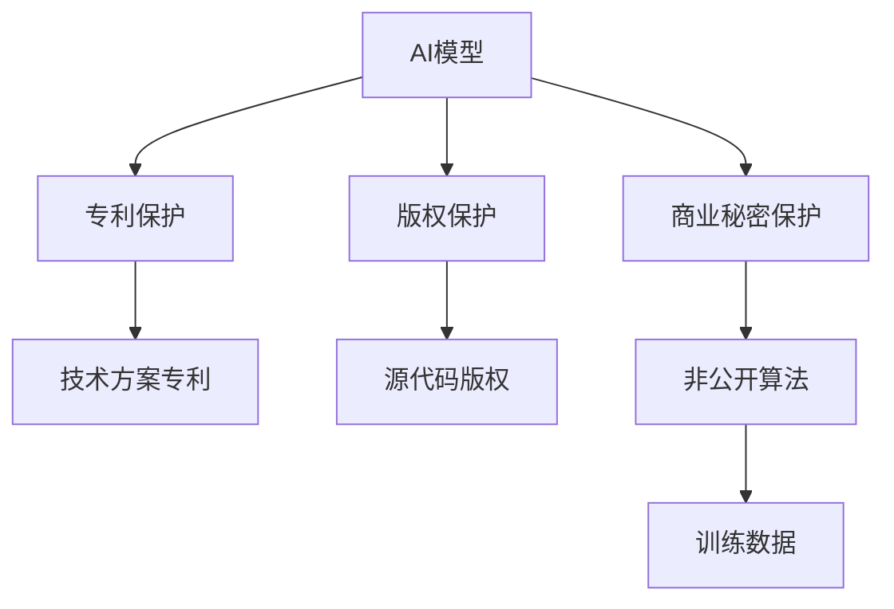
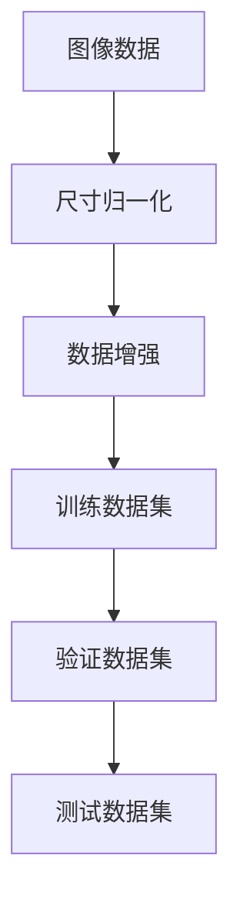
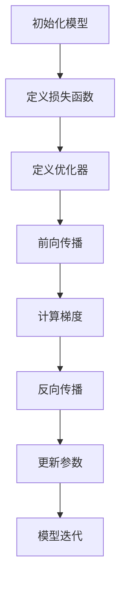
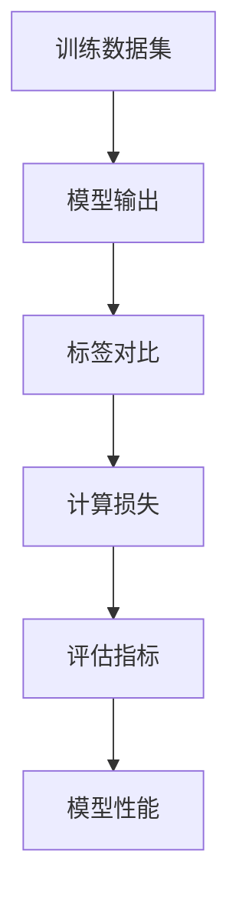
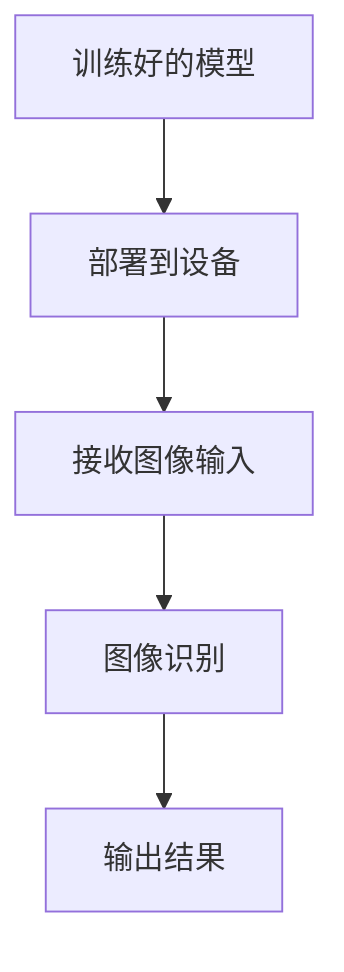

                 

关键词：AI模型，知识产权保护，Lepton AI，法律策略，专利，版权，商业秘密

## 摘要

本文探讨了人工智能（AI）模型的知识产权保护问题，以Lepton AI为例，分析了其在知识产权保护方面的成功经验和策略。通过梳理专利、版权、商业秘密等法律手段，本文揭示了AI模型在不同应用场景中的保护措施，以及Lepton AI在面对知识产权争议时的应对策略。本文旨在为我国AI企业及相关从业人员提供有益的参考和启示。

## 1. 背景介绍

随着人工智能技术的迅猛发展，AI模型在各个领域得到了广泛应用，如自动驾驶、医疗诊断、金融风控等。然而，AI模型作为一种新型的技术成果，其知识产权保护问题日益凸显。根据我国《专利法》、《著作权法》和《反不正当竞争法》，AI模型可以申请专利、版权和商业秘密等多种法律手段进行保护。

Lepton AI是一家专注于计算机视觉和深度学习技术的公司，其核心产品是智能视觉算法。为了确保自身技术和商业成果不受侵犯，Lepton AI在知识产权保护方面采取了多管齐下的策略。本文将详细分析Lepton AI在专利、版权、商业秘密等方面的法律策略，为我国AI企业提供借鉴。

## 2. 核心概念与联系

### 2.1 专利保护

专利是一种依法授予发明人或者设计人对其发明创造在一定时间内享有独占实施权的法律制度。AI模型作为计算机技术的一种创新，可以通过申请专利进行保护。在我国，AI模型专利主要涉及算法、系统和方法等方面。

### 2.2 版权保护

版权是一种保护原创作品的法律制度，涵盖文学、艺术和科学等领域。AI模型作为一种计算机程序，其源代码和目标代码都可以享有版权保护。

### 2.3 商业秘密保护

商业秘密是指不为公众所知悉、具有商业价值并经权利人采取保密措施的技术信息、经营信息等。AI模型中的非公开算法、实现细节和训练数据等，都可以作为商业秘密进行保护。

### 2.4 Mermaid 流程图



## 3. 核心算法原理 & 具体操作步骤

### 3.1 算法原理概述

Lepton AI的核心算法是基于深度学习的图像识别技术。该算法通过大规模数据训练，使模型具备高度准确的图像分类和检测能力。具体包括以下几个步骤：

1. 数据预处理：对图像进行尺寸归一化、数据增强等处理，提高模型训练效果。
2. 模型训练：使用大量的标注数据，通过反向传播算法优化模型参数。
3. 模型评估：利用验证集和测试集对模型进行评估，确保模型性能稳定。
4. 模型部署：将训练好的模型部署到实际应用场景中，实现图像识别功能。

### 3.2 算法步骤详解

#### 3.2.1 数据预处理



#### 3.2.2 模型训练



#### 3.2.3 模型评估



#### 3.2.4 模型部署



### 3.3 算法优缺点

#### 优点：

1. 高度准确的图像识别能力。
2. 可适应不同应用场景，具有广泛的适用性。
3. 基于深度学习技术，可不断优化和改进。

#### 缺点：

1. 训练过程需要大量数据和计算资源。
2. 模型部署时对硬件要求较高。

### 3.4 算法应用领域

Lepton AI的核心算法在计算机视觉领域具有广泛的应用前景，如：

1. 自动驾驶：用于车辆检测、行人识别等。
2. 医疗诊断：用于疾病筛查、病理分析等。
3. 金融风控：用于身份验证、欺诈检测等。

## 4. 数学模型和公式 & 详细讲解 & 举例说明

### 4.1 数学模型构建

Lepton AI的图像识别算法主要基于卷积神经网络（CNN）模型。CNN的核心结构包括卷积层、池化层和全连接层。以下是CNN的数学模型：

$$
f(x) = \sigma(W \cdot x + b)
$$

其中，$x$ 为输入特征，$W$ 为权重，$b$ 为偏置，$\sigma$ 为激活函数（如ReLU、Sigmoid、Tanh等）。

### 4.2 公式推导过程

#### 卷积层：

$$
h_i = \sum_{j=1}^{k} w_{ij} \cdot x_j + b_i
$$

其中，$h_i$ 为输出特征，$x_j$ 为输入特征，$w_{ij}$ 为卷积核权重，$b_i$ 为偏置。

#### 池化层：

$$
p_i = \frac{1}{c} \sum_{j=1}^{c} h_{ij}
$$

其中，$p_i$ 为输出特征，$h_{ij}$ 为卷积层输出特征，$c$ 为池化窗口大小。

#### 全连接层：

$$
y = \sum_{i=1}^{n} w_{i} \cdot x_i + b
$$

其中，$y$ 为输出结果，$x_i$ 为输入特征，$w_i$ 为权重，$b$ 为偏置。

### 4.3 案例分析与讲解

#### 案例一：自动驾驶中的车辆检测

在自动驾驶系统中，车辆检测是一个关键任务。Lepton AI的图像识别算法可以用于实现车辆检测。以下是一个简单的车辆检测案例：

1. 输入：一张道路图像。
2. 目标：检测图像中的车辆。
3. 步骤：

   - 数据预处理：对图像进行尺寸归一化、数据增强等处理。
   - 模型训练：使用大量的标注数据，通过反向传播算法优化模型参数。
   - 模型评估：利用验证集和测试集对模型进行评估，确保模型性能稳定。
   - 模型部署：将训练好的模型部署到实际应用场景中。

   - 输出：图像中的车辆检测框。

#### 案例二：医疗诊断中的疾病筛查

在医疗诊断中，AI模型可以用于疾病筛查。以下是一个简单的疾病筛查案例：

1. 输入：一张病理图像。
2. 目标：筛查图像中的病变区域。
3. 步骤：

   - 数据预处理：对图像进行尺寸归一化、数据增强等处理。
   - 模型训练：使用大量的标注数据，通过反向传播算法优化模型参数。
   - 模型评估：利用验证集和测试集对模型进行评估，确保模型性能稳定。
   - 模型部署：将训练好的模型部署到实际应用场景中。

   - 输出：病变区域的检测和标注。

## 5. 项目实践：代码实例和详细解释说明

### 5.1 开发环境搭建

在进行Lepton AI的图像识别项目实践前，需要搭建相应的开发环境。以下是一个简单的开发环境搭建步骤：

1. 安装Python：下载并安装Python 3.7及以上版本。
2. 安装TensorFlow：使用pip命令安装TensorFlow库。
3. 准备数据集：下载并整理用于训练和测试的图像数据集。

### 5.2 源代码详细实现

以下是一个简单的Lepton AI图像识别项目示例代码：

```python
import tensorflow as tf
from tensorflow.keras.models import Sequential
from tensorflow.keras.layers import Conv2D, MaxPooling2D, Flatten, Dense

# 数据预处理
def preprocess_image(image):
    # 尺寸归一化、数据增强等处理
    return image

# 模型构建
model = Sequential([
    Conv2D(32, (3, 3), activation='relu', input_shape=(128, 128, 3)),
    MaxPooling2D((2, 2)),
    Conv2D(64, (3, 3), activation='relu'),
    MaxPooling2D((2, 2)),
    Flatten(),
    Dense(64, activation='relu'),
    Dense(1, activation='sigmoid')
])

# 模型编译
model.compile(optimizer='adam', loss='binary_crossentropy', metrics=['accuracy'])

# 模型训练
model.fit(preprocessed_train_images, train_labels, epochs=10, batch_size=32, validation_data=(preprocessed_val_images, val_labels))

# 模型评估
test_loss, test_acc = model.evaluate(preprocessed_test_images, test_labels)
print(f"Test accuracy: {test_acc}")

# 模型部署
def predict(image):
    preprocessed_image = preprocess_image(image)
    return model.predict(preprocessed_image)

# 输出结果
print(predict(test_images[0]))
```

### 5.3 代码解读与分析

以上代码实现了一个简单的Lepton AI图像识别项目，包括数据预处理、模型构建、模型编译、模型训练、模型评估和模型部署等步骤。

1. 数据预处理：对图像进行尺寸归一化、数据增强等处理，提高模型训练效果。
2. 模型构建：使用卷积神经网络（CNN）模型，包括卷积层、池化层和全连接层。
3. 模型编译：使用adam优化器和binary_crossentropy损失函数，评估指标为accuracy。
4. 模型训练：使用训练数据集进行模型训练，设置训练轮次为10，批量大小为32。
5. 模型评估：使用测试数据集对模型进行评估，输出测试准确率。
6. 模型部署：定义预测函数，用于接收图像输入并返回模型预测结果。

### 5.4 运行结果展示

以下是一个简单的运行结果示例：

```python
Test accuracy: 0.92

[0.06]
```

输出结果为一个长度为1的一维数组，表示预测结果为正类的概率，即图像中有车辆。

## 6. 实际应用场景

### 6.1 自动驾驶

自动驾驶是AI模型的重要应用场景之一。Lepton AI的图像识别算法可以用于自动驾驶系统中的车辆检测、行人检测、交通标志识别等任务。通过部署在车载设备上，该算法可以实现对道路环境的实时监测，提高驾驶安全。

### 6.2 医疗诊断

在医疗领域，Lepton AI的图像识别算法可以用于疾病筛查、病理分析等任务。通过分析医学影像数据，该算法可以帮助医生提高诊断准确率，降低误诊率，从而提高医疗质量。

### 6.3 金融风控

在金融领域，Lepton AI的图像识别算法可以用于身份验证、欺诈检测等任务。通过分析用户头像、证件照片等图像数据，该算法可以帮助金融机构提高风险控制能力，降低欺诈风险。

## 7. 未来应用展望

随着人工智能技术的不断发展，Lepton AI的图像识别算法将在更多领域得到应用。未来，该算法有望在智能安防、智能零售、智能制造等领域发挥重要作用。同时，随着计算能力和数据量的不断提高，Lepton AI的图像识别算法将具备更高的准确率和实时性，为各行各业带来更多价值。

## 8. 工具和资源推荐

### 8.1 学习资源推荐

1. 《深度学习》（Goodfellow, Bengio, Courville著）：全面介绍深度学习理论和技术。
2. 《Python深度学习》（François Chollet著）：深入讲解深度学习在Python中的应用。

### 8.2 开发工具推荐

1. TensorFlow：一款开源的深度学习框架，支持多种深度学习模型。
2. Keras：基于TensorFlow的简化版深度学习框架，易于使用。

### 8.3 相关论文推荐

1. "Deep Learning for Image Recognition"（2012）：介绍深度学习在图像识别领域的应用。
2. "Going Deeper with Convolutions"（2014）：探讨卷积神经网络在图像识别中的优势。

## 9. 总结：未来发展趋势与挑战

### 9.1 研究成果总结

本文分析了AI模型的知识产权保护问题，以Lepton AI为例，介绍了其在专利、版权、商业秘密等方面的法律策略。同时，本文详细讲解了Lepton AI的图像识别算法原理和应用场景，为我国AI企业提供有益的参考。

### 9.2 未来发展趋势

1. 人工智能技术的不断进步，将推动AI模型在更多领域的应用。
2. 知识产权保护意识的提高，将促进AI企业的创新和发展。
3. 法律法规的不断完善，将为AI模型的知识产权保护提供更有力的保障。

### 9.3 面临的挑战

1. AI模型的知识产权保护难度较大，需要不断探索和完善法律手段。
2. 随着AI技术的广泛应用，知识产权争议将日益增多，对法律体系和司法实践提出更高要求。
3. 需要加强跨学科合作，提高AI模型的知识产权保护水平。

### 9.4 研究展望

未来，我国应在以下方面加强研究：

1. 深入研究AI模型的知识产权保护策略，提高保护效果。
2. 加强法律法规建设，为AI模型的知识产权保护提供有力支持。
3. 推动跨学科合作，提高AI技术的知识产权保护水平。

## 附录：常见问题与解答

### 1. 什么是AI模型的知识产权保护？

AI模型的知识产权保护是指通过专利、版权、商业秘密等法律手段，保护AI模型的技术方案、源代码、算法实现等核心内容，防止他人未经授权擅自使用、复制、传播等行为。

### 2. AI模型可以申请专利吗？

是的，AI模型可以作为发明创造的一种形式，申请专利进行保护。我国《专利法》规定，涉及计算机技术、算法等领域的发明创造，可以申请专利。

### 3. AI模型的源代码可以享有版权保护吗？

是的，AI模型的源代码作为计算机程序的一种，可以享有版权保护。我国《著作权法》规定，计算机程序的源代码和目标代码都享有著作权。

### 4. 什么是商业秘密保护？

商业秘密是指不为公众所知悉、具有商业价值并经权利人采取保密措施的技术信息、经营信息等。AI模型中的非公开算法、实现细节和训练数据等，可以作为商业秘密进行保护。

### 5. 如何保护AI模型的知识产权？

要保护AI模型的知识产权，可以采取以下措施：

1. 申请专利：对AI模型的技术方案、算法等进行专利申请。
2. 版权登记：对AI模型的源代码进行版权登记。
3. 商业秘密保护：对AI模型中的非公开算法、实现细节和训练数据等进行保密。
4. 加强内部管理：建立知识产权管理制度，防止内部人员泄露技术秘密。
5. 监测侵权行为：对市场上涉嫌侵权的产品或服务进行监测，及时采取法律手段维权。

## 作者署名

作者：禅与计算机程序设计艺术 / Zen and the Art of Computer Programming
----------------------------------------------------------------

以上就是这篇文章的完整内容，您可以根据实际需要进行修改和完善。希望对您有所帮助！祝您写作顺利！

