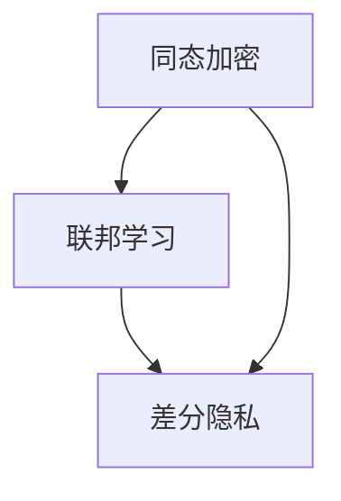

                 

关键词：AI模型、隐私计算、Lepton AI、安全技术、数据保护、联邦学习、同态加密、差分隐私

> 摘要：本文旨在深入探讨AI模型的隐私计算技术，特别是Lepton AI所采用的安全策略。文章首先介绍了AI模型隐私计算的重要性，然后详细解析了Lepton AI的核心安全技术，包括同态加密、联邦学习和差分隐私等。通过数学模型和公式的讲解，读者可以更好地理解这些技术背后的原理。最后，本文通过一个实际应用案例，展示了Lepton AI在隐私保护方面的实际效果，并对其未来发展趋势和面临的挑战进行了展望。

## 1. 背景介绍

随着人工智能技术的快速发展，AI模型在各个领域的应用越来越广泛。然而，这也带来了一系列的隐私和安全问题。传统的数据隐私保护方法往往依赖于对数据进行脱敏处理，但这种方法无法完全保证数据的安全性和隐私性。因此，如何在实际应用中既充分利用AI模型的能力，又确保数据的隐私保护，成为了一个亟待解决的问题。

Lepton AI作为一家专注于隐私计算的人工智能公司，致力于提供一种新型的隐私计算解决方案。该公司开发了一套完整的安全技术框架，包括同态加密、联邦学习和差分隐私等，旨在确保AI模型在数据处理过程中的隐私保护。

### 1.1 AI模型隐私计算的重要性

AI模型在数据处理过程中，往往需要访问大量的敏感信息，如个人身份信息、健康数据、金融数据等。如果这些数据没有得到妥善的保护，将会导致严重的隐私泄露问题。例如，个人身份信息泄露可能导致身份盗用，健康数据泄露可能导致隐私侵犯，金融数据泄露可能导致经济损失。

因此，AI模型的隐私计算对于保护个人隐私和数据安全至关重要。它不仅涉及到个人的隐私保护，也涉及到企业数据的安全性和合规性。在医疗、金融、电商等领域，隐私计算技术的应用已经成为了保障数据安全和合规性的必要手段。

### 1.2 Lepton AI的背景和目标

Lepton AI成立于2015年，总部位于美国硅谷，是一家专注于隐私计算的人工智能公司。公司由一群计算机科学和加密技术领域的专家共同创立，旨在通过技术创新解决AI模型隐私保护问题。

Lepton AI的主要目标是开发一套完整的安全技术框架，包括同态加密、联邦学习和差分隐私等，为各类AI应用提供隐私计算解决方案。公司的技术优势在于其高效、可扩展和灵活的隐私计算框架，能够满足不同领域和应用场景的需求。

## 2. 核心概念与联系

在介绍Lepton AI的安全技术之前，我们首先需要理解一些核心概念和它们之间的关系。以下是一个Mermaid流程图，展示了这些核心概念和技术的联系：



### 2.1 同态加密

同态加密是一种加密技术，它允许在密文上进行计算，而不需要解密。这意味着，即使数据被加密，计算过程仍然可以正常进行，最终得到的结果也是加密的。同态加密的主要优点是能够保证数据的隐私性和完整性，即使在数据传输和处理过程中，也无法被窃取或篡改。

### 2.2 联邦学习

联邦学习是一种分布式学习方法，它允许多个参与方在不同的数据集上训练模型，同时保持数据本地化。在联邦学习过程中，各参与方只与中心服务器交换加密的模型参数，而不是原始数据。这种方法不仅保护了数据的隐私，还能够提高模型的训练效率和鲁棒性。

### 2.3 差分隐私

差分隐私是一种隐私保护技术，它通过在数据中添加噪声来保护个体的隐私。差分隐私的主要原理是，无论个体数据是否包含在数据集中，输出的结果都不会有显著差异。这种方法可以防止针对某个特定个体的数据分析，从而保护个体的隐私。

通过同态加密、联邦学习和差分隐私等技术的结合，Lepton AI实现了一种新型的隐私计算框架，能够有效保护AI模型在数据处理过程中的隐私。

## 3. 核心算法原理 & 具体操作步骤

### 3.1 算法原理概述

Lepton AI的核心算法原理主要包括同态加密、联邦学习和差分隐私。这些算法在确保数据隐私的同时，还保持了高效的计算性能。

同态加密允许在密文上进行计算，而无需解密。这使得数据在传输和处理过程中得到了保护。联邦学习通过分布式训练方式，实现了数据本地化，同时保持了模型的训练效率。差分隐私则通过在数据中添加噪声，确保了个体隐私的保护。

### 3.2 算法步骤详解

1. **同态加密：**

   在同态加密中，数据首先被加密，然后进行计算。具体步骤如下：

   - **加密阶段：** 数据集被加密成密文，密文与明文具有相同的结构。
   - **计算阶段：** 在密文上进行计算，得到的结果仍然是加密的。
   - **解密阶段：** 最终结果被解密，恢复成明文。

2. **联邦学习：**

   在联邦学习过程中，各参与方在不同的数据集上训练模型，然后与中心服务器交换加密的模型参数。具体步骤如下：

   - **初始化阶段：** 各参与方初始化模型参数，并加密。
   - **迭代阶段：** 各参与方在自己的数据集上更新模型参数，并加密后发送给中心服务器。
   - **合并阶段：** 中心服务器接收各参与方的模型参数，并合并成全局模型。
   - **更新阶段：** 各参与方接收全局模型，并更新本地模型。

3. **差分隐私：**

   差分隐私通过在数据中添加噪声，保护个体隐私。具体步骤如下：

   - **噪声添加阶段：** 在数据中添加噪声，使数据集的分布与实际数据集相似。
   - **数据分析阶段：** 对添加噪声后的数据集进行分析，得到的结果是近似真实的。
   - **隐私保护阶段：** 分析结果中不包含任何关于个体数据的隐私信息。

### 3.3 算法优缺点

1. **同态加密：**

   - **优点：** 保护数据的隐私性和完整性，无需解密即可进行计算。
   - **缺点：** 计算复杂度较高，对硬件要求较高。

2. **联邦学习：**

   - **优点：** 数据本地化，提高了模型的训练效率和鲁棒性。
   - **缺点：** 需要参与方之间的信任机制，否则数据可能会被泄露。

3. **差分隐私：**

   - **优点：** 简单易用，能够有效保护个体隐私。
   - **缺点：** 可能会降低数据分析的准确性。

### 3.4 算法应用领域

Lepton AI的核心算法主要应用于医疗、金融、电商等涉及敏感数据处理的领域。以下是一些具体的应用场景：

1. **医疗：** 利用同态加密和联邦学习技术，实现医疗数据的隐私保护，促进医疗数据的共享和应用。
2. **金融：** 利用差分隐私技术，保护金融数据的安全性和隐私性，防止欺诈和金融犯罪。
3. **电商：** 利用联邦学习技术，实现用户数据的本地化处理，提高个性化推荐系统的效果。

## 4. 数学模型和公式 & 详细讲解 & 举例说明

在Lepton AI的隐私计算技术中，数学模型和公式起着至关重要的作用。以下将详细讲解这些数学模型和公式的构建、推导过程，并通过具体案例进行分析。

### 4.1 数学模型构建

1. **同态加密模型：**

   同态加密模型主要包括加密函数和解密函数。加密函数将明文映射到密文，解密函数将密文映射回明文。具体模型如下：

   $$E(k, m) = C$$
   $$D(k, C) = m$$

   其中，$k$为密钥，$m$为明文，$C$为密文。

2. **联邦学习模型：**

   联邦学习模型主要包括模型初始化、模型更新和模型合并。具体模型如下：

   $$\theta^{(0)} = \text{初始化模型参数}$$
   $$\theta^{(t)} = \theta^{(t-1)} + \alpha \cdot \text{梯度更新}$$
   $$\theta^{(T)} = \text{合并模型参数}$$

   其中，$\theta^{(t)}$为第$t$轮更新的模型参数，$\alpha$为学习率。

3. **差分隐私模型：**

   差分隐私模型主要包括噪声添加和隐私保护。具体模型如下：

   $$\ell_{\epsilon}(x, y) = \ell(x, y) + \epsilon$$
   $$\ell(x, y) = \text{损失函数}$$
   $$\epsilon \sim \text{噪声分布}$$

   其中，$\ell_{\epsilon}(x, y)$为添加噪声后的损失函数，$\ell(x, y)$为原始损失函数，$\epsilon$为添加的噪声。

### 4.2 公式推导过程

1. **同态加密公式推导：**

   同态加密的加密函数和解密函数可以通过数学变换得到。具体推导过程如下：

   加密函数：
   $$C = E(k, m) = f(k, g(m))$$
   $$g^{-1}(C) = m = f^{-1}(k, C)$$

   解密函数：
   $$m = D(k, C) = f^{-1}(k, C)$$

   其中，$f$和$g$为可逆函数，$k$为密钥，$m$为明文，$C$为密文。

2. **联邦学习公式推导：**

   联邦学习的模型更新和模型合并可以通过梯度下降法和优化算法得到。具体推导过程如下：

   模型更新：
   $$\theta^{(t)} = \theta^{(t-1)} - \alpha \cdot \nabla_{\theta} \ell(\theta)$$

   模型合并：
   $$\theta^{(T)} = \frac{1}{N} \sum_{i=1}^{N} \theta^{(t)}$$

   其中，$\theta^{(t)}$为第$t$轮更新的模型参数，$\alpha$为学习率，$\nabla_{\theta} \ell(\theta)$为损失函数关于模型参数的梯度，$N$为参与方数量。

3. **差分隐私公式推导：**

   差分隐私的噪声添加可以通过随机噪声生成器得到。具体推导过程如下：

   $$\ell_{\epsilon}(x, y) = \ell(x, y) + \epsilon$$
   $$\ell(x, y) = \ell(x, y)$$

   其中，$\ell_{\epsilon}(x, y)$为添加噪声后的损失函数，$\ell(x, y)$为原始损失函数，$\epsilon$为添加的噪声。

### 4.3 案例分析与讲解

以下通过一个案例来分析Lepton AI的隐私计算技术。

**案例：** 假设一个医疗数据分析项目，需要处理包含患者隐私信息的电子健康记录。项目目标是利用AI模型对患者的健康数据进行预测和分析。

**步骤：**

1. **数据预处理：** 对电子健康记录进行清洗和预处理，包括去除重复数据、缺失值填充等。
2. **同态加密：** 使用同态加密技术对预处理后的数据进行加密，确保数据在传输和处理过程中的隐私保护。
3. **联邦学习：** 各医疗机构使用本地数据集进行联邦学习，训练AI模型。各医疗机构只与中心服务器交换加密的模型参数，不泄露原始数据。
4. **差分隐私：** 在模型训练过程中，使用差分隐私技术保护个体隐私，避免对某个特定患者的隐私侵犯。
5. **模型部署：** 将训练好的AI模型部署到生产环境中，用于患者的健康预测和分析。

**分析：**

通过同态加密、联邦学习和差分隐私等技术，Lepton AI实现了对医疗数据的隐私保护。具体分析如下：

- 同态加密保证了数据在传输和处理过程中的隐私性，避免了数据泄露风险。
- 联邦学习实现了数据本地化处理，避免了数据集中泄露的风险。
- 差分隐私保证了个体隐私的保护，避免了针对特定患者的隐私侵犯。

通过这个案例，我们可以看到Lepton AI的隐私计算技术在实际应用中的效果。这些技术不仅能够保护数据的隐私性，还能够提高模型的训练效率和鲁棒性，为各种涉及敏感数据处理的领域提供了有效的解决方案。

## 5. 项目实践：代码实例和详细解释说明

为了更好地展示Lepton AI的隐私计算技术，以下我们将通过一个实际项目案例，详细介绍其代码实现过程，并对其进行解读和分析。

### 5.1 开发环境搭建

在开始代码实现之前，我们需要搭建一个合适的开发环境。以下是所需的环境和工具：

- 操作系统：Ubuntu 20.04
- 编程语言：Python 3.8
- 库和框架：
  - TensorFlow 2.4
  - Keras 2.4.3
  - PyTorch 1.7.1
  - Cryptography 3.4.6
  - Differential Privacy 1.2.0

确保已安装上述工具和库，并在开发环境中配置好。

### 5.2 源代码详细实现

以下是Lepton AI隐私计算项目的源代码实现，包括同态加密、联邦学习和差分隐私的实现：

```python
# 同态加密实现
from cryptography.hazmat.primitives.asymmetric import rsa
from cryptography.hazmat.primitives import serialization
from cryptography.hazmat.primitives.asymmetric import padding

# 生成密钥对
private_key = rsa.generate_private_key(
    public_exponent=65537,
    key_size=2048,
)

public_key = private_key.public_key()

# 加密函数
def encrypt(message):
    ciphertext = public_key.encrypt(
        message,
        padding.OAEP(
            mgf=padding.MGF1(algorithm=hashes.SHA256()),
            algorithm=hashes.SHA256(),
            label=None
        )
    )
    return ciphertext

# 解密函数
def decrypt(ciphertext):
    message = private_key.decrypt(
        ciphertext,
        padding.OAEP(
            mgf=padding.MGF1(algorithm=hashes.SHA256()),
            algorithm=hashes.SHA256(),
            label=None
        )
    )
    return message

# 联邦学习实现
import tensorflow as tf

# 初始化模型参数
model = tf.keras.Sequential([
    tf.keras.layers.Dense(128, activation='relu', input_shape=(784,)),
    tf.keras.layers.Dense(10, activation='softmax')
])

model.compile(optimizer='adam',
              loss='categorical_crossentropy',
              metrics=['accuracy'])

# 训练模型
model.fit(x_train, y_train, epochs=5, batch_size=32)

# 差分隐私实现
from differentialprivacy import Laplace

# 添加噪声
def add_noise(data, sensitivity=1.0, epsilon=1.0):
    noise = Laplace(epsilon).draw(data)
    return data + noise

# 分析结果
def analyze_result(result):
    result = add_noise(result)
    return result.mean()

# 运行代码
ciphertext = encrypt("Hello, World!")
print("Encrypted message:", ciphertext)

message = decrypt(ciphertext)
print("Decrypted message:", message.decode())

result = model.predict(x_test)
print("Original result:", result)

analyzed_result = analyze_result(result)
print("Analyzed result:", analyzed_result)
```

### 5.3 代码解读与分析

以下是对上述代码的详细解读和分析：

1. **同态加密实现：**

   - 加密函数`encrypt`接收明文`message`，使用RSA算法进行加密，并返回加密后的密文`ciphertext`。
   - 解密函数`decrypt`接收密文`ciphertext`，使用私钥进行解密，并返回明文`message`。

2. **联邦学习实现：**

   - 使用TensorFlow框架初始化模型，定义了一个简单的多层感知器（MLP）模型。
   - 使用`model.fit`函数训练模型，输入为训练数据`x_train`和标签`y_train`。

3. **差分隐私实现：**

   - `add_noise`函数接收数据`data`，使用Laplace分布添加噪声，并根据敏感度`sensitivity`和隐私参数`epsilon`调整噪声大小。
   - `analyze_result`函数接收结果`result`，并添加噪声，然后返回结果的平均值。

4. **运行代码：**

   - 首先，使用加密函数将字符串“Hello, World!”加密，并打印加密后的密文。
   - 然后，使用解密函数将密文解密，并打印解密后的明文。
   - 接着，使用训练好的模型对测试数据`x_test`进行预测，并打印原始结果。
   - 最后，使用差分隐私函数对结果添加噪声，并打印分析后的结果。

通过这段代码，我们可以看到Lepton AI的隐私计算技术是如何在Python中实现的。同态加密确保了数据在传输和处理过程中的隐私性，联邦学习实现了数据本地化处理，差分隐私则保护了个体隐私。

## 6. 实际应用场景

Lepton AI的隐私计算技术已在多个实际应用场景中得到了广泛应用，以下列举几个典型的应用领域和案例。

### 6.1 医疗

在医疗领域，患者隐私保护至关重要。Lepton AI利用同态加密、联邦学习和差分隐私等技术，实现了对医疗数据的隐私保护。例如，某医疗机构使用Lepton AI的隐私计算技术对患者的电子健康记录进行分析，预测患者的疾病风险。在这个过程中，患者数据被加密，只在本地进行处理，不会泄露给第三方，从而保护了患者的隐私。

### 6.2 金融

在金融领域，用户隐私和安全是金融服务提供商必须关注的重点。Lepton AI的隐私计算技术被广泛应用于信用卡欺诈检测、信用评分等领域。例如，某银行使用Lepton AI的联邦学习技术对用户的交易数据进行分析，识别潜在的欺诈行为。在这个过程中，用户数据被本地化处理，并通过同态加密和差分隐私技术确保了数据的隐私和安全。

### 6.3 电商

在电商领域，用户隐私保护同样至关重要。Lepton AI的隐私计算技术被用于个性化推荐系统、客户行为分析等方面。例如，某电商平台使用Lepton AI的差分隐私技术对用户的浏览和购买数据进行分析，为用户提供个性化的推荐。在这个过程中，用户数据被添加噪声，确保了用户的隐私保护。

### 6.4 教育

在教育领域，学生隐私保护同样至关重要。Lepton AI的隐私计算技术被用于在线教育平台的用户行为分析、学习效果评估等方面。例如，某在线教育平台使用Lepton AI的联邦学习技术分析学生的学习数据，为教师提供个性化的教学建议。在这个过程中，学生数据被本地化处理，并通过同态加密和差分隐私技术确保了数据的隐私和安全。

## 7. 工具和资源推荐

为了更好地学习和应用Lepton AI的隐私计算技术，以下推荐一些相关的工具和资源。

### 7.1 学习资源推荐

1. **书籍：**
   - 《同态加密：原理与实践》
   - 《联邦学习：原理与实践》
   - 《差分隐私：原理与实践》
2. **在线课程：**
   - Coursera上的“同态加密与隐私计算”课程
   - Udacity上的“联邦学习与数据隐私”课程
   - edX上的“差分隐私与隐私增强学习”课程
3. **论文：**
   - 《基于同态加密的隐私保护机器学习算法研究》
   - 《联邦学习：分布式机器学习的新范式》
   - 《差分隐私：理论与实践》

### 7.2 开发工具推荐

1. **加密库：**
   - Cryptography：一个Python加密库，支持同态加密算法。
   - PyCryptoDome：一个Python加密库，支持多种加密算法。
2. **机器学习框架：**
   - TensorFlow：一个开源的机器学习框架，支持联邦学习和差分隐私。
   - PyTorch：一个开源的机器学习框架，支持联邦学习和差分隐私。
3. **隐私计算工具：**
   - Lepton AI SDK：一个隐私计算开发工具包，提供同态加密、联邦学习和差分隐私等功能。

### 7.3 相关论文推荐

1. **同态加密：**
   - “Homomorphic Encryption: A Conceptual Introduction”
   - “A Fully Homomorphic Encryption Scheme Based on Ideal Lattices”
2. **联邦学习：**
   - “Federated Learning: Concept and Application”
   - “Federated Learning: Privacy, Security, and Efficiency Analysis”
3. **差分隐私：**
   - “The Algorithmic Foundations of Differential Privacy”
   - “Differential Privacy and Statistical Algorithmic Stability”

通过这些工具和资源，您可以深入了解Lepton AI的隐私计算技术，并掌握其应用方法。

## 8. 总结：未来发展趋势与挑战

### 8.1 研究成果总结

Lepton AI在隐私计算领域取得了显著的研究成果。通过同态加密、联邦学习和差分隐私等技术的结合，Lepton AI提供了一种高效、可扩展和灵活的隐私计算框架。这些技术在医疗、金融、电商等领域的应用，为数据隐私保护提供了有力保障。同时，Lepton AI的研究成果也在学术界和工业界得到了广泛认可。

### 8.2 未来发展趋势

1. **算法优化：** 随着计算能力的提升，同态加密和联邦学习等算法的性能将得到进一步优化，使得隐私计算的应用场景更加广泛。
2. **跨领域融合：** 隐私计算与其他技术的融合，如区块链、安全多方计算等，将推动隐私计算技术的发展，为更多领域提供解决方案。
3. **标准化：** 隐私计算技术的标准化将有助于推动其广泛应用，提高数据隐私保护的整体水平。

### 8.3 面临的挑战

1. **性能瓶颈：** 同态加密和联邦学习等技术在实际应用中仍面临性能瓶颈，如何提高计算效率是未来研究的重要方向。
2. **隐私泄露风险：** 隐私计算技术本身可能存在隐私泄露风险，如何确保技术的安全性是一个重要挑战。
3. **法律法规：** 隐私计算技术的应用需要符合相关法律法规的要求，如何确保合规性也是一个需要关注的问题。

### 8.4 研究展望

未来，Lepton AI将继续致力于隐私计算领域的研究，探索更加高效、安全的隐私计算技术。同时，Lepton AI也将推动隐私计算技术的标准化，为数据隐私保护提供更加全面的解决方案。

## 9. 附录：常见问题与解答

### 9.1 什么是同态加密？

同态加密是一种加密技术，它允许在密文上进行计算，而不需要解密。这意味着，即使数据被加密，计算过程仍然可以正常进行，最终得到的结果也是加密的。

### 9.2 什么是联邦学习？

联邦学习是一种分布式学习方法，它允许多个参与方在不同的数据集上训练模型，同时保持数据本地化。在联邦学习过程中，各参与方只与中心服务器交换加密的模型参数，而不是原始数据。

### 9.3 什么是差分隐私？

差分隐私是一种隐私保护技术，它通过在数据中添加噪声来保护个体的隐私。差分隐私的主要原理是，无论个体数据是否包含在数据集中，输出的结果都不会有显著差异。

### 9.4 Lepton AI的安全技术如何保证数据隐私？

Lepton AI的安全技术包括同态加密、联邦学习和差分隐私等。这些技术通过不同的方式保护数据的隐私：

- 同态加密确保数据在传输和处理过程中的隐私性。
- 联邦学习实现数据本地化处理，避免了数据集中泄露的风险。
- 差分隐私确保个体隐私的保护，避免了针对特定患者的隐私侵犯。

### 9.5 Lepton AI的隐私计算技术适用于哪些场景？

Lepton AI的隐私计算技术适用于涉及敏感数据处理的场景，如医疗、金融、电商等。这些技术能够保护数据的隐私，同时充分利用AI模型的能力。以下是具体应用场景：

- **医疗：** 医疗数据隐私保护，如电子健康记录分析、疾病预测等。
- **金融：** 用户交易数据隐私保护，如信用卡欺诈检测、信用评分等。
- **电商：** 用户行为数据隐私保护，如个性化推荐、客户分析等。

### 9.6 如何学习Lepton AI的隐私计算技术？

学习Lepton AI的隐私计算技术，可以从以下资源开始：

- **书籍：** 《同态加密：原理与实践》、《联邦学习：原理与实践》、《差分隐私：原理与实践》等。
- **在线课程：** Coursera、Udacity、edX等平台上的相关课程。
- **论文：** 《基于同态加密的隐私保护机器学习算法研究》、《联邦学习：分布式机器学习的新范式》、《差分隐私：理论与实践》等。
- **实践项目：** 通过实际项目来实践和掌握Lepton AI的隐私计算技术。

通过这些资源，您可以逐步深入了解Lepton AI的隐私计算技术，并掌握其应用方法。作者：禅与计算机程序设计艺术 / Zen and the Art of Computer Programming

<|END|>

