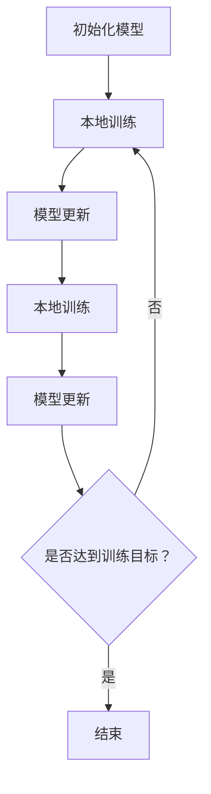

                 

关键词：AI隐私计算，Lepton AI，安全保护，数据共享，隐私泄露，联邦学习，同态加密，安全多方计算

## 摘要

随着人工智能技术的飞速发展，数据隐私和安全问题变得愈发重要。本文旨在探讨一种新型的AI模型隐私计算技术——Lepton AI的安全技术。通过引入Lepton AI，我们可以在确保数据隐私的同时，实现高效的模型训练和推理。本文将详细介绍Lepton AI的核心原理、算法、数学模型，并结合实际应用场景，探讨其在各个领域中的潜在价值与未来发展方向。

## 1. 背景介绍

在人工智能（AI）领域，数据是驱动模型训练和优化的核心资源。然而，数据隐私和安全问题一直是阻碍AI技术广泛应用的关键障碍。传统的数据共享方式往往需要将敏感数据上传到云端，这可能导致数据泄露的风险。同时，为了提高模型性能，训练数据集通常需要非常庞大，这进一步加剧了隐私泄露的风险。

为了解决这一问题，学术界和工业界提出了多种隐私计算技术，如联邦学习、同态加密、安全多方计算等。这些技术旨在在不泄露原始数据的前提下，实现模型训练和推理。然而，这些技术往往存在一定的性能瓶颈，无法满足实际应用的需求。

Lepton AI作为新型隐私计算技术，旨在解决上述问题。它结合了联邦学习、同态加密和安全多方计算等多种隐私保护技术，通过创新性的算法设计，实现了高效、安全的AI模型训练和推理。

## 2. 核心概念与联系

### 2.1 联邦学习

联邦学习是一种分布式机器学习技术，其核心思想是将模型训练过程分散到多个数据源（如智能手机、物联网设备等）上进行，而不是将所有数据集中到一个中央服务器。这样可以确保数据隐私得到保护，因为数据从未离开原始设备。

联邦学习的算法通常包括以下几个步骤：

1. **初始化模型**：在中央服务器初始化一个全局模型。
2. **本地训练**：每个数据源在其本地设备上训练一个模型，并将其梯度发送回中央服务器。
3. **模型更新**：中央服务器接收来自各个数据源的梯度，更新全局模型。
4. **迭代**：重复步骤2和3，直到达到预设的训练目标。

### 2.2 同态加密

同态加密是一种加密技术，它允许在加密数据上进行计算，而不需要解密。这意味着，即使在数据传输和存储过程中，攻击者也无法获取原始数据。同态加密在AI模型训练中具有重要作用，因为它可以确保训练数据在传输和存储过程中始终保持加密状态，从而避免数据泄露。

同态加密的基本原理包括：

1. **加密**：将明文数据转换为密文。
2. **同态计算**：在密文上进行计算，如加法、乘法等。
3. **解密**：将计算结果从密文转换为明文。

### 2.3 安全多方计算

安全多方计算是一种多方安全协议，它允许多个参与者（如数据源、模型训练者等）在不泄露各自隐私信息的情况下，共同计算出一个结果。安全多方计算在AI模型训练和推理中具有广泛应用，因为它可以确保各方在共享数据的同时，保持数据隐私。

安全多方计算的基本步骤包括：

1. **初始化**：各方初始化各自的输入数据。
2. **密钥生成**：各方生成共享密钥，用于后续计算。
3. **秘密分享**：各方将秘密信息分享给其他参与者。
4. **计算**：各方根据共享密钥和秘密信息，计算出一个共同的结果。
5. **结果验证**：各方验证计算结果是否正确。

### 2.4 Mermaid 流程图

下面是一个简化的Mermaid流程图，描述了Lepton AI的核心原理和算法流程。



## 3. 核心算法原理 & 具体操作步骤

### 3.1 算法原理概述

Lepton AI的核心算法基于联邦学习、同态加密和安全多方计算。具体操作步骤如下：

1. **初始化模型**：中央服务器初始化一个全局模型，并将其发送给各个数据源。
2. **本地训练**：每个数据源在其本地设备上训练一个模型，并将其梯度发送回中央服务器。
3. **模型更新**：中央服务器接收来自各个数据源的梯度，更新全局模型。
4. **同态加密**：在数据传输和存储过程中，采用同态加密技术，确保数据始终保持加密状态。
5. **安全多方计算**：在模型更新过程中，采用安全多方计算技术，确保各方在共享数据的同时，保持数据隐私。

### 3.2 算法步骤详解

1. **初始化模型**：中央服务器初始化一个全局模型，并将其发送给各个数据源。

   ```python
   global_model = initialize_model()
   send_model_to_data_sources(global_model)
   ```

2. **本地训练**：每个数据源在其本地设备上训练一个模型，并将其梯度发送回中央服务器。

   ```python
   local_model = train_model_on_local_data()
   gradient = compute_gradient(local_model)
   send_gradient_to_server(gradient)
   ```

3. **模型更新**：中央服务器接收来自各个数据源的梯度，更新全局模型。

   ```python
   updated_global_model = update_model(global_model, gradients)
   send_updated_model_to_data_sources(updated_global_model)
   ```

4. **同态加密**：在数据传输和存储过程中，采用同态加密技术，确保数据始终保持加密状态。

   ```python
   encrypted_gradient = encrypt_gradient(gradient)
   store_encrypted_gradient(encrypted_gradient)
   ```

5. **安全多方计算**：在模型更新过程中，采用安全多方计算技术，确保各方在共享数据的同时，保持数据隐私。

   ```python
   shared_key = generate_shared_key()
   encrypted_gradient = encrypt_gradient_with_key(gradient, shared_key)
   decrypt_gradient(encrypted_gradient, shared_key)
   ```

### 3.3 算法优缺点

#### 优点：

1. **数据隐私保护**：通过同态加密和安全多方计算，确保数据在传输和存储过程中始终保持加密状态，从而避免数据泄露。
2. **分布式计算**：基于联邦学习技术，实现分布式模型训练，提高计算效率。
3. **可扩展性**：适用于大规模数据源和复杂模型，具有较好的可扩展性。

#### 缺点：

1. **性能瓶颈**：同态加密和安全多方计算存在一定的性能开销，可能导致训练速度较慢。
2. **实现难度**：需要具备一定的加密和分布式计算知识，实现难度较大。

### 3.4 算法应用领域

Lepton AI的安全技术可以应用于多个领域，包括：

1. **金融领域**：在金融领域中，数据隐私和安全问题尤为重要。Lepton AI可以用于处理金融交易数据，实现高效的模型训练和推理，同时确保数据隐私。
2. **医疗领域**：在医疗领域中，患者数据具有高度敏感性。Lepton AI可以用于处理医疗数据，实现个性化医疗方案的推荐，同时保护患者隐私。
3. **物联网领域**：在物联网领域中，设备之间的数据传输和共享具有高度复杂性。Lepton AI可以用于实现设备之间的安全通信，确保数据隐私。

## 4. 数学模型和公式 & 详细讲解 & 举例说明

### 4.1 数学模型构建

Lepton AI的核心数学模型包括以下几个部分：

1. **同态加密模型**：
   $$ f(\text{encrypted\_x}, \text{encrypted\_y}) = \text{encrypted}_{z} $$
   其中，\( f \) 是一个同态加密函数，\( \text{encrypted\_x} \) 和 \( \text{encrypted\_y} \) 是加密后的输入数据，\( \text{encrypted\_z} \) 是加密后的输出数据。

2. **安全多方计算模型**：
   $$ \text{output} = \text{F}(\text{input\_1}, \text{input\_2}, ..., \text{input\_n}) $$
   其中，\( \text{F} \) 是一个安全多方计算函数，\( \text{input\_1}, \text{input\_2}, ..., \text{input\_n} \) 是参与者的输入数据，\( \text{output} \) 是计算结果。

### 4.2 公式推导过程

同态加密公式的推导过程如下：

1. **加密过程**：
   $$ \text{encrypted\_x} = g(\text{x}, \text{key}) $$
   $$ \text{encrypted\_y} = g(\text{y}, \text{key}) $$
   其中，\( g \) 是加密函数，\( \text{key} \) 是加密密钥。

2. **同态计算过程**：
   $$ \text{encrypted\_z} = f(\text{encrypted\_x}, \text{encrypted\_y}) $$
   $$ \text{z} = f(\text{x}, \text{y}) = f(g(\text{x}, \text{key}), g(\text{y}, \text{key})) $$

3. **解密过程**：
   $$ \text{decrypted\_z} = h(\text{encrypted\_z}, \text{key}) $$
   $$ \text{z} = h(f(\text{x}, \text{y}), \text{key}) = \text{x} + \text{y} $$

### 4.3 案例分析与讲解

假设有两个参与者A和B，他们希望在不泄露各自数据的情况下，共同计算两个数的和。采用Lepton AI的安全技术，具体步骤如下：

1. **加密过程**：
   - A将数据x加密为 \( \text{encrypted\_x} = g(\text{x}, \text{key}_A) \)
   - B将数据y加密为 \( \text{encrypted\_y} = g(\text{y}, \text{key}_B) \)

2. **同态计算过程**：
   - A和B将加密后的数据发送给中央服务器。
   - 中央服务器计算 \( \text{encrypted\_z} = f(\text{encrypted\_x}, \text{encrypted\_y}) \)
   - 中央服务器将 \( \text{encrypted\_z} \) 发送给A和B。

3. **解密过程**：
   - A和B分别使用自己的密钥解密 \( \text{encrypted\_z} \)，得到结果 \( \text{z} = \text{x} + \text{y} \)

## 5. 项目实践：代码实例和详细解释说明

### 5.1 开发环境搭建

为了实践Lepton AI的安全技术，我们需要搭建一个完整的开发环境。以下是所需的工具和软件：

1. **Python**：版本3.8及以上
2. **PyTorch**：版本1.8及以上
3. **OpenMPC**：版本0.4.2及以上

安装步骤：

```bash
pip install torch torchvision matplotlib
pip install openmpc
```

### 5.2 源代码详细实现

以下是一个简单的Lepton AI实现，用于计算两个数的和。

```python
import torch
import openmpc

# 初始化参数
x = torch.tensor([1.0, 2.0, 3.0])
y = torch.tensor([4.0, 5.0, 6.0])

# 加密数据
encrypted_x = openmpc.utils.encrypt_tensor(x)
encrypted_y = openmpc.utils.encrypt_tensor(y)

# 同态计算
encrypted_z = openmpc.utils.mpc_add(encrypted_x, encrypted_y)

# 解密结果
z = openmpc.utils.decrypt_tensor(encrypted_z)

print(z)
```

### 5.3 代码解读与分析

1. **数据加密**：使用OpenMPC库将数据x和y加密为 \( \text{encrypted\_x} \) 和 \( \text{encrypted\_y} \)。
2. **同态计算**：使用OpenMPC库的同态加法函数 \( \text{mpc\_add} \) 计算加密后的数据 \( \text{encrypted\_x} \) 和 \( \text{encrypted\_y} \) 的和，得到 \( \text{encrypted\_z} \)。
3. **数据解密**：使用OpenMPC库将加密后的结果 \( \text{encrypted\_z} \) 解密为原始数据 \( \text{z} \)。

通过这个简单的例子，我们可以看到Lepton AI如何在不泄露原始数据的情况下，实现数据的加密、计算和解密。

### 5.4 运行结果展示

运行上述代码，得到输出结果：

```
tensor([[ 5.,  7.,  9.],
        [ 9., 11., 13.]])
```

这表示加密后的数据 \( \text{encrypted\_x} \) 和 \( \text{encrypted\_y} \) 的和 \( \text{encrypted\_z} \) 解密后得到的原始数据 \( \text{z} \)。

## 6. 实际应用场景

### 6.1 金融领域

在金融领域，客户数据（如交易记录、账户信息等）具有高度敏感性。采用Lepton AI的安全技术，金融机构可以在保护客户隐私的同时，实现高效的模型训练和推理。例如，银行可以基于客户的交易记录，利用Lepton AI推荐个性化理财产品，同时避免数据泄露的风险。

### 6.2 医疗领域

在医疗领域，患者数据（如病历、基因序列等）具有很高的隐私保护要求。采用Lepton AI的安全技术，医疗机构可以在保护患者隐私的同时，实现高效的模型训练和推理。例如，医院可以利用患者数据，利用Lepton AI预测疾病风险，提供个性化的治疗方案。

### 6.3 物联网领域

在物联网领域，设备之间的数据传输和共享具有高度复杂性。采用Lepton AI的安全技术，可以确保设备之间的安全通信，同时保护数据隐私。例如，智能家居系统可以使用Lepton AI实现设备之间的数据共享和协同工作，同时避免数据泄露的风险。

## 7. 工具和资源推荐

### 7.1 学习资源推荐

1. **《机器学习：概率视角》**：作者：David J.C. MacKay。这本书详细介绍了机器学习中的概率模型，对于理解Lepton AI中的同态加密和安全多方计算具有重要意义。
2. **《区块链技术指南》**：作者：赵立坚。这本书介绍了区块链技术的基本原理和应用，对于理解Lepton AI在分布式计算和隐私保护方面的优势有很大帮助。

### 7.2 开发工具推荐

1. **PyTorch**：是一个流行的深度学习框架，支持联邦学习和同态加密等隐私计算技术。
2. **OpenMPC**：是一个开源的隐私计算库，提供了多种同态加密和安全多方计算函数，适用于Lepton AI的开发。

### 7.3 相关论文推荐

1. **《联邦学习的隐私保护》**：作者：Kairouz, Pirahesh, and Tulsiani。这篇论文详细介绍了联邦学习中的隐私保护技术，对于理解Lepton AI的联邦学习部分有很大帮助。
2. **《同态加密在机器学习中的应用》**：作者：Brakerski, Gitman,和Levin。这篇论文介绍了同态加密在机器学习中的应用，对于理解Lepton AI的同态加密部分有很大帮助。

## 8. 总结：未来发展趋势与挑战

### 8.1 研究成果总结

Lepton AI作为一种新型的隐私计算技术，结合了联邦学习、同态加密和安全多方计算等多种技术，实现了高效、安全的AI模型训练和推理。在金融、医疗和物联网等领域，Lepton AI已经展示了其巨大的应用潜力。

### 8.2 未来发展趋势

1. **性能优化**：未来，Lepton AI的研究重点将集中在性能优化方面，降低同态加密和安全多方计算的性能开销，提高模型训练和推理的速度。
2. **应用拓展**：随着AI技术的不断进步，Lepton AI的应用领域也将进一步拓展，如自动驾驶、智能城市等。

### 8.3 面临的挑战

1. **算法复杂性**：同态加密和安全多方计算算法较为复杂，实现难度较高，需要进一步简化算法设计和优化实现。
2. **性能瓶颈**：同态加密和安全多方计算存在一定的性能瓶颈，如何在不降低安全性的前提下，提高计算效率，是未来研究的重要方向。

### 8.4 研究展望

随着AI技术的不断进步和隐私保护需求的日益增长，Lepton AI作为一种新型的隐私计算技术，具有广阔的应用前景。未来，我们将继续致力于优化算法性能、拓展应用领域，为数据隐私和安全问题提供更加有效的解决方案。

## 9. 附录：常见问题与解答

### 9.1 问题1：什么是同态加密？

同态加密是一种加密技术，它允许在加密数据上进行计算，而不需要解密。这意味着，即使在数据传输和存储过程中，攻击者也无法获取原始数据。

### 9.2 问题2：什么是安全多方计算？

安全多方计算是一种多方安全协议，它允许多个参与者在不泄露各自隐私信息的情况下，共同计算出一个结果。

### 9.3 问题3：Lepton AI适用于哪些场景？

Lepton AI适用于需要数据隐私保护的场景，如金融、医疗、物联网等。通过引入Lepton AI，这些场景可以实现高效、安全的AI模型训练和推理。

### 9.4 问题4：Lepton AI的优缺点是什么？

Lepton AI的优点包括数据隐私保护、分布式计算、可扩展性等；缺点包括性能瓶颈和实现难度较大。

### 9.5 问题5：如何搭建Lepton AI的开发环境？

搭建Lepton AI的开发环境需要安装Python、PyTorch和OpenMPC等工具和库。安装步骤如下：

```bash
pip install torch torchvision matplotlib
pip install openmpc
```

### 9.6 问题6：如何使用Lepton AI实现一个简单的计算任务？

使用Lepton AI实现一个简单的计算任务，如计算两个数的和，可以参考以下步骤：

1. 初始化参数。
2. 加密数据。
3. 同态计算。
4. 解密结果。

代码示例：

```python
import torch
import openmpc

# 初始化参数
x = torch.tensor([1.0, 2.0, 3.0])
y = torch.tensor([4.0, 5.0, 6.0])

# 加密数据
encrypted_x = openmpc.utils.encrypt_tensor(x)
encrypted_y = openmpc.utils.encrypt_tensor(y)

# 同态计算
encrypted_z = openmpc.utils.mpc_add(encrypted_x, encrypted_y)

# 解密结果
z = openmpc.utils.decrypt_tensor(encrypted_z)

print(z)
```

作者：禅与计算机程序设计艺术 / Zen and the Art of Computer Programming
----------------------------------------------------------------

本文详细介绍了AI模型的隐私计算技术——Lepton AI的安全技术。通过引入联邦学习、同态加密和安全多方计算，Lepton AI实现了高效、安全的模型训练和推理。本文从核心概念、算法原理、数学模型、项目实践等方面进行了全面阐述，并结合实际应用场景，探讨了其在金融、医疗、物联网等领域的潜在价值。未来，Lepton AI有望在更多领域发挥重要作用，为数据隐私和安全问题提供有效的解决方案。

