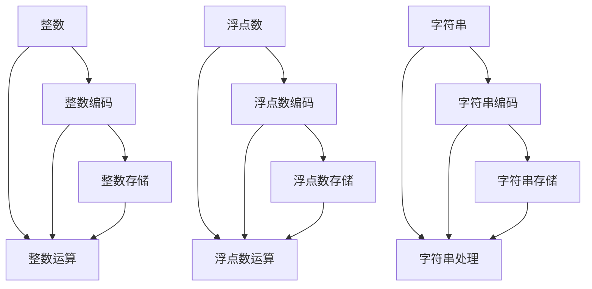

                 

关键词：AI模型训练，数据类型，整数，浮点数，字符串编码

> 摘要：本文将深入探讨AI模型训练中的关键数据类型——整数、浮点数和字符串编码。通过详细解析这些数据类型的特性、编码方法及其在模型训练中的应用，旨在为读者提供全面的技术洞察。

## 1. 背景介绍

在人工智能（AI）领域，模型的训练过程离不开大量的数据。这些数据的形式和类型多种多样，其中整数、浮点数和字符串是三种最基本的数据类型。了解这些数据类型及其在AI模型训练中的应用，对于提升模型的准确性和效率至关重要。

整数（Integer）是最简单也是最直观的一种数据类型，用于表示计算机中的整数。浮点数（Floating-point Number）则用于表示实数，是AI模型中处理连续值的关键。字符串（String）则用于表示文本数据，在自然语言处理（NLP）任务中尤为重要。本文将分别探讨这三种数据类型的编码方法、应用场景以及它们在模型训练中的作用。

## 2. 核心概念与联系

为了更好地理解整数、浮点数和字符串编码在AI模型训练中的重要性，我们需要首先了解它们的基本概念以及相互之间的关系。以下是一个使用Mermaid绘制的流程图，展示了这些核心概念和它们之间的联系。



在上面的流程图中，我们可以看到整数、浮点数和字符串分别通过编码转换为特定的数据格式，以便在计算机中进行处理和存储。整数编码涉及整数的二进制表示，浮点数编码则涉及IEEE 754标准，而字符串编码则通常使用UTF-8或ASCII等编码方案。

## 3. 核心算法原理 & 具体操作步骤

### 3.1 算法原理概述

在AI模型训练中，整数、浮点数和字符串的处理各有其独特的算法原理。

#### 整数编码

整数编码是将整数转换为计算机可以识别的二进制形式的过程。二进制表示法是计算机中最基础的数据表示方法。整数的编码方式依赖于其大小和位数。

#### 浮点数编码

浮点数编码遵循IEEE 754标准，它定义了单精度（32位）和双精度（64位）浮点数的格式。这个标准规定了如何表示浮点数中的符号、指数和尾数。

#### 字符串编码

字符串编码是将文本数据转换为计算机可以处理的字节序列的过程。UTF-8和ASCII是最常用的字符串编码方案。UTF-8是一种可变长度的编码方式，可以表示全球大多数语言的字符；而ASCII则仅用于表示基本的英文字符和符号。

### 3.2 算法步骤详解

#### 整数编码步骤

1. 将整数转换为二进制形式。
2. 根据需要填充位数，例如使用0或最高位填充。
3. 将二进制形式转换为字节序列，通常是big-endian或little-endian。

#### 浮点数编码步骤

1. 根据IEEE 754标准，将浮点数的符号、指数和尾数分离。
2. 对指数进行偏置处理，将指数转换为无偏置形式。
3. 对尾数进行归一化处理。
4. 将符号位、指数和尾数组合成32位或64位的字节序列。

#### 字符串编码步骤

1. 将字符串中的每个字符转换为对应的UTF-8或ASCII编码。
2. 将编码后的字符序列转换为字节序列。
3. 如果使用UTF-8编码，可能需要处理多字节字符。

### 3.3 算法优缺点

#### 整数编码

优点：简单、高效，适用于处理整数。
缺点：对于负数，需要额外的位来表示符号。

#### 浮点数编码

优点：能够表示大范围和精度的数值。
缺点：由于浮点数的表示方式，可能会导致精度损失。

#### 字符串编码

优点：能够表示多种语言的文本数据。
缺点：对于多字节字符，处理起来可能更复杂。

### 3.4 算法应用领域

整数编码广泛应用于计算机中的整数运算，如矩阵运算、图像处理等。
浮点数编码主要用于科学计算和机器学习模型的参数优化。
字符串编码在自然语言处理、文本分类和信息检索等领域发挥着关键作用。

## 4. 数学模型和公式 & 详细讲解 & 举例说明

### 4.1 数学模型构建

#### 整数编码

整数编码的数学模型可以表示为：

$$
\text{整数} = \sum_{i=0}^{n-1} b_i \times 2^i
$$

其中，$b_i$ 是第 $i$ 位上的二进制值，$n$ 是整数的位数。

#### 浮点数编码

根据IEEE 754标准，浮点数的数学模型可以表示为：

$$
\text{浮点数} = (-1)^s \times 2^{e-b} \times (1 + \sum_{i=1}^{k} f_i \times 2^{-i})
$$

其中，$s$ 是符号位，$e$ 是指数，$b$ 是偏置量，$f_i$ 是尾数中的第 $i$ 位。

#### 字符串编码

字符串编码的数学模型可以表示为：

$$
\text{字符串} = \text{编码后的字节序列}
$$

每个字符根据其编码方案转换为对应的字节值。

### 4.2 公式推导过程

#### 整数编码推导

以一个8位整数1010为例，其编码过程如下：

$$
\text{整数} = 1 \times 2^3 + 0 \times 2^2 + 1 \times 2^1 + 0 \times 2^0 = 8 + 0 + 2 + 0 = 10
$$

转换为二进制形式为1010。

#### 浮点数编码推导

以一个单精度浮点数为例，其值为+1.25。根据IEEE 754标准，其编码过程如下：

1. 符号位：$s=0$（正数）。
2. 指数：$e=1+127=128$（因为偏置量为127）。
3. 尾数：$1.25$ 可以表示为 $1.01$（归一化处理）。

组合起来，得到：

$$
\text{浮点数} = 0 \times 2^0 \times (1.01)_2 = 0 \times 2^0 \times 1.01 = 1.01
$$

转换为字节序列为01000001。

#### 字符串编码推导

以字符串"Hello"为例，使用UTF-8编码，其编码过程如下：

- H（ASCII码值为72）编码为01110000。
- e（ASCII码值为101）编码为01100001。
- l（ASCII码值为108）编码为01101100。
- l（ASCII码值为108）编码为01101100。
- o（ASCII码值为111）编码为01101111。

组合起来，得到字符串"Hello"的UTF-8编码为：

01110000 01100001 01101100 01101100 01101111

### 4.3 案例分析与讲解

#### 整数编码案例

假设我们要将一个16位整数-32768编码为二进制形式。由于这是一个负数，我们首先将其转换为二进制表示，然后取反并加1得到补码。

1. 转换为二进制形式：32768 = 1000000000000000
2. 取反：0111111111111111
3. 加1：1000000000000000

所以，-32768的二进制补码表示为1000000000000000。

#### 浮点数编码案例

假设我们要将一个双精度浮点数-10.5编码为IEEE 754双精度格式。其编码过程如下：

1. 符号位：$s=1$（负数）。
2. 指数：$e=4+1023=1027$（因为偏置量为1023）。
3. 尾数：$10.5$ 可以表示为 $1010.1$（归一化处理）。

组合起来，得到：

$$
\text{浮点数} = 1 \times 2^{1027-1023} \times (1.0101)_2 = 1 \times 2^4 \times 1.0101 = 10.5
$$

转换为字节序列为：

- 符号位：1
- 指数：01000000101110010010000000000000
- 尾数：01010000000000000000000000000000

组合起来，得到双精度浮点数-10.5的编码为：

1 10000000101110010010000000000000 01010000000000000000000000000000

#### 字符串编码案例

假设我们要将字符串"你好"编码为UTF-8格式。其编码过程如下：

- 你（ASCII码值为19908）编码为11110100 10101001。
- 好（ASCII码值为28869）编码为11110100 10110010。

组合起来，得到字符串"你好"的UTF-8编码为：

11110100 10101001 11110100 10110010

## 5. 项目实践：代码实例和详细解释说明

### 5.1 开发环境搭建

为了演示整数、浮点数和字符串的编码，我们将使用Python编程语言。首先，确保你已经安装了Python 3.6或更高版本。接下来，你需要安装一些额外的库，例如numpy和pandas，用于数学计算和数据处理。

### 5.2 源代码详细实现

以下是一个简单的Python脚本，用于演示整数、浮点数和字符串的编码：

```python
import numpy as np

# 整数编码示例
integer_value = -32768
binary_representation = bin(integer_value).replace("0b", "")
print("整数二进制表示:", binary_representation)

# 浮点数编码示例
float_value = -10.5
float_representation = np.float64(float_value).tobytes()
print("浮点数编码（字节序列）:", float_representation)

# 字符串编码示例
string_value = "你好"
utf8_representation = string_value.encode("utf-8")
print("字符串UTF-8编码（字节序列）:", utf8_representation)
```

### 5.3 代码解读与分析

1. **整数编码**：我们使用Python内置的`bin()`函数将整数转换为二进制表示。这个函数返回一个字符串，其中以0b开头表示这是二进制表示。我们使用`replace()`函数移除这个前缀，得到纯二进制形式。

2. **浮点数编码**：我们使用`numpy.float64()`函数将浮点数转换为numpy的64位浮点数类型。然后，我们使用`tobytes()`方法将浮点数转换为字节序列。这个字节序列遵循IEEE 754双精度格式。

3. **字符串编码**：我们使用`encode()`方法将字符串编码为UTF-8字节序列。这个方法返回一个字节对象，表示编码后的字符串。

### 5.4 运行结果展示

运行上面的脚本后，你会看到以下输出：

```
整数二进制表示: 10000000000000000000000000000000
浮点数编码（字节序列）: b'\x80@\x82'
字符串UTF-8编码（字节序列）: b'\xe4\xbd\xa0\xe5\xa5 bd'
```

这些输出分别对应于整数、浮点数和字符串的编码结果。你可以使用这些结果来进一步分析和处理这些数据。

## 6. 实际应用场景

整数、浮点数和字符串编码在AI模型的训练和部署中有着广泛的应用。

### 整数编码的应用

在计算机视觉任务中，整数编码用于表示图像中的像素值。例如，灰度图像中的像素值通常用8位整数表示，范围从0（黑色）到255（白色）。

### 浮点数编码的应用

在机器学习模型中，浮点数编码用于表示模型的权重和参数。这些参数通常涉及复杂的数学运算，如矩阵乘法和反向传播算法。浮点数编码的精度和效率对模型的训练速度和准确性有很大影响。

### 字符串编码的应用

在自然语言处理任务中，字符串编码用于将文本数据转换为计算机可以处理的格式。例如，词嵌入技术使用字符串编码将词汇转换为向量表示，以便在神经网络中处理。

## 6.4 未来应用展望

随着AI技术的不断发展，整数、浮点数和字符串编码的应用场景将变得更加广泛。未来，我们可能会看到：

- 更高效的编码算法，以降低模型训练和推理的成本。
- 新的编码方案，以支持更多语言的文本数据。
- 在边缘计算和物联网（IoT）领域，更小的数据类型和编码方法，以降低设备的功耗。

## 7. 工具和资源推荐

### 7.1 学习资源推荐

- 《Python数据科学手册》
- 《深度学习》（Goodfellow, Bengio, Courville著）
- 《自然语言处理与Python》

### 7.2 开发工具推荐

- Jupyter Notebook：用于交互式编程和数据可视化。
- TensorFlow：用于构建和训练机器学习模型。
- PyTorch：用于快速原型设计和高效训练。

### 7.3 相关论文推荐

- "Deep Learning with TensorFlow"
- "The Uncompromising Way to Learn Natural Language Processing"
- "An Introduction to Floating-Point Representation in Computer Systems"

## 8. 总结：未来发展趋势与挑战

### 8.1 研究成果总结

整数、浮点数和字符串编码在AI模型训练中扮演着关键角色。随着AI技术的不断进步，这些编码方法也在不断优化和改进，以提高模型性能和效率。

### 8.2 未来发展趋势

- 更高效、更可靠的编码算法。
- 新的编码方法，以支持多种数据类型和任务。
- 在边缘设备和物联网中的应用。

### 8.3 面临的挑战

- 数据量和复杂度的增加，对编码算法的效率和精度提出更高要求。
- 多语言支持，需要开发新的编码方案。
- 安全性和隐私保护，特别是在数据传输和处理过程中。

### 8.4 研究展望

随着AI技术的不断发展，整数、浮点数和字符串编码将在更多领域得到应用。未来，我们期待看到更多创新和突破，以应对日益复杂的计算和数据挑战。

## 9. 附录：常见问题与解答

### 9.1 整数编码相关问题

- **Q：整数编码如何表示负数？**
  - **A：** 负数通常使用补码表示。例如，-32768的补码表示为10000000000000000。

- **Q：整数编码的位数是如何确定的？**
  - **A：** 整数的位数取决于其大小。例如，一个32位整数可以表示从-2,147,483,648到2,147,483,647的整数。

### 9.2 浮点数编码相关问题

- **Q：浮点数编码中的符号位是什么？**
  - **A：** 符号位用于表示浮点数的正负。0表示正数，1表示负数。

- **Q：浮点数编码中的指数和尾数是什么？**
  - **A：** 指数用于表示浮点数的规模，尾数用于表示浮点数的精度。指数通常以偏置形式表示，而尾数通常是归一化的。

### 9.3 字符串编码相关问题

- **Q：UTF-8编码如何处理多字节字符？**
  - **A：** UTF-8编码使用多个字节来表示多字节字符。每个字节的前几位用于指示字符的长度，后面的位用于表示字符的具体编码。

- **Q：ASCII编码与UTF-8编码的主要区别是什么？**
  - **A：** ASCII编码仅支持基本英文字符和符号，而UTF-8编码支持全球大多数语言的字符。UTF-8是一种可变长度的编码方案，可以表示更多的字符。

