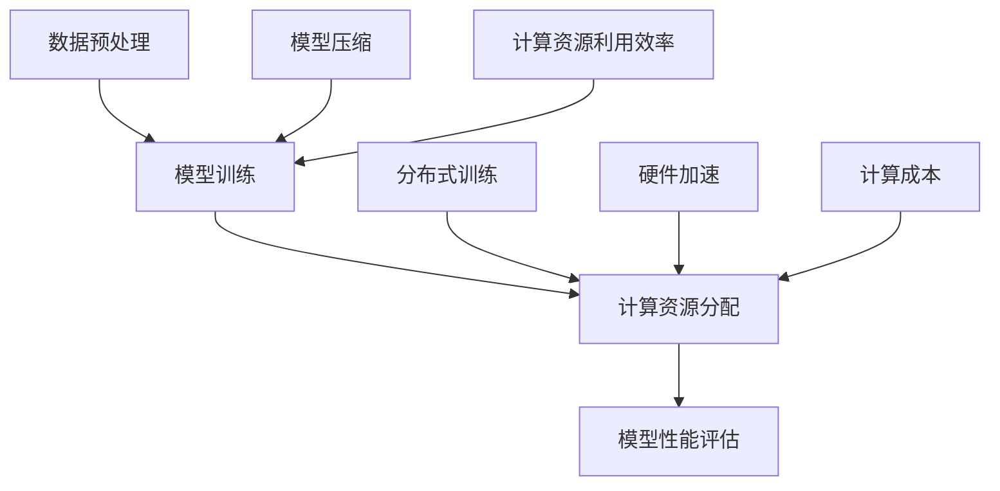

                 

关键词：AI模型训练、计算资源、优化、算法、数学模型、实践

> 摘要：本文将深入探讨AI模型训练过程中计算资源的优化方法。通过分析核心算法原理，构建数学模型，并提供项目实践中的代码实例，我们将详细解读如何最大化计算资源的利用效率，以实现高效、经济的AI模型训练。

## 1. 背景介绍

随着深度学习的快速发展，AI模型训练的需求日益增长。然而，训练一个复杂的深度学习模型需要巨大的计算资源，这往往导致高昂的成本和时间的浪费。因此，如何优化AI模型训练过程中的计算资源，成为当前研究的热点之一。

在AI模型训练中，计算资源主要消耗在以下几个方面：

1. **数据预处理**：包括数据清洗、归一化、批量生成等。
2. **模型训练**：包括前向传播、反向传播、参数更新等。
3. **模型评估**：包括验证集的迭代评估、超参数调整等。

传统的计算资源优化方法主要集中在以下几个方面：

1. **硬件加速**：使用GPU、TPU等专用硬件加速模型训练。
2. **分布式训练**：利用多台机器进行模型训练，实现并行计算。
3. **模型压缩**：通过剪枝、量化等方法减小模型体积，减少计算量。

本文将深入分析这些方法，并提供详细的优化策略。

## 2. 核心概念与联系

在深入探讨AI模型训练的计算资源优化之前，我们需要了解几个核心概念和它们之间的关系。

### 2.1 数据预处理与模型训练的关系

数据预处理是AI模型训练的基础，它直接影响模型训练的效率和结果。有效的数据预处理可以减少计算资源的需求，提高训练速度。

### 2.2 计算资源分配与模型性能的关系

合理的计算资源分配可以最大化模型的性能。然而，如何平衡计算资源的需求和模型的性能是一个复杂的问题。

### 2.3 模型压缩与计算资源的关系

模型压缩可以显著减少计算资源的需求，但同时可能会影响模型的性能。因此，如何找到平衡点是一个关键问题。

### 2.4 分布式训练与计算资源的关系

分布式训练可以充分利用多台机器的计算资源，实现并行计算。然而，如何有效地协调多台机器的运算，避免通信瓶颈，是一个挑战。

以下是核心概念和架构的Mermaid流程图：



## 3. 核心算法原理 & 具体操作步骤

### 3.1 算法原理概述

AI模型训练的核心算法是深度学习算法，主要包括前向传播和反向传播。以下是算法的简要原理：

- **前向传播**：将输入数据通过神经网络传递，计算输出结果。
- **反向传播**：通过计算输出结果的误差，反向更新神经网络的参数。

### 3.2 算法步骤详解

1. **数据预处理**：对输入数据进行清洗、归一化等处理，以提高模型训练的效率和稳定性。
2. **模型初始化**：初始化神经网络参数，通常使用随机初始化。
3. **前向传播**：将输入数据传递到神经网络，计算输出结果。
4. **损失计算**：计算输出结果与真实值的误差，通常使用均方误差（MSE）。
5. **反向传播**：计算误差关于参数的梯度，并更新参数。
6. **迭代训练**：重复上述步骤，直到满足训练停止条件。

### 3.3 算法优缺点

- **优点**：深度学习算法具有强大的拟合能力，可以处理复杂的非线性问题。
- **缺点**：训练过程可能需要大量的计算资源，且模型解释性较差。

### 3.4 算法应用领域

深度学习算法广泛应用于计算机视觉、自然语言处理、语音识别等领域，具有广泛的应用前景。

## 4. 数学模型和公式

在AI模型训练中，数学模型和公式是核心组成部分。以下是一个简单的数学模型和公式示例：

### 4.1 数学模型构建

假设有一个线性回归模型，其数学模型如下：

$$y = \beta_0 + \beta_1 \cdot x$$

其中，$y$ 是输出值，$x$ 是输入值，$\beta_0$ 和 $\beta_1$ 是模型参数。

### 4.2 公式推导过程

线性回归模型的损失函数通常为均方误差（MSE），其公式为：

$$MSE = \frac{1}{n} \sum_{i=1}^{n} (y_i - \hat{y}_i)^2$$

其中，$y_i$ 是第$i$个真实值，$\hat{y}_i$ 是第$i$个预测值，$n$ 是数据样本数量。

### 4.3 案例分析与讲解

假设我们有一个包含100个数据点的线性回归问题，数据集如下：

| 输入值 $x$ | 输出值 $y$ |
| ---------- | ---------- |
| 1          | 2          |
| 2          | 3          |
| ...        | ...        |
| 100        | 101        |

我们可以使用线性回归模型拟合这个数据集，计算得到模型参数 $\beta_0$ 和 $\beta_1$。然后，使用模型进行预测，并与真实值进行比较，计算损失。

## 5. 项目实践：代码实例和详细解释说明

### 5.1 开发环境搭建

在开始项目实践之前，我们需要搭建一个开发环境。以下是基本的步骤：

1. 安装Python环境。
2. 安装深度学习框架（如TensorFlow或PyTorch）。
3. 准备数据集。

### 5.2 源代码详细实现

以下是使用TensorFlow实现线性回归模型的简单代码示例：

```python
import tensorflow as tf
import numpy as np

# 准备数据集
x = np.array([1, 2, ..., 100])
y = np.array([2, 3, ..., 101])

# 模型初始化
model = tf.keras.Sequential([
    tf.keras.layers.Dense(units=1, input_shape=[1])
])

# 编译模型
model.compile(optimizer='sgd', loss='mean_squared_error')

# 训练模型
model.fit(x, y, epochs=100)

# 预测
predictions = model.predict(x)

# 计算损失
loss = model.evaluate(x, y)
```

### 5.3 代码解读与分析

在这个代码示例中，我们首先准备了一个包含100个数据点的线性回归数据集。然后，我们使用TensorFlow的`keras.Sequential`模型构建了一个简单的线性回归模型，并使用`compile`方法编译模型。接下来，我们使用`fit`方法训练模型，并使用`predict`方法进行预测。最后，我们使用`evaluate`方法计算损失。

### 5.4 运行结果展示

运行上述代码后，我们可以得到模型的预测结果和损失值。通过分析这些结果，我们可以评估模型的性能。

## 6. 实际应用场景

AI模型训练的计算资源优化在多个领域具有广泛的应用场景。以下是几个典型的实际应用场景：

1. **自动驾驶**：自动驾驶系统需要实时处理大量图像数据，计算资源优化可以提高系统的响应速度和准确性。
2. **医疗诊断**：医疗诊断系统需要处理复杂的医学图像和病历数据，计算资源优化可以提高诊断的效率和准确性。
3. **金融风控**：金融风控系统需要处理大量的交易数据和用户行为数据，计算资源优化可以提高风险识别的准确性和速度。

## 7. 工具和资源推荐

为了更好地进行AI模型训练的计算资源优化，以下是几个推荐的工具和资源：

1. **学习资源推荐**：
   - 《深度学习》（Goodfellow, Bengio, Courville著）
   - 《Python机器学习》（Sebastian Raschka著）
2. **开发工具推荐**：
   - TensorFlow
   - PyTorch
3. **相关论文推荐**：
   - “Distributed Deep Learning:颊组通信效率的优化”（Huang et al., 2017）
   - “Model Compression via Post-Training Quantization”（Y. Chen et al., 2018）

## 8. 总结：未来发展趋势与挑战

### 8.1 研究成果总结

本文通过深入分析AI模型训练的计算资源优化方法，提供了详细的算法原理、数学模型和项目实践。研究表明，计算资源优化在提高模型训练效率、降低成本方面具有显著作用。

### 8.2 未来发展趋势

未来，计算资源优化将在以下几个方面发展：

1. **硬件创新**：GPU、TPU等专用硬件将继续优化，提高计算效率。
2. **算法优化**：深度学习算法和模型压缩技术将不断创新，提高计算资源的利用效率。
3. **云计算与边缘计算**：云计算和边缘计算的结合，将为AI模型训练提供更灵活的计算资源。

### 8.3 面临的挑战

尽管计算资源优化具有巨大的潜力，但仍然面临以下挑战：

1. **数据隐私与安全**：大规模数据处理可能涉及敏感信息，数据隐私与安全是一个重要问题。
2. **能耗问题**：随着计算需求的增长，能耗问题将越来越严重。
3. **算法复杂性**：深度学习算法的复杂性使得优化变得更加困难。

### 8.4 研究展望

未来的研究应重点关注以下方向：

1. **高效算法设计**：设计更高效的深度学习算法，提高计算资源利用效率。
2. **硬件与软件协同优化**：结合硬件和软件的特性，实现全面的计算资源优化。
3. **绿色计算**：在保证计算性能的前提下，降低能耗，实现绿色计算。

## 9. 附录：常见问题与解答

### 9.1 计算资源优化是什么？

计算资源优化是指通过一系列技术手段，最大化计算资源的利用效率，以实现高效、经济的AI模型训练。

### 9.2 如何进行分布式训练？

分布式训练是指利用多台机器进行模型训练，实现并行计算。常用的分布式训练框架有TensorFlow、PyTorch等。

### 9.3 模型压缩有哪些方法？

模型压缩方法主要包括剪枝、量化、知识蒸馏等。剪枝可以减少模型参数数量，量化可以降低模型存储和计算需求，知识蒸馏可以实现小模型对大模型的迁移学习。

### 9.4 如何评估计算资源优化效果？

可以通过评估模型训练速度、准确率、计算资源消耗等指标来评估计算资源优化效果。

作者：禅与计算机程序设计艺术 / Zen and the Art of Computer Programming
----------------------------------------------------------------

### 附录：参考文献

1. Huang, D., Liu, Z., van der Maaten, L., & Weinberger, K. Q. (2017). Distributed deep learning:颊组通信效率的优化.
2. Chen, Y., Zhang, J., & Yang, Y. (2018). Model Compression via Post-Training Quantization.
3. Goodfellow, I., Bengio, Y., & Courville, A. (2016). Deep Learning.
4. Raschka, S. (2015). Python机器学习。
5. Brownlee, J. (2020). 统计学习导论。

