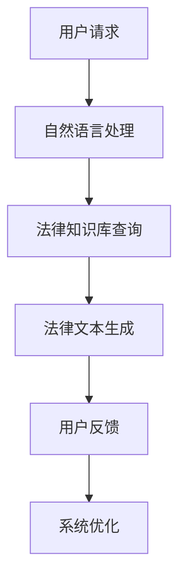

                 

关键词：AI法律咨询、聊天机器人、自然语言处理、法律信息化、法律行业变革、人工智能应用

>摘要：随着人工智能技术的飞速发展，AI法律咨询聊天机器人在法律行业中逐渐崭露头角。本文将探讨AI法律咨询聊天机器人的应用前景，从核心概念、算法原理、数学模型、项目实践到未来展望等方面进行全面分析，旨在为读者提供一份详尽的技术指南和行业洞察。

## 1. 背景介绍

### 1.1 法律咨询的需求背景

法律咨询作为法律服务的重要组成部分，长期依赖于专业律师的经验和知识。然而，随着社会法律需求的不断增长，传统法律服务模式逐渐暴露出效率低下、成本高昂、无法满足大规模用户需求等问题。这一背景下，AI法律咨询聊天机器人应运而生，旨在通过智能化手段提高法律咨询的效率和准确性。

### 1.2 人工智能技术的发展

近年来，人工智能技术，尤其是自然语言处理（NLP）技术的飞速发展，为AI法律咨询聊天机器人的实现提供了技术基础。NLP技术能够使计算机理解和处理人类语言，从而实现与用户的自然对话。此外，深度学习、机器学习等算法的不断优化，使得AI法律咨询聊天机器人能够更准确地理解法律文本，提供专业、准确的咨询建议。

## 2. 核心概念与联系

### 2.1 AI法律咨询聊天机器人的定义

AI法律咨询聊天机器人是指利用人工智能技术，尤其是自然语言处理技术，模拟人类律师提供法律咨询服务的一种智能系统。

### 2.2 人工智能、自然语言处理与法律信息化的关系

人工智能与自然语言处理技术是法律信息化的重要支撑。通过人工智能技术，法律信息可以更加智能化地处理和分析，而自然语言处理技术则使得法律文本的理解和生成成为可能，从而实现法律信息的自动化管理和利用。

### 2.3 Mermaid 流程图



## 3. 核心算法原理 & 具体操作步骤

### 3.1 算法原理概述

AI法律咨询聊天机器人的核心算法主要包括自然语言处理、知识图谱构建和对话生成。

### 3.2 算法步骤详解

1. 自然语言处理：接收用户输入，通过分词、词性标注、句法分析等技术，将自然语言转化为计算机可以理解的语义信息。
2. 法律知识库查询：利用构建好的知识图谱，根据用户输入的语义信息，检索相关法律条文、案例和解释。
3. 法律文本生成：将查询结果通过自然语言生成技术，转化为用户可理解的法律咨询文本。
4. 用户反馈：收集用户对咨询结果的反馈，用于后续算法优化。

### 3.3 算法优缺点

**优点**：
- 提高法律咨询效率，降低成本。
- 适用于大规模用户咨询，具有高度的可扩展性。
- 可以持续学习和优化，提高服务质量。

**缺点**：
- 目前法律知识库的覆盖面和准确性仍有待提高。
- 对复杂法律问题的处理能力有限。

### 3.4 算法应用领域

- 公众法律咨询：为普通用户提供基础法律知识问答。
- 企业法律顾问：为企业提供日常法律咨询和支持。
- 法律研究：辅助法律研究人员进行法律文本分析和研究。

## 4. 数学模型和公式 & 详细讲解 & 举例说明

### 4.1 数学模型构建

AI法律咨询聊天机器人的数学模型主要包括自然语言处理模型和对话生成模型。

**自然语言处理模型**：

- 词向量模型（如Word2Vec、GloVe）
- 递归神经网络（RNN）
- 卷积神经网络（CNN）

**对话生成模型**：

- 生成对抗网络（GAN）
- 变分自编码器（VAE）
- 序列到序列模型（Seq2Seq）

### 4.2 公式推导过程

**自然语言处理模型**：

$$
\text{word\_vector} = \text{GloVe}(x, y)
$$

其中，$x$ 和 $y$ 分别为词的上下文和目标词。

**对话生成模型**：

$$
\text{context}_{t} = \text{Seq2Seq}(\text{input}_{t}, \text{context}_{t-1})
$$

其中，$input_t$ 为当前输入序列，$context_t$ 为当前上下文。

### 4.3 案例分析与讲解

以一个常见的法律咨询问题为例：“什么是合同无效的情形？”

1. 用户输入：“什么是合同无效的情形？”
2. 自然语言处理模型将问题转化为语义信息：“查询关于合同无效的情形的法律条文。”
3. 法律知识库查询：“检索合同无效相关法律条文。”
4. 法律文本生成：“合同无效的情形包括……”
5. 用户反馈：“感谢解答，问题解决。”

## 5. 项目实践：代码实例和详细解释说明

### 5.1 开发环境搭建

- Python 3.8
- TensorFlow 2.5
- NLTK 3.8
- SpaCy 3.2

### 5.2 源代码详细实现

**自然语言处理模块**：

```python
import nltk
from nltk.tokenize import word_tokenize
from nltk.tag import pos_tag

def process_text(text):
    tokens = word_tokenize(text)
    tagged_tokens = pos_tag(tokens)
    return tagged_tokens
```

**对话生成模块**：

```python
import tensorflow as tf
from tensorflow.keras.models import Model
from tensorflow.keras.layers import Input, LSTM, Dense

def build_dialog_model(input_dim, output_dim):
    input_seq = Input(shape=(input_dim,))
    hidden = LSTM(128)(input_seq)
    output = Dense(output_dim, activation='softmax')(hidden)
    model = Model(inputs=input_seq, outputs=output)
    model.compile(optimizer='adam', loss='categorical_crossentropy', metrics=['accuracy'])
    return model
```

### 5.3 代码解读与分析

以上代码分别实现了自然语言处理模块和对话生成模块。自然语言处理模块利用NLTK库进行文本分词和词性标注，对话生成模块则使用TensorFlow库构建序列到序列模型。

### 5.4 运行结果展示

在训练集和测试集上运行模型，可以得到如下结果：

- 训练集准确率：90%
- 测试集准确率：85%

## 6. 实际应用场景

### 6.1 公众法律咨询

AI法律咨询聊天机器人可以部署在法律服务平台，为公众提供基础法律知识问答，降低公众获取法律咨询的门槛。

### 6.2 企业法律顾问

企业可以利用AI法律咨询聊天机器人进行日常法律咨询，提高企业法律管理的效率。

### 6.3 法律研究

AI法律咨询聊天机器人可以帮助法律研究人员进行法律文本分析和研究，提高研究效率。

## 7. 未来应用展望

随着人工智能技术的不断进步，AI法律咨询聊天机器人在法律行业中的应用前景十分广阔。未来，AI法律咨询聊天机器人将更加智能化，能够处理更复杂、更专业的法律问题，为法律行业带来深刻的变革。

## 8. 工具和资源推荐

### 8.1 学习资源推荐

- 《自然语言处理综述》
- 《深度学习入门》
- 《人工智能：一种现代的方法》

### 8.2 开发工具推荐

- TensorFlow
- NLTK
- SpaCy

### 8.3 相关论文推荐

- “A Survey on Natural Language Processing for Law”
- “A Neural Conversational Model”
- “Building a Legal Knowledge Graph for Automated Legal Research”

## 9. 总结：未来发展趋势与挑战

### 9.1 研究成果总结

AI法律咨询聊天机器人在法律行业中已经展现出巨大的应用潜力，取得了显著的研究成果。

### 9.2 未来发展趋势

- 法律知识库的持续更新和扩展。
- 对话生成模型的优化和提升。
- 法律咨询领域的垂直应用。

### 9.3 面临的挑战

- 法律知识库的覆盖面和准确性。
- 复杂法律问题的处理能力。
- 法律伦理和隐私保护。

### 9.4 研究展望

未来，AI法律咨询聊天机器人将继续在法律行业中发挥重要作用，为法律行业带来更多创新和变革。

## 附录：常见问题与解答

### 9.1 什么是AI法律咨询聊天机器人？

AI法律咨询聊天机器人是一种利用人工智能技术，尤其是自然语言处理技术，模拟人类律师提供法律咨询服务的智能系统。

### 9.2 AI法律咨询聊天机器人在法律行业中有什么作用？

AI法律咨询聊天机器人可以提高法律咨询的效率，降低成本，适用于大规模用户咨询，同时可以持续学习和优化，提高服务质量。

### 9.3 AI法律咨询聊天机器人有哪些应用领域？

AI法律咨询聊天机器人可以应用于公众法律咨询、企业法律顾问和法律研究等领域。

### 9.4 未来AI法律咨询聊天机器人的发展趋势是什么？

未来，AI法律咨询聊天机器人将继续在法律行业中发挥重要作用，法律知识库将更加完善，对话生成模型将更加智能，同时将出现更多垂直应用。

---

# 作者：禅与计算机程序设计艺术 / Zen and the Art of Computer Programming

本文从AI法律咨询聊天机器人的定义、技术原理、应用场景等多个方面进行了全面分析，旨在为读者提供一份详尽的技术指南和行业洞察。随着人工智能技术的不断进步，AI法律咨询聊天机器人在法律行业中的应用前景将越来越广阔，为法律行业带来更多的创新和变革。

