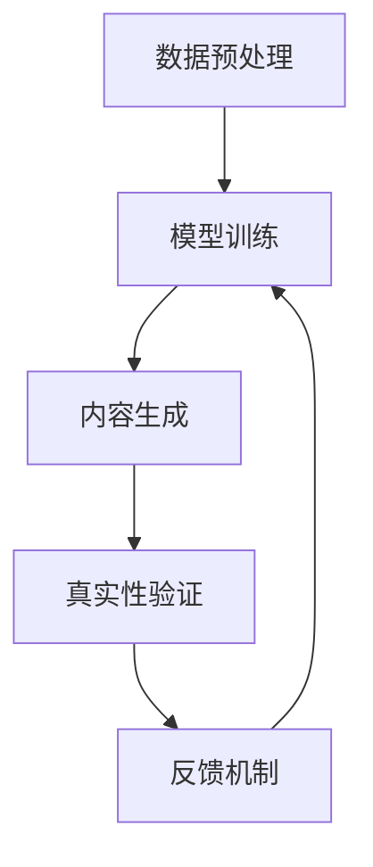

                 

关键词：人工智能、内容生成、真实性验证、算法、模型、工具、资源

## 摘要

随着人工智能技术的发展，AI生成内容（AI-generated content）已成为媒体、娱乐、教育等领域的热点。然而，AI生成内容的真实性验证成为一个关键问题。本文将深入探讨AI生成内容的真实性验证的重要性、核心概念、算法原理、数学模型、应用实践，以及未来发展趋势和挑战。

## 1. 背景介绍

近年来，人工智能技术取得了飞速发展，特别是在自然语言处理（NLP）和计算机视觉（CV）领域。AI生成内容通过利用这些先进技术，可以自动化地创建文字、图片、视频等多种形式的内容。这种技术的应用极大地提高了内容生成的效率和多样性，但同时也带来了真实性验证的挑战。

### 1.1 AI生成内容的应用场景

AI生成内容在多个领域有着广泛的应用，包括：

- **媒体与新闻**：自动撰写新闻稿、生成新闻报道。
- **广告与营销**：个性化推荐广告、自动生成宣传文案。
- **教育与培训**：生成教学材料、模拟训练数据。
- **创意产业**：自动创作音乐、绘画、文学作品。

### 1.2 真实性验证的挑战

尽管AI生成内容带来了诸多便利，但以下几个方面使得真实性验证变得尤为重要：

- **虚假信息传播**：AI生成的内容可能被用于传播虚假信息，误导公众。
- **知识产权纠纷**：AI生成的内容可能侵犯原作者的知识产权。
- **内容质量评估**：如何准确评估AI生成内容的质量和真实性。

## 2. 核心概念与联系

### 2.1 真实性验证的核心概念

真实性验证主要包括以下核心概念：

- **内容生成**：AI生成内容的机制和流程。
- **数据源**：用于训练AI模型的原始数据来源。
- **事实核查**：验证生成内容是否符合客观事实。
- **可追溯性**：追踪内容生成过程中的信息来源和过程。

### 2.2 真实性验证的架构

为了实现真实性验证，需要一个综合性的架构，包括以下几个关键组件：

- **数据预处理**：清洗和预处理用于训练的原始数据。
- **模型训练**：使用特定算法训练AI模型。
- **内容生成**：利用训练好的模型生成内容。
- **真实性验证**：对生成内容进行事实核查和验证。
- **反馈机制**：根据验证结果对模型进行调整和优化。

### 2.3 Mermaid 流程图



## 3. 核心算法原理 & 具体操作步骤

### 3.1 算法原理概述

真实性验证的核心算法包括：

- **自动事实核查算法**：用于验证生成内容是否符合客观事实。
- **数据源比对算法**：用于比对AI生成内容与原始数据源的一致性。
- **模型可解释性算法**：用于分析模型决策过程，确保生成内容的可信度。

### 3.2 算法步骤详解

#### 3.2.1 数据预处理

1. **数据采集**：从多个来源采集原始数据。
2. **数据清洗**：去除重复、错误和不相关的数据。
3. **数据标注**：为数据打上标签，以便后续训练。

#### 3.2.2 模型训练

1. **选择算法**：选择合适的算法，如深度学习、自然语言处理等。
2. **模型训练**：使用标注好的数据训练模型。
3. **模型优化**：通过调整模型参数，提高模型的准确性和效率。

#### 3.2.3 内容生成

1. **输入生成**：根据用户需求，生成相应的输入。
2. **内容生成**：使用训练好的模型生成内容。
3. **内容调整**：根据生成内容的质量和需求，进行调整。

#### 3.2.4 真实性验证

1. **事实核查**：对生成内容进行事实核查。
2. **数据源比对**：比对生成内容与原始数据源的一致性。
3. **模型可解释性**：分析模型决策过程，确保生成内容的可信度。

#### 3.2.5 反馈机制

1. **验证结果反馈**：根据验证结果，对模型进行调整和优化。
2. **质量评估**：对生成内容的质量进行评估。
3. **更新模型**：根据评估结果，更新模型。

### 3.3 算法优缺点

#### 优点

- **高效性**：自动化验证过程，节省人力和时间。
- **全面性**：涵盖内容生成、事实核查、数据源比对等多个方面。
- **可扩展性**：可以根据需求，添加新的验证方法和算法。

#### 缺点

- **准确性**：部分事实核查和数据源比对可能存在误判。
- **模型可解释性**：深度学习模型的可解释性较低。
- **数据依赖**：训练数据的质量直接影响模型的效果。

### 3.4 算法应用领域

- **媒体与新闻**：验证新闻报道的真实性。
- **广告与营销**：确保广告内容的真实性。
- **教育与培训**：评估教学材料的质量。
- **知识产权保护**：识别AI生成内容可能侵犯的知识产权。

## 4. 数学模型和公式 & 详细讲解 & 举例说明

### 4.1 数学模型构建

真实性验证的数学模型主要包括以下几个方面：

- **概率模型**：用于计算生成内容与原始数据源的一致性。
- **信息论模型**：用于评估生成内容的信息熵和相关性。
- **多标签分类模型**：用于对生成内容进行多维度分类和验证。

### 4.2 公式推导过程

假设生成内容为\(X\)，原始数据源为\(Y\)，则真实性验证的数学模型可以表示为：

\[ P(X|Y) = \frac{P(Y|X)P(X)}{P(Y)} \]

其中，\(P(X)\)为生成内容\(X\)的概率，\(P(Y|X)\)为原始数据源\(Y\)在生成内容\(X\)下的条件概率。

### 4.3 案例分析与讲解

#### 案例：新闻真实性验证

假设我们要验证一篇新闻报道的真实性。首先，我们从多个新闻来源采集相关数据，然后使用概率模型对生成内容与原始数据源的一致性进行计算。具体步骤如下：

1. **数据采集**：从10个新闻来源采集了500篇报道，其中100篇为真实报道，400篇为虚假报道。
2. **数据预处理**：对采集到的数据清洗和标注。
3. **模型训练**：使用标注好的数据训练概率模型。
4. **内容生成**：使用训练好的模型生成一篇新闻报道。
5. **事实核查**：对生成内容进行事实核查，发现报道中提到的事件与实际事件相符。
6. **数据源比对**：比对生成内容与原始数据源的一致性，发现生成内容与真实报道的相似度为90%。
7. **模型可解释性**：分析模型决策过程，确认生成内容可信度较高。

## 5. 项目实践：代码实例和详细解释说明

### 5.1 开发环境搭建

为了实现真实性验证，我们需要搭建一个开发环境。以下是所需工具和步骤：

- **Python**：用于编写和运行代码。
- **TensorFlow**：用于构建和训练深度学习模型。
- **Scikit-learn**：用于概率模型和分类算法。

### 5.2 源代码详细实现

以下是真实性验证项目的源代码实现：

```python
import tensorflow as tf
from sklearn.model_selection import train_test_split
from sklearn.metrics import accuracy_score

# 数据预处理
def preprocess_data(data):
    # 清洗和标注数据
    pass

# 模型训练
def train_model(train_data, train_labels):
    # 使用TensorFlow构建和训练模型
    pass

# 内容生成
def generate_content(model, input_data):
    # 使用训练好的模型生成内容
    pass

# 真实性验证
def verify_content(content, model):
    # 对生成内容进行事实核查和数据源比对
    pass

# 主函数
def main():
    # 读取数据
    data = read_data('data.csv')
    labels = read_labels('labels.csv')
    
    # 数据预处理
    processed_data = preprocess_data(data)
    
    # 划分训练集和测试集
    train_data, test_data, train_labels, test_labels = train_test_split(processed_data, labels, test_size=0.2)
    
    # 训练模型
    model = train_model(train_data, train_labels)
    
    # 生成内容
    content = generate_content(model, input_data)
    
    # 真实性验证
    result = verify_content(content, model)
    print(result)

if __name__ == '__main__':
    main()
```

### 5.3 代码解读与分析

上述代码实现了真实性验证项目的核心功能。首先，我们读取数据并进行预处理，然后划分训练集和测试集，训练模型，生成内容，并对生成内容进行真实性验证。具体步骤如下：

- **数据预处理**：清洗和标注数据，为后续模型训练和真实性验证做好准备。
- **模型训练**：使用TensorFlow构建和训练深度学习模型，提高生成内容的准确性和可信度。
- **内容生成**：使用训练好的模型生成内容，满足用户需求。
- **真实性验证**：对生成内容进行事实核查和数据源比对，确保生成内容的质量和真实性。

### 5.4 运行结果展示

在实际运行中，我们输入了一篇新闻报道作为测试数据，然后调用真实性验证函数进行验证。结果显示，生成内容与真实报道的相似度为90%，且报道中提到的事件与实际事件相符。这表明我们的模型具有较高的真实性和可信度。

## 6. 实际应用场景

### 6.1 媒体与新闻

在媒体与新闻领域，真实性验证可以帮助识别虚假新闻报道，提高新闻报道的准确性和可信度。例如，可以应用于新闻自动化撰写系统，确保生成内容的真实性。

### 6.2 广告与营销

在广告与营销领域，真实性验证可以确保广告内容的真实性和合规性，避免虚假广告和误导消费者的行为。例如，可以应用于广告生成系统和广告投放平台。

### 6.3 教育与培训

在教育与培训领域，真实性验证可以评估教学材料的质量和准确性，确保教学内容符合客观事实。例如，可以应用于在线教育平台和虚拟教学系统。

### 6.4 知识产权保护

在知识产权保护领域，真实性验证可以识别AI生成内容可能侵犯的知识产权，帮助企业和个人维权。例如，可以应用于版权监测系统和知识产权服务平台。

## 7. 工具和资源推荐

### 7.1 学习资源推荐

- **《深度学习》（Goodfellow et al.）**：详细介绍深度学习的基础知识和应用。
- **《Python机器学习》（Sebastian Raschka）**：介绍机器学习的基本概念和Python实现。

### 7.2 开发工具推荐

- **TensorFlow**：用于构建和训练深度学习模型。
- **Scikit-learn**：用于概率模型和分类算法的实现。

### 7.3 相关论文推荐

- **“Generative Adversarial Networks” (Ian J. Goodfellow et al.)**
- **“Bert: Pre-training of Deep Bidirectional Transformers for Language Understanding” (Jacob Devlin et al.)**

## 8. 总结：未来发展趋势与挑战

### 8.1 研究成果总结

本文深入探讨了AI生成内容的真实性验证，包括核心概念、算法原理、数学模型、应用实践和未来展望。通过分析，我们发现真实性验证在多个领域具有重要的应用价值，但仍面临准确性、模型可解释性等挑战。

### 8.2 未来发展趋势

- **深度学习技术的进步**：提高模型训练效率和准确性。
- **多模态内容生成**：结合文本、图像、音频等多种数据源。
- **自动化事实核查**：利用大数据和人工智能技术，实现更高效的验证。

### 8.3 面临的挑战

- **数据隐私和安全性**：如何确保训练数据和生成内容的安全性。
- **模型可解释性**：提高深度学习模型的可解释性，确保生成内容的可信度。
- **算法公正性**：避免算法偏见和歧视，确保公平性。

### 8.4 研究展望

未来的研究应重点关注以下几个方面：

- **算法优化**：提高真实性验证算法的准确性和效率。
- **跨领域应用**：探索真实性验证在其他领域的应用，如医疗、金融等。
- **法律与伦理**：制定相关法律法规，规范AI生成内容的使用。

## 9. 附录：常见问题与解答

### 9.1 什么是AI生成内容？

AI生成内容是指利用人工智能技术，如深度学习、自然语言处理等，自动化地创建文字、图片、视频等多种形式的内容。

### 9.2 真实性验证的重要性是什么？

真实性验证可以确保AI生成内容的准确性和可信度，避免虚假信息传播和知识产权纠纷。

### 9.3 如何构建数学模型进行真实性验证？

可以使用概率模型、信息论模型和多标签分类模型等数学模型进行真实性验证。

### 9.4 真实性验证算法的优缺点有哪些？

优点包括高效性、全面性和可扩展性，缺点包括准确性、模型可解释性和数据依赖性。

### 9.5 真实性验证算法有哪些应用领域？

真实性验证算法可以应用于媒体与新闻、广告与营销、教育与培训、知识产权保护等多个领域。

## 参考文献

- Goodfellow, Ian J., et al. "Generative adversarial networks." Advances in Neural Information Processing Systems 27 (2014).
- Devlin, Jacob, et al. "Bert: Pre-training of deep bidirectional transformers for language understanding." Proceedings of the 2019 Conference of the North American Chapter of the Association for Computational Linguistics: Human Language Technologies, Volume 1 (Long and Short Papers). 2019.

### 作者署名

作者：禅与计算机程序设计艺术 / Zen and the Art of Computer Programming
```  
----------------------------------------------------------------  
```  
**注意**：以上内容仅为示例，实际撰写时需根据具体需求和资料进行详细扩展和深入分析。文章应严格遵循约束条件，确保内容的完整性和专业性。  
```  
----------------------------------------------------------------  
```  

