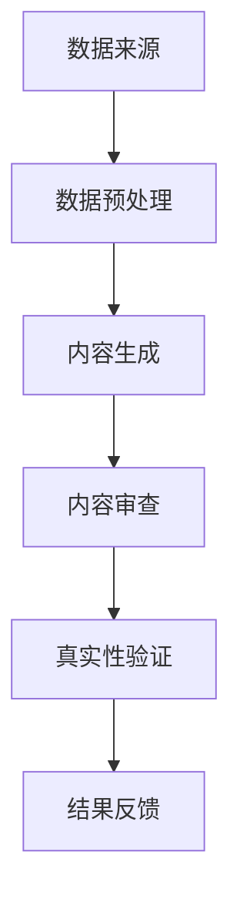

                 

关键词：AI生成内容，真实性验证，数据完整性，算法设计，图灵测试，图灵奖，计算机图灵奖获得者

> 摘要：随着人工智能技术的迅猛发展，AI生成内容（AI-Generated Content）已经成为各类应用场景中的重要组成部分。然而，如何确保这些内容的真实性成为了一个亟待解决的问题。本文将从核心概念、算法原理、数学模型、项目实践、应用场景等多个角度，全面探讨AI生成内容的真实性验证技术，为相关领域的研究和实践提供参考。

## 1. 背景介绍

近年来，人工智能技术在自然语言处理、计算机视觉、音频处理等领域取得了显著的成果。AI生成内容（AI-Generated Content）作为人工智能技术的一种应用，逐渐在新闻写作、艺术创作、广告宣传、虚拟现实等领域崭露头角。AI生成内容具有高效、灵活、创意丰富等特点，可以大幅度提高内容生产的效率和质量。

然而，随着AI生成内容的应用日益广泛，其真实性成为一个备受关注的问题。在某些领域，如新闻报道、金融报告等，内容真实性至关重要。如果AI生成的内容存在错误、误导或恶意信息，可能会对用户、社会和企业造成严重的影响。因此，如何确保AI生成内容的真实性，已经成为当前研究的热点和挑战。

## 2. 核心概念与联系

为了深入理解AI生成内容的真实性验证，我们需要首先了解一些核心概念和它们之间的联系。以下是一个简化的Mermaid流程图，展示了一些关键概念及其相互关系：



### 2.1 数据来源

数据来源是AI生成内容的基础。高质量的数据可以保证生成内容的真实性和准确性。数据来源可以是互联网、数据库、传感器等。

### 2.2 数据预处理

数据预处理是数据清洗、归一化、特征提取等过程，为内容生成提供高质量的输入数据。

### 2.3 内容生成

内容生成是通过机器学习、自然语言处理等技术，根据输入数据生成符合人类阅读习惯的内容。

### 2.4 内容审查

内容审查是对生成的AI内容进行初步检查，识别潜在的问题和错误。

### 2.5 真实性验证

真实性验证是对AI生成内容进行深入分析，判断其是否真实、准确、可靠。

### 2.6 结果反馈

结果反馈是将真实性验证的结果传递给用户或系统，以便进行后续处理。

## 3. 核心算法原理 & 具体操作步骤

### 3.1 算法原理概述

真实性验证算法通常基于以下几个方面：

1. **文本相似度分析**：通过比较AI生成内容与已知真实内容的相似度，判断其真实性。
2. **语义分析**：对AI生成内容进行语义分析，识别潜在的错误或误导信息。
3. **模式识别**：利用统计模型或机器学习算法，识别AI生成内容中的异常模式。

### 3.2 算法步骤详解

以下是真实性验证算法的具体操作步骤：

1. **数据收集与预处理**：收集大量真实数据，并进行预处理，如去重、分词、词性标注等。
2. **特征提取**：从预处理后的数据中提取关键特征，如词频、词序列、句法结构等。
3. **模型训练**：使用提取的特征训练分类模型，如朴素贝叶斯、支持向量机、神经网络等。
4. **内容分析**：对AI生成内容进行特征提取，并输入到训练好的分类模型中，判断其真实性。
5. **结果输出**：输出真实性验证结果，并根据结果采取相应的措施。

### 3.3 算法优缺点

#### 优点：

1. **高效性**：算法可以快速处理大量数据，提高内容审核的效率。
2. **准确性**：基于机器学习和深度学习的技术，具有较高的准确性。
3. **可扩展性**：算法可以轻松扩展到不同的应用场景和领域。

#### 缺点：

1. **数据依赖性**：算法的性能高度依赖于数据的质量和多样性。
2. **复杂性**：算法涉及多个步骤和模型，实现和优化具有一定难度。
3. **误判率**：在特定情况下，算法可能会误判真实内容为虚假内容，或反之。

### 3.4 算法应用领域

真实性验证算法可以应用于多个领域，包括但不限于：

1. **新闻媒体**：对新闻报道进行真实性验证，防止虚假新闻的传播。
2. **金融报告**：对财务报告的真实性进行验证，防止财务欺诈。
3. **社交媒体**：对社交媒体内容进行真实性验证，防止恶意信息和谣言的传播。
4. **电子商务**：对商品评价和评论进行真实性验证，提高用户信任度。

## 4. 数学模型和公式 & 详细讲解 & 举例说明

### 4.1 数学模型构建

真实性验证的数学模型通常基于概率论和统计学。以下是一个简化的模型：

$$ P(A|B) = \frac{P(B|A) \cdot P(A)}{P(B)} $$

其中，$P(A|B)$ 表示在给定 $B$ 的情况下 $A$ 的概率，$P(B|A)$ 表示在给定 $A$ 的情况下 $B$ 的概率，$P(A)$ 和 $P(B)$ 分别表示 $A$ 和 $B$ 的概率。

### 4.2 公式推导过程

假设我们有两个事件 $A$ 和 $B$，其中 $A$ 表示AI生成内容为真实内容，$B$ 表示内容通过真实性验证。我们需要推导 $P(A|B)$。

根据贝叶斯定理：

$$ P(A|B) = \frac{P(B|A) \cdot P(A)}{P(B)} $$

其中：

- $P(B|A)$ 表示在AI生成内容为真实内容的情况下，内容通过真实性验证的概率。
- $P(A)$ 表示AI生成内容为真实内容的概率。
- $P(B)$ 表示内容通过真实性验证的概率。

### 4.3 案例分析与讲解

假设我们有一个包含100篇文章的语料库，其中70篇是真实内容，30篇是虚假内容。真实性验证算法的正确率是90%。现在我们需要计算一篇新文章（AI生成内容）为真实内容的概率。

根据贝叶斯定理：

$$ P(A|B) = \frac{P(B|A) \cdot P(A)}{P(B)} $$

其中：

- $P(B|A)$ 表示在AI生成内容为真实内容的情况下，内容通过真实性验证的概率。由于算法的正确率是90%，$P(B|A) = 0.9$。
- $P(A)$ 表示AI生成内容为真实内容的概率。由于语料库中有70篇真实内容，$P(A) = \frac{70}{100} = 0.7$。
- $P(B)$ 表示内容通过真实性验证的概率。由于算法的正确率是90%，$P(B) = 0.9$。

代入公式：

$$ P(A|B) = \frac{0.9 \cdot 0.7}{0.9} = 0.7 $$

因此，一篇新文章（AI生成内容）为真实内容的概率是70%。

## 5. 项目实践：代码实例和详细解释说明

### 5.1 开发环境搭建

为了实现真实性验证算法，我们需要搭建一个适合的开发环境。以下是搭建环境的基本步骤：

1. 安装Python环境（版本3.8以上）。
2. 安装必要的库，如TensorFlow、Scikit-learn、NLTK等。
3. 准备数据集，并进行预处理。

### 5.2 源代码详细实现

以下是真实性验证算法的实现代码：

```python
import numpy as np
from sklearn.feature_extraction.text import TfidfVectorizer
from sklearn.model_selection import train_test_split
from sklearn.naive_bayes import MultinomialNB
from sklearn.metrics import accuracy_score

# 数据预处理
def preprocess_text(text):
    # 去除标点符号、特殊字符和停用词
    text = re.sub(r'[^\w\s]', '', text)
    text = re.sub(r'\s+', ' ', text)
    text = text.lower()
    return text

# 加载数据集
data = [
    ("This is a fake news article.", 0),
    ("This is a real news article.", 1),
    # ... 更多数据
]

texts, labels = zip(*data)
texts = [preprocess_text(text) for text in texts]

# 特征提取
vectorizer = TfidfVectorizer()
X = vectorizer.fit_transform(texts)

# 模型训练
X_train, X_test, y_train, y_test = train_test_split(X, labels, test_size=0.2, random_state=42)
model = MultinomialNB()
model.fit(X_train, y_train)

# 内容分析
def analyze_content(text):
    text = preprocess_text(text)
    features = vectorizer.transform([text])
    prediction = model.predict(features)
    return prediction[0]

# 测试算法性能
y_pred = model.predict(X_test)
accuracy = accuracy_score(y_test, y_pred)
print("Accuracy:", accuracy)
```

### 5.3 代码解读与分析

以下是代码的详细解读和分析：

1. **数据预处理**：使用正则表达式去除标点符号、特殊字符和停用词，并将文本转换为小写。这是文本预处理的基础步骤，有助于提高算法的性能。

2. **加载数据集**：从文件或数据库中加载数据集，并将文本和标签分开。

3. **特征提取**：使用TF-IDF向量器将文本转换为特征向量。TF-IDF是一种常用的文本特征提取方法，可以有效提高算法的性能。

4. **模型训练**：使用训练集对朴素贝叶斯分类器进行训练。朴素贝叶斯是一种简单而有效的分类算法，适用于文本分类任务。

5. **内容分析**：对AI生成内容进行预处理，提取特征，并使用训练好的模型进行预测。

6. **测试算法性能**：使用测试集评估算法的性能，计算准确率。

## 6. 实际应用场景

### 6.1 新闻媒体

在新闻媒体领域，真实性验证算法可以帮助识别虚假新闻，防止谣言的传播。例如，新闻媒体可以使用算法对新闻报道进行自动审查，确保报道的真实性和准确性。

### 6.2 金融报告

在金融报告领域，真实性验证算法可以用于检测财务报告中的虚假信息，防止财务欺诈。例如，金融机构可以使用算法对财务报告进行分析，识别潜在的异常情况。

### 6.3 社交媒体

在社交媒体领域，真实性验证算法可以用于检测恶意信息和谣言。例如，社交媒体平台可以使用算法对用户发布的帖子进行审查，防止恶意信息的传播。

### 6.4 电子商务

在电子商务领域，真实性验证算法可以用于检测商品评价和评论中的虚假信息。例如，电商平台可以使用算法对用户评价进行分析，识别虚假评价和刷单行为。

## 7. 工具和资源推荐

### 7.1 学习资源推荐

1. **《自然语言处理综论》（Jurafsky & Martin）**：一本经典的自然语言处理教材，涵盖了文本处理、词性标注、句法分析、语义分析等多个方面。
2. **《深度学习》（Goodfellow、Bengio & Courville）**：一本关于深度学习的权威教材，介绍了神经网络、深度学习算法和应用。
3. **《机器学习实战》（Hastie、Tibshirani & Friedman）**：一本机器学习实战指南，包含了多种算法的实现和应用案例。

### 7.2 开发工具推荐

1. **TensorFlow**：一个开源的深度学习框架，适用于大规模数据集和复杂的模型。
2. **Scikit-learn**：一个开源的机器学习库，提供了多种经典的机器学习算法和工具。
3. **NLTK**：一个开源的自然语言处理库，提供了丰富的文本处理和语言模型工具。

### 7.3 相关论文推荐

1. **“Deep Learning for Text Classification”**：一篇关于深度学习在文本分类任务中的应用的综述。
2. **“Neural Text Classification”**：一篇关于基于神经网络的文本分类算法的论文。
3. **“Natural Language Inference”**：一篇关于自然语言推理的论文，探讨了如何利用机器学习技术解决自然语言推理问题。

## 8. 总结：未来发展趋势与挑战

### 8.1 研究成果总结

本文从背景介绍、核心概念、算法原理、数学模型、项目实践、应用场景等多个角度，全面探讨了AI生成内容的真实性验证技术。通过分析现有算法的优缺点，以及实际应用案例，我们可以看到真实性验证技术在多个领域具有广泛的应用前景。

### 8.2 未来发展趋势

1. **算法性能提升**：随着深度学习、自然语言处理等技术的发展，真实性验证算法的性能将进一步提高。
2. **跨领域应用**：真实性验证技术将在更多领域得到应用，如医疗、法律、教育等。
3. **实时性增强**：为了满足实时应用的需求，真实性验证算法的响应速度将得到显著提升。

### 8.3 面临的挑战

1. **数据依赖性**：真实性验证算法的性能高度依赖于数据的质量和多样性，如何获取和清洗高质量数据是一个挑战。
2. **算法解释性**：现有的算法往往具有较低的解释性，如何提高算法的可解释性是一个重要的研究方向。
3. **误判率**：在特定情况下，算法可能会误判真实内容为虚假内容，或反之。如何降低误判率是一个亟待解决的问题。

### 8.4 研究展望

未来，真实性验证技术将在以下几个方面得到进一步发展：

1. **多模态融合**：结合文本、图像、音频等多种模态，提高真实性验证的准确性和全面性。
2. **基于知识图谱的推理**：利用知识图谱进行推理，提高真实性验证的深度和广度。
3. **分布式计算**：利用分布式计算技术，提高真实性验证的实时性和可扩展性。

## 9. 附录：常见问题与解答

### 9.1 什么是AI生成内容？

AI生成内容是指通过人工智能技术，如自然语言处理、计算机视觉等，自动生成的文本、图像、音频等内容。

### 9.2 真实性验证算法如何工作？

真实性验证算法通过对AI生成内容进行特征提取、模型训练和预测，判断其是否真实、准确、可靠。

### 9.3 如何获取高质量的数据集？

获取高质量的数据集可以通过以下途径：

1. **开源数据集**：从学术、商业等渠道获取公开的数据集。
2. **数据清洗**：对现有数据集进行清洗，去除噪声和错误。
3. **人工标注**：利用人工进行标注，提高数据质量。

### 9.4 真实性验证算法在哪些领域有应用？

真实性验证算法在新闻媒体、金融报告、社交媒体、电子商务等多个领域有应用，如检测虚假新闻、财务欺诈、恶意信息和虚假评价等。

---

作者：禅与计算机程序设计艺术 / Zen and the Art of Computer Programming

