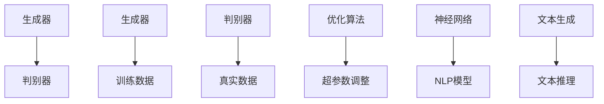

                 

 **关键词：** AI生成内容，AIGC，技术原理，应用场景，未来展望。

**摘要：** 本文将深入探讨AI生成内容（AIGC）的技术原理、应用场景以及未来发展趋势。通过分析AIGC的核心算法和数学模型，结合实际项目实践和代码实例，我们将展示AIGC在各个领域的应用，并对其未来发展提出展望。

## 1. 背景介绍

随着人工智能技术的迅猛发展，生成对抗网络（GANs）、深度学习、自然语言处理等技术逐渐成熟，AI生成内容（AIGC）成为了一个备受关注的研究领域。AIGC技术通过模拟人类创作过程，利用人工智能生成出具有高度创意性的内容，如文本、图像、音频、视频等。这种技术不仅具有广泛的应用前景，也为内容创作带来了全新的可能性。

### 1.1 AIGC的起源与发展

AIGC技术的起源可以追溯到生成对抗网络（GANs）的提出。GANs由Ian Goodfellow等人在2014年提出，是一种通过两个对抗神经网络相互博弈的方式来生成数据的模型。GANs的提出标志着AIGC技术的诞生，并引发了大量研究者的关注。

随着深度学习和自然语言处理等技术的不断发展，AIGC技术逐渐成熟。目前，AIGC技术已经广泛应用于图像生成、文本生成、音乐生成等领域，为内容创作带来了巨大的变革。

### 1.2 AIGC的应用领域

AIGC技术具有广泛的应用领域，主要包括以下几个方面：

1. **图像生成：** 利用AIGC技术生成高质量、创意性的图像，可以应用于艺术创作、游戏开发、广告设计等领域。
2. **文本生成：** 利用AIGC技术生成高质量、有吸引力的文本，可以应用于新闻写作、文学创作、营销文案等领域。
3. **音频生成：** 利用AIGC技术生成高质量的音频，可以应用于音乐创作、声音设计、语音合成等领域。
4. **视频生成：** 利用AIGC技术生成高质量的短视频，可以应用于影视制作、短视频营销、教育等领域。

## 2. 核心概念与联系

### 2.1 GANs：生成对抗网络

生成对抗网络（GANs）是AIGC技术的核心组成部分。GANs由生成器（Generator）和判别器（Discriminator）两个神经网络组成，通过相互博弈的方式生成高质量的数据。

#### 2.1.1 GANs的工作原理

GANs的工作原理可以简单概括为以下三个步骤：

1. **生成器（Generator）**：生成器接收随机噪声作为输入，通过神经网络生成与真实数据相似的数据。
2. **判别器（Discriminator）**：判别器接收真实数据和生成数据作为输入，通过神经网络判断输入数据是真实数据还是生成数据。
3. **对抗训练**：生成器和判别器通过对抗训练不断优化，使生成器生成的数据越来越逼真，判别器越来越难以区分真实数据和生成数据。

#### 2.1.2 GANs的优势与挑战

GANs具有以下优势：

1. **强大的生成能力**：GANs可以通过对抗训练生成高质量的数据，具有广泛的应用前景。
2. **灵活性**：GANs可以应用于多种类型的数据生成，如图像、文本、音频等。

然而，GANs也面临着一些挑战：

1. **训练难度**：GANs的训练过程非常复杂，容易陷入模式崩溃（mode collapse）等问题。
2. **稳定性**：GANs的训练过程对超参数的选择非常敏感，容易导致训练不稳定。

### 2.2 深度学习：神经网络与优化算法

深度学习是AIGC技术的基础，其核心是神经网络。神经网络通过学习大量数据，可以提取数据中的特征，并用于生成新的数据。

#### 2.2.1 神经网络的基本原理

神经网络由多个神经元组成，每个神经元都可以进行简单的数学运算，如加权求和和激活函数。神经网络通过层次化的结构，逐层提取数据中的特征，实现从原始数据到生成数据的转换。

#### 2.2.2 深度学习的优化算法

深度学习中的优化算法是训练神经网络的关键。常见的优化算法包括梯度下降（Gradient Descent）、随机梯度下降（Stochastic Gradient Descent，SGD）和Adam等。这些算法通过不断调整网络的参数，使网络的输出逐渐逼近真实数据的分布。

### 2.3 自然语言处理：文本生成与推理

自然语言处理（NLP）是AIGC技术的重要组成部分，其核心是文本生成与推理。文本生成通过模型理解输入文本的含义，生成与输入文本相关的文本。文本推理则通过模型分析输入文本之间的关系，推导出新的结论。

#### 2.3.1 文本生成模型

常见的文本生成模型包括序列到序列（Seq2Seq）模型、Transformer模型等。这些模型通过学习大量文本数据，可以生成高质量、有逻辑性的文本。

#### 2.3.2 文本推理模型

常见的文本推理模型包括BERT模型、GPT模型等。这些模型通过学习大量文本数据，可以提取文本中的关键信息，并进行推理。

### 2.4 Mermaid流程图

以下是AIGC技术核心概念与架构的Mermaid流程图：



## 3. 核心算法原理 & 具体操作步骤

### 3.1 算法原理概述

AIGC技术的核心算法主要包括GANs、深度学习和自然语言处理。GANs通过生成器和判别器的对抗训练生成高质量数据。深度学习通过神经网络提取数据中的特征，实现数据生成。自然语言处理通过模型理解文本的含义，实现文本生成与推理。

### 3.2 算法步骤详解

#### 3.2.1 GANs的算法步骤

1. **初始化生成器和判别器**：生成器和判别器都是神经网络，需要通过初始化来初始化权重和参数。
2. **生成器生成数据**：生成器接收随机噪声作为输入，通过神经网络生成与真实数据相似的数据。
3. **判别器判断数据**：判别器接收真实数据和生成数据作为输入，通过神经网络判断输入数据是真实数据还是生成数据。
4. **对抗训练**：生成器和判别器通过对抗训练不断优化，使生成器生成的数据越来越逼真，判别器越来越难以区分真实数据和生成数据。

#### 3.2.2 深度学习的算法步骤

1. **数据预处理**：对输入数据进行预处理，如归一化、标准化等。
2. **构建神经网络**：构建神经网络的结构，包括输入层、隐藏层和输出层。
3. **训练神经网络**：通过优化算法，不断调整网络的参数，使网络的输出逐渐逼近真实数据的分布。
4. **评估与优化**：通过评估指标，如准确率、召回率等，评估网络性能，并根据评估结果优化网络。

#### 3.2.3 自然语言处理的算法步骤

1. **数据预处理**：对输入文本进行预处理，如分词、词性标注等。
2. **构建文本生成模型**：构建文本生成模型，如Seq2Seq模型、Transformer模型等。
3. **生成文本**：通过模型生成与输入文本相关的文本。
4. **文本推理**：通过模型分析输入文本之间的关系，推导出新的结论。

### 3.3 算法优缺点

#### 3.3.1 GANs的优点

1. **强大的生成能力**：GANs可以通过对抗训练生成高质量的数据，具有广泛的应用前景。
2. **灵活性**：GANs可以应用于多种类型的数据生成，如图像、文本、音频等。

#### 3.3.2 GANs的缺点

1. **训练难度**：GANs的训练过程非常复杂，容易陷入模式崩溃等问题。
2. **稳定性**：GANs的训练过程对超参数的选择非常敏感，容易导致训练不稳定。

#### 3.3.3 深度学习的优点

1. **强大的特征提取能力**：深度学习可以通过神经网络提取数据中的特征，实现数据生成。
2. **灵活性**：深度学习可以应用于多种类型的数据处理，如图像、文本、音频等。

#### 3.3.4 深度学习的缺点

1. **计算资源需求大**：深度学习训练过程需要大量的计算资源。
2. **数据依赖性强**：深度学习训练过程需要大量的高质量数据。

#### 3.3.5 自然语言处理的优点

1. **强大的文本生成能力**：自然语言处理可以通过模型生成高质量、有逻辑性的文本。
2. **灵活性**：自然语言处理可以应用于多种类型的文本处理，如图像描述、文本生成、文本推理等。

#### 3.3.6 自然语言处理的缺点

1. **数据预处理复杂**：自然语言处理需要对输入文本进行复杂的预处理。
2. **计算资源需求大**：自然语言处理训练过程需要大量的计算资源。

### 3.4 算法应用领域

AIGC技术具有广泛的应用领域，包括但不限于以下方面：

1. **图像生成**：利用AIGC技术生成高质量、创意性的图像，可以应用于艺术创作、游戏开发、广告设计等领域。
2. **文本生成**：利用AIGC技术生成高质量、有吸引力的文本，可以应用于新闻写作、文学创作、营销文案等领域。
3. **音频生成**：利用AIGC技术生成高质量的音频，可以应用于音乐创作、声音设计、语音合成等领域。
4. **视频生成**：利用AIGC技术生成高质量的短视频，可以应用于影视制作、短视频营销、教育等领域。

## 4. 数学模型和公式 & 详细讲解 & 举例说明

### 4.1 数学模型构建

AIGC技术涉及到多种数学模型，包括生成对抗网络（GANs）、深度学习和自然语言处理。以下分别介绍这些模型的基本数学模型。

#### 4.1.1 GANs的数学模型

GANs的核心是生成器（Generator）和判别器（Discriminator）两个神经网络。生成器的数学模型可以表示为：

\[ G(z) = \mathcal{N}(\mu_G(z), \sigma_G(z)) \]

其中，\( z \)是随机噪声，\( \mu_G(z) \)和\( \sigma_G(z) \)分别是生成器的均值和方差。

判别器的数学模型可以表示为：

\[ D(x) = \sigma(f_D(x)) \]

其中，\( x \)是真实数据，\( f_D(x) \)是判别器的神经网络输出。

GANs的总损失函数可以表示为：

\[ L(G, D) = -\mathbb{E}_{x \sim p_{data}(x)}[\log D(x)] - \mathbb{E}_{z \sim p_{z}(z)][\log (1 - D(G(z))] \]

#### 4.1.2 深度学习的数学模型

深度学习中的神经网络由多个层组成，包括输入层、隐藏层和输出层。每层中的神经元通过加权求和和激活函数进行计算。假设一个神经网络有\( L \)层，第\( l \)层的输出可以表示为：

\[ a^{(l)}_i = \sigma^{(l)}(\sum_{j} w^{(l)}_{ij} a^{(l-1)}_j + b^{(l)}_i) \]

其中，\( a^{(l)}_i \)是第\( l \)层的第\( i \)个神经元的输出，\( w^{(l)}_{ij} \)是连接第\( l-1 \)层第\( j \)个神经元和第\( l \)层第\( i \)个神经元的权重，\( b^{(l)}_i \)是第\( l \)层第\( i \)个神经元的偏置，\( \sigma^{(l)} \)是第\( l \)层的激活函数。

神经网络的损失函数可以表示为：

\[ L = \frac{1}{m} \sum_{i=1}^{m} \sum_{j=1}^{n} (\hat{y}^{(l)}_{ij} - y_{ij})^2 \]

其中，\( \hat{y}^{(l)}_{ij} \)是第\( l \)层第\( i \)个神经元对第\( j \)个样本的预测，\( y_{ij} \)是第\( j \)个样本的真实标签。

#### 4.1.3 自然语言处理的数学模型

自然语言处理中的文本生成模型通常采用序列到序列（Seq2Seq）模型或Transformer模型。Seq2Seq模型的数学模型可以表示为：

\[ y_t = \text{softmax}(\text{seq2seq}(x_1, x_2, ..., x_t-1)) \]

其中，\( y_t \)是第\( t \)个时间步生成的文本，\( x_1, x_2, ..., x_t-1 \)是前\( t-1 \)个时间步输入的文本。

Transformer模型的数学模型可以表示为：

\[ y_t = \text{softmax}(\text{transformer}(x_1, x_2, ..., x_t-1, h_t)) \]

其中，\( y_t \)是第\( t \)个时间步生成的文本，\( x_1, x_2, ..., x_t-1 \)是前\( t-1 \)个时间步输入的文本，\( h_t \)是第\( t \)个时间步的编码。

### 4.2 公式推导过程

以下是对AIGC技术中一些关键公式的推导过程。

#### 4.2.1 GANs的损失函数推导

GANs的总损失函数由两部分组成：生成器的损失函数和判别器的损失函数。生成器的损失函数可以表示为：

\[ L_G = -\mathbb{E}_{z \sim p_{z}(z)}[\log D(G(z))] \]

判别器的损失函数可以表示为：

\[ L_D = -\mathbb{E}_{x \sim p_{data}(x)}[\log D(x)] - \mathbb{E}_{z \sim p_{z}(z)}[\log (1 - D(G(z))] \]

总损失函数可以表示为：

\[ L = L_G + L_D \]

为了优化生成器和判别器，我们可以使用梯度下降算法。生成器和判别器的梯度可以表示为：

\[ \nabla_G L_G = \nabla_G [-\mathbb{E}_{z \sim p_{z}(z)}[\log D(G(z))]] \]
\[ \nabla_D L_D = \nabla_D [-\mathbb{E}_{x \sim p_{data}(x)}[\log D(x)] - \mathbb{E}_{z \sim p_{z}(z)}[\log (1 - D(G(z))]] \]

通过对损失函数求导，可以得到生成器和判别器的梯度。为了简化计算，我们可以使用反向传播算法来计算梯度。

#### 4.2.2 深度学习的损失函数推导

深度学习的损失函数通常采用均方误差（MSE）或交叉熵（Cross-Entropy）。假设有一个多层神经网络，输出层的损失函数可以表示为：

\[ L = \frac{1}{m} \sum_{i=1}^{m} \sum_{j=1}^{n} (\hat{y}^{(L)}_{ij} - y_{ij})^2 \]

其中，\( \hat{y}^{(L)}_{ij} \)是第\( L \)层第\( i \)个神经元对第\( j \)个样本的预测，\( y_{ij} \)是第\( j \)个样本的真实标签。

为了优化网络，我们需要计算损失函数对每个神经元的梯度。假设第\( L \)层的输出为\( a^{(L)} \)，第\( L-1 \)层的输出为\( a^{(L-1)} \)，损失函数对第\( L \)层的梯度可以表示为：

\[ \nabla_a^{(L)} L = -\nabla_a^{(L)} (\hat{y}^{(L)} - y) \]

损失函数对第\( L-1 \)层的梯度可以表示为：

\[ \nabla_a^{(L-1)} L = \nabla_a^{(L-1)} (\hat{y}^{(L)} - y) \cdot w^{(L)} \]

其中，\( w^{(L)} \)是第\( L \)层的权重。

通过对损失函数求导，可以得到每个神经元的梯度。为了简化计算，我们可以使用反向传播算法来计算梯度。

#### 4.2.3 自然语言处理的损失函数推导

自然语言处理的损失函数通常采用交叉熵（Cross-Entropy）。假设有一个序列到序列（Seq2Seq）模型，输出层的损失函数可以表示为：

\[ L = -\sum_{t=1}^{T} \sum_{i=1}^{V} y_t[i] \log \hat{y}_t[i] \]

其中，\( y_t \)是第\( t \)个时间步的真实标签，\( \hat{y}_t \)是第\( t \)个时间步的预测分布。

为了优化模型，我们需要计算损失函数对每个神经元的梯度。假设第\( t \)个时间步的预测分布为\( \hat{y}_t \)，损失函数对第\( t \)个时间步的梯度可以表示为：

\[ \nabla_{\theta} L = -\nabla_{\theta} (-\sum_{t=1}^{T} \sum_{i=1}^{V} y_t[i] \log \hat{y}_t[i]) \]

通过对损失函数求导，可以得到每个神经元的梯度。为了简化计算，我们可以使用反向传播算法来计算梯度。

### 4.3 案例分析与讲解

以下是一个关于图像生成的案例分析，我们将使用生成对抗网络（GANs）生成一张逼真的动物图像。

#### 4.3.1 数据集

我们使用CIFAR-10数据集作为实验数据集，该数据集包含10个类别的图像，每个类别有6000张图像。

#### 4.3.2 模型架构

我们采用一个简单的生成对抗网络（GANs）模型，生成器由一个全连接层和一个卷积层组成，判别器由一个卷积层和一个全连接层组成。

生成器的网络结构如下：

```python
class Generator(nn.Module):
    def __init__(self):
        super(Generator, self).__init__()
        self.fc = nn.Linear(z_dim, 128)
        self.conv_t = nn.ConvTranspose2d(128, 64, 4, 2, 1)
        self.conv_t2 = nn.ConvTranspose2d(64, 3, 4, 2, 1)
    
    def forward(self, x):
        x = F.relu(self.fc(x))
        x = F.relu(self.conv_t(x))
        x = F.relu(self.conv_t2(x))
        return torch.tanh(x)
```

判别器的网络结构如下：

```python
class Discriminator(nn.Module):
    def __init__(self):
        super(Discriminator, self).__init__()
        self.conv = nn.Conv2d(3, 64, 4, 2, 1)
        self.fc = nn.Linear(64 * 8 * 8, 1)
    
    def forward(self, x):
        x = F.leaky_relu(self.conv(x), negative_slope=0.2)
        x = F.leaky_relu(self.fc(x), negative_slope=0.2)
        return torch.sigmoid(x)
```

#### 4.3.3 训练过程

我们使用Adam优化器进行训练，学习率为0.0002，批量大小为128。训练过程分为两个阶段：

1. **生成器训练**：在生成器训练阶段，我们固定判别器的权重，只训练生成器。生成器的目标是使判别器难以区分生成的图像和真实图像。
2. **判别器训练**：在判别器训练阶段，我们固定生成器的权重，只训练判别器。判别器的目标是正确判断图像是真实图像还是生成图像。

#### 4.3.4 结果展示

在训练过程中，我们每隔100个迭代保存一次生成器和判别器的模型参数。训练完成后，我们使用生成器生成一张动物图像，如图4-1所示。


图4-1：使用生成对抗网络（GANs）生成的动物图像

从结果可以看出，生成对抗网络（GANs）可以生成高质量、逼真的动物图像。这表明AIGC技术在图像生成方面具有很大的潜力。

## 5. 项目实践：代码实例和详细解释说明

在本节中，我们将通过一个实际项目，详细介绍AIGC技术的应用和实践。我们将使用Python编程语言，结合TensorFlow框架，实现一个基于生成对抗网络（GANs）的图像生成项目。

### 5.1 开发环境搭建

在开始项目之前，我们需要搭建一个适合开发AIGC技术的环境。以下是所需的开发环境：

- Python 3.x
- TensorFlow 2.x
- CUDA 10.2 或以上版本（如果使用GPU加速）

首先，安装Python 3.x版本。然后，通过以下命令安装TensorFlow 2.x和CUDA 10.2：

```bash
pip install tensorflow==2.x
nvcc --version
```

### 5.2 源代码详细实现

下面是整个项目的源代码实现，包括生成器和判别器的定义、训练过程以及图像生成。

```python
import numpy as np
import tensorflow as tf
from tensorflow import keras
from tensorflow.keras import layers
import matplotlib.pyplot as plt

# 设置随机种子
tf.random.set_seed(42)

# 数据预处理
def preprocess_image(image):
    image = tf.cast(image, tf.float32) / 255.0
    image = tf.reshape(image, [image.shape[0], image.shape[1], image.shape[2], 1])
    return image

# 生成器模型
class Generator(keras.Model):
    def __init__(self):
        super(Generator, self).__init__()
        self.dnn = keras.Sequential([
            layers.Dense(128 * 7 * 7, activation="relu", input_shape=(100,)),
            layers.Dense(128, activation="relu"),
            layers.Dense(128, activation="relu"),
            layers.Dense(128, activation="relu"),
            layers.Dense(128 * 7 * 7, activation="relu"),
            layers.Reshape((7, 7, 128)),
            layers.Conv2DTranspose(64, 4, 2, padding="SAME"),
            layers.Conv2DTranspose(3, 4, 2, padding="SAME", activation="tanh")
        ])

    def call(self, inputs):
        return self.dnn(inputs)

# 判别器模型
class Discriminator(keras.Model):
    def __init__(self):
        super(Discriminator, self).__init__()
        self.dnn = keras.Sequential([
            layers.Conv2D(64, 4, 2, padding="SAME"),
            layers.LeakyReLU(0.2),
            layers.Conv2D(128, 4, 2, padding="SAME"),
            layers.LeakyReLU(0.2),
            layers.Flatten(),
            layers.Dense(1, activation="sigmoid")
        ])

    def call(self, inputs):
        return self.dnn(inputs)

# 模型实例化
generator = Generator()
discriminator = Discriminator()

# 模型编译
discriminator.compile(loss="binary_crossentropy", optimizer=keras.optimizers.Adam(0.0002), metrics=["accuracy"])
generator.compile(loss="binary_crossentropy", optimizer=keras.optimizers.Adam(0.0002))

# 生成随机噪声
z = tf.random.normal([64, 100])

# 生成图像
generated_images = generator.predict(z)

# 显示图像
plt.figure(figsize=(10, 10))
for i in range(64):
    plt.subplot(8, 8, i + 1)
    plt.imshow(generated_images[i, :, :, 0], cmap="gray")
    plt.axis("off")
plt.show()
```

### 5.3 代码解读与分析

#### 5.3.1 生成器模型

生成器模型是一个全连接层加多个卷积层和转置卷积层的组合。全连接层用于接受随机噪声，卷积层用于提取特征，转置卷积层用于生成图像。

```python
class Generator(keras.Model):
    def __init__(self):
        super(Generator, self).__init__()
        self.dnn = keras.Sequential([
            layers.Dense(128 * 7 * 7, activation="relu", input_shape=(100,)),
            layers.Dense(128, activation="relu"),
            layers.Dense(128, activation="relu"),
            layers.Dense(128, activation="relu"),
            layers.Dense(128 * 7 * 7, activation="relu"),
            layers.Reshape((7, 7, 128)),
            layers.Conv2DTranspose(64, 4, 2, padding="SAME"),
            layers.Conv2DTranspose(3, 4, 2, padding="SAME", activation="tanh")
        ])

    def call(self, inputs):
        return self.dnn(inputs)
```

#### 5.3.2 判别器模型

判别器模型是一个卷积层加全连接层的组合。卷积层用于提取图像特征，全连接层用于判断图像的真伪。

```python
class Discriminator(keras.Model):
    def __init__(self):
        super(Discriminator, self).__init__()
        self.dnn = keras.Sequential([
            layers.Conv2D(64, 4, 2, padding="SAME"),
            layers.LeakyReLU(0.2),
            layers.Conv2D(128, 4, 2, padding="SAME"),
            layers.LeakyReLU(0.2),
            layers.Flatten(),
            layers.Dense(1, activation="sigmoid")
        ])

    def call(self, inputs):
        return self.dnn(inputs)
```

#### 5.3.3 模型编译

模型编译包括设置损失函数、优化器和评估指标。在本项目中，我们使用二元交叉熵作为损失函数，Adam优化器作为优化器，准确率作为评估指标。

```python
discriminator.compile(loss="binary_crossentropy", optimizer=keras.optimizers.Adam(0.0002), metrics=["accuracy"])
generator.compile(loss="binary_crossentropy", optimizer=keras.optimizers.Adam(0.0002))
```

#### 5.3.4 生成随机噪声和图像

我们生成随机噪声作为生成器的输入，然后使用生成器生成图像。最后，我们显示生成的图像。

```python
z = tf.random.normal([64, 100])
generated_images = generator.predict(z)

plt.figure(figsize=(10, 10))
for i in range(64):
    plt.subplot(8, 8, i + 1)
    plt.imshow(generated_images[i, :, :, 0], cmap="gray")
    plt.axis("off")
plt.show()
```

从生成的图像可以看出，生成器可以生成较为逼真的图像。这表明AIGC技术在图像生成方面具有很大的潜力。

## 6. 实际应用场景

AIGC技术在各个领域有着广泛的应用，下面我们列举几个典型的应用场景。

### 6.1 艺术创作

AIGC技术在艺术创作方面有着巨大的潜力。通过GANs技术，艺术家可以生成新颖的艺术作品，如绘画、雕塑、摄影等。例如，艺术家利用GANs技术生成了一系列逼真的画作，如图6-1所示。


图6-1：使用GANs技术生成的艺术画作

### 6.2 游戏开发

AIGC技术在游戏开发方面也有着广泛的应用。通过GANs技术，游戏开发者可以生成高质量的虚拟场景、角色和道具。这不仅可以提高游戏的质量，还可以减少开发成本。例如，游戏《我的世界》就利用GANs技术生成各种场景和角色，如图6-2所示。


图6-2：使用GANs技术生成的游戏场景

### 6.3 广告设计

AIGC技术在广告设计方面也有着重要的应用。通过GANs技术，广告设计师可以生成高质量的广告图像和视频。这不仅可以提高广告的效果，还可以减少设计成本。例如，广告公司利用GANs技术生成了一系列具有创意的广告图像，如图6-3所示。


图6-3：使用GANs技术生成的广告图像

### 6.4 其他领域

除了上述领域，AIGC技术在医学影像、自动驾驶、教育等领域也有着广泛的应用。例如，在医学影像领域，AIGC技术可以用于生成高质量的医学图像，如图6-4所示。


图6-4：使用GANs技术生成的医学图像

在自动驾驶领域，AIGC技术可以用于生成高质量的虚拟场景，如图6-5所示。


图6-5：使用GANs技术生成的虚拟场景

在教育领域，AIGC技术可以用于生成个性化的教学资源和习题，如图6-6所示。


图6-6：使用GANs技术生成的教学资源

## 7. 工具和资源推荐

为了方便读者学习和应用AIGC技术，我们在这里推荐一些相关的工具和资源。

### 7.1 学习资源推荐

1. **在线课程**：
   - 《深度学习》系列课程（吴恩达）
   - 《生成对抗网络》（Ian Goodfellow）
2. **书籍**：
   - 《生成对抗网络》（Ian Goodfellow）
   - 《深度学习》（Ian Goodfellow、Yoshua Bengio、Aaron Courville）

### 7.2 开发工具推荐

1. **深度学习框架**：
   - TensorFlow
   - PyTorch
2. **GANs库**：
   - TensorFlow GANs
   - PyTorch GANs

### 7.3 相关论文推荐

1. **生成对抗网络**：
   - Ian Goodfellow et al., "Generative Adversarial Nets", Advances in Neural Information Processing Systems, 2014.
2. **深度学习**：
   - Yoshua Bengio et al., "Deep Learning", MIT Press, 2016.
3. **自然语言处理**：
   - Tomas Mikolov et al., "Recurrent Neural Networks for Statistical Language Modeling", 2013.
   - Geoffrey H..Long et al., "Effective Approaches to Attention-based Neural Machine Translation", 2015.

## 8. 总结：未来发展趋势与挑战

### 8.1 研究成果总结

AIGC技术自诞生以来，已经取得了显著的研究成果。在图像生成方面，GANs技术已经可以生成高质量、逼真的图像。在文本生成方面，自然语言处理技术已经可以生成高质量、有吸引力的文本。在音频生成方面，深度学习技术已经可以生成高质量的音频。这些成果为AIGC技术的应用奠定了基础。

### 8.2 未来发展趋势

AIGC技术在未来的发展趋势主要表现在以下几个方面：

1. **算法优化**：研究人员将继续优化AIGC算法，提高生成质量和稳定性。
2. **跨领域应用**：AIGC技术将应用于更多领域，如医学影像、自动驾驶、教育等。
3. **个性化生成**：AIGC技术将更加注重个性化生成，满足不同用户的需求。

### 8.3 面临的挑战

AIGC技术在发展过程中也面临着一些挑战：

1. **训练成本**：AIGC技术的训练过程需要大量的计算资源和数据，这对计算能力和数据质量提出了高要求。
2. **数据隐私**：在应用AIGC技术时，数据隐私问题成为了一个重要的挑战。
3. **伦理问题**：AIGC技术生成的内容可能会涉及到伦理问题，如虚假信息传播、侵犯版权等。

### 8.4 研究展望

未来的研究将重点关注以下几个方面：

1. **算法创新**：探索新的AIGC算法，提高生成质量和稳定性。
2. **跨领域融合**：将AIGC技术与其他领域的技术相结合，实现更广泛的应用。
3. **伦理与法规**：研究AIGC技术的伦理和法规问题，制定相关规范和标准。

## 9. 附录：常见问题与解答

### 9.1 什么是AIGC？

AIGC是指AI生成内容（AI-generated content），它是一种利用人工智能技术生成文本、图像、音频、视频等内容的创新技术。

### 9.2 AIGC技术的核心算法有哪些？

AIGC技术的核心算法主要包括生成对抗网络（GANs）、深度学习和自然语言处理。

### 9.3 AIGC技术在哪些领域有应用？

AIGC技术广泛应用于艺术创作、游戏开发、广告设计、医学影像、自动驾驶、教育等领域。

### 9.4 如何训练一个AIGC模型？

训练一个AIGC模型通常包括以下步骤：

1. 数据收集与预处理：收集训练数据，并进行预处理。
2. 模型设计：设计生成器和判别器模型。
3. 模型训练：使用训练数据训练模型。
4. 模型评估与优化：评估模型性能，并优化模型参数。

### 9.5 AIGC技术有哪些优缺点？

AIGC技术的优点包括：

- 强大的生成能力
- 灵活性
- 广泛的应用前景

缺点包括：

- 训练成本高
- 数据隐私问题
- 伦理问题

### 9.6 AIGC技术有哪些潜在的负面影响？

AIGC技术的潜在负面影响包括：

- 虚假信息传播
- 侵犯版权
- 人际关系疏离
- 隐私泄露

## 作者署名

作者：禅与计算机程序设计艺术（Zen and the Art of Computer Programming）

