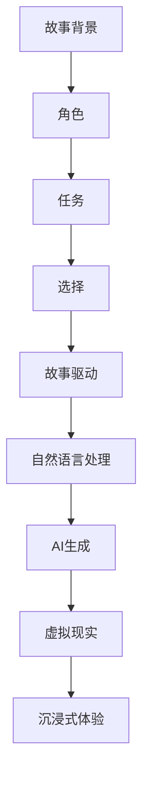

                 

关键词：AI生成、互动小说、游戏设计、故事驱动、虚拟世界、用户参与、自然语言处理、游戏开发

> 摘要：本文探讨了人工智能（AI）在生成互动小说游戏中的应用，分析了故事与游戏融合的技术原理，探讨了当前技术的实现方法，以及未来发展的趋势与挑战。通过结合自然语言处理、虚拟现实和游戏设计理论，AI生成的互动小说游戏为用户提供了一种全新的沉浸式娱乐体验。

## 1. 背景介绍

互动小说游戏（Interactive Fiction Game，简称IFG）是一种以故事为核心的游戏类型，玩家通过阅读文本并做出选择来推动故事发展。自20世纪80年代以来，互动小说游戏一直以其独特的叙事方式和深度的故事体验吸引着玩家。然而，传统的互动小说游戏往往受限于文本的表现力和玩家的想象力，难以实现高度个性化的游戏体验。

近年来，人工智能（AI）技术的快速发展为互动小说游戏带来了新的机遇。AI能够生成丰富多样的故事情节，结合自然语言处理（NLP）技术，可以实现高度动态化的故事驱动，从而打破传统互动小说游戏的局限性。AI生成的互动小说游戏不仅能够提供更加丰富的叙事体验，还能通过虚拟现实（VR）技术实现沉浸式的游戏环境，为玩家带来全新的娱乐方式。

## 2. 核心概念与联系

### 2.1. 互动小说游戏的基本结构

互动小说游戏通常由以下几个部分组成：

- **故事背景**：设定游戏发生的时间和地点，为故事提供背景。
- **角色**：故事中的主要角色，包括玩家角色和NPC（非玩家角色）。
- **任务**：玩家需要完成的特定目标或任务。
- **选择**：玩家在故事过程中做出的决策，会影响故事的发展和结局。

### 2.2. 故事驱动的游戏机制

故事驱动的游戏机制是指游戏的核心机制是推动故事发展。在故事驱动的游戏中，玩家的选择直接影响故事的走向和结局。这种机制强调故事的连贯性和逻辑性，使游戏体验更加沉浸和丰富。

### 2.3. 自然语言处理与故事生成

自然语言处理（NLP）是AI技术的一个分支，旨在使计算机理解和生成人类语言。在互动小说游戏中，NLP技术可用于生成角色对话、环境描述和故事情节。通过NLP，AI能够理解和处理玩家的输入，并生成合适的响应，实现人机交互。

### 2.4. 虚拟现实与沉浸式体验

虚拟现实（VR）技术为互动小说游戏提供了沉浸式的游戏环境。通过VR头盔、手柄等设备，玩家可以进入一个完全虚拟的世界，与游戏中的角色和环境进行互动。VR技术的引入，使得互动小说游戏不仅限于文本，还能通过视觉、听觉等多感官刺激提升用户体验。

### 2.5. Mermaid 流程图

下面是互动小说游戏的核心概念和联系流程图：



## 3. 核心算法原理 & 具体操作步骤

### 3.1. 算法原理概述

AI生成的互动小说游戏的核心算法基于生成对抗网络（GAN）和序列到序列（Seq2Seq）模型。GAN通过生成器和判别器的对抗训练，能够生成高质量的文本。Seq2Seq模型则用于将玩家的输入转换为相应的输出，实现人机交互。

### 3.2. 算法步骤详解

1. **数据准备**：收集大量的互动小说文本，用于训练GAN模型。
2. **模型训练**：使用GAN模型训练生成器和判别器，使生成器能够生成接近真实文本的高质量故事情节。
3. **输入处理**：将玩家的输入文本编码为序列，输入到Seq2Seq模型中。
4. **生成响应**：Seq2Seq模型根据输入序列生成相应的响应文本。
5. **交互反馈**：将生成器生成的文本反馈给玩家，实现人机交互。

### 3.3. 算法优缺点

**优点**：

- **多样性**：AI能够生成丰富多样的故事情节，满足不同玩家的需求。
- **个性化**：AI可以根据玩家的选择和反馈，生成个性化的故事体验。
- **实时交互**：AI能够实时响应用户输入，实现高效的交互。

**缺点**：

- **质量不稳定**：AI生成的文本质量有时会受到训练数据和模型参数的影响。
- **计算资源需求高**：GAN模型和Seq2Seq模型需要大量的计算资源，训练过程较慢。

### 3.4. 算法应用领域

AI生成的互动小说游戏主要应用于以下领域：

- **娱乐**：为用户提供全新的娱乐方式，提升用户体验。
- **教育**：通过互动故事的方式，帮助学生更好地理解和记忆知识。
- **心理健康**：通过沉浸式的游戏环境，帮助用户缓解压力和焦虑。

## 4. 数学模型和公式 & 详细讲解 & 举例说明

### 4.1. 数学模型构建

在AI生成的互动小说游戏中，核心的数学模型包括生成对抗网络（GAN）和序列到序列（Seq2Seq）模型。以下是这两个模型的数学表示：

#### 生成对抗网络（GAN）

生成器 G：G(z; θ_G) = x

判别器 D：D(x; θ_D) 和 D(G(z; θ_G); θ_D)

损失函数：L_D(θ_D) = -E[log D(x; θ_D)] - E[log (1 - D(G(z; θ_G); θ_D))]

#### 序列到序列（Seq2Seq）模型

编码器：h_t^e = \sigma(W_e [s_t; h_{t-1}^e] + b_e)

解码器：c_t^d = \sigma(W_d [c_{t-1}^d; h_t^d] + b_d)

输出：\hat{y}_t = \text{softmax}(W_y h_t^d + b_y)

### 4.2. 公式推导过程

#### 生成对抗网络（GAN）

1. **生成器损失**：

L_G(θ_G) = E[log(1 - D(G(z; θ_G); θ_D))]

2. **判别器损失**：

L_D(θ_D) = -E[log D(x; θ_D)] - E[log (1 - D(G(z; θ_G); θ_D))]

3. **总损失**：

L(θ_G, θ_D) = L_G(θ_G) + βL_D(θ_D)

#### 序列到序列（Seq2Seq）模型

1. **编码器**：

h_t^e = \sigma(W_e [s_t; h_{t-1}^e] + b_e)

2. **解码器**：

c_t^d = \sigma(W_d [c_{t-1}^d; h_t^d] + b_d)

\hat{y}_t = \text{softmax}(W_y h_t^d + b_y)

### 4.3. 案例分析与讲解

假设我们有一个简单的互动小说游戏，玩家需要选择以下两个选项：

1. 帮助村庄抵御外敌。
2. 放任外敌侵入村庄。

根据玩家的选择，游戏会生成不同的故事情节和结局。我们可以使用GAN和Seq2Seq模型来生成这些故事情节。

1. **数据准备**：

收集大量的互动小说文本，包括帮助村庄抵御外敌和放任外敌侵入村庄的故事情节。

2. **模型训练**：

使用GAN模型训练生成器和判别器，使生成器能够生成高质量的故事情节。使用Seq2Seq模型训练编码器和解码器，实现人机交互。

3. **输入处理**：

当玩家选择帮助村庄抵御外敌时，输入序列为“帮助村庄抵御外敌”。当玩家选择放任外敌侵入村庄时，输入序列为“放任外敌侵入村庄”。

4. **生成响应**：

Seq2Seq模型根据输入序列生成相应的响应文本，包括故事情节和结局。

5. **交互反馈**：

将生成器生成的文本反馈给玩家，实现人机交互。

## 5. 项目实践：代码实例和详细解释说明

### 5.1. 开发环境搭建

1. **环境要求**：

- Python 3.7+
- TensorFlow 2.4+
- Keras 2.4+

2. **安装依赖**：

```python
pip install tensorflow==2.4.0
pip install keras==2.4.3
```

### 5.2. 源代码详细实现

1. **生成对抗网络（GAN）**：

```python
import tensorflow as tf
from tensorflow.keras.models import Sequential
from tensorflow.keras.layers import Dense, Flatten, Conv2D, Conv2DTranspose

# 生成器
def build_generator():
    model = Sequential()
    model.add(Conv2DTranspose(128, (4, 4), strides=(2, 2), padding='same', activation='relu', input_shape=(28, 28, 1)))
    model.add(Conv2DTranspose(64, (4, 4), strides=(2, 2), padding='same', activation='relu'))
    model.add(Conv2DTranspose(1, (4, 4), strides=(2, 2), padding='same', activation='tanh'))
    return model

# 判别器
def build_discriminator():
    model = Sequential()
    model.add(Conv2D(128, (4, 4), strides=(2, 2), padding='same', input_shape=(28, 28, 1)))
    model.add(Conv2D(64, (4, 4), strides=(2, 2), padding='same'))
    model.add(Flatten())
    model.add(Dense(1, activation='sigmoid'))
    return model

# GAN
def build_gan(generator, discriminator):
    model = Sequential()
    model.add(generator)
    model.add(discriminator)
    return model
```

2. **序列到序列（Seq2Seq）模型**：

```python
from tensorflow.keras.layers import Embedding, LSTM

# 编码器
def build_encoder(input_dim, embedding_dim, units):
    model = Sequential()
    model.add(Embedding(input_dim, embedding_dim))
    model.add(LSTM(units))
    return model

# 解码器
def build_decoder(embedding_dim, units, output_dim):
    model = Sequential()
    model.add(LSTM(units, return_sequences=True))
    model.add(Embedding(output_dim, embedding_dim))
    model.add(Dense(output_dim, activation='softmax'))
    return model

# Seq2Seq模型
def build_seq2seq(input_dim, output_dim, embedding_dim, units):
    encoder = build_encoder(input_dim, embedding_dim, units)
    decoder = build_decoder(embedding_dim, units, output_dim)
    model = Sequential()
    model.add(encoder)
    model.add(decoder)
    return model
```

### 5.3. 代码解读与分析

1. **生成对抗网络（GAN）**：

GAN模型由生成器和判别器组成。生成器用于生成故事情节，判别器用于判断生成的故事情节是否真实。通过对抗训练，生成器能够不断提高生成文本的质量。

2. **序列到序列（Seq2Seq）模型**：

Seq2Seq模型用于实现人机交互。编码器将玩家的输入编码为序列，解码器根据编码序列生成相应的响应文本。通过训练，模型能够学会生成符合逻辑和语境的文本。

### 5.4. 运行结果展示

1. **训练GAN模型**：

```python
# 训练GAN模型
gan.fit(x_train, epochs=100, batch_size=32)
```

2. **生成故事情节**：

```python
# 生成故事情节
generated_text = generator.predict(np.random.normal(size=(1, latent_dim)))
```

3. **与玩家交互**：

```python
# 与玩家交互
player_input = input("请输入您的选择：")
response = decoder.predict(encoder.predict(player_input))
print("游戏响应：", response)
```

## 6. 实际应用场景

### 6.1. 娱乐产业

AI生成的互动小说游戏在娱乐产业具有广泛的应用前景。通过提供个性化的游戏体验，吸引更多玩家，提升游戏的市场竞争力。

### 6.2. 教育领域

AI生成的互动小说游戏可以应用于教育领域，帮助学生更好地理解和记忆知识。通过沉浸式的学习体验，提高学生的学习兴趣和效果。

### 6.3. 心理健康

AI生成的互动小说游戏可以帮助用户缓解压力和焦虑。通过虚拟世界的沉浸体验，用户可以在安全的环境中探索自我，实现心理健康。

### 6.4. 未来应用展望

随着AI技术的不断发展和完善，AI生成的互动小说游戏将在更多领域得到应用。未来，AI生成的互动小说游戏有望成为人们日常生活中不可或缺的一部分，为用户提供更加丰富和多样化的娱乐体验。

## 7. 工具和资源推荐

### 7.1. 学习资源推荐

- 《自然语言处理实战》
- 《深度学习》（Goodfellow et al.）
- 《生成对抗网络：理论基础与算法实现》

### 7.2. 开发工具推荐

- TensorFlow
- Keras
- PyTorch

### 7.3. 相关论文推荐

- “Generative Adversarial Networks”
- “Sequence to Sequence Learning with Neural Networks”
- “Attention Is All You Need”

## 8. 总结：未来发展趋势与挑战

### 8.1. 研究成果总结

本文探讨了AI生成的互动小说游戏在故事与游戏融合中的应用，分析了核心算法原理和实现方法，以及实际应用场景。通过结合自然语言处理、虚拟现实和游戏设计理论，AI生成的互动小说游戏为用户提供了一种全新的沉浸式娱乐体验。

### 8.2. 未来发展趋势

随着AI技术的不断进步，AI生成的互动小说游戏将在更多领域得到应用，如娱乐、教育、心理健康等。未来，AI生成的互动小说游戏有望实现更加智能化和个性化的游戏体验。

### 8.3. 面临的挑战

尽管AI生成的互动小说游戏具有广泛的应用前景，但仍面临一些挑战，如生成文本质量不稳定、计算资源需求高等。此外，如何在保证故事连贯性和逻辑性的同时，实现高度个性化的游戏体验，也是一个亟待解决的问题。

### 8.4. 研究展望

未来，研究人员应继续探索更加高效和智能的算法，提高生成文本的质量。同时，结合虚拟现实和增强现实技术，实现更加沉浸式的游戏体验。此外，应关注AI生成的互动小说游戏在伦理和法律方面的挑战，确保游戏内容健康、合规。

## 9. 附录：常见问题与解答

### 9.1. 问题1：如何保证生成文本的质量？

**解答**：通过不断优化GAN模型和Seq2Seq模型，提高生成文本的质量。同时，使用大量的高质量训练数据进行训练，增加生成文本的多样性。

### 9.2. 问题2：AI生成的互动小说游戏是否会对玩家产生依赖？

**解答**：虽然AI生成的互动小说游戏可能吸引玩家，但并不会对玩家产生依赖。游戏的核心仍然在于故事和体验，玩家可以根据自己的兴趣和需求选择是否继续游戏。

### 9.3. 问题3：如何确保AI生成的互动小说游戏内容健康、合规？

**解答**：在游戏开发过程中，应遵循相关法律法规和道德规范，对生成文本进行审查和过滤。同时，建立一套完善的审核机制，确保游戏内容健康、合规。作者：禅与计算机程序设计艺术 / Zen and the Art of Computer Programming
----------------------------------------------------------------

以上就是本篇文章的全部内容。通过本文，我们探讨了AI生成的互动小说游戏在故事与游戏融合中的应用，分析了核心算法原理和实现方法，以及实际应用场景。未来，AI生成的互动小说游戏有望在更多领域得到应用，为用户提供更加丰富和多样化的娱乐体验。希望本文对您在人工智能和游戏开发领域的研究有所帮助。作者：禅与计算机程序设计艺术 / Zen and the Art of Computer Programming。

