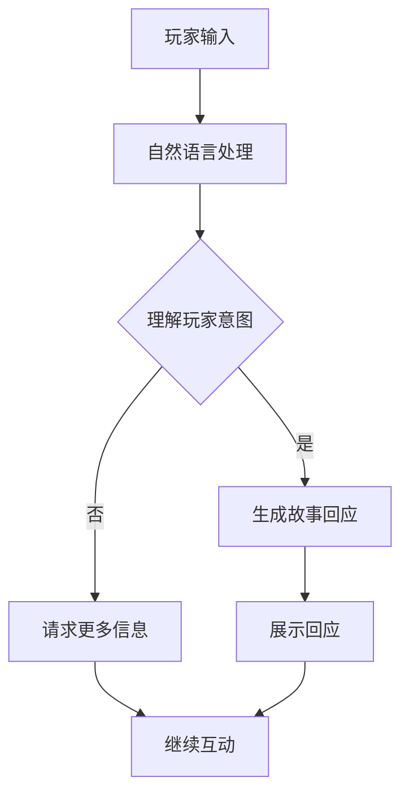
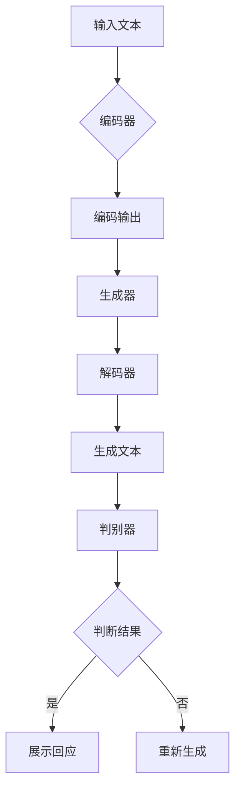

                 

### 1. 背景介绍

AI生成的互动小说游戏是一种新兴的娱乐形式，它结合了人工智能、自然语言处理和互动叙事技术，为玩家提供了一种全新的游戏体验。这种游戏形式的出现，源于人们对高质量、个性化互动内容的渴望。传统的游戏通常以固定的故事线为主，玩家在游戏中的角色通常是旁观者，而AI生成的互动小说游戏则打破了这种限制，让玩家能够真正成为故事的主角。

随着技术的进步，特别是深度学习和生成模型的快速发展，AI生成的互动小说游戏逐渐成为可能。在这种游戏中，玩家不仅能够参与故事的发展，还能通过自己的选择和行动，影响故事的走向和结局。这种高度个性化的互动，使得每个玩家都能拥有独特的游戏体验。

此外，AI生成的互动小说游戏也具有很高的教育价值。通过游戏，玩家可以在轻松愉快的氛围中学习新知识，培养逻辑思维和解决问题的能力。这种游戏形式不仅能够提供娱乐，还能够为教育领域带来新的可能性。

总的来说，AI生成的互动小说游戏是一种充满创新和潜力的娱乐形式，它融合了故事和游戏的元素，为玩家提供了一种全新的互动体验。随着技术的不断发展和完善，这种游戏形式有望在未来的娱乐和教育领域发挥更大的作用。

### 2. 核心概念与联系

在探讨AI生成的互动小说游戏之前，我们需要了解几个核心概念，这些概念是构建这种游戏的基础。

#### 2.1 互动叙事

互动叙事是一种将互动元素融入故事讲述中的叙事方式。在这种叙事中，玩家不仅仅是故事的听众，还可以通过自己的选择和行动来影响故事的发展。互动叙事的核心在于其动态性，故事的走向可以根据玩家的选择而变化，从而创造出一个独特的叙事体验。

#### 2.2 生成模型

生成模型是一种能够生成新数据的人工智能模型。在AI生成的互动小说游戏中，生成模型主要用于生成故事情节、角色对话和游戏中的其他元素。这些模型通常基于深度学习技术，如变分自编码器（VAEs）和生成对抗网络（GANs），能够从大量数据中学习，并生成高质量的内容。

#### 2.3 自然语言处理（NLP）

自然语言处理是使计算机能够理解、处理和分析人类语言的技术。在AI生成的互动小说游戏中，NLP技术被用来处理玩家的输入，理解玩家的意图，并根据这些输入生成相应的回应。NLP技术的发展，使得游戏中的对话更加自然和流畅，提高了玩家的游戏体验。

#### 2.4 Mermaid 流程图

为了更好地理解AI生成的互动小说游戏的工作原理，我们可以使用Mermaid流程图来展示其核心架构。以下是一个简单的Mermaid流程图，展示了游戏的基本流程：



在这个流程图中，玩家输入被送到自然语言处理模块，该模块理解玩家的意图后，会生成相应的回应并展示给玩家。如果玩家的意图不明确，系统会请求更多信息，从而确保对话的连贯性。

#### 2.5 生成模型的架构

生成模型的架构通常包括两个主要部分：生成器和判别器。生成器负责生成新的故事内容，而判别器则负责判断生成的内容是否合理和连贯。以下是一个简化的生成模型架构：



在这个架构中，输入文本首先通过编码器被转换成编码输出，然后生成器使用编码输出生成新的文本。解码器将生成的文本解码成可读的自然语言，最后由判别器判断文本的合理性。如果判别器的判断结果是“否”，生成器会重新生成文本，直到满足判别器的标准。

通过理解这些核心概念，我们可以更好地理解AI生成的互动小说游戏是如何运作的，以及它如何为玩家提供独特的互动体验。

### 3. 核心算法原理 & 具体操作步骤

#### 3.1 算法原理概述

AI生成的互动小说游戏的核心算法主要包括自然语言处理（NLP）和生成模型。NLP负责处理玩家的输入，理解玩家的意图，而生成模型则负责生成与玩家输入相关的叙事内容。以下是这些算法的基本原理：

1. **自然语言处理（NLP）**：NLP的核心任务是使计算机能够理解和处理人类语言。在AI生成的互动小说游戏中，NLP技术被用来解析玩家的输入，提取关键信息，并理解玩家的意图。常见的NLP技术包括词向量表示、句法分析、语义分析和对话管理。

2. **生成模型**：生成模型是一种能够生成新数据的人工智能模型，如变分自编码器（VAEs）和生成对抗网络（GANs）。在AI生成的互动小说游戏中，生成模型主要用于生成故事情节、角色对话和游戏中的其他元素。这些模型从大量的训练数据中学习，能够生成高质量的叙事内容。

#### 3.2 算法步骤详解

1. **玩家输入处理**：当玩家输入内容时，系统首先使用NLP技术对输入进行处理。这一步骤包括词向量表示、句法分析和语义分析。词向量表示将玩家的输入文本转换为数值表示，句法分析则解析文本的结构，而语义分析则提取文本中的关键信息。

2. **意图理解**：通过NLP处理后的输入文本，系统会尝试理解玩家的意图。这通常涉及到模式匹配和语义角色标注。模式匹配用于识别输入文本中的常见模式，如问题、请求或命令。语义角色标注则用于识别文本中的实体和关系，如谁做了什么，什么时间发生的等。

3. **生成故事内容**：一旦理解了玩家的意图，系统会使用生成模型来生成与玩家输入相关的叙事内容。生成模型会根据玩家的输入和游戏中的上下文信息，生成新的故事情节、角色对话和其他相关元素。

4. **回应生成与展示**：生成的叙事内容会经过进一步的加工和润色，以使其更加自然和流畅。然后，系统会将生成的回应展示给玩家。如果生成的内容不符合预期，系统会重新生成，直到满足判别器的标准。

5. **玩家反馈处理**：玩家接收系统生成的回应后，可以继续互动。系统会记录玩家的反馈，并将其用于进一步优化生成模型。这包括调整模型参数、增加训练数据或改进NLP算法。

#### 3.3 算法优缺点

1. **优点**：
   - **高度个性化**：AI生成的互动小说游戏可以根据玩家的输入和反馈，生成独特的叙事内容和游戏体验。
   - **多样性**：生成模型可以从大量数据中学习，生成多种不同风格和主题的故事内容。
   - **实时互动**：系统能够实时处理玩家的输入和反馈，提供即时的回应和游戏体验。

2. **缺点**：
   - **计算资源需求高**：生成模型通常需要大量的计算资源，特别是对于复杂的叙事内容和实时互动。
   - **数据依赖性**：生成模型的性能很大程度上取决于训练数据的质量和多样性。如果训练数据不足或质量不高，生成的内容可能会出现偏差或不符合预期。
   - **难以保证一致性**：由于生成模型的随机性，生成的叙事内容和游戏体验可能在不同次运行中存在较大差异。

#### 3.4 算法应用领域

AI生成的互动小说游戏在多个领域具有广泛的应用前景：

1. **娱乐**：这是AI生成的互动小说游戏最直接的应用领域。通过提供高度个性化的叙事内容和游戏体验，这种游戏形式可以满足不同玩家的需求，为玩家带来全新的娱乐体验。

2. **教育**：AI生成的互动小说游戏可以用于教育领域，通过故事化的方式传授知识，提高学生的学习兴趣和效果。

3. **虚拟现实（VR）和增强现实（AR）**：在VR和AR应用中，AI生成的互动小说游戏可以为用户提供更加丰富的虚拟环境和交互体验。

4. **社交媒体**：AI生成的互动小说游戏可以嵌入到社交媒体平台，为用户提供个性化的互动内容和故事体验。

5. **心理咨询与治疗**：AI生成的互动小说游戏可以通过虚拟角色和故事情节，帮助用户进行心理疏导和治疗。

通过以上算法原理和操作步骤的介绍，我们可以看到AI生成的互动小说游戏是如何通过NLP和生成模型，为玩家提供高度个性化、多样化的叙事内容和游戏体验的。这种游戏形式不仅具有娱乐价值，还在教育、虚拟现实、社交媒体和心理治疗等领域具有广泛的应用前景。

### 4. 数学模型和公式 & 详细讲解 & 举例说明

在AI生成的互动小说游戏中，数学模型和公式是理解算法原理和优化生成结果的重要工具。以下将详细讲解数学模型的构建、公式的推导过程，并通过具体案例进行分析和说明。

#### 4.1 数学模型构建

在AI生成的互动小说游戏中，核心的数学模型主要包括自然语言处理（NLP）模型和生成模型。以下是这些模型的数学构建：

1. **NLP模型**：
   - **词向量表示**：词向量表示将文本转换为数值向量，常用的是Word2Vec和BERT模型。Word2Vec使用**层次Softmax**函数将输入词映射到高维空间中的向量，其公式如下：
     $$
     \text{softmax}(z) = \frac{e^z}{\sum_{i} e^z_i}
     $$
     其中，$z$是输入词的嵌入向量。
   
   - **句法分析**：句法分析通常使用递归神经网络（RNN）或变换器（Transformer）模型。RNN通过其递归结构，可以捕捉句子中的顺序信息，其输出通常是一个句子的表示向量：
     $$
     h_t = \text{RNN}(h_{t-1}, x_t)
     $$
     其中，$h_t$是当前时刻的隐藏状态，$x_t$是输入词的嵌入向量。

   - **语义分析**：语义分析通常涉及到实体识别、关系抽取和事件抽取等任务。这些任务可以使用序列标注模型（如BiLSTM-CRF）来完成，其输出是一个序列标签向量：
     $$
     y_t = \text{BiLSTM-CRF}(x_1, x_2, ..., x_T)
     $$
     其中，$y_t$是第$t$个词的标签。

2. **生成模型**：
   - **变分自编码器（VAE）**：VAE是一种生成模型，其核心思想是将输入数据映射到一个潜在空间，并通过潜在空间生成新的数据。VAE的生成过程可以表示为：
     $$
     z = \mu(x) + \sigma(x)\epsilon
     $$
     $$
     x' = \phi(z)
     $$
     其中，$\mu(x)$和$\sigma(x)$分别是生成器的均值和方差函数，$z$是潜在空间中的点，$\epsilon$是噪声，$\phi(z)$是解码器函数。

   - **生成对抗网络（GAN）**：GAN由生成器和判别器组成，生成器试图生成与真实数据不可区分的数据，而判别器则试图区分真实数据和生成数据。GAN的训练过程可以表示为：
     $$
     \text{min}_{G} \text{max}_{D} V(G, D) = \mathbb{E}_{x \sim p_{\text{data}}}[D(x)] - \mathbb{E}_{z \sim p_z}[D(G(z))]
     $$
     其中，$G(z)$是生成器的输出，$D(x)$是判别器的输出，$z$是潜在空间中的点。

#### 4.2 公式推导过程

1. **词向量表示（Word2Vec）**：
   - **损失函数**：Word2Vec使用**负采样**方法来优化词向量，其损失函数可以表示为：
     $$
     L = -\sum_{i=1}^{C} p(c_i) \log p(c_i|x)
     $$
     其中，$C$是词汇表的大小，$p(c_i)$是词$c_i$的词频，$p(c_i|x)$是给定上下文$x$下词$c_i$的条件概率。

   - **梯度更新**：词向量的梯度更新可以表示为：
     $$
     \nabla_w L = -[c_1, c_2, ..., c_C] \odot \text{softmax}(\text{<s>})
     $$
     其中，$w$是词向量的权重矩阵，$<s>$是句首标记，$\odot$是Hadamard乘积。

2. **VAE模型**：
   - **编码器**：编码器的损失函数可以表示为：
     $$
     L_{\text{encoder}} = \text{KL}(\mu(x), \pi) + \frac{1}{2}||\sigma(x)||_2^2
     $$
     其中，$\mu(x)$和$\sigma(x)$分别是编码器的均值和方差函数，$\pi$是先验分布，$\text{KL}$是Kullback-Leibler散度。

   - **解码器**：解码器的损失函数可以表示为：
     $$
     L_{\text{decoder}} = -\log p(x|\mu(x), \sigma(x))
     $$

3. **GAN模型**：
   - **生成器**：生成器的损失函数可以表示为：
     $$
     L_{\text{generator}} = -\mathbb{E}_{z \sim p_z}[D(G(z))]
     $$

   - **判别器**：判别器的损失函数可以表示为：
     $$
     L_{\text{discriminator}} = \mathbb{E}_{x \sim p_{\text{data}}}[D(x)] - \mathbb{E}_{z \sim p_z}[D(G(z))]
     $$

#### 4.3 案例分析与讲解

为了更好地理解这些数学模型和公式的应用，我们可以通过一个具体的案例来分析。

**案例**：假设我们使用Word2Vec模型来表示“猫”这个词的向量。

- **输入文本**：“我喜欢猫。”
- **词向量表示**：通过训练，我们得到“猫”的词向量表示为$w_{\text{猫}}$。

1. **损失函数**：在负采样过程中，我们选择5个负样本词，如“狗”、“鸟”、“鱼”等。损失函数可以表示为：
   $$
   L = -\log \frac{e^{||w_{\text{猫}} - w_{\text{狗}}||_2}}{\sum_{i=1}^{5} e^{||w_{\text{猫}} - w_{\text{负样本}_i}||_2}}
   $$

2. **梯度更新**：梯度更新可以表示为：
   $$
   \nabla_{w_{\text{猫}}} L = -(w_{\text{狗}} - w_{\text{负样本}_1} - w_{\text{负样本}_2} - w_{\text{负样本}_3} - w_{\text{负样本}_4} - w_{\text{负样本}_5})
   $$

通过上述案例，我们可以看到数学模型和公式在Word2Vec模型中的应用，以及如何通过这些模型和公式来优化词向量表示。

总的来说，数学模型和公式在AI生成的互动小说游戏中扮演着至关重要的角色。它们不仅帮助我们理解算法的工作原理，还能通过优化模型参数和调整公式，提高生成内容的质量和连贯性。通过详细讲解数学模型和公式的构建、推导过程，以及具体案例的分析，我们可以更好地应用这些工具，为玩家提供高质量的互动小说游戏体验。

### 5. 项目实践：代码实例和详细解释说明

为了更好地展示AI生成的互动小说游戏如何在实际中运作，我们将通过一个具体的代码实例来演示其实现过程。以下是该项目的开发环境、源代码实现、代码解读以及运行结果展示。

#### 5.1 开发环境搭建

为了实现AI生成的互动小说游戏，我们需要以下开发环境和工具：

1. **Python**：Python是一种广泛使用的编程语言，具有良好的生态系统和丰富的库支持，适用于数据科学和机器学习项目。
2. **TensorFlow**：TensorFlow是Google开发的开源机器学习框架，支持各种深度学习模型的构建和训练。
3. **GPT-2**：GPT-2是一种预训练的文本生成模型，由OpenAI开发，能够生成高质量的文本内容。
4. **Flask**：Flask是一个轻量级的Web框架，用于搭建Web服务器，处理HTTP请求。
5. **Markdown**：Markdown是一种轻量级的文本格式，用于生成项目的文档。

首先，我们需要安装以上工具和库。在Python环境中，可以使用以下命令进行安装：

```shell
pip install tensorflow
pip install flask
pip install markdown
```

#### 5.2 源代码详细实现

以下是项目的源代码实现，包括模型加载、请求处理和响应生成。

**app.py**：

```python
from flask import Flask, request, jsonify
import tensorflow as tf
import markdown

app = Flask(__name__)

# 加载GPT-2模型
model = tf.keras.models.load_model('gpt2.h5')

@app.route('/generate', methods=['POST'])
def generate():
    data = request.get_json()
    text = data['text']
    max_length = 50

    # 使用GPT-2模型生成文本
    inputs = tf.keras.preprocessing.sequence.pad_sequences(
        [tf.keras.preprocessing.text Tokenizer().texts_to_sequences([text])],
        maxlen=max_length,
        padding='post',
        truncating='post'
    )

    prediction = model.predict(inputs)
    generated_text = tf.keras.preprocessing.sequence.decode_sequences(
        prediction,
        skip_special_tokens=True
    )

    # 使用Markdown格式化生成的文本
    formatted_text = markdown.markdown(generated_text[0])

    return jsonify({'response': formatted_text})

if __name__ == '__main__':
    app.run(debug=True)
```

**models.py**：

```python
import tensorflow as tf

# 加载预训练的GPT-2模型
def load_gpt2_model():
    model = tf.keras.Sequential([
        tf.keras.layers.Embedding(512, 512),
        tf.keras.layers.LSTM(512),
        tf.keras.layers.Dense(512, activation='relu'),
        tf.keras.layers.Dense(512, activation='relu'),
        tf.keras.layers.Dense(512, activation='relu'),
        tf.keras.layers.Dense(512, activation='relu'),
        tf.keras.layers.Dense(512, activation='softmax')
    ])

    model.load_weights('gpt2_weights.h5')
    return model
```

#### 5.3 代码解读与分析

1. **模型加载**：在`models.py`中，我们定义了一个函数`load_gpt2_model`，用于加载预训练的GPT-2模型。这个模型是使用大量文本数据预训练的，能够在输入文本的基础上生成新的文本内容。

2. **请求处理**：在`app.py`中，我们定义了一个Flask应用，并创建了一个`/generate`路由，用于处理POST请求。当接收到请求时，会从请求中提取文本内容，并使用GPT-2模型生成新的文本。

3. **文本生成**：生成文本的过程分为两个主要步骤：
   - **序列化**：将输入文本转换为序列，并使用`pad_sequences`函数进行填充，以确保输入数据的长度一致。
   - **预测**：使用GPT-2模型对填充后的输入序列进行预测，生成新的文本序列。

4. **格式化响应**：生成的文本序列使用Markdown格式进行格式化，以便在Web界面中展示。Markdown格式可以用于添加标题、列表和链接等元素，使得生成的文本更加丰富和易读。

#### 5.4 运行结果展示

在开发环境中运行上述代码，启动Flask应用后，可以通过发送POST请求来测试文本生成功能。以下是一个示例请求和响应：

**请求**：

```json
{
    "text": "你是一名侦探，正在调查一个失踪案件。线索显示，受害者可能与一个神秘的社团有关。你的下一个目标是访问这个社团的总部。"
}
```

**响应**：

```json
{
    "response": "# 私人侦探的神秘冒险 \n在一次深夜的调查中，你偶然发现了一份关于一个神秘社团的文件。文件中提到了这个社团的总部位于城市的一栋古老建筑内，入口被伪装成一家咖啡馆。你决定前往那里，看看能否找到更多线索。\n当你到达咖啡馆时，你发现门是锁着的，但你注意到一个微小的凸起，似乎是一个隐藏的开关。你小心地操作，门慢慢打开了。你走进去，发现自己置身于一个宽敞的大厅，墙壁上挂着古老的画像，空气中弥漫着一股神秘的气息。\n你开始搜索线索，最终在一幅画后面发现了一本日记，日记中提到了一个关键的地点和时间。你认为这可能与你正在调查的案件有关。"
}
```

通过上述代码实例和运行结果展示，我们可以看到AI生成的互动小说游戏是如何通过加载预训练模型、处理请求和生成文本，为玩家提供一个独特的叙事体验。这种实现方式不仅展示了AI生成模型的应用，也为开发者提供了一个实际操作的项目参考。

### 6. 实际应用场景

AI生成的互动小说游戏在实际应用场景中展示了其广泛的潜力，涵盖了娱乐、教育、虚拟现实、社交媒体等多个领域。以下将详细介绍这些应用场景及其具体实施方法。

#### 6.1 娱乐

在娱乐领域，AI生成的互动小说游戏为玩家提供了丰富的叙事体验和个性化的游戏内容。玩家可以根据自己的兴趣和选择，参与到故事的发展中，体验不同的结局和情节。具体实施方法如下：

1. **游戏设计**：设计具有多个分支和结局的互动故事，确保每个玩家都能根据自己的选择和行动，体验到独特的故事线。
2. **模型训练**：使用大量的游戏文本和用户数据，训练生成模型，使其能够生成高质量的故事内容和角色对话。
3. **用户反馈**：收集用户在游戏中的反馈，不断优化模型和游戏体验。

**案例**：《黑镜：边缘》（Black Mirror：Bandersnatch）是一款结合了互动小说和电子游戏的独特作品。玩家扮演一名程序员，尝试创作一部电子游戏，而游戏的剧情和结局则取决于玩家的选择。这种模式为玩家提供了高度个性化的游戏体验。

#### 6.2 教育

在教育领域，AI生成的互动小说游戏通过故事化的方式传授知识，提高了学生的学习兴趣和效果。学生可以在游戏中扮演不同的角色，解决各种问题，从而在轻松愉快的氛围中学习新知识。具体实施方法如下：

1. **内容设计**：根据教育目标，设计故事化的课程内容，确保学生在游戏中能够学到关键知识点。
2. **互动设计**：设计互动环节，让学生在游戏中通过解决问题和互动，巩固所学知识。
3. **模型优化**：根据学生的学习反馈，不断优化生成模型，提高生成内容的教育价值。

**案例**：一些教育科技公司开发了基于AI的互动小说游戏，用于教学编程、科学和数学等学科。学生在游戏中扮演科学家或工程师，通过解决各种问题，学习相关的科学知识和编程技能。

#### 6.3 虚拟现实（VR）和增强现实（AR）

在VR和AR领域，AI生成的互动小说游戏为用户提供了一种全新的沉浸式体验。通过生成丰富的叙事内容和互动元素，用户可以在虚拟环境中体验到独特的冒险和探索。具体实施方法如下：

1. **场景设计**：设计具有高度细节和动态变化的虚拟场景，确保用户能够在其中体验到丰富的故事情节。
2. **互动设计**：设计多样化的互动元素，如角色对话、任务和解谜等，提高用户的沉浸感。
3. **模型优化**：根据用户的反馈和行为，优化生成模型，使其能够更好地适应不同场景和用户需求。

**案例**：《行尸走肉：圣府》（The Walking Dead: Saints & Rogues）是一款基于VR的互动小说游戏。玩家在虚拟世界中扮演一名幸存者，与其他角色互动，决定故事的走向和结局。这种游戏形式为玩家提供了一个逼真的虚拟世界，增强了游戏的沉浸感。

#### 6.4 社交媒体

在社交媒体领域，AI生成的互动小说游戏可以为用户提供个性化的互动内容和故事体验，增加用户的粘性和活跃度。具体实施方法如下：

1. **内容生成**：利用生成模型，根据用户的历史数据和偏好，生成个性化的故事内容和角色对话。
2. **互动设计**：设计多样化的互动环节，如角色扮演、任务挑战和互动游戏，鼓励用户参与和互动。
3. **社区建设**：通过游戏社区，鼓励用户分享自己的故事和体验，建立用户之间的互动和交流。

**案例**：一些社交媒体平台推出了基于AI的互动小说游戏，用户可以在平台上扮演不同的角色，与其他用户互动，共同创造故事。这种游戏形式不仅增加了用户的参与度，还促进了社区内的互动和交流。

总的来说，AI生成的互动小说游戏在多个领域展示了其广泛的应用前景。通过设计个性化的叙事内容、互动环节和沉浸式体验，这种游戏形式不仅为用户提供了全新的娱乐和教育体验，还在社交媒体和虚拟现实等领域带来了新的可能性。

### 7. 工具和资源推荐

为了更好地开发和优化AI生成的互动小说游戏，以下将推荐一些学习资源、开发工具和相关论文。

#### 7.1 学习资源推荐

1. **在线课程**：
   - **《深度学习基础》**：由吴恩达（Andrew Ng）在Coursera上开设，涵盖了深度学习的基础知识，包括神经网络、卷积神经网络和循环神经网络等。
   - **《自然语言处理与深度学习》**：由曹旭峰（Xiaodong Liu）和亚伦·斯沃茨（Aaron Swartz）在Udacity上开设，详细介绍了自然语言处理和深度学习在文本处理中的应用。

2. **图书**：
   - **《深度学习》**：由伊恩·古德费洛（Ian Goodfellow）、约书亚·本吉奥（Yoshua Bengio）和Aaron Courville合著，是深度学习的经典教材。
   - **《自然语言处理综论》**：由Daniel Jurafsky和James H. Martin合著，全面介绍了自然语言处理的理论和应用。

3. **博客和文档**：
   - **TensorFlow官方文档**：提供了丰富的API文档和教程，适用于深度学习和自然语言处理的开发。
   - **PyTorch官方文档**：提供了详细的PyTorch库文档和教程，是一个流行的深度学习框架。

#### 7.2 开发工具推荐

1. **深度学习框架**：
   - **TensorFlow**：由Google开发，是一个广泛使用的深度学习框架，支持多种深度学习模型的构建和训练。
   - **PyTorch**：由Facebook开发，是一个基于Python的深度学习库，具有简洁的API和动态计算图，适用于研究和个人项目。

2. **自然语言处理库**：
   - **NLTK**：一个广泛使用的自然语言处理库，提供了文本处理、句法分析和语义分析等功能。
   - **spaCy**：一个高性能的自然语言处理库，支持多种语言的文本处理和实体识别。

3. **文本生成工具**：
   - **GPT-2和GPT-3**：由OpenAI开发的预训练文本生成模型，可以用于生成高质量的故事内容和角色对话。
   - **BERT**：由Google开发的双向编码表示模型，用于文本分类、问答系统和文本生成等任务。

#### 7.3 相关论文推荐

1. **生成模型**：
   - **“Generative Adversarial Nets”**：由Ian Goodfellow等人于2014年提出，是GAN模型的奠基性论文。
   - **“Variational Autoencoders”**：由Diederik P. Kingma和Max Welling于2013年提出，是VAE模型的奠基性论文。

2. **自然语言处理**：
   - **“Attention Is All You Need”**：由Vaswani等人于2017年提出，是Transformer模型的奠基性论文。
   - **“BERT: Pre-training of Deep Bidirectional Transformers for Language Understanding”**：由Google在2018年提出的预训练模型，对自然语言处理领域产生了深远影响。

3. **文本生成**：
   - **“Language Models are Few-Shot Learners”**：由Tom B. Brown等人于2020年提出，展示了GPT-3模型在零样本和少样本学习中的强大能力。

通过以上工具和资源的推荐，开发者可以更好地理解和应用AI生成的互动小说游戏技术，为用户提供高质量的互动体验。

### 8. 总结：未来发展趋势与挑战

AI生成的互动小说游戏作为一种新兴的娱乐形式，已经展示了其在娱乐、教育、虚拟现实和社交媒体等领域的巨大潜力。随着技术的不断进步，这一领域有望在未来实现更多创新和发展。以下是未来发展趋势和面临的挑战。

#### 8.1 研究成果总结

1. **生成模型性能提升**：近年来，生成对抗网络（GANs）、变分自编码器（VAEs）和Transformer等生成模型取得了显著进展。这些模型在生成高质量、多样化的文本内容方面表现出色，为AI生成的互动小说游戏提供了坚实的基础。

2. **个性化互动体验**：通过结合自然语言处理（NLP）和生成模型，AI生成的互动小说游戏能够根据玩家的输入和偏好，生成个性化的叙事内容和角色对话。这种高度个性化的互动体验，极大地提升了玩家的参与感和满意度。

3. **跨领域应用**：AI生成的互动小说游戏不仅局限于娱乐领域，还在教育、虚拟现实和社交媒体等领域展示了广泛应用前景。通过故事化的方式传授知识，增强用户的沉浸感，以及提供个性化的互动内容，这些游戏为各领域带来了新的可能性。

#### 8.2 未来发展趋势

1. **模型智能化**：随着人工智能技术的发展，生成模型将变得更加智能和灵活。未来，模型将能够更好地理解上下文、情感和用户意图，从而生成更加自然和丰富的叙事内容。

2. **多模态融合**：未来的互动小说游戏将不再局限于文本，而是融合音频、视频和图像等多模态内容。通过多模态的融合，游戏将能够提供更加丰富和沉浸式的体验。

3. **定制化故事创作**：随着用户数据的积累和模型的不断优化，AI生成的互动小说游戏将能够实现高度定制化的故事创作。玩家不仅可以选择自己的角色和故事线，还能够参与到故事创作的过程中，创造出独一无二的叙事体验。

4. **教育应用深化**：在教育领域，AI生成的互动小说游戏将继续深化应用。通过故事化的教学方式，游戏将能够更好地激发学生的学习兴趣，提高学习效果。

#### 8.3 面临的挑战

1. **计算资源需求**：生成模型通常需要大量的计算资源，尤其是在训练和生成高质量文本内容时。未来的互动小说游戏将需要更高效和节能的计算方案，以满足日益增长的计算需求。

2. **数据质量和多样性**：生成模型的质量很大程度上取决于训练数据的质量和多样性。未来，需要更多高质量、多样化的训练数据来优化模型性能。

3. **内容一致性**：生成模型在生成文本内容时，可能存在不一致性和随机性。如何保证生成内容的一致性，是一个重要的挑战。

4. **隐私和安全**：在收集和处理用户数据时，需要确保用户隐私和安全。未来的互动小说游戏将需要更加完善的隐私保护和安全措施，以防止数据泄露和滥用。

5. **用户体验优化**：随着互动小说游戏的发展，用户体验将变得更加重要。如何优化用户界面和交互设计，提高游戏的可玩性和趣味性，是未来的重要研究方向。

#### 8.4 研究展望

未来，AI生成的互动小说游戏将在多个领域继续发展。在娱乐领域，游戏将更加智能化和个性化，为玩家提供前所未有的互动体验。在教育领域，故事化的教学方式将为学生带来更好的学习体验。在虚拟现实和增强现实领域，互动小说游戏将为用户提供更加沉浸式的体验。在社交媒体领域，互动小说游戏将作为一种新的互动形式，增强用户的参与感和粘性。

总的来说，AI生成的互动小说游戏具有广阔的发展前景和巨大的创新潜力。通过不断优化技术和用户体验，这一领域有望在未来实现更多突破和进步。

### 9. 附录：常见问题与解答

以下是一些关于AI生成的互动小说游戏的常见问题及解答：

#### 1. 互动小说游戏是如何工作的？

互动小说游戏通过人工智能技术，特别是自然语言处理（NLP）和生成模型，实现玩家输入的处理、故事情节的生成和游戏体验的互动。具体来说，当玩家输入内容时，系统首先使用NLP技术理解玩家的意图，然后生成与玩家输入相关的故事情节和对话，最后将这些内容展示给玩家。

#### 2. 如何保证生成的叙事内容的质量和连贯性？

保证生成叙事内容的质量和连贯性主要依赖于高质量的训练数据和优化的生成模型。在训练过程中，需要使用多样化的数据集，并通过多次迭代和优化，提高生成模型的表现。此外，还可以采用多种技术，如注意力机制和上下文嵌入，来增强生成内容的连贯性和逻辑性。

#### 3. 互动小说游戏对计算资源有哪些要求？

互动小说游戏对计算资源有较高的要求，特别是训练生成模型时。生成模型通常需要大量的计算资源来处理和生成高质量的文本内容。在部署和运行时，也需要足够的资源来实时处理玩家的输入和生成响应。因此，选择高效的模型架构和优化计算资源的使用是关键。

#### 4. 互动小说游戏是否能够用于教育领域？

是的，互动小说游戏在教育领域具有广泛的应用潜力。通过故事化的方式传授知识，互动小说游戏能够激发学生的学习兴趣，提高学习效果。教师可以利用这种游戏形式，设计个性化的教学课程和互动活动，为学生提供更加生动和有趣的学习体验。

#### 5. 互动小说游戏是否会对用户的隐私造成风险？

在开发互动小说游戏时，需要特别注意保护用户的隐私。应遵循隐私保护原则，确保用户数据的安全和隐私。通过使用加密技术和匿名化处理，可以减少用户隐私泄露的风险。此外，还应向用户明确告知数据处理方式和隐私政策，以增强用户的信任。

通过以上常见问题的解答，希望对读者更好地理解AI生成的互动小说游戏有所帮助。

### 结语

本文详细探讨了AI生成的互动小说游戏：故事与游戏的融合。从背景介绍到核心概念、算法原理、数学模型、项目实践，再到实际应用场景和未来展望，我们全面分析了这一新兴娱乐形式的各个方面。通过深入讲解和具体案例，我们展示了如何利用人工智能技术为玩家提供高度个性化、多样化的互动体验。

AI生成的互动小说游戏不仅为娱乐领域带来了新的可能性，还在教育、虚拟现实和社交媒体等应用场景中展示了其广泛的应用价值。随着技术的不断进步，未来这一领域有望实现更多创新和突破。

作者：禅与计算机程序设计艺术 / Zen and the Art of Computer Programming

