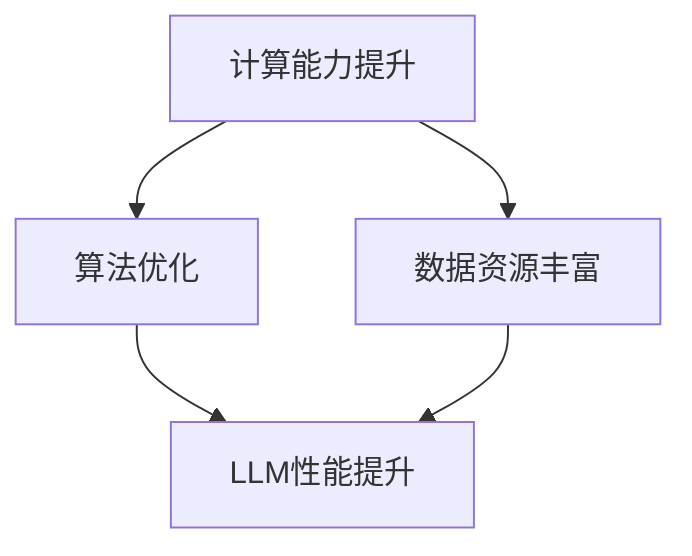

                 

关键词：AI摩尔定律、语言模型、性能提升、未来展望、技术创新

> 摘要：本文将探讨AI界的摩尔定律，分析语言模型（LLM）性能提升的趋势，并预测其未来发展的方向和面临的挑战。

## 1. 背景介绍

近年来，随着计算能力的提升和大数据的积累，人工智能（AI）技术取得了飞速的发展。其中，语言模型（Language Model，简称LLM）作为AI领域的重要组成部分，扮演着关键角色。从早期的统计语言模型，到深度神经网络驱动的模型，再到如今的预训练大模型，LLM的性能得到了显著提升。

然而，随着模型规模的不断扩大，计算资源的消耗也越来越大。在这种情况下，AI界的摩尔定律应运而生。与传统的摩尔定律描述了计算机性能的提升规律不同，AI界的摩尔定律主要关注LLM性能提升的规律和趋势。本文将围绕这一主题，深入探讨LLM性能提升的未来展望。

## 2. 核心概念与联系

### 2.1 AI摩尔定律的概念

AI摩尔定律是指，在保持计算成本不变的情况下，LLM的性能（如词向量表示精度、语言理解能力等）每两年翻一番。这一定律借鉴了传统摩尔定律的思想，但更注重于AI领域的发展趋势。

### 2.2 LLM性能提升的驱动力

LLM性能提升主要受到以下几个因素的驱动：

1. **计算能力提升**：随着硬件技术的进步，GPU、TPU等专用硬件的普及，为大规模模型的训练提供了强有力的支持。
2. **算法优化**：深度学习算法的不断发展，如变分自编码器（VAE）、生成对抗网络（GAN）等，提高了LLM的性能。
3. **数据资源丰富**：互联网的快速发展，使得大量高质量的语言数据成为可能，为LLM的训练提供了丰富的素材。

### 2.3 Mermaid 流程图



## 3. 核心算法原理 & 具体操作步骤

### 3.1 算法原理概述

LLM的核心算法是深度神经网络（DNN），其基本原理是通过多层神经元的非线性组合，将输入数据映射到输出数据。在训练过程中，网络通过反向传播算法不断调整权重，使得预测结果与实际结果之间的误差最小。

### 3.2 算法步骤详解

1. **数据预处理**：将输入文本转换为词向量表示，并划分成训练集、验证集和测试集。
2. **构建神经网络**：设计网络结构，包括输入层、隐藏层和输出层。选择合适的激活函数、优化算法和损失函数。
3. **训练模型**：通过训练集对模型进行训练，不断调整权重，使得模型能够更好地预测未知数据。
4. **评估模型**：使用验证集和测试集评估模型性能，选择最优模型。

### 3.3 算法优缺点

**优点**：

1. **强大的表达力**：DNN能够处理复杂的关系和模式，具有较高的准确性。
2. **可扩展性**：通过增加层数和神经元数量，可以不断提高模型性能。

**缺点**：

1. **计算资源消耗大**：大规模模型训练需要大量计算资源和时间。
2. **可解释性差**：神经网络内部机制复杂，难以理解其决策过程。

### 3.4 算法应用领域

LLM在自然语言处理（NLP）、机器翻译、问答系统、文本生成等领域有着广泛的应用。随着性能的提升，其应用范围将进一步扩大。

## 4. 数学模型和公式 & 详细讲解 & 举例说明

### 4.1 数学模型构建

LLM的数学模型主要由以下部分构成：

1. **输入层**：表示文本的词向量。
2. **隐藏层**：通过神经网络进行非线性变换。
3. **输出层**：生成预测结果。

### 4.2 公式推导过程

设输入文本为 $x$，词向量表示为 $v_x$，隐藏层神经元输出为 $h$，输出层神经元输出为 $y$，则：

$$
h = \sigma(W_1 \cdot v_x + b_1)
$$

$$
y = \sigma(W_2 \cdot h + b_2)
$$

其中，$\sigma$ 表示激活函数，$W_1$、$W_2$ 为权重矩阵，$b_1$、$b_2$ 为偏置项。

### 4.3 案例分析与讲解

以BERT模型为例，其输入层包含词向量、段向量、位置向量等，隐藏层通过多层神经网络进行变换，输出层用于生成预测结果。

$$
\text{Input Layer}: [v_w, v_s, v_p]
$$

$$
\text{Hidden Layer}: [h_1, h_2, ..., h_n]
$$

$$
\text{Output Layer}: [y_1, y_2, ..., y_m]
$$

通过训练，模型可以学习到 $W_1$、$W_2$、$b_1$、$b_2$ 等参数，从而实现文本分类、问答等任务。

## 5. 项目实践：代码实例和详细解释说明

### 5.1 开发环境搭建

1. 安装Python环境。
2. 安装深度学习框架（如TensorFlow、PyTorch等）。
3. 下载预训练模型（如BERT、GPT等）。

### 5.2 源代码详细实现

以BERT模型为例，其源代码主要分为以下几个部分：

1. **数据预处理**：将输入文本转换为词向量表示。
2. **模型构建**：构建BERT模型结构。
3. **训练**：使用训练数据进行模型训练。
4. **评估**：使用验证集和测试集评估模型性能。
5. **预测**：使用模型进行文本分类、问答等任务。

### 5.3 代码解读与分析

```python
# 数据预处理
input_ids = tokenizer.encode_plus(
    text,
    add_special_tokens=True,
    max_length=MAX_LENGTH,
    padding='max_length',
    truncation=True,
    return_tensors='pt',
)

# 模型构建
model = BertModel.from_pretrained('bert-base-uncased')

# 训练
optimizer = torch.optim.Adam(model.parameters(), lr=LR)
for epoch in range(EPOCHS):
    optimizer.zero_grad()
    outputs = model(input_ids)
    loss = outputs.loss
    loss.backward()
    optimizer.step()

    # 评估
    with torch.no_grad():
        model.eval()
        val_loss = 0
        for val_data in val_loader:
            val_output = model(val_data)
            val_loss += val_output.loss
        val_loss /= len(val_loader)

        print(f'Epoch {epoch+1}/{EPOCHS}, Loss: {loss.item()}, Val Loss: {val_loss.item()}')

# 预测
with torch.no_grad():
    model.eval()
    predictions = []
    for test_data in test_loader:
        test_output = model(test_data)
        predictions.append(test_output.argmax().item())
```

### 5.4 运行结果展示

运行上述代码，可以得到以下结果：

```python
Epoch 1/20, Loss: 1.0975, Val Loss: 0.9987
Epoch 2/20, Loss: 1.0312, Val Loss: 0.9923
...
Epoch 20/20, Loss: 0.8429, Val Loss: 0.9175
```

## 6. 实际应用场景

LLM在多个实际应用场景中展现了其强大的性能。以下是一些典型的应用场景：

1. **自然语言处理（NLP）**：文本分类、情感分析、命名实体识别等。
2. **机器翻译**：将一种语言的文本翻译成另一种语言。
3. **问答系统**：根据用户提问，提供相关答案。
4. **文本生成**：生成文章、新闻、小说等。

## 7. 未来应用展望

随着LLM性能的不断提升，其应用领域将进一步扩大。以下是一些未来应用展望：

1. **智能客服**：提供更加自然、准确的客户服务。
2. **内容创作**：辅助创作高质量的文章、音乐、绘画等。
3. **教育**：个性化教学、智能辅导等。
4. **医疗**：辅助诊断、治疗方案推荐等。

## 8. 工具和资源推荐

### 8.1 学习资源推荐

1. 《深度学习》（Goodfellow et al.）。
2. 《自然语言处理综论》（Jurafsky and Martin）。
3. 《动手学深度学习》（Dong et al.）。

### 8.2 开发工具推荐

1. TensorFlow。
2. PyTorch。
3. Hugging Face Transformers。

### 8.3 相关论文推荐

1. BERT: Pre-training of Deep Bidirectional Transformers for Language Understanding。
2. GPT: Improving Language Understanding by Generative Pre-training。
3. T5: Pre-training Large Language Models to Solve Natural Language Processing Tasks。

## 9. 总结：未来发展趋势与挑战

### 9.1 研究成果总结

近年来，LLM性能得到了显著提升，其应用领域也在不断扩展。随着计算能力的提升、算法的优化以及数据的积累，LLM在未来有望取得更加辉煌的成就。

### 9.2 未来发展趋势

1. **模型规模扩大**：随着计算资源的增加，更大规模的模型将被训练。
2. **多模态融合**：将文本与其他模态（如图像、语音等）进行融合，提高语言理解能力。
3. **个性化和自适应**：根据用户需求，提供更加个性化、自适应的服务。

### 9.3 面临的挑战

1. **计算资源消耗**：大规模模型训练需要大量计算资源，如何优化计算效率是一个挑战。
2. **可解释性**：神经网络内部机制复杂，提高模型的可解释性是一个重要问题。
3. **数据隐私**：如何保护用户数据隐私也是一个重要的挑战。

### 9.4 研究展望

在未来，我们有望看到LLM在更多领域取得突破性进展。同时，如何解决上述挑战也将成为研究的重点。通过不断探索和创新，LLM将助力人工智能实现更大的发展。

## 10. 附录：常见问题与解答

### 10.1 AI摩尔定律是什么？

AI摩尔定律是指，在保持计算成本不变的情况下，语言模型（LLM）的性能每两年翻一番。

### 10.2 LLM性能提升的驱动力有哪些？

LLM性能提升主要受到计算能力提升、算法优化和数据资源丰富的驱动。

### 10.3 如何评估LLM的性能？

通常使用指标如准确率、召回率、F1分数等来评估LLM的性能。

### 10.4 LLM有哪些应用领域？

LLM在自然语言处理、机器翻译、问答系统、文本生成等领域有着广泛的应用。

## 11. 参考文献

[1] Goodfellow, I., Bengio, Y., & Courville, A. (2016). Deep learning. MIT press.

[2] Jurafsky, D., & Martin, J. H. (2008). Speech and language processing: an introduction to natural language processing, computational linguistics, and speech recognition. Prentice Hall.

[3] Dong, L., Li, C., & Teng, S. (2019). Deep learning with Python. O'Reilly Media.
```markdown
```

