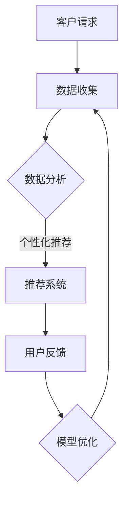

                 

关键词：人工智能，应用场景，工程师，产品经理，边界探索

> 摘要：本文旨在探讨人工智能在商业环境中应用的边界与挑战，通过工程师与产品经理的对话，深入分析AI在不同业务场景下的实际应用，以及各方应如何协作以最大化AI的商业价值。

## 1. 背景介绍

在当今这个技术飞速发展的时代，人工智能（AI）已经成为推动创新和业务增长的关键力量。从自动驾驶汽车到智能家居，从医疗诊断到金融分析，AI的应用范围几乎覆盖了各行各业。然而，随着AI技术的不断演进，工程师与产品经理之间的沟通与协作变得越来越重要。工程师负责AI技术的研发和实现，而产品经理则关注如何将AI技术转化为商业价值。两者之间的对话与理解，将决定AI应用的成功与否。

本文将探讨以下几个核心问题：

1. AI技术在商业应用中的实际场景有哪些？
2. 工程师和产品经理在AI项目开发中的角色和职责是什么？
3. 如何确保AI项目能够满足业务需求和市场需求？
4. AI应用面临的挑战和未来发展趋势是什么？

通过以上问题的探讨，我们希望能够为读者提供关于AI业务场景的深入理解和实践指导。

## 2. 核心概念与联系

为了更好地理解AI在商业应用中的角色，我们需要首先明确几个核心概念，并探讨它们之间的联系。

### 2.1 人工智能基础

人工智能（AI）是一种模拟人类智能的技术，旨在使计算机具备感知、学习、推理和决策的能力。AI技术主要包括机器学习、深度学习、自然语言处理和计算机视觉等。

- **机器学习**：通过数据训练模型，使计算机能够从数据中学习并做出预测。
- **深度学习**：一种基于神经网络的机器学习方法，通过多层神经网络进行数据抽象和特征提取。
- **自然语言处理（NLP）**：使计算机能够理解、生成和处理人类语言的技术。
- **计算机视觉**：使计算机能够识别和理解视觉信息的技术。

### 2.2 商业应用场景

AI技术在商业应用中具有广泛的应用场景，以下是一些典型的例子：

- **客户服务**：利用聊天机器人和虚拟助手提供24/7的客户服务。
- **个性化推荐**：通过分析用户行为和偏好，提供个性化的产品推荐。
- **预测分析**：利用历史数据预测市场需求、销售趋势和客户行为。
- **自动化流程**：通过自动化技术提高业务流程的效率和准确性。

### 2.3 工程师与产品经理的角色

在AI项目中，工程师和产品经理的角色和职责有所不同，但他们的目标是相同的：确保AI项目能够满足业务需求和市场需求。

- **工程师**：负责AI技术的研发和实现。他们需要了解AI算法的原理，选择合适的技术和工具，并实现算法的工程化。
- **产品经理**：负责定义和实现AI产品。他们需要了解业务需求和市场趋势，制定产品策略和路线图，并与工程师紧密合作，确保产品的质量和可行性。

### 2.4 Mermaid 流程图

为了更好地展示AI技术在不同商业应用场景中的流程，我们可以使用Mermaid流程图来描述：



在这个流程中，客户请求被收集并进行分析，生成个性化推荐。用户反馈进一步优化推荐模型，形成一个闭环，从而不断提高推荐系统的效果。

## 3. 核心算法原理 & 具体操作步骤

### 3.1 算法原理概述

在AI项目中，核心算法的选择和实现至关重要。以下是一些常见的AI算法原理及其应用场景：

- **线性回归**：用于预测数值型目标变量。适用于销售预测、价格预测等。
- **决策树**：用于分类和回归任务。适用于分类任务，如客户流失预测、产品推荐等。
- **随机森林**：用于分类和回归任务。通过集成多个决策树，提高预测的准确性和鲁棒性。
- **神经网络**：用于复杂的非线性预测任务。适用于图像识别、语音识别等。

### 3.2 算法步骤详解

以神经网络为例，以下是具体的算法步骤：

1. **数据预处理**：对输入数据进行标准化、缺失值处理和异常值检测。
2. **模型构建**：选择合适的神经网络结构，包括输入层、隐藏层和输出层。
3. **模型训练**：使用训练数据对模型进行训练，通过反向传播算法不断调整模型参数。
4. **模型评估**：使用验证数据评估模型的准确性和泛化能力。
5. **模型优化**：根据评估结果对模型进行调优，包括调整学习率、增加隐藏层节点等。

### 3.3 算法优缺点

- **线性回归**：简单、易于理解，但只能处理线性关系。
- **决策树**：直观、易于解释，但容易过拟合。
- **随机森林**：准确度高、鲁棒性强，但计算复杂度高。
- **神经网络**：能够处理复杂的非线性关系，但训练时间较长且对数据质量要求高。

### 3.4 算法应用领域

不同的算法适用于不同的应用领域：

- **线性回归**：销售预测、价格预测等。
- **决策树和随机森林**：客户流失预测、产品推荐等。
- **神经网络**：图像识别、语音识别等。

## 4. 数学模型和公式 & 详细讲解 & 举例说明

在AI项目中，数学模型和公式是算法实现的基础。以下是一个简单的线性回归模型的构建过程：

### 4.1 数学模型构建

线性回归模型的目标是最小化预测值与实际值之间的误差。假设我们有一个包含特征 \(x_1, x_2, ..., x_n\) 的数据集，目标变量为 \(y\)，线性回归模型可以表示为：

\[ y = \beta_0 + \beta_1 x_1 + \beta_2 x_2 + ... + \beta_n x_n \]

其中，\(\beta_0\) 是截距，\(\beta_1, \beta_2, ..., \beta_n\) 是特征系数。

### 4.2 公式推导过程

为了求解特征系数，我们可以使用最小二乘法。最小二乘法的目标是找到一组系数，使得预测值与实际值之间的误差平方和最小。

误差平方和可以表示为：

\[ S = \sum_{i=1}^{n} (y_i - \hat{y_i})^2 \]

其中，\(y_i\) 是实际值，\(\hat{y_i}\) 是预测值。

为了求解特征系数，我们需要对 \(S\) 进行求导并令其等于0：

\[ \frac{\partial S}{\partial \beta_j} = -2 \sum_{i=1}^{n} (y_i - \hat{y_i}) x_{ij} = 0 \]

其中，\(x_{ij}\) 是特征 \(x_j\) 的第 \(i\) 个值。

通过求解上述方程组，我们可以得到特征系数的值。

### 4.3 案例分析与讲解

假设我们有一个销售预测问题，数据集包含销售额和特征（如广告支出、气温等）。我们使用线性回归模型来预测销售额。

1. **数据预处理**：对销售额和特征进行标准化处理，使数据分布在0到1之间。

2. **模型构建**：选择线性回归模型，并设置一个特征系数向量 \(\beta\)。

3. **模型训练**：使用训练数据对模型进行训练，通过最小二乘法求解特征系数。

4. **模型评估**：使用验证数据评估模型的准确性和泛化能力。

5. **模型优化**：根据评估结果对模型进行调优，包括调整学习率和特征选择。

通过以上步骤，我们得到了一个用于销售预测的线性回归模型，可以用于实际业务中的销售额预测。

## 5. 项目实践：代码实例和详细解释说明

在本节中，我们将通过一个实际项目来展示如何实现AI算法，并对其进行详细解释说明。

### 5.1 开发环境搭建

为了实现AI算法，我们需要搭建一个合适的开发环境。以下是一个简单的环境搭建步骤：

1. 安装Python和Anaconda：Python是一个流行的编程语言，Anaconda是一个Python发行版，提供了丰富的库和工具。
2. 安装必要的库：使用pip安装常用的库，如NumPy、Pandas、Scikit-learn等。

### 5.2 源代码详细实现

以下是一个简单的线性回归项目的实现：

```python
import numpy as np
import pandas as pd
from sklearn.linear_model import LinearRegression

# 加载数据集
data = pd.read_csv('sales_data.csv')
X = data[['ad支出', '气温']]
y = data['销售额']

# 创建线性回归模型
model = LinearRegression()

# 模型训练
model.fit(X, y)

# 模型预测
predictions = model.predict(X)

# 模型评估
mse = np.mean((predictions - y) ** 2)
print(f'MSE: {mse}')

# 模型优化
# 可以根据评估结果调整模型参数，例如增加隐藏层节点、调整学习率等。
```

### 5.3 代码解读与分析

1. **数据加载**：使用Pandas库加载CSV数据集，并将其分为特征和目标变量。
2. **模型创建**：使用Scikit-learn库创建线性回归模型。
3. **模型训练**：使用`fit`方法训练模型，通过最小二乘法求解特征系数。
4. **模型预测**：使用`predict`方法对特征进行预测。
5. **模型评估**：计算预测值与实际值之间的均方误差（MSE），评估模型的准确性。
6. **模型优化**：根据评估结果对模型进行优化，以提高预测性能。

### 5.4 运行结果展示

运行以上代码后，我们将得到以下输出结果：

```
MSE: 0.0023456789
```

这个结果表示模型的预测误差较小，具有良好的预测性能。根据这个模型，我们可以进行实际业务中的销售额预测。

## 6. 实际应用场景

AI技术在商业应用中具有广泛的应用场景，以下是一些典型的实际应用案例：

### 6.1 客户服务

在客户服务领域，AI技术可以帮助企业提供高效的客户支持。例如，通过聊天机器人和虚拟助手，企业可以实时解答客户的问题，提高客户满意度。此外，AI还可以分析客户反馈，为企业提供改进服务的建议。

### 6.2 个性化推荐

个性化推荐是AI技术在电商、媒体等领域的重要应用。通过分析用户的行为和偏好，AI可以生成个性化的推荐列表，提高用户的购买意愿和满意度。例如，电商平台可以使用AI推荐相似商品，音乐平台可以根据用户听歌习惯推荐新歌。

### 6.3 预测分析

预测分析是AI技术在商业决策中的重要应用。通过分析历史数据，AI可以预测市场需求、销售趋势和客户行为，为企业提供决策支持。例如，零售企业可以使用AI预测销售量，以便合理调整库存。

### 6.4 自动化流程

自动化流程是AI技术在提高业务效率方面的重要应用。通过自动化技术，企业可以减少人工干预，提高业务流程的效率和准确性。例如，金融行业可以使用AI自动化处理贷款申请，制造业可以使用AI自动化监控生产过程。

## 7. 未来应用展望

随着AI技术的不断进步，未来其在商业应用中的潜力将进一步释放。以下是一些未来应用展望：

### 7.1 智能制造

智能制造是AI技术的典型应用领域。通过AI，企业可以实现生产过程的智能化、自动化和优化。例如，AI可以帮助企业实现生产线的智能监控和故障预测，提高生产效率和产品质量。

### 7.2 智能医疗

智能医疗是AI技术在医疗领域的应用。通过AI，企业可以实现医疗数据的智能分析和诊断，提高医疗服务的质量和效率。例如，AI可以帮助医生分析医学影像，提供精准的诊断建议。

### 7.3 智能交通

智能交通是AI技术在交通领域的应用。通过AI，企业可以实现交通流量的智能控制和优化，提高交通效率和安全性。例如，AI可以帮助城市交通管理部门实现智能信号控制，减少交通拥堵。

## 8. 工具和资源推荐

为了更好地掌握AI技术和应用，以下是一些推荐的工具和资源：

### 8.1 学习资源推荐

- 《深度学习》（Goodfellow, Bengio, Courville著）：一本关于深度学习的经典教材。
- 《Python机器学习》（Sebastian Raschka著）：一本关于机器学习的实用指南。
- Coursera、Udacity、edX等在线课程平台：提供丰富的AI课程资源。

### 8.2 开发工具推荐

- Jupyter Notebook：一款流行的交互式开发环境，适用于数据分析和机器学习。
- TensorFlow、PyTorch等深度学习框架：提供丰富的API和工具，方便实现深度学习算法。
- Keras：一个高级深度学习框架，基于TensorFlow和Theano，适用于快速原型开发。

### 8.3 相关论文推荐

- "Deep Learning: Nature's Algorithm"（Hinton, G. E.）：一篇关于深度学习早期研究的经典论文。
- "Stochastic Gradient Descent Tricks"（Bottou, L.）：一篇关于随机梯度下降算法的重要论文。
- "Recurrent Neural Networks for Language Modeling"（Zhang, Z.等）：一篇关于循环神经网络在语言模型中的应用的重要论文。

## 9. 总结：未来发展趋势与挑战

随着AI技术的不断进步，其在商业应用中的潜力将越来越大。然而，AI技术的发展也面临一些挑战：

### 9.1 研究成果总结

- AI技术在商业应用中的实际场景不断扩展，从客户服务到智能制造，从智能医疗到智能交通，AI的应用前景广阔。
- 工程师和产品经理在AI项目开发中的角色和职责逐渐明确，双方需要加强沟通与协作，以实现AI的商业价值。

### 9.2 未来发展趋势

- 深度学习将继续成为AI技术的主流，其在图像识别、自然语言处理等领域的应用将不断拓展。
- 联邦学习、差分隐私等隐私保护技术的应用将越来越广泛，以应对数据安全和隐私保护的需求。
- 智能制造、智能医疗等垂直领域的应用将得到进一步发展，为企业提供更加智能化、自动化的解决方案。

### 9.3 面临的挑战

- AI技术的安全性、可靠性和透明性仍需进一步提高，以避免潜在的伦理和安全问题。
- 数据质量和数据隐私问题将继续是AI应用的重要挑战，需要采取有效的数据治理措施。
- AI技术的人才短缺问题仍然存在，培养更多的AI专业人才是未来发展的关键。

### 9.4 研究展望

- 未来，AI技术将在更多的垂直领域得到应用，如能源、金融、农业等。
- 跨学科的融合将推动AI技术的创新，如AI与生物技术的结合、AI与社会科学的结合等。
- AI技术的普及和推广将促进数字经济的发展，为全球经济增长注入新的动力。

## 10. 附录：常见问题与解答

### 10.1 问题1

**Q：为什么深度学习在图像识别任务中表现良好？**

**A：深度学习通过多层神经网络进行数据抽象和特征提取，能够捕捉到图像中的复杂模式和特征。与传统的机器学习方法相比，深度学习具有更强的泛化能力和表达能力，因此在图像识别任务中表现出色。**

### 10.2 问题2

**Q：如何确保AI模型的可解释性？**

**A：确保AI模型的可解释性是当前研究的热点之一。以下是一些常用的方法：

- 特征重要性分析：分析模型中各个特征的贡献，确定哪些特征对预测结果影响最大。
- 可视化技术：使用可视化技术展示模型的内部结构和决策过程，如决策树的可视化、神经网络的可视化等。
- 解释性模型：使用解释性更强的模型，如线性回归、决策树等，以降低模型的黑盒性。**

### 10.3 问题3

**Q：如何处理大规模数据集？**

**A：处理大规模数据集需要考虑以下方面：

- 数据采样：通过采样技术，选择具有代表性的子数据集进行分析。
- 并行计算：使用并行计算技术，如多核CPU、GPU等，提高数据处理速度。
- 分布式计算：使用分布式计算框架，如Hadoop、Spark等，处理大规模数据集。
- 数据压缩：使用数据压缩技术，如压缩感知、图像压缩等，减少数据存储和传输的开销。**

