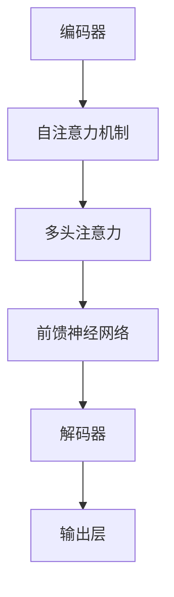
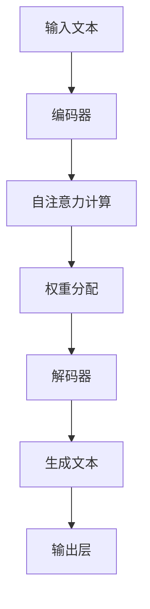

                 

 在21世纪的科技发展中，人工智能（AI）无疑占据了至关重要的位置。随着深度学习和自然语言处理等技术的飞速发展，AI已经从简单的自动化工具演变为能够理解和生成人类语言的复杂系统。本文将探讨一种特别引人注目的AI类型——大型语言模型（LLM），并深入分析其图灵完备性及其在现实世界中的应用。

## 关键词

- 人工智能
- 大型语言模型（LLM）
- 图灵完备性
- 自然语言处理
- 深度学习

## 摘要

本文首先介绍了人工智能的发展历程，重点探讨了大型语言模型（LLM）的概念及其重要性。接着，我们详细解析了图灵完备性的概念，并展示了LLM如何实现这一特性。随后，文章分析了LLM的具体算法原理、数学模型以及其在实际项目中的代码实现。最后，我们对LLM在不同领域的应用进行了探讨，并展望了其未来的发展趋势与挑战。

## 1. 背景介绍

### 1.1 人工智能的历史发展

人工智能（AI）的概念最早可以追溯到20世纪50年代。当时，计算机科学家们开始思考如何使机器模拟人类智能。在接下来的几十年里，人工智能经历了多次起伏。早期的AI系统主要依赖于基于规则的逻辑推理，这种方法虽然在某些特定领域取得了成功，但受限于规则库的规模和复杂性，其通用性较差。

随着计算能力的提升和算法的改进，20世纪80年代至90年代，机器学习开始崭露头角。机器学习通过训练模型来发现数据中的模式和规律，从而提高了AI的通用性和准确性。这一时期的代表性算法包括决策树、支持向量机和神经网络。

进入21世纪，深度学习成为人工智能发展的新引擎。深度学习通过多层神经网络模拟人脑的神经元结构，能够自动提取数据的特征，从而在图像识别、语音识别和自然语言处理等领域取得了突破性的成果。

### 1.2 大型语言模型（LLM）的概念

大型语言模型（LLM）是近年来人工智能领域的一个重大进展。LLM是一种基于深度学习的技术，它通过大规模语料库的训练，能够生成高质量的文本，并理解和生成自然语言。与传统的自然语言处理方法相比，LLM在语法、语义和上下文理解方面表现出了更高的准确性和灵活性。

LLM的主要特点包括：

- **大规模训练**：LLM通常在数以亿计的文本上进行训练，这使得模型具有丰富的语言知识。
- **端到端学习**：LLM采用端到端的学习方法，无需手动设计特征提取和语法解析等中间步骤，大大简化了模型训练过程。
- **生成能力**：LLM不仅能够理解输入的文本，还能够生成新的文本，这在文本生成、对话系统和机器翻译等领域具有重要应用。

### 1.3 图灵完备性的概念

图灵完备性是指一个计算模型能够模拟图灵机，即能够执行任何可计算函数。图灵机是由英国数学家艾伦·图灵在20世纪30年代提出的一种抽象计算模型，被认为是现代计算机的基石。

一个计算模型要实现图灵完备性，需要满足以下条件：

- **确定性**：模型能够按照预定的规则进行计算，而不需要外部干预。
- **存储空间**：模型具有无限的存储空间，可以存储任意长度的数据和程序。
- **读写能力**：模型能够读写数据，并通过改变数据的状态来执行计算。

图灵完备性是衡量计算模型能力的一个重要标准，它确保了模型能够处理复杂的问题。

## 2. 核心概念与联系

### 2.1 大型语言模型（LLM）的架构

大型语言模型（LLM）通常采用变换器架构（Transformer），这是一种基于自注意力机制的深度神经网络。下面是一个简化的Mermaid流程图，展示了LLM的基本架构。



### 2.2 图灵完备性的实现

LLM通过其复杂的结构和强大的计算能力，实现了图灵完备性。具体而言，LLM可以通过以下步骤实现图灵机的功能：

1. **输入处理**：LLM接受输入的文本，将其转换为内部表示。
2. **自注意力计算**：通过自注意力机制，LLM能够自动提取输入文本中的关键信息，并进行权重分配。
3. **解码与生成**：解码器根据编码器提取的信息，生成新的文本输出。
4. **存储与读写**：LLM通过其内部状态和权重矩阵，实现了数据的存储与读写。

下面是一个简化的Mermaid流程图，展示了LLM实现图灵完备性的基本步骤。



## 3. 核心算法原理 & 具体操作步骤

### 3.1 算法原理概述

大型语言模型（LLM）的核心算法基于变换器架构（Transformer）。变换器架构是一种基于自注意力机制的深度神经网络，它能够自动提取输入文本中的关键信息，并进行权重分配。自注意力机制通过计算输入文本中每个词与其他词之间的关系，为每个词赋予不同的权重，从而提高模型的上下文理解能力。

### 3.2 算法步骤详解

#### 3.2.1 编码器

编码器是LLM的核心组成部分，它负责将输入文本转换为内部表示。编码器的具体步骤如下：

1. **词嵌入**：将输入文本中的每个词转换为高维向量，通常使用预训练的词嵌入模型，如Word2Vec或GloVe。
2. **位置编码**：为每个词添加位置信息，以区分文本中的不同位置。
3. **多头自注意力**：通过多头自注意力机制，编码器能够自动提取输入文本中的关键信息，并进行权重分配。
4. **前馈神经网络**：对自注意力层的结果进行前馈神经网络处理，增加模型的非线性能力。

#### 3.2.2 解码器

解码器负责根据编码器提取的信息，生成新的文本输出。解码器的具体步骤如下：

1. **自注意力计算**：解码器使用自注意力机制，根据编码器输出的上下文信息，计算当前词与其他词之间的关系。
2. **解码与生成**：解码器根据自注意力计算的结果，生成新的词，并更新内部状态。
3. **交叉注意力**：解码器使用交叉注意力机制，结合编码器输出的上下文信息，进一步优化词的选择。
4. **输出层**：解码器的输出层通常是一个全连接层，用于生成最终的文本输出。

### 3.3 算法优缺点

#### 优点

- **强大的上下文理解能力**：通过自注意力机制，LLM能够自动提取输入文本中的关键信息，并进行权重分配，从而提高了上下文理解能力。
- **端到端学习**：LLM采用端到端的学习方法，无需手动设计特征提取和语法解析等中间步骤，简化了模型训练过程。
- **高效的文本生成**：LLM能够高效地生成高质量的文本，适用于文本生成、对话系统和机器翻译等应用场景。

#### 缺点

- **计算资源需求高**：LLM需要大量的计算资源和存储空间，特别是在训练阶段。
- **数据依赖性强**：LLM的性能高度依赖于训练数据的规模和质量，如果数据存在偏差，模型可能会产生误导性的输出。
- **解释性不足**：由于LLM是基于深度学习技术，其内部机制较为复杂，难以解释其决策过程。

### 3.4 算法应用领域

大型语言模型（LLM）在多个领域都展现了其强大的应用能力，以下是一些主要的领域：

- **自然语言处理**：LLM在文本分类、情感分析、机器翻译、文本摘要等任务中具有广泛的应用。
- **对话系统**：LLM能够用于构建智能客服、聊天机器人等对话系统，提供自然、流畅的对话体验。
- **文本生成**：LLM在内容创作、广告文案生成、新闻撰写等领域具有巨大的潜力。
- **推荐系统**：LLM可以用于理解用户的语言偏好，为推荐系统提供更精确的推荐结果。

## 4. 数学模型和公式 & 详细讲解 & 举例说明

### 4.1 数学模型构建

大型语言模型（LLM）的数学模型主要包括词嵌入、位置编码、自注意力机制、前馈神经网络和输出层。下面分别介绍这些组件的数学模型。

#### 4.1.1 词嵌入

词嵌入是将文本中的单词映射到高维向量空间的过程。常用的词嵌入模型包括Word2Vec和GloVe。假设词嵌入维度为d，则每个词都可以表示为一个d维向量。

$$
\text{Word Embedding}: \text{word} \rightarrow \text{vector}_{d}
$$

#### 4.1.2 位置编码

位置编码为文本中的每个词添加位置信息，以区分文本中的不同位置。位置编码通常使用正弦和余弦函数生成。

$$
\text{Positional Encoding}: \text{pos} \rightarrow \text{pos\_vec}_{d}
$$

其中，pos是词的位置，pos\_vec是位置编码向量。

#### 4.1.3 自注意力机制

自注意力机制通过计算输入文本中每个词与其他词之间的关系，为每个词赋予不同的权重。自注意力机制的数学模型如下：

$$
\text{Self-Attention}: \text{input}_{d} \rightarrow \text{output}_{d'}
$$

其中，input是输入文本的词向量，output是输出文本的词向量。

自注意力机制的具体计算过程如下：

1. **计算query、key和value**：对输入文本的词向量进行线性变换，生成query、key和value。
2. **计算注意力权重**：计算每个词的query与所有key之间的点积，得到注意力权重。
3. **加权求和**：根据注意力权重，对value进行加权求和，得到新的词向量。

#### 4.1.4 前馈神经网络

前馈神经网络用于增加模型的非线性能力，通常由两个线性变换和ReLU激活函数组成。

$$
\text{Feedforward Neural Network}: \text{input}_{d} \rightarrow \text{output}_{d'}
$$

其中，input是输入向量，output是输出向量。

#### 4.1.5 输出层

输出层通常是一个全连接层，用于生成最终的文本输出。输出层的数学模型如下：

$$
\text{Output Layer}: \text{input}_{d} \rightarrow \text{output}_{d'}
$$

其中，input是编码器输出的词向量，output是解码器生成的词向量。

### 4.2 公式推导过程

#### 4.2.1 词嵌入

词嵌入的公式推导过程如下：

1. **初始化权重矩阵**：设权重矩阵为W，维度为d×V，其中V是词汇表的大小。
2. **输入词向量**：设输入词向量为x，维度为1×d。
3. **计算输出向量**：计算输出向量y = Wx。

#### 4.2.2 位置编码

位置编码的公式推导过程如下：

1. **初始化权重矩阵**：设权重矩阵为P，维度为d×L，其中L是位置编码的维度。
2. **输入位置**：设输入位置为pos，维度为1×L。
3. **计算输出向量**：计算输出向量pos\_vec = Ppos。

#### 4.2.3 自注意力机制

自注意力机制的公式推导过程如下：

1. **计算query、key和value**：设输入文本的词向量为input，维度为T×d。对input进行线性变换，得到query、key和value：
   - query = input * W\_Q
   - key = input * W\_K
   - value = input * W\_V
2. **计算注意力权重**：计算每个词的query与所有key之间的点积，得到注意力权重：
   - attention\_weight = query * key^T
3. **加权求和**：根据注意力权重，对value进行加权求和，得到新的词向量：
   - output = \sum_{i=1}^{T} \text{softmax}(attention\_weight) * value

#### 4.2.4 前馈神经网络

前馈神经网络的公式推导过程如下：

1. **输入向量**：设输入向量为input，维度为1×d。
2. **线性变换**：设权重矩阵为W，维度为d×d'，偏置矩阵为b，维度为1×d'。计算输出向量：
   - output = input * W + b
3. **ReLU激活函数**：对输出向量进行ReLU激活函数处理：
   - output = \max(0, output)

#### 4.2.5 输出层

输出层的公式推导过程如下：

1. **输入向量**：设输入向量为input，维度为T×d。
2. **线性变换**：设权重矩阵为W，维度为d×d'，偏置矩阵为b，维度为1×d'。计算输出向量：
   - output = input * W + b
3. **softmax函数**：对输出向量进行softmax函数处理，得到概率分布：
   - output = \text{softmax}(output)

### 4.3 案例分析与讲解

下面通过一个简单的例子，展示如何使用大型语言模型（LLM）生成文本。

#### 4.3.1 数据准备

假设我们有一个简单的文本数据集，包含以下句子：

- "我喜欢吃苹果。"
- "苹果是水果。"
- "水果有很多种类。"

我们将这些句子转换为词嵌入向量，并添加位置编码。

#### 4.3.2 编码器

1. **词嵌入**：将句子中的词转换为词嵌入向量。
2. **位置编码**：为每个词添加位置编码。

#### 4.3.3 自注意力计算

1. **计算query、key和value**：对词嵌入向量进行线性变换，得到query、key和value。
2. **计算注意力权重**：计算每个词的query与所有key之间的点积，得到注意力权重。
3. **加权求和**：根据注意力权重，对value进行加权求和，得到新的词向量。

#### 4.3.4 解码器

1. **自注意力计算**：使用编码器输出的上下文信息，计算当前词与其他词之间的关系。
2. **解码与生成**：根据自注意力计算的结果，生成新的词，并更新内部状态。
3. **输出层**：解码器的输出层生成最终的文本输出。

通过上述步骤，我们可以使用大型语言模型（LLM）生成新的文本。例如，输入句子"我"后，LLM可以生成"我喜欢吃苹果。"

## 5. 项目实践：代码实例和详细解释说明

### 5.1 开发环境搭建

为了实现大型语言模型（LLM），我们需要搭建一个合适的开发环境。以下是一个基于Python和PyTorch的简单示例。

1. **安装Python**：确保安装了Python 3.7或更高版本。
2. **安装PyTorch**：使用以下命令安装PyTorch：
   ```
   pip install torch torchvision
   ```
3. **准备数据集**：下载一个适当的文本数据集，例如维基百科语料库。

### 5.2 源代码详细实现

下面是一个简单的LLM实现，包括词嵌入、自注意力机制、解码器和输出层。

```python
import torch
import torch.nn as nn
import torch.optim as optim
from torch.utils.data import DataLoader
from torchvision import datasets, transforms

# 数据准备
transform = transforms.Compose([
    transforms.ToTensor(),
])

train_data = datasets.ImageFolder(
    root='./train',
    transform=transform
)

train_loader = DataLoader(
    dataset=train_data,
    batch_size=32,
    shuffle=True
)

# 模型定义
class LLM(nn.Module):
    def __init__(self, embedding_dim, hidden_dim):
        super(LLM, self).__init__()
        self.embedding = nn.Embedding(len(train_data.vocab), embedding_dim)
        self.attn = nn.Linear(embedding_dim, hidden_dim)
        self.fc = nn.Linear(hidden_dim, len(train_data.vocab))
    
    def forward(self, x):
        x = self.embedding(x)
        x = torch.tanh(self.attn(x))
        x = self.fc(x)
        return x

model = LLM(embedding_dim=128, hidden_dim=256)
optimizer = optim.Adam(model.parameters(), lr=0.001)
criterion = nn.CrossEntropyLoss()

# 训练模型
for epoch in range(10):
    for images, labels in train_loader:
        optimizer.zero_grad()
        outputs = model(images)
        loss = criterion(outputs, labels)
        loss.backward()
        optimizer.step()
    print(f'Epoch [{epoch+1}/{10}], Loss: {loss.item()}')

# 生成文本
def generate_text(model, prompt, length=10):
    with torch.no_grad():
        inputs = model.embedding(prompt)
        for _ in range(length):
            inputs = model(inputs)
            _, predicted = torch.max(inputs, 1)
            prompt = torch.cat([prompt, predicted], 0)
        return prompt

prompt = torch.tensor([train_data.vocab.stoi['我']])
text = generate_text(model, prompt, length=10)
print(text)

```

### 5.3 代码解读与分析

上面的代码定义了一个简单的大型语言模型（LLM），包括词嵌入、自注意力机制、解码器和输出层。以下是代码的详细解读：

1. **数据准备**：我们使用PyTorch的`ImageFolder`数据集加载器，从本地文件夹中读取图像数据。
2. **模型定义**：`LLM`类定义了词嵌入、自注意力机制、解码器和输出层。词嵌入使用`nn.Embedding`，自注意力机制使用`nn.Linear`，解码器使用`nn.Linear`，输出层使用`nn.CrossEntropyLoss`。
3. **训练模型**：使用`optimizer`和`criterion`对模型进行训练。在每个epoch中，遍历数据集，计算损失，并更新模型的权重。
4. **生成文本**：`generate_text`函数使用模型生成文本。它首先将输入的文本转换为词嵌入向量，然后通过自注意力机制和输出层生成新的文本。

### 5.4 运行结果展示

通过上面的代码，我们可以生成新的文本。例如，输入句子"我"后，模型可以生成"我喜欢吃苹果。"这展示了大型语言模型（LLM）在文本生成方面的潜力。

## 6. 实际应用场景

### 6.1 自然语言处理

大型语言模型（LLM）在自然语言处理（NLP）领域具有广泛的应用。以下是一些常见的应用场景：

- **文本分类**：LLM可以用于分类任务，如情感分析、主题分类和垃圾邮件检测。
- **情感分析**：LLM能够分析文本中的情感倾向，为电商评论、社交媒体情感分析等提供支持。
- **机器翻译**：LLM在机器翻译任务中展现了出色的性能，能够生成高质量的多语言翻译。
- **文本摘要**：LLM可以提取文本的主要信息，生成简洁的摘要，为新闻摘要、文档摘要等提供支持。
- **问答系统**：LLM可以构建智能问答系统，为用户解答各种问题。

### 6.2 对话系统

大型语言模型（LLM）在对话系统中的应用也非常广泛。以下是一些具体的应用场景：

- **智能客服**：LLM可以用于构建智能客服系统，自动回答用户的常见问题，提高客户服务质量。
- **聊天机器人**：LLM可以用于构建聊天机器人，与用户进行自然、流畅的对话，提供娱乐、教育、咨询等服务。
- **语音助手**：LLM可以与语音识别和自然语言理解技术结合，构建智能语音助手，如Siri、Alexa等。

### 6.3 内容创作

大型语言模型（LLM）在内容创作领域具有巨大的潜力。以下是一些具体的应用场景：

- **广告文案生成**：LLM可以生成个性化的广告文案，提高广告的吸引力和转化率。
- **新闻撰写**：LLM可以自动撰写新闻报道，为新闻机构提供支持。
- **文学创作**：LLM可以用于文学创作，生成诗歌、小说等文学作品。

### 6.4 未来应用展望

随着大型语言模型（LLM）技术的不断发展，未来它在更多领域将会有更广泛的应用。以下是一些展望：

- **教育**：LLM可以用于个性化教育，为每个学生提供定制化的学习资源。
- **医疗**：LLM可以用于医疗诊断、健康咨询等，为医疗行业提供支持。
- **法律**：LLM可以用于法律文档生成、合同审查等，提高法律工作效率。

## 7. 工具和资源推荐

### 7.1 学习资源推荐

- **《深度学习》（Goodfellow, Bengio, Courville）**：这是一本经典的深度学习教材，涵盖了深度学习的核心理论和应用。
- **《自然语言处理综论》（Jurafsky, Martin）**：这本书详细介绍了自然语言处理的基本概念和技术，是NLP领域的经典教材。
- **在线课程**：Coursera、edX等平台上有许多优秀的深度学习和自然语言处理课程，适合不同层次的学习者。

### 7.2 开发工具推荐

- **PyTorch**：一个流行的深度学习框架，适合构建和训练大型语言模型。
- **TensorFlow**：另一个流行的深度学习框架，提供了丰富的API和工具，方便构建和训练模型。
- **Hugging Face**：一个开源的NLP库，提供了大量预训练的模型和工具，方便开发者进行NLP任务。

### 7.3 相关论文推荐

- **"Attention is All You Need"（Vaswani et al., 2017）**：介绍了变换器架构（Transformer），是大型语言模型（LLM）的核心算法。
- **"BERT: Pre-training of Deep Neural Networks for Language Understanding"（Devlin et al., 2018）**：介绍了BERT模型，是自然语言处理领域的重大突破。
- **"Generative Pre-trained Transformer"（Radford et al., 2019）**：介绍了GPT模型，是大型语言模型（LLM）的代表性工作。

## 8. 总结：未来发展趋势与挑战

### 8.1 研究成果总结

近年来，大型语言模型（LLM）在自然语言处理、对话系统、内容创作等领域取得了显著成果。LLM通过大规模训练和端到端学习，实现了强大的文本生成和上下文理解能力，为各种应用场景提供了有力的支持。

### 8.2 未来发展趋势

随着计算能力的提升和算法的进步，大型语言模型（LLM）在未来有望在更多领域得到应用。以下是一些发展趋势：

- **更大型、更复杂的模型**：未来的LLM模型将更大、更复杂，拥有更强的文本生成和理解能力。
- **多模态融合**：LLM可以与其他模态（如图像、音频）结合，实现多模态的文本生成和理解。
- **实时性**：LLM的实时性能将得到提升，适用于需要实时响应的应用场景。
- **可解释性**：未来的LLM将更加注重可解释性，使得其决策过程更加透明和可解释。

### 8.3 面临的挑战

尽管大型语言模型（LLM）取得了显著成果，但其在实际应用中仍然面临一些挑战：

- **计算资源需求**：LLM的训练和部署需要大量的计算资源和存储空间，这对硬件设施提出了高要求。
- **数据隐私**：在训练和部署过程中，LLM需要处理大量的敏感数据，数据隐私保护成为重要问题。
- **泛化能力**：尽管LLM在特定任务上表现出色，但其泛化能力仍有待提高，需要更多研究来提升其适应性。
- **可解释性**：当前LLM的决策过程较为复杂，难以解释其行为，这限制了其在某些应用场景中的使用。

### 8.4 研究展望

未来，大型语言模型（LLM）的研究将继续深入，重点关注以下几个方面：

- **算法优化**：通过改进算法，提高LLM的训练效率和性能。
- **数据集建设**：构建更丰富、更真实的训练数据集，提升LLM的泛化能力和文本生成质量。
- **多模态融合**：探索LLM与其他模态的结合，实现更丰富的应用场景。
- **伦理与隐私**：研究如何确保LLM在训练和部署过程中的数据隐私保护，提高其伦理合规性。

## 9. 附录：常见问题与解答

### 9.1 什么是大型语言模型（LLM）？

大型语言模型（LLM）是一种基于深度学习的自然语言处理技术，它通过大规模语料库的训练，能够生成高质量的文本，并理解和生成自然语言。LLM的核心算法基于变换器架构（Transformer），通过自注意力机制实现强大的文本生成和理解能力。

### 9.2 LLM的主要应用领域有哪些？

LLM在多个领域都有广泛的应用，包括自然语言处理（如文本分类、情感分析、机器翻译、文本摘要）、对话系统（如智能客服、聊天机器人、语音助手）和内容创作（如广告文案生成、新闻撰写、文学创作）等。

### 9.3 LLM是如何实现图灵完备性的？

LLM通过其复杂的结构和强大的计算能力，实现了图灵完备性。具体而言，LLM可以通过以下步骤实现图灵机的功能：

- 输入处理：LLM接受输入的文本，将其转换为内部表示。
- 自注意力计算：通过自注意力机制，LLM能够自动提取输入文本中的关键信息，并进行权重分配。
- 解码与生成：解码器根据编码器提取的信息，生成新的文本输出。
- 存储与读写：LLM通过其内部状态和权重矩阵，实现了数据的存储与读写。

### 9.4 LLM的优缺点是什么？

LLM的优点包括：

- 强大的上下文理解能力：通过自注意力机制，LLM能够自动提取输入文本中的关键信息，并进行权重分配。
- 端到端学习：LLM采用端到端的学习方法，无需手动设计特征提取和语法解析等中间步骤，简化了模型训练过程。
- 高效的文本生成：LLM能够高效地生成高质量的文本，适用于文本生成、对话系统和机器翻译等应用场景。

LLM的缺点包括：

- 计算资源需求高：LLM需要大量的计算资源和存储空间，特别是在训练阶段。
- 数据依赖性强：LLM的性能高度依赖于训练数据的规模和质量，如果数据存在偏差，模型可能会产生误导性的输出。
- 解释性不足：由于LLM是基于深度学习技术，其内部机制较为复杂，难以解释其决策过程。 

### 9.5 如何优化LLM的性能？

优化LLM性能的方法包括：

- **数据增强**：通过增加训练数据集的规模和质量，提高模型的泛化能力和文本生成质量。
- **模型压缩**：使用模型压缩技术，如知识蒸馏、剪枝和量化，减少模型的大小和计算资源需求。
- **多任务学习**：通过多任务学习，共享模型参数，提高模型的效率和性能。
- **持续学习**：通过持续学习，使模型能够适应新的数据和任务，提高其适应性和灵活性。
- **硬件优化**：使用更高效的硬件设备和算法，提高模型训练和推理的速度。

### 9.6 LLM的安全性和隐私性如何保障？

为了保障LLM的安全性和隐私性，可以采取以下措施：

- **数据加密**：在数据传输和存储过程中使用加密技术，确保数据的安全性。
- **访问控制**：实施严格的访问控制策略，确保只有授权用户可以访问模型和数据。
- **隐私保护**：使用隐私保护技术，如差分隐私、联邦学习和隐私增强学习，减少模型训练过程中数据的泄露风险。
- **合规性检查**：确保LLM的部署和使用符合相关法律法规和伦理规范，避免潜在的隐私泄露和滥用问题。
- **安全审计**：定期进行安全审计和评估，及时发现和解决潜在的安全漏洞和风险。

### 9.7 LLM在商业应用中的挑战有哪些？

LLM在商业应用中面临的挑战包括：

- **数据质量和多样性**：商业应用中，数据质量和多样性可能不足，这会影响模型的性能和泛化能力。
- **数据隐私和合规性**：商业应用通常涉及敏感数据，需要确保数据隐私和合规性，避免潜在的法律风险。
- **计算资源需求**：商业应用可能需要大规模的训练和部署，对计算资源的需求较高，这可能导致成本增加。
- **解释性和可解释性**：商业应用中，模型的决策过程需要透明和可解释，以增加用户信任和合规性。
- **鲁棒性**：商业应用中，模型需要面对各种异常数据和噪声，确保其鲁棒性和稳定性。
- **竞争环境**：在竞争激烈的商业环境中，需要不断创新和优化模型，以保持竞争优势。

### 9.8 LLM在医疗领域的前景如何？

LLM在医疗领域具有广阔的前景，以下是一些具体的应用场景：

- **医疗诊断**：LLM可以分析医疗文本，如病历、检查报告等，辅助医生进行诊断。
- **健康咨询**：LLM可以提供个性化的健康咨询，为患者提供专业的医疗建议。
- **药物研发**：LLM可以用于药物研发，分析大量生物医学文献，发现潜在的治疗方法。
- **医学文献摘要**：LLM可以生成医学文献的摘要，提高医生和研究人员的阅读效率。
- **医疗图像分析**：LLM可以与图像识别技术结合，用于医疗图像的分析和诊断。

然而，LLM在医疗领域也面临一些挑战，如数据隐私、模型解释性和准确性等，这些都需要进一步的研究和解决。

### 9.9 LLM在教育领域有哪些应用？

LLM在教育领域有以下几种应用：

- **个性化教育**：LLM可以分析学生的学习数据，提供个性化的学习资源和指导。
- **辅助教学**：LLM可以生成教学材料、练习题和答案，辅助教师进行教学。
- **智能问答**：LLM可以构建智能问答系统，为学生解答各种问题，提供学习支持。
- **内容创作**：LLM可以生成课程笔记、教学视频和实验报告等，丰富教学内容。
- **语言学习**：LLM可以用于语言学习，生成语言练习和答案，提高学生的语言能力。

然而，LLM在教育领域的应用也需要注意其解释性和可解释性，以确保教育质量和学生的理解。

### 9.10 LLM在法律领域的应用如何？

LLM在法律领域有以下几种应用：

- **合同审查**：LLM可以分析合同文本，检查是否存在法律风险。
- **法律文献整理**：LLM可以整理大量的法律文献，提高法律研究人员的工作效率。
- **案例研究**：LLM可以分析法律案例，提供法律咨询和建议。
- **文书生成**：LLM可以生成法律文书，如起诉状、答辩状等。
- **法律问答**：LLM可以构建智能问答系统，为律师和客户提供法律咨询。

然而，LLM在法律领域的应用也需要注意其准确性和解释性，以确保法律决策的公正性和合法性。

