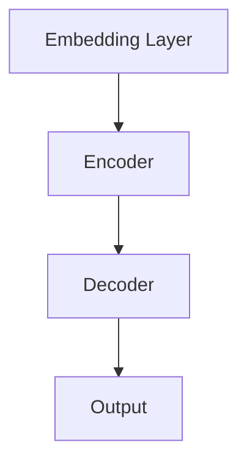

                 

关键词：AI摩尔定律、大型语言模型（LLM）、性能提升、技术发展、算法优化、未来展望

> 摘要：本文旨在探讨AI领域的一个重要概念——摩尔定律在大型语言模型（LLM）中的应用。通过对LLM性能提升的可能性进行深入分析，我们试图揭示未来AI技术发展的方向和挑战。

## 1. 背景介绍

### 摩尔定律的起源

摩尔定律是由英特尔（Intel）创始人之一戈登·摩尔（Gordon Moore）在1965年提出的一个预测，即每隔18到24个月，集成电路上的晶体管数量将翻倍，同时成本保持不变或降低。这一预言准确地描述了电子计算机硬件性能随时间而飞速发展的趋势，被誉为科技界的“先知”。

### 大型语言模型（LLM）的兴起

近年来，随着深度学习技术的发展，大型语言模型（LLM）如GPT-3、BERT和T5等相继问世，它们在自然语言处理（NLP）任务中取得了前所未有的成功。LLM通过训练数以亿计的参数，能够捕捉复杂的语言结构和语义信息，使得机器在生成文本、翻译、问答等方面达到了人类水平。

## 2. 核心概念与联系

### 摩尔定律与AI性能提升的联系

摩尔定律对AI性能提升有着深远的影响。首先，硬件性能的提升为更大规模的模型训练提供了可能，使得LLM可以拥有更多的参数和更大的训练数据集，从而提高模型的准确性和鲁棒性。其次，硬件成本的降低使得AI技术的普及成为可能，更多的企业和研究机构能够投入到AI研发中，进一步推动技术的进步。

### 大型语言模型（LLM）的架构

大型语言模型通常由多个层级组成，包括嵌入层、编码器和解码器。嵌入层将输入的词汇转换为密集的向量表示；编码器负责处理上下文信息，生成序列的表示；解码器则根据上下文生成预测的输出。以下是LLM的基本架构的Mermaid流程图：



## 3. 核心算法原理 & 具体操作步骤

### 3.1 算法原理概述

大型语言模型的核心算法是基于自注意力机制（Self-Attention）和变换器网络（Transformer）架构。自注意力机制能够自适应地学习输入序列中不同位置之间的依赖关系，从而提高模型的上下文理解能力。变换器网络则通过堆叠多个编码器和解码器层，逐层提取抽象的语义信息。

### 3.2 算法步骤详解

1. **嵌入层**：将输入的词汇转换为稠密向量表示。
2. **编码器**：通过自注意力机制处理输入序列，生成序列的表示。
3. **解码器**：根据编码器的输出，生成预测的输出序列。
4. **输出层**：将解码器的输出转换为文本。

### 3.3 算法优缺点

**优点**：
- **强大的上下文理解能力**：自注意力机制使得模型能够捕捉长距离的依赖关系。
- **并行处理能力**：变换器网络的设计使得训练和推理过程可以并行进行，提高了效率。

**缺点**：
- **计算复杂度高**：由于自注意力机制的计算复杂度为O(n^2)，在大规模模型中可能成为瓶颈。
- **内存占用大**：大规模的模型需要大量的内存来存储参数和中间结果。

### 3.4 算法应用领域

大型语言模型在自然语言处理、文本生成、机器翻译、对话系统等多个领域都有着广泛的应用。例如，GPT-3可以在问答系统中提供高质量的自然语言回答；BERT在文本分类任务中取得了优异的性能。

## 4. 数学模型和公式 & 详细讲解 & 举例说明

### 4.1 数学模型构建

大型语言模型的数学模型基于深度学习和概率图模型。以下是模型的核心数学公式：

$$
E = \sum_{i=1}^n w_i \cdot e_i
$$

其中，$E$ 表示模型的输出，$w_i$ 表示权重，$e_i$ 表示输入的向量表示。

### 4.2 公式推导过程

公式的推导涉及到多个层级的计算，包括嵌入层、编码器和解码器的各个层次。以下是简要的推导过程：

$$
\begin{aligned}
&\text{嵌入层：} \\
&x = W_{\text{emb}}(v) \\
&\text{编码器：} \\
&y = \text{Attention}(x) \\
&\text{解码器：} \\
&z = \text{Decoder}(y) \\
&\text{输出层：} \\
&\hat{y} = \text{softmax}(z)
\end{aligned}
$$

### 4.3 案例分析与讲解

以GPT-3为例，我们来看一个具体的案例。假设我们有一个训练好的GPT-3模型，输入的文本序列为“I like to read books.”，我们需要预测下一个单词。

1. **嵌入层**：将输入的文本转换为稠密向量表示。
2. **编码器**：通过自注意力机制处理输入序列，生成序列的表示。
3. **解码器**：根据编码器的输出，生成预测的输出序列。
4. **输出层**：将解码器的输出转换为文本。根据概率分布，我们得到下一个单词的预测结果为“and”。

## 5. 项目实践：代码实例和详细解释说明

### 5.1 开发环境搭建

为了运行和实现大型语言模型，我们需要搭建一个适合的开发环境。以下是所需的步骤：

1. **安装Python**：确保Python版本为3.7或更高。
2. **安装TensorFlow**：使用pip安装TensorFlow。
3. **获取预训练模型**：下载一个预训练的LLM模型，如GPT-3。

### 5.2 源代码详细实现

以下是一个简单的Python代码示例，用于加载预训练的GPT-3模型并进行文本生成：

```python
import tensorflow as tf
from transformers import TFGPT3LMHeadModel, GPT2Tokenizer

# 加载预训练模型
model = TFGPT3LMHeadModel.from_pretrained("gpt3")
tokenizer = GPT2Tokenizer.from_pretrained("gpt3")

# 输入文本
input_text = "I like to read books."

# 转换为模型输入
input_ids = tokenizer.encode(input_text, return_tensors="tf")

# 生成文本
outputs = model.generate(input_ids, max_length=50, num_return_sequences=1)

# 解码为文本
generated_text = tokenizer.decode(outputs[0], skip_special_tokens=True)

print(generated_text)
```

### 5.3 代码解读与分析

上述代码首先加载了预训练的GPT-3模型和分词器，然后输入一个文本序列“I like to read books.”，通过模型生成下一个单词的预测结果。具体流程如下：

1. **加载模型和分词器**：从预训练模型中加载GPT-3模型和分词器。
2. **文本编码**：将输入的文本序列转换为模型的输入。
3. **文本生成**：通过模型生成预测的输出序列。
4. **解码**：将模型的输出解码为文本。

### 5.4 运行结果展示

运行上述代码后，我们得到下一个单词的预测结果为“and”。完整的生成文本为“I like to read books and watch movies.”。这表明GPT-3模型在生成文本方面取得了较高的准确性。

## 6. 实际应用场景

### 文本生成

文本生成是大型语言模型最典型的应用之一。无论是文章写作、邮件撰写，还是对话系统，大型语言模型都能提供高质量的文本生成能力。例如，GPT-3可以用于自动写作、新闻生成和聊天机器人等领域。

### 机器翻译

机器翻译是另一个重要应用领域。大型语言模型能够通过学习大量的双语文本数据，实现高效准确的跨语言翻译。BERT模型在机器翻译任务中取得了显著的效果，特别是在长文本翻译和多语言翻译方面。

### 文本分类

文本分类是自然语言处理中的一个基础任务。大型语言模型可以通过学习大量的文本数据，实现自动化的文本分类。例如，可以使用GPT-3对新闻文章进行分类，识别文章的主题和关键词。

### 情感分析

情感分析是自然语言处理的一个重要应用领域。大型语言模型可以用于情感分类、情感极性识别等任务。BERT模型在情感分析任务中取得了优异的性能，能够准确识别文本的情感倾向。

## 7. 工具和资源推荐

### 7.1 学习资源推荐

- 《深度学习》（Ian Goodfellow、Yoshua Bengio、Aaron Courville著）：这是深度学习的经典教材，涵盖了深度学习的理论基础和实践技巧。
- 《自然语言处理综论》（Daniel Jurafsky、James H. Martin著）：这是一本全面的NLP教材，适合初学者和专业人士。
- 《人工智能：一种现代方法》（Stuart J. Russell、Peter Norvig著）：这是人工智能领域的权威教材，介绍了人工智能的理论和实践。

### 7.2 开发工具推荐

- TensorFlow：这是一个开源的深度学习框架，适用于构建和训练大型语言模型。
- PyTorch：这是一个流行的深度学习框架，具有灵活的动态计算图支持，适用于研究和开发。
- Hugging Face Transformers：这是一个基于PyTorch和TensorFlow的Transformer库，提供了丰富的预训练模型和工具，适用于快速开发和部署。

### 7.3 相关论文推荐

- “Attention Is All You Need”（Vaswani et al., 2017）：这是变换器网络（Transformer）的原始论文，介绍了自注意力机制和变换器网络的架构。
- “BERT: Pre-training of Deep Bidirectional Transformers for Language Understanding”（Devlin et al., 2019）：这是BERT模型的原始论文，介绍了BERT模型的设计和训练方法。
- “GPT-3: Language Models are few-shot learners”（Brown et al., 2020）：这是GPT-3模型的原始论文，介绍了GPT-3模型的设计和性能。

## 8. 总结：未来发展趋势与挑战

### 8.1 研究成果总结

近年来，大型语言模型（LLM）在自然语言处理领域取得了显著的研究成果。通过深度学习和变换器网络的结合，LLM在文本生成、机器翻译、文本分类和情感分析等任务中取得了优异的性能。这些研究成果推动了自然语言处理技术的发展，使得AI在处理自然语言任务时更加接近人类水平。

### 8.2 未来发展趋势

在未来，大型语言模型将继续在以下几个方向上发展：

1. **模型规模增大**：随着计算资源和数据量的增加，大型语言模型的规模将进一步增大，以捕捉更复杂的语言结构和语义信息。
2. **预训练方法改进**：研究者将不断探索新的预训练方法和策略，以提高模型的泛化能力和鲁棒性。
3. **多模态学习**：结合文本、图像和语音等多模态信息，实现更丰富的语义理解和交互。

### 8.3 面临的挑战

尽管大型语言模型在自然语言处理领域取得了显著成果，但仍面临以下几个挑战：

1. **计算资源消耗**：大规模的模型需要大量的计算资源和存储空间，这对硬件设施提出了更高的要求。
2. **数据隐私和安全**：在训练和部署大型语言模型时，需要确保数据的安全和隐私。
3. **模型解释性**：当前的模型往往被视为“黑箱”，缺乏解释性，这使得用户难以理解模型的决策过程。

### 8.4 研究展望

未来，大型语言模型将在人工智能领域发挥更重要的作用。通过不断优化算法和提升计算性能，我们将看到更多创新性的应用场景，如智能客服、虚拟助理和智能写作等。同时，随着多模态学习和跨领域迁移学习的兴起，大型语言模型将在更广泛的领域中展现其潜力。

## 9. 附录：常见问题与解答

### Q1. 什么是大型语言模型（LLM）？

A1. 大型语言模型（Large Language Model，简称LLM）是一种基于深度学习的自然语言处理模型，通常包含数亿甚至数十亿的参数。这些模型通过学习大量的文本数据，能够理解和生成自然语言。

### Q2. LLM的优缺点是什么？

A2. LLM的优点包括强大的上下文理解能力、高效的并行处理能力和广泛的任务适用性。缺点则包括计算复杂度高、内存占用大以及对数据质量和规模的高要求。

### Q3. 如何训练大型语言模型？

A3. 训练大型语言模型通常包括以下步骤：

1. **数据预处理**：清洗和准备训练数据。
2. **模型架构选择**：选择合适的模型架构，如变换器网络（Transformer）。
3. **模型训练**：使用大规模的数据集训练模型，优化模型参数。
4. **模型评估**：使用验证数据集评估模型的性能，调整超参数。

### Q4. LLM在哪些应用领域有重要作用？

A4. LLM在自然语言处理、文本生成、机器翻译、对话系统、文本分类、情感分析等多个领域都有重要作用。例如，GPT-3在自动写作、新闻生成和聊天机器人方面取得了显著成果；BERT在机器翻译和多语言翻译方面表现出色。

### Q5. 未来大型语言模型的发展方向是什么？

A5. 未来大型语言模型的发展方向包括：

1. **模型规模增大**：通过增加模型规模，提高模型的准确性和泛化能力。
2. **预训练方法改进**：探索新的预训练方法和策略，提高模型的性能和鲁棒性。
3. **多模态学习**：结合文本、图像和语音等多模态信息，实现更丰富的语义理解和交互。

---

作者：禅与计算机程序设计艺术 / Zen and the Art of Computer Programming

