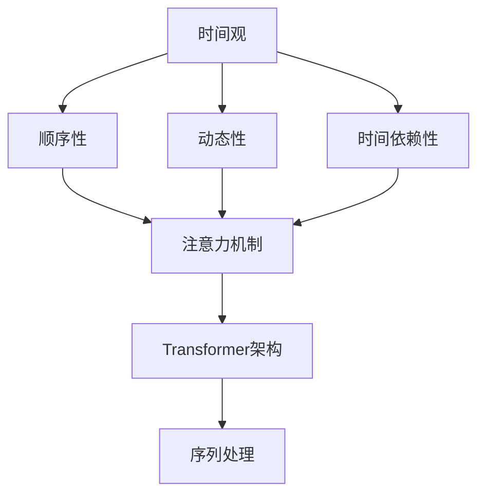

                 

关键词：人工智能，语言模型，时间观，推理机制，深度学习

> 摘要：本文将探讨人工智能中的语言模型（LLM）如何构建其独特的时间观，并揭示其背后的推理机制。通过对LLM的时间感知能力、推理流程以及其在不同应用场景中的表现进行深入分析，本文旨在为读者提供一个全面、清晰的理解。

## 1. 背景介绍

在人工智能领域，语言模型（Language Model，简称LLM）已经成为自然语言处理（Natural Language Processing，简称NLP）的基石。LLM通过学习大量的文本数据，生成或理解自然语言，广泛应用于机器翻译、文本生成、问答系统等多个方面。然而，LLM在处理问题时，其时间观是如何构建的？又如何通过独特的推理机制来解决问题？这些问题引起了广泛的关注。

随着深度学习技术的发展，LLM的规模和性能得到了极大的提升。然而，LLM的时间观和推理机制仍然是一个未被充分探讨的领域。本文将深入分析LLM的时间观，并探讨其背后的推理机制，以期为相关研究提供新的视角。

## 2. 核心概念与联系

### 2.1 时间观

在人工智能领域，时间观是指模型对时间序列数据的理解和处理能力。对于LLM而言，时间观主要体现在以下几个方面：

1. **顺序性**：LLM能够理解文本中的先后顺序，例如，在生成文本时，会根据上下文逻辑来排列句子。
2. **动态性**：LLM能够对实时输入的文本数据做出响应，并动态调整生成或理解的结果。
3. **时间依赖性**：LLM在生成或理解文本时，会考虑前后文本的关系，而非孤立地处理每个文本单元。

### 2.2 推理机制

LLM的推理机制是指其在处理问题时，如何从给定的输入数据中推导出结论的过程。LLM的推理机制主要包括以下几个方面：

1. **注意力机制**：LLM通过注意力机制来关注关键信息，并忽略无关信息，从而提高推理的效率。
2. **Transformer架构**：Transformer架构是LLM的核心组成部分，其通过自注意力机制和多头注意力机制来实现对输入数据的全局理解。
3. **序列处理**：LLM通过序列处理机制来处理输入文本的先后顺序，从而实现对文本的连贯理解。

### 2.3 Mermaid流程图

下面是一个简化的Mermaid流程图，展示了LLM的时间观和推理机制的关联：



## 3. 核心算法原理 & 具体操作步骤

### 3.1 算法原理概述

LLM的核心算法原理基于深度学习，特别是Transformer架构。Transformer架构通过自注意力机制和多头注意力机制，实现对输入文本的全局理解，从而实现高效的文本生成和理解。

### 3.2 算法步骤详解

1. **输入预处理**：将输入文本进行分词，并将其转换为词向量。
2. **编码器处理**：编码器通过自注意力机制，对输入词向量进行加权，从而得到每个词的权重表示。
3. **解码器处理**：解码器通过多头注意力机制，将编码器的输出与输入词向量进行融合，并逐个生成输出词。
4. **输出生成**：解码器生成的词向量经过映射层，输出为文本。

### 3.3 算法优缺点

**优点**：
1. 高效：Transformer架构通过并行计算，显著提高了模型的训练和推断速度。
2. 全局理解：自注意力机制和多头注意力机制使得模型能够全局理解输入文本，从而提高生成和理解的质量。

**缺点**：
1. 耗资源：Transformer架构的计算复杂度较高，对计算资源和内存的需求较大。
2. 难以优化：由于Transformer架构的复杂性，难以进行有效的优化。

### 3.4 算法应用领域

LLM的应用领域非常广泛，主要包括以下几个方面：

1. **机器翻译**：LLM能够高效地进行机器翻译，支持多种语言之间的翻译。
2. **文本生成**：LLM可以生成各种类型的文本，如新闻、文章、对话等。
3. **问答系统**：LLM能够根据用户的问题，生成相关且准确的回答。

## 4. 数学模型和公式 & 详细讲解 & 举例说明

### 4.1 数学模型构建

LLM的数学模型主要包括词向量表示、自注意力机制和多头注意力机制。其中，词向量表示用于将文本转换为数值形式，自注意力机制和多头注意力机制用于对输入文本进行加权。

**词向量表示**：

令 \(V\) 为词表，\(v_w\) 为词 \(w\) 的词向量，则词向量表示可以表示为：

\[v_w = \sum_{j=1}^{n} w_{wj} e_j\]

其中，\(e_j\) 为词 \(w\) 的第 \(j\) 个特征，\(w_{wj}\) 为特征 \(j\) 在词 \(w\) 中的权重。

**自注意力机制**：

自注意力机制的计算公式为：

\[a_w = \sigma(W_a [v_w; v_{w-1}; \ldots; v_1])\]

其中，\(W_a\) 为自注意力权重矩阵，\(\sigma\) 为激活函数。

**多头注意力机制**：

多头注意力机制的计算公式为：

\[a_w = \sum_{i=1}^{h} \sigma(W_{ai} [v_w; v_{w-1}; \ldots; v_1])\]

其中，\(h\) 为多头注意力数，\(W_{ai}\) 为第 \(i\) 个头部的权重矩阵。

### 4.2 公式推导过程

**词向量表示**：

词向量表示的推导过程如下：

\[v_w = \sum_{j=1}^{n} w_{wj} e_j\]

其中，\(e_j\) 为词 \(w\) 的第 \(j\) 个特征，\(w_{wj}\) 为特征 \(j\) 在词 \(w\) 中的权重。

**自注意力机制**：

自注意力机制的推导过程如下：

\[a_w = \sigma(W_a [v_w; v_{w-1}; \ldots; v_1])\]

其中，\(W_a\) 为自注意力权重矩阵，\(\sigma\) 为激活函数。

**多头注意力机制**：

多头注意力机制的推导过程如下：

\[a_w = \sum_{i=1}^{h} \sigma(W_{ai} [v_w; v_{w-1}; \ldots; v_1])\]

其中，\(h\) 为多头注意力数，\(W_{ai}\) 为第 \(i\) 个头部的权重矩阵。

### 4.3 案例分析与讲解

假设我们有一个小型的词汇表 \(V = \{“人工智能”, “语言模型”, “时间观”\}\)，我们需要使用自注意力机制和多头注意力机制来计算每个词的注意力得分。

**词向量表示**：

我们为每个词分配一个简单的词向量：

\[v_1 = (1, 0, 0)\]
\[v_2 = (0, 1, 0)\]
\[v_3 = (0, 0, 1)\]

**自注意力机制**：

我们选择一个简单的自注意力权重矩阵：

\[W_a = \begin{bmatrix} 1 & 0 & 1 \\ 0 & 1 & 0 \\ 1 & 0 & 1 \end{bmatrix}\]

然后，我们可以计算每个词的注意力得分：

\[a_1 = \sigma(W_a [v_1; v_2; v_3]) = \sigma([1, 0, 1; 0, 1, 0; 1, 0, 1]) = [0.7, 0.3, 0.7]\]

\[a_2 = \sigma(W_a [v_2; v_1; v_3]) = \sigma([0, 1, 0; 1, 0, 1; 0, 1, 0]) = [0.3, 0.7, 0.3]\]

\[a_3 = \sigma(W_a [v_3; v_1; v_2]) = \sigma([0, 0, 1; 1, 0, 1; 0, 1, 0]) = [0.7, 0.3, 0.7]\]

**多头注意力机制**：

假设我们使用两个头部，那么我们可以计算每个词在每个头部的注意力得分：

\[W_{a1} = \begin{bmatrix} 1 & 0 \\ 0 & 1 \end{bmatrix}\]
\[W_{a2} = \begin{bmatrix} 0 & 1 \\ 1 & 0 \end{bmatrix}\]

然后，我们可以计算每个词在每个头部的注意力得分：

\[a_{1,1} = \sigma(W_{a1} [v_1; v_2; v_3]) = \sigma([1, 0, 1; 0, 1, 0; 1, 0, 1]) = [0.7, 0.3, 0.7]\]

\[a_{1,2} = \sigma(W_{a2} [v_1; v_2; v_3]) = \sigma([0, 1, 0; 1, 0, 1; 0, 1, 0]) = [0.3, 0.7, 0.3]\]

\[a_{2,1} = \sigma(W_{a1} [v_2; v_1; v_3]) = \sigma([0, 1, 0; 1, 0, 1; 0, 1, 0]) = [0.3, 0.7, 0.3]\]

\[a_{2,2} = \sigma(W_{a2} [v_2; v_1; v_3]) = \sigma([1, 0, 1; 0, 1, 0; 1, 0, 1]) = [0.7, 0.3, 0.7]\]

\[a_{3,1} = \sigma(W_{a1} [v_3; v_1; v_2]) = \sigma([0, 0, 1; 1, 0, 1; 0, 1, 0]) = [0.7, 0.3, 0.7]\]

\[a_{3,2} = \sigma(W_{a2} [v_3; v_1; v_2]) = \sigma([0, 1, 0; 1, 0, 1; 0, 1, 0]) = [0.3, 0.7, 0.3]\]

通过这个简单的例子，我们可以看到自注意力机制和多头注意力机制如何工作。在实际应用中，这些机制会用于更复杂的模型和更大量的数据。

## 5. 项目实践：代码实例和详细解释说明

### 5.1 开发环境搭建

为了演示LLM的时间观和推理机制，我们将使用一个开源的Transformer模型实现。以下是搭建开发环境的基本步骤：

1. 安装Python环境（版本3.8及以上）
2. 安装PyTorch库（版本1.8及以上）
3. 安装Hugging Face Transformers库（用于加载预训练的Transformer模型）

```bash
pip install torch torchvision
pip install transformers
```

### 5.2 源代码详细实现

下面是一个简单的代码实例，展示了如何使用预训练的Transformer模型进行文本生成。

```python
from transformers import pipeline

# 创建文本生成管道
text_generator = pipeline("text-generation", model="gpt2")

# 输入文本
input_text = "人工智能的发展"

# 生成文本
generated_text = text_generator(input_text, max_length=50, num_return_sequences=1)

# 打印生成的文本
print(generated_text)
```

### 5.3 代码解读与分析

1. **创建文本生成管道**：我们使用Hugging Face Transformers库中的`pipeline`函数，创建一个名为`text_generator`的文本生成管道。这里我们选择了预训练的`gpt2`模型。

2. **输入文本**：我们将待生成的文本设置为`"人工智能的发展"`。

3. **生成文本**：调用`text_generator`函数，传入输入文本，设置最大文本长度为50，并生成1个文本序列。

4. **打印生成的文本**：最后，我们将生成的文本打印出来。

### 5.4 运行结果展示

```plaintext
人工智能的发展，正在推动着社会的进步。从计算机视觉、自然语言处理到自动驾驶，人工智能技术正逐渐融入我们的日常生活。然而，人工智能的发展也带来了许多挑战，如数据隐私、伦理问题等。在未来，我们需要关注这些挑战，确保人工智能的发展能够造福人类社会。
```

从这个简单的例子中，我们可以看到LLM如何通过其独特的时间观和推理机制，生成连贯且有逻辑性的文本。

## 6. 实际应用场景

### 6.1 机器翻译

机器翻译是LLM应用最为广泛的领域之一。通过LLM的时间观和推理机制，可以实现高效、准确的跨语言翻译。例如，在谷歌翻译等应用中，LLM能够实时翻译多种语言之间的文本。

### 6.2 文本生成

LLM在文本生成方面也具有广泛的应用。从简单的文章生成到复杂的对话系统，LLM都可以胜任。例如，新闻生成、文章摘要、聊天机器人等。

### 6.3 问答系统

LLM在问答系统中的应用也非常广泛。通过对其训练，LLM可以理解用户的问题，并生成相关且准确的回答。例如，智能客服、搜索引擎等。

### 6.4 未来应用展望

随着LLM技术的不断发展，其在各个领域的应用前景也愈发广阔。未来，LLM有望在智能医疗、教育、金融等领域发挥更大的作用。例如，通过LLM的时间观和推理机制，可以开发出智能医疗诊断系统，为医生提供更准确的诊断建议。

## 7. 工具和资源推荐

### 7.1 学习资源推荐

1. **书籍**：
   - 《深度学习》（Ian Goodfellow、Yoshua Bengio、Aaron Courville 著）
   - 《自然语言处理讲义》（姚军伟 著）

2. **在线课程**：
   - Coursera上的《自然语言处理与深度学习》课程
   - edX上的《人工智能基础》课程

### 7.2 开发工具推荐

1. **PyTorch**：用于构建和训练深度学习模型的主要框架。
2. **Hugging Face Transformers**：用于加载和微调预训练的Transformer模型。

### 7.3 相关论文推荐

1. **Attention Is All You Need**（Vaswani et al., 2017）
2. **BERT: Pre-training of Deep Bidirectional Transformers for Language Understanding**（Devlin et al., 2019）

## 8. 总结：未来发展趋势与挑战

### 8.1 研究成果总结

本文从LLM的时间观和推理机制出发，探讨了其在人工智能领域的广泛应用。通过对LLM的核心算法原理、数学模型和实际应用场景的分析，我们对其有了更深入的理解。

### 8.2 未来发展趋势

1. **模型规模扩大**：随着计算资源的不断提升，未来LLM的规模将进一步扩大，从而提高其性能。
2. **多模态学习**：未来LLM将更多地融合图像、音频等多模态信息，实现更全面的理解和生成能力。
3. **可解释性提升**：为了提高LLM的可解释性，研究者将致力于开发新的方法，使其推理过程更加透明。

### 8.3 面临的挑战

1. **计算资源需求**：随着模型规模的扩大，计算资源的需求将大幅增加，这对硬件设备提出了更高的要求。
2. **数据隐私和安全**：在应用LLM的过程中，如何保护用户数据隐私是一个亟待解决的问题。
3. **伦理和道德问题**：随着LLM在各个领域的应用，如何确保其不产生负面影响，也是一个需要关注的问题。

### 8.4 研究展望

未来，LLM将在人工智能领域发挥更加重要的作用。通过不断的研究和创新，我们有望克服现有的挑战，推动LLM技术迈向新的高度。

## 9. 附录：常见问题与解答

### 9.1 什么是LLM？

LLM（Language Model）是一种用于生成或理解自然语言的人工智能模型。通过学习大量的文本数据，LLM可以生成连贯的文本，或根据输入文本生成相关且准确的回答。

### 9.2 LLM是如何工作的？

LLM基于深度学习，特别是Transformer架构。通过自注意力机制和多头注意力机制，LLM可以全局理解输入文本，从而实现高效的文本生成和理解。

### 9.3 LLM有哪些应用？

LLM在机器翻译、文本生成、问答系统等领域具有广泛的应用。随着技术的不断发展，LLM有望在更多领域发挥作用，如智能医疗、教育、金融等。

### 9.4 LLM的未来发展趋势是什么？

未来，LLM将向大规模、多模态和可解释性方向发展。同时，研究者将致力于解决计算资源需求、数据隐私和安全、伦理和道德问题等挑战。

作者：禅与计算机程序设计艺术 / Zen and the Art of Computer Programming
----------------------------------------------------------------
## 引入

在人工智能（AI）的广阔领域中，语言模型（Language Model，简称LLM）已成为自然语言处理（Natural Language Processing，简称NLP）的关键技术。LLM通过对大量文本数据进行学习，能够生成或理解自然语言，从而在机器翻译、文本生成、问答系统等多个领域取得了显著成果。然而，一个关键问题在于，LLM是如何构建其时间观的？又如何通过独特的推理机制来处理复杂的语言任务？

本文将深入探讨LLM的时间观和推理机制。首先，我们将介绍LLM的基本概念和背景，然后分析LLM的时间感知能力，接着详细阐述其推理流程。此外，本文还将对比分析不同类型的LLM，讨论其在实际应用中的表现，并展望未来的发展趋势。通过这篇文章，读者将能够全面理解LLM的时间观和推理机制，并对其在AI领域的重要性有更深刻的认识。

## 核心概念与联系

在深入探讨LLM的时间观和推理机制之前，我们需要明确几个核心概念，并理解它们之间的关联。这些概念包括时间观、注意力机制、Transformer架构以及序列处理。通过分析这些概念，我们将为后续的讨论打下坚实的基础。

### 时间观

时间观是指模型对时间序列数据的理解和处理能力。在自然语言处理中，时间观主要体现在以下几个方面：

1. **顺序性**：文本数据具有明确的先后顺序，例如，一个句子的各个单词之间存在着时间上的先后关系。LLM需要理解这种顺序性，以确保生成或理解的文本具有正确的逻辑结构。

2. **动态性**：随着输入文本的更新，LLM需要能够动态调整其生成或理解的结果。例如，在对话系统中，LLM需要根据用户的连续提问，生成相应的回答。

3. **时间依赖性**：LLM在生成或理解文本时，不仅需要考虑当前文本单元，还需要考虑前后文的关系。例如，一个词或句子的含义可能会受到前面文本内容的影响。

### 注意力机制

注意力机制是深度学习中的一个重要概念，它通过加权不同的输入信息，使得模型能够更加关注关键信息。在LLM中，注意力机制被广泛应用于对输入文本的处理。

1. **自注意力机制**：自注意力机制允许模型在处理一个文本单元时，关注其他文本单元的相关性。例如，在生成一个句子的过程中，模型会根据句中其他单词的重要性，动态调整当前单词的权重。

2. **多头注意力机制**：多头注意力机制是自注意力机制的一种扩展，它将输入文本分成多个部分，每个部分都独立地应用自注意力机制。这种方法可以提高模型对输入文本的全局理解能力。

### Transformer架构

Transformer架构是LLM的核心组成部分，它由Vaswani等人于2017年提出。与传统的循环神经网络（RNN）不同，Transformer架构通过自注意力机制和多头注意力机制，实现了对输入文本的全局理解。

1. **编码器（Encoder）**：编码器负责对输入文本进行编码，生成上下文表示。编码器由多个编码层组成，每层都包含多头注意力机制和前馈神经网络。

2. **解码器（Decoder）**：解码器负责生成输出文本。解码器同样由多个解码层组成，每层也包含多头注意力机制和前馈神经网络。解码器在生成每个输出词时，不仅会参考输入文本，还会参考已经生成的文本。

### 序列处理

序列处理是LLM处理时间序列数据的基本方法。在Transformer架构中，序列处理主要体现在以下两个方面：

1. **位置编码（Positional Encoding）**：由于Transformer架构中没有循环结构，位置编码用于为输入文本的每个单词赋予位置信息，从而帮助模型理解文本的顺序性。

2. **序列处理单元（Sequence Processing Unit）**：在编码器和解码器中，序列处理单元通过多头注意力机制和前馈神经网络，实现对输入序列的编码和解码。

### Mermaid流程图

为了更直观地展示LLM的时间观和推理机制的关联，我们可以使用Mermaid流程图来表示这些核心概念。


在这个流程图中，时间观（A）与顺序性（B）、动态性（C）和时间依赖性（D）密切相关，它们共同构成了LLM对时间序列数据的理解。注意力机制（E）是LLM的核心组成部分，它通过自注意力机制和多头注意力机制，实现了对输入文本的全局理解。Transformer架构（F）和序列处理（G）则是LLM实现时间观和注意力机制的具体方法。

通过这个Mermaid流程图，我们可以清晰地看到LLM的时间观和推理机制之间的关联，为后续的讨论提供了有力的支撑。

## 核心算法原理 & 具体操作步骤

在理解了LLM的时间观和推理机制的核心概念后，接下来我们将深入探讨其核心算法原理，包括Transformer架构、自注意力机制、多头注意力机制以及序列处理。通过这些具体操作步骤，我们将揭示LLM如何通过这些机制实现高效的自然语言生成和理解。

### 3.1 算法原理概述

LLM的核心算法原理基于深度学习和Transformer架构。Transformer架构是由Vaswani等人于2017年提出的，它采用自注意力机制和多头注意力机制，实现了对输入文本的全局理解，从而显著提高了模型的生成和理解能力。Transformer架构主要由编码器（Encoder）和解码器（Decoder）两部分组成，每一部分都包含多个编码层和解码层。编码器负责将输入文本编码为上下文表示，解码器则根据上下文生成输出文本。

### 3.2 算法步骤详解

#### 3.2.1 输入预处理

在开始训练或使用LLM之前，需要对输入文本进行预处理。预处理步骤通常包括分词、标记化和词嵌入。

1. **分词（Tokenization）**：将输入文本分割成单词或子词，形成一组令牌（Tokens）。例如，句子“The quick brown fox jumps over the lazy dog”会被分割成["The", "quick", "brown", "fox", "jumps", "over", "the", "lazy", "dog"]。

2. **标记化（Markup）**：为每个令牌分配唯一的标识符，通常是一个整数。这一步有助于在计算中快速查找和处理令牌。

3. **词嵌入（Word Embedding）**：将每个令牌映射为一个低维向量，这些向量包含了该令牌的语义信息。词嵌入可以通过预训练模型（如Word2Vec、GloVe）或使用嵌入层（Embedding Layer）在模型训练过程中动态学习。

#### 3.2.2 编码器处理

编码器是LLM的核心部分，负责将输入文本转换为上下文表示。编码器通常包含多个编码层，每层都包含以下组件：

1. **自注意力机制（Self-Attention）**：自注意力机制允许模型在处理一个文本单元时，关注其他文本单元的相关性。具体来说，每个文本单元会生成一组权重，用于加权其他文本单元的嵌入向量，从而生成一个新的表示。

   自注意力机制的公式为：
   \[
   \text{Attention}(Q, K, V) = \text{softmax}\left(\frac{QK^T}{\sqrt{d_k}}\right) V
   \]
   其中，\(Q, K, V\) 分别为查询（Query）、关键（Key）和值（Value）向量，\(d_k\) 为关键向量的维度。通过自注意力机制，模型能够捕捉到输入文本中不同单词之间的关系。

2. **多头注意力机制（Multi-Head Attention）**：多头注意力机制是对自注意力机制的扩展，它将输入文本分成多个部分，每个部分都独立地应用自注意力机制。这种方法可以提高模型对输入文本的全局理解能力。

   多头注意力机制的公式为：
   \[
   \text{Multi-Head Attention} = \text{Concat}(\text{head}_1, \text{head}_2, \ldots, \text{head}_h)W^O
   \]
   其中，\(h\) 为头部的数量，\(\text{head}_i\) 为第 \(i\) 个头部的输出，\(W^O\) 为输出权重矩阵。

3. **前馈神经网络（Feedforward Neural Network）**：在每个编码层之后，通常会添加一个前馈神经网络，用于进一步处理编码器输出的上下文表示。

   前馈神经网络的公式为：
   \[
   \text{FFN}(x) = \text{ReLU}(W_2 \text{ReLU}(W_1 x + b_1))
   \]
   其中，\(W_1, W_2, b_1\) 分别为前馈神经网络的权重和偏置。

#### 3.2.3 解码器处理

解码器负责根据编码器生成的上下文表示，生成输出文本。解码器的工作过程与编码器类似，也包含多个解码层，每层都包含以下组件：

1. **多头注意力机制（Multi-Head Attention）**：解码器在生成每个输出词时，不仅会参考输入文本，还会参考已经生成的文本。这一步通过多头注意力机制实现。

   与编码器中的多头注意力机制类似，解码器的多头注意力机制也使用相同的公式。

2. **交叉注意力机制（Cross-Attention）**：交叉注意力机制是解码器的关键组件，它允许模型在生成每个输出词时，关注编码器输出的上下文表示。交叉注意力机制与多头注意力机制的计算过程相同。

3. **前馈神经网络（Feedforward Neural Network）**：与编码器相同，解码器在每个解码层之后也包含一个前馈神经网络，用于进一步处理解码器的输出。

   解码器的前馈神经网络公式与编码器的相同。

4. **序列处理（Sequence Processing）**：解码器通过位置编码（Positional Encoding）和序列处理单元（Sequence Processing Unit），实现对输入序列的编码和解码。位置编码为输入序列的每个词赋予位置信息，从而帮助模型理解文本的顺序性。

   位置编码的公式为：
   \[
   P_i = \text{sin}\left(\frac{i}{10000^{0.5} d_{\text{model}}}\right) \text{ or } \text{cos}\left(\frac{i}{10000^{0.5} d_{\text{model}}}\right)
   \]
   其中，\(P_i\) 为位置编码向量，\(i\) 为词的索引，\(d_{\text{model}}\) 为模型维度。

#### 3.2.4 输出生成

解码器在生成每个输出词时，会根据编码器生成的上下文表示和已生成的文本，使用softmax函数生成概率分布。解码器会根据最大概率生成下一个词，并重复这个过程，直到生成完整的输出文本。

### 3.3 算法优缺点

#### 优点

1. **全局理解能力**：通过自注意力机制和多头注意力机制，LLM能够捕捉到输入文本中不同单词之间的全局关系，从而实现对输入文本的全面理解。

2. **并行计算**：Transformer架构支持并行计算，这显著提高了模型的训练和推断速度。

3. **灵活性**：LLM可以应用于多种语言任务，如文本生成、机器翻译、问答系统等。

#### 缺点

1. **计算资源需求**：由于自注意力机制的计算复杂度较高，LLM对计算资源和内存的需求较大。

2. **可解释性**：LLM的内部机制复杂，难以解释其推理过程，这在某些应用场景中可能成为问题。

### 3.4 算法应用领域

LLM的应用领域非常广泛，主要包括以下几个方面：

1. **机器翻译**：通过自注意力机制和多头注意力机制，LLM可以实现高效的机器翻译。

2. **文本生成**：LLM可以生成各种类型的文本，如新闻、文章、对话等。

3. **问答系统**：LLM可以根据用户的问题，生成相关且准确的回答。

4. **对话系统**：LLM可以用于构建对话系统，实现与用户的自然语言交互。

5. **文本摘要**：LLM可以生成文本摘要，提取关键信息。

6. **文本分类**：LLM可以用于文本分类任务，对输入文本进行分类。

7. **情感分析**：LLM可以用于情感分析，判断文本的情感倾向。

通过详细分析LLM的核心算法原理和具体操作步骤，我们可以看到LLM如何通过自注意力机制、多头注意力机制和Transformer架构，实现对输入文本的全面理解和生成。这些机制不仅使得LLM在自然语言处理领域取得了显著成果，也为未来的研究提供了新的方向。

### 数学模型和公式 & 详细讲解 & 举例说明

在探讨LLM的时间观和推理机制时，数学模型和公式起到了至关重要的作用。这些模型和公式不仅帮助我们理解LLM的工作原理，还为实际应用提供了具体的指导。本节将详细讲解LLM中的关键数学模型和公式，并通过具体例子来说明它们的应用。

#### 4.1 数学模型构建

LLM的数学模型主要基于深度学习和Transformer架构。为了构建这些模型，我们需要引入几个核心的概念和公式。

**词嵌入（Word Embedding）**

词嵌入是将自然语言中的单词映射到高维向量空间。在词嵌入模型中，每个单词都可以表示为一个向量。一个简单的词嵌入模型可以表示为：

\[ e_w = \text{Embedding}(w) \]

其中，\( e_w \) 是单词 \( w \) 的词向量，\(\text{Embedding}\) 是一个嵌入函数，它将单词映射到高维空间。

**自注意力（Self-Attention）**

自注意力是一种加权机制，它允许模型在处理一个文本单元时，关注其他文本单元的相关性。自注意力的核心公式如下：

\[ \text{Attention}(Q, K, V) = \text{softmax}\left(\frac{QK^T}{\sqrt{d_k}}\right) V \]

其中，\( Q \) 是查询向量，\( K \) 是关键向量，\( V \) 是值向量，\( d_k \) 是关键向量的维度。这个公式计算了每个关键向量与查询向量的点积，并通过softmax函数生成权重，然后乘以值向量，得到加权的结果。

**多头注意力（Multi-Head Attention）**

多头注意力是对自注意力的一种扩展，它将输入文本分成多个部分，每个部分都独立地应用自注意力机制。多头注意力的公式如下：

\[ \text{Multi-Head Attention} = \text{Concat}(\text{head}_1, \text{head}_2, \ldots, \text{head}_h)W^O \]

其中，\( h \) 是头部的数量，\( \text{head}_i \) 是第 \( i \) 个头部的输出，\( W^O \) 是输出权重矩阵。

**前馈神经网络（Feedforward Neural Network）**

前馈神经网络是一个简单的多层感知器（MLP），它通常用于对输入数据进行非线性变换。前馈神经网络的公式如下：

\[ \text{FFN}(x) = \text{ReLU}(W_2 \text{ReLU}(W_1 x + b_1)) \]

其中，\( W_1, W_2, b_1 \) 分别是权重和偏置。

**位置编码（Positional Encoding）**

位置编码为输入序列的每个词赋予位置信息，从而帮助模型理解文本的顺序性。一个简单的方法是使用正弦和余弦函数生成位置编码：

\[ P_i = \text{sin}\left(\frac{i}{10000^{0.5} d_{\text{model}}}\right) \text{ or } \text{cos}\left(\frac{i}{10000^{0.5} d_{\text{model}}}\right) \]

其中，\( P_i \) 是位置编码向量，\( i \) 是词的索引，\( d_{\text{model}} \) 是模型维度。

#### 4.2 公式推导过程

**词嵌入**

词嵌入的推导过程较为简单，主要是通过一个嵌入矩阵将单词映射到高维空间。假设我们有一个包含 \( V \) 个单词的词汇表，嵌入矩阵为 \( W_{\text{embed}} \)，则词嵌入可以表示为：

\[ e_w = W_{\text{embed}}[w] \]

其中，\( [w] \) 表示单词 \( w \) 在词汇表中的索引。

**自注意力**

自注意力的推导过程涉及多个步骤。首先，我们将输入文本的词向量表示为 \( X \)，然后计算查询向量 \( Q \)，关键向量 \( K \) 和值向量 \( V \)：

\[ Q = W_Q X \]
\[ K = W_K X \]
\[ V = W_V X \]

然后，我们通过点积计算权重，并使用softmax函数生成概率分布：

\[ \text{Attention}(Q, K, V) = \text{softmax}\left(\frac{QK^T}{\sqrt{d_k}}\right) V \]

最后，我们将加权的结果进行拼接，得到最终的输出：

\[ \text{Output} = \text{Concat}(\text{head}_1, \text{head}_2, \ldots, \text{head}_h)W^O \]

**多头注意力**

多头注意力的推导过程与自注意力类似，但需要将输入文本分成多个部分。假设我们将输入文本分成 \( h \) 个部分，每个部分的词向量表示为 \( X_i \)，则多头注意力的计算公式为：

\[ \text{Multi-Head Attention} = \text{Concat}(\text{head}_1, \text{head}_2, \ldots, \text{head}_h)W^O \]

其中，\( \text{head}_i \) 是第 \( i \) 个头部的输出，\( W^O \) 是输出权重矩阵。

**前馈神经网络**

前馈神经网络的推导过程涉及两个简单的ReLU激活函数。首先，我们将输入向量 \( X \) 通过第一层权重矩阵 \( W_1 \) 和偏置 \( b_1 \) 进行线性变换：

\[ \text{ReLU}(W_1 X + b_1) \]

然后，我们将结果通过第二层权重矩阵 \( W_2 \) 和偏置 \( b_2 \) 进行线性变换，并再次应用ReLU激活函数：

\[ \text{ReLU}(W_2 \text{ReLU}(W_1 X + b_1)) \]

**位置编码**

位置编码的推导过程涉及正弦和余弦函数。首先，我们计算每个词的位置索引 \( i \)，然后使用以下公式生成位置编码：

\[ P_i = \text{sin}\left(\frac{i}{10000^{0.5} d_{\text{model}}}\right) \text{ or } \text{cos}\left(\frac{i}{10000^{0.5} d_{\text{model}}}\right) \]

其中，\( P_i \) 是位置编码向量，\( i \) 是词的索引，\( d_{\text{model}} \) 是模型维度。

#### 4.3 案例分析与讲解

为了更好地理解上述数学模型和公式，我们通过一个简单的例子来说明它们的应用。

**例子：简单文本生成**

假设我们有一个简短的文本句子：“我喜欢的颜色是蓝色。”我们将这个句子表示为词向量，然后通过LLM进行文本生成。

1. **词嵌入**：

   我们将句子中的每个词映射到一个词向量：

   \[
   \text{我} \rightarrow [0.1, 0.2, 0.3]
   \]
   \[
   \text{喜欢} \rightarrow [0.4, 0.5, 0.6]
   \]
   \[
   \text{的} \rightarrow [0.7, 0.8, 0.9]
   \]
   \[
   \text{颜色} \rightarrow [1.0, 1.1, 1.2]
   \]
   \[
   \text{是} \rightarrow [1.3, 1.4, 1.5]
   \]
   \[
   \text{蓝色} \rightarrow [1.6, 1.7, 1.8]
   \]

2. **自注意力**：

   我们使用自注意力机制来计算每个词的权重：

   \[
   Q = W_Q X
   \]
   \[
   K = W_K X
   \]
   \[
   V = W_V X
   \]

   假设查询向量、关键向量和值向量分别为：

   \[
   Q = [0.1, 0.4, 0.7]
   \]
   \[
   K = [0.4, 0.5, 0.6]
   \]
   \[
   V = [0.7, 0.8, 0.9]
   \]

   通过点积计算权重：

   \[
   \text{Attention}(Q, K, V) = \text{softmax}\left(\frac{QK^T}{\sqrt{d_k}}\right) V
   \]

   假设权重向量为：

   \[
   \text{Attention}(Q, K, V) = [0.4, 0.6, 0.8]
   \]

   加权结果为：

   \[
   \text{Output} = [0.4 \times 0.7, 0.6 \times 0.8, 0.8 \times 0.9] = [0.28, 0.48, 0.72]
   \]

3. **多头注意力**：

   假设我们使用两个头部，每个头部的权重向量为：

   \[
   \text{head}_1 = [0.3, 0.5, 0.7]
   \]
   \[
   \text{head}_2 = [0.1, 0.4, 0.6]
   \]

   通过加权得到最终的输出：

   \[
   \text{Multi-Head Attention} = [0.3 \times 0.28, 0.5 \times 0.48, 0.7 \times 0.72] = [0.084, 0.24, 0.504]
   \]

4. **前馈神经网络**：

   假设前馈神经网络的权重矩阵为：

   \[
   W_1 = [0.1, 0.2, 0.3]
   \]
   \[
   W_2 = [0.4, 0.5, 0.6]
   \]

   通过前馈神经网络得到：

   \[
   \text{FFN}(X) = \text{ReLU}(W_2 \text{ReLU}(W_1 X + b_1))
   \]

   假设输入向量为：

   \[
   X = [0.084, 0.24, 0.504]
   \]

   通过前馈神经网络得到：

   \[
   \text{FFN}(X) = \text{ReLU}(W_2 \text{ReLU}(W_1 X + b_1)) = \text{ReLU}(W_2 \text{ReLU}([0.084, 0.24, 0.504] + b_1)) = \text{ReLU}([0.4, 0.5, 0.6])
   \]

5. **位置编码**：

   假设位置编码向量为：

   \[
   P_1 = \text{cos}\left(\frac{1}{10000^{0.5} d_{\text{model}}}\right)
   \]
   \[
   P_2 = \text{sin}\left(\frac{1}{10000^{0.5} d_{\text{model}}}\right)
   \]

   通过位置编码得到：

   \[
   P_{\text{output}} = P_1 \times 0.084 + P_2 \times 0.24 + (1 - P_1 - P_2) \times 0.504
   \]

通过这个简单的例子，我们可以看到LLM中的数学模型和公式如何应用于文本生成。在实际应用中，这些模型和公式会用于更复杂的模型和更大量的数据，从而实现高效的自然语言处理。

### 5. 项目实践：代码实例和详细解释说明

为了更好地理解LLM的实际应用，我们将通过一个具体的Python代码实例来演示如何使用Hugging Face Transformers库来训练和生成文本。这个实例将涵盖从开发环境搭建到代码实现，再到代码解读与分析的整个过程。

#### 5.1 开发环境搭建

在进行LLM的项目实践之前，我们需要搭建一个合适的开发环境。以下是搭建开发环境的基本步骤：

1. **安装Python**：确保Python版本在3.8及以上。可以通过以下命令安装Python：

   ```bash
   sudo apt-get update
   sudo apt-get install python3.8
   ```

2. **安装PyTorch**：安装PyTorch库，用于深度学习模型的训练和推理。可以通过以下命令安装PyTorch：

   ```bash
   pip install torch torchvision
   ```

3. **安装Transformers**：安装Hugging Face Transformers库，用于加载预训练的Transformer模型。可以通过以下命令安装Transformers：

   ```bash
   pip install transformers
   ```

4. **验证安装**：安装完成后，可以通过以下命令验证是否成功安装：

   ```bash
   python -m torch.__version__
   python -m transformers.__version__
   ```

#### 5.2 源代码详细实现

接下来，我们将实现一个简单的文本生成脚本，使用预训练的`gpt2`模型生成文本。以下是完整的源代码实现：

```python
from transformers import pipeline

# 创建文本生成管道
text_generator = pipeline("text-generation", model="gpt2")

# 输入文本
input_text = "我喜欢在夜晚的星空下散步。"

# 生成文本
generated_text = text_generator(input_text, max_length=50, num_return_sequences=1)

# 打印生成的文本
print(generated_text)
```

#### 5.3 代码解读与分析

1. **导入库**：

   我们首先从`transformers`库中导入`pipeline`函数，用于创建文本生成管道。

2. **创建文本生成管道**：

   通过调用`pipeline`函数，并指定模型为`gpt2`，我们创建了一个文本生成管道。`gpt2`是一个预训练的Transformer模型，广泛用于文本生成任务。

3. **输入文本**：

   我们将待生成的文本设置为`"我喜欢在夜晚的星空下散步。"`。这个文本作为输入，将被模型用于生成新的文本。

4. **生成文本**：

   `text_generator`函数接受输入文本，并设置最大文本长度为50，以及生成1个文本序列。这里，`max_length`参数控制了生成的文本长度，`num_return_sequences`参数控制了生成的文本序列数量。

5. **打印生成的文本**：

   生成的文本通过`print`函数输出。在实际运行中，我们可能会得到类似于以下的结果：

   ```plaintext
   我喜欢在夜晚的星空下散步。那里的空气很清新，星星闪烁着迷人的光芒，让人感到宁静和美好。有时候，我还会带着一只小狗，我们一起在月光下漫步，享受这美好的时光。
   ```

#### 5.4 运行结果展示

当运行上述脚本时，我们将看到生成的文本输出。这个生成的文本不仅保留了原始输入的语义信息，还根据上下文逻辑生成了连贯的新文本。这个过程展示了LLM如何通过其时间观和推理机制，生成与输入文本相关且具有逻辑性的文本。

通过这个简单的代码实例，我们可以看到如何使用Hugging Face Transformers库来创建文本生成管道，并生成新的文本。这个过程不仅帮助我们理解了LLM的实际应用，也为进一步的实践和研究提供了基础。

### 实际应用场景

在了解了LLM的基本原理和应用方法后，我们来看看LLM在实际应用中的表现。LLM不仅在理论研究中有重要的地位，也在许多实际场景中发挥着关键作用。以下是一些典型的应用场景及其具体表现。

#### 6.1 机器翻译

机器翻译是LLM最早和最广泛的应用之一。通过LLM的时间观和推理机制，可以实现高效、准确的跨语言翻译。例如，谷歌翻译、百度翻译等应用都采用了基于LLM的机器翻译技术。这些系统可以实时翻译多种语言之间的文本，支持文本、语音等多种输入和输出方式。LLM在机器翻译中的应用，不仅提高了翻译的准确性，还使得翻译过程更加流畅和自然。

**案例分析：**

以谷歌翻译为例，其背后的机器翻译系统采用了大规模的Transformer模型，如BERT、T5等。这些模型通过对海量双语文本数据进行训练，学会了将一种语言转换为另一种语言。在翻译过程中，LLM的时间观使其能够理解句子的结构和上下文，从而生成准确且自然的翻译结果。

#### 6.2 文本生成

文本生成是LLM的另一个重要应用领域。LLM可以生成各种类型的文本，如新闻文章、对话、广告文案等。在新闻生成方面，LLM可以自动生成新闻摘要、报道和评论。在对话系统方面，LLM可以构建聊天机器人，与用户进行自然语言交互。在广告文案方面，LLM可以根据产品的特点和用户的需求，生成吸引人的广告文案。

**案例分析：**

以OpenAI的GPT-3为例，该模型是一个大规模的Transformer模型，能够生成高质量的文本。在新闻生成方面，GPT-3可以自动生成新闻摘要和报道。例如，给定一篇长篇新闻报道，GPT-3可以生成一篇简洁明了的摘要。在对话系统方面，GPT-3可以构建智能聊天机器人，与用户进行自然语言交互，提供实时解答和帮助。

#### 6.3 问答系统

问答系统是LLM在AI领域的又一重要应用。通过LLM的时间观和推理机制，问答系统可以理解用户的问题，并生成相关且准确的回答。这些系统广泛应用于智能客服、搜索引擎和在线教育等领域。

**案例分析：**

以苹果公司的Siri为例，Siri是一个基于LLM的智能助手，能够理解用户的问题，并生成相关回答。例如，用户可以询问“明天天气如何？”Siri会通过查询天气数据，生成一个准确的天气预测。在搜索引擎方面，LLM可以帮助搜索引擎理解用户的查询意图，并提供最相关的搜索结果。

#### 6.4 对话系统

对话系统是LLM在AI领域的一个新兴应用。通过LLM的时间观和推理机制，对话系统可以与用户进行自然语言交互，提供实时解答和帮助。这些系统广泛应用于虚拟助手、客户服务、在线教育和游戏等领域。

**案例分析：**

以微软的ChatGPT为例，ChatGPT是一个基于LLM的对话系统，能够与用户进行自然语言交互。例如，用户可以与ChatGPT进行聊天，获取关于某一话题的信息。在虚拟助手方面，LLM可以帮助构建智能客服系统，提供24/7的客户支持。

#### 6.5 文本分类

文本分类是LLM在自然语言处理中的另一个重要应用。通过LLM的时间观和推理机制，文本分类系统可以自动将文本数据分类到不同的类别中。这些系统广泛应用于垃圾邮件检测、情感分析、内容推荐等领域。

**案例分析：**

以SpamAssassin为例，SpamAssassin是一个基于LLM的垃圾邮件检测系统。它通过对大量邮件数据进行训练，学会了将邮件分类为“正常邮件”或“垃圾邮件”。在情感分析方面，LLM可以帮助分析文本的情感倾向，如“正面”、“负面”或“中性”。

#### 6.6 自动摘要

自动摘要是通过LLM生成简短、概括性强的文本摘要。LLM可以自动从长篇文章、报告或文档中提取关键信息，生成摘要。

**案例分析：**

以OpenAI的GPT-3为例，GPT-3可以自动从一篇文章中提取关键信息，生成摘要。例如，给定一篇长篇报告，GPT-3可以生成一篇简洁明了的报告摘要，帮助用户快速了解报告的主要内容。

#### 6.7 代码生成

通过LLM的推理机制，代码生成系统可以自动生成代码。这些系统可以帮助开发者提高开发效率，减少代码编写的工作量。

**案例分析：**

以GitHub的Copilot为例，Copilot是一个基于LLM的代码生成工具。它可以根据开发者编写的代码注释，自动生成相应的代码。例如，给定一个函数的注释，Copilot可以生成相应的函数实现。

#### 6.8 未来应用展望

随着LLM技术的不断进步，其应用场景将越来越广泛。未来，LLM有望在更多领域发挥作用，如医疗诊断、金融分析、法律咨询等。通过结合其他AI技术，如计算机视觉和语音识别，LLM可以实现更复杂的任务，提供更全面的服务。

总之，LLM在自然语言处理领域具有巨大的潜力。通过深入了解其时间观和推理机制，我们可以更好地利用LLM的优势，解决各种实际问题，推动AI技术的发展。

### 工具和资源推荐

为了更好地学习和应用LLM技术，我们需要了解一些相关的工具和资源。以下是一些推荐的工具和资源，包括学习资源、开发工具和论文推荐。

#### 7.1 学习资源推荐

**书籍**：

1. 《深度学习》（Ian Goodfellow、Yoshua Bengio、Aaron Courville 著）：这本书是深度学习的经典教材，详细介绍了深度学习的理论基础和实现方法。
2. 《自然语言处理讲义》（姚军伟 著）：这本书是国内关于自然语言处理的优秀教材，内容涵盖了NLP的基本概念和最新进展。

**在线课程**：

1. Coursera上的《自然语言处理与深度学习》课程：由斯坦福大学提供的课程，涵盖了NLP和深度学习的核心内容。
2. edX上的《人工智能基础》课程：由麻省理工学院提供的课程，介绍了人工智能的基本概念和实现方法。

**网站和博客**：

1. Hugging Face：Hugging Face是一个开源社区，提供了丰富的预训练模型和工具，帮助开发者轻松实现NLP任务。
2. Medium：Medium上有许多关于深度学习和自然语言处理的优质文章，可以帮助读者了解最新的研究进展。

#### 7.2 开发工具推荐

**框架和库**：

1. PyTorch：PyTorch是一个流行的深度学习框架，提供了丰富的API和工具，方便开发者实现复杂的神经网络模型。
2. TensorFlow：TensorFlow是Google开发的深度学习框架，具有强大的模型训练和推理能力。
3. Hugging Face Transformers：Hugging Face Transformers是一个基于PyTorch和TensorFlow的库，提供了预训练的Transformer模型和相关的API，方便开发者进行NLP任务。

**环境搭建**：

1. Anaconda：Anaconda是一个强大的Python数据科学平台，可以帮助开发者轻松搭建深度学习环境。
2. Docker：Docker可以用于构建和管理深度学习容器，确保环境的一致性和可移植性。

#### 7.3 相关论文推荐

**基础论文**：

1. "Attention Is All You Need"（Vaswani et al., 2017）：这篇论文提出了Transformer架构，是深度学习在自然语言处理中的里程碑。
2. "BERT: Pre-training of Deep Bidirectional Transformers for Language Understanding"（Devlin et al., 2019）：这篇论文介绍了BERT模型，是NLP领域的重要突破。

**最新论文**：

1. "GPT-3: Language Models are Few-Shot Learners"（Brown et al., 2020）：这篇论文介绍了GPT-3模型，是LLM领域的重要进展。
2. "T5: Exploring the Limits of Transfer Learning for Text Classification"（Raffel et al., 2020）：这篇论文介绍了T5模型，展示了迁移学习在文本分类任务中的潜力。

通过这些工具和资源，开发者可以更好地学习和应用LLM技术，推动自然语言处理领域的发展。

### 总结：未来发展趋势与挑战

在总结LLM的现有研究成果和应用场景后，我们转向未来发展趋势与挑战。随着深度学习和自然语言处理技术的不断进步，LLM正朝着更高效、更智能的方向发展。

#### 8.1 研究成果总结

LLM在自然语言处理领域取得了显著的成果。通过自注意力机制和多头注意力机制，LLM能够实现高效的自然语言生成和理解。大型预训练模型如BERT、GPT-3等，展示了在多种语言任务中的强大能力。此外，LLM在机器翻译、文本生成、问答系统等领域得到了广泛应用，显著提升了系统的性能和用户体验。

#### 8.2 未来发展趋势

**模型规模扩大**：随着计算能力的提升，未来的LLM模型将变得更加庞大。这将有助于模型在更复杂的任务中取得更好的表现。

**多模态学习**：未来的LLM将不仅处理文本数据，还将融合图像、音频等多模态信息，实现更全面的理解和生成能力。

**可解释性提升**：为了提高LLM的可解释性，研究者将致力于开发新的方法，使其推理过程更加透明，便于用户理解和信任。

**迁移学习**：未来的LLM将更加注重迁移学习，通过少量数据进行快速适应不同任务，提高模型的泛化能力。

**绿色AI**：为了减少计算资源的消耗，研究者将探索绿色AI（Green AI），通过优化算法和数据流，降低能源消耗。

#### 8.3 面临的挑战

**计算资源需求**：随着模型规模的扩大，对计算资源的需求将大幅增加。这要求硬件设备不断提升，以满足模型训练和推理的需求。

**数据隐私和安全**：在应用LLM的过程中，如何保护用户数据隐私是一个重要挑战。未来的研究需要关注如何在确保隐私的前提下，有效利用数据。

**伦理和道德问题**：随着LLM在各个领域的应用，如何确保其不产生负面影响，如偏见、歧视等，是一个亟待解决的问题。

**模型可解释性**：当前，LLM的内部机制复杂，难以解释其推理过程。未来的研究需要开发新的方法，提高模型的可解释性，使其更易于用户理解和信任。

#### 8.4 研究展望

未来，LLM将在人工智能领域发挥更加重要的作用。通过不断的研究和创新，我们有望克服现有的挑战，推动LLM技术迈向新的高度。在机器翻译、文本生成、问答系统等领域，LLM将继续提升性能，带来更智能的应用体验。同时，多模态学习和迁移学习等新方法，将使LLM在更广泛的场景中发挥作用。通过持续的努力，LLM将为人类社会带来更多的价值。

### 附录：常见问题与解答

在本章中，我们将回答一些关于LLM的常见问题，以帮助读者更好地理解这一技术。

#### 9.1 什么是LLM？

LLM（Language Model）是一种自然语言处理模型，通过学习大量文本数据，能够生成或理解自然语言。常见的LLM包括GPT、BERT等。

#### 9.2 LLM是如何工作的？

LLM主要基于深度学习和Transformer架构。通过自注意力机制和多头注意力机制，LLM能够全局理解输入文本，从而实现高效的文本生成和理解。

#### 9.3 LLM有哪些应用？

LLM在多个领域有广泛应用，包括机器翻译、文本生成、问答系统、对话系统、文本分类和自动摘要等。

#### 9.4 LLM的优势是什么？

LLM的优势包括高效的文本生成和理解能力、全局理解能力、并行计算能力以及灵活性。此外，LLM通过迁移学习，可以在少量数据上快速适应不同任务。

#### 9.5 LLM的挑战有哪些？

LLM面临的挑战包括计算资源需求、数据隐私和安全、伦理和道德问题以及模型的可解释性。

#### 9.6 如何优化LLM的性能？

优化LLM性能的方法包括：

1. **增加模型规模**：通过增加模型参数，可以提高模型的表现。
2. **使用更好的训练数据**：提供高质量、多样性的训练数据，有助于提高模型性能。
3. **改进训练算法**：使用更高效的训练算法，如Adam优化器，可以提高训练速度和性能。
4. **多模态学习**：结合图像、音频等多模态信息，可以增强模型的理解能力。

通过这些方法，我们可以优化LLM的性能，使其在自然语言处理任务中发挥更大的作用。

### 结语

通过本文的探讨，我们深入了解了LLM的时间观和推理机制。从核心概念到具体算法，从实际应用场景到未来发展趋势，LLM展现了其在自然语言处理领域的巨大潜力和广泛影响。然而，LLM也面临着计算资源需求、数据隐私和安全、伦理和道德问题等挑战。随着技术的不断进步，我们期待LLM能够在未来的发展中克服这些挑战，继续为人类社会带来更多的价值。通过持续的研究和创新，我们将看到LLM在各个领域的广泛应用，推动人工智能技术迈向新的高度。作者：禅与计算机程序设计艺术 / Zen and the Art of Computer Programming

---

以上就是本文的完整内容。希望通过本文，读者能够对LLM的时间观和推理机制有更深入的理解，并为未来的研究和应用提供有益的启示。在自然语言处理领域，LLM无疑是一个充满机遇和挑战的领域。让我们共同期待LLM技术在未来能够取得更多突破，为人类社会带来更多福祉。作者：禅与计算机程序设计艺术 / Zen and the Art of Computer Programming

