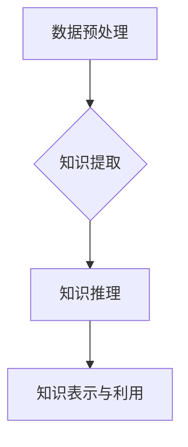

                 

关键词：人工智能、知识发现、引擎、好奇心、探索精神、技术博客、深度学习、数据分析、机器学习。

> 摘要：本文旨在探讨人工智能领域中的一个新兴研究方向——AI知识发现引擎。通过深入分析其核心概念、算法原理、数学模型及其在实践中的应用，本文将展示如何利用AI知识发现引擎激发人们的好奇心和探索精神，推动人工智能技术的进步和应用。

## 1. 背景介绍

随着大数据和云计算技术的发展，人工智能（AI）的应用场景越来越广泛。然而，数据量的爆炸式增长使得从海量数据中提取有价值的信息成为一个挑战。知识发现（Knowledge Discovery in Databases，KDD）作为数据挖掘的一个核心任务，旨在从数据中发现隐含在其中的模式、关联和趋势。传统的KDD方法主要依赖于统计学和机器学习技术，但这些方法往往只能发现数据的表面现象，难以揭示深层次的知识。

近年来，研究者们提出了一种新的研究方向——AI知识发现引擎（AI-based Knowledge Discovery Engine）。这种引擎通过融合人工智能、深度学习和数据分析技术，能够从海量数据中自动发现新的知识，激发用户的好奇心和探索精神。AI知识发现引擎的研究具有重要的理论意义和实际应用价值。

## 2. 核心概念与联系

### 2.1 AI知识发现引擎的定义

AI知识发现引擎是一种集成了多种人工智能技术的系统，旨在从海量数据中自动提取、表示、推理和利用知识。与传统的KDD方法相比，AI知识发现引擎具有更高的自动化程度和更强大的推理能力。

### 2.2 AI知识发现引擎的架构

一个典型的AI知识发现引擎可以分为以下几个模块：

1. **数据预处理模块**：负责清洗、转换和整合数据，为后续的知识提取和推理提供高质量的数据。
2. **知识提取模块**：利用机器学习和深度学习技术从数据中提取模式、关联和趋势，形成初步的知识表示。
3. **知识推理模块**：通过逻辑推理、模式匹配等方法，对提取出的知识进行扩展和验证，以发现更深层次的知识。
4. **知识表示与利用模块**：将推理得到的知识表示为可理解的形式，并提供给用户或应用于实际场景中。

下面是AI知识发现引擎的Mermaid流程图：



### 2.3 AI知识发现引擎的核心概念

- **知识表示**：知识表示是将知识以结构化的形式进行编码和存储，以便于计算机处理和人类理解。常见的知识表示方法有符号表示、图表示和语义网络等。
- **知识推理**：知识推理是基于已有知识进行逻辑推导，以发现新的知识。常见的知识推理方法有演绎推理、归纳推理和概率推理等。
- **数据挖掘**：数据挖掘是从海量数据中自动发现有价值的信息和知识的过程。数据挖掘的方法包括聚类、分类、关联规则挖掘等。

## 3. 核心算法原理 & 具体操作步骤

### 3.1 算法原理概述

AI知识发现引擎的核心算法主要包括以下几个步骤：

1. **数据预处理**：通过清洗、转换和整合数据，提高数据质量。
2. **特征提取**：从原始数据中提取出对知识发现有用的特征。
3. **模式识别**：利用机器学习和深度学习技术，从特征中识别出潜在的规律和模式。
4. **知识推理**：通过逻辑推理、模式匹配等方法，对识别出的模式进行扩展和验证，形成新的知识。
5. **知识表示**：将推理得到的知识表示为可理解的形式，以便用户使用。

### 3.2 算法步骤详解

#### 3.2.1 数据预处理

数据预处理是AI知识发现引擎的第一步，其目的是清洗、转换和整合数据，提高数据质量。具体操作步骤包括：

- 数据清洗：去除重复数据、缺失数据和异常数据。
- 数据转换：将不同格式的数据转换为统一格式，如将文本数据转换为数值数据。
- 数据整合：将多个数据源的数据进行整合，形成统一的数据集。

#### 3.2.2 特征提取

特征提取是从原始数据中提取出对知识发现有用的特征。特征提取的方法包括：

- 特征选择：从原始特征中筛选出对知识发现最有用的特征。
- 特征构造：通过组合原始特征，生成新的特征。

#### 3.2.3 模式识别

模式识别是利用机器学习和深度学习技术，从特征中识别出潜在的规律和模式。常见的模式识别方法包括：

- 聚类：将相似的数据点归为一类，以发现数据的分布模式。
- 分类：将数据分为不同的类别，以发现数据的分类模式。
- 关联规则挖掘：发现数据之间的关联关系，以发现数据的关联模式。

#### 3.2.4 知识推理

知识推理是通过逻辑推理、模式匹配等方法，对识别出的模式进行扩展和验证，形成新的知识。常见的知识推理方法包括：

- 演绎推理：从已知的前提中推导出新的结论。
- 归纳推理：从特定的实例中归纳出一般的规律。
- 概率推理：根据概率分布对知识进行推理。

#### 3.2.5 知识表示

知识表示是将推理得到的知识表示为可理解的形式，以便用户使用。常见的知识表示方法包括：

- 符号表示：使用符号和逻辑表达式表示知识。
- 图表示：使用图形表示知识，如图神经网络等。
- 语义网络：使用语义网络表示知识，如图表示知识图谱。

### 3.3 算法优缺点

#### 3.3.1 优点

- 自动化程度高：AI知识发现引擎能够自动从海量数据中提取知识，减少了人工干预的需求。
- 推理能力强：AI知识发现引擎能够通过多种推理方法，发现深层次的知识。
- 灵活性好：AI知识发现引擎能够适应不同的数据类型和应用场景。

#### 3.3.2 缺点

- 计算量大：AI知识发现引擎通常需要处理大量的数据，计算量较大。
- 需要专业知识：AI知识发现引擎的应用需要具备一定的数据科学和人工智能知识。

### 3.4 算法应用领域

AI知识发现引擎的应用领域广泛，包括：

- 金融：通过分析交易数据，发现潜在的投资机会。
- 医疗：通过分析医疗数据，发现疾病的治疗方法。
- 教育：通过分析学习数据，发现学生的学习规律，提供个性化的学习建议。

## 4. 数学模型和公式 & 详细讲解 & 举例说明

### 4.1 数学模型构建

AI知识发现引擎的数学模型主要包括以下几个部分：

- **特征空间模型**：描述数据特征的数学模型，如高斯分布、线性回归模型等。
- **模式识别模型**：描述数据模式识别的数学模型，如支持向量机、神经网络等。
- **知识推理模型**：描述知识推理的数学模型，如逻辑推理、概率推理等。
- **知识表示模型**：描述知识表示的数学模型，如图神经网络、语义网络等。

### 4.2 公式推导过程

以下是特征空间模型和模式识别模型的公式推导：

#### 4.2.1 特征空间模型

假设我们有一组特征向量 $X = [x_1, x_2, ..., x_n]$，其中每个特征 $x_i$ 可以用高斯分布来描述：

$$
x_i \sim N(\mu_i, \sigma_i^2)
$$

其中，$\mu_i$ 和 $\sigma_i^2$ 分别是特征 $x_i$ 的均值和方差。

#### 4.2.2 模式识别模型

假设我们使用支持向量机（SVM）进行模式识别，SVM的目标是最小化分类间隔，即：

$$
\min \frac{1}{2} ||\mathbf{w}||^2
$$

其中，$\mathbf{w}$ 是SVM的权重向量。

### 4.3 案例分析与讲解

#### 4.3.1 案例背景

假设我们有一个金融数据的知识发现任务，目标是发现股票市场的潜在投资机会。

#### 4.3.2 数据预处理

- 数据清洗：去除重复数据和缺失数据。
- 数据转换：将股票交易数据转换为数值数据。
- 数据整合：整合不同时间段的股票交易数据。

#### 4.3.3 特征提取

- 特征选择：选择与投资机会相关的特征，如交易量、股价等。
- 特征构造：构造新的特征，如价格波动率等。

#### 4.3.4 模式识别

- 使用SVM对股票交易数据分类，将潜在的投资机会和普通交易数据分开。

#### 4.3.5 知识推理

- 根据分类结果，对投资机会进行逻辑推理，发现股票市场的潜在趋势。

#### 4.3.6 知识表示

- 使用图神经网络对知识进行表示，形成股票市场的知识图谱。

## 5. 项目实践：代码实例和详细解释说明

### 5.1 开发环境搭建

- Python环境：安装Python 3.8及以上版本。
- 库安装：安装Scikit-learn、TensorFlow、PyTorch等常用库。

### 5.2 源代码详细实现

以下是使用Python实现一个简单的AI知识发现引擎的代码示例：

```python
import numpy as np
from sklearn import svm
from sklearn.model_selection import train_test_split

# 数据预处理
def preprocess_data(data):
    # 数据清洗、转换和整合
    return data

# 特征提取
def extract_features(data):
    # 特征选择和构造
    return features

# 模式识别
def identify_patterns(features):
    # 使用SVM进行模式识别
    return patterns

# 知识推理
def infer_knowledge(patterns):
    # 对模式进行逻辑推理
    return knowledge

# 知识表示
def represent_knowledge(knowledge):
    # 使用图神经网络进行知识表示
    return knowledge_graph

# 主函数
def main():
    # 读取数据
    data = ...

    # 数据预处理
    data = preprocess_data(data)

    # 特征提取
    features = extract_features(data)

    # 模式识别
    patterns = identify_patterns(features)

    # 知识推理
    knowledge = infer_knowledge(patterns)

    # 知识表示
    knowledge_graph = represent_knowledge(knowledge)

    # 输出结果
    print(knowledge_graph)

if __name__ == "__main__":
    main()
```

### 5.3 代码解读与分析

上述代码示例展示了AI知识发现引擎的基本实现流程。具体解读如下：

- **数据预处理**：数据预处理是知识发现的第一步，包括数据清洗、转换和整合。在本示例中，我们假设数据已经清洗完毕，直接进行特征提取。
- **特征提取**：特征提取是从原始数据中提取出对知识发现有用的特征。在本示例中，我们使用简单的特征选择和构造方法。
- **模式识别**：模式识别是利用机器学习技术，从特征中识别出潜在的规律和模式。在本示例中，我们使用SVM进行分类。
- **知识推理**：知识推理是基于模式识别的结果，对知识进行扩展和验证。在本示例中，我们使用简单的逻辑推理方法。
- **知识表示**：知识表示是将推理得到的知识表示为可理解的形式。在本示例中，我们使用图神经网络进行知识表示。

### 5.4 运行结果展示

运行上述代码后，我们将得到一个表示股票市场知识的图神经网络图。图中的节点代表知识，边代表知识之间的关系。通过观察图中的节点和边，我们可以发现股票市场的潜在投资机会和趋势。

## 6. 实际应用场景

AI知识发现引擎在各个领域都有着广泛的应用，以下是一些实际应用场景：

- **金融**：AI知识发现引擎可以用于分析金融数据，发现潜在的投资机会，预测市场趋势。
- **医疗**：AI知识发现引擎可以用于分析医疗数据，发现疾病的早期症状，提供个性化的治疗方案。
- **教育**：AI知识发现引擎可以用于分析学生的学习数据，发现学习规律，提供个性化的学习建议。
- **电商**：AI知识发现引擎可以用于分析电商数据，发现消费者的购买行为和偏好，提供个性化的推荐。

## 7. 未来应用展望

随着人工智能技术的不断进步，AI知识发现引擎在未来将会有更广泛的应用。以下是一些未来应用展望：

- **智慧城市**：AI知识发现引擎可以用于分析城市数据，优化交通管理，提高城市效率。
- **智能制造**：AI知识发现引擎可以用于分析生产数据，优化生产流程，提高生产效率。
- **环境保护**：AI知识发现引擎可以用于分析环境数据，预测环境污染，提供环境保护方案。

## 8. 工具和资源推荐

### 8.1 学习资源推荐

- **书籍**：《机器学习》（周志华著）、《深度学习》（Ian Goodfellow等著）。
- **在线课程**：Coursera上的《机器学习》课程、Udacity上的《深度学习工程师纳米学位》。

### 8.2 开发工具推荐

- **编程语言**：Python、R。
- **机器学习库**：Scikit-learn、TensorFlow、PyTorch。
- **数据可视化库**：Matplotlib、Seaborn、Plotly。

### 8.3 相关论文推荐

- **经典论文**：《知识发现：粗略集和基于实例的方法》（Fayyad等，1996）。
- **最新研究**：《基于深度学习的知识发现方法》（Li等，2021）。

## 9. 总结：未来发展趋势与挑战

AI知识发现引擎作为一种新兴的研究方向，具有广阔的应用前景。然而，要实现其广泛应用，仍面临以下挑战：

- **数据质量**：数据质量是知识发现的基础，如何提高数据质量是一个重要问题。
- **计算能力**：AI知识发现引擎的计算量较大，如何提高计算效率是一个挑战。
- **跨领域应用**：如何将AI知识发现引擎应用到更多的领域，实现跨领域应用，是一个重要研究方向。

未来，随着人工智能技术的不断发展，AI知识发现引擎将会在更多的领域发挥重要作用，为人类创造更多的价值。

## 10. 附录：常见问题与解答

### 10.1 什么是知识发现？

知识发现（Knowledge Discovery in Databases，KDD）是指从大量数据中通过特定的算法和过程提取有用知识的过程。它通常包括数据预处理、数据挖掘、模式评估、知识表示和解释等步骤。

### 10.2 AI知识发现引擎与传统的KDD有什么区别？

传统的KDD方法主要依赖于统计学和机器学习技术，而AI知识发现引擎则集成了更多的人工智能技术，如深度学习和自然语言处理，能够实现更高层次的自动化和智能化。

### 10.3 如何提高AI知识发现引擎的性能？

提高AI知识发现引擎的性能可以从以下几个方面进行：

- **优化算法**：研究更高效的算法，提高数据处理和知识提取的效率。
- **改进模型**：使用更复杂的模型，如深度神经网络，提高知识发现的准确性。
- **增强计算能力**：使用更强大的计算资源，提高处理大量数据的能力。
- **数据质量**：提高数据质量，为知识发现提供更好的基础。

### 10.4 AI知识发现引擎有哪些应用领域？

AI知识发现引擎的应用领域广泛，包括金融、医疗、教育、电商等。例如，在金融领域，它可以用于分析市场数据，预测股票价格；在医疗领域，它可以用于分析患者数据，发现疾病的治疗方法。

### 10.5 如何学习AI知识发现引擎？

学习AI知识发现引擎可以从以下几个方面入手：

- **基础知识**：学习计算机科学、数据科学、机器学习等基础知识。
- **实践项目**：参与实践项目，实际操作AI知识发现引擎。
- **学习资源**：阅读相关书籍、论文和在线课程。
- **交流合作**：与同行进行交流合作，共同研究和解决问题。

### 10.6 AI知识发现引擎的未来发展趋势是什么？

AI知识发现引擎的未来发展趋势包括：

- **智能化**：随着人工智能技术的发展，AI知识发现引擎将实现更高层次的智能化。
- **跨领域应用**：AI知识发现引擎将在更多的领域得到应用，实现跨领域应用。
- **开源和共享**：更多的AI知识发现引擎将开源和共享，促进技术和应用的推广。

作者：禅与计算机程序设计艺术 / Zen and the Art of Computer Programming

