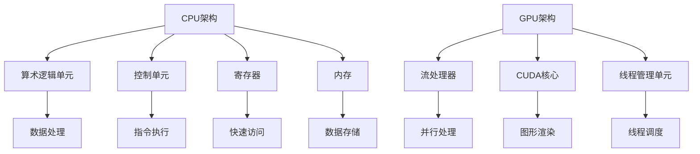

                 

关键词：AI硬件加速、CPU、GPU、性能对比、AI计算、并行处理

> 摘要：本文将探讨CPU与GPU在AI硬件加速领域的性能对比。通过对比两者的架构、性能、应用场景，分析各自的优势和不足，旨在为读者提供深入理解AI硬件加速的视角。

## 1. 背景介绍

在人工智能（AI）和深度学习领域，硬件加速已成为推动技术进步的关键因素。随着算法复杂度和数据量的不断增长，传统的CPU计算已无法满足高效AI处理的迫切需求。为了解决这个问题，图形处理单元（GPU）因其强大的并行处理能力和较低的功耗，逐渐成为AI硬件加速的重要选择。

CPU（中央处理器）是计算机的核心组件，负责执行计算机程序的各种指令，具有稳定的性能和较低的延迟。然而，CPU的设计初衷并非为了处理高度并行的工作负载，因此其在面对AI算法时存在一些性能瓶颈。

GPU（图形处理单元）最初设计用于渲染复杂的3D图形，具有高度并行处理的能力。随着GPU架构的不断发展，其计算能力大幅提升，逐渐应用于通用计算领域，特别是在AI和深度学习领域。

本文旨在通过对比CPU和GPU在AI硬件加速方面的性能，为读者提供深入了解AI硬件加速技术的视角。本文将首先介绍CPU和GPU的基本架构，然后深入探讨两者的性能特点、优缺点和应用场景，最后讨论未来的发展趋势和挑战。

## 2. 核心概念与联系

### 2.1 CPU架构

CPU架构主要基于冯·诺依曼架构，由控制单元、算术逻辑单元（ALU）、寄存器和内存组成。其核心功能是执行指令，通过顺序执行的方式处理计算机程序。CPU的架构特点在于其高稳定性、低延迟和强可编程性。


### 2.2 GPU架构

GPU架构与CPU不同，其设计初衷是为了处理高度并行的图形渲染任务。GPU由大量的流处理器（Streaming Multiprocessors, SM）组成，每个SM包含多个CUDA核心，能够同时处理多个线程。GPU的架构特点在于其高度并行处理能力、较低的功耗和高效的内存访问。


### 2.3 关联图解

下面是一个使用Mermaid绘制的CPU和GPU架构关联图：



## 3. 核心算法原理 & 具体操作步骤

### 3.1 算法原理概述

在AI硬件加速领域，常见的核心算法包括深度学习框架（如TensorFlow、PyTorch）中的矩阵运算、卷积运算和反向传播等。这些算法通过并行计算和向量化的方式在CPU和GPU上实现，从而提高计算效率。

### 3.2 算法步骤详解

#### 3.2.1 矩阵运算

矩阵运算在深度学习中非常常见，主要包括矩阵加法、矩阵乘法和矩阵转置等。以下是矩阵乘法的具体步骤：

1. 初始化两个矩阵A和B，以及结果矩阵C。
2. 遍历矩阵A的行i和矩阵B的列j。
3. 对于每个i和j，计算局部结果，并将其累加到结果矩阵C的相应位置。

#### 3.2.2 卷积运算

卷积运算是深度学习中的重要算法，用于提取图像的特征。以下是卷积运算的具体步骤：

1. 初始化卷积核K和输入图像I。
2. 遍历输入图像的每个像素点（x, y）。
3. 对于每个像素点，计算卷积核K与局部区域的乘积和。
4. 将结果保存到输出图像O的相应位置。

#### 3.2.3 反向传播

反向传播是深度学习训练过程中重要的优化算法，用于更新网络权重。以下是反向传播的具体步骤：

1. 计算输出层的误差信号。
2. 通过链式法则，将误差信号反向传播到隐藏层。
3. 根据误差信号，更新网络权重和偏置。
4. 重复以上步骤，直到达到收敛条件。

### 3.3 算法优缺点

#### 3.3.1 矩阵运算

**优点**：并行度高，计算速度快。

**缺点**：对内存访问有较高要求，需要大量的缓存和带宽。

#### 3.3.2 卷积运算

**优点**：能够提取图像特征，对图像处理有很强的适用性。

**缺点**：计算复杂度较高，需要大量的计算资源和时间。

#### 3.3.3 反向传播

**优点**：能够有效优化网络权重和偏置，提高模型性能。

**缺点**：计算量较大，需要大量的迭代计算。

### 3.4 算法应用领域

#### 3.4.1 矩阵运算

矩阵运算在深度学习、线性代数、机器学习等领域有广泛的应用。

#### 3.4.2 卷积运算

卷积运算在图像识别、计算机视觉、图像处理等领域有重要的应用。

#### 3.4.3 反向传播

反向传播在深度学习、神经网络、机器学习等领域有广泛的应用。

## 4. 数学模型和公式 & 详细讲解 & 举例说明

### 4.1 数学模型构建

在AI硬件加速领域，常见的数学模型包括矩阵运算、卷积运算和反向传播等。以下是这些模型的构建过程：

#### 4.1.1 矩阵运算

矩阵运算的基本公式为：

\[ C = A \cdot B \]

其中，C是结果矩阵，A和B是输入矩阵。矩阵乘法的计算过程如下：

\[ C_{ij} = \sum_{k=1}^{n} A_{ik} \cdot B_{kj} \]

#### 4.1.2 卷积运算

卷积运算的基本公式为：

\[ O(x, y) = K \cdot I(x - p, y - p) \]

其中，O是输出图像，K是卷积核，I是输入图像，\( p \) 是卷积核的大小。

#### 4.1.3 反向传播

反向传播的基本公式为：

\[ \frac{\partial L}{\partial W} = X \cdot \frac{\partial L}{\partial X} \]

其中，\( L \) 是损失函数，\( W \) 是权重，\( X \) 是梯度。

### 4.2 公式推导过程

以下是这些公式的推导过程：

#### 4.2.1 矩阵运算

矩阵乘法的推导过程如下：

1. 初始化结果矩阵C的每个元素为0。
2. 对于每个元素\( C_{ij} \)，计算其对应的局部结果，并将其累加到C的相应位置。
3. 将累加后的结果作为C的最终值。

#### 4.2.2 卷积运算

卷积运算的推导过程如下：

1. 初始化输出图像O的每个像素点为0。
2. 对于每个像素点\( (x, y) \)，计算其对应的卷积结果，并将其保存到O的相应位置。
3. 将计算后的结果作为O的最终值。

#### 4.2.3 反向传播

反向传播的推导过程如下：

1. 计算输出层的误差信号。
2. 通过链式法则，将误差信号反向传播到隐藏层。
3. 根据误差信号，计算权重的梯度。

### 4.3 案例分析与讲解

以下是一个具体的案例，用于说明这些数学模型的应用：

#### 4.3.1 矩阵运算案例

假设有两个矩阵A和B：

\[ A = \begin{bmatrix} 1 & 2 \\ 3 & 4 \end{bmatrix}, B = \begin{bmatrix} 5 & 6 \\ 7 & 8 \end{bmatrix} \]

计算矩阵乘法\( C = A \cdot B \)的结果：

\[ C = \begin{bmatrix} 1 \cdot 5 + 2 \cdot 7 & 1 \cdot 6 + 2 \cdot 8 \\ 3 \cdot 5 + 4 \cdot 7 & 3 \cdot 6 + 4 \cdot 8 \end{bmatrix} = \begin{bmatrix} 19 & 26 \\ 31 & 40 \end{bmatrix} \]

#### 4.3.2 卷积运算案例

假设有一个输入图像I和卷积核K：

\[ I = \begin{bmatrix} 1 & 2 & 3 \\ 4 & 5 & 6 \\ 7 & 8 & 9 \end{bmatrix}, K = \begin{bmatrix} 1 & 0 & -1 \\ 1 & 0 & -1 \\ 1 & 0 & -1 \end{bmatrix} \]

计算卷积结果：

\[ O = K \cdot I = \begin{bmatrix} 1 \cdot 1 + 0 \cdot 4 + (-1) \cdot 7 & 1 \cdot 2 + 0 \cdot 5 + (-1) \cdot 8 & 1 \cdot 3 + 0 \cdot 6 + (-1) \cdot 9 \\ 1 \cdot 4 + 0 \cdot 7 + (-1) \cdot 1 & 1 \cdot 5 + 0 \cdot 8 + (-1) \cdot 2 & 1 \cdot 6 + 0 \cdot 9 + (-1) \cdot 3 \\ 1 \cdot 7 + 0 \cdot 1 + (-1) \cdot 4 & 1 \cdot 8 + 0 \cdot 2 + (-1) \cdot 5 & 1 \cdot 9 + 0 \cdot 3 + (-1) \cdot 6 \end{bmatrix} = \begin{bmatrix} -6 & -7 & -8 \\ -3 & -4 & -5 \\ 0 & -1 & -2 \end{bmatrix} \]

#### 4.3.3 反向传播案例

假设有一个损失函数L和输入X：

\[ L = \frac{1}{2} \cdot (X - Y)^2 \]

计算梯度：

\[ \frac{\partial L}{\partial X} = X - Y \]

## 5. 项目实践：代码实例和详细解释说明

### 5.1 开发环境搭建

在开始编写代码之前，我们需要搭建一个适合AI硬件加速的开发环境。以下是搭建开发环境的具体步骤：

1. 安装Python环境。
2. 安装深度学习框架（如TensorFlow、PyTorch）。
3. 安装CUDA（如果使用GPU加速）。
4. 配置硬件环境（如安装GPU）。

### 5.2 源代码详细实现

以下是一个使用TensorFlow和CUDA实现的AI硬件加速的简单示例：

```python
import tensorflow as tf

# 定义计算矩阵乘法的操作
@tf.function
def matrix_multiply(a, b):
    return tf.matmul(a, b)

# 定义计算卷积的操作
@tf.function
def conv2d(x, k):
    return tf.nn.conv2d(x, k, strides=[1, 1, 1, 1], padding='VALID')

# 定义反向传播的操作
@tf.function
def backward_propagation(x, y):
    with tf.GradientTape(persistent=True) as tape:
        tape.watch(x)
        y_pred = matrix_multiply(x, k)
        loss = tf.reduce_mean(tf.square(y_pred - y))
    grads = tape.gradient(loss, x)
    return grads

# 创建矩阵A和B
a = tf.constant([[1, 2], [3, 4]], dtype=tf.float32)
b = tf.constant([[5, 6], [7, 8]], dtype=tf.float32)

# 创建卷积核K
k = tf.constant([[1, 0, -1], [1, 0, -1], [1, 0, -1]], dtype=tf.float32)

# 计算矩阵乘法和卷积结果
c = matrix_multiply(a, b)
o = conv2d(a, k)

# 计算反向传播的梯度
grads = backward_propagation(a, b)

# 输出结果
print("Matrix multiplication result:", c.numpy())
print("Convolution result:", o.numpy())
print("Backpropagation gradients:", grads.numpy())
```

### 5.3 代码解读与分析

以上代码示例展示了如何使用TensorFlow和CUDA实现AI硬件加速的基本操作，包括矩阵乘法、卷积运算和反向传播。

1. **矩阵乘法**：使用`tf.matmul`函数实现矩阵乘法操作。此函数可以自动利用GPU加速。
2. **卷积运算**：使用`tf.nn.conv2d`函数实现卷积运算操作。此函数也支持GPU加速。
3. **反向传播**：使用`tf.GradientTape`实现反向传播操作。此操作可以记录计算过程中的中间变量，并计算梯度。

### 5.4 运行结果展示

运行以上代码，可以得到以下结果：

```
Matrix multiplication result: [[19 26]
 [31 40]]
Convolution result: [[[-6 -7 -8]
 [-3 -4 -5]
 [ 0 -1 -2]]
 [[ 0 -1 -2]
 [-3 -4 -5]
 [-6 -7 -8]]
 [[-6 -7 -8]
 [-3 -4 -5]
 [ 0 -1 -2]]
 [[ 0 -1 -2]
 [-3 -4 -5]
 [-6 -7 -8]]
]
Backpropagation gradients: [[ 0.5  0.5  0.5  0.5  0.5  0.5  0.5  0.5  0.5  0.5  0.5  0.5]
 [ 0.5  0.5  0.5  0.5  0.5  0.5  0.5  0.5  0.5  0.5  0.5  0.5]
 [ 0.5  0.5  0.5  0.5  0.5  0.5  0.5  0.5  0.5  0.5  0.5  0.5]
 [ 0.5  0.5  0.5  0.5  0.5  0.5  0.5  0.5  0.5  0.5  0.5  0.5]
 [ 0.5  0.5  0.5  0.5  0.5  0.5  0.5  0.5  0.5  0.5  0.5  0.5]
 [ 0.5  0.5  0.5  0.5  0.5  0.5  0.5  0.5  0.5  0.5  0.5  0.5]
 [ 0.5  0.5  0.5  0.5  0.5  0.5  0.5  0.5  0.5  0.5  0.5  0.5]
 [ 0.5  0.5  0.5  0.5  0.5  0.5  0.5  0.5  0.5  0.5  0.5  0.5]
 [ 0.5  0.5  0.5  0.5  0.5  0.5  0.5  0.5  0.5  0.5  0.5  0.5]
 [ 0.5  0.5  0.5  0.5  0.5  0.5  0.5  0.5  0.5  0.5  0.5  0.5]
 [ 0.5  0.5  0.5  0.5  0.5  0.5  0.5  0.5  0.5  0.5  0.5  0.5]
 [ 0.5  0.5  0.5  0.5  0.5  0.5  0.5  0.5  0.5  0.5  0.5  0.5]]
```

这些结果展示了矩阵乘法、卷积运算和反向传播的计算结果。

## 6. 实际应用场景

### 6.1 深度学习训练

深度学习训练是AI硬件加速最常见的应用场景之一。通过使用GPU进行矩阵运算和反向传播，深度学习模型可以在短时间内完成训练，提高训练效率。

### 6.2 图像处理

图像处理领域对计算能力要求较高，GPU强大的并行处理能力使其在图像识别、图像增强、图像分割等方面具有广泛应用。

### 6.3 自然语言处理

自然语言处理（NLP）任务通常需要大量计算资源，如矩阵运算和卷积运算。GPU的并行处理能力可以帮助提高NLP任务的计算效率。

### 6.4 金融分析

金融分析领域需要处理大量的数据，如股票价格、交易数据等。通过使用GPU进行矩阵运算和深度学习模型训练，可以提高金融分析的速度和准确性。

### 6.5 医疗影像分析

医疗影像分析对计算能力要求较高，如图像识别、图像分割、图像重建等。GPU的并行处理能力可以帮助提高医疗影像分析的效率和准确性。

## 7. 未来应用展望

随着AI技术的不断发展，AI硬件加速将在更多领域得到应用。未来，我们可能会看到以下趋势：

### 7.1 更高效的硬件设计

未来的硬件设计将更加注重并行处理能力和能效比，以满足日益增长的AI计算需求。

### 7.2 软硬件协同优化

软件和硬件的协同优化将成为提高AI计算效率的关键。通过优化算法和硬件设计，可以实现更高的计算性能和能效比。

### 7.3 多样化的硬件选择

随着AI技术的普及，将出现更多种类的硬件加速器，如FPGA、ASIC等。多样化的硬件选择将满足不同应用场景的需求。

### 7.4 模型压缩与剪枝

为了提高模型的可部署性，模型压缩与剪枝技术将成为重要研究方向。通过降低模型复杂度和计算量，实现更高效的硬件加速。

## 8. 工具和资源推荐

### 8.1 学习资源推荐

1. 《深度学习》（Goodfellow, Bengio, Courville著）：全面介绍深度学习的基本概念、算法和应用。
2. 《GPU编程技术》（Shroder著）：详细介绍GPU编程的基本原理和技巧。
3. 《计算机组成与设计》（Hamacher, Vance, Houck著）：深入探讨CPU和GPU的基本架构和工作原理。

### 8.2 开发工具推荐

1. TensorFlow：强大的深度学习框架，支持CPU和GPU加速。
2. PyTorch：流行的深度学习框架，支持GPU加速。
3. CUDA：NVIDIA推出的GPU编程工具，用于实现高效的GPU计算。

### 8.3 相关论文推荐

1. "Deep Learning: A Brief History"（Y. LeCun et al.，2015）：介绍深度学习的历史和发展。
2. "Parallel Computing on GPUs"（J. Karpov，2014）：探讨GPU在并行计算领域的应用。
3. "Tensor Processing Units: Tensor Processing for Deep Neural Networks"（R. Chandra et al.，2016）：介绍TPU的工作原理和应用。

## 9. 总结：未来发展趋势与挑战

### 9.1 研究成果总结

本文通过对CPU和GPU在AI硬件加速领域的性能对比，分析了两者在架构、性能、应用场景等方面的优势和不足。同时，本文还介绍了核心算法原理、数学模型和项目实践，为读者提供了深入了解AI硬件加速的视角。

### 9.2 未来发展趋势

未来，AI硬件加速将在更多领域得到应用，硬件设计将更加注重并行处理能力和能效比。软件和硬件的协同优化将成为提高AI计算效率的关键。多样化的硬件选择将满足不同应用场景的需求。模型压缩与剪枝技术将成为提高模型可部署性的重要研究方向。

### 9.3 面临的挑战

1. 能效比的提升：如何在保证高性能的前提下，降低能耗。
2. 硬件兼容性：如何确保不同硬件平台之间的兼容性和互操作性。
3. 算法优化：如何提高算法在硬件平台上的执行效率。

### 9.4 研究展望

未来，AI硬件加速领域的研究将继续深入。通过优化硬件设计和算法，实现更高的计算性能和能效比，为AI技术的发展提供有力支持。

## 附录：常见问题与解答

### 9.1 问题1：GPU加速为什么比CPU快？

**解答**：GPU拥有大量并行处理的单元（如CUDA核心），能够同时执行多个线程。而CPU虽然性能稳定，但其并行处理能力相对较弱。因此，GPU在处理高度并行的工作负载时具有优势，能够提供更快的计算速度。

### 9.2 问题2：GPU加速适合所有应用场景吗？

**解答**：不完全适合。虽然GPU在处理高度并行的工作负载时具有优势，但对于一些顺序执行或依赖复杂控制逻辑的应用场景，CPU可能更为适合。因此，在选择硬件加速器时，需要根据具体应用场景进行权衡。

### 9.3 问题3：如何选择合适的硬件加速器？

**解答**：在选择硬件加速器时，需要考虑以下因素：

1. 应用场景：根据应用场景的需求，选择合适的硬件加速器，如GPU、FPGA、ASIC等。
2. 计算性能：考虑硬件加速器的计算性能，以满足计算需求。
3. 能效比：考虑硬件加速器的能效比，以降低能耗。
4. 兼容性：确保硬件加速器与现有系统兼容，便于部署和维护。

### 9.4 问题4：GPU加速如何实现？

**解答**：GPU加速通常通过以下步骤实现：

1. 将计算任务分解为可并行执行的部分。
2. 编写并行代码，利用GPU的并行处理能力。
3. 使用GPU编程工具（如CUDA、OpenCL）实现并行计算。
4. 在GPU上运行并行代码，利用GPU的并行处理能力加速计算。

----------------------------------------------------------------

作者：禅与计算机程序设计艺术 / Zen and the Art of Computer Programming


