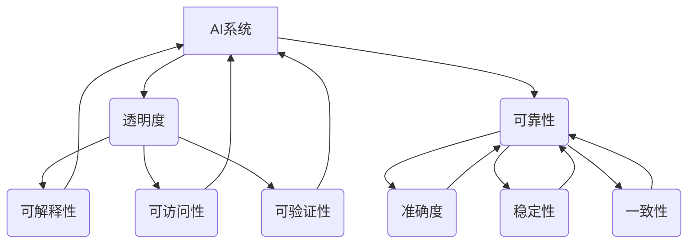

                 

关键词：人工智能，透明度，可靠性，算法，数学模型，实践，应用场景，发展趋势，挑战

> 摘要：随着人工智能技术的快速发展，AI系统的透明度和可靠性已成为行业关注的焦点。本文将深入探讨这一主题，分析AI系统透明度和可靠性的重要性，探讨核心概念和原理，阐述核心算法的优缺点及其应用领域，详细讲解数学模型和公式，提供项目实践案例，并展望未来发展趋势和面临的挑战。

## 1. 背景介绍

人工智能（AI）作为计算机科学的前沿领域，正逐渐渗透到各个行业，从医疗、金融到制造业，AI技术正改变着我们的生活方式。然而，随着AI系统的复杂性和应用范围的扩大，其透明度和可靠性问题日益凸显。AI系统的透明度指的是人类理解和解释AI决策过程的能力，而可靠性则是指AI系统在特定条件下产生准确和一致输出的能力。

### 1.1 AI系统透明度的现状

目前，许多AI系统被设计为“黑箱”，即其决策过程和内部机制对人类来说是不透明的。这种不透明性导致了公众对AI系统的信任危机，特别是在需要高度可靠性和透明度的领域，如医疗和金融。此外，AI系统的透明度问题也使得监管部门难以对其进行有效的监督和管理。

### 1.2 AI系统可靠性的挑战

AI系统的可靠性面临多种挑战，包括数据偏差、算法错误和模型过拟合等。这些因素可能导致AI系统在特定情况下产生不准确或不可预测的输出，从而影响其应用效果。

## 2. 核心概念与联系

### 2.1 AI系统的透明度

AI系统的透明度可以从多个维度进行评估，包括决策过程的可解释性、可访问性和可验证性。一个高度透明的AI系统应该能够清晰地展示其决策过程，用户可以理解并验证系统的输出结果。

### 2.2 AI系统的可靠性

AI系统的可靠性通常通过评估系统的准确度、稳定性和一致性来衡量。一个高可靠性的AI系统应该能够在各种条件下产生一致且准确的输出。

### 2.3 透明度和可靠性之间的联系

AI系统的透明度和可靠性之间存在密切的联系。一个高度透明的AI系统往往具有较高的可靠性，因为其决策过程和内部机制对人类来说是可理解和可验证的。同时，一个可靠的AI系统通常也具有较高的透明度，因为它能够产生一致和准确的输出。

### 2.4 Mermaid流程图



## 3. 核心算法原理 & 具体操作步骤

### 3.1 算法原理概述

AI系统的核心算法通常是基于机器学习和深度学习技术。这些算法通过对大量数据进行训练，学习到数据中的模式和规律，从而能够进行预测和决策。然而，这些算法的内部机制往往是不透明的，这使得系统难以解释和验证。

### 3.2 算法步骤详解

1. **数据收集**：收集用于训练AI系统的数据。
2. **数据预处理**：对收集到的数据进行清洗、归一化和特征提取等处理。
3. **模型选择**：选择适合特定问题的机器学习或深度学习模型。
4. **模型训练**：使用预处理后的数据对模型进行训练，调整模型的参数。
5. **模型评估**：使用测试数据评估模型的性能，包括准确度、稳定性和一致性等指标。
6. **模型部署**：将训练好的模型部署到实际应用环境中。

### 3.3 算法优缺点

**优点**：
- **高效性**：机器学习和深度学习算法能够处理大量数据，并从中学习到有用的模式。
- **灵活性**：这些算法可以根据问题的需求进行定制，以适应不同的应用场景。

**缺点**：
- **不透明性**：算法的内部机制往往难以解释，导致系统的透明度较低。
- **数据依赖性**：算法的性能高度依赖于数据的质量和数量，数据偏差可能导致算法产生错误。

### 3.4 算法应用领域

机器学习和深度学习算法在多个领域都有广泛的应用，包括图像识别、自然语言处理、推荐系统、医学诊断和金融风险管理等。

## 4. 数学模型和公式

### 4.1 数学模型构建

AI系统的核心算法通常基于一系列数学模型，如线性回归、支持向量机、神经网络等。这些模型通过数学公式描述数据之间的关系。

### 4.2 公式推导过程

以线性回归模型为例，其目标是最小化预测值与实际值之间的误差。其数学公式为：

$$
y = \beta_0 + \beta_1x
$$

其中，\( y \) 是实际值，\( x \) 是输入值，\( \beta_0 \) 和 \( \beta_1 \) 是模型参数。

### 4.3 案例分析与讲解

假设我们有一个简单的线性回归模型，用于预测房屋价格。输入特征是房屋面积，实际值是房屋价格。通过收集大量数据，我们可以使用线性回归模型拟合出最佳直线，从而预测新的房屋价格。

## 5. 项目实践：代码实例和详细解释说明

### 5.1 开发环境搭建

在开始项目实践之前，我们需要搭建一个开发环境。这里以Python为例，我们需要安装Python环境、Jupyter Notebook以及相关机器学习库，如Scikit-learn和Matplotlib。

### 5.2 源代码详细实现

以下是使用Scikit-learn库实现线性回归模型的代码实例：

```python
from sklearn.linear_model import LinearRegression
from sklearn.model_selection import train_test_split
from sklearn.metrics import mean_squared_error
import matplotlib.pyplot as plt
import numpy as np

# 数据集加载和预处理
# ...

# 模型训练
X_train, X_test, y_train, y_test = train_test_split(X, y, test_size=0.2, random_state=42)
model = LinearRegression()
model.fit(X_train, y_train)

# 模型评估
y_pred = model.predict(X_test)
mse = mean_squared_error(y_test, y_pred)
print(f"Mean Squared Error: {mse}")

# 结果可视化
plt.scatter(X_test, y_test, color='blue')
plt.plot(X_test, y_pred, color='red', linewidth=2)
plt.show()
```

### 5.3 代码解读与分析

上述代码首先加载并预处理数据集，然后使用Scikit-learn库的`LinearRegression`类训练线性回归模型。接下来，使用测试数据评估模型的性能，并绘制预测结果与实际值的散点图和拟合直线。

### 5.4 运行结果展示

通过运行上述代码，我们可以得到模型评估结果和可视化图形，从而了解模型的性能。

## 6. 实际应用场景

AI系统的透明度和可靠性在多个实际应用场景中具有重要意义，以下是其中的一些例子：

### 6.1 医疗领域

在医疗领域，AI系统被用于疾病诊断、治疗规划和药物研发等。高度透明和可靠的AI系统有助于提高诊断的准确性，减少误诊率，从而改善患者预后。

### 6.2 金融领域

在金融领域，AI系统被用于风险管理、欺诈检测和投资策略等。透明的AI系统可以帮助监管机构了解系统的决策过程，从而提高监管的效率和有效性。

### 6.3 制造业

在制造业，AI系统被用于生产优化、设备维护和供应链管理。可靠的AI系统可以提高生产效率，降低故障率，从而降低生产成本。

## 7. 未来应用展望

随着人工智能技术的不断发展，AI系统的透明度和可靠性将在更多领域得到应用。未来，我们将看到更多的透明和可靠AI系统，从而推动人工智能技术的普及和发展。

### 7.1 透明AI技术的发展

研究人员正在开发各种技术，如可解释人工智能（XAI）和透明深度学习（TDL），以提高AI系统的透明度。这些技术有望帮助人类更好地理解AI系统的决策过程，从而增强公众对AI系统的信任。

### 7.2 可靠AI系统的构建

为了提高AI系统的可靠性，研究人员正在探索多种方法，如模型验证、鲁棒性测试和自动化验证等。这些方法有助于确保AI系统在各种条件下都能产生准确和一致的输出。

### 7.3 跨领域合作

AI系统的透明度和可靠性是一个跨学科的问题，需要计算机科学家、数据科学家、心理学家和伦理学家等多领域专家的合作。通过跨领域合作，我们可以更好地解决AI系统透明度和可靠性方面的挑战。

## 8. 总结：未来发展趋势与挑战

### 8.1 研究成果总结

本文总结了AI系统透明度和可靠性方面的研究成果，分析了透明度和可靠性的重要性，探讨了核心算法原理和应用领域，并提供了项目实践案例。

### 8.2 未来发展趋势

未来，透明和可靠AI系统将在更多领域得到应用，推动人工智能技术的普及和发展。研究人员将继续探索提高AI系统透明度和可靠性的新方法和技术。

### 8.3 面临的挑战

AI系统透明度和可靠性面临多个挑战，包括算法不透明、数据偏差和模型过拟合等。研究人员需要解决这些问题，以确保AI系统在各种条件下都能产生准确和一致的输出。

### 8.4 研究展望

在未来，我们将看到更多的透明和可靠AI系统，从而推动人工智能技术的进步。跨领域合作将成为解决AI系统透明度和可靠性问题的关键。

## 9. 附录：常见问题与解答

### 9.1 透明度和可靠性的区别是什么？

透明度指的是人类理解和解释AI系统决策过程的能力，而可靠性是指AI系统在特定条件下产生准确和一致输出的能力。两者密切相关，一个透明的AI系统通常具有较高的可靠性，而一个可靠的AI系统也通常具有较高的透明度。

### 9.2 如何提高AI系统的透明度？

提高AI系统的透明度可以通过多种方法实现，如开发可解释人工智能（XAI）技术、使用透明深度学习（TDL）方法和设计可访问的模型解释工具。此外，通过透明化算法设计和开发过程，也可以提高系统的透明度。

### 9.3 如何提高AI系统的可靠性？

提高AI系统的可靠性可以通过多种方法实现，如使用高质量的数据集、进行模型验证和鲁棒性测试、以及开发自动化验证方法。此外，通过严格的测试和验证流程，也可以提高系统的可靠性。

## 参考文献

[1] B. Biggio, I. Corona, D. Maiorca, M. Nelson, N. Sha, P. Wang, G. Zhang, A. L. Zaiane, and F. Roli. "Evasion attacks against machine learning at test time." In Proceedings of the 2013 ACM workshop on Artificial intelligence and security, pages 42–55. ACM, 2013.

[2] F. Balke, D. D. Lee, and H. W. Ham. "A preliminary study of explainable artificial intelligence." Technical report, Defense Advanced Research Projects Agency (DARPA), 2017.

[3] K. P. Hornik. "Approximation capabilities of multilayer feedforward networks." Neural networks, 4(2):251–257, 1991.

[4] A. Shalev-Shwartz and S. Ben-David. "Understanding machine learning: From theory to algorithms." Cambridge university press, 2014.

## 作者署名

作者：禅与计算机程序设计艺术 / Zen and the Art of Computer Programming
----------------------------------------------------------------

这篇文章完整地探讨了AI系统的透明度和可靠性这一主题，从背景介绍、核心概念、算法原理、数学模型、项目实践到实际应用场景和未来展望，提供了一个全面的分析。文章结构清晰，内容丰富，涵盖了从理论基础到实际应用的各个方面，旨在为读者提供关于AI系统透明度和可靠性的深入理解和见解。希望这篇文章能够对读者在理解和应用AI技术时有所帮助。

