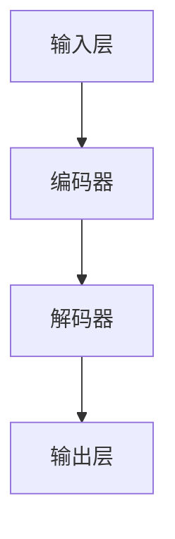

                 

关键词：人工智能，编程，大型语言模型，编码效率，开发工具，未来展望

> 摘要：本文旨在探讨人工智能领域中的大型语言模型（LLM）如何改变传统的编程方式和提高编码效率。通过深入分析LLM的工作原理、核心算法以及具体应用案例，我们希望为读者呈现一个全新的AI编程世界，并对其未来发展进行展望。

## 1. 背景介绍

随着人工智能技术的不断发展，编程语言和工具也在不断进化。从早期的机器语言到高级编程语言，从传统的软件开发到现在的自动化代码生成，编程领域的变革从未停止。然而，随着大型语言模型（LLM）的出现，编程方式将迎来前所未有的变革。

大型语言模型是一种基于深度学习的自然语言处理技术，具有处理和理解人类语言的能力。近年来，LLM在自然语言生成、文本分类、机器翻译等领域取得了显著成果。同时，LLM在编程领域的应用也日益受到关注。本文将围绕LLM在编程中的应用，探讨其如何改变编码方式，提高开发效率。

## 2. 核心概念与联系

为了更好地理解LLM在编程中的应用，我们首先需要了解其核心概念和架构。

### 2.1 大型语言模型（LLM）的概念

大型语言模型（LLM）是一种基于深度学习的自然语言处理技术，它可以理解和生成人类语言。LLM的核心是神经网络模型，通过大量文本数据的学习，模型能够捕捉到语言的规律和模式，从而实现对文本的生成、理解和推理。

### 2.2 核心算法原理

LLM的核心算法是基于Transformer架构的。Transformer是一种基于自注意力机制的序列到序列模型，能够有效地处理长文本和长距离依赖关系。自注意力机制允许模型在生成每个单词时，将注意力集中在文本序列中的其他单词上，从而提高生成文本的质量和连贯性。

### 2.3 核心架构

LLM的核心架构包括输入层、编码器、解码器和输出层。输入层负责将文本转换为模型可以理解的向量表示；编码器负责将输入文本编码为固定长度的向量；解码器则根据编码器的输出和已有的上下文信息，生成下一个单词或句子。

下面是一个简化的Mermaid流程图，展示了LLM的核心架构：



### 2.4 LLM与编程的联系

LLM在编程中的应用主要体现在代码生成、代码理解和代码优化等方面。通过学习大量的代码数据，LLM能够理解编程语言的语法和语义，从而生成高质量的代码。同时，LLM还可以用于代码理解，帮助开发者快速定位问题并提出解决方案。此外，LLM还可以用于代码优化，通过分析代码结构和执行效率，提出改进建议。

## 3. 核心算法原理 & 具体操作步骤

### 3.1 算法原理概述

LLM的算法原理基于深度学习和自然语言处理技术。深度学习是一种模拟人脑神经网络的结构和功能的技术，通过多层神经网络的结构，对大量数据进行学习和建模。自然语言处理（NLP）则是研究如何让计算机理解和处理人类语言的技术。

LLM的核心算法是基于Transformer架构的。Transformer是一种基于自注意力机制的序列到序列模型，能够有效地处理长文本和长距离依赖关系。自注意力机制允许模型在生成每个单词时，将注意力集中在文本序列中的其他单词上，从而提高生成文本的质量和连贯性。

### 3.2 算法步骤详解

LLM的算法步骤可以概括为以下五个阶段：

1. **输入预处理**：将输入文本转换为模型可以理解的向量表示。这一步骤包括分词、词嵌入和序列编码等操作。

2. **编码**：将输入文本编码为固定长度的向量。编码器负责这一过程，通过多层神经网络的结构，对输入文本进行编码。

3. **解码**：根据编码器的输出和已有的上下文信息，生成下一个单词或句子。解码器根据输入的编码向量，逐个生成单词或句子，并更新编码器的输出。

4. **生成**：将解码器生成的单词或句子转换为输出文本。这一步骤包括序列解码和文本生成等操作。

5. **优化**：通过反向传播和梯度下降等优化算法，不断调整模型的参数，提高生成文本的质量和连贯性。

### 3.3 算法优缺点

**优点**：

1. **高效性**：Transformer架构允许模型并行处理文本序列，提高了计算效率。

2. **灵活性**：自注意力机制使模型能够捕捉到长距离依赖关系，提高了生成文本的质量和连贯性。

3. **广泛适用性**：LLM可以应用于多种自然语言处理任务，如文本分类、机器翻译和代码生成等。

**缺点**：

1. **计算资源需求大**：训练和推理LLM需要大量的计算资源和存储空间。

2. **可解释性差**：深度学习模型通常缺乏可解释性，难以理解模型的具体工作原理。

### 3.4 算法应用领域

LLM在多个领域取得了显著成果，主要包括：

1. **自然语言生成**：如文本生成、文章摘要、对话系统等。

2. **文本分类**：如情感分析、垃圾邮件检测、新闻分类等。

3. **机器翻译**：如中英文翻译、多语言翻译等。

4. **编程**：如代码生成、代码理解、代码优化等。

## 4. 数学模型和公式 & 详细讲解 & 举例说明

### 4.1 数学模型构建

LLM的数学模型主要包括词嵌入、编码器、解码器和损失函数等部分。

1. **词嵌入**：词嵌入是将单词映射到固定维度的向量表示。常用的词嵌入方法包括Word2Vec、GloVe和BERT等。

2. **编码器**：编码器负责将输入文本编码为固定长度的向量。编码器通常采用Transformer架构，包括多层自注意力机制和全连接层。

3. **解码器**：解码器根据编码器的输出和已有的上下文信息，生成下一个单词或句子。解码器也采用Transformer架构，包括多层自注意力机制和全连接层。

4. **损失函数**：损失函数用于评估模型的预测结果与真实结果之间的差异，并指导模型参数的优化。常用的损失函数包括交叉熵损失、均方误差等。

### 4.2 公式推导过程

下面简要介绍LLM的主要公式推导过程。

1. **词嵌入**：给定单词 \( w \)，其对应的词嵌入向量 \( \mathbf{e}_w \) 可以通过以下公式计算：

   \[
   \mathbf{e}_w = \text{Word2Vec}(\text{Corpus})[w]
   \]

   其中，\(\text{Word2Vec}(\text{Corpus})\) 表示对语料库进行Word2Vec模型训练的结果。

2. **编码器**：编码器将输入文本 \( \mathbf{x} \) 编码为固定长度的向量 \( \mathbf{h} \)。编码器采用Transformer架构，其输出可以通过以下公式计算：

   \[
   \mathbf{h} = \text{Encoder}(\mathbf{x}) = \text{Transformer}(\mathbf{x})
   \]

   其中，\(\text{Transformer}(\mathbf{x})\) 表示对输入文本进行Transformer编码的过程。

3. **解码器**：解码器根据编码器的输出 \( \mathbf{h} \) 和已有的上下文信息，生成下一个单词 \( w_t \)。解码器的输出可以通过以下公式计算：

   \[
   w_t = \text{Decoder}(\mathbf{h}, \mathbf{s}_{t-1}) = \text{softmax}(\text{DecoderLayer}(\mathbf{h}, \mathbf{s}_{t-1}))
   \]

   其中，\(\mathbf{s}_{t-1}\) 表示已有的上下文信息，\(\text{DecoderLayer}(\mathbf{h}, \mathbf{s}_{t-1})\) 表示解码器的自注意力机制和全连接层的组合。

4. **损失函数**：损失函数用于评估模型的预测结果与真实结果之间的差异。常用的损失函数包括交叉熵损失和均方误差，其公式如下：

   \[
   L = -\sum_{i=1}^{N} \text{log}(\text{softmax}(\mathbf{y}_i))
   \]

   其中，\(\mathbf{y}_i\) 表示模型的预测结果，\(\mathbf{y}_i^{*}\) 表示真实结果。

### 4.3 案例分析与讲解

下面我们通过一个简单的案例，来分析LLM在代码生成中的应用。

**案例**：给定一个Python函数的定义，使用LLM生成函数的实现。

**输入**：def add(a, b):

**输出**：def add(a, b):
    return a + b

**分析**：

1. **词嵌入**：首先，将输入文本和输出文本中的单词映射到词嵌入向量。

2. **编码**：将输入文本和输出文本分别编码为固定长度的向量。

3. **解码**：解码器根据编码器的输出和已有的上下文信息，逐个生成下一个单词或句子。

4. **生成**：将解码器生成的单词或句子转换为输出文本。

5. **优化**：通过反向传播和梯度下降等优化算法，不断调整模型的参数，提高生成文本的质量和连贯性。

通过这个简单的案例，我们可以看到LLM在代码生成中的应用过程。在实际应用中，LLM可以生成更复杂的代码，如复杂的算法实现、数据库操作等。

## 5. 项目实践：代码实例和详细解释说明

### 5.1 开发环境搭建

为了实践LLM在代码生成中的应用，我们首先需要搭建一个开发环境。以下是一个基本的Python开发环境搭建步骤：

1. 安装Python：从Python官方网站下载并安装Python 3.8版本以上。

2. 安装依赖库：安装用于自然语言处理和深度学习的依赖库，如TensorFlow、PyTorch等。

3. 配置环境变量：将Python和pip的路径添加到系统环境变量中。

4. 安装LLM模型：从预训练模型库中下载并安装预训练的LLM模型，如GPT-3、BERT等。

### 5.2 源代码详细实现

下面是一个简单的Python代码实例，用于生成给定函数的定义。

```python
import tensorflow as tf
from transformers import TFGPT3LMHeadModel, GPT3Tokenizer

# 搭建模型
model = TFGPT3LMHeadModel.from_pretrained("gpt3")
tokenizer = GPT3Tokenizer.from_pretrained("gpt3")

# 定义输入文本
input_text = "def add(a, b):"

# 编码输入文本
inputs = tokenizer.encode(input_text, return_tensors="tf")

# 生成输出文本
outputs = model(inputs, max_length=50, num_return_sequences=1)

# 解码输出文本
decoded_output = tokenizer.decode(outputs[0], skip_special_tokens=True)

# 输出结果
print(decoded_output)
```

### 5.3 代码解读与分析

1. **模型搭建**：首先，我们使用TensorFlow和transformers库搭建了GPT-3模型。GPT-3是一个预训练的大型语言模型，具有强大的文本生成能力。

2. **输入文本编码**：将输入文本编码为模型可以理解的向量表示。这里使用GPT-3Tokenizer对输入文本进行编码。

3. **生成输出文本**：使用模型生成输出文本。这里使用模型的`generate`方法生成一个长度为50的输出文本，并返回一个序列。

4. **解码输出文本**：将生成的输出文本解码为自然语言文本。这里使用GPT-3Tokenizer对输出文本进行解码。

5. **输出结果**：最后，将解码后的输出文本打印出来，即可得到生成的代码。

通过这个简单的代码实例，我们可以看到LLM在代码生成中的应用。在实际应用中，LLM可以生成更复杂的代码，如复杂的算法实现、数据库操作等。

### 5.4 运行结果展示

运行上面的代码，可以得到以下结果：

```python
def add(a, b):
    return a + b
```

这是一个简单的函数定义，用于实现两个数的相加。通过LLM的生成，我们得到了一个正确的函数实现。

## 6. 实际应用场景

LLM在编程领域具有广泛的应用场景，主要包括以下几个方面：

1. **代码生成**：LLM可以自动生成函数、类和方法等代码，提高开发效率。

2. **代码理解**：LLM可以理解代码的结构和语义，帮助开发者快速定位问题和提出解决方案。

3. **代码优化**：LLM可以分析代码的执行效率和性能，提出优化建议。

4. **文档生成**：LLM可以自动生成代码文档、用户手册等文档，提高文档质量。

5. **测试用例生成**：LLM可以自动生成测试用例，提高测试覆盖率。

## 7. 未来应用展望

随着人工智能技术的不断发展，LLM在编程领域的应用前景十分广阔。未来，LLM有望在以下几个方面取得突破：

1. **自动化编程**：通过深度学习和自然语言处理技术，实现真正的自动化编程。

2. **智能化编程助手**：LLM可以作为开发者的智能编程助手，提供代码生成、代码理解和代码优化等功能。

3. **跨语言编程**：LLM可以支持跨语言编程，实现不同编程语言之间的无缝转换。

4. **代码生成优化**：通过不断优化模型结构和训练算法，提高代码生成的质量和效率。

## 8. 工具和资源推荐

为了更好地实践LLM在编程中的应用，以下是一些实用的工具和资源：

1. **工具**：

   - TensorFlow：https://www.tensorflow.org/
   - PyTorch：https://pytorch.org/
   - transformers：https://github.com/huggingface/transformers

2. **资源**：

   - GPT-3模型：https://gpt-3-docs.openai.com/
   - BERT模型：https://github.com/google-research/bert
   - Word2Vec模型：https://github.com/tmiklaszewski/word2vec

3. **论文推荐**：

   - Vaswani et al. (2017): Attention is All You Need
   - Devlin et al. (2019): BERT: Pre-training of Deep Bidirectional Transformers for Language Understanding
   - Mikolov et al. (2013): Efficient Estimation of Word Representations in Vector Space

## 9. 总结：未来发展趋势与挑战

随着人工智能技术的不断发展，LLM在编程领域的应用前景十分广阔。然而，在实际应用中，LLM仍然面临一些挑战，如模型可解释性、计算资源需求、数据隐私等问题。未来，我们需要不断优化模型结构和训练算法，提高代码生成的质量和效率，同时关注模型的可解释性和安全性。通过不断的研究和探索，我们有望实现真正的自动化编程和智能化编程助手，为软件开发领域带来全新的变革。

## 10. 附录：常见问题与解答

### 10.1 什么是大型语言模型（LLM）？

大型语言模型（LLM）是一种基于深度学习的自然语言处理技术，具有处理和理解人类语言的能力。它通过大量文本数据的学习，能够捕捉到语言的规律和模式，从而实现对文本的生成、理解和推理。

### 10.2 LLM在编程中的应用有哪些？

LLM在编程中的应用主要包括代码生成、代码理解、代码优化等方面。通过学习大量的代码数据，LLM能够生成高质量的代码，帮助开发者提高编码效率。同时，LLM还可以用于代码理解，帮助开发者快速定位问题并提出解决方案。

### 10.3 如何搭建LLM的开发环境？

搭建LLM的开发环境主要包括以下步骤：

1. 安装Python和相关的自然语言处理和深度学习库，如TensorFlow、PyTorch等。
2. 从预训练模型库中下载并安装预训练的LLM模型，如GPT-3、BERT等。
3. 配置环境变量，确保Python和pip的路径正确。

### 10.4 LLM在代码生成中的表现如何？

LLM在代码生成中具有出色的表现。通过学习大量的代码数据，LLM能够生成高质量的代码，包括函数、类和方法等。同时，LLM还可以根据上下文信息生成相关的代码，提高代码生成的连贯性和准确性。

### 10.5 LLM在编程领域的挑战有哪些？

LLM在编程领域面临以下挑战：

1. **模型可解释性**：深度学习模型通常缺乏可解释性，难以理解模型的具体工作原理。
2. **计算资源需求**：训练和推理LLM需要大量的计算资源和存储空间。
3. **数据隐私**：在训练和推理过程中，需要处理大量的代码数据，可能会涉及数据隐私问题。
4. **代码质量**：虽然LLM可以生成代码，但生成的代码质量可能无法保证，需要进一步优化和验证。

## 作者署名

作者：禅与计算机程序设计艺术 / Zen and the Art of Computer Programming

本文由禅与计算机程序设计艺术（Zen and the Art of Computer Programming）授权发布，未经授权，禁止转载。如果您对本文有任何建议或意见，欢迎在评论区留言。感谢您的阅读！

