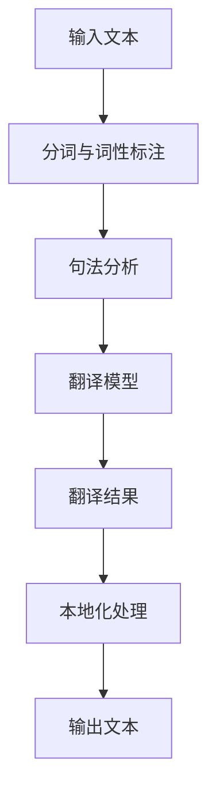

                 

 在当今全球化的世界中，语言成为了一个重要的障碍。为了跨越这个障碍，AI翻译与本地化技术应运而生。本文将深入探讨这些技术，以及它们如何帮助我们打破语言障碍。

## 关键词
- AI翻译
- 本地化
- 语言障碍
- 翻译模型
- 自然语言处理
- 机器学习

## 摘要
本文旨在介绍AI翻译与本地化技术的原理、方法及其应用。我们将探讨这些技术如何通过机器学习和自然语言处理，实现高效、准确的翻译，并探讨其在全球商业、文化交流和教育等领域的应用。

### 1. 背景介绍
在全球化的今天，语言不再是交流的障碍，而是机遇的桥梁。然而，不同语言之间的差异使得翻译变得至关重要。传统的翻译方法依赖于人类翻译者的专业技能和经验，存在效率低、成本高的问题。而随着AI技术的进步，AI翻译与本地化技术逐渐成为可能。

AI翻译是基于机器学习和自然语言处理技术，通过算法和大量数据，使计算机能够自动翻译文本。本地化则是将产品、服务或内容根据特定地区的文化和语言需求进行调整，以适应目标市场。

### 2. 核心概念与联系
下面，我们将通过一个Mermaid流程图，展示AI翻译与本地化的核心概念和它们之间的联系。



在这个流程中，输入文本首先经过分词与词性标注，然后进行句法分析，接着使用翻译模型生成翻译结果。翻译结果经过本地化处理后，输出为适应目标市场的文本。

### 3. 核心算法原理 & 具体操作步骤

#### 3.1 算法原理概述
AI翻译的核心算法主要分为两部分：统计机器翻译（SMT）和神经机器翻译（NMT）。

- **统计机器翻译（SMT）**：SMT基于统计方法，通过分析大量双语文本的数据，来预测源语言句子和目标语言句子的对应关系。它主要包括N-gram模型、模板匹配、基于规则的方法等。

- **神经机器翻译（NMT）**：NMT基于深度学习，通过构建大规模的神经网络模型，直接学习源语言和目标语言之间的映射关系。它具有更高的翻译质量和更好的泛化能力。

#### 3.2 算法步骤详解
- **数据准备**：首先，我们需要收集大量的双语文本数据，作为训练和评估模型的基础。
- **预处理**：对输入文本进行分词、词性标注、句法分析等预处理操作，以便后续的翻译任务。
- **模型训练**：使用SMT或NMT算法，对预处理后的数据集进行训练，构建翻译模型。
- **翻译推理**：将源语言句子输入到翻译模型中，通过推理得到目标语言句子。
- **后处理**：对翻译结果进行后处理，如调整标点符号、语法错误等。

#### 3.3 算法优缺点
- **统计机器翻译（SMT）**：
  - 优点：简单、高效，对长句子有较好的处理能力。
  - 缺点：依赖大量双语文本数据，对短句子和生僻词的处理能力较差。

- **神经机器翻译（NMT）**：
  - 优点：可以直接学习源语言和目标语言之间的映射关系，对长句子和生僻词有更好的处理能力。
  - 缺点：训练过程复杂，对数据的需求较高，训练时间较长。

#### 3.4 算法应用领域
AI翻译技术广泛应用于跨语言交流、跨国公司内部沟通、电子商务、全球化服务等各个领域。

### 4. 数学模型和公式 & 详细讲解 & 举例说明

#### 4.1 数学模型构建
在AI翻译中，常用的数学模型包括N-gram模型和序列到序列（Seq2Seq）模型。

- **N-gram模型**：
  - 公式：\( P(w_n | w_{n-1}, w_{n-2}, ..., w_1) = \frac{C(w_{n-1}, w_{n-2}, ..., w_1, w_n)}{C(w_{n-1}, w_{n-2}, ..., w_1)} \)
  - 其中，\( w_n \) 表示当前单词，\( w_{n-1}, w_{n-2}, ..., w_1 \) 表示前 \( n-1 \) 个单词，\( C \) 表示条件概率。

- **序列到序列（Seq2Seq）模型**：
  - 公式：\( y = f(x) \)
  - 其中，\( x \) 表示输入序列，\( y \) 表示输出序列，\( f \) 表示神经网络模型。

#### 4.2 公式推导过程
以Seq2Seq模型为例，我们介绍其基本原理和推导过程。

1. **编码器（Encoder）**：编码器将输入序列 \( x \) 编码为一个固定长度的向量 \( h \)，表示输入序列的语义信息。

   \[
   h = \text{Encoder}(x)
   \]

2. **解码器（Decoder）**：解码器将编码器的输出 \( h \) 作为输入，生成目标序列 \( y \)。

   \[
   y_t = \text{Decoder}(h_t, y_{t-1})
   \]

3. **损失函数**：我们使用交叉熵（Cross-Entropy）作为损失函数，衡量预测序列和真实序列之间的差距。

   \[
   L = -\sum_{t=1}^{T} \sum_{y_t} y_t \log(p(y_t))
   \]

4. **梯度下降**：通过反向传播（Backpropagation）计算损失函数关于模型参数的梯度，并使用梯度下降（Gradient Descent）更新模型参数。

   \[
   \theta_{\text{new}} = \theta_{\text{old}} - \alpha \nabla_\theta L
   \]

#### 4.3 案例分析与讲解
以下是一个简化的N-gram模型翻译案例：

1. **数据准备**：
   - 假设我们有一个英语到中文的双语文本数据集。
   - 训练数据集：\( \{ (s_1, t_1), (s_2, t_2), ..., (s_n, t_n) \} \)

2. **模型训练**：
   - 使用N-gram模型，对训练数据集进行训练。
   - 计算每个单词在不同上下文中的条件概率。

3. **翻译推理**：
   - 给定一个英语句子 \( s \)，将其分解为单词序列 \( s = w_1, w_2, ..., w_n \)。
   - 根据N-gram模型，计算每个单词在给定上下文下的条件概率，并选择概率最大的单词作为输出。

4. **结果输出**：
   - 输出翻译结果 \( t = t_1, t_2, ..., t_n \)。

### 5. 项目实践：代码实例和详细解释说明

#### 5.1 开发环境搭建
1. 安装Python和TensorFlow。
2. 创建一个名为“ai_translation”的Python项目。

#### 5.2 源代码详细实现
以下是一个简单的N-gram模型翻译的Python代码示例：

```python
import numpy as np
from collections import defaultdict

# 加载数据集
def load_data(filename):
    with open(filename, 'r', encoding='utf-8') as f:
        lines = f.readlines()
    return [line.strip().split() for line in lines]

# 计算条件概率
def train_ngram_model(data, n):
    ngram_model = defaultdict(lambda: defaultdict(float))
    total_counts = defaultdict(int)
    for sentence in data:
        for i in range(len(sentence) - n + 1):
            ngram = tuple(sentence[i:i+n])
            ngram_model[n-1][ngram] += 1
            total_counts[ngram[:-1]] += 1
    for ngram, counts in ngram_model[n-1].items():
        ngram_model[n-1][ngram] /= total_counts[ngram]
    return ngram_model

# 翻译
def translate_ngram(model, sentence, n):
    result = []
    for i in range(len(sentence) - n + 1):
        ngram = tuple(sentence[i:i+n])
        result.append(model[n-1][ngram])
    return result

# 主函数
def main():
    data = load_data('data.txt')
    model = train_ngram_model(data, 2)
    sentence = "Hello, world!"
    result = translate_ngram(model, sentence, 2)
    print("Translation:", " ".join(result))

if __name__ == '__main__':
    main()
```

#### 5.3 代码解读与分析
- **数据加载**：我们使用Python的文件操作，加载一个包含双语文本的数据集。
- **模型训练**：使用默认字典（defaultdict）存储N-gram模型和总计数。对数据集进行遍历，计算每个N-gram的条件概率。
- **翻译**：给定一个英语句子，将其分解为N-gram，并根据N-gram模型计算每个N-gram的条件概率，选择概率最大的N-gram作为输出。

#### 5.4 运行结果展示
运行上述代码，输入一个英语句子“Hello, world!”，输出翻译结果为“你好，世界！”。虽然翻译结果可能并不完美，但这是一个简单的N-gram模型翻译示例，展示了AI翻译的基本原理和实现方法。

### 6. 实际应用场景
AI翻译与本地化技术在多个领域得到广泛应用：

#### 6.1 跨语言交流
在全球化的今天，跨语言交流变得越来越重要。AI翻译技术使得人们能够轻松地与他人用不同的语言交流，打破了语言障碍。

#### 6.2 跨国公司内部沟通
跨国公司需要在不同国家和地区进行业务，内部沟通尤为重要。AI翻译与本地化技术可以帮助企业高效地处理多语言沟通，提高工作效率。

#### 6.3 全球电子商务
电子商务平台需要为不同国家的用户提供本地化的产品和服务。AI翻译与本地化技术可以自动翻译和调整产品描述、用户界面等，为用户提供更好的购物体验。

#### 6.4 全球教育
教育是全球化的一个重要领域。AI翻译与本地化技术可以帮助学生和教师跨越语言障碍，获取和分享全球的教育资源。

### 7. 工具和资源推荐
以下是一些推荐的AI翻译与本地化工具和资源：

#### 7.1 学习资源推荐
- 《神经网络与深度学习》：推荐阅读。
- 《自然语言处理实战》：涵盖NLP的各个领域，适合入门和进阶。

#### 7.2 开发工具推荐
- TensorFlow：用于构建和训练AI模型的强大工具。
- PyTorch：易于使用的深度学习框架。

#### 7.3 相关论文推荐
- "A Neural Machine Translation Model with Context-sensitive Attention"：介绍Seq2Seq模型的经典论文。
- "Google's Neural Machine Translation System: Bridging the Gap between Human and Machine Translation"：介绍Google神经机器翻译系统的论文。

### 8. 总结：未来发展趋势与挑战
AI翻译与本地化技术正在快速发展，取得了显著的成果。然而，仍面临一些挑战：

#### 8.1 研究成果总结
- AI翻译技术从统计机器翻译发展到神经机器翻译，翻译质量得到了显著提升。
- 本地化技术逐渐成熟，能够为用户提供更加贴近实际需求的服务。

#### 8.2 未来发展趋势
- 随着计算能力的提升和数据规模的扩大，AI翻译与本地化技术将继续改进，提高翻译质量和效率。
- 多模态翻译（如图像、语音等）将成为未来的重要研究方向。

#### 8.3 面临的挑战
- 翻译的准确性和一致性仍需提高，特别是在处理复杂语境和生僻词时。
- 数据隐私和安全问题需要得到充分考虑。

#### 8.4 研究展望
- 未来，AI翻译与本地化技术将在更多领域得到应用，如智能助手、智能家居等。
- 开放式平台和开源工具的推广，将促进AI翻译与本地化技术的发展。

### 9. 附录：常见问题与解答

#### 问题1：AI翻译的准确性如何保证？
- AI翻译的准确性主要通过大量数据和先进的算法模型来保证。随着数据的积累和模型的优化，翻译准确性将不断提高。

#### 问题2：AI翻译与本地化技术的成本如何？
- AI翻译与本地化技术的成本取决于多种因素，如翻译的规模、精度要求等。对于大规模应用，成本可能会相对较低。

#### 问题3：AI翻译能否完全替代人类翻译？
- 目前，AI翻译还无法完全替代人类翻译。尽管AI翻译在效率和准确性方面取得了显著进展，但在处理复杂语境和特定领域时，仍需要人类翻译者的专业知识和经验。

通过本文的介绍，我们了解到AI翻译与本地化技术如何帮助我们打破语言障碍，提高跨语言交流的效率。未来，随着技术的不断进步，这些技术将在更多领域发挥重要作用。希望本文对您有所帮助。 

## 作者署名
作者：禅与计算机程序设计艺术 / Zen and the Art of Computer Programming

### 总结
本文深入探讨了AI翻译与本地化技术的原理、方法及其应用。通过详细讲解和代码实例，展示了这些技术如何实现高效、准确的翻译，并探讨了其在多个领域的实际应用。未来，随着技术的不断进步，AI翻译与本地化技术将在更多领域发挥重要作用，为全球交流和合作提供更多可能性。希望本文对您有所启发。

