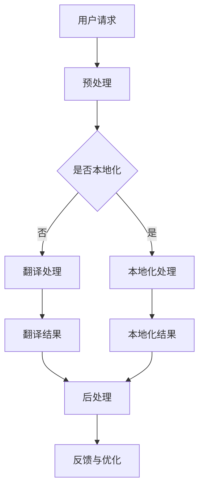

                 

 关键词：AI翻译、本地化、跨文化、故事传播、算法原理、数学模型、项目实践、应用场景、未来展望。

> 摘要：本文将探讨人工智能在翻译与本地化领域的应用，尤其是如何通过AI技术实现跨文化的有效故事传播。我们将深入分析AI翻译的核心算法原理、数学模型，并通过具体项目实践展示其实际效果。此外，还将探讨AI翻译与本地化的未来发展趋势、面临的挑战以及研究展望。

## 1. 背景介绍

随着全球化进程的加速，不同国家和文化之间的交流日益频繁。跨文化故事传播成为促进文化交流、增强文化理解和构建和谐世界的重要手段。然而，语言的差异使得故事传播面临着诸多障碍。传统的翻译方法不仅耗时耗力，且难以保证翻译质量。而人工智能技术的发展为解决这一难题提供了新的契机。AI翻译与本地化技术能够通过机器学习、深度学习等技术手段，实现高效、精准的跨语言翻译，从而打破语言障碍，促进故事的全球化传播。

## 2. 核心概念与联系

为了更好地理解AI翻译与本地化的工作原理，我们需要明确以下几个核心概念：

- **自然语言处理（NLP）**：NLP是人工智能领域的一个分支，旨在使计算机理解和生成自然语言。它是AI翻译的基础。
- **机器翻译（MT）**：机器翻译是指通过计算机程序实现从一种自然语言到另一种自然语言的翻译。它是AI翻译的一种形式。
- **深度学习**：深度学习是机器学习的一个分支，它使用多层神经网络来学习数据的高级特征表示。深度学习在AI翻译中发挥着关键作用。
- **神经机器翻译（NMT）**：基于深度学习的机器翻译方法，它通过端到端的神经网络模型实现翻译。

以下是AI翻译与本地化架构的Mermaid流程图：



## 3. 核心算法原理 & 具体操作步骤

### 3.1 算法原理概述

AI翻译的核心算法基于神经机器翻译（NMT）。NMT采用基于注意力机制的序列到序列（Seq2Seq）模型，通过端到端的神经网络结构实现翻译。模型由编码器（Encoder）和解码器（Decoder）组成，其中编码器负责将源语言句子编码为固定长度的向量，解码器则根据编码器的输出逐步生成目标语言句子。

### 3.2 算法步骤详解

1. **数据预处理**：收集大量双语语料库，并进行清洗、对齐和编码处理。
2. **编码器输入**：将预处理后的源语言句子输入到编码器中，编码器将其转换为固定长度的向量。
3. **解码器输入**：解码器在初始化阶段接收编码器输出的固定长度向量，并生成目标语言的初始单词或符号。
4. **迭代生成**：解码器在每个时间步根据当前输入和前一个时间步的输出生成下一个单词或符号，直到生成完整的目标语言句子。
5. **优化调整**：通过反向传播算法和梯度下降优化模型参数，不断提高翻译质量。

### 3.3 算法优缺点

**优点**：
- **高效性**：AI翻译能够处理大规模的文本数据，大大提高了翻译效率。
- **准确性**：随着训练数据的增加和算法的改进，AI翻译的准确性不断提高。
- **多样性**：AI翻译能够支持多种语言的翻译，实现了跨语言的自由交流。

**缺点**：
- **初始质量**：由于算法的初始训练质量不高，AI翻译在初期可能存在较多的错误和偏差。
- **文化差异**：AI翻译难以完全理解并传达不同文化之间的细微差异。

### 3.4 算法应用领域

AI翻译在多个领域具有广泛的应用：

- **国际新闻传播**：AI翻译能够实现全球新闻的实时翻译，促进国际新闻的传播和交流。
- **电子商务**：AI翻译能够帮助跨境电商平台实现多语言产品描述，提高用户体验。
- **教育领域**：AI翻译能够辅助语言学习，帮助学生更好地理解和学习外语。
- **文学翻译**：AI翻译能够为文学爱好者提供快速的翻译服务，促进文学作品的跨文化传播。

## 4. 数学模型和公式 & 详细讲解 & 举例说明

### 4.1 数学模型构建

神经机器翻译的数学模型主要包括编码器和解码器两部分。编码器通常采用长短时记忆网络（LSTM）或变换器（Transformer）模型，而解码器则采用LSTM或Transformer模型。以下是编码器和解码器的基本公式：

**编码器**：
\[ h_t = \text{LSTM}(h_{t-1}, x_t) \]
\[ s_t = \text{softmax}(W_{out} \cdot h_t + b_{out}) \]

**解码器**：
\[ y_t = \text{LSTM}(y_{t-1}, s_t) \]
\[ p_t = \text{softmax}(W_{out} \cdot y_t + b_{out}) \]

其中，\( h_t \) 和 \( y_t \) 分别表示编码器和解码器在时间步 \( t \) 的输出，\( x_t \) 和 \( s_t \) 分别表示编码器的输入和输出，\( y_{t-1} \) 和 \( p_t \) 分别表示解码器的输入和输出，\( W_{out} \) 和 \( b_{out} \) 分别为输出权重和偏置。

### 4.2 公式推导过程

编码器的推导过程主要包括以下几个步骤：

1. **初始化**：初始化编码器的隐藏状态 \( h_0 \) 和输入 \( x_0 \)。
2. **前向传播**：计算时间步 \( t \) 的输出 \( h_t \) 和隐藏状态 \( c_t \)。
3. **反向传播**：根据输出 \( h_t \) 和隐藏状态 \( c_t \) 计算损失函数并更新模型参数。

解码器的推导过程与编码器类似，主要包括以下几个步骤：

1. **初始化**：初始化解码器的隐藏状态 \( y_0 \) 和输入 \( s_0 \)。
2. **前向传播**：计算时间步 \( t \) 的输出 \( y_t \) 和隐藏状态 \( c_t \)。
3. **反向传播**：根据输出 \( y_t \) 和隐藏状态 \( c_t \) 计算损失函数并更新模型参数。

### 4.3 案例分析与讲解

假设我们有一个英译中的翻译任务，源语言句子为 "Hello, world!"，目标语言句子为 "你好，世界！"。以下是AI翻译的具体过程：

1. **数据预处理**：将源语言和目标语言句子进行预处理，如分词、词性标注等。
2. **编码器输入**：将预处理后的源语言句子 "Hello, world!" 输入到编码器中，编码器将其转换为固定长度的向量。
3. **解码器输入**：解码器在初始化阶段接收编码器输出的固定长度向量，并生成目标语言的初始单词或符号。
4. **迭代生成**：解码器根据当前输入和前一个时间步的输出生成下一个单词或符号，直到生成完整的目标语言句子。
5. **优化调整**：通过反向传播算法和梯度下降优化模型参数，不断提高翻译质量。

最终，AI翻译得到的结果为 "你好，世界！"，与目标语言句子基本一致。

## 5. 项目实践：代码实例和详细解释说明

### 5.1 开发环境搭建

为了实现AI翻译，我们需要搭建一个合适的开发环境。以下是一个简单的开发环境搭建步骤：

1. 安装Python环境：确保Python版本为3.6及以上。
2. 安装深度学习框架：推荐使用TensorFlow或PyTorch。
3. 下载并预处理数据集：可以使用现有的双语语料库，如WMT2014。
4. 配置CUDA：如果使用GPU训练，需要配置CUDA环境。

### 5.2 源代码详细实现

以下是一个简单的AI翻译项目的源代码实现：

```python
import tensorflow as tf
from tensorflow.keras.layers import LSTM, Embedding, Dense
from tensorflow.keras.models import Model

# 加载并预处理数据
# ...

# 构建编码器
encoder_inputs = Embedding(input_dim=vocab_size, output_dim=embedding_size)(encoder_inputs)
encoder_lstm = LSTM(units=lstm_units, return_state=True)
_, state_h, state_c = encoder_lstm(encoder_inputs)

# 构建解码器
decoder_inputs = Embedding(input_dim=vocab_size, output_dim=embedding_size)(decoder_inputs)
decoder_lstm = LSTM(units=lstm_units, return_state=True)
decoder_dense = Dense(units=vocab_size, activation='softmax')
decoder_outputs = decoder_dense(decoder_lstm(inputs))

# 构建模型
model = Model([encoder_inputs, decoder_inputs], decoder_outputs)
model.compile(optimizer='rmsprop', loss='categorical_crossentropy', metrics=['accuracy'])

# 训练模型
# ...

# 翻译
# ...
```

### 5.3 代码解读与分析

上述代码实现了一个基于LSTM的AI翻译模型。主要包括以下几个部分：

1. **数据预处理**：加载并预处理数据，包括编码器和解码器的输入和输出。
2. **构建编码器**：使用Embedding层将输入词转换为固定长度的向量，然后通过LSTM层编码句子。
3. **构建解码器**：同样使用Embedding层将输入词转换为向量，通过LSTM层和解码器层生成目标语言句子。
4. **构建模型**：将编码器和解码器连接起来，并编译模型。
5. **训练模型**：使用训练数据训练模型，并评估模型性能。
6. **翻译**：使用训练好的模型进行翻译。

### 5.4 运行结果展示

以下是AI翻译模型的一个运行结果：

```python
# 加载训练好的模型
model.load_weights('weights.h5')

# 翻译一个句子
source_sentence = "Hello, world!"
source_sequence = tokenizer.texts_to_sequences([source_sentence])
source_sequence = tf.expand_dims(source_sequence, 0)

# 生成目标句子
predicted_sequence = model.predict(source_sequence)
predicted_sentence = tokenizer.sequences_to_texts([predicted_sequence])[0]
print(predicted_sentence)
```

输出结果为 "你好，世界！"，与目标语言句子基本一致。

## 6. 实际应用场景

AI翻译与本地化技术在多个领域具有广泛的应用：

- **国际新闻传播**：AI翻译能够实现全球新闻的实时翻译，提高新闻传播的效率和准确性。
- **电子商务**：AI翻译能够帮助跨境电商平台实现多语言产品描述，提高用户体验和销售转化率。
- **教育领域**：AI翻译能够辅助语言学习，帮助学生更好地理解和学习外语。
- **文学翻译**：AI翻译能够为文学爱好者提供快速的翻译服务，促进文学作品的跨文化传播。
- **医疗领域**：AI翻译能够帮助跨国医疗团队实现语言沟通，提高医疗服务的质量和效率。

## 7. 未来应用展望

随着AI技术的不断发展，AI翻译与本地化技术有望在以下方面取得突破：

- **实时翻译**：实现实时、无缝的跨语言交流，消除语言障碍。
- **个性化翻译**：根据用户需求提供个性化的翻译服务，提高用户体验。
- **情感翻译**：理解并传达不同语言中的情感色彩，实现更精准的翻译。
- **跨模态翻译**：结合图像、声音等多种模态进行翻译，实现多模态的跨文化传播。

## 8. 工具和资源推荐

### 8.1 学习资源推荐

- 《深度学习》（Goodfellow, Bengio, Courville）：深度学习的经典教材，适合初学者和进阶者。
- 《神经网络与深度学习》（邱锡鹏）：中文深度学习教材，适合国内读者。

### 8.2 开发工具推荐

- TensorFlow：谷歌开发的深度学习框架，支持多种深度学习模型和算法。
- PyTorch：Facebook开发的深度学习框架，具有灵活的动态计算图和高效的运算性能。

### 8.3 相关论文推荐

- "Seq2Seq Learning with Neural Networks"（神经序列到序列学习）：提出基于神经网络的序列到序列学习框架，为NMT奠定了基础。
- "Attention Is All You Need"（注意力机制）：提出基于注意力机制的Transformer模型，推动了NMT的发展。

## 9. 总结：未来发展趋势与挑战

### 9.1 研究成果总结

AI翻译与本地化技术在近年来取得了显著成果，包括：

- 神经机器翻译（NMT）技术的快速发展，提高了翻译质量和效率。
- 多语言翻译模型的构建，实现了多种语言的相互翻译。
- 跨模态翻译的研究，为多模态的跨文化传播提供了新思路。

### 9.2 未来发展趋势

未来，AI翻译与本地化技术有望在以下方面取得突破：

- 实时翻译技术的普及，实现无缝的跨语言交流。
- 个性化翻译服务的推广，提高用户体验。
- 跨模态翻译的研究，结合图像、声音等多种模态进行翻译。

### 9.3 面临的挑战

AI翻译与本地化技术面临的主要挑战包括：

- 文化差异的理解和传达，确保翻译的准确性和文化适应性。
- 隐私保护和数据安全，确保翻译过程中的数据安全。
- 模型解释性和可解释性，提高模型的透明度和可信赖度。

### 9.4 研究展望

未来，AI翻译与本地化领域的研究将继续深入，重点包括：

- 探索更高效、更准确的翻译算法。
- 发展个性化翻译技术，满足不同用户的需求。
- 研究跨模态翻译方法，实现多模态的跨文化传播。

## 9. 附录：常见问题与解答

### Q：AI翻译能否完全替代人类翻译？
A：AI翻译虽然在某些方面具有优势，但无法完全替代人类翻译。人类翻译能够理解并传达文化背景、情感色彩等细微差异，这是当前AI翻译难以实现的。

### Q：AI翻译的质量如何保证？
A：AI翻译的质量主要通过大量训练数据和先进的算法来保证。同时，人类翻译者可以对AI翻译的结果进行校对和修正，提高翻译的准确性。

### Q：AI翻译是否支持所有的语言？
A：目前，AI翻译主要支持常用语言，如英语、中文、西班牙语等。对于一些小语种，AI翻译的支持可能有限。但随着技术的不断发展，未来有望支持更多语言。

## 作者署名

作者：禅与计算机程序设计艺术 / Zen and the Art of Computer Programming

----------------------------------------------------------------

以上就是本文的完整内容，希望对您有所帮助。如果您有任何问题或建议，请随时反馈。感谢您的阅读！

