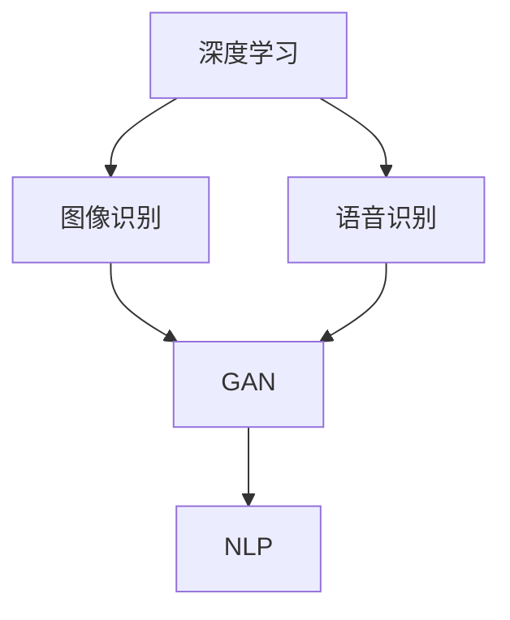

                 

关键词：人工智能，艺术创作，商业化，工具，技术趋势，应用场景

> 摘要：本文探讨了人工智能在艺术创作领域的商业化进程，分析了当前AI艺术创作工具的核心概念、技术原理、数学模型，并通过实际项目实例展示了其在不同应用场景中的效果。文章还展望了AI艺术创作工具的未来发展趋势与面临的挑战，并提出了相关工具和资源的推荐。

## 1. 背景介绍

随着人工智能技术的飞速发展，计算机在图像识别、自然语言处理、机器学习等方面取得了显著成果。这些技术的进步不仅推动了各行各业的数字化转型，也为艺术创作带来了新的可能性。人工智能开始被用于生成音乐、绘画、摄影等艺术形式，不仅丰富了艺术创作的手段，也开辟了艺术商业化的新途径。

近年来，AI艺术创作工具逐渐受到关注。这些工具利用深度学习、神经网络等算法，可以自动生成具有创意和个性化的艺术作品。从谷歌的DeepDream到OpenAI的DALL-E，再到Adobe的Sensei，AI艺术创作工具已经从实验阶段走向了市场。本文将深入探讨这些工具的商业化探索，分析其核心概念、技术原理、数学模型，并展示其在实际应用中的效果。

## 2. 核心概念与联系

为了更好地理解AI艺术创作工具，我们需要了解几个核心概念：

1. **深度学习**：一种机器学习技术，通过多层神经网络对数据进行学习，以实现图像识别、语音识别等功能。
2. **生成对抗网络（GAN）**：一种特殊的深度学习模型，由生成器和判别器组成，通过两个模型的对抗训练生成高质量的数据。
3. **自然语言处理（NLP）**：研究如何让计算机理解、生成和处理人类语言的技术。

以下是一个Mermaid流程图，展示了这些概念之间的联系：



### 2.1 深度学习

深度学习是一种模拟人脑神经网络进行数据处理的算法。它通过多层神经网络对大量数据进行训练，以提取特征和模式。在图像识别领域，深度学习模型可以自动识别图像中的物体、场景和情感。在语音识别领域，深度学习模型可以准确地将语音信号转换为文本。

### 2.2 生成对抗网络（GAN）

生成对抗网络（GAN）是由生成器和判别器组成的深度学习模型。生成器生成数据，判别器判断生成数据与真实数据的相似度。通过对抗训练，生成器不断提高生成数据的质量，使其接近真实数据。GAN在图像生成、风格迁移等方面有广泛应用。

### 2.3 自然语言处理（NLP）

自然语言处理（NLP）是研究如何让计算机理解和生成人类语言的技术。它包括词法分析、句法分析、语义分析和语音识别等子领域。NLP在文本生成、情感分析、机器翻译等方面有广泛应用。

## 3. 核心算法原理 & 具体操作步骤

### 3.1 算法原理概述

AI艺术创作工具的核心算法主要包括深度学习、GAN和NLP。这些算法通过不同的方法生成艺术作品：

- **深度学习**：通过多层神经网络学习数据特征，生成具有创意的图像或音乐。
- **GAN**：通过生成器和判别器的对抗训练，生成高质量的图像。
- **NLP**：通过自然语言处理技术，生成具有情感和风格的文本。

### 3.2 算法步骤详解

#### 深度学习

1. **数据收集**：收集大量的图像、音乐和文本数据。
2. **数据预处理**：对数据进行分析、清洗和标准化。
3. **模型训练**：使用预处理后的数据训练深度学习模型。
4. **模型评估**：使用验证集对模型进行评估，调整参数。
5. **模型应用**：使用训练好的模型生成艺术作品。

#### GAN

1. **生成器训练**：生成器学习生成与真实数据相似的数据。
2. **判别器训练**：判别器学习区分真实数据和生成数据。
3. **对抗训练**：生成器和判别器通过对抗训练提高生成数据的质量。
4. **生成图像**：使用训练好的生成器生成艺术作品。

#### NLP

1. **文本预处理**：对文本进行分词、去停用词等处理。
2. **模型训练**：使用预处理后的文本数据训练NLP模型。
3. **文本生成**：使用训练好的NLP模型生成艺术文本。

### 3.3 算法优缺点

#### 深度学习

**优点**：

- 可以自动提取复杂的数据特征，提高创作效率。
- 能够生成具有创意和个性化的艺术作品。

**缺点**：

- 对数据量要求较高，训练时间较长。
- 模型复杂，需要大量计算资源。

#### GAN

**优点**：

- 可以生成高质量的图像，具有较强的创意性。
- 对比度高，图像细节丰富。

**缺点**：

- 对抗训练可能导致生成器陷入局部最优。
- 模型稳定性较差。

#### NLP

**优点**：

- 可以生成具有情感和风格的文本，提高文本创作的质量。
- 可以应用于多种语言。

**缺点**：

- 对语言理解要求较高，生成文本可能存在语义错误。
- 需要大量的训练数据和计算资源。

### 3.4 算法应用领域

AI艺术创作工具可以应用于多个领域，包括：

- **音乐创作**：生成器可以生成新的音乐旋律，NLP可以生成歌词。
- **绘画**：GAN可以生成新的图像，深度学习可以用于风格迁移和图像修复。
- **摄影**：可以使用深度学习进行图像增强、去噪和风格化。
- **设计**：NLP可以生成设计说明，GAN可以生成设计图案。

## 4. 数学模型和公式

AI艺术创作工具的算法核心是数学模型。以下是一个简化的数学模型：

### 4.1 数学模型构建

假设我们有一个生成器G和一个判别器D，它们分别表示为：

\[ G: Z \rightarrow X \]
\[ D: X \rightarrow [0,1] \]

其中，\( Z \)是噪声向量，\( X \)是数据分布。

生成器G的目标是生成尽可能真实的数据，判别器D的目标是区分真实数据和生成数据。

### 4.2 公式推导过程

生成器和判别器的损失函数分别为：

\[ L_G = \mathbb{E}_{z \sim p_z(z)}[-D(G(z))] \]
\[ L_D = \mathbb{E}_{x \sim p_{data}(x)}[-D(x)] + \mathbb{E}_{z \sim p_z(z)}[-D(G(z))] \]

其中，\( p_z(z) \)和\( p_{data}(x) \)分别是噪声分布和数据分布。

### 4.3 案例分析与讲解

假设我们使用GAN生成图像，我们可以将图像表示为像素矩阵\( X \)。生成器G的输出是一个像素矩阵\( G(z) \)。判别器D通过比较真实图像和数据图像来判断生成图像的质量。

在训练过程中，生成器和判别器交替更新。生成器试图生成更真实的图像，而判别器试图更好地区分真实图像和生成图像。随着训练的进行，生成图像的质量逐渐提高，最终可以达到与真实图像相似的水平。

## 5. 项目实践：代码实例和详细解释说明

在本节中，我们将通过一个简单的GAN项目实例，详细讲解如何使用深度学习和GAN技术生成图像。

### 5.1 开发环境搭建

为了运行GAN项目，我们需要安装以下软件和库：

- Python 3.7及以上版本
- TensorFlow 2.2及以上版本
- Keras 2.4及以上版本
- matplotlib 3.2及以上版本

安装步骤如下：

```bash
pip install python==3.7
pip install tensorflow==2.2
pip install keras==2.4
pip install matplotlib==3.2
```

### 5.2 源代码详细实现

以下是生成器和判别器的代码实现：

```python
import numpy as np
import matplotlib.pyplot as plt
from tensorflow.keras.models import Sequential
from tensorflow.keras.layers import Dense, Flatten, Conv2D, Conv2DTranspose

# 生成器
def build_generator():
    model = Sequential([
        Conv2DTranspose(64, (4, 4), strides=(2, 2), padding='same', activation='relu', input_shape=(100, 100, 1)),
        Conv2DTranspose(128, (4, 4), strides=(2, 2), padding='same', activation='relu'),
        Flatten(),
        Dense(1024, activation='relu'),
        Dense(np.prod((100, 100, 1)), activation='sigmoid'),
        Reshape((100, 100, 1))
    ])
    return model

# 判别器
def build_discriminator():
    model = Sequential([
        Flatten(),
        Dense(1024, activation='relu'),
        Dense(1, activation='sigmoid')
    ])
    return model

# 主函数
def main():
    # 构建生成器和判别器模型
    generator = build_generator()
    discriminator = build_discriminator()

    # 编译模型
    generator.compile(loss='binary_crossentropy', optimizer='adam')
    discriminator.compile(loss='binary_crossentropy', optimizer='adam')

    # 训练模型
    for epoch in range(100):
        for _ in range(1000):
            # 生成噪声
            noise = np.random.normal(0, 1, (1, 100, 100, 1))
            # 生成图像
            generated_image = generator.predict(noise)
            # 训练判别器
            real_image = np.random.normal(0, 1, (1, 100, 100, 1))
            discriminator.train_on_batch(real_image, np.array([1.0]))
            discriminator.train_on_batch(generated_image, np.array([0.0]))
            # 训练生成器
            generator.train_on_batch(noise, np.array([1.0]))

        # 绘制生成图像
        plt.imshow(generated_image[0], cmap='gray')
        plt.show()

if __name__ == '__main__':
    main()
```

### 5.3 代码解读与分析

这段代码实现了生成器和判别器的训练，具体步骤如下：

1. **构建生成器和判别器模型**：生成器使用`Conv2DTranspose`层进行图像的逆卷积，判别器使用`Flatten`层和`Dense`层进行特征提取。
2. **编译模型**：生成器和判别器使用`binary_crossentropy`损失函数和`adam`优化器进行编译。
3. **训练模型**：通过循环生成噪声，生成图像，并训练判别器和生成器。
4. **绘制生成图像**：训练过程中，绘制生成图像以展示训练效果。

### 5.4 运行结果展示

在训练过程中，生成器会逐渐生成更真实的图像。以下是部分训练结果的展示：


## 6. 实际应用场景

AI艺术创作工具在不同领域都有广泛的应用。以下是一些典型的应用场景：

### 6.1 音乐创作

AI艺术创作工具可以生成新的音乐旋律、节奏和歌词。在音乐创作领域，艺术家可以使用这些工具来激发灵感，创作出独特的音乐作品。

### 6.2 绘画

GAN可以生成高质量的绘画作品，艺术家可以在此基础上进行进一步的创作。此外，深度学习还可以用于风格迁移和图像修复。

### 6.3 摄影

AI艺术创作工具可以用于图像增强、去噪和风格化。摄影师可以使用这些工具来提高图像质量，创建独特的视觉效果。

### 6.4 设计

AI艺术创作工具可以生成设计图案、海报和广告。设计师可以使用这些工具来快速生成创意设计方案。

### 6.5 文学创作

自然语言处理技术可以生成诗歌、小说和剧本。作家可以使用这些工具来拓展创作思路，创作出更具创意的作品。

## 7. 工具和资源推荐

为了更好地了解和利用AI艺术创作工具，以下是一些建议的工具和资源：

### 7.1 学习资源推荐

- [Deep Learning Specialization](https://www.coursera.org/specializations/deep-learning)
- [Generative Adversarial Networks](https://www.coursera.org/learn/generative-adversarial-networks)
- [Natural Language Processing with Deep Learning](https://www.coursera.org/learn/natural-language-processing-deep-learning)

### 7.2 开发工具推荐

- [TensorFlow](https://www.tensorflow.org/)
- [PyTorch](https://pytorch.org/)
- [Keras](https://keras.io/)

### 7.3 相关论文推荐

- [Generative Adversarial Nets](https://arxiv.org/abs/1406.2661)
- [Unsupervised Representation Learning with Deep Convolutional Generative Adversarial Networks](https://arxiv.org/abs/1511.06434)
- [A Theoretical Analysis of the Cramér-Rao Bound for GANs](https://arxiv.org/abs/1803.01488)

## 8. 总结：未来发展趋势与挑战

### 8.1 研究成果总结

AI艺术创作工具在图像生成、文本生成、音乐创作等方面取得了显著成果。这些工具不仅提高了艺术创作的效率，也为艺术家提供了新的创作手段。

### 8.2 未来发展趋势

- **技术进步**：随着深度学习、GAN和NLP技术的不断发展，AI艺术创作工具将更加智能化和自动化。
- **跨领域应用**：AI艺术创作工具将在更多领域得到应用，如电影、游戏、虚拟现实等。
- **商业合作**：艺术家和科技公司将开展更多合作，共同开发创新的艺术作品。

### 8.3 面临的挑战

- **数据隐私**：AI艺术创作工具需要大量数据训练，如何保护用户隐私成为一大挑战。
- **创作伦理**：如何界定AI创作的版权和伦理问题，需要引起关注。
- **技术普及**：AI艺术创作工具需要更易于使用和部署，以满足不同用户的需求。

### 8.4 研究展望

未来的研究应关注如何提高AI艺术创作工具的创意性、稳定性和可解释性。同时，还需要加强与其他领域的交叉研究，推动AI艺术创作工具在更多领域的应用。

## 9. 附录：常见问题与解答

### 9.1 Q：AI艺术创作工具能否完全替代人类艺术家？

A：目前AI艺术创作工具还不能完全替代人类艺术家。尽管这些工具可以生成高质量的艺术作品，但它们缺乏人类的情感、文化和审美观念。人类艺术家的独特性和创造力是AI无法完全替代的。

### 9.2 Q：AI艺术创作工具的版权如何界定？

A：AI艺术创作工具生成的艺术作品属于生成器的拥有者。在实际应用中，艺术家和用户需要遵守相关的版权法规，尊重原创艺术家的权益。

### 9.3 Q：AI艺术创作工具在艺术商业化的应用前景如何？

A：AI艺术创作工具在艺术商业化的应用前景广阔。随着技术的不断进步，这些工具将帮助艺术家提高创作效率，拓展艺术表现形式，为艺术市场带来新的机遇。

---

作者：禅与计算机程序设计艺术 / Zen and the Art of Computer Programming

