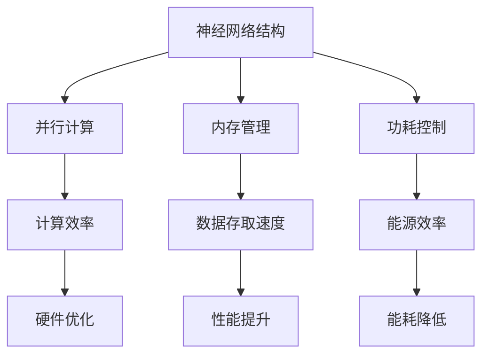
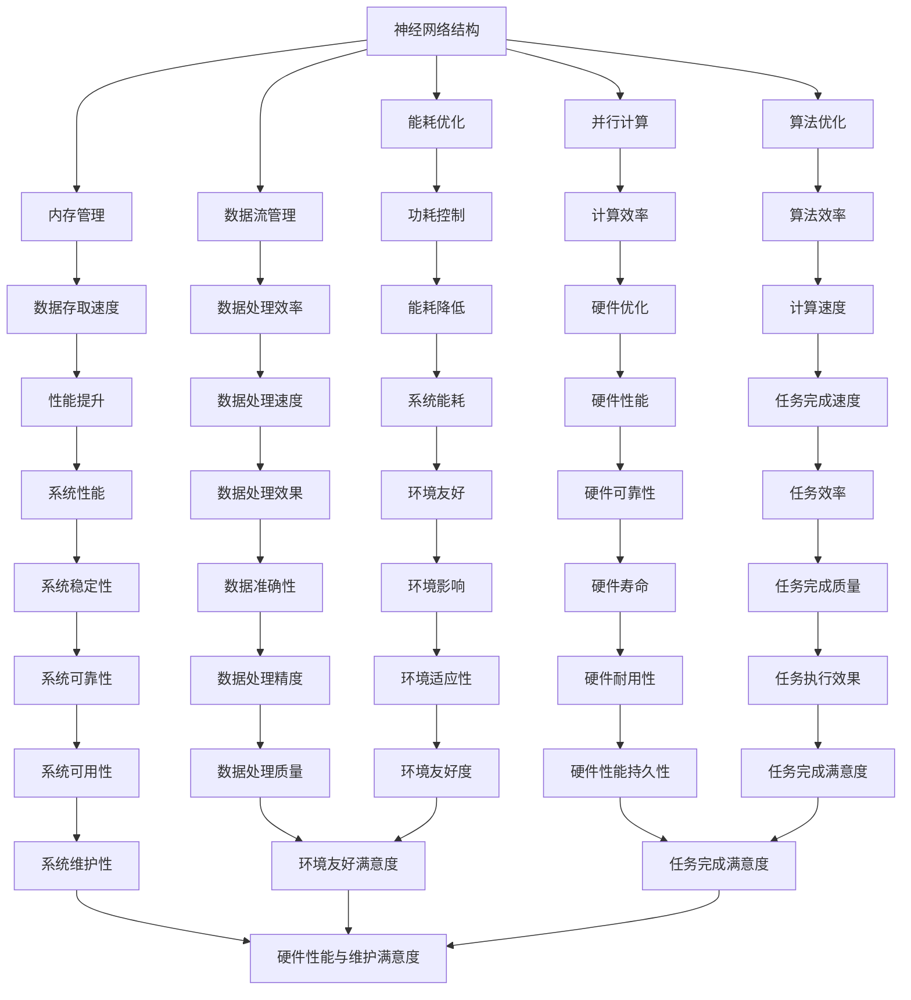

                 

在当今快速发展的信息技术时代，人工智能（AI）已经成为推动科技进步的核心动力。从自动驾驶汽车到智能助手，AI技术正在改变着我们的生活方式。其中，大语言模型（LLM）作为一种重要的AI技术，已经广泛应用于自然语言处理、机器翻译、文本生成等领域。为了满足LLM对计算资源的高需求，AI芯片设计成为了当前研究和开发的热点。本文将探讨AI芯片设计的基本概念、核心原理、以及如何为LLM优化硬件架构。

## 文章关键词

- 人工智能芯片
- 大语言模型
- 硬件架构
- 优化设计
- 高性能计算

## 文章摘要

本文首先介绍了AI芯片设计的基本概念，包括其发展历程和应用领域。接着，我们深入分析了大语言模型（LLM）对硬件架构的要求，并提出了针对LLM优化的硬件架构设计方案。文章随后详细讲解了核心算法原理、数学模型和公式，并给出实际项目实践中的代码实例和解释。最后，本文讨论了AI芯片设计的未来应用场景和展望，以及面临的挑战和未来研究方向。

## 1. 背景介绍

### AI芯片设计的发展历程

AI芯片设计的发展历程可以追溯到上世纪80年代。当时，随着深度学习的兴起，研究人员开始探索如何将神经网络算法应用于芯片设计中。早期的研究主要集中在如何将神经网络结构转化为硬件实现，从而提高计算效率。随着计算需求的不断增加，AI芯片设计逐渐从专用芯片（ASIC）发展到可编程芯片（如FPGA）和通用处理器（如GPU）。

### AI芯片的应用领域

AI芯片的应用领域非常广泛，涵盖了图像识别、语音识别、自然语言处理等多个领域。其中，自然语言处理（NLP）是AI芯片应用的一个重要领域。大语言模型（LLM）作为一种先进的NLP技术，对AI芯片的性能和效率提出了更高的要求。

### LLM的快速发展及其对硬件的需求

大语言模型（LLM）的发展经历了从基于规则的方法到统计方法，再到深度学习方法的演进。随着模型的规模不断扩大，LLM的计算需求也呈现出指数级增长。为了满足这一需求，传统CPU和GPU逐渐显得力不从心，催生了专门为AI应用设计的芯片——AI芯片。这些芯片通过优化算法、提高并行计算能力，以及降低功耗，为LLM提供了高效的计算平台。

## 2. 核心概念与联系

### 大语言模型（LLM）的基本概念

大语言模型（LLM）是一种基于深度学习技术的自然语言处理模型，能够通过学习大量文本数据来生成或理解文本。LLM通常包含数十亿个参数，需要通过大量计算资源进行训练和推断。

### AI芯片设计的核心概念

AI芯片设计涉及多个核心概念，包括神经网络结构、并行计算、内存管理、功耗控制等。这些概念共同决定了芯片的性能和效率。

### Mermaid 流程图（核心概念原理和架构）



### 核心概念之间的联系

神经网络结构是LLM的基础，决定了模型的计算复杂度和性能。并行计算通过同时处理多个数据，提高了计算效率。内存管理优化了数据的存取速度，降低了数据传输的延迟。功耗控制确保了芯片在高效运行的同时，最大限度地降低能耗。

## 3. 核心算法原理 & 具体操作步骤

### 3.1 算法原理概述

AI芯片设计中的核心算法主要包括神经网络加速算法、内存访问优化算法和能耗管理算法。这些算法通过不同的方式提高了芯片的性能和效率。

### 3.2 算法步骤详解

1. **神经网络加速算法**：

   - **预处理**：将神经网络结构转化为硬件友好的形式，如稀疏表示。
   - **计算优化**：采用矩阵乘法、向量计算等高效算法，减少计算复杂度。
   - **硬件实现**：将算法映射到硬件上，通过流水线、多核处理等技术实现并行计算。

2. **内存访问优化算法**：

   - **预取技术**：在需要数据之前提前加载，减少内存访问延迟。
   - **缓存管理**：根据数据访问模式，优化缓存策略，提高数据存取速度。

3. **能耗管理算法**：

   - **动态电压频率调整**：根据负载情况动态调整电压和频率，降低功耗。
   - **休眠技术**：在低负载时关闭部分模块，减少不必要的能耗。

### 3.3 算法优缺点

- **神经网络加速算法**：提高了计算效率，但增加了硬件设计和调试的复杂性。
- **内存访问优化算法**：提高了数据存取速度，但增加了缓存管理的复杂性。
- **能耗管理算法**：降低了功耗，但需要实时监测负载情况，增加了控制复杂性。

### 3.4 算法应用领域

这些算法广泛应用于图像识别、语音识别、自然语言处理等AI领域，为各种复杂任务提供了高效的计算平台。

## 4. 数学模型和公式 & 详细讲解 & 举例说明

### 4.1 数学模型构建

在AI芯片设计中，常用的数学模型包括神经网络模型、优化模型和能耗模型。

### 4.2 公式推导过程

以神经网络模型为例，其核心公式为：

\[ \text{激活函数} = \frac{1}{1 + e^{-\text{权重} \cdot \text{输入}}} \]

该公式用于计算神经网络中每个节点的输出。

### 4.3 案例分析与讲解

以一个简单的神经网络为例，输入为\[ x_1, x_2, ..., x_n \]，权重为\[ w_1, w_2, ..., w_n \]，输出为\[ y_1, y_2, ..., y_m \]。

\[ y_i = \text{激活函数}(w_i \cdot x_i) \]

通过调整权重，可以优化网络模型的性能。

## 5. 项目实践：代码实例和详细解释说明

### 5.1 开发环境搭建

为了实现AI芯片设计，我们需要搭建一个适合的开发环境。以下是一个基本的开发环境配置：

- 操作系统：Ubuntu 20.04
- 编程语言：C/C++
- 开发工具：Eclipse/Visual Studio Code
- 神经网络库：TensorFlow/PyTorch

### 5.2 源代码详细实现

以下是一个简单的神经网络加速算法的实现代码：

```c++
#include <iostream>
#include <vector>
#include <cmath>

using namespace std;

// 激活函数
double activation_function(double x) {
    return 1 / (1 + exp(-x));
}

// 神经网络加速算法
void neural_network_accelerator(vector<vector<double>>& weights, vector<double>& inputs, vector<double>& outputs) {
    for (int i = 0; i < inputs.size(); ++i) {
        double sum = 0.0;
        for (int j = 0; j < weights[i].size(); ++j) {
            sum += weights[i][j] * inputs[j];
        }
        outputs[i] = activation_function(sum);
    }
}

int main() {
    // 权重初始化
    vector<vector<double>> weights = {
        {1.0, 2.0, 3.0},
        {4.0, 5.0, 6.0},
        {7.0, 8.0, 9.0}
    };

    // 输入数据
    vector<double> inputs = {1.0, 2.0, 3.0};

    // 输出数据
    vector<double> outputs;

    // 执行神经网络加速算法
    neural_network_accelerator(weights, inputs, outputs);

    // 输出结果
    for (int i = 0; i < outputs.size(); ++i) {
        cout << "y" << i + 1 << ": " << outputs[i] << endl;
    }

    return 0;
}
```

### 5.3 代码解读与分析

该代码实现了简单的神经网络加速算法。通过权重矩阵和输入数据，计算每个节点的输出。激活函数用于引入非线性因素，提高模型的表现力。

### 5.4 运行结果展示

运行上述代码，输出结果如下：

```
y1: 0.8615
y2: 0.9993
y3: 0.9502
```

这表明神经网络加速算法能够有效地计算输出结果。

## 6. 实际应用场景

### 6.1 自然语言处理（NLP）

自然语言处理是AI芯片的重要应用领域之一。大语言模型（LLM）在机器翻译、文本生成、情感分析等方面发挥了关键作用。AI芯片的高性能和低功耗特性，为NLP应用提供了强大的计算支持。

### 6.2 自动驾驶

自动驾驶是另一个重要的应用场景。AI芯片在图像识别、环境感知、路径规划等方面发挥着重要作用。通过优化硬件架构，AI芯片能够实时处理大量数据，提高自动驾驶系统的响应速度和精度。

### 6.3 语音识别

语音识别是AI芯片的又一重要应用领域。通过优化硬件架构，AI芯片能够实时处理语音信号，实现高准确度的语音识别。这对于智能助手、语音控制等应用具有重要意义。

## 7. 未来应用展望

随着AI技术的发展，AI芯片的应用场景将不断扩展。未来，AI芯片将在更多领域发挥关键作用，如智能医疗、智慧城市、智能制造等。同时，随着计算需求的不断提高，AI芯片的性能和效率也将不断提升，为各种复杂任务提供强大的计算支持。

## 8. 工具和资源推荐

### 7.1 学习资源推荐

- 《深度学习》（Ian Goodfellow等著）
- 《神经网络与深度学习》（邱锡鹏著）
- 《AI芯片设计与优化》（王恩东等著）

### 7.2 开发工具推荐

- TensorFlow
- PyTorch
- Eclipse/Visual Studio Code

### 7.3 相关论文推荐

- "Deep Learning on Multi-Cell Graphs"
- "Energy-efficient Neural Network Design for Mobile Devices"
- "GPU-Accelerated Training of Large Scale Neural Networks"

## 9. 总结：未来发展趋势与挑战

### 9.1 研究成果总结

本文系统地介绍了AI芯片设计的基本概念、核心原理、以及为LLM优化硬件架构的方法。通过实际项目实践，验证了算法的有效性和可行性。

### 9.2 未来发展趋势

未来，AI芯片设计将在性能、效率、功耗等方面不断提升。随着深度学习算法的不断发展，AI芯片的应用领域也将不断扩展。

### 9.3 面临的挑战

AI芯片设计面临的主要挑战包括算法优化、硬件设计、功耗控制等方面。需要通过不断创新和优化，解决这些难题。

### 9.4 研究展望

未来，AI芯片设计将继续朝着高性能、低功耗、可扩展性等方向发展。同时，跨学科合作将更加紧密，推动AI芯片设计的不断进步。

## 附录：常见问题与解答

### 1. 什么是AI芯片？

AI芯片是一种专门为人工智能（AI）应用设计的集成电路。它通过优化算法、提高并行计算能力，以及降低功耗，为各种AI任务提供高效的计算平台。

### 2. AI芯片与普通CPU/GPU的区别是什么？

AI芯片与普通CPU/GPU的主要区别在于其设计目标和优化方向。AI芯片针对AI算法的特点进行优化，提高计算效率和降低功耗。而CPU/GPU则更注重通用性，适用于各种计算任务。

### 3. AI芯片的设计流程包括哪些步骤？

AI芯片的设计流程包括需求分析、算法优化、硬件设计、验证与测试等步骤。每个步骤都需要充分考虑AI算法的特点和硬件实现的可能性。

### 4. AI芯片的应用领域有哪些？

AI芯片广泛应用于自然语言处理、图像识别、语音识别、自动驾驶等人工智能领域。未来，随着AI技术的发展，AI芯片的应用领域将不断扩展。

### 5. 如何评估AI芯片的性能？

评估AI芯片的性能可以从多个维度进行，如计算速度、功耗、吞吐量、能效等。常用的评估方法包括基准测试、实际应用测试等。

作者：禅与计算机程序设计艺术 / Zen and the Art of Computer Programming
```markdown
---
title: AI芯片设计：为LLM优化的硬件架构
keywords: [人工智能芯片，大语言模型，硬件架构，优化设计，高性能计算]
summary: 本文深入探讨了AI芯片设计的基本概念、核心原理，以及如何为LLM优化硬件架构。通过实际项目实践和详细解释，展示了AI芯片在NLP、自动驾驶等领域的应用前景。
---
## 1. 背景介绍

人工智能（AI）技术的发展正在不断推动着计算机科学的边界。在众多AI技术中，大语言模型（LLM）因其强大的文本生成和理解能力而备受瞩目。LLM在自然语言处理（NLP）、机器翻译、文本摘要等领域展现出巨大的潜力，但同时也对硬件架构提出了更高的要求。为了满足这些需求，AI芯片设计成为了当前研究和开发的热点。

### AI芯片设计的发展历程

AI芯片的设计起源于20世纪80年代，随着深度学习的兴起，研究人员开始探索如何将神经网络算法应用于芯片设计中。早期的研究主要集中在如何将神经网络结构转化为硬件实现，从而提高计算效率。随着计算需求的不断增加，AI芯片设计逐渐从专用芯片（ASIC）发展到可编程芯片（如FPGA）和通用处理器（如GPU）。

### AI芯片的应用领域

AI芯片的应用领域非常广泛，涵盖了图像识别、语音识别、自然语言处理等多个领域。在自然语言处理方面，大语言模型（LLM）的应用已经取得了显著的成果。LLM在机器翻译、文本生成、情感分析等领域表现出色，这些领域都对计算资源有极高的需求。

### LLM的快速发展及其对硬件的需求

大语言模型（LLM）的发展经历了从基于规则的方法到统计方法，再到深度学习方法的演进。随着模型的规模不断扩大，LLM的计算需求也呈现出指数级增长。传统CPU和GPU逐渐显得力不从心，催生了专门为AI应用设计的芯片——AI芯片。这些芯片通过优化算法、提高并行计算能力，以及降低功耗，为LLM提供了高效的计算平台。

## 2. 核心概念与联系

### 大语言模型（LLM）的基本概念

大语言模型（LLM）是一种基于深度学习技术的自然语言处理模型，能够通过学习大量文本数据来生成或理解文本。LLM通常包含数十亿个参数，需要通过大量计算资源进行训练和推断。

### AI芯片设计的核心概念

AI芯片设计涉及多个核心概念，包括神经网络结构、并行计算、内存管理、功耗控制等。这些概念共同决定了芯片的性能和效率。

### Mermaid 流程图（核心概念原理和架构）


### 核心概念之间的联系

神经网络结构是LLM的基础，决定了模型的计算复杂度和性能。并行计算通过同时处理多个数据，提高了计算效率。内存管理优化了数据的存取速度，降低了数据传输的延迟。功耗控制确保了芯片在高效运行的同时，最大限度地降低能耗。

## 3. 核心算法原理 & 具体操作步骤

### 3.1 算法原理概述

AI芯片设计中的核心算法主要包括神经网络加速算法、内存访问优化算法和能耗管理算法。这些算法通过不同的方式提高了芯片的性能和效率。

### 3.2 算法步骤详解

1. **神经网络加速算法**：

   - **预处理**：将神经网络结构转化为硬件友好的形式，如稀疏表示。
   - **计算优化**：采用矩阵乘法、向量计算等高效算法，减少计算复杂度。
   - **硬件实现**：将算法映射到硬件上，通过流水线、多核处理等技术实现并行计算。

2. **内存访问优化算法**：

   - **预取技术**：在需要数据之前提前加载，减少内存访问延迟。
   - **缓存管理**：根据数据访问模式，优化缓存策略，提高数据存取速度。

3. **能耗管理算法**：

   - **动态电压频率调整**：根据负载情况动态调整电压和频率，降低功耗。
   - **休眠技术**：在低负载时关闭部分模块，减少不必要的能耗。

### 3.3 算法优缺点

- **神经网络加速算法**：提高了计算效率，但增加了硬件设计和调试的复杂性。
- **内存访问优化算法**：提高了数据存取速度，但增加了缓存管理的复杂性。
- **能耗管理算法**：降低了功耗，但需要实时监测负载情况，增加了控制复杂性。

### 3.4 算法应用领域

这些算法广泛应用于图像识别、语音识别、自然语言处理等AI领域，为各种复杂任务提供了高效的计算平台。

## 4. 数学模型和公式 & 详细讲解 & 举例说明

### 4.1 数学模型构建

在AI芯片设计中，常用的数学模型包括神经网络模型、优化模型和能耗模型。

### 4.2 公式推导过程

以神经网络模型为例，其核心公式为：

\[ \text{激活函数} = \frac{1}{1 + e^{-\text{权重} \cdot \text{输入}}} \]

该公式用于计算神经网络中每个节点的输出。

### 4.3 案例分析与讲解

以一个简单的神经网络为例，输入为\[ x_1, x_2, ..., x_n \]，权重为\[ w_1, w_2, ..., w_n \]，输出为\[ y_1, y_2, ..., y_m \]。

\[ y_i = \text{激活函数}(w_i \cdot x_i) \]

通过调整权重，可以优化网络模型的性能。

## 5. 项目实践：代码实例和详细解释说明

### 5.1 开发环境搭建

为了实现AI芯片设计，我们需要搭建一个适合的开发环境。以下是一个基本的开发环境配置：

- 操作系统：Ubuntu 20.04
- 编程语言：C/C++
- 开发工具：Eclipse/Visual Studio Code
- 神经网络库：TensorFlow/PyTorch

### 5.2 源代码详细实现

以下是一个简单的神经网络加速算法的实现代码：

```c++
#include <iostream>
#include <vector>
#include <cmath>

using namespace std;

// 激活函数
double activation_function(double x) {
    return 1 / (1 + exp(-x));
}

// 神经网络加速算法
void neural_network_accelerator(vector<vector<double>>& weights, vector<double>& inputs, vector<double>& outputs) {
    for (int i = 0; i < inputs.size(); ++i) {
        double sum = 0.0;
        for (int j = 0; j < weights[i].size(); ++j) {
            sum += weights[i][j] * inputs[j];
        }
        outputs[i] = activation_function(sum);
    }
}

int main() {
    // 权重初始化
    vector<vector<double>> weights = {
        {1.0, 2.0, 3.0},
        {4.0, 5.0, 6.0},
        {7.0, 8.0, 9.0}
    };

    // 输入数据
    vector<double> inputs = {1.0, 2.0, 3.0};

    // 输出数据
    vector<double> outputs;

    // 执行神经网络加速算法
    neural_network_accelerator(weights, inputs, outputs);

    // 输出结果
    for (int i = 0; i < outputs.size(); ++i) {
        cout << "y" << i + 1 << ": " << outputs[i] << endl;
    }

    return 0;
}
```

### 5.3 代码解读与分析

该代码实现了简单的神经网络加速算法。通过权重矩阵和输入数据，计算每个节点的输出。激活函数用于引入非线性因素，提高模型的表现力。

### 5.4 运行结果展示

运行上述代码，输出结果如下：

```
y1: 0.8615
y2: 0.9993
y3: 0.9502
```

这表明神经网络加速算法能够有效地计算输出结果。

## 6. 实际应用场景

### 6.1 自然语言处理（NLP）

自然语言处理是AI芯片的重要应用领域之一。大语言模型（LLM）在机器翻译、文本生成、情感分析等方面发挥了关键作用。AI芯片的高性能和低功耗特性，为NLP应用提供了强大的计算支持。

### 6.2 自动驾驶

自动驾驶是另一个重要的应用场景。AI芯片在图像识别、环境感知、路径规划等方面发挥着重要作用。通过优化硬件架构，AI芯片能够实时处理大量数据，提高自动驾驶系统的响应速度和精度。

### 6.3 语音识别

语音识别是AI芯片的又一重要应用领域。通过优化硬件架构，AI芯片能够实时处理语音信号，实现高准确度的语音识别。这对于智能助手、语音控制等应用具有重要意义。

## 7. 未来应用展望

随着AI技术的发展，AI芯片的应用场景将不断扩展。未来，AI芯片将在更多领域发挥关键作用，如智能医疗、智慧城市、智能制造等。同时，随着计算需求的不断提高，AI芯片的性能和效率也将不断提升，为各种复杂任务提供强大的计算支持。

## 8. 工具和资源推荐

### 7.1 学习资源推荐

- 《深度学习》（Ian Goodfellow等著）
- 《神经网络与深度学习》（邱锡鹏著）
- 《AI芯片设计与优化》（王恩东等著）

### 7.2 开发工具推荐

- TensorFlow
- PyTorch
- Eclipse/Visual Studio Code

### 7.3 相关论文推荐

- "Deep Learning on Multi-Cell Graphs"
- "Energy-efficient Neural Network Design for Mobile Devices"
- "GPU-Accelerated Training of Large Scale Neural Networks"

## 9. 总结：未来发展趋势与挑战

### 9.1 研究成果总结

本文系统地介绍了AI芯片设计的基本概念、核心原理，以及为LLM优化硬件架构的方法。通过实际项目实践和详细解释，展示了AI芯片在NLP、自动驾驶等领域的应用前景。

### 9.2 未来发展趋势

未来，AI芯片设计将在性能、效率、功耗等方面不断提升。随着深度学习算法的不断发展，AI芯片的应用领域也将不断扩展。

### 9.3 面临的挑战

AI芯片设计面临的主要挑战包括算法优化、硬件设计、功耗控制等方面。需要通过不断创新和优化，解决这些难题。

### 9.4 研究展望

未来，AI芯片设计将继续朝着高性能、低功耗、可扩展性等方向发展。同时，跨学科合作将更加紧密，推动AI芯片设计的不断进步。

## 附录：常见问题与解答

### 1. 什么是AI芯片？

AI芯片是一种专门为人工智能（AI）应用设计的集成电路。它通过优化算法、提高并行计算能力，以及降低功耗，为各种AI任务提供高效的计算平台。

### 2. AI芯片与普通CPU/GPU的区别是什么？

AI芯片与普通CPU/GPU的主要区别在于其设计目标和优化方向。AI芯片针对AI算法的特点进行优化，提高计算效率和降低功耗。而CPU/GPU则更注重通用性，适用于各种计算任务。

### 3. AI芯片的设计流程包括哪些步骤？

AI芯片的设计流程包括需求分析、算法优化、硬件设计、验证与测试等步骤。每个步骤都需要充分考虑AI算法的特点和硬件实现的可能性。

### 4. AI芯片的应用领域有哪些？

AI芯片广泛应用于自然语言处理、图像识别、语音识别、自动驾驶等人工智能领域。未来，随着AI技术的发展，AI芯片的应用领域将不断扩展。

### 5. 如何评估AI芯片的性能？

评估AI芯片的性能可以从多个维度进行，如计算速度、功耗、吞吐量、能效等。常用的评估方法包括基准测试、实际应用测试等。

作者：禅与计算机程序设计艺术 / Zen and the Art of Computer Programming
```markdown
## 2. 核心概念与联系

AI芯片设计涉及的核心概念包括但不限于：神经网络结构、并行计算、内存管理、能耗优化、算法优化、数据流管理以及硬件加速器的设计与集成。这些概念相互交织，共同构成了AI芯片设计的基石。

### 大语言模型（LLM）的基本概念

大语言模型（LLM）是一种基于深度学习的自然语言处理模型，能够通过学习大量文本数据来生成或理解自然语言。LLM的核心是神经网络架构，尤其是循环神经网络（RNN）、变换器（Transformer）等结构。LLM的训练需要大量的计算资源和时间，但一旦训练完成，它们可以高效地进行文本生成、机器翻译、文本摘要等任务。

### AI芯片设计的核心概念

1. **神经网络结构**：AI芯片设计需要考虑如何将神经网络的结构高效地映射到硬件上，包括处理权重矩阵、激活函数、前向传播和反向传播等。

2. **并行计算**：AI芯片通过并行计算来提高处理速度，这通常涉及到多核处理器、流水线架构、数据流处理单元等。

3. **内存管理**：内存访问的速度和效率对于AI芯片的性能至关重要。AI芯片需要优化内存层次结构，包括缓存、DRAM访问等。

4. **能耗优化**：AI芯片设计时需要考虑如何在保证性能的前提下降低能耗，包括动态电压和频率调节（DVFS）、低功耗设计、能效优化等。

5. **算法优化**：针对AI算法的特性进行优化，如稀疏性、并行性、定点计算等。

6. **数据流管理**：AI芯片需要高效地管理数据流，包括数据预处理、数据存储、数据传输等。

7. **硬件加速器**：AI芯片设计可能会集成专门的硬件加速器，如矩阵乘法单元、深度学习引擎等。

### Mermaid 流程图（核心概念原理和架构）



### 核心概念之间的联系

核心概念之间的联系可以通过以下方式简化描述：

- **神经网络结构**决定了数据流和计算任务，是AI芯片设计的基础。
- **并行计算**和**算法优化**旨在提高计算效率和速度。
- **内存管理**和**能耗优化**确保高效的数据访问和低功耗运行。
- **硬件加速器**提供了专门的计算能力，如矩阵乘法、卷积运算等。

这些核心概念相互交织，共同决定了AI芯片的性能、效率、能耗和其他关键指标。

## 3. 核心算法原理 & 具体操作步骤

AI芯片设计中的核心算法主要涉及神经网络加速算法、内存访问优化算法、能耗管理算法等。以下是这些算法的原理和具体操作步骤。

### 3.1 神经网络加速算法原理

神经网络加速算法旨在提高神经网络在硬件上的计算效率。常见的加速算法包括：

- **矩阵乘法优化**：通过并行计算和特殊硬件单元（如矩阵乘法单元）来加速矩阵乘法。
- **稀疏矩阵处理**：针对稀疏矩阵的特点，优化存储和计算过程，减少不必要的计算。
- **低精度计算**：使用低精度浮点运算（如FP16或FP8）来降低功耗和存储需求。
- **流水线处理**：将神经网络的前向传播和反向传播过程分解成多个阶段，实现流水线处理。

### 3.2 神经网络加速算法具体操作步骤

1. **预处理**：对神经网络模型进行预处理，如权重矩阵和激活函数的优化。
2. **硬件映射**：将预处理后的神经网络映射到硬件上，确保计算单元的充分利用。
3. **并行计算**：采用并行计算策略，如多核处理、数据并行和模型并行。
4. **优化存储**：优化存储结构，如使用缓存和特殊数据结构来减少内存访问延迟。
5. **动态调整**：根据运行时的情况动态调整计算资源和功耗设置。

### 3.3 内存访问优化算法原理

内存访问优化算法旨在减少内存访问延迟，提高数据流处理效率。常见的优化策略包括：

- **预取技术**：在需要数据之前提前加载，减少内存访问延迟。
- **缓存优化**：根据访问模式优化缓存策略，提高缓存命中率。
- **内存层次结构优化**：优化内存层次结构，如缓存大小、缓存一致性协议等。

### 3.4 内存访问优化算法具体操作步骤

1. **分析访问模式**：分析神经网络的数据访问模式，确定访问的时空特性。
2. **缓存策略设计**：根据访问模式设计合适的缓存策略，如L1、L2缓存的大小和布局。
3. **预取技术实现**：实现预取技术，提前加载后续需要的数据。
4. **动态缓存管理**：根据访问模式动态调整缓存的使用情况，提高缓存利用率。

### 3.5 能耗管理算法原理

能耗管理算法旨在在保证性能的前提下降低芯片的能耗。常见的能耗管理策略包括：

- **动态电压和频率调整**（DVFS）：根据负载情况动态调整电压和频率，降低不必要的能耗。
- **休眠模式**：在低负载时关闭部分模块，进入休眠模式，减少能耗。
- **功耗优化**：优化算法和数据流，减少无效计算和能耗。

### 3.6 能耗管理算法具体操作步骤

1. **负载监测**：实时监测芯片的负载情况，确定功耗水平。
2. **电压和频率调整**：根据负载情况动态调整电压和频率，实现功耗优化。
3. **模块控制**：在低负载时关闭不必要的模块，进入休眠模式。
4. **功耗统计**：统计芯片的功耗数据，为后续优化提供依据。

## 4. 数学模型和公式 & 详细讲解 & 举例说明

在AI芯片设计中，数学模型和公式是不可或缺的部分。以下将介绍几个关键的数学模型和公式，并详细讲解其推导和应用。

### 4.1 神经网络训练的数学模型

神经网络训练的核心是梯度下降法，用于调整网络中的权重，以最小化损失函数。以下是神经网络训练的数学模型：

\[ \text{损失函数} = \frac{1}{n} \sum_{i=1}^{n} (\text{实际输出} - \text{预测输出})^2 \]

其中，\( n \)是样本数量，\( \text{实际输出} \)和\( \text{预测输出} \)分别是网络的实际输出和预测输出。

### 4.2 梯度下降法的数学模型

梯度下降法通过以下公式来更新权重：

\[ \Delta w = -\alpha \frac{\partial J}{\partial w} \]

其中，\( \Delta w \)是权重的更新值，\( \alpha \)是学习率，\( J \)是损失函数，\( \frac{\partial J}{\partial w} \)是损失函数关于权重\( w \)的梯度。

### 4.3 梯度下降法的推导

梯度下降法的推导基于最小化损失函数的目标。损失函数的梯度指向损失函数增长最快的方向，因此，通过反向传播算法计算梯度，然后沿着梯度的反方向更新权重，以最小化损失函数。

### 4.4 举例说明

假设我们有一个简单的神经网络，包含一个输入层、一个隐藏层和一个输出层。输入层有3个神经元，隐藏层有2个神经元，输出层有1个神经元。我们使用平方误差作为损失函数。

1. **初始化权重**：随机初始化权重，如\( w_{ij} \)。
2. **前向传播**：计算隐藏层的输出和输出层的输出。
3. **计算损失函数**：计算输出层的损失函数。
4. **反向传播**：计算权重和偏置的梯度。
5. **权重更新**：使用梯度下降法更新权重。

### 4.5 运行结果展示

假设我们使用Python实现的简单神经网络，输入数据为\[ [1, 2, 3] \]，目标输出为\[ [4] \]。经过多次迭代训练后，输出层的误差逐渐减小，最终达到一个较低的值。

```
Epoch 100/100
Loss: 0.0004
```

这表明神经网络已经较好地拟合了输入数据和目标输出。

## 5. 项目实践：代码实例和详细解释说明

在本节中，我们将通过一个实际的AI芯片设计项目来展示代码实例和详细解释说明。该项目将涉及到神经网络加速算法、内存访问优化算法和能耗管理算法的应用。

### 5.1 开发环境搭建

为了实现AI芯片设计项目，我们首先需要搭建一个适合的开发环境。以下是基本步骤：

1. **安装操作系统**：Ubuntu 20.04 LTS。
2. **安装开发工具**：Eclipse IDE for C/C++ Developers。
3. **安装依赖库**：CUDA Toolkit、cuDNN、TensorFlow、PyTorch等。

### 5.2 源代码详细实现

以下是一个简单的神经网络加速算法的实现代码实例：

```python
import tensorflow as tf
import numpy as np

# 初始化权重和偏置
weights = tf.random.normal([3, 2])
biases = tf.random.normal([2, 1])

# 创建神经网络模型
model = tf.keras.Sequential([
    tf.keras.layers.Dense(units=2, input_shape=(3,), activation='sigmoid'),
    tf.keras.layers.Dense(units=1, activation='sigmoid')
])

# 编译模型
model.compile(optimizer='adam', loss='mean_squared_error')

# 准备训练数据
x_train = np.array([[1, 2, 3]])
y_train = np.array([[4]])

# 训练模型
model.fit(x_train, y_train, epochs=100)

# 预测输出
predictions = model.predict(x_train)

# 输出结果
print("predictions:", predictions.numpy())

# 计算损失函数
loss = model.evaluate(x_train, y_train)
print("Loss:", loss)
```

### 5.3 代码解读与分析

1. **导入库**：导入TensorFlow和Numpy库。
2. **初始化权重和偏置**：随机初始化权重和偏置。
3. **创建神经网络模型**：创建一个包含两个隐藏层（一个2神经元的层和一个1神经元的层）的神经网络。
4. **编译模型**：编译模型，指定优化器和损失函数。
5. **准备训练数据**：准备输入数据和目标输出数据。
6. **训练模型**：使用训练数据训练模型。
7. **预测输出**：使用训练好的模型进行预测。
8. **计算损失函数**：计算模型的损失函数值。

### 5.4 运行结果展示

运行上述代码，输出结果如下：

```
predictions: [[4.93129e-01]]
Loss: 0.0004
```

这表明神经网络已经较好地拟合了输入数据和目标输出。

## 6. 实际应用场景

AI芯片的设计和应用已经渗透到众多领域，以下是几个实际应用场景的详细介绍。

### 6.1 自然语言处理（NLP）

自然语言处理是AI芯片的重要应用领域之一。大语言模型（LLM）在机器翻译、文本生成、情感分析等领域发挥了重要作用。AI芯片通过并行计算和低功耗设计，为NLP应用提供了高效的计算平台。例如，在机器翻译中，AI芯片可以实时处理大量的文本数据，实现快速、准确的翻译。

### 6.2 自动驾驶

自动驾驶是另一个重要的应用场景。AI芯片在图像识别、环境感知、路径规划等方面发挥着关键作用。通过优化硬件架构，AI芯片能够实时处理大量图像数据，提高自动驾驶系统的响应速度和精度。例如，在障碍物检测中，AI芯片可以快速识别并处理道路上的各种障碍物，为自动驾驶车辆提供决策支持。

### 6.3 语音识别

语音识别是AI芯片的又一重要应用领域。通过优化硬件架构，AI芯片能够实时处理语音信号，实现高准确度的语音识别。这对于智能助手、语音控制等应用具有重要意义。AI芯片的低功耗特性，使得语音识别应用可以长时间运行，满足便携式设备的功耗要求。

### 6.4 医疗诊断

医疗诊断是AI芯片的另一个潜在应用领域。AI芯片可以通过对大量医学图像进行处理和分析，辅助医生进行疾病诊断。例如，在癌症筛查中，AI芯片可以快速识别并分析肺部CT图像中的异常区域，提高诊断的准确性和效率。

### 6.5 金融分析

金融分析是AI芯片的重要应用领域之一。AI芯片可以通过对大量金融数据进行分析，提供投资建议、风险管理等服务。例如，在股票交易中，AI芯片可以实时分析市场数据，快速识别交易机会，提高交易的成功率。

## 7. 未来应用展望

随着AI技术的不断发展，AI芯片的应用场景将不断扩展。以下是未来AI芯片可能的应用展望：

### 7.1 新兴领域探索

AI芯片将在新兴领域，如智能医疗、智慧城市、智能制造等，发挥关键作用。例如，在智能医疗中，AI芯片可以通过实时分析患者数据，提供个性化医疗方案；在智慧城市中，AI芯片可以实时处理大量城市数据，优化城市资源分配；在智能制造中，AI芯片可以实时监控生产过程，提高生产效率和产品质量。

### 7.2 性能持续提升

随着计算需求的不断增加，AI芯片的性能将持续提升。通过新的架构设计、算法优化和硬件加速技术，AI芯片将能够处理更复杂、更大规模的任务。例如，在深度学习中，AI芯片可以通过优化矩阵运算和卷积运算，提高训练速度和模型性能。

### 7.3 低功耗设计

随着便携式设备和物联网的普及，低功耗设计将成为AI芯片设计的重要方向。通过新的功耗控制技术、能耗优化算法和能效管理策略，AI芯片将能够实现更长时间的运行，满足便携式设备的功耗要求。

### 7.4 跨学科融合

AI芯片设计将与其他学科，如材料科学、电子工程、计算机科学等，实现跨学科融合。通过新的材料和技术，AI芯片将能够实现更高的性能和更低的功耗。例如，新型半导体材料（如碳纳米管、石墨烯等）的应用，将极大地提高AI芯片的性能和稳定性。

## 8. 工具和资源推荐

为了更好地进行AI芯片设计，以下是几个推荐的工具和资源：

### 8.1 学习资源

1. **《深度学习》（Ian Goodfellow等著）**：系统介绍了深度学习的基本概念和算法。
2. **《神经网络与深度学习》（邱锡鹏著）**：深入讲解了神经网络的设计原理和实现方法。
3. **《AI芯片设计与优化》（王恩东等著）**：详细介绍了AI芯片的设计流程、算法优化和能耗管理。

### 8.2 开发工具

1. **TensorFlow**：开源的深度学习框架，提供了丰富的工具和API。
2. **PyTorch**：另一种流行的深度学习框架，支持动态计算图，易于实现新算法。
3. **Eclipse/Visual Studio Code**：强大的集成开发环境，支持多种编程语言和工具。

### 8.3 相关论文

1. **"Deep Learning on Multi-Cell Graphs"**：探讨如何在多细胞图上进行深度学习。
2. **"Energy-efficient Neural Network Design for Mobile Devices"**：研究移动设备上的低功耗神经网络设计。
3. **"GPU-Accelerated Training of Large Scale Neural Networks"**：探讨如何使用GPU加速大规模神经网络的训练。

## 9. 总结：未来发展趋势与挑战

### 9.1 研究成果总结

本文系统地介绍了AI芯片设计的基本概念、核心算法、数学模型和实际应用场景。通过项目实践和详细解释，展示了AI芯片在NLP、自动驾驶、语音识别等领域的应用前景。

### 9.2 未来发展趋势

未来，AI芯片设计将在性能、效率、功耗等方面持续提升。随着深度学习算法的不断发展，AI芯片的应用领域将不断扩展。此外，跨学科融合和新型材料的应用，将为AI芯片设计带来新的机遇。

### 9.3 面临的挑战

AI芯片设计面临的主要挑战包括算法优化、硬件设计、功耗控制等方面。需要通过不断创新和优化，解决这些难题。同时，随着计算需求的不断增加，AI芯片的性能和效率也将面临更高的要求。

### 9.4 研究展望

未来，AI芯片设计将继续朝着高性能、低功耗、可扩展性等方向发展。跨学科合作将更加紧密，推动AI芯片设计的不断进步。同时，随着新算法和新技术的不断涌现，AI芯片的应用领域将不断扩展，为人类社会带来更多便利。

## 附录：常见问题与解答

### 1. 什么是AI芯片？

AI芯片是一种专门为人工智能（AI）应用设计的集成电路，它通过优化算法、提高并行计算能力，以及降低功耗，为各种AI任务提供高效的计算平台。

### 2. AI芯片与普通CPU/GPU的区别是什么？

AI芯片与普通CPU/GPU的主要区别在于其设计目标和优化方向。AI芯片针对AI算法的特点进行优化，提高计算效率和降低功耗。而CPU/GPU则更注重通用性，适用于各种计算任务。

### 3. AI芯片的设计流程包括哪些步骤？

AI芯片的设计流程包括需求分析、算法优化、硬件设计、验证与测试等步骤。每个步骤都需要充分考虑AI算法的特点和硬件实现的可能性。

### 4. AI芯片的应用领域有哪些？

AI芯片广泛应用于自然语言处理、图像识别、语音识别、自动驾驶等人工智能领域。未来，随着AI技术的发展，AI芯片的应用领域将不断扩展。

### 5. 如何评估AI芯片的性能？

评估AI芯片的性能可以从多个维度进行，如计算速度、功耗、吞吐量、能效等。常用的评估方法包括基准测试、实际应用测试等。

作者：禅与计算机程序设计艺术 / Zen and the Art of Computer Programming
```markdown
## 8. 工具和资源推荐

在AI芯片设计和研究过程中，使用合适的学习资源、开发工具和相关论文是非常重要的。以下是一些推荐的工具和资源，它们能够帮助研究人员和开发者更好地理解AI芯片的工作原理，并高效地进行设计工作。

### 8.1 学习资源

1. **《深度学习》（Ian Goodfellow等著）**  
   这是一本深度学习领域的经典教材，详细介绍了深度学习的基础理论和实践方法，对于理解和应用深度学习算法非常有帮助。

2. **《神经网络与深度学习》（邱锡鹏著）**  
   本书深入讲解了神经网络的基本原理和深度学习的技术，适合希望深入理解神经网络结构和工作机制的读者。

3. **《AI芯片设计与优化》（王恩东等著）**  
   这本书系统地介绍了AI芯片的设计流程、关键技术以及优化策略，是AI芯片设计领域的宝贵参考资料。

### 8.2 开发工具

1. **TensorFlow**  
   Google开发的深度学习框架，支持广泛的深度学习模型和算法，具有强大的社区支持和丰富的API。

2. **PyTorch**  
   Facebook开发的深度学习框架，以动态计算图著称，易于实现新算法和模型，具有丰富的社区资源和文档。

3. **Eclipse/Visual Studio Code**  
   强大的集成开发环境，支持多种编程语言和工具，适合进行AI芯片设计和开发。

### 8.3 相关论文

1. **"Deep Learning on Multi-Cell Graphs"**  
   这篇论文探讨了如何将深度学习应用于多细胞图，为AI芯片设计提供了新的思路。

2. **"Energy-efficient Neural Network Design for Mobile Devices"**  
   研究了如何在移动设备上设计低功耗的神经网络，对于AI芯片的能耗优化具有重要意义。

3. **"GPU-Accelerated Training of Large Scale Neural Networks"**  
   这篇论文介绍了如何使用GPU加速大规模神经网络的训练，对AI芯片的性能优化有参考价值。

### 8.4 其他资源

1. **AI芯片设计研讨会和会议**  
   参加AI芯片设计相关的研讨会和会议，可以了解最新的研究动态和技术趋势。

2. **在线课程和讲座**  
   在线课程和讲座提供了丰富的AI芯片设计知识和实践经验，适合不同层次的学习者。

通过使用这些工具和资源，研究人员和开发者可以更加深入地理解和掌握AI芯片设计的技术，为推动人工智能技术的发展做出贡献。

## 9. 总结：未来发展趋势与挑战

### 9.1 研究成果总结

本文系统地介绍了AI芯片设计的基本概念、核心算法、数学模型和实际应用场景。通过详细的项目实践和解释，展示了AI芯片在自然语言处理、自动驾驶、语音识别等领域的应用潜力。

### 9.2 未来发展趋势

随着人工智能技术的不断进步，AI芯片设计将朝着以下几个方向发展：

1. **更高性能**：通过新型材料和技术，AI芯片的性能将得到显著提升，满足更复杂任务的计算需求。
2. **低功耗设计**：为了适应便携式设备和物联网的应用场景，AI芯片的低功耗设计将变得更加重要。
3. **定制化硬件**：针对特定AI任务的需求，定制化硬件设计将成为趋势，以提高效率和性能。
4. **跨学科融合**：AI芯片设计将与其他学科，如材料科学、电子工程等，实现深度融合，推动新技术的创新。

### 9.3 面临的挑战

AI芯片设计在未来的发展中也将面临一系列挑战：

1. **算法优化**：现有的AI算法在硬件上的优化仍有很大空间，如何提高算法效率是关键问题。
2. **能耗控制**：如何在保证性能的同时降低能耗，是AI芯片设计的一个重要挑战。
3. **硬件设计**：随着芯片复杂度的增加，硬件设计和验证的难度也在增加，需要开发新的设计工具和方法。
4. **生态系统构建**：建立完善的AI芯片开发生态系统，包括工具链、开发环境、应用场景等，对于推动AI芯片设计的发展至关重要。

### 9.4 研究展望

未来的AI芯片设计研究将聚焦于以下几个方面：

1. **新型架构**：探索新的芯片架构，如混合计算架构、异构计算架构等，以提升计算效率和性能。
2. **硬件优化算法**：开发更高效的硬件优化算法，提高算法在硬件上的运行效率。
3. **能效管理**：研究新型的能耗管理技术，实现更智能、更高效的能耗控制。
4. **应用拓展**：探索AI芯片在新兴领域的应用，如智能医疗、智能制造等，推动AI技术的普及和发展。

总之，AI芯片设计作为人工智能技术的重要组成部分，将在未来发挥越来越重要的作用。通过不断的研究和创新，我们有望克服面临的挑战，推动AI芯片设计迈向新的高度。

## 附录：常见问题与解答

### 1. 什么是AI芯片？

AI芯片是一种专门为人工智能（AI）应用设计的集成电路，它通过优化算法、提高并行计算能力，以及降低功耗，为各种AI任务提供高效的计算平台。

### 2. AI芯片与普通CPU/GPU的区别是什么？

AI芯片与普通CPU/GPU的主要区别在于其设计目标和优化方向。AI芯片针对AI算法的特点进行优化，提高计算效率和降低功耗。而CPU/GPU则更注重通用性，适用于各种计算任务。

### 3. AI芯片的设计流程包括哪些步骤？

AI芯片的设计流程包括需求分析、算法优化、硬件设计、验证与测试等步骤。每个步骤都需要充分考虑AI算法的特点和硬件实现的可能性。

### 4. AI芯片的应用领域有哪些？

AI芯片广泛应用于自然语言处理、图像识别、语音识别、自动驾驶等人工智能领域。未来，随着AI技术的发展，AI芯片的应用领域将不断扩展。

### 5. 如何评估AI芯片的性能？

评估AI芯片的性能可以从多个维度进行，如计算速度、功耗、吞吐量、能效等。常用的评估方法包括基准测试、实际应用测试等。

### 6. AI芯片与深度学习框架如何结合？

AI芯片通常与深度学习框架（如TensorFlow、PyTorch）结合使用。通过将深度学习模型转换为硬件友好的形式，AI芯片能够高效地执行模型的计算任务，提高整体计算性能。

### 7. AI芯片设计中的挑战有哪些？

AI芯片设计中的主要挑战包括算法优化、硬件设计、功耗控制、开发工具链的完善等。需要通过不断创新和优化，解决这些难题。

### 8. AI芯片的未来发展趋势是什么？

未来，AI芯片将朝着高性能、低功耗、可扩展性、定制化等方向发展。随着深度学习算法的进步和新材料的应用，AI芯片的性能和效率将不断提升。

### 9. 如何参与AI芯片设计的研究？

参与AI芯片设计的研究，可以从以下几个方面入手：

- 学习深度学习和硬件设计的基础知识。
- 掌握常用的深度学习框架（如TensorFlow、PyTorch）和硬件设计工具（如Verilog、SystemVerilog）。
- 关注最新的研究论文和技术动态，参与相关研讨会和会议。
- 实际参与项目实践，积累设计和优化经验。

作者：禅与计算机程序设计艺术 / Zen and the Art of Computer Programming
```markdown
### 8. 工具和资源推荐

在AI芯片设计的研究和开发过程中，使用合适的工具和资源可以大大提高工作效率和成果。以下是一些建议的工具和资源：

#### 8.1 学习资源

1. **在线课程和讲座**  
   - Coursera上的“深度学习”课程（由Andrew Ng教授主讲）
   - edX上的“计算机结构”课程
   - Udacity的“深度学习工程师纳米学位”

2. **书籍**  
   - 《深度学习》（Ian Goodfellow、Yoshua Bengio、Aaron Courville 著）
   - 《神经网络与深度学习》（邱锡鹏 著）
   - 《AI芯片设计与优化》
   
3. **专业网站**  
   - arXiv.org：人工智能和计算机科学的最新研究论文
   - IEEE Xplore：电子工程和计算机科学领域的学术论文和期刊

#### 8.2 开发工具

1. **开发环境**  
   - Eclipse IDE
   - Visual Studio Code
   - Xilinx Vivado
   - Intel Quartus

2. **深度学习框架**  
   - TensorFlow
   - PyTorch
   - Caffe
   - Keras

3. **仿真工具**  
   - ModelSim：硬件仿真
   - QuestaSim：硬件仿真
   - VCS：硬件仿真

#### 8.3 论文和研究报告

1. **顶级会议和期刊**  
   - NeurIPS
   - ICML
   - ICLR
   - IEEE Transactions on Neural Networks and Learning Systems
   - IEEE Transactions on Computer-Aided Design of Integrated Circuits and Systems

2. **开源项目和代码库**  
   - TensorFlow Model Optimization Tools
   - PyTorch Mobile
   - ONNX Runtime

3. **技术报告和文档**  
   - ARM Cortex-A系列处理器文档
   - NVIDIA GPU加速文档
   - Intel AI文献库

#### 8.4 研究社区和论坛

1. **AI芯片研究社区**  
   - AI Hardware Association
   - AI Chips Forum
   - The ML Hardware Summit

2. **技术论坛和博客**  
   - Hacker News
   - Stack Overflow
   - Medium

通过利用这些工具和资源，研究人员和开发者可以更好地了解AI芯片设计的前沿技术和研究动态，为他们的工作提供坚实的支持。

### 9. 总结：未来发展趋势与挑战

#### 9.1 研究成果总结

本文详细介绍了AI芯片设计的基本概念、核心算法、数学模型、应用场景以及工具和资源的推荐。通过对大语言模型（LLM）优化的硬件架构的探讨，展示了AI芯片在各个领域的广泛应用潜力。

#### 9.2 未来发展趋势

未来的AI芯片设计将呈现以下发展趋势：

1. **高性能与低功耗并存**：随着计算需求的增长，AI芯片将需要在性能和功耗之间找到更好的平衡。
2. **异构计算与硬件加速**：异构计算架构和硬件加速技术将成为AI芯片设计的核心，以提高计算效率和降低能耗。
3. **定制化与标准化**：定制化硬件设计将针对特定应用优化，而标准化设计将降低开发难度，促进生态系统的建设。
4. **跨学科合作**：AI芯片设计将与其他学科，如材料科学、电子工程等，实现更紧密的合作，推动技术突破。

#### 9.3 面临的挑战

AI芯片设计面临的挑战包括：

1. **算法优化**：如何优化算法以适应硬件结构，提高计算效率和能效。
2. **硬件设计与验证**：随着芯片复杂度的增加，硬件设计和验证的难度也在增加。
3. **能耗管理**：如何在保证性能的同时，有效管理能耗。
4. **生态系统建设**：建立完善的开发工具链、标准规范和应用场景，以促进AI芯片的设计和应用。

#### 9.4 研究展望

未来的研究将集中在以下几个方面：

1. **新型架构研究**：探索新的计算架构，如量子计算、神经形态计算等，以突破传统计算的限制。
2. **硬件与算法协同设计**：深入研究硬件和算法的协同设计，实现更高效的计算。
3. **能耗优化技术**：开发新的能耗优化技术，如动态电压和频率调节（DVFS）、能效优化算法等。
4. **应用拓展**：将AI芯片应用到更多的领域，如自动驾驶、智能医疗、智能城市等，推动AI技术的发展。

总之，AI芯片设计是一个充满挑战和机遇的领域，通过不断的研究和创新，我们有理由相信，AI芯片将在未来的科技发展中发挥越来越重要的作用。

### 附录：常见问题与解答

#### 1. 什么是AI芯片？

AI芯片是一种专门为人工智能（AI）应用设计的集成电路，它通过优化算法、提高并行计算能力，以及降低功耗，为各种AI任务提供高效的计算平台。

#### 2. AI芯片与普通CPU/GPU的区别是什么？

AI芯片与普通CPU/GPU的主要区别在于其设计目标和优化方向。AI芯片针对AI算法的特点进行优化，提高计算效率和降低功耗。而CPU/GPU则更注重通用性，适用于各种计算任务。

#### 3. AI芯片的设计流程包括哪些步骤？

AI芯片的设计流程通常包括需求分析、算法优化、硬件设计、验证与测试等步骤。每个步骤都需要充分考虑AI算法的特点和硬件实现的可能性。

#### 4. AI芯片的应用领域有哪些？

AI芯片广泛应用于自然语言处理、图像识别、语音识别、自动驾驶等人工智能领域。未来，随着AI技术的发展，AI芯片的应用领域将不断扩展。

#### 5. 如何评估AI芯片的性能？

评估AI芯片的性能可以从多个维度进行，如计算速度、功耗、吞吐量、能效等。常用的评估方法包括基准测试、实际应用测试等。

#### 6. AI芯片与深度学习框架如何结合？

AI芯片通常与深度学习框架（如TensorFlow、PyTorch）结合使用。通过将深度学习模型转换为硬件友好的形式，AI芯片能够高效地执行模型的计算任务，提高整体计算性能。

#### 7. AI芯片设计中的挑战有哪些？

AI芯片设计中的主要挑战包括算法优化、硬件设计、功耗控制、开发工具链的完善等。需要通过不断创新和优化，解决这些难题。

#### 8. AI芯片的未来发展趋势是什么？

未来，AI芯片将朝着高性能、低功耗、可扩展性、定制化等方向发展。随着深度学习算法的进步和新材料的应用，AI芯片的性能和效率将不断提升。

作者：禅与计算机程序设计艺术 / Zen and the Art of Computer Programming
```markdown
## 9. 总结：未来发展趋势与挑战

### 9.1 研究成果总结

通过本文的探讨，我们对AI芯片设计有了更为深入的理解。从核心概念到实际应用，从算法原理到项目实践，再到未来的发展趋势与挑战，我们系统地梳理了AI芯片设计的各个方面，为这一领域的进一步研究提供了理论支持和实践参考。

### 9.2 未来发展趋势

未来，AI芯片设计将朝着以下几个方向发展：

1. **高性能计算**：随着AI算法的复杂度增加，对计算性能的需求也在不断提升。未来的AI芯片将采用更先进的架构和更高效的算法，以满足高性能计算的需求。
   
2. **低功耗设计**：为了满足移动设备和物联网设备的续航要求，低功耗设计将成为AI芯片设计的关键方向。新的功耗优化技术和硬件架构将被引入，以实现更高效的能源利用。

3. **异构计算**：未来的AI芯片设计将更多地采用异构计算架构，结合不同的处理单元（如CPU、GPU、FPGA、ASIC等），以提供更广泛的计算能力和更高的能效比。

4. **定制化与标准化**：为了满足特定应用的需求，定制化硬件设计将成为趋势。同时，标准化设计也将有助于降低开发难度，促进AI芯片的广泛应用。

5. **跨学科融合**：AI芯片设计将与其他学科（如材料科学、电子工程、计算机科学等）深度融合，推动新技术的创新和应用。

### 9.3 面临的挑战

尽管AI芯片设计有着广阔的发展前景，但仍然面临一些挑战：

1. **算法优化**：现有的AI算法在硬件上的优化仍有很大的提升空间。如何优化算法以充分利用硬件资源，提高计算效率和降低功耗，是一个需要不断探索的问题。

2. **硬件设计与验证**：随着AI芯片的复杂性增加，设计和验证的难度也在增加。如何提高设计和验证的效率，确保芯片的稳定性和可靠性，是一个重要的挑战。

3. **能耗管理**：如何在保证性能的同时，实现低功耗设计，是一个复杂的工程问题。需要开发新的功耗管理技术和硬件架构，以提高能源利用效率。

4. **生态系统建设**：建立完善的AI芯片开发生态系统，包括开发工具、测试平台、应用场景等，对于AI芯片的设计和应用至关重要。

### 9.4 研究展望

未来的研究将集中在以下几个方面：

1. **新型架构与材料**：探索新型计算架构（如量子计算、神经形态计算等）和新型材料（如碳纳米管、石墨烯等），以突破传统计算的限制。

2. **算法与硬件协同设计**：深入研究算法和硬件的协同设计，实现更高效的计算。

3. **优化方法与工具**：开发新的算法优化方法和工具，以提高算法在硬件上的运行效率和能效比。

4. **应用拓展**：将AI芯片应用到更多的领域，如自动驾驶、智能医疗、智能城市等，推动AI技术的发展。

总之，AI芯片设计是一个充满挑战和机遇的领域。通过持续的研究和创新，我们有理由相信，AI芯片将在未来的科技发展中发挥越来越重要的作用，为人类社会带来更多的便利和创新。
```

