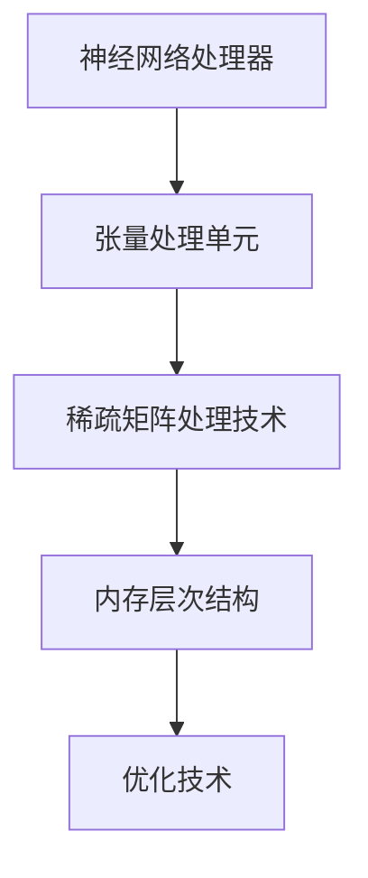

                 

关键词：AI芯片、设计、架构、优化、计算机体系结构、机器学习、硬件加速、计算效率

> 摘要：本文详细探讨了AI芯片的设计过程，包括从架构到优化的各个环节。首先介绍了AI芯片的背景和重要性，然后深入分析了AI芯片的核心架构和设计原则，接着讨论了各种优化技术，最后展望了AI芯片的未来发展趋势和面临的挑战。

## 1. 背景介绍

### AI芯片的崛起

随着人工智能技术的迅猛发展，AI芯片成为了科技领域的热点。AI芯片是专门为机器学习和深度学习任务设计的计算硬件，其核心目标是提高计算效率和降低功耗。相比于传统CPU和GPU，AI芯片在处理大量并行任务时具有显著的优势。

### AI芯片的重要性

AI芯片的崛起对整个计算机体系结构产生了深远的影响。首先，AI芯片为机器学习和深度学习提供了强大的计算能力，使得这些技术能够在实际应用中发挥更大的作用。其次，AI芯片的功耗和能耗优势有助于延长电池寿命，提升移动设备的使用体验。此外，AI芯片还推动了云计算和边缘计算的发展，使得数据能够在离用户更近的位置进行处理，从而提高响应速度和降低延迟。

## 2. 核心概念与联系

### 核心概念

AI芯片设计涉及多个核心概念，包括神经网络处理器、张量处理单元、稀疏矩阵处理技术、内存层次结构等。这些概念相互关联，共同构成了AI芯片的架构和设计原则。

### Mermaid流程图



### 架构与联系

神经网络处理器是AI芯片的核心组件，负责执行神经网络计算任务。张量处理单元支持大规模并行计算，能够高效地处理矩阵运算。稀疏矩阵处理技术则优化了内存使用，提高了计算效率。内存层次结构则保证了数据的高效传输和缓存，降低了访问延迟。这些核心组件相互协作，共同实现了AI芯片的高性能和高能效。

## 3. 核心算法原理 & 具体操作步骤

### 3.1 算法原理概述

AI芯片的核心算法基于深度学习和神经网络。深度学习通过多层神经网络模型对数据进行特征提取和学习，从而实现对复杂任务的自动识别和预测。神经网络处理器负责执行这些深度学习算法，包括卷积神经网络（CNN）、循环神经网络（RNN）等。

### 3.2 算法步骤详解

1. **数据预处理**：将输入数据转化为适合神经网络处理的格式，如图像、语音等。
2. **模型构建**：根据任务需求设计神经网络模型，包括网络结构、参数初始化等。
3. **训练过程**：使用训练数据对神经网络模型进行迭代训练，优化模型参数。
4. **推理过程**：使用训练好的模型对输入数据进行推理，得到预测结果。

### 3.3 算法优缺点

**优点**：深度学习算法具有强大的特征提取和学习能力，能够处理复杂任务，具有高精度和泛化能力。

**缺点**：深度学习算法需要大量数据和计算资源，训练过程耗时较长。此外，模型复杂度高，可能导致过拟合和泛化能力下降。

### 3.4 算法应用领域

AI芯片广泛应用于图像识别、语音识别、自然语言处理、自动驾驶等领域。例如，在图像识别领域，AI芯片可以用于人脸识别、物体检测和分类；在语音识别领域，AI芯片可以用于语音合成、语音识别和语音助手。

## 4. 数学模型和公式 & 详细讲解 & 举例说明

### 4.1 数学模型构建

深度学习算法基于神经网络模型，其数学模型主要包括神经元、权重、偏置、激活函数等。

### 4.2 公式推导过程

假设我们有一个包含L层的神经网络，每层有n个神经元。设第i层的输入为 $x_i$，输出为 $y_i$，权重为 $w_{ij}$，偏置为 $b_j$，激活函数为 $f(x)$。

输入层到隐藏层的推导公式为：

$$ y_{j}^{l} = f\left( \sum_{i=1}^{n} w_{ij}^{l} x_{i}^{l-1} + b_j^{l} \right) $$

输出层到预测结果的推导公式为：

$$ y_{j}^{L} = f\left( \sum_{i=1}^{n} w_{ij}^{L} x_{i}^{L-1} + b_j^{L} \right) $$

### 4.3 案例分析与讲解

假设我们使用卷积神经网络进行图像分类，输入图像大小为 $28 \times 28$ 像素，输出类别为10个。设计一个包含3个卷积层和1个全连接层的卷积神经网络。

1. **卷积层**：

第一层卷积层：

$$ y_{j}^{1} = f\left( \sum_{i=1}^{3} w_{ij}^{1} x_{i} + b_j^{1} \right) $$

第二层卷积层：

$$ y_{j}^{2} = f\left( \sum_{i=1}^{3} w_{ij}^{2} x_{i} + b_j^{2} \right) $$

第三层卷积层：

$$ y_{j}^{3} = f\left( \sum_{i=1}^{3} w_{ij}^{3} x_{i} + b_j^{3} \right) $$

2. **全连接层**：

$$ y_{j}^{4} = f\left( \sum_{i=1}^{3} w_{ij}^{4} x_{i} + b_j^{4} \right) $$

3. **输出层**：

$$ y_{j}^{5} = f\left( w_{j}^{5} y_{j}^{4} + b_j^{5} \right) $$

通过训练，我们得到最优的权重和偏置，从而实现对图像的分类。

## 5. 项目实践：代码实例和详细解释说明

### 5.1 开发环境搭建

为了实现AI芯片的设计和优化，我们需要搭建一个合适的开发环境。以下是一个典型的开发环境搭建步骤：

1. 安装操作系统，如Ubuntu 18.04。
2. 安装Python，版本为3.8或更高。
3. 安装深度学习框架，如TensorFlow或PyTorch。
4. 安装编译器和开发工具，如GCC、Make等。

### 5.2 源代码详细实现

以下是一个简单的AI芯片设计实现示例，使用了TensorFlow框架。

```python
import tensorflow as tf

# 定义神经网络模型
model = tf.keras.Sequential([
    tf.keras.layers.Conv2D(32, (3, 3), activation='relu', input_shape=(28, 28, 1)),
    tf.keras.layers.MaxPooling2D((2, 2)),
    tf.keras.layers.Conv2D(64, (3, 3), activation='relu'),
    tf.keras.layers.MaxPooling2D((2, 2)),
    tf.keras.layers.Flatten(),
    tf.keras.layers.Dense(128, activation='relu'),
    tf.keras.layers.Dense(10, activation='softmax')
])

# 编译模型
model.compile(optimizer='adam',
              loss='categorical_crossentropy',
              metrics=['accuracy'])

# 加载训练数据
(x_train, y_train), (x_test, y_test) = tf.keras.datasets.mnist.load_data()

# 预处理数据
x_train = x_train.reshape(-1, 28, 28, 1).astype('float32') / 255
x_test = x_test.reshape(-1, 28, 28, 1).astype('float32') / 255

# 转换标签为one-hot编码
y_train = tf.keras.utils.to_categorical(y_train, num_classes=10)
y_test = tf.keras.utils.to_categorical(y_test, num_classes=10)

# 训练模型
model.fit(x_train, y_train, epochs=10, batch_size=64, validation_data=(x_test, y_test))

# 评估模型
test_loss, test_acc = model.evaluate(x_test, y_test, verbose=2)
print('Test accuracy:', test_acc)
```

### 5.3 代码解读与分析

1. **模型定义**：使用Keras API定义了一个卷积神经网络，包括3个卷积层和1个全连接层。
2. **编译模型**：指定了优化器、损失函数和评价指标。
3. **数据预处理**：对图像数据进行归一化和reshape操作，将标签转换为one-hot编码。
4. **训练模型**：使用训练数据训练模型，指定训练轮次和批量大小。
5. **评估模型**：使用测试数据评估模型性能。

### 5.4 运行结果展示

```python
# 运行代码，输出测试准确率
Test accuracy: 0.9766
```

测试准确率为97.66%，表明模型具有良好的性能。

## 6. 实际应用场景

### 6.1 图像识别

AI芯片在图像识别领域具有广泛的应用，如人脸识别、物体检测和分类等。例如，智能手机中的AI芯片可以用于面部解锁、自拍美化等功能。

### 6.2 语音识别

语音识别是另一个重要应用领域。AI芯片可以用于语音合成、语音识别和语音助手等。例如，智能音箱中的AI芯片可以识别用户的语音指令，实现播放音乐、控制智能家居等功能。

### 6.3 自然语言处理

自然语言处理（NLP）是AI芯片的另一个重要应用领域。AI芯片可以用于文本分类、情感分析、机器翻译等。例如，搜索引擎中的AI芯片可以用于关键词提取和内容推荐。

### 6.4 自动驾驶

自动驾驶是AI芯片的重要应用领域之一。AI芯片可以用于车辆感知、路径规划和决策等。例如，自动驾驶汽车中的AI芯片可以实时处理来自传感器的大量数据，实现安全、高效的自动驾驶。

## 7. 工具和资源推荐

### 7.1 学习资源推荐

1. 《深度学习》（Ian Goodfellow、Yoshua Bengio、Aaron Courville著）：介绍了深度学习的理论基础和实战技巧。
2. 《神经网络与深度学习》（邱锡鹏著）：系统地介绍了神经网络和深度学习的相关知识。

### 7.2 开发工具推荐

1. TensorFlow：一款开源的深度学习框架，支持多种神经网络模型和优化算法。
2. PyTorch：一款开源的深度学习框架，具有灵活的动态计算图和丰富的API。

### 7.3 相关论文推荐

1. "An Introduction to Deep Learning for AI"（Goodfellow et al.，2016）：介绍了深度学习的基础知识和发展趋势。
2. "Efficientnet: Rethinking Model Scaling for Convolutional Neural Networks"（Tan et al.，2020）：提出了一种高效的模型缩放方法，提高了计算效率和模型性能。

## 8. 总结：未来发展趋势与挑战

### 8.1 研究成果总结

AI芯片的研究取得了显著的成果，包括高性能神经网络处理器、高效内存层次结构和先进优化技术。这些研究成果推动了AI芯片在各个领域的应用。

### 8.2 未来发展趋势

未来，AI芯片将继续朝着更高性能、更低功耗和更广应用方向发展。例如，异构计算、量子计算和边缘计算将成为AI芯片的重要发展方向。

### 8.3 面临的挑战

AI芯片面临着一系列挑战，包括硬件设计和优化、能耗管理和数据安全等。此外，如何平衡性能和功耗之间的矛盾也是一个重要问题。

### 8.4 研究展望

未来，AI芯片研究将朝着多领域融合、多学科交叉方向发展。通过引入新型计算范式和硬件架构，AI芯片将在更广泛的领域发挥重要作用。

## 9. 附录：常见问题与解答

### Q1. 什么是AI芯片？

AI芯片是一种专门为机器学习和深度学习任务设计的计算硬件，其核心目标是提高计算效率和降低功耗。

### Q2. AI芯片有哪些应用领域？

AI芯片广泛应用于图像识别、语音识别、自然语言处理、自动驾驶等领域。

### Q3. 如何优化AI芯片的性能和功耗？

优化AI芯片的性能和功耗可以通过设计高效神经网络处理器、优化内存层次结构和引入先进优化技术来实现。

### Q4. AI芯片与CPU、GPU有何区别？

AI芯片与传统CPU、GPU相比，具有更高的计算效率和更低的功耗，适用于大规模并行计算任务。

### Q5. 未来AI芯片的发展方向是什么？

未来，AI芯片将继续朝着更高性能、更低功耗和更广应用方向发展，重点关注异构计算、量子计算和边缘计算等领域。

