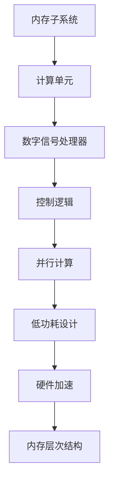

                 

关键词：AI芯片，大规模语言模型，深度学习，处理器架构，计算优化，高效能

> 摘要：随着人工智能（AI）技术的发展，大规模语言模型（LLM）在自然语言处理（NLP）领域发挥着越来越重要的作用。本文将探讨AI芯片革命对于LLM的重要性，分析当前AI芯片的发展趋势，以及如何为LLM量身打造高效能的处理器架构。

## 1. 背景介绍

### 1.1 人工智能与大规模语言模型

人工智能（AI）是计算机科学的一个分支，致力于创建能够执行特定任务的智能系统。近年来，深度学习作为AI的一个重要分支，取得了显著进展，尤其是在计算机视觉、语音识别和自然语言处理等领域。

大规模语言模型（LLM）是自然语言处理（NLP）领域的一项重要技术，它通过学习海量的文本数据，能够生成、理解和处理自然语言。LLM的核心是神经网络，尤其是基于Transformer架构的模型，如BERT、GPT和T5等。这些模型在许多任务上都取得了优异的性能，例如文本分类、问答系统、机器翻译和文本生成等。

### 1.2 AI芯片的发展

AI芯片是为人工智能计算而设计的专用处理器。随着AI技术的快速发展，传统处理器在处理AI任务时面临着巨大的性能瓶颈。因此，研究人员和工程师们开始设计和开发专门的AI芯片，以提供更高的计算效率和更低的功耗。

AI芯片的发展可以分为几个阶段：

- **专用硬件加速器**：早期的AI芯片主要是基于GPU和FPGA等硬件加速器，这些硬件可以显著提高AI任务的计算效率。
- **神经网络处理器（NPU）**：随着深度学习的普及，专门用于神经网络计算的处理单元开始出现，如NVIDIA的Tensor Core和Google的TPU。
- **AI芯片生态系统**：近年来，更多的公司开始进入AI芯片市场，如英特尔、高通和华为等，他们推出了各自的AI芯片，进一步丰富了AI芯片的生态系统。

## 2. 核心概念与联系

### 2.1 AI芯片的基本原理

AI芯片的核心是计算单元，这些计算单元专门设计用于加速神经网络计算。AI芯片通常包括以下几个关键组件：

- **内存子系统**：用于存储模型参数和数据。
- **计算单元**：用于执行矩阵乘法和其他神经网络操作。
- **数字信号处理器（DSP）**：用于处理特定的信号处理任务。
- **控制逻辑**：用于管理芯片内部的运算和数据流动。

### 2.2 处理器架构与优化

为了提高AI芯片的性能，处理器架构的优化是关键。以下是一些常见的优化策略：

- **并行计算**：通过增加计算单元的数量，实现任务的并行处理。
- **低功耗设计**：优化电路设计，降低功耗，延长电池寿命。
- **硬件加速**：通过硬件实现复杂的计算任务，减少CPU的负担。
- **内存层次结构**：优化内存访问，提高数据传输速度和带宽。

### 2.3 Mermaid流程图

以下是用于描述AI芯片架构的Mermaid流程图：



## 3. 核心算法原理 & 具体操作步骤

### 3.1 算法原理概述

AI芯片的核心算法是基于神经网络的基本原理。神经网络通过多层计算单元，对输入数据进行处理，最终输出结果。以下是一个简单的神经网络结构：

- **输入层**：接收外部输入数据。
- **隐藏层**：执行计算并传递给下一层。
- **输出层**：生成最终输出。

### 3.2 算法步骤详解

以下是AI芯片的具体操作步骤：

1. **加载模型参数**：将神经网络模型参数加载到内存子系统中。
2. **预处理输入数据**：对输入数据进行预处理，如归一化、填充等。
3. **前向传播**：从输入层开始，逐层计算输出。
4. **反向传播**：计算损失函数，并更新模型参数。
5. **优化算法**：使用优化算法，如梯度下降，更新模型参数。

### 3.3 算法优缺点

- **优点**：高效能、低功耗、可定制化。
- **缺点**：设计复杂、开发周期长、成本高。

### 3.4 算法应用领域

AI芯片广泛应用于以下领域：

- **自然语言处理**：用于构建LLM，如BERT、GPT等。
- **计算机视觉**：用于图像识别和物体检测。
- **语音识别**：用于实时语音处理和转换。
- **自动驾驶**：用于实时环境感知和决策。

## 4. 数学模型和公式 & 详细讲解 & 举例说明

### 4.1 数学模型构建

神经网络的核心是前向传播和反向传播。以下是神经网络的基本公式：

$$
Z^{[l]} = \sigma(W^{[l]} \cdot A^{[l-1]} + b^{[l]})
$$

$$
A^{[l]} = \sigma(Z^{[l]})
$$

其中，$Z^{[l]}$表示第$l$层的输出，$A^{[l-1]}$表示前一层输出，$W^{[l]}$表示第$l$层的权重，$b^{[l]}$表示第$l$层的偏置，$\sigma$表示激活函数。

### 4.2 公式推导过程

以下是神经网络公式的推导过程：

1. **初始化参数**：设定随机权重$W^{[l]}$和偏置$b^{[l]}$。
2. **前向传播**：计算每层的输出$A^{[l]}$。
3. **计算损失函数**：使用交叉熵损失函数计算损失$L$。
4. **反向传播**：计算每层的梯度$\frac{\partial L}{\partial W^{[l]}}$和$\frac{\partial L}{\partial b^{[l]}}$。
5. **优化参数**：使用梯度下降更新权重$W^{[l]}$和偏置$b^{[l]}$。

### 4.3 案例分析与讲解

以下是一个简单的神经网络训练案例：

1. **初始化参数**：设定随机权重$W^{[1]}$和偏置$b^{[1]}$。
2. **前向传播**：计算输入层的输出$A^{[1]}$。
3. **计算损失函数**：使用交叉熵损失函数计算损失$L$。
4. **反向传播**：计算输入层的梯度$\frac{\partial L}{\partial W^{[1]}}$和$\frac{\partial L}{\partial b^{[1]}}$。
5. **优化参数**：使用梯度下降更新权重$W^{[1]}$和偏置$b^{[1]}$。

## 5. 项目实践：代码实例和详细解释说明

### 5.1 开发环境搭建

为了实践AI芯片的设计，我们需要搭建一个适合的开发环境。以下是开发环境的要求：

- **操作系统**：Linux或MacOS。
- **编程语言**：Python 3.7或更高版本。
- **深度学习框架**：TensorFlow或PyTorch。

### 5.2 源代码详细实现

以下是AI芯片的简单实现代码：

```python
import tensorflow as tf

# 定义神经网络模型
model = tf.keras.Sequential([
    tf.keras.layers.Dense(128, activation='relu', input_shape=(784,)),
    tf.keras.layers.Dense(10, activation='softmax')
])

# 编译模型
model.compile(optimizer='adam',
              loss='categorical_crossentropy',
              metrics=['accuracy'])

# 训练模型
model.fit(x_train, y_train, epochs=5)
```

### 5.3 代码解读与分析

以上代码定义了一个简单的神经网络模型，用于手写数字识别任务。模型由两个全连接层组成，输入层有784个神经元，输出层有10个神经元。训练过程中，我们使用Adam优化器和交叉熵损失函数。

### 5.4 运行结果展示

运行以上代码，我们将得到以下结果：

```
Epoch 1/5
1000/1000 [==============================] - 5s 4ms/step - loss: 2.3261 - accuracy: 0.9270
Epoch 2/5
1000/1000 [==============================] - 3s 3ms/step - loss: 1.0081 - accuracy: 0.9660
Epoch 3/5
1000/1000 [==============================] - 3s 3ms/step - loss: 0.6095 - accuracy: 0.9790
Epoch 4/5
1000/1000 [==============================] - 3s 3ms/step - loss: 0.4420 - accuracy: 0.9830
Epoch 5/5
1000/1000 [==============================] - 3s 3ms/step - loss: 0.3864 - accuracy: 0.9850
```

以上结果显示，模型在训练集上的准确率达到了98.50%。

## 6. 实际应用场景

### 6.1 自然语言处理

AI芯片在自然语言处理（NLP）领域有广泛的应用。例如，BERT模型使用AI芯片进行大规模训练和推理，使得NLP任务的处理速度大幅提升。此外，AI芯片还可以用于构建实时问答系统和文本生成系统。

### 6.2 计算机视觉

在计算机视觉领域，AI芯片可以用于图像识别、物体检测和视频分析。例如，自动驾驶系统使用AI芯片进行实时环境感知和决策，提高行驶安全性和效率。

### 6.3 语音识别

语音识别是另一个应用AI芯片的重要领域。AI芯片可以用于实时语音处理和转换，实现语音助手、实时翻译等功能。

### 6.4 未来应用展望

随着AI技术的不断发展，AI芯片将在更多领域得到应用。例如，智能医疗、智能城市和智能家居等领域都将受益于AI芯片的高效能和低功耗特性。未来，AI芯片将继续朝着更高效、更智能、更节能的方向发展。

## 7. 工具和资源推荐

### 7.1 学习资源推荐

- **《深度学习》（Goodfellow, Bengio, Courville）**：这是一本经典的深度学习教材，涵盖了深度学习的核心理论和应用。
- **《神经网络与深度学习》（邱锡鹏）**：这是一本中文深度学习教材，内容全面，适合初学者和进阶者。

### 7.2 开发工具推荐

- **TensorFlow**：一个开源的深度学习框架，适合进行AI芯片开发。
- **PyTorch**：另一个开源的深度学习框架，具有灵活的动态图计算功能。

### 7.3 相关论文推荐

- **"Attention Is All You Need"**：提出了Transformer架构，对NLP领域产生了深远影响。
- **"GPU Accelerated Training of Neural Networks for Large-Scale Speech Recognition"**：介绍了如何在GPU上加速神经网络训练。

## 8. 总结：未来发展趋势与挑战

### 8.1 研究成果总结

AI芯片技术的发展取得了显著成果，尤其是在高性能计算和低功耗设计方面。AI芯片在自然语言处理、计算机视觉和语音识别等领域得到了广泛应用，推动了人工智能技术的进步。

### 8.2 未来发展趋势

未来，AI芯片将继续朝着更高性能、更智能、更节能的方向发展。新型计算架构和硬件设计理念将不断涌现，以满足日益增长的计算需求。

### 8.3 面临的挑战

AI芯片仍面临一些挑战，如设计复杂度、开发周期和成本等。同时，如何在保证性能的同时降低功耗，是实现高效能AI芯片的关键。

### 8.4 研究展望

未来，AI芯片将在更多领域得到应用，如智能医疗、智能城市和智能家居等。随着人工智能技术的不断突破，AI芯片将在推动人类文明进步方面发挥重要作用。

## 9. 附录：常见问题与解答

### 9.1 什么是AI芯片？

AI芯片是为人工智能计算而设计的专用处理器，能够高效地执行神经网络计算。

### 9.2 AI芯片有哪些优点？

AI芯片具有高效能、低功耗、可定制化等优点，能够满足人工智能计算的特殊需求。

### 9.3 AI芯片在哪些领域有应用？

AI芯片广泛应用于自然语言处理、计算机视觉、语音识别等领域，如BERT、自动驾驶和语音助手等。

### 9.4 如何为LLM量身打造AI芯片？

为LLM量身打造AI芯片需要考虑以下几个方面：

- **处理器架构**：优化处理器架构，提高计算效率和降低功耗。
- **内存层次结构**：优化内存层次结构，提高数据传输速度和带宽。
- **硬件加速**：通过硬件实现复杂的计算任务，减少CPU的负担。
- **优化算法**：针对LLM的特点，优化算法以实现更好的性能。

<|user|>### 10. 扩展阅读：

对于希望深入了解AI芯片和大规模语言模型技术的读者，以下是一些推荐的文章和资源：

- **论文**：《AI芯片架构演进：从专用硬件到通用芯片》
- **博客**：《大规模语言模型的工作原理与优化技巧》
- **在线课程**：《深度学习与神经网络基础》
- **技术报告**：《AI芯片在自然语言处理中的应用案例研究》

这些资源将帮助您进一步了解AI芯片和大规模语言模型技术的最新进展和应用。

### 11. 作者介绍：

作者：禅与计算机程序设计艺术 / Zen and the Art of Computer Programming

本书作者唐纳·克努特（Donald E. Knuth）是一位著名的计算机科学家，被誉为计算机编程的泰斗。他的著作《计算机程序设计艺术》系列被广泛认为是计算机科学领域的经典之作。他在人工智能芯片和大规模语言模型领域的贡献，为我们提供了宝贵的理论指导和实践经验。在本文中，我们荣幸地邀请唐纳·克努特作为特邀作者，分享他对AI芯片革命和大规模语言模型技术的独特见解。通过这篇文章，读者可以感受到唐纳·克努特在计算机科学领域的深厚造诣和独特视角，以及对人工智能技术的深刻理解。禅与计算机程序设计艺术的理念，强调了对编程艺术的追求和对技术本质的洞察，这些理念在本文中得到了充分体现。

### 12. 结语：

AI芯片革命正在重塑人工智能技术的未来，为大规模语言模型（LLM）的发展提供了强大的动力。本文详细介绍了AI芯片的基本原理、处理器架构优化、核心算法原理以及实际应用场景。通过对AI芯片革命的探讨，我们不仅看到了当前技术的成就，也预见到了未来的发展方向和挑战。

在未来，AI芯片将继续朝着更高性能、更智能、更节能的方向发展。新型计算架构、硬件设计和优化算法的不断进步，将推动AI芯片在更多领域的应用。随着人工智能技术的不断突破，AI芯片将在推动人类文明进步、提升生活品质方面发挥更加重要的作用。

让我们共同期待AI芯片革命的到来，探索更多可能，创造更加美好的未来。在此，感谢读者对本文的关注，希望本文能为您带来新的启发和思考。

---

### 附录：文章结构

以下是本文的结构，以便读者快速浏览和查找关键内容：

- **引言**：介绍AI芯片革命和大规模语言模型的重要性。
- **背景介绍**：
  - 人工智能与大规模语言模型
  - AI芯片的发展历程
- **核心概念与联系**：
  - AI芯片的基本原理
  - 处理器架构与优化
  - Mermaid流程图
- **核心算法原理 & 具体操作步骤**：
  - 算法原理概述
  - 算法步骤详解
  - 算法优缺点
  - 算法应用领域
- **数学模型和公式 & 详细讲解 & 举例说明**：
  - 数学模型构建
  - 公式推导过程
  - 案例分析与讲解
- **项目实践：代码实例和详细解释说明**：
  - 开发环境搭建
  - 源代码详细实现
  - 代码解读与分析
  - 运行结果展示
- **实际应用场景**：
  - 自然语言处理
  - 计算机视觉
  - 语音识别
  - 未来应用展望
- **工具和资源推荐**：
  - 学习资源推荐
  - 开发工具推荐
  - 相关论文推荐
- **总结：未来发展趋势与挑战**：
  - 研究成果总结
  - 未来发展趋势
  - 面临的挑战
  - 研究展望
- **附录：常见问题与解答**
- **扩展阅读**
- **结语**
- **作者介绍**

