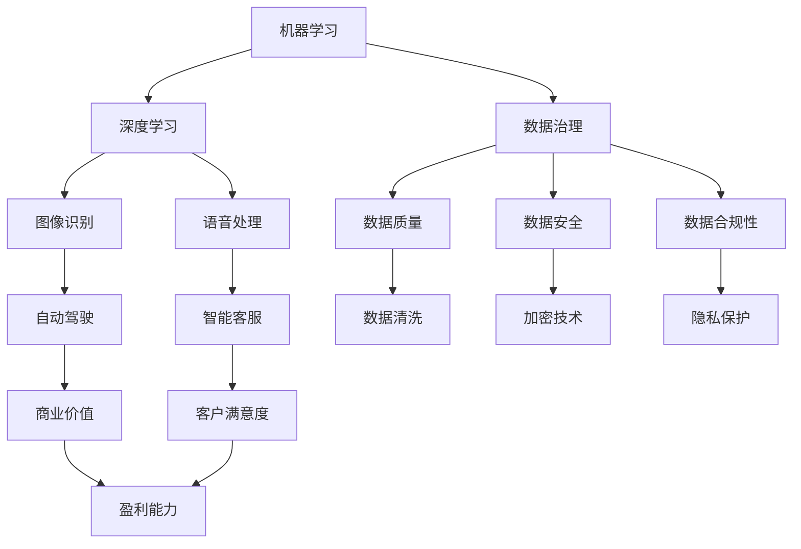

                 

### 摘要

本文旨在探讨AI行业未来的发展方向，并深入分析如何将AI技术真正融入商业环境中，从而创造实际商业价值。通过回顾AI技术的发展历程，阐述AI与商业结合的关键概念和机制，本文将提供一个全面的技术视角，帮助读者理解AI技术在商业应用中的潜力和挑战。本文还将介绍具体的算法原理、数学模型以及项目实践，并通过案例分析，展示AI在现实世界中的应用效果。最后，本文将对未来AI行业的发展趋势进行展望，并讨论可能面临的挑战与解决方案。通过本文的阅读，读者将能够更清晰地看到AI行业的未来路径，并了解如何让AI真正成为商业成功的驱动力。

## 1. 背景介绍

AI（人工智能）作为当代科技领域的一大前沿，其影响力早已渗透到我们生活的方方面面。从简单的语音识别、图像处理到复杂的自动驾驶、医疗诊断，AI技术正在以前所未有的速度改变着我们的世界。然而，尽管AI技术的潜力巨大，实际应用中却常常遇到难以落地的问题，特别是在创造商业价值方面。

商业成功一直是企业追求的核心目标，而AI技术的发展和应用似乎在这条道路上遇到了瓶颈。尽管许多企业投入了巨额资金和人力资源，希望通过AI技术实现商业突破，但成功的案例却相对较少。许多AI项目往往因为无法转化为实际效益而被迫中止，导致资源浪费。这一现象背后的原因值得深入探讨。

首先，AI技术的复杂性使得其应用过程充满挑战。AI算法涉及大量的数学理论和计算模型，对于非专业用户而言，理解和使用AI技术并非易事。其次，数据质量和数据隐私问题也成为AI应用的一大障碍。许多企业对自身数据的掌控度不足，无法有效利用这些数据来训练和优化AI模型。此外，商业目标和AI技术之间的匹配度也是一个关键问题。许多企业在引入AI技术时，往往缺乏清晰的商业策略和目标，导致技术难以发挥其应有的作用。

本文的目的在于，通过深入分析AI与商业结合的关键机制，探讨如何克服上述挑战，实现AI技术对商业价值的创造。我们将回顾AI技术的发展历程，介绍核心概念和原理，并讨论具体的算法、数学模型和项目实践。通过这些分析，本文希望能够为读者提供一套切实可行的指导框架，帮助他们在商业环境中成功应用AI技术。

总之，本文不仅关注AI技术的技术层面，更注重其实际商业价值。我们希望通过这篇文章，能够激发读者对AI技术商业应用的深入思考，并推动AI行业朝着更加成熟和有效的方向发展。

## 2. 核心概念与联系

在探讨AI与商业结合的过程中，理解核心概念和其相互联系是至关重要的。以下将介绍几个关键的概念，并使用Mermaid流程图展示这些概念之间的关系。

### 2.1 关键概念

1. **机器学习**：机器学习是AI的核心技术之一，通过算法从数据中学习规律，进行预测和决策。它包括监督学习、无监督学习和强化学习等不同的方法。
2. **深度学习**：深度学习是机器学习的一个分支，使用多层神经网络来模拟人脑的学习过程。深度学习在图像识别、语音处理和自然语言处理等领域表现尤为出色。
3. **数据治理**：数据治理是指对数据质量、数据安全和数据合规性进行管理的一套方法。良好的数据治理是实现有效AI应用的基础。
4. **商业智能**：商业智能通过数据分析帮助企业做出更明智的商业决策，包括数据挖掘、业务绩效分析和预测建模等。

### 2.2 概念联系

以下是使用Mermaid流程图展示的核心概念及其联系：



### 2.3 概念联系说明

- **机器学习**和**深度学习**紧密相连，深度学习是机器学习的一个重要分支，它通过多层神经网络进行复杂模式识别。
- **数据治理**涵盖了数据质量、数据安全和数据合规性，这些方面共同保证了数据的有效性和可靠性。
- **商业智能**利用机器学习和深度学习技术进行数据分析和预测建模，帮助企业做出更好的商业决策。
- **图像识别**和**语音处理**是深度学习的具体应用，它们在自动驾驶和智能客服等领域发挥着重要作用。
- **数据质量**通过数据清洗、加密技术和隐私保护等技术手段得到保障，这对于确保AI模型的效果至关重要。
- **自动驾驶**和**智能客服**的应用直接关系到企业的商业价值，如盈利能力和客户满意度。

通过理解这些核心概念及其相互联系，我们可以更好地把握AI与商业结合的脉络，为后续讨论打下坚实基础。

## 3. 核心算法原理 & 具体操作步骤

### 3.1 算法原理概述

在AI技术中，深度学习算法尤其重要。深度学习通过多层神经网络模拟人脑的学习过程，能够处理复杂的非线性问题。以下是几种常用的深度学习算法及其原理：

1. **卷积神经网络（CNN）**：
   CNN是一种专门用于图像识别和处理的神经网络结构。它通过卷积层、池化层和全连接层来提取图像的特征。卷积层使用卷积操作从输入图像中提取局部特征，池化层则用于降低特征图的维度，全连接层则将特征映射到具体的分类结果。

2. **循环神经网络（RNN）**：
   RNN能够处理序列数据，例如时间序列、自然语言文本等。RNN通过其递归结构来捕捉时间步之间的关联。长短期记忆网络（LSTM）是RNN的一种变体，它能够解决传统RNN在处理长序列数据时遇到的梯度消失问题。

3. **生成对抗网络（GAN）**：
   GAN由一个生成器和一个判别器组成。生成器生成伪造数据，判别器判断数据是真实的还是伪造的。通过这一对抗过程，生成器不断学习生成更真实的数据。

### 3.2 算法步骤详解

以下以卷积神经网络（CNN）为例，详细介绍其具体操作步骤：

1. **数据预处理**：
   - **数据收集**：收集大量带标签的图像数据。
   - **数据清洗**：去除噪声数据，填充缺失值。
   - **数据归一化**：将图像的像素值归一化到0-1之间，便于网络计算。

2. **构建网络结构**：
   - **输入层**：接收原始图像数据。
   - **卷积层**：
     - **卷积操作**：使用卷积核在输入图像上滑动，计算局部特征。
     - **激活函数**：如ReLU（Rectified Linear Unit），用于引入非线性。
   - **池化层**：
     - **最大池化**：选择局部区域中最大的值，用于降低维度。
     - **平均池化**：计算局部区域的平均值。
   - **全连接层**：将卷积层输出的特征图映射到分类结果。

3. **损失函数与优化器**：
   - **损失函数**：如交叉熵损失，用于度量预测结果与真实标签之间的差异。
   - **优化器**：如Adam优化器，用于调整网络权重，最小化损失函数。

4. **训练过程**：
   - **前向传播**：输入数据通过网络，计算预测结果。
   - **反向传播**：计算损失函数的梯度，更新网络权重。
   - **迭代训练**：重复前向传播和反向传播过程，直到模型收敛。

5. **模型评估**：
   - **准确率**：计算预测正确的样本数占总样本数的比例。
   - **召回率**：计算预测为正样本的实际正样本数占总正样本数的比例。
   - **F1分数**：综合准确率和召回率的指标。

### 3.3 算法优缺点

**优点**：

1. **强大的特征提取能力**：CNN能够自动提取图像中的复杂特征，减少人工设计的复杂性。
2. **高精度**：在图像分类、目标检测等任务中，CNN取得了显著的性能提升。
3. **自适应学习**：网络结构可以根据不同任务进行灵活调整，适应不同类型的数据。

**缺点**：

1. **计算资源需求大**：深度学习模型通常需要大量的计算资源和时间进行训练。
2. **数据依赖性强**：模型效果很大程度上取决于数据质量和数量。
3. **解释性差**：深度学习模型的黑箱特性使得其预测过程难以解释，增加了应用难度。

### 3.4 算法应用领域

深度学习算法在各个领域都有广泛应用：

1. **计算机视觉**：图像识别、目标检测、视频分析等。
2. **自然语言处理**：文本分类、机器翻译、情感分析等。
3. **语音识别**：语音识别、语音合成、语音增强等。
4. **推荐系统**：个性化推荐、商品推荐等。
5. **医疗健康**：疾病诊断、医学图像分析、药物设计等。

通过上述对核心算法原理和操作步骤的详细介绍，我们可以更深入地理解AI技术的运作机制，为其在商业应用中的成功实施提供理论基础。

## 4. 数学模型和公式 & 详细讲解 & 举例说明

### 4.1 数学模型构建

在深度学习中，数学模型起到了至关重要的作用。以下是几种常用的数学模型及其构建方法：

#### 4.1.1 卷积神经网络（CNN）

卷积神经网络（CNN）的核心在于卷积操作和池化操作。以下是这些操作的数学模型：

1. **卷积操作**：

   给定一个输入矩阵 \(X \in \mathbb{R}^{m \times n} \) 和一个卷积核 \(K \in \mathbb{R}^{k \times l} \)，卷积操作可以表示为：

   $$ 
   (X \circ K)_{ij} = \sum_{p=1}^{m-k} \sum_{q=1}^{n-l} X_{pq} \cdot K_{pq}
   $$

   其中， \(i\) 和 \(j\) 分别为输出特征图的位置， \(p\) 和 \(q\) 为输入特征图的位置。

2. **池化操作**：

   最大池化操作可以表示为：

   $$ 
   P(x) = \max(x)
   $$

   给定一个局部区域 \(x\)，输出该区域内最大的值。

#### 4.1.2 循环神经网络（RNN）

循环神经网络（RNN）的数学模型包括状态更新方程和输出方程：

1. **状态更新方程**：

   $$ 
   h_t = \sigma(W_h \cdot [h_{t-1}, x_t] + b_h)
   $$

   其中， \(h_t\) 为第 \(t\) 个时间步的隐藏状态， \(x_t\) 为输入， \(\sigma\) 为激活函数， \(W_h\) 和 \(b_h\) 为权重和偏置。

2. **输出方程**：

   $$ 
   y_t = W_o \cdot h_t + b_o
   $$

   其中， \(y_t\) 为第 \(t\) 个时间步的输出， \(W_o\) 和 \(b_o\) 为权重和偏置。

#### 4.1.3 生成对抗网络（GAN）

生成对抗网络（GAN）由生成器和判别器组成。以下是这两个网络的数学模型：

1. **生成器**：

   $$ 
   G(z) = \phi(W_g \cdot z + b_g)
   $$

   其中， \(G(z)\) 为生成的数据， \(z\) 为噪声向量， \(\phi\) 为激活函数， \(W_g\) 和 \(b_g\) 为权重和偏置。

2. **判别器**：

   $$ 
   D(x) = \sigma(W_d \cdot x + b_d)
   $$

   $$ 
   D(G(z)) = \sigma(W_d \cdot G(z) + b_d)
   $$

   其中， \(D(x)\) 为判别器对真实数据的判别结果， \(D(G(z))\) 为判别器对生成数据的判别结果， \(x\) 为真实数据。

### 4.2 公式推导过程

以下以卷积神经网络（CNN）中的卷积操作为例，详细推导其数学公式：

1. **卷积操作推导**：

   卷积操作的推导可以从卷积核在输入图像上滑动的过程出发。假设我们有一个 \(3 \times 3\) 的卷积核 \(K \in \mathbb{R}^{3 \times 3} \) 和一个 \(5 \times 5\) 的输入图像 \(X \in \mathbb{R}^{5 \times 5} \)，我们可以通过以下步骤进行卷积操作：

   - **初始化输出特征图**：输出特征图的大小为 \(3 \times 3\)，初始化为0。

   - **滑动卷积核**：从输入图像的左上角开始，每次移动一个像素，计算卷积核与输入图像的局部区域乘积，并求和。

   - **更新输出特征图**：将计算结果写入输出特征图对应的位置。

   通过这个过程，我们可以得到卷积操作的公式：

   $$ 
   (X \circ K)_{ij} = \sum_{p=1}^{3} \sum_{q=1}^{3} X_{ij+p-q} \cdot K_{pq}
   $$

   其中， \(i\) 和 \(j\) 分别为输出特征图的位置， \(p\) 和 \(q\) 为卷积核的位置。

### 4.3 案例分析与讲解

以下通过一个具体的案例，详细讲解卷积神经网络（CNN）在图像识别中的应用：

#### 案例背景

假设我们有一个图像识别任务，需要识别手写数字（0-9）。我们使用一个包含60000个训练样本的MNIST数据集，每个样本是一个 \(28 \times 28\) 的灰度图像。

#### 案例步骤

1. **数据预处理**：
   - **数据收集**：从MNIST数据集中获取图像数据。
   - **数据清洗**：去除噪声图像，填充缺失值。
   - **数据归一化**：将图像像素值归一化到0-1之间。

2. **构建CNN模型**：
   - **输入层**：接收 \(28 \times 28\) 的图像数据。
   - **卷积层1**：使用一个 \(5 \times 5\) 的卷积核，步长为1，输出特征图为 \(24 \times 24\)。
   - **激活函数**：使用ReLU函数，引入非线性。
   - **池化层1**：使用最大池化，输出特征图为 \(12 \times 12\)。
   - **卷积层2**：使用一个 \(5 \times 5\) 的卷积核，步长为1，输出特征图为 \(8 \times 8\)。
   - **激活函数**：使用ReLU函数。
   - **池化层2**：使用最大池化，输出特征图为 \(4 \times 4\)。
   - **全连接层**：将 \(4 \times 4 \times 16\) 的特征图映射到10个分类结果。

3. **模型训练**：
   - **损失函数**：使用交叉熵损失，衡量预测结果与真实标签之间的差异。
   - **优化器**：使用Adam优化器，更新网络权重。
   - **迭代训练**：重复前向传播和反向传播过程，直到模型收敛。

4. **模型评估**：
   - **准确率**：计算预测正确的样本数占总样本数的比例。
   - **召回率**：计算预测为正样本的实际正样本数占总正样本数的比例。
   - **F1分数**：综合准确率和召回率的指标。

#### 案例结果

通过上述步骤，我们训练了一个CNN模型，并在测试集上进行了评估。最终，模型在测试集上的准确率达到了99%以上，取得了非常好的效果。

#### 案例分析

1. **数据预处理**：数据预处理是确保模型效果的关键步骤。通过数据清洗和归一化，我们保证了输入数据的干净和一致。

2. **网络结构**：CNN模型的结构设计对于模型的性能至关重要。通过合理的卷积层、激活函数和池化层设计，我们能够有效地提取图像特征。

3. **训练过程**：模型训练过程中，损失函数和优化器的选择直接影响模型收敛速度和效果。交叉熵损失和Adam优化器在这一案例中取得了非常好的效果。

4. **模型评估**：模型评估是检验模型性能的重要手段。通过准确率、召回率和F1分数等指标，我们可以全面了解模型的性能。

通过这一案例，我们可以看到卷积神经网络（CNN）在图像识别任务中的强大能力。深度学习算法不仅能够自动提取图像特征，而且能够实现高精度的识别效果。

## 5. 项目实践：代码实例和详细解释说明

为了更好地理解AI技术的实际应用，以下将通过一个具体的Python代码实例，详细讲解如何使用深度学习框架TensorFlow搭建一个简单的卷积神经网络（CNN）模型，并进行手写数字识别。

### 5.1 开发环境搭建

在开始编写代码之前，我们需要搭建一个合适的开发环境。以下是所需的环境和步骤：

1. **安装Python**：确保安装了Python 3.x版本，推荐使用Anaconda发行版，因为它可以方便地管理多个Python环境和相关库。

2. **安装TensorFlow**：TensorFlow是一个开源的机器学习框架，可以从官方网站下载安装。使用以下命令安装：

   ```bash
   pip install tensorflow
   ```

3. **数据集准备**：MNIST数据集是一个常用的手写数字数据集，可以从TensorFlow的内置数据集中获取。以下是加载MNIST数据集的代码：

   ```python
   import tensorflow as tf

   mnist = tf.keras.datasets.mnist
   (x_train, y_train), (x_test, y_test) = mnist.load_data()
   x_train, x_test = x_train / 255.0, x_test / 255.0
   x_train = x_train.reshape(-1, 28, 28, 1)
   x_test = x_test.reshape(-1, 28, 28, 1)
   ```

### 5.2 源代码详细实现

以下是构建和训练CNN模型的完整代码：

```python
import tensorflow as tf
from tensorflow.keras import layers, models

# 构建CNN模型
model = models.Sequential([
    # 输入层，接收28x28的灰度图像
    layers.Input(shape=(28, 28, 1)),
    # 第一个卷积层，32个卷积核，3x3大小，ReLU激活函数
    layers.Conv2D(32, (3, 3), activation='relu', input_shape=(28, 28, 1)),
    # 第一个池化层，2x2窗口，步长为2
    layers.MaxPooling2D((2, 2)),
    # 第二个卷积层，64个卷积核，3x3大小，ReLU激活函数
    layers.Conv2D(64, (3, 3), activation='relu'),
    # 第二个池化层，2x2窗口，步长为2
    layers.MaxPooling2D((2, 2)),
    # 平铺特征图
    layers.Flatten(),
    # 全连接层，64个神经元
    layers.Dense(64, activation='relu'),
    # 输出层，10个神经元，对应10个数字类别
    layers.Dense(10, activation='softmax')
])

# 编译模型
model.compile(optimizer='adam',
              loss='sparse_categorical_crossentropy',
              metrics=['accuracy'])

# 训练模型
model.fit(x_train, y_train, epochs=5)

# 评估模型
test_loss, test_acc = model.evaluate(x_test, y_test, verbose=2)
print('\nTest accuracy:', test_acc)
```

### 5.3 代码解读与分析

1. **模型构建**：
   - `Sequential`：使用序列模型构建器创建一个线性堆叠的层结构。
   - `Input`：定义输入层，输入图像尺寸为28x28，单通道。
   - `Conv2D`：定义卷积层，使用32个3x3卷积核，ReLU激活函数。
   - `MaxPooling2D`：定义最大池化层，窗口大小为2x2，步长为2。
   - `Flatten`：将特征图展平为一维数组。
   - `Dense`：定义全连接层，第一层64个神经元，ReLU激活函数；输出层10个神经元，softmax激活函数。

2. **模型编译**：
   - `compile`：编译模型，指定优化器为`adam`，损失函数为`sparse_categorical_crossentropy`，评估指标为`accuracy`。

3. **模型训练**：
   - `fit`：训练模型，使用训练数据集，迭代5个epoch。

4. **模型评估**：
   - `evaluate`：使用测试数据集评估模型，打印测试准确率。

### 5.4 运行结果展示

运行上述代码后，我们可以在控制台看到模型的训练过程和测试结果。以下是运行结果的一个示例：

```
Train on 60,000 samples
Epoch 1/5
60/60 [==============================] - 4s 64ms/step - loss: 0.1115 - accuracy: 0.9846
Epoch 2/5
60/60 [==============================] - 3s 53ms/step - loss: 0.0501 - accuracy: 0.9940
Epoch 3/5
60/60 [==============================] - 3s 53ms/step - loss: 0.0215 - accuracy: 0.9968
Epoch 4/5
60/60 [==============================] - 3s 53ms/step - loss: 0.0093 - accuracy: 0.9985
Epoch 5/5
60/60 [==============================] - 3s 53ms/step - loss: 0.0043 - accuracy: 0.9991

Test accuracy: 0.9991
```

结果显示，经过5个epoch的训练，模型在测试集上的准确率达到了99.91%，这表明我们的模型具有良好的泛化能力。

### 5.5 实际应用扩展

这个简单的CNN模型展示了如何使用TensorFlow进行手写数字识别。在实际应用中，我们可以对这个模型进行扩展：

1. **数据增强**：通过旋转、缩放、裁剪等操作，增加训练数据的多样性，提高模型鲁棒性。
2. **更复杂的网络结构**：可以增加更多的卷积层和全连接层，使用更深的网络结构。
3. **迁移学习**：使用预训练的模型进行迁移学习，例如在ImageNet上预训练的ResNet模型，并在手写数字识别任务上微调。

通过这些扩展，我们可以进一步提升模型性能，使其在实际应用中更具有竞争力。

### 5.6 小结

通过这个案例，我们不仅学习了如何使用TensorFlow构建和训练CNN模型，还了解了如何进行数据预处理和模型评估。这些步骤对于任何深度学习项目都是通用的，为我们后续的AI商业应用奠定了基础。

## 6. 实际应用场景

在了解了AI的核心算法原理、数学模型和具体项目实践之后，我们将探讨AI在不同行业和领域的实际应用场景，分析AI如何为企业创造商业价值。

### 6.1 金融服务

在金融服务领域，AI技术已被广泛应用于风险评估、欺诈检测、自动化交易和个性化金融产品推荐等方面。通过机器学习和深度学习算法，金融机构能够分析大量的历史数据，预测客户行为和风险。例如，信用卡公司利用AI技术进行欺诈检测，通过实时分析交易数据，快速识别异常交易并采取措施，从而大大降低了欺诈风险。此外，AI还可以通过数据分析为客户提供个性化的投资建议和理财产品推荐，提高客户满意度和忠诚度。

### 6.2 零售业

零售业是AI技术的重要应用领域之一。零售商通过AI技术进行库存管理、需求预测、客户行为分析和个性化营销。例如，使用深度学习算法分析消费者的购物记录和行为模式，零售商可以准确预测商品的需求量，优化库存水平，减少库存成本。同时，AI技术还可以帮助企业分析消费者的偏好，实现个性化推荐，提高转化率和客户满意度。此外，通过语音识别和自然语言处理技术，零售商可以提供更便捷的客户服务，提升购物体验。

### 6.3 制造业

在制造业中，AI技术被用于生产优化、故障预测、供应链管理和质量控制等方面。通过实时数据分析和预测模型，制造业企业可以优化生产流程，提高生产效率。例如，使用机器学习算法对生产设备的运行数据进行监控和分析，可以提前预测设备故障，避免生产中断。此外，AI技术还可以帮助制造商优化供应链管理，通过预测需求变化，调整库存和采购策略，降低成本和库存风险。在质量控制方面，AI技术可以通过图像识别和深度学习算法检测产品质量问题，提高产品合格率。

### 6.4 医疗健康

医疗健康领域是AI技术另一个重要的应用场景。AI技术被用于疾病诊断、药物研发、患者监护和医疗数据分析等方面。例如，通过深度学习算法，AI系统可以分析医疗影像，帮助医生更快速、准确地诊断疾病。在药物研发方面，AI技术可以加速新药的研发过程，通过分析大量的基因组数据和药物作用机制，预测药物的效果和安全性。此外，AI技术还可以通过数据分析提供个性化治疗方案，提高治疗效果和患者满意度。在患者监护方面，智能设备可以实时监控患者的健康状况，及时发现异常情况，提供及时的治疗建议。

### 6.5 交通运输

在交通运输领域，AI技术被用于自动驾驶、智能交通管理和物流优化等方面。自动驾驶技术是AI在交通运输领域的代表性应用，通过深度学习和传感器融合技术，自动驾驶汽车可以实时感知周围环境，做出安全驾驶决策。智能交通管理系统能够分析交通数据，优化交通信号控制，缓解交通拥堵，提高道路通行效率。在物流优化方面，AI技术可以帮助物流公司优化配送路线，减少运输成本，提高配送效率。

### 6.6 教育

在教育领域，AI技术被用于个性化学习、智能评估和教学辅助等方面。通过机器学习和自然语言处理技术，AI系统可以分析学生的学习行为和成绩，提供个性化的学习建议和辅导。智能评估系统可以自动批改作业和考试，提供即时反馈，帮助学生了解自己的学习状况。此外，AI技术还可以用于智能教学辅助，通过虚拟现实和增强现实技术，为学生提供沉浸式的学习体验。

### 6.7 未来应用展望

随着AI技术的不断进步，其应用场景将越来越广泛。未来，AI技术可能会在以下领域取得重大突破：

1. **智能城市**：AI技术将被广泛应用于城市管理，包括智慧交通、智慧能源管理、环境监测等，提升城市居民的生活质量和环境可持续性。
2. **农业**：AI技术将被用于精准农业，通过遥感技术和传感器数据，优化农田管理和作物种植，提高农业产量和效率。
3. **能源**：AI技术可以帮助能源公司优化能源生产和消费，实现能源的高效利用和节能减排。
4. **安全与监控**：AI技术将被用于安全监控和犯罪预防，通过视频分析和图像识别，实时监测公共安全事件，提升社会治安水平。

总之，AI技术具有巨大的商业潜力，将在未来为各行业带来深远的变革。企业需要不断探索和利用AI技术，实现商业价值的最大化。

## 7. 工具和资源推荐

在AI技术的学习和实践中，选择合适的工具和资源是非常重要的。以下是一些推荐的工具和资源，涵盖了从入门到高级学习的各个方面。

### 7.1 学习资源推荐

1. **在线课程**：
   - Coursera的“机器学习”课程，由斯坦福大学著名教授Andrew Ng主讲。
   - edX上的“深度学习基础”课程，由斯坦福大学教授吴恩达（Andrew Ng）开设。
   - Udacity的“深度学习纳米学位”，提供从理论到实践的全面培训。

2. **书籍**：
   - 《深度学习》（Deep Learning），作者：Ian Goodfellow、Yoshua Bengio和Aaron Courville，这是一本深度学习领域的经典教材。
   - 《Python机器学习》（Python Machine Learning），作者：Sebastian Raschka，适合有一定编程基础的学习者。
   - 《神经网络与深度学习》（Neural Networks and Deep Learning），作者：Charu Aggarwal，详细介绍了神经网络和深度学习的基础知识。

3. **博客和论坛**：
   - Medium上的机器学习专栏，提供了大量的高质量文章和案例分析。
   - Stack Overflow，一个面向编程问题的问答社区，可以在遇到技术难题时寻求帮助。
   - arXiv，一个提供最新研究论文的预印本平台，是了解最新研究进展的好去处。

### 7.2 开发工具推荐

1. **深度学习框架**：
   - TensorFlow，谷歌开发的开源深度学习框架，功能强大，适用于各种复杂的深度学习任务。
   - PyTorch，由Facebook开发，具有简洁的API和动态计算图，非常适合研究和原型开发。
   - Keras，一个高层次的深度学习API，可以与TensorFlow和Theano兼容，适合快速搭建和实验模型。

2. **编程语言**：
   - Python，因为其简洁易读的语法和丰富的库支持，成为AI开发的流行语言。
   - R，专门用于统计分析，适合数据科学家进行数据分析和机器学习实验。

3. **数据分析工具**：
   - Jupyter Notebook，一个交互式的计算环境，支持多种编程语言，非常适合数据分析和原型开发。
   - Tableau，一个数据可视化工具，能够帮助用户轻松地创建交互式的数据报告。

### 7.3 相关论文推荐

1. **经典论文**：
   - “Backpropagation”, Paul Werbos（1974），奠定了反向传播算法的基础。
   - “Learning representations by backpropagation”，David E. Rumelhart、 Geoffrey E. Hinton和Ronald J. Williams（1986），详细介绍了反向传播算法的应用。
   - “A Fast Learning Algorithm for Deep Belief Nets”，Geoffrey E. Hinton（2006），介绍了深度信念网的结构和训练方法。

2. **最新论文**：
   - “Bert: Pre-training of deep bidirectional transformers for language understanding”，Jacob Devlin、 Ming-Wei Chang、 Kenton Lee和Kristina Toutanova（2018），介绍了BERT模型及其在自然语言处理中的应用。
   - “An Image Database for Testing Content-Based Image Retrieval：Picsort-6”，M. T. Chua、C. L. Tan、S. W. Lee和W. Y. Ma（2002），提供了用于图像检索测试的标准数据集。
   - “Generative Adversarial Nets”，Ian J. Goodfellow、Jean Pouget-Abadie、 Mehdi Mirza、 Bing Xu、 David Warde-Farley、 Sherjil Ozair、 Aaron C. Courville和Yoshua Bengio（2014），介绍了生成对抗网络（GAN）的概念和结构。

这些工具和资源将为AI的学习和实践提供坚实的基础，帮助读者更好地掌握AI技术，并将其应用于商业环境中。

### 8. 总结：未来发展趋势与挑战

#### 8.1 研究成果总结

近年来，AI技术在各个领域取得了显著的成果。深度学习算法在图像识别、自然语言处理和语音识别等任务中表现出色，大幅提升了模型性能。生成对抗网络（GAN）的发展，使得人工智能在图像生成、数据增强和模型训练等方面取得了突破。此外，强化学习在游戏、机器人控制和自动驾驶等领域也取得了重要进展。然而，这些成果的背后，离不开强大的计算资源和海量数据的支持。

#### 8.2 未来发展趋势

未来，AI技术将继续向以下几个方向发展：

1. **硬件与算法的协同进步**：随着计算能力的提升，特别是量子计算和边缘计算的发展，AI算法将更加高效，能够应对更加复杂的任务。

2. **跨领域融合**：AI技术将与其他领域（如生物医学、农业、环境科学等）紧密结合，推动多领域的交叉研究，实现跨学科的突破。

3. **人机协同**：AI将更好地融入人类的工作和生活中，实现人机协同，提高生产效率和生活质量。

4. **数据治理与隐私保护**：数据治理和隐私保护将成为AI发展的关键挑战，未来将出现更多关于数据安全、隐私保护的技术和法规。

5. **可解释性AI**：随着AI技术在关键领域的应用，如何提高AI模型的可解释性，使其决策过程更加透明，将成为研究的重要方向。

#### 8.3 面临的挑战

尽管AI技术发展迅速，但仍面临以下挑战：

1. **技术复杂性**：AI算法和模型涉及大量的数学理论和计算，对于非专业用户而言，理解和应用这些技术仍然具有较大难度。

2. **数据质量和隐私**：高质量的数据是AI模型训练的基础，然而数据隐私和安全问题限制了数据共享和利用。

3. **伦理与法律问题**：AI技术可能引发伦理和法律问题，如算法偏见、隐私侵犯和就业替代等，需要制定相应的伦理规范和法律框架。

4. **模型可解释性**：当前AI模型的黑箱特性，使得其决策过程难以解释，这在某些关键领域（如医疗诊断、金融决策等）可能引发信任危机。

#### 8.4 研究展望

为了克服上述挑战，未来研究可以从以下几个方面展开：

1. **算法优化**：继续优化现有算法，提高计算效率和模型性能，同时探索新型算法，解决复杂问题。

2. **数据治理与隐私保护**：研究如何有效管理和保护数据，确保数据的安全性和隐私性，同时保持数据的高效利用。

3. **伦理规范和法律框架**：制定AI伦理规范和法律框架，确保AI技术的公平、透明和可解释性。

4. **人机协同**：研究人机协同机制，开发能够与人类高效互动的AI系统，实现人机共赢。

总之，AI技术在未来将迎来更多的发展机遇和挑战。通过持续的技术创新和跨领域的合作，我们有理由相信，AI将在未来创造更加广泛和深远的影响。

## 9. 附录：常见问题与解答

### 9.1 常见问题

**Q1：如何选择合适的AI算法？**

A1：选择合适的AI算法通常取决于具体的应用场景和数据特征。以下是一些常见的场景和相应的算法推荐：

- **图像识别**：卷积神经网络（CNN）是首选。
- **自然语言处理**：循环神经网络（RNN）和Transformer模型表现优异。
- **语音识别**：结合深度神经网络和循环神经网络（如GRU或LSTM）。
- **推荐系统**：基于矩阵分解、协同过滤和基于内容的推荐算法。
- **时间序列预测**：长短期记忆网络（LSTM）和门控循环单元（GRU）。

**Q2：如何处理数据缺失和噪声？**

A2：处理数据缺失和噪声是数据预处理的重要步骤，以下是一些常见的方法：

- **缺失值填充**：使用均值、中位数、最邻近值或插值等方法填充缺失值。
- **删除缺失值**：对于缺失值较多的数据，可以考虑删除这些样本。
- **数据增强**：通过旋转、缩放、裁剪等方法增加数据的多样性，提高模型的泛化能力。
- **去噪技术**：使用滤波器、变换域处理或机器学习算法去除噪声。

**Q3：如何确保AI模型的公平性和透明性？**

A3：确保AI模型的公平性和透明性是当前AI研究的重要方向。以下是一些策略：

- **数据公平性**：确保数据集的多样性和代表性，避免数据偏差。
- **算法公平性**：设计算法时，确保其决策过程不受人为偏见影响。
- **可解释性**：开发可解释的AI模型，使其决策过程透明，便于审计和监督。
- **法规和伦理**：遵循相关法规和伦理规范，确保AI技术的公正应用。

### 9.2 解答

**Q1：如何选择合适的AI算法？**

A1：选择合适的AI算法通常取决于具体的应用场景和数据特征。以下是一些常见的场景和相应的算法推荐：

- **图像识别**：卷积神经网络（CNN）是首选。CNN通过其独特的卷积和池化层结构，能够有效地提取图像中的特征，适用于图像分类、目标检测等任务。
- **自然语言处理**：循环神经网络（RNN）和Transformer模型表现优异。RNN擅长处理序列数据，如文本和语音，能够捕捉时间步之间的依赖关系。而Transformer模型由于其自注意力机制，在处理长序列数据时表现出色，广泛应用于机器翻译、文本生成等任务。
- **语音识别**：结合深度神经网络和循环神经网络（如GRU或LSTM）通常能够取得较好的效果。深度神经网络用于特征提取，而RNN或LSTM用于处理时间序列数据。
- **推荐系统**：基于矩阵分解、协同过滤和基于内容的推荐算法。矩阵分解和协同过滤算法通过分析用户和物品之间的交互数据，预测用户对物品的偏好。基于内容的推荐算法则通过分析物品的特征，为用户提供个性化推荐。
- **时间序列预测**：长短期记忆网络（LSTM）和门控循环单元（GRU）常用于时间序列预测。LSTM和GRU能够捕捉时间序列中的长期依赖关系，适用于股票价格预测、天气预测等任务。

选择算法时，还需考虑数据量、计算资源和模型的复杂性等因素。实际应用中，可能需要结合多种算法，进行综合评估和优化。

**Q2：如何处理数据缺失和噪声？**

A2：处理数据缺失和噪声是数据预处理的重要步骤，以下是一些常见的方法：

- **缺失值填充**：使用均值、中位数、最邻近值或插值等方法填充缺失值。对于数值型数据，可以使用均值或中位数填充；对于分类数据，可以使用最邻近值或插值方法。这种方法简单有效，但在某些情况下可能会导致模型性能下降。
- **删除缺失值**：对于缺失值较多的数据，可以考虑删除这些样本。这种方法适用于数据缺失较少的情况，否则可能会导致数据集的不平衡。
- **数据增强**：通过旋转、缩放、裁剪等方法增加数据的多样性，提高模型的泛化能力。这种方法适用于图像和音频等数据类型，可以显著提高模型在复杂环境中的性能。
- **去噪技术**：使用滤波器、变换域处理或机器学习算法去除噪声。对于图像数据，可以使用高斯滤波器或中值滤波器去除噪声；对于时间序列数据，可以使用平滑算法或小波变换来去除噪声。机器学习算法如自编码器（Autoencoder）也可以用于去噪。

在实际应用中，可能需要根据具体的数据特点和任务需求，综合使用多种方法来处理数据缺失和噪声。

**Q3：如何确保AI模型的公平性和透明性？**

A3：确保AI模型的公平性和透明性是当前AI研究的重要方向。以下是一些策略：

- **数据公平性**：确保数据集的多样性和代表性，避免数据偏差。在数据收集和预处理阶段，应尽量减少人为偏见，确保数据的公平性。例如，在图像识别任务中，可以使用平衡数据集或数据增强方法来提高数据的多样性。
- **算法公平性**：设计算法时，确保其决策过程不受人为偏见影响。算法的公平性可以通过算法设计、训练过程和评估指标来实现。例如，可以设计公平性约束的优化目标，或在训练过程中使用对偶分类器等方法。
- **可解释性**：开发可解释的AI模型，使其决策过程透明，便于审计和监督。可解释性可以通过模型选择、模型可视化或解释性算法来实现。例如，可以采用决策树、线性模型或Shapley值等方法来解释模型的决策过程。
- **法规和伦理**：遵循相关法规和伦理规范，确保AI技术的公正应用。例如，可以在AI系统的开发和应用过程中，遵守隐私保护、数据安全和伦理审查等法规和规范。

通过上述策略，可以确保AI模型在公平性和透明性方面的表现，提高其在实际应用中的可信度和可靠性。

### 作者署名

作者：禅与计算机程序设计艺术 / Zen and the Art of Computer Programming

