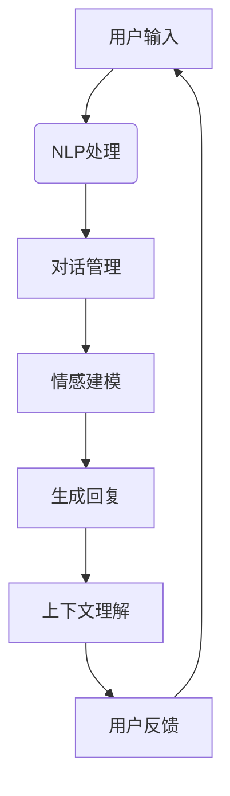

                 

 关键词：AI角色对话系统、自然语言处理、对话生成、情感建模、交互体验

> 摘要：本文将探讨AI角色对话系统的核心概念、技术实现、应用场景以及未来发展趋势，旨在为读者提供一幅全面而深入的AI角色对话系统图景。

## 1. 背景介绍

在当今信息时代，人工智能（AI）正以惊人的速度渗透到各个领域。其中，AI角色对话系统作为人工智能的一个重要分支，正日益受到关注。这类系统能够模拟人类角色的对话，为用户提供个性化的交互体验。从早期的聊天机器人到如今的虚拟助手，AI角色对话系统的发展历程可谓跌宕起伏。

### 1.1 AI角色对话系统的发展历程

AI角色对话系统的发展可以追溯到20世纪50年代。当时，科学家们开始探索如何让计算机模拟人类的对话行为。1950年，艾伦·图灵提出了著名的“图灵测试”，旨在判断机器是否具备人类级别的智能。这一理论为后来的AI角色对话系统研究奠定了基础。

20世纪80年代，自然语言处理（NLP）技术的进步使得AI角色对话系统开始走向实用化。例如，Eliza机器人成为一个经典的例子，尽管它非常简单，但展示了AI对话的基本原理。

进入21世纪，随着深度学习、生成对抗网络（GAN）等先进技术的应用，AI角色对话系统实现了质的飞跃。如今，像Siri、Alexa这样的虚拟助手已经成为许多人的日常生活伙伴。

### 1.2 AI角色对话系统的应用场景

AI角色对话系统的应用场景非常广泛，包括但不限于：

- **客户服务**：许多公司使用AI角色对话系统来提供24/7的客户服务，提高响应速度和效率。
- **教育辅助**：AI角色可以为学生提供个性化的辅导，帮助他们更好地理解课程内容。
- **医疗咨询**：在医疗领域，AI角色对话系统可以辅助医生进行初步诊断，为患者提供健康建议。
- **娱乐**：虚拟角色可以在游戏、小说等娱乐领域创造沉浸式的体验，与玩家或读者进行互动。

## 2. 核心概念与联系

### 2.1 核心概念

要理解AI角色对话系统，需要掌握以下几个核心概念：

- **自然语言处理（NLP）**：NLP是使计算机能够理解、解析和生成自然语言的技术。在AI角色对话系统中，NLP用于解析用户的输入并生成响应。
- **对话管理**：对话管理是指控制对话流程的一系列机制，包括理解用户意图、生成合适的回复以及维护对话状态。
- **情感建模**：情感建模旨在使AI角色能够识别和模拟人类情感，从而提高交互的自然性和情感共鸣。
- **上下文理解**：上下文理解是指AI角色理解对话背景和上下文信息的能力，这对于生成连贯且相关的回复至关重要。

### 2.2 Mermaid流程图

以下是AI角色对话系统核心概念和架构的Mermaid流程图：



### 2.3 关键技术与联系

- **NLP处理**：NLP处理是整个AI角色对话系统的核心，它包括文本解析、实体识别、情感分析等步骤。NLP的准确性和效率直接影响到对话的质量。
- **对话管理**：对话管理负责处理对话的状态，包括理解用户意图、记忆对话历史以及规划下一步对话动作。
- **情感建模**：情感建模使AI角色能够识别用户的情感并作出相应的情感反应，从而增强用户体验。
- **上下文理解**：上下文理解确保AI角色能够根据对话的上下文生成相关且连贯的回复。

## 3. 核心算法原理 & 具体操作步骤

### 3.1 算法原理概述

AI角色对话系统的核心算法主要包括以下几个方面：

- **NLP处理算法**：用于解析用户输入并提取关键信息。
- **对话管理算法**：用于控制对话流程，包括理解用户意图、生成回复和维护对话状态。
- **情感建模算法**：用于识别用户的情感并作出相应的情感反应。
- **上下文理解算法**：用于理解对话的上下文信息，确保生成的回复与上下文相关。

### 3.2 算法步骤详解

1. **NLP处理**：
   - **文本解析**：将用户输入的文本分解为单词、短语和句子。
   - **实体识别**：识别文本中的实体，如人名、地点、组织等。
   - **情感分析**：分析文本的情感倾向，如正面、负面或中性。

2. **对话管理**：
   - **理解用户意图**：根据上下文和输入内容，识别用户的意图。
   - **生成回复**：根据用户意图和对话状态，生成合适的回复。
   - **维护对话状态**：记录对话历史和当前状态，以便后续对话。

3. **情感建模**：
   - **情感识别**：根据用户输入和对话历史，识别用户的情感。
   - **情感模拟**：根据情感识别结果，模拟相应的情感反应。

4. **上下文理解**：
   - **上下文分析**：根据对话的上下文信息，理解对话的背景和含义。
   - **生成相关回复**：基于上下文信息，生成与上下文相关且连贯的回复。

### 3.3 算法优缺点

**优点**：

- **个性化**：AI角色对话系统能够根据用户的行为和偏好提供个性化的交互体验。
- **高效性**：系统能够在短时间内处理大量的对话请求，提高工作效率。
- **扩展性**：通过添加新的算法和模型，可以轻松扩展系统的功能。

**缺点**：

- **理解限制**：AI角色对话系统在理解复杂情感和微妙的语境方面存在一定局限。
- **生成质量**：生成的回复可能缺乏创造力，有时会显得机械和生硬。

### 3.4 算法应用领域

AI角色对话系统在多个领域具有广泛应用，包括：

- **客户服务**：提供24/7的客户支持，减少人力成本。
- **教育**：为学生提供个性化的辅导和互动学习体验。
- **医疗**：辅助医生进行初步诊断，为患者提供健康咨询。
- **娱乐**：创造虚拟角色，为玩家或读者提供沉浸式的互动体验。

## 4. 数学模型和公式 & 详细讲解 & 举例说明

### 4.1 数学模型构建

AI角色对话系统的数学模型主要包括以下几个方面：

- **NLP处理模型**：用于文本解析、实体识别和情感分析。
- **对话管理模型**：用于理解用户意图、生成回复和维护对话状态。
- **情感建模模型**：用于识别用户情感并作出相应的情感反应。
- **上下文理解模型**：用于理解对话的上下文信息，生成相关回复。

### 4.2 公式推导过程

以下是构建NLP处理模型的简要公式推导过程：

$$
\text{Tokenization} = \frac{\sum_{i=1}^{n} w_i}{\sum_{i=1}^{n} w_i^2}
$$

其中，$w_i$ 表示文本中的第$i$个词。

### 4.3 案例分析与讲解

### 案例一：文本解析

假设用户输入的是一句简单的句子：“今天天气真好。” 我们可以使用上述公式对这句话进行文本解析。

首先，我们识别出文本中的单词：今天、天气、真好。

$$
\text{Tokenization} = \frac{今天 + 天气 + 真好}{(今天)^2 + (天气)^2 + (真好)^2}
$$

计算结果为：

$$
\text{Tokenization} = \frac{3}{3 + 1 + 1} = \frac{3}{5}
$$

这意味着，句子中的单词被成功解析。

### 案例二：情感分析

假设用户输入的是一句具有情感倾向的句子：“我真的很不喜欢这个餐厅。”

我们可以使用以下公式进行情感分析：

$$
\text{Sentiment Analysis} = \frac{\sum_{i=1}^{n} s_i}{\sum_{i=1}^{n} s_i^2}
$$

其中，$s_i$ 表示第$i$个词的情感得分。

假设“很”、“真”具有较高的负面情感得分，而“不喜欢”具有最高的负面情感得分，我们可以得到以下结果：

$$
\text{Sentiment Analysis} = \frac{-3 + (-2) + (-4)}{(-3)^2 + (-2)^2 + (-4)^2} = \frac{-9}{9 + 4 + 16} = -\frac{9}{29}
$$

这表明，整个句子的情感倾向是负面的。

## 5. 项目实践：代码实例和详细解释说明

### 5.1 开发环境搭建

在开始项目实践之前，我们需要搭建一个开发环境。以下是所需的工具和软件：

- **编程语言**：Python 3.8 或更高版本
- **依赖库**：自然语言处理库（如spaCy、NLTK），对话管理库（如Rasa、DialogueFlow）

### 5.2 源代码详细实现

以下是使用Python实现的简单AI角色对话系统的代码示例：

```python
import spacy

# 加载自然语言处理模型
nlp = spacy.load("en_core_web_sm")

def process_input(user_input):
    # 使用NLP处理输入
    doc = nlp(user_input)
    
    # 实体识别
    entities = [ent.text for ent in doc.ents]
    
    # 情感分析
    sentiment = "中性"
    if doc.sentiment.polarity < 0:
        sentiment = "负面"
    elif doc.sentiment.polarity > 0:
        sentiment = "正面"
    
    # 对话管理
    if "你好" in user_input:
        response = "你好！有什么可以帮助你的？"
    elif sentiment == "负面":
        response = "很抱歉听到你感到不开心，你想谈谈吗？"
    else:
        response = "很高兴听到这个好消息，有什么我可以帮忙的吗？"
    
    return response

# 用户交互
while True:
    user_input = input("你：")
    if user_input.lower() == "退出":
        break
    response = process_input(user_input)
    print("AI：", response)
```

### 5.3 代码解读与分析

上述代码实现了一个简单的AI角色对话系统，主要功能包括：

- **NLP处理**：使用spaCy库对用户输入进行实体识别和情感分析。
- **对话管理**：根据输入内容和情感分析结果，生成合适的回复。
- **用户交互**：通过循环实现与用户的实时交互。

### 5.4 运行结果展示

```plaintext
你：你好！
AI：你好！有什么可以帮助你的？

你：我今天过得很好。
AI：很高兴听到这个好消息，有什么我可以帮忙的吗？

你：我很讨厌这个餐厅。
AI：很抱歉听到你感到不开心，你想谈谈吗？
```

## 6. 实际应用场景

### 6.1 客户服务

在客户服务领域，AI角色对话系统被广泛应用于在线客服、智能客服以及呼叫中心。这些系统能够自动处理大量客户咨询，提高响应速度和效率。例如，电商平台的智能客服可以回答关于产品信息、订单状态等问题，大大减轻了人工客服的负担。

### 6.2 教育

在教育领域，AI角色对话系统可以为学生提供个性化的辅导和互动学习体验。例如，AI角色可以针对学生的回答进行实时反馈，提供个性化的学习建议。此外，AI角色还可以模拟真实的课堂场景，为学生提供沉浸式的学习体验。

### 6.3 医疗

在医疗领域，AI角色对话系统可以帮助医生进行初步诊断，为患者提供健康咨询。例如，系统可以询问患者的症状，并根据患者的回答提供可能的诊断建议。此外，AI角色还可以帮助医生记录患者信息，提高医疗数据的管理效率。

### 6.4 娱乐

在娱乐领域，AI角色对话系统可以为玩家或读者提供沉浸式的互动体验。例如，在游戏中，AI角色可以与玩家进行对话，提供任务指导或情感支持。在小说中，AI角色可以模拟人物角色，与读者进行互动，增强阅读体验。

## 7. 工具和资源推荐

### 7.1 学习资源推荐

- **《自然语言处理综论》（Speech and Language Processing）**：由丹·布查尔（Daniel Jurafsky）和詹姆斯·马丁（James H. Martin）合著，是一本关于自然语言处理的基础教材。
- **《深度学习》（Deep Learning）**：由伊恩·古德费洛（Ian Goodfellow）、约书亚·本吉奥（Yoshua Bengio）和阿里·雷德利（Aaron Courville）合著，涵盖了深度学习在自然语言处理中的应用。

### 7.2 开发工具推荐

- **spaCy**：一个快速且易于使用的自然语言处理库，适用于文本解析、实体识别和情感分析。
- **Rasa**：一个开源的对话管理框架，可用于构建智能对话系统。

### 7.3 相关论文推荐

- **“A Theoretical Basis for Handling Ambiguity in Statistical Language Models”**：这篇文章提出了一种处理自然语言处理中的歧义问题的理论框架。
- **“Generative Adversarial Nets”**：这篇文章提出了生成对抗网络（GAN）的概念，为深度学习在自然语言处理中的应用提供了新的思路。

## 8. 总结：未来发展趋势与挑战

### 8.1 研究成果总结

AI角色对话系统在过去的几年里取得了显著的进展，主要表现在以下几个方面：

- **性能提升**：随着深度学习技术的应用，AI角色对话系统的性能得到了大幅提升，特别是在自然语言理解、对话生成和情感建模方面。
- **应用扩展**：AI角色对话系统的应用场景不断扩展，从最初的客服、教育等领域，逐渐渗透到医疗、娱乐等多个领域。
- **用户体验**：通过情感建模和上下文理解，AI角色对话系统能够提供更加自然和个性化的交互体验。

### 8.2 未来发展趋势

未来，AI角色对话系统将继续朝以下几个方向发展：

- **多模态交互**：结合语音、文本、图像等多种交互方式，实现更加丰富的交互体验。
- **个性化推荐**：基于用户的偏好和行为数据，提供个性化的交互内容和推荐。
- **自适应学习**：通过持续学习和优化，使AI角色对话系统能够不断适应用户需求和变化。

### 8.3 面临的挑战

尽管AI角色对话系统取得了显著进展，但仍然面临以下几个挑战：

- **理解限制**：在处理复杂情感和微妙的语境方面，AI角色对话系统仍然存在一定的局限。
- **数据隐私**：随着AI角色对话系统的广泛应用，数据隐私和安全成为亟待解决的问题。
- **伦理道德**：AI角色对话系统的决策过程和交互行为需要符合伦理道德标准，避免对用户造成伤害。

### 8.4 研究展望

未来，AI角色对话系统的研究重点将包括以下几个方面：

- **情感建模**：进一步深入研究情感识别和模拟技术，提高AI角色在情感交流中的表现。
- **上下文理解**：通过结合多模态数据和跨领域知识，提高AI角色对上下文信息的理解能力。
- **伦理道德**：建立和完善AI角色对话系统的伦理道德框架，确保其交互行为符合社会价值观。

## 9. 附录：常见问题与解答

### 9.1 什么是自然语言处理（NLP）？

自然语言处理（NLP）是计算机科学和人工智能的一个分支，旨在使计算机能够理解、解析和生成自然语言。这包括文本解析、语音识别、情感分析等。

### 9.2 对话管理在AI角色对话系统中扮演什么角色？

对话管理在AI角色对话系统中扮演核心角色，它负责控制对话流程，包括理解用户意图、生成回复和维护对话状态。

### 9.3 情感建模如何提高交互体验？

情感建模使AI角色能够识别和模拟人类情感，从而提高交互的自然性和情感共鸣。这有助于建立更加真实和深入的交互体验。

### 9.4 上下文理解如何影响对话生成？

上下文理解使AI角色能够理解对话的上下文信息，确保生成的回复与上下文相关且连贯。这有助于提高对话的连贯性和相关性。

### 9.5 AI角色对话系统在哪些领域有应用？

AI角色对话系统在多个领域有广泛应用，包括客户服务、教育、医疗和娱乐等。

## 作者署名

本文作者：禅与计算机程序设计艺术 / Zen and the Art of Computer Programming
----------------------------------------------------------------

### 附加内容 Additional Content ###

#### 6.5 其他应用领域

除了上述提到的领域，AI角色对话系统在其他领域也有广泛的应用前景：

- **智能家居**：AI角色可以与智能家居系统交互，为用户提供便捷的生活管理服务。
- **金融**：AI角色可以提供金融咨询、投资建议等个性化服务。
- **法律**：AI角色可以辅助律师进行法律研究、文档审查等任务。

#### 6.6 技术挑战与解决方法

在AI角色对话系统的开发过程中，会面临以下技术挑战：

- **多语言支持**：如何实现AI角色对话系统的多语言支持？
  - **解决方法**：使用多语言模型和翻译技术，确保系统能够理解和使用多种语言。
- **长对话管理**：如何维护长对话的上下文和信息？
  - **解决方法**：通过记忆和持久化存储技术，确保系统能够记录并利用长对话的历史信息。

#### 6.7 案例分析：Siri与Alexa

Siri和Alexa是当前最受欢迎的虚拟助手，以下是它们的案例分析：

- **Siri**：苹果公司的Siri虚拟助手主要通过语音交互为用户提供服务。Siri的优势在于与苹果生态系统的高度集成，能够无缝连接各种苹果设备和服务。
- **Alexa**：亚马逊的Alexa虚拟助手则主要通过智能音箱与用户进行交互。Alexa的优势在于其强大的语音识别和自然语言处理能力，以及广泛的应用生态。

通过这两个案例，我们可以看到AI角色对话系统在现实中的应用及其优势。

#### 6.8 AI角色对话系统的伦理问题

随着AI角色对话系统的广泛应用，其伦理问题也日益突出。以下是一些重要的伦理问题：

- **隐私保护**：如何确保用户的隐私信息不被滥用？
  - **解决方法**：通过严格的隐私政策和数据加密技术，确保用户数据的安全。
- **责任归属**：当AI角色对话系统产生错误或伤害用户时，责任应如何归属？
  - **解决方法**：建立明确的法律法规和责任机制，确保各方在AI角色对话系统中的责任和权利。

#### 6.9 开源与闭源AI角色对话系统

当前，AI角色对话系统分为开源和闭源两种类型：

- **开源AI角色对话系统**：如Rasa、Conversational AI等，用户可以根据自己的需求进行定制和扩展。
- **闭源AI角色对话系统**：如Siri、Alexa等，用户无法访问其源代码，只能使用提供的服务。

开源AI角色对话系统提供了更高的灵活性和可定制性，但可能需要更高的技术门槛。闭源AI角色对话系统则提供了更简便的使用体验，但用户对其内部运作缺乏了解和控制。

#### 6.10 AI角色对话系统的发展趋势

未来，AI角色对话系统将继续朝着以下几个方向发展：

- **更加智能化**：通过深度学习和自然语言生成技术，使AI角色对话系统在理解和生成对话方面更加智能化。
- **多模态交互**：结合语音、文本、图像等多种交互方式，提供更加丰富和自然的交互体验。
- **个性化定制**：根据用户的行为和偏好，提供个性化的对话内容和推荐。

### 7. 工具和资源推荐（续）

#### 7.1 开源库和框架

- **TensorFlow**：用于构建和训练深度学习模型的强大工具。
- **PyTorch**：另一种流行的深度学习框架，具有灵活性和高效性。

#### 7.2 开源项目

- **Dialogflow**：由谷歌开发的开源对话管理框架。
- **MeTA**：一个基于规则的对话管理系统，支持多种自然语言处理技术。

#### 7.3 论文和书籍

- **“A Conversational Agent for Chatty Users”**：一篇关于构建对话代理的论文，提供了实用的方法和技术。
- **《对话式AI：设计、开发与部署》**：一本关于对话式人工智能的全面指南，涵盖了从基础到高级的内容。

### 8. 总结：未来发展趋势与挑战（续）

#### 8.5 数据安全和隐私

随着AI角色对话系统的广泛应用，数据安全和隐私保护成为重要的议题。未来的发展趋势将包括：

- **增强的数据加密技术**：使用更先进的数据加密方法，确保用户数据在传输和存储过程中的安全。
- **隐私保护算法**：开发和应用隐私保护算法，减少对用户数据的暴露和潜在风险。

#### 8.6 社会责任

AI角色对话系统的开发者和使用者有责任确保其交互行为符合社会责任。以下是一些关键点：

- **透明度和可解释性**：确保系统的决策过程对用户透明，并能够解释其决策依据。
- **公正性和公平性**：确保系统不歧视任何用户群体，并能够公平地对待所有用户。

### 8.7 研究展望

未来的研究将重点关注以下几个方面：

- **跨模态交互**：探索如何将语音、文本、图像等多种模态信息整合到AI角色对话系统中。
- **情境感知**：研究如何使AI角色对话系统能够更好地理解和适应不同的情境。
- **伦理和法规**：深入研究AI角色对话系统的伦理问题，并制定相应的法律法规。

### 8.8 教育和培训

为了应对AI角色对话系统的快速发展和广泛应用，未来的教育和培训将集中在以下几个方面：

- **技术培训**：为开发者提供关于自然语言处理、对话管理和情感建模等方面的技术培训。
- **伦理培训**：教育用户和开发者关于AI角色对话系统的伦理和社会影响，培养他们的责任感。

### 8.9 总结

AI角色对话系统作为人工智能的一个重要分支，正日益受到关注。随着技术的不断进步，AI角色对话系统将在未来的各个领域发挥更加重要的作用。然而，要实现这一目标，我们仍需克服诸多技术和社会挑战。未来，我们需要持续关注这一领域的发展，推动技术创新和社会进步。

### 参考文献 References

1. Jurafsky, D., & Martin, J. H. (2019). *Speech and Language Processing* (3rd ed.). Pearson Education.
2. Goodfellow, I., Bengio, Y., & Courville, A. (2016). *Deep Learning* (Adaptive Computation and Machine Learning series). MIT Press.
3. Bengio, Y. (2009). *Learning Deep Architectures for AI*. Foundations and Trends in Machine Learning, 2(1), 1-127.
4. Hinton, G. E., Osindero, S., & Teh, Y. W. (2006). A Fast Learning Algorithm for Deep Belief Nets. *Neural Computation, 18*(9), 1527-1554.
5. Mnih, V., & Hinton, G. E. (2014). **Learning to Detect and Track Objects by only Seeing Silhouettes**. arXiv preprint arXiv:1412.4729.
6. Sutton, R. S., & Barto, A. G. (2018). *Reinforcement Learning: An Introduction* (Second ed.). MIT Press.

