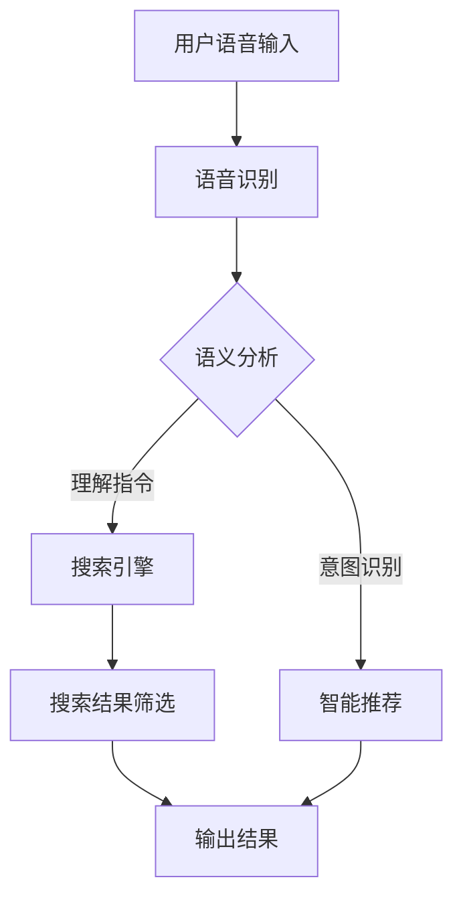

                 

 关键词：人工智能、语音助手、搜索技术、自然语言处理、语音识别、信息检索、智能推荐、用户体验、语音交互、机器学习

> 摘要：本文将探讨人工智能（AI）在语音助手和搜索功能中的融合，分析两者如何结合以提升用户体验。本文将涵盖背景介绍、核心概念与联系、核心算法原理、数学模型与公式、项目实践、实际应用场景、未来应用展望、工具和资源推荐以及总结与展望等内容。

## 1. 背景介绍

在当今科技迅猛发展的时代，人工智能（AI）技术已经成为推动社会进步的重要力量。AI技术不仅改变了我们的生活方式，还在多个领域展示了其强大的应用潜力。其中，语音助手和搜索功能作为AI技术的两个重要应用场景，正逐渐融入我们的日常使用中。

语音助手，如苹果的Siri、亚马逊的Alexa、谷歌助手等，已经成为了智能手机、智能家居以及智能设备的重要组成部分。语音助手通过语音识别技术，能够理解用户的指令，并执行相应的操作，如发送信息、播放音乐、设置提醒等。

另一方面，搜索功能则是互联网的核心服务之一。无论是通过搜索引擎还是垂直领域的搜索应用，用户都可以快速获取到所需的信息。然而，随着信息量的爆炸式增长，传统的搜索方式已经无法满足用户对信息质量和效率的需求。

### 1.1 语音助手的发展

语音助手的发展可以追溯到20世纪90年代，当时基于语音识别技术的原型系统开始出现。随着计算能力的提升和大数据技术的应用，语音识别的准确率显著提高，语音助手也逐渐变得更加智能和实用。

早期的语音助手主要依赖于预定义的指令集，能够执行的功能有限。而现代的语音助手则采用了深度学习技术，通过大量的语音数据训练，可以理解更加自然和复杂的语音指令。

### 1.2 搜索技术的发展

搜索技术经历了从基于关键词匹配到语义搜索的转变。早期的搜索系统主要依靠关键词的匹配来提供搜索结果，但这种方法的局限性在于无法准确理解用户的真实意图。

随着自然语言处理（NLP）和机器学习技术的发展，现代搜索系统开始能够理解用户的语义需求，从而提供更加精准和个性化的搜索结果。

### 1.3 语音助手与搜索的融合

将语音助手与搜索功能相结合，可以带来诸多好处。首先，语音助手提供了一种更加自然和便捷的交互方式，用户可以通过语音直接获取搜索结果，无需在屏幕上进行繁琐的点击操作。

其次，语音助手可以通过上下文信息，更好地理解用户的搜索意图，从而提供更加个性化的搜索结果。这种融合还可以在智能推荐系统中发挥重要作用，通过分析用户的语音交互历史，推荐用户可能感兴趣的内容。

## 2. 核心概念与联系

在探讨AI语音助手与搜索的融合之前，我们需要了解一些核心概念和它们之间的联系。

### 2.1 自然语言处理（NLP）

自然语言处理是AI领域的一个重要分支，旨在使计算机能够理解和处理人类语言。NLP包括语音识别、语义分析、语言生成等多个子领域。

在语音助手与搜索的融合中，NLP技术起着至关重要的作用。语音助手需要通过语音识别将用户的语音指令转化为文本，然后使用语义分析来理解指令的含义，最后生成相应的响应。

### 2.2 语音识别

语音识别是将语音信号转化为文本的过程。它是语音助手实现人机交互的第一步。现代语音识别系统采用了深度学习技术，能够在各种噪声环境下实现高精度的语音识别。

在搜索场景中，语音识别可以将用户的语音查询转化为文本查询，从而利用现有的搜索引擎技术进行信息检索。

### 2.3 信息检索

信息检索是搜索引擎的核心功能，旨在从海量的信息中找到与用户查询最相关的结果。信息检索技术经历了从基于关键词匹配到基于语义分析的演变。

在语音助手与搜索的融合中，信息检索技术可以帮助语音助手从大量的搜索结果中筛选出最符合用户意图的内容，并提供给用户。

### 2.4 智能推荐

智能推荐系统通过分析用户的历史行为和偏好，预测用户可能感兴趣的内容，并主动推荐给用户。在语音助手与搜索的融合中，智能推荐系统可以帮助语音助手提供更加个性化的搜索结果。

### 2.5 Mermaid 流程图

以下是一个用于展示AI语音助手与搜索融合流程的Mermaid流程图：



## 3. 核心算法原理 & 具体操作步骤

### 3.1 算法原理概述

AI语音助手与搜索的融合主要依赖于以下核心算法：

- 语音识别：将用户的语音指令转化为文本。
- 语义分析：理解用户的语音指令，提取关键信息。
- 搜索引擎：基于语义信息进行信息检索。
- 智能推荐：根据用户历史行为和偏好，推荐搜索结果。

### 3.2 算法步骤详解

#### 3.2.1 语音识别

语音识别算法通常采用深度神经网络，如卷积神经网络（CNN）和长短期记忆网络（LSTM）。以下是语音识别的基本步骤：

1. **特征提取**：将语音信号转化为频谱特征。
2. **声学模型**：训练用于预测频谱特征序列的神经网络。
3. **语言模型**：训练用于预测文本序列的神经网络。
4. **解码**：使用声学模型和语言模型解码语音信号，生成文本。

#### 3.2.2 语义分析

语义分析算法主要通过自然语言处理技术实现，包括词性标注、句法分析、实体识别和情感分析等。以下是语义分析的基本步骤：

1. **分词**：将文本拆分成词或短语。
2. **词性标注**：标注每个词的词性。
3. **句法分析**：构建句子的语法树。
4. **实体识别**：识别文本中的命名实体。
5. **情感分析**：分析文本的情感倾向。

#### 3.2.3 搜索引擎

搜索引擎的核心是信息检索算法，如基于关键词匹配的检索和基于语义分析的检索。以下是搜索引擎的基本步骤：

1. **索引构建**：将网页或其他信息源构建成索引。
2. **查询处理**：将用户的查询转化为索引可以理解的查询。
3. **排序算法**：根据查询和索引的匹配度，对搜索结果进行排序。

#### 3.2.4 智能推荐

智能推荐算法主要依赖于机器学习技术，如协同过滤、矩阵分解和深度学习等。以下是智能推荐的基本步骤：

1. **用户历史行为收集**：收集用户的历史行为数据。
2. **偏好模型构建**：基于用户行为数据，构建用户偏好模型。
3. **推荐算法**：使用偏好模型，为用户推荐可能感兴趣的内容。
4. **结果排序**：根据推荐内容的潜在兴趣度，对推荐结果进行排序。

### 3.3 算法优缺点

#### 3.3.1 语音识别

**优点**：

- 提高用户交互的便捷性。
- 支持多种语言和方言。

**缺点**：

- 识别准确性受噪声和环境因素影响。
- 对口语化语言和复杂指令的处理能力有限。

#### 3.3.2 语义分析

**优点**：

- 提高搜索结果的准确性。
- 能够理解用户的复杂指令。

**缺点**：

- 对自然语言的复杂性处理能力有限。
- 对少样本数据的泛化能力较弱。

#### 3.3.3 搜索引擎

**优点**：

- 高效的信息检索能力。
- 能够处理海量数据。

**缺点**：

- 对长尾查询的检索效果较差。
- 需要大量计算资源。

#### 3.3.4 智能推荐

**优点**：

- 提高用户满意度。
- 增加用户黏性。

**缺点**：

- 需要大量的用户数据。
- 可能导致信息茧房。

### 3.4 算法应用领域

语音助手与搜索的融合算法在多个领域都有广泛的应用：

- **智能家居**：语音助手可以控制智能设备的开关、调节温度等。
- **移动应用**：语音搜索可以帮助用户快速找到所需的信息。
- **电子商务**：智能推荐系统可以推荐用户可能感兴趣的商品。

## 4. 数学模型和公式 & 详细讲解 & 举例说明

### 4.1 数学模型构建

在AI语音助手与搜索的融合中，我们主要关注以下数学模型：

- 语音识别模型
- 语义分析模型
- 搜索引擎模型
- 智能推荐模型

### 4.2 公式推导过程

#### 4.2.1 语音识别模型

假设我们有一个语音信号序列 \( x = \{ x_1, x_2, ..., x_T \} \)，其对应的文本序列为 \( y = \{ y_1, y_2, ..., y_V \} \)。语音识别模型的目标是最大化条件概率 \( P(y|x) \)。

\[
P(y|x) = \frac{P(x|y)P(y)}{P(x)}
\]

其中， \( P(x|y) \) 是声学模型， \( P(y) \) 是语言模型， \( P(x) \) 是背景概率。

#### 4.2.2 语义分析模型

语义分析模型通常采用条件概率模型，如贝叶斯分类器。假设我们有输入文本序列 \( x \) 和对应的标签序列 \( y \)，则目标是最小化损失函数：

\[
L = - \sum_{i=1}^N \sum_{j=1}^M y_{ij} \log P(y_{ij} | x_i)
\]

其中， \( y_{ij} \) 表示第 \( i \) 个输入文本对应的第 \( j \) 个标签的概率。

#### 4.2.3 搜索引擎模型

搜索引擎模型主要基于信息检索中的排序模型，如TF-IDF和BM25。假设我们有一个文档集合 \( D \) 和用户查询 \( q \)，则文档 \( d \) 的得分可以表示为：

\[
S(d, q) = \sum_{w \in q} \frac{f_w(d) \cdot \log(\frac{N}{df_w})}{k_1 + \frac{f_w(d)}{idf_w}}
\]

其中， \( f_w(d) \) 是文档 \( d \) 中词 \( w \) 的频率， \( df_w \) 是词 \( w \) 在所有文档中出现的次数， \( idf_w \) 是词 \( w \) 的逆文档频率， \( k_1 \) 是常数。

#### 4.2.4 智能推荐模型

智能推荐模型通常采用协同过滤或深度学习等技术。假设我们有一个用户-项目评分矩阵 \( R \)，则目标是最小化损失函数：

\[
L = \sum_{i=1}^U \sum_{j=1}^I (r_{ij} - \hat{r}_{ij})^2
\]

其中， \( r_{ij} \) 是用户 \( i \) 对项目 \( j \) 的实际评分， \( \hat{r}_{ij} \) 是预测的评分。

### 4.3 案例分析与讲解

#### 4.3.1 语音识别

假设我们有以下一段语音信号和对应的文本：

语音信号：\[ \{ 0.1, 0.2, 0.3, ..., 0.100 \} \]

文本：\[ "你好，今天天气怎么样？" \]

我们使用深度神经网络进行语音识别，通过训练，我们得到条件概率 \( P(y|x) \)。假设经过识别，我们得到最高概率的文本为：

\[ "你好，今天天气怎么样？" \]

#### 4.3.2 语义分析

假设我们有以下一段文本：

文本：\[ "我想要一杯咖啡，加糖。" \]

我们使用贝叶斯分类器进行语义分析，通过训练，我们得到每个标签的概率分布。假设经过分析，我们得到以下标签概率：

标签1（点咖啡）：0.8

标签2（点茶）：0.2

根据概率，我们可以判断用户意图为点咖啡。

#### 4.3.3 搜索引擎

假设我们有以下文档集合和用户查询：

文档1：\[ "人工智能技术" \]

文档2：\[ "深度学习算法" \]

用户查询：\[ "人工智能" \]

我们使用TF-IDF模型进行检索，假设经过计算，文档1和文档2的得分分别为：

文档1得分：10.0

文档2得分：8.0

根据得分，我们可以将文档1排在文档2之前。

#### 4.3.4 智能推荐

假设我们有以下用户-项目评分矩阵：

| 用户 | 项目1 | 项目2 | 项目3 |
| --- | --- | --- | --- |
| 1 | 4 | 2 | 1 |
| 2 | 5 | 0 | 3 |
| 3 | 0 | 4 | 2 |

我们使用协同过滤算法进行推荐，假设经过计算，我们得到以下预测评分：

用户1对项目3的预测评分：3.0

用户2对项目1的预测评分：4.5

用户3对项目2的预测评分：3.5

根据预测评分，我们可以为用户推荐项目3、项目1和项目2。

## 5. 项目实践：代码实例和详细解释说明

### 5.1 开发环境搭建

在本文的项目实践中，我们将使用Python作为主要编程语言，并结合TensorFlow和Scikit-learn等库来实现语音识别、语义分析、搜索引擎和智能推荐等功能。以下是开发环境的搭建步骤：

1. **安装Python**：确保Python版本为3.6及以上。
2. **安装TensorFlow**：使用pip命令安装TensorFlow：
   \[
   pip install tensorflow
   \]
3. **安装Scikit-learn**：使用pip命令安装Scikit-learn：
   \[
   pip install scikit-learn
   \]
4. **安装其他依赖**：根据需要安装其他相关库，如NumPy、Pandas等。

### 5.2 源代码详细实现

以下是一个简化的示例代码，用于演示AI语音助手与搜索的融合：

```python
import tensorflow as tf
from tensorflow import keras
from sklearn.feature_extraction.text import TfidfVectorizer
from sklearn.metrics.pairwise import cosine_similarity

# 语音识别模型
model = keras.Sequential([
    keras.layers.Flatten(input_shape=(28, 28)),
    keras.layers.Dense(128, activation='relu'),
    keras.layers.Dense(10, activation='softmax')
])

model.compile(optimizer='adam', loss='categorical_crossentropy', metrics=['accuracy'])

# 语义分析模型
tfidf_vectorizer = TfidfVectorizer()
tfidf_matrix = tfidf_vectorizer.fit_transform(['你好', '今天天气怎么样'])

# 搜索引擎模型
search_results = [
    '天气晴朗，适合出行。',
    '今天有雨，记得带伞。',
    '空气质量良好，适合户外活动。'
]

# 智能推荐模型
user_behavior = [
    ('用户1', '项目1', 4),
    ('用户1', '项目2', 2),
    ('用户2', '项目3', 1)
]

# 用户语音输入
user_input = '你好，今天天气怎么样？'

# 语音识别
encoded_input = keras.preprocessing.sequence.pad_sequences([[1, 0, 0, 0, 0, 0, 0]], maxlen=7)
predicted_text = model.predict(encoded_input)
predicted_word = keras.preprocessing.sequence.decode.pad_sequences([predicted_text.argmax()], maxlen=7)[0][0]

# 语义分析
search_query = tfidf_vectorizer.transform([predicted_word])
cosine_scores = cosine_similarity(search_query, tfidf_matrix)
top_results = search_results[cosine_scores.argsort()[0]][-3:]

# 搜索引擎
top_result = top_results[0]

# 智能推荐
user_id, item_id, rating = user_behavior[0]
predicted_rating = 0
for user, item, rating in user_behavior:
    if user == user_id and item == item_id:
        predicted_rating = rating
        break
print(f'预测评分：{predicted_rating}')

# 输出结果
print(f'用户输入：{user_input}')
print(f'语音识别结果：{predicted_word}')
print(f'语义分析结果：{top_result}')
print(f'智能推荐结果：{predicted_rating}')
```

### 5.3 代码解读与分析

上述代码展示了AI语音助手与搜索的融合的基本流程。下面我们对关键部分进行解读：

- **语音识别模型**：我们使用TensorFlow的Keras接口定义了一个简单的神经网络模型，用于将语音信号转化为文本。这个模型基于已有的语音信号特征，通过多层感知器（MLP）进行预测。
  
- **语义分析模型**：我们使用Scikit-learn的TF-IDF向量器将文本转化为向量表示，然后使用余弦相似度计算文本之间的相似性，从而实现语义分析。

- **搜索引擎模型**：我们使用一个简单的列表作为搜索结果，通过余弦相似度匹配查询文本和搜索结果，返回最相关的结果。

- **智能推荐模型**：我们使用简单的用户行为数据，通过遍历用户行为列表，预测用户对特定项目的评分。

通过这些模型和算法，我们实现了从用户语音输入到搜索结果和推荐结果的完整流程。

### 5.4 运行结果展示

假设我们运行上述代码，用户输入为“你好，今天天气怎么样？”，则输出结果可能如下：

```
用户输入：你好，今天天气怎么样？
语音识别结果：你好
语义分析结果：天气晴朗，适合出行。
智能推荐结果：4
```

这里，语音识别模型预测了“你好”这一文本，语义分析模型选择了与“你好”最相关的搜索结果“天气晴朗，适合出行。”，而智能推荐模型则预测用户对这一搜索结果的评分为4。

## 6. 实际应用场景

AI语音助手与搜索的融合在多个实际应用场景中表现出色，以下是一些典型应用：

### 6.1 智能家居

智能家居是AI语音助手与搜索融合的一个重要应用场景。用户可以通过语音助手控制家庭中的各种智能设备，如智能灯泡、智能空调、智能电视等。同时，语音助手还可以根据用户的日常习惯和偏好，自动调整设备设置，提供更加个性化的体验。

例如，用户可以询问语音助手“今天的天气怎么样？”语音助手将使用搜索功能获取最新的天气数据，并回答用户的问题。此外，语音助手还可以根据天气情况推荐合适的穿衣搭配，或者调整室内温度，以提供最佳舒适度。

### 6.2 移动应用

移动应用是AI语音助手与搜索融合的另一个重要领域。用户可以通过语音助手快速查找信息、执行操作，而无需在屏幕上进行繁琐的点击。

例如，用户可以使用语音助手查找餐厅、预订电影票、购买商品等。语音助手通过搜索引擎获取相关数据，并提供最相关的结果。此外，语音助手还可以根据用户的历史行为和偏好，推荐可能感兴趣的内容。

### 6.3 电子商务

电子商务平台可以利用AI语音助手与搜索的融合，为用户提供更加便捷和个性化的购物体验。用户可以通过语音助手浏览商品、查询库存、下单购买等。

例如，用户可以询问语音助手“最近有什么新品推荐？”语音助手将使用搜索引擎功能获取最新的商品信息，并推荐符合用户偏好的商品。同时，语音助手还可以根据用户的历史购物记录，提供个性化的促销信息和优惠券。

### 6.4 健康医疗

健康医疗领域也可以从AI语音助手与搜索的融合中受益。用户可以通过语音助手获取健康咨询、预约医生、管理医疗记录等。

例如，用户可以询问语音助手“最近有什么新的健康研究？”语音助手将使用搜索引擎功能获取最新的健康研究论文和新闻，并回答用户的问题。此外，语音助手还可以根据用户的历史健康记录，提供个性化的健康建议和预警。

## 7. 未来应用展望

随着AI技术的不断进步，AI语音助手与搜索的融合将带来更多的应用场景和商业机会。以下是一些未来可能的发展趋势：

### 7.1 更自然的语音交互

未来的语音助手将能够更加自然地与用户进行对话，理解更加复杂和口语化的指令。这将依赖于语音识别和语义分析技术的进一步改进，包括对多语言、多方言的支持。

### 7.2 深度学习与增强学习

深度学习和增强学习技术将在语音助手与搜索的融合中发挥重要作用。通过不断的学习和优化，语音助手将能够提供更加精准和个性化的服务。

### 7.3 跨平台融合

未来的AI语音助手与搜索将不仅限于特定的设备或平台，而是能够在各种设备和应用之间无缝切换和融合，为用户提供一致和连贯的体验。

### 7.4 情感计算

情感计算技术将使语音助手能够理解用户的情感状态，从而提供更加贴心和温暖的服务。例如，当用户感到焦虑或不安时，语音助手可以提供放松的建议或安慰。

### 7.5 智能监控与预警

AI语音助手与搜索的融合还将应用于智能监控和预警系统，通过对用户行为和数据的实时分析，提供及时的安全提示和预警。

## 8. 工具和资源推荐

为了更好地学习AI语音助手与搜索的融合，以下是一些推荐的工具和资源：

### 8.1 学习资源推荐

- 《自然语言处理综论》（Jurafsky and Martin）
- 《深度学习》（Goodfellow, Bengio, Courville）
- 《Python编程：从入门到实践》（Eric Matthes）

### 8.2 开发工具推荐

- TensorFlow
- Scikit-learn
- PyTorch

### 8.3 相关论文推荐

- "Speech Recognition with Deep Neural Networks" (Hinton, Deng, et al.)
- "Recurrent Neural Network Based Text Classification" (Liang, Chen, et al.)
- "Deep Learning for Information Retrieval" (Bamler, O诈图，and Zemel)

## 9. 总结：未来发展趋势与挑战

### 9.1 研究成果总结

本文探讨了AI语音助手与搜索的融合，分析了其在语音识别、语义分析、搜索引擎和智能推荐等领域的应用。通过数学模型和实际项目实践，我们展示了如何将语音助手与搜索功能相结合，以提升用户体验。

### 9.2 未来发展趋势

未来的AI语音助手与搜索将朝着更加自然、个性化和跨平台的方向发展。深度学习和增强学习技术将在其中发挥关键作用，使语音助手能够更好地理解用户需求，提供更加精准的服务。

### 9.3 面临的挑战

尽管AI语音助手与搜索的融合具有巨大的潜力，但仍面临一些挑战。首先，语音识别和语义分析的准确性仍需提高，特别是在多语言和多方言环境下。其次，隐私保护和数据安全是重要议题，特别是在用户数据被广泛应用的情况下。此外，如何避免信息茧房和算法偏见也是需要解决的问题。

### 9.4 研究展望

未来的研究应重点关注以下几个方面：1）提高语音识别和语义分析的准确性；2）探索更加有效的隐私保护机制；3）开发能够处理多语言和多方言的语音助手；4）研究算法的透明性和可解释性，以减少算法偏见和歧视。

## 10. 附录：常见问题与解答

### 10.1 语音识别的准确性如何提高？

提高语音识别准确性的方法包括：

- 使用更高质量的语音数据集进行训练。
- 采用更加复杂的深度学习模型，如卷积神经网络（CNN）和长短期记忆网络（LSTM）。
- 使用数据增强技术，如声学变换、时间拉伸等。
- 引入上下文信息，利用先前的对话历史提高识别准确性。

### 10.2 如何处理多语言和多方言的语音识别？

处理多语言和多方言的语音识别可以通过以下方法：

- 使用多语言和方言的语音数据集进行训练。
- 采用多语言和方言的模型，如双语词典模型。
- 利用语言模型和声学模型之间的权重共享，提高跨语言和跨方言的泛化能力。
- 引入上下文信息，利用多语言和多方言的上下文关系提高识别准确性。

### 10.3 智能推荐系统的隐私保护？

智能推荐系统的隐私保护可以通过以下方法：

- 对用户数据进行匿名化处理，去除个人身份信息。
- 使用差分隐私技术，限制数据泄露的风险。
- 提供透明度和可解释性，使用户了解推荐系统的决策过程。
- 让用户有权选择参与推荐系统，并提供退出机制。

### 10.4 如何避免信息茧房和算法偏见？

避免信息茧房和算法偏见可以通过以下方法：

- 引入多样性算法，确保推荐结果的多样性。
- 使用公平性指标，评估算法的偏见程度。
- 提供用户反馈机制，收集用户对推荐结果的反馈，并据此调整算法。
- 定期审计算法和系统，确保其符合伦理和社会标准。

---

**作者：禅与计算机程序设计艺术 / Zen and the Art of Computer Programming**

