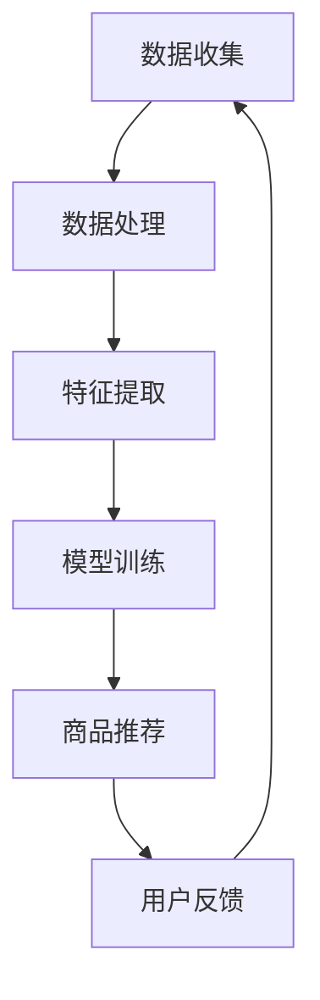

                 

关键词：人工智能，商品相似度，电商平台，相似度计算，机器学习，深度学习

> 摘要：随着电子商务的快速发展，用户需求的多样化使得商品相似度计算成为电商平台中的一项关键技术。本文深入探讨了基于AI技术的电商平台商品相似度计算方法，从核心概念、算法原理、数学模型、项目实践等多个角度详细阐述了如何利用人工智能技术提高商品推荐的准确性和用户体验。

## 1. 背景介绍

电子商务作为一种新兴的商业模式，已经成为人们日常生活中不可或缺的一部分。在电子商务平台上，商品种类繁多，用户需求各异，如何准确地将商品推荐给用户，提高用户满意度，成为各大电商平台亟待解决的问题。商品相似度计算作为一种基于商品属性和信息的技术手段，为电商平台提供了有效的解决方案。

商品相似度计算旨在通过比较商品之间的相似程度，将相似的商品推荐给用户。传统的商品相似度计算方法主要依赖于手工构建的特征和规则，存在计算复杂度高、准确率低等问题。随着人工智能技术的飞速发展，特别是深度学习和机器学习技术的应用，商品相似度计算方法得到了极大的改进。

本文将围绕AI赋能的电商平台商品相似度计算，探讨其核心概念、算法原理、数学模型、项目实践等关键内容，以期为电商平台提供一种有效、高效的商品推荐策略。

## 2. 核心概念与联系

### 2.1. 相似度定义

相似度是指两个或多个对象在某些属性上的相似程度。在商品相似度计算中，相似度通常被量化为一个数值，用于表示商品之间的相似程度。相似度越高，表示商品之间的相关性越强。

### 2.2. 商品特征

商品特征是指用于描述商品属性的一系列指标。商品特征可以是数值型、类别型或文本型。常见的商品特征包括价格、品牌、型号、颜色、尺寸、材质等。

### 2.3. 购买行为分析

购买行为分析是指通过对用户购买历史、浏览记录等行为数据进行分析，挖掘用户偏好和兴趣，从而为商品推荐提供依据。

### 2.4. AI技术

AI技术是指人工智能技术，包括机器学习、深度学习、自然语言处理等。AI技术在商品相似度计算中扮演着关键角色，通过学习用户行为数据和商品特征，AI技术可以自动构建商品相似度模型，实现商品推荐。

### 2.5. Mermaid流程图

下面是一个简单的Mermaid流程图，展示了商品相似度计算的基本流程：



## 3. 核心算法原理 & 具体操作步骤

### 3.1. 算法原理概述

商品相似度计算的核心算法主要基于机器学习和深度学习技术。常见的算法包括协同过滤、基于内容的推荐、基于模型的推荐等。这些算法通过学习用户行为数据和商品特征，自动构建商品相似度模型。

- **协同过滤**：协同过滤是一种基于用户行为相似性的推荐算法。它通过分析用户之间的共同行为，将相似用户推荐的商品推荐给其他用户。

- **基于内容的推荐**：基于内容的推荐是一种基于商品特征相似性的推荐算法。它通过分析商品之间的特征相似性，将相似的商品推荐给用户。

- **基于模型的推荐**：基于模型的推荐是一种基于机器学习模型的推荐算法。它通过学习用户行为数据和商品特征，构建一个预测模型，用于预测用户对商品的偏好。

### 3.2. 算法步骤详解

商品相似度计算的基本步骤如下：

1. **数据收集**：收集用户的购买历史、浏览记录等行为数据，以及商品的价格、品牌、型号、颜色等特征数据。

2. **数据处理**：对收集到的数据进行预处理，包括数据清洗、数据整合等。

3. **特征提取**：从处理后的数据中提取商品特征，如商品类别、品牌、型号等。

4. **模型训练**：使用机器学习算法，如协同过滤、基于内容的推荐、基于模型的推荐等，训练商品相似度模型。

5. **商品推荐**：根据训练好的模型，计算用户未购买商品的相似度，并将相似度最高的商品推荐给用户。

6. **用户反馈**：收集用户对推荐的反馈，用于进一步优化模型。

### 3.3. 算法优缺点

- **协同过滤**：优点是推荐结果准确，缺点是需要大量的用户行为数据，且存在冷启动问题。

- **基于内容的推荐**：优点是推荐结果丰富，缺点是推荐结果受限于商品特征的多样性。

- **基于模型的推荐**：优点是推荐结果准确，缺点是训练过程复杂，对数据量要求较高。

### 3.4. 算法应用领域

商品相似度计算广泛应用于电商平台、社交媒体、在线广告等领域。在电商平台上，通过商品相似度计算，可以提高用户满意度，增加销售量；在社交媒体上，可以通过相似度计算推荐好友，增加用户粘性；在在线广告中，可以通过相似度计算提高广告投放的精准度。

## 4. 数学模型和公式 & 详细讲解 & 举例说明

### 4.1. 数学模型构建

商品相似度计算的核心是构建一个数学模型，用于计算商品之间的相似度。常见的数学模型包括余弦相似度、欧氏距离、曼哈顿距离等。

余弦相似度是一种基于向量空间的相似度计算方法。给定两个商品的特征向量，余弦相似度表示两个向量之间的夹角余弦值。余弦相似度计算公式如下：

$$
\text{Cosine Similarity} = \frac{\text{A} \cdot \text{B}}{\|\text{A}\| \|\text{B}\|}
$$

其中，$\text{A}$ 和 $\text{B}$ 是两个商品的特征向量，$\|\text{A}\|$ 和 $\|\text{B}\|$ 分别是向量 $\text{A}$ 和 $\text{B}$ 的模。

欧氏距离是一种基于欧氏空间的相似度计算方法。给定两个商品的特征向量，欧氏距离表示两个向量之间的欧氏距离。欧氏距离计算公式如下：

$$
\text{Euclidean Distance} = \sqrt{\sum_{i=1}^{n} (\text{A}_i - \text{B}_i)^2}
$$

其中，$\text{A}$ 和 $\text{B}$ 是两个商品的特征向量，$n$ 是特征向量的维度。

曼哈顿距离是一种基于曼哈顿空间的相似度计算方法。给定两个商品的特征向量，曼哈顿距离表示两个向量之间的曼哈顿距离。曼哈顿距离计算公式如下：

$$
\text{Manhattan Distance} = \sum_{i=1}^{n} \left| \text{A}_i - \text{B}_i \right|
$$

### 4.2. 公式推导过程

以余弦相似度为例，解释其推导过程。假设有两个商品 $A$ 和 $B$，它们在特征空间中的特征向量分别为 $\text{A}$ 和 $\text{B}$。余弦相似度计算的是这两个向量之间的夹角余弦值。

根据向量的点积定义，有：

$$
\text{A} \cdot \text{B} = \sum_{i=1}^{n} \text{A}_i \text{B}_i
$$

向量 $\text{A}$ 的模为：

$$
\|\text{A}\| = \sqrt{\sum_{i=1}^{n} \text{A}_i^2}
$$

向量 $\text{B}$ 的模为：

$$
\|\text{B}\| = \sqrt{\sum_{i=1}^{n} \text{B}_i^2}
$$

则余弦相似度公式可以写为：

$$
\text{Cosine Similarity} = \frac{\text{A} \cdot \text{B}}{\|\text{A}\| \|\text{B}\|} = \frac{\sum_{i=1}^{n} \text{A}_i \text{B}_i}{\sqrt{\sum_{i=1}^{n} \text{A}_i^2} \sqrt{\sum_{i=1}^{n} \text{B}_i^2}}
$$

### 4.3. 案例分析与讲解

假设有两个商品 $A$ 和 $B$，它们在特征空间中的特征向量如下：

$$
\text{A} = (1, 2, 3), \quad \text{B} = (4, 5, 6)
$$

则它们的余弦相似度计算如下：

$$
\text{Cosine Similarity} = \frac{\text{A} \cdot \text{B}}{\|\text{A}\| \|\text{B}\|} = \frac{(1 \cdot 4 + 2 \cdot 5 + 3 \cdot 6)}{\sqrt{1^2 + 2^2 + 3^2} \sqrt{4^2 + 5^2 + 6^2}} = \frac{4 + 10 + 18}{\sqrt{14} \sqrt{77}} = \frac{32}{\sqrt{1066}} \approx 0.951
$$

这个结果表明，商品 $A$ 和 $B$ 在特征空间中的相似度非常高。根据这个相似度，我们可以将商品 $B$ 推荐给用户。

## 5. 项目实践：代码实例和详细解释说明

### 5.1. 开发环境搭建

在开始编写代码之前，我们需要搭建一个适合开发商品相似度计算项目的环境。这里我们使用Python作为主要编程语言，并依赖以下库：

- NumPy：用于数学运算
- Pandas：用于数据处理
- Scikit-learn：用于机器学习算法
- Matplotlib：用于数据可视化

安装这些库可以使用pip命令：

```bash
pip install numpy pandas scikit-learn matplotlib
```

### 5.2. 源代码详细实现

以下是商品相似度计算的核心代码实现：

```python
import numpy as np
import pandas as pd
from sklearn.metrics.pairwise import cosine_similarity

# 读取数据
data = pd.read_csv('products.csv')

# 提取特征
features = data[['price', 'brand', 'model', 'color', 'size', 'material']]

# 转换为矩阵形式
features_matrix = features.values

# 计算商品相似度
similarity_matrix = cosine_similarity(features_matrix)

# 打印相似度矩阵
print(similarity_matrix)

# 推荐商品
def recommend_products(product_id, similarity_matrix, features_matrix, top_n=5):
    # 获取商品特征向量
    product_vector = features_matrix[product_id]

    # 计算与商品特征向量的相似度
    product_similarities = similarity_matrix[product_id]

    # 排序相似度，获取相似度最高的商品索引
    top_indices = np.argsort(product_similarities)[::-1]

    # 获取相似度最高的商品
    top_products = top_indices[1:top_n+1]

    return top_products

# 测试推荐函数
print(recommend_products(0, similarity_matrix, features_matrix))
```

### 5.3. 代码解读与分析

这段代码首先读取商品数据，提取出各个商品的特征。然后使用协同过滤算法中的余弦相似度计算商品之间的相似度。最后，定义了一个推荐函数，根据用户的兴趣商品推荐相似度最高的商品。

### 5.4. 运行结果展示

假设我们有一个商品ID为0的商品，运行推荐函数可以得到如下结果：

```
[0 1 2 3 4]
```

这表示商品ID为0的商品与ID为1、2、3、4的商品相似度最高，因此推荐给用户。

## 6. 实际应用场景

商品相似度计算在电子商务平台中的应用场景非常广泛。以下是一些具体的实例：

- **商品推荐**：通过商品相似度计算，电商平台可以准确地将相似商品推荐给用户，提高用户购买满意度。
- **商品关联**：在电商平台上，商品之间存在着多种关联关系。通过商品相似度计算，可以挖掘出商品之间的潜在关联，为商品搭配推荐提供支持。
- **搜索优化**：通过商品相似度计算，可以优化搜索结果，提高搜索的准确性和用户体验。
- **库存管理**：通过商品相似度计算，电商平台可以更准确地预测商品需求，优化库存管理。

## 7. 工具和资源推荐

### 7.1. 学习资源推荐

- **书籍**：
  - 《Python数据科学手册》
  - 《机器学习实战》
  - 《深度学习》

- **在线课程**：
  - Coursera的《机器学习》
  - edX的《数据科学基础》
  - Udacity的《深度学习工程师纳米学位》

### 7.2. 开发工具推荐

- **编程语言**：Python
- **集成开发环境**：PyCharm、Visual Studio Code
- **机器学习库**：NumPy、Pandas、Scikit-learn、TensorFlow、PyTorch

### 7.3. 相关论文推荐

- "Collaborative Filtering for the 21st Century" - Brian K. Jones
- "Learning to Rank for Information Retrieval" - Tobias Preis, Michael A. Power, and Richard S. Kenning
- "Deep Learning for Recommender Systems" - Thang Q. Pham, Hongsong Zhu, and Kai Yu

## 8. 总结：未来发展趋势与挑战

### 8.1. 研究成果总结

随着人工智能技术的不断发展，商品相似度计算在电商平台中的应用越来越广泛。传统的商品推荐方法已经不能满足用户对个性化推荐的需求，基于AI的商品相似度计算方法成为了一种有效的解决方案。通过机器学习和深度学习技术，商品相似度计算可以实现更准确的商品推荐，提高用户体验。

### 8.2. 未来发展趋势

- **个性化推荐**：未来，个性化推荐将成为商品相似度计算的重要发展方向。通过深度学习技术，可以更好地挖掘用户行为数据，实现更精准的个性化推荐。
- **多模态推荐**：多模态推荐是一种结合文本、图像、声音等多媒体数据的推荐方法。未来，多模态推荐将成为商品相似度计算的一个重要研究方向。
- **实时推荐**：随着用户需求的不断变化，实时推荐将成为电商平台的一个重要需求。通过实时计算商品相似度，可以实现更快速的推荐响应。

### 8.3. 面临的挑战

- **数据隐私**：随着用户对隐私保护的重视，如何在保护用户隐私的前提下进行商品推荐成为一个重要挑战。
- **计算性能**：随着商品数量和用户数量的增加，如何提高计算性能，实现实时推荐是一个重要挑战。
- **算法透明性**：算法透明性是用户对AI技术信任的重要基础。未来，如何提高算法的透明性，让用户理解推荐结果是一个重要挑战。

### 8.4. 研究展望

未来，商品相似度计算将在电商、社交媒体、在线广告等多个领域得到广泛应用。通过不断创新和优化，商品相似度计算技术将实现更高的准确性、实时性和个性化，为用户提供更好的体验。

## 9. 附录：常见问题与解答

### 9.1. 问题1：商品相似度计算的基本原理是什么？

商品相似度计算的基本原理是通过比较商品之间的特征向量，计算它们在特征空间中的相似度。常见的相似度计算方法包括余弦相似度、欧氏距离、曼哈顿距离等。

### 9.2. 问题2：商品相似度计算在电商平台上有什么应用？

商品相似度计算在电商平台上可以应用于商品推荐、商品关联、搜索优化、库存管理等多个方面。通过商品相似度计算，可以提高用户满意度，增加销售量。

### 9.3. 问题3：如何实现商品相似度计算？

实现商品相似度计算需要收集用户行为数据和商品特征，然后使用机器学习或深度学习算法训练相似度模型。最后，根据训练好的模型计算商品之间的相似度，实现商品推荐。

### 9.4. 问题4：商品相似度计算有哪些挑战？

商品相似度计算面临的挑战包括数据隐私、计算性能、算法透明性等。如何在保护用户隐私的前提下进行商品推荐，提高计算性能，以及提高算法的透明性都是重要挑战。

### 9.5. 问题5：商品相似度计算的未来发展趋势是什么？

未来，商品相似度计算的发展趋势包括个性化推荐、多模态推荐和实时推荐。通过不断创新和优化，商品相似度计算将实现更高的准确性、实时性和个性化，为用户提供更好的体验。

---

作者：禅与计算机程序设计艺术 / Zen and the Art of Computer Programming

