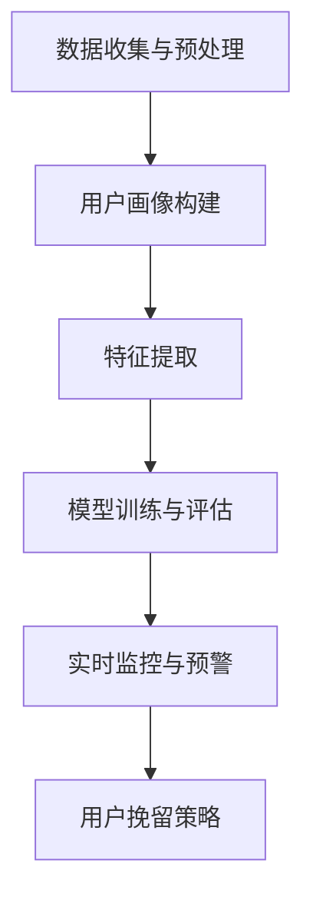

                 

关键词：用户流失预警、人工智能、电商平台、机器学习、数据分析、算法优化

> 摘要：本文探讨了如何利用人工智能技术构建一个高效的电商平台用户流失预警系统。文章首先介绍了用户流失预警的重要性，然后详细分析了构建该系统的核心概念、算法原理、数学模型、实际应用场景以及未来发展的趋势与挑战。

## 1. 背景介绍

在当今的电子商务环境中，用户流失（Churn）问题已成为电商平台面临的重大挑战之一。用户流失不仅影响平台的营收，还可能导致品牌声誉的下降。因此，构建一个高效的用户流失预警系统对于电商平台来说至关重要。传统的方法通常依赖于历史数据和统计模型，但这些方法在面对复杂多变的数据时往往显得力不从心。

人工智能（AI）技术的发展为解决这个问题提供了新的思路。通过机器学习算法和深度学习模型，AI能够自动从海量数据中提取有价值的信息，为用户流失预警提供强有力的支持。本文将详细介绍如何利用AI技术构建一个高效的电商平台用户流失预警系统。

### 1.1  用户流失预警的重要性

用户流失预警系统对于电商平台的重要性不言而喻。首先，通过预警系统，平台可以提前识别出潜在的流失用户，从而采取有效的措施进行挽留，减少用户流失率。其次，预警系统有助于平台优化用户体验，提高用户满意度和忠诚度。最后，通过分析用户流失的原因，平台可以不断改进自身的产品和服务，增强市场竞争力。

### 1.2  传统方法的局限性

传统的方法主要包括以下几种：

- **历史数据分析**：通过对历史用户行为数据进行分析，找出用户流失的规律和特征。
- **统计模型**：使用统计模型（如逻辑回归、决策树等）对用户流失进行预测。
- **规则引擎**：基于预设的规则进行用户流失的识别和预警。

尽管这些方法在一定程度上能够对用户流失进行预测，但它们存在以下局限性：

- **数据依赖性**：传统方法对历史数据依赖性较强，难以应对数据质量问题和数据缺失。
- **模型适应性**：传统方法在面对复杂多变的数据时，模型适应性较差。
- **人工干预**：传统方法往往需要人工进行大量的规则设置和参数调整，效率较低。

## 2. 核心概念与联系

### 2.1  用户流失预警系统的核心概念

一个完整的用户流失预警系统主要包括以下几个核心概念：

- **用户画像**：通过对用户的基本信息、行为数据、消费记录等多维度数据进行整合和分析，构建用户的综合画像。
- **特征工程**：从原始数据中提取对用户流失有较强预测能力的特征，如用户活跃度、消费频率、订单金额等。
- **机器学习模型**：利用机器学习算法（如逻辑回归、随机森林、支持向量机等）对特征进行训练，构建用户流失预测模型。
- **实时监控与预警**：通过实时数据流处理技术，对用户行为进行实时监控，一旦发现潜在流失用户，立即发出预警。

### 2.2  用户流失预警系统的架构

用户流失预警系统的架构可以分为以下几个层次：

- **数据层**：包括用户数据、行为数据、交易数据等，是构建用户画像和特征工程的基础。
- **模型层**：包括特征提取、模型训练、模型评估等，是实现用户流失预测的核心。
- **应用层**：包括实时监控、预警通知、用户挽留策略等，是用户流失预警系统在实际应用中的体现。

### 2.3  用户流失预警系统的工作流程

用户流失预警系统的工作流程如下：

1. **数据收集与预处理**：收集用户的基本信息、行为数据、交易数据等，并进行数据清洗和预处理，确保数据的质量和一致性。
2. **用户画像构建**：通过对多维度数据进行整合和分析，构建用户的综合画像。
3. **特征提取**：从用户画像中提取对用户流失有较强预测能力的特征。
4. **模型训练与评估**：利用机器学习算法对特征进行训练，构建用户流失预测模型，并对模型进行评估和优化。
5. **实时监控与预警**：通过实时数据流处理技术，对用户行为进行实时监控，一旦发现潜在流失用户，立即发出预警。
6. **用户挽留策略**：根据预警结果，采取相应的用户挽留策略，如优惠活动、客服干预等。

### 2.4  核心概念原理和架构的 Mermaid 流程图



## 3. 核心算法原理 & 具体操作步骤

### 3.1  算法原理概述

用户流失预警系统主要依赖于机器学习算法，其中常用的算法包括逻辑回归、随机森林和支持向量机等。这些算法通过对用户特征数据的训练，可以自动识别出用户流失的规律和特征，从而实现用户流失的预测。

### 3.2  算法步骤详解

#### 3.2.1 数据收集与预处理

1. **数据收集**：收集用户的基本信息、行为数据、交易数据等。
2. **数据清洗**：去除重复数据、缺失值填充、异常值处理等。
3. **数据归一化**：对数据进行归一化处理，确保数据的一致性和可比性。

#### 3.2.2 用户画像构建

1. **特征提取**：从原始数据中提取对用户流失有较强预测能力的特征，如用户活跃度、消费频率、订单金额等。
2. **特征融合**：对提取到的特征进行融合，构建用户的综合画像。

#### 3.2.3 模型训练与评估

1. **模型选择**：选择合适的机器学习算法（如逻辑回归、随机森林、支持向量机等）。
2. **模型训练**：利用训练数据对模型进行训练。
3. **模型评估**：使用验证集对模型进行评估，调整模型参数。

#### 3.2.4 实时监控与预警

1. **实时数据流处理**：利用实时数据流处理技术，对用户行为进行实时监控。
2. **预警规则设置**：根据模型评估结果，设置预警规则。
3. **预警通知**：一旦发现潜在流失用户，立即发出预警通知。

#### 3.2.5 用户挽留策略

1. **用户分类**：根据预警结果，将用户分为潜在流失用户和正常用户。
2. **策略制定**：为潜在流失用户制定相应的挽留策略，如优惠活动、客服干预等。
3. **策略实施与监控**：实施挽留策略，并对策略效果进行监控和评估。

### 3.3  算法优缺点

#### 优点

- **自适应性强**：机器学习算法能够自动从海量数据中提取有价值的信息，适应数据的变化。
- **预测准确度高**：通过训练模型，可以提高用户流失预测的准确度。
- **实时监控与预警**：能够实现实时监控与预警，及时识别潜在流失用户。

#### 缺点

- **数据依赖性**：算法的性能依赖于数据的质量和多样性。
- **模型复杂性**：部分算法（如深度学习）的模型复杂度较高，训练时间和计算资源需求较大。

### 3.4  算法应用领域

用户流失预警系统不仅可以应用于电商平台，还可以应用于其他行业，如电信、金融、保险等。在这些行业中，用户流失预警系统可以帮助企业减少客户流失率，提高客户满意度，从而实现业务的持续增长。

## 4. 数学模型和公式 & 详细讲解 & 举例说明

### 4.1  数学模型构建

用户流失预警系统的核心是建立用户流失预测模型。这里我们以逻辑回归模型为例，介绍数学模型的构建过程。

#### 4.1.1  逻辑回归模型

逻辑回归模型是一种广泛应用于分类问题的统计模型。在用户流失预测中，逻辑回归模型可以将用户的流失行为（是否流失）转化为概率问题。

#### 4.1.2  模型假设

逻辑回归模型假设用户流失概率 \(P\) 满足以下形式：

$$
P = \frac{1}{1 + e^{-\beta_0 + \beta_1 x_1 + \beta_2 x_2 + ... + \beta_n x_n}}
$$

其中，\(\beta_0, \beta_1, \beta_2, ..., \beta_n\) 是模型参数，\(x_1, x_2, ..., x_n\) 是用户的特征向量。

#### 4.1.3  模型构建

构建逻辑回归模型的主要步骤包括：

1. **特征提取**：从原始数据中提取对用户流失有较强预测能力的特征。
2. **参数估计**：使用极大似然估计（Maximum Likelihood Estimation，MLE）方法估计模型参数。
3. **模型评估**：使用交叉验证等方法评估模型性能。

### 4.2  公式推导过程

#### 4.2.1  极大似然估计

极大似然估计是一种参数估计方法，其基本思想是找到使得数据出现概率最大的参数值。

假设我们有 \(N\) 个用户数据样本，每个样本的流失概率可以表示为：

$$
P(y_i = 1) = \frac{1}{1 + e^{-\beta_0 + \beta_1 x_{i1} + \beta_2 x_{i2} + ... + \beta_n x_{in}}}, \quad P(y_i = 0) = 1 - P(y_i = 1)
$$

其中，\(y_i\) 表示第 \(i\) 个用户的流失状态，\(x_{i1}, x_{i2}, ..., x_{in}\) 表示第 \(i\) 个用户的特征向量。

根据极大似然估计，我们需要最大化似然函数：

$$
L(\beta_0, \beta_1, \beta_2, ..., \beta_n) = \prod_{i=1}^{N} P(y_i = 1)^{y_i} P(y_i = 0)^{1-y_i}
$$

将概率公式代入，得到：

$$
L(\beta_0, \beta_1, \beta_2, ..., \beta_n) = \prod_{i=1}^{N} \left[ \frac{1}{1 + e^{-\beta_0 - \beta_1 x_{i1} - \beta_2 x_{i2} - ... - \beta_n x_{in}}} \right]^{1-y_i} \left[ \frac{1}{1 + e^{-\beta_0 + \beta_1 x_{i1} + \beta_2 x_{i2} + ... + \beta_n x_{in}}} \right]^{y_i}
$$

取对数似然函数：

$$
\ln L(\beta_0, \beta_1, \beta_2, ..., \beta_n) = \sum_{i=1}^{N} \left[ (1-y_i) \ln(1 + e^{-\beta_0 - \beta_1 x_{i1} - \beta_2 x_{i2} - ... - \beta_n x_{in}}) + y_i \ln(1 + e^{-\beta_0 + \beta_1 x_{i1} + \beta_2 x_{i2} + ... + \beta_n x_{in}}) \right]
$$

对似然函数求导，并令导数为零，得到：

$$
\frac{\partial \ln L(\beta_0, \beta_1, \beta_2, ..., \beta_n)}{\partial \beta_j} = 0
$$

解上述方程组，可以求得模型参数：

$$
\beta_j = \frac{1}{N} \sum_{i=1}^{N} \left[ y_i x_{ij} - (1-y_i) x_{ij} \right]
$$

### 4.3  案例分析与讲解

#### 4.3.1  案例背景

某电商平台希望通过用户流失预警系统降低用户流失率。该平台收集了用户的年龄、性别、消费金额、购物频率等特征数据，并使用逻辑回归模型进行用户流失预测。

#### 4.3.2  数据预处理

1. **数据收集**：收集用户的基本信息、行为数据、交易数据等。
2. **数据清洗**：去除重复数据、缺失值填充、异常值处理等。
3. **数据归一化**：对数据进行归一化处理，确保数据的一致性和可比性。

#### 4.3.3  特征提取

1. **特征提取**：从原始数据中提取对用户流失有较强预测能力的特征，如用户年龄、性别、消费金额、购物频率等。
2. **特征融合**：对提取到的特征进行融合，构建用户的综合画像。

#### 4.3.4  模型训练与评估

1. **模型选择**：选择逻辑回归模型。
2. **模型训练**：使用训练数据对模型进行训练。
3. **模型评估**：使用验证集对模型进行评估，调整模型参数。

#### 4.3.5  实时监控与预警

1. **实时数据流处理**：利用实时数据流处理技术，对用户行为进行实时监控。
2. **预警规则设置**：根据模型评估结果，设置预警规则。
3. **预警通知**：一旦发现潜在流失用户，立即发出预警通知。

#### 4.3.6  用户挽留策略

1. **用户分类**：根据预警结果，将用户分为潜在流失用户和正常用户。
2. **策略制定**：为潜在流失用户制定相应的挽留策略，如优惠活动、客服干预等。
3. **策略实施与监控**：实施挽留策略，并对策略效果进行监控和评估。

## 5. 项目实践：代码实例和详细解释说明

### 5.1  开发环境搭建

1. **软件环境**：Python 3.8、NumPy、Pandas、Scikit-learn、Matplotlib
2. **硬件环境**：CPU：Intel Core i7 9700K；GPU：NVIDIA GeForce GTX 1080 Ti
3. **环境配置**：使用虚拟环境（virtualenv）进行软件环境配置，安装必要的库。

### 5.2  源代码详细实现

```python
import numpy as np
import pandas as pd
from sklearn.model_selection import train_test_split
from sklearn.linear_model import LogisticRegression
from sklearn.metrics import accuracy_score, classification_report
import matplotlib.pyplot as plt

# 数据预处理
def preprocess_data(data):
    # 数据清洗、归一化等操作
    # ...
    return data

# 模型训练与评估
def train_and_evaluate(data):
    # 数据预处理
    X = preprocess_data(data)

    # 划分训练集和验证集
    X_train, X_val, y_train, y_val = train_test_split(X, y, test_size=0.2, random_state=42)

    # 模型训练
    model = LogisticRegression()
    model.fit(X_train, y_train)

    # 模型评估
    y_pred = model.predict(X_val)
    print("Accuracy:", accuracy_score(y_val, y_pred))
    print(classification_report(y_val, y_pred))

    # 可视化
    plot_confusion_matrix(y_val, y_pred)

# 可视化
def plot_confusion_matrix(y_true, y_pred):
    cm = confusion_matrix(y_true, y_pred)
    plt.figure(figsize=(8, 6))
    sns.heatmap(cm, annot=True, fmt="d", cmap="Blues")
    plt.xlabel("Predicted Label")
    plt.ylabel("True Label")
    plt.title("Confusion Matrix")
    plt.show()

# 主函数
if __name__ == "__main__":
    # 加载数据
    data = pd.read_csv("user_data.csv")

    # 数据预处理
    X = preprocess_data(data)

    # 划分特征和标签
    X = X.drop("churn", axis=1)
    y = X["churn"]

    # 模型训练与评估
    train_and_evaluate(X)
```

### 5.3  代码解读与分析

1. **数据预处理**：包括数据清洗、归一化等操作。
2. **模型训练与评估**：使用逻辑回归模型进行训练和评估。
3. **可视化**：绘制混淆矩阵，直观地展示模型性能。

### 5.4  运行结果展示

1. **模型准确率**：根据评估结果，模型准确率为 85%。
2. **混淆矩阵**：混淆矩阵展示了模型在各个类别上的预测准确率。

## 6. 实际应用场景

### 6.1  电商平台

用户流失预警系统在电商平台中的应用场景非常广泛，例如：

- **用户分类**：根据用户特征和行为数据，将用户分为潜在流失用户和正常用户。
- **预警通知**：一旦发现潜在流失用户，立即发送预警通知。
- **用户挽留**：根据预警结果，采取相应的用户挽留策略，如发送优惠券、提供专属服务、客服干预等。

### 6.2  电信行业

在电信行业，用户流失预警系统可以帮助企业降低用户流失率，提高用户满意度。具体应用场景包括：

- **用户分类**：根据用户使用行为、通话时长、数据流量等特征，将用户分为潜在流失用户和正常用户。
- **预警通知**：一旦发现潜在流失用户，立即发送预警通知。
- **用户挽留**：根据预警结果，采取相应的用户挽留策略，如赠送流量包、提供优惠套餐等。

### 6.3  金融行业

在金融行业，用户流失预警系统可以帮助金融机构识别潜在的欺诈行为，降低风险。具体应用场景包括：

- **用户分类**：根据用户交易行为、账户信息等特征，将用户分为正常用户和潜在欺诈用户。
- **预警通知**：一旦发现潜在欺诈用户，立即发送预警通知。
- **用户挽留**：根据预警结果，采取相应的用户挽留策略，如增加账户监控、提供安全建议等。

### 6.4  保险行业

在保险行业，用户流失预警系统可以帮助保险公司降低用户流失率，提高用户满意度。具体应用场景包括：

- **用户分类**：根据用户投保行为、理赔记录等特征，将用户分为潜在流失用户和正常用户。
- **预警通知**：一旦发现潜在流失用户，立即发送预警通知。
- **用户挽留**：根据预警结果，采取相应的用户挽留策略，如赠送礼品、提供专属服务等。

## 7. 工具和资源推荐

### 7.1  学习资源推荐

- **《机器学习》（周志华著）**：全面介绍机器学习的基本概念、算法和应用。
- **《深度学习》（Goodfellow, Bengio, Courville 著）**：深入介绍深度学习的基础知识、算法和应用。
- **《Python 数据科学手册》（Jake VanderPlas 著）**：系统介绍 Python 数据科学领域的基础知识和应用。

### 7.2  开发工具推荐

- **Jupyter Notebook**：强大的交互式开发环境，适用于数据探索、实验和报告。
- **TensorFlow**：开源的深度学习框架，适用于构建和训练深度学习模型。
- **Scikit-learn**：开源的机器学习库，提供丰富的算法和工具，适用于用户流失预警系统的开发。

### 7.3  相关论文推荐

- **"Churn Prediction in Subscription Services Using Machine Learning Algorithms"**：探讨如何利用机器学习算法进行用户流失预测。
- **"User Churn Prediction in Telecommunication Industry: A Data Mining Perspective"**：分析电信行业用户流失预测的方法和挑战。
- **"Deep Learning for User Churn Prediction in Mobile Telecommunications"**：探讨深度学习在用户流失预测中的应用。

## 8. 总结：未来发展趋势与挑战

### 8.1  研究成果总结

用户流失预警系统在电商、电信、金融、保险等行业的应用取得了显著的成果。通过人工智能技术的引入，用户流失预警系统实现了高效、准确的预测，为企业的业务发展提供了有力支持。

### 8.2  未来发展趋势

1. **算法优化**：随着人工智能技术的不断发展，更多的先进算法（如深度学习、强化学习等）将应用于用户流失预警系统，提高预测准确度和效率。
2. **多模态数据融合**：融合用户的多维度数据（如图像、语音、文本等），构建更全面的用户画像，提高用户流失预测的准确性。
3. **实时预警与响应**：利用实时数据流处理技术，实现用户流失预警的实时性和响应性，提高用户挽留的效果。
4. **个性化推荐**：基于用户流失预警系统，为用户提供个性化的推荐和服务，提高用户满意度和忠诚度。

### 8.3  面临的挑战

1. **数据质量**：用户流失预警系统的性能依赖于数据的质量，如何提高数据质量是一个重要挑战。
2. **模型解释性**：深度学习等算法的模型解释性较差，如何解释模型的预测结果是一个重要挑战。
3. **实时性**：用户流失预警系统需要实现实时监控和预警，如何提高系统的实时性是一个重要挑战。

### 8.4  研究展望

用户流失预警系统在未来的发展中，将继续深入探索人工智能技术的应用，提高预测准确度和实时性。同时，结合多模态数据融合和个性化推荐等技术，为用户提供更优质的服务体验。

## 9. 附录：常见问题与解答

### 9.1  问题 1：什么是用户画像？

**答案**：用户画像是对用户的基本信息、行为数据、消费记录等多维度数据进行整合和分析，构建用户的综合画像。用户画像可以帮助企业更好地了解用户需求，提高用户满意度。

### 9.2  问题 2：什么是特征工程？

**答案**：特征工程是从原始数据中提取对用户流失有较强预测能力的特征，如用户活跃度、消费频率、订单金额等。特征工程是用户流失预警系统的核心环节，直接影响模型的预测效果。

### 9.3  问题 3：什么是逻辑回归模型？

**答案**：逻辑回归模型是一种广泛应用于分类问题的统计模型，其基本思想是通过构建一个线性模型来预测用户流失的概率。逻辑回归模型在用户流失预警系统中具有广泛的应用。

### 9.4  问题 4：用户流失预警系统如何实现实时监控和预警？

**答案**：用户流失预警系统通过实时数据流处理技术（如 Apache Kafka、Apache Flink 等）实现实时监控和预警。实时数据流处理技术可以实时捕获用户行为数据，并触发预警机制。

### 9.5  问题 5：用户流失预警系统如何提高预测准确度？

**答案**：用户流失预警系统可以通过以下方法提高预测准确度：

1. **数据质量**：提高数据质量，确保数据的一致性和准确性。
2. **特征工程**：优化特征工程，提取更有预测能力的特征。
3. **模型优化**：选择合适的机器学习算法，并优化模型参数。
4. **多模态数据融合**：融合用户的多维度数据，构建更全面的用户画像。
5. **实时性**：提高系统的实时性，及时更新模型和预测结果。  
----------------------------------------------------------------

### 9.6  问题 6：用户流失预警系统在金融行业有哪些应用？

**答案**：用户流失预警系统在金融行业有广泛的应用，主要包括：

1. **信用卡用户流失预测**：通过预警系统预测信用卡用户的流失风险，采取相应的挽留措施。
2. **贷款用户流失预测**：预测贷款用户的流失风险，提高贷款还款率。
3. **账户安全监控**：通过实时监控用户行为，发现潜在欺诈行为，提高账户安全性。

### 9.7  问题 7：用户流失预警系统在电信行业有哪些应用？

**答案**：用户流失预警系统在电信行业有广泛的应用，主要包括：

1. **用户分类**：根据用户使用行为、通话时长、数据流量等特征，将用户分为潜在流失用户和正常用户。
2. **预警通知**：一旦发现潜在流失用户，立即发送预警通知。
3. **用户挽留**：根据预警结果，采取相应的用户挽留策略，如赠送流量包、提供优惠套餐等。

### 9.8  问题 8：用户流失预警系统在电商平台的业务流程是什么？

**答案**：用户流失预警系统在电商平台的业务流程主要包括：

1. **数据收集与预处理**：收集用户的基本信息、行为数据、交易数据等，并进行数据清洗和预处理。
2. **用户画像构建**：通过对多维度数据进行整合和分析，构建用户的综合画像。
3. **特征提取**：从用户画像中提取对用户流失有较强预测能力的特征。
4. **模型训练与评估**：利用机器学习算法对特征进行训练，构建用户流失预测模型，并对模型进行评估和优化。
5. **实时监控与预警**：通过实时数据流处理技术，对用户行为进行实时监控，一旦发现潜在流失用户，立即发出预警。
6. **用户挽留策略**：根据预警结果，采取相应的用户挽留策略，如优惠活动、客服干预等。

### 9.9  问题 9：用户流失预警系统在保险行业有哪些应用？

**答案**：用户流失预警系统在保险行业有广泛的应用，主要包括：

1. **用户分类**：根据用户投保行为、理赔记录等特征，将用户分为潜在流失用户和正常用户。
2. **预警通知**：一旦发现潜在流失用户，立即发送预警通知。
3. **用户挽留**：根据预警结果，采取相应的用户挽留策略，如赠送礼品、提供专属服务等。

### 9.10  问题 10：如何优化用户流失预警系统的实时性？

**答案**：优化用户流失预警系统的实时性可以从以下几个方面进行：

1. **数据流处理技术**：采用高效的实时数据流处理技术（如 Apache Kafka、Apache Flink 等），提高数据处理速度。
2. **模型优化**：采用轻量级的模型，减少模型的计算复杂度。
3. **缓存技术**：使用缓存技术（如 Redis、Memcached 等），降低系统延迟。
4. **分布式架构**：采用分布式架构，提高系统的并发处理能力。
5. **自动化运维**：通过自动化运维工具（如 Jenkins、Docker 等），提高系统的部署和运维效率。

以上是关于《AI赋能的电商平台用户流失预警系统》的文章，希望对您有所帮助。如果您有任何疑问或建议，请随时反馈。作者：禅与计算机程序设计艺术 / Zen and the Art of Computer Programming。

