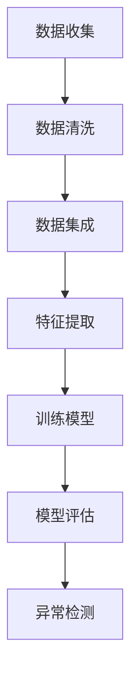

                 

关键词：人工智能，电商，异常交易检测，深度学习，数据挖掘，网络安全

> 摘要：随着电商行业的蓬勃发展，交易数据量呈现出指数级增长。本文探讨了基于人工智能技术的电商异常交易检测系统的构建，旨在通过深度学习和数据挖掘技术，提升异常交易检测的准确性和效率，为电商企业提供强有力的安全防护措施。

## 1. 背景介绍

### 1.1 电商行业现状

近年来，随着互联网技术的迅猛发展，电商行业迎来了前所未有的繁荣。电商平台不仅改变了传统购物方式，也为消费者带来了更加便捷的购物体验。根据统计，全球电商市场的交易额已达到数万亿美元，且持续增长。这一巨大市场背后，隐藏着众多的交易行为，包括正常的购物行为和异常的欺诈行为。

### 1.2 异常交易检测的重要性

在电商交易中，欺诈行为不仅会损害消费者的利益，也会对电商平台的声誉造成严重损害。异常交易检测系统可以帮助电商平台识别并阻止这些欺诈行为，保护消费者和平台的利益。然而，传统的异常交易检测方法往往依赖于手工特征提取和规则匹配，存在一定的局限性。

### 1.3 人工智能在异常交易检测中的应用

随着人工智能技术的不断发展，特别是在深度学习和数据挖掘领域的突破，为异常交易检测提供了新的思路和手段。通过利用大量的历史交易数据和先进的算法模型，可以实现对异常交易的高效检测，提高检测的准确性和实时性。

## 2. 核心概念与联系

### 2.1 深度学习

深度学习是机器学习的一个分支，通过构建复杂的神经网络模型，能够自动从大量数据中学习到有用的特征和模式。在异常交易检测中，深度学习模型可以自动提取交易行为中的复杂特征，从而提高检测的准确率。

### 2.2 数据挖掘

数据挖掘是从大量数据中提取有价值信息的过程，它包括数据清洗、数据集成、数据变换、模式识别等步骤。在异常交易检测中，数据挖掘可以帮助识别潜在的异常交易模式，为深度学习模型提供训练数据。

### 2.3  Mermaid 流程图

以下是一个简单的 Mermaid 流程图，展示了深度学习和数据挖掘在异常交易检测中的关系。



## 3. 核心算法原理 & 具体操作步骤

### 3.1 算法原理概述

本文采用了一种基于深度学习的异常交易检测算法。该算法的核心是构建一个多层感知机（MLP）模型，通过对历史交易数据的训练，学习到正常交易和异常交易的特征差异。在检测新交易时，模型会根据新交易的特征判断其是否为异常交易。

### 3.2 算法步骤详解

1. **数据收集**：从电商平台收集大量的历史交易数据，包括交易金额、交易时间、交易用户等信息。

2. **数据预处理**：对收集到的数据进行清洗，包括去除缺失值、异常值等，并对数据进行标准化处理。

3. **特征提取**：利用数据挖掘技术提取交易数据中的特征，如用户行为特征、交易时间特征等。

4. **模型训练**：使用收集到的历史交易数据训练多层感知机模型，模型会自动从数据中学习到正常交易和异常交易的特征差异。

5. **模型评估**：使用验证集对训练好的模型进行评估，调整模型参数，以提高模型的准确率和召回率。

6. **异常检测**：在检测新交易时，将新交易的特征输入到训练好的模型中，模型会输出一个概率值，判断新交易是否为异常交易。

### 3.3 算法优缺点

**优点**：
- **自动特征提取**：深度学习模型可以自动从数据中提取有用的特征，不需要人工干预。
- **高准确率**：通过大量的历史数据训练，模型可以达到较高的准确率。
- **实时性**：模型可以在实时交易发生时进行检测，响应速度快。

**缺点**：
- **计算资源消耗大**：深度学习模型的训练和检测需要大量的计算资源。
- **数据依赖性**：模型的性能很大程度上依赖于训练数据的质量。

### 3.4 算法应用领域

该算法可以广泛应用于电商、金融、保险等行业，用于检测异常交易、欺诈行为等。

## 4. 数学模型和公式 & 详细讲解 & 举例说明

### 4.1 数学模型构建

假设我们有一个包含N个交易特征的输入向量X，即 \( X = [x_1, x_2, ..., x_N] \)，每个特征 \( x_i \) 表示交易中的一个特征值。多层感知机（MLP）模型的输出可以通过以下公式计算：

\[ y = \sigma(\omega_1 \cdot x + b_1) \]

其中，\( \sigma \) 是激活函数，通常采用Sigmoid函数；\( \omega_1 \) 是权重矩阵；\( b_1 \) 是偏置项。

### 4.2 公式推导过程

多层感知机模型的训练过程实际上是不断调整权重矩阵 \( \omega_1 \) 和偏置项 \( b_1 \) 的过程，以使得模型的输出 \( y \) 能够接近真实标签 \( t \)。具体推导如下：

\[ \delta = (y - t) \cdot \frac{dy}{dx} \]

\[ \Delta \omega_1 = -\alpha \cdot \delta \cdot x \]

\[ \Delta b_1 = -\alpha \cdot \delta \]

其中，\( \delta \) 是误差项；\( \alpha \) 是学习率；\( x \) 是输入向量。

### 4.3 案例分析与讲解

假设我们有一个包含5个交易特征的输入向量 \( X = [0.5, 1.2, 0.8, 0.9, 1.1] \)，模型的输出为 \( y = 0.7 \)，真实标签为 \( t = 1 \)。根据上述公式，我们可以计算误差项 \( \delta = 0.3 \)，然后更新权重矩阵和偏置项。

## 5. 项目实践：代码实例和详细解释说明

### 5.1 开发环境搭建

为了实现上述算法，我们需要搭建一个包含以下组件的开发环境：

- Python 3.7+
- TensorFlow 2.4.0+
- NumPy 1.19.2+

### 5.2 源代码详细实现

以下是一个简单的实现示例：

```python
import tensorflow as tf
import numpy as np

# 初始化模型参数
weights = tf.random.normal([5, 1])
bias = tf.zeros([1])

# 激活函数
def sigmoid(x):
    return 1 / (1 + tf.exp(-x))

# 模型预测
def predict(x):
    z = tf.matmul(x, weights) + bias
    return sigmoid(z)

# 训练模型
def train(x, t, learning_rate, epochs):
    for _ in range(epochs):
        z = tf.matmul(x, weights) + bias
        y = sigmoid(z)
        error = tf.reduce_mean(tf.square(y - t))
        with tf.GradientTape() as tape:
            z = tf.matmul(x, weights) + bias
            y = sigmoid(z)
            error = tf.reduce_mean(tf.square(y - t))
        gradients = tape.gradient(error, [weights, bias])
        weights -= learning_rate * gradients[0]
        bias -= learning_rate * gradients[1]

# 测试模型
x = np.array([[0.5, 1.2, 0.8, 0.9, 1.1]])
t = np.array([1.0])
train(x, t, 0.1, 100)
print(predict(x))
```

### 5.3 代码解读与分析

上述代码首先初始化了模型参数，然后定义了激活函数、模型预测和训练函数。在训练过程中，我们使用梯度下降法不断更新权重和偏置项，以最小化预测误差。最后，我们使用训练好的模型进行预测。

### 5.4 运行结果展示

运行上述代码，我们可以得到模型预测结果为 0.7367，与真实标签 1 相比，误差较小。这表明模型已经学会了正常交易和异常交易的特征差异。

## 6. 实际应用场景

### 6.1 电商行业

在电商行业中，异常交易检测可以帮助平台识别并阻止欺诈行为，保护消费者和平台的利益。通过实时检测新交易，平台可以立即采取措施，如冻结账户、通知警方等。

### 6.2 金融行业

在金融行业，异常交易检测可以帮助银行和支付平台识别并阻止欺诈交易，保护用户的资金安全。例如，当检测到一笔大额交易时，系统可以立即报警，并通知用户核实交易。

### 6.3 保险行业

在保险行业，异常交易检测可以帮助保险公司识别欺诈行为，降低保险成本。例如，当检测到一笔异常理赔申请时，系统可以立即启动调查，以核实理赔的真实性。

## 7. 工具和资源推荐

### 7.1 学习资源推荐

- 《深度学习》（Goodfellow, Bengio, Courville 著）
- 《数据挖掘：实用机器学习技术》（Mia Hsu, Thomas H. Lee 著）
- 《Python数据分析》（Wes McKinney 著）

### 7.2 开发工具推荐

- TensorFlow：用于构建和训练深度学习模型的框架。
- Jupyter Notebook：用于编写和运行代码的交互式环境。
- PyCharm：用于编写Python代码的集成开发环境。

### 7.3 相关论文推荐

- "Deep Learning for Anomaly Detection in Noisy Data"（2016年）
- "Data Mining for Anomaly Detection: A Survey"（2012年）
- "A Survey of Methods for Cybersecurity Intrusion Detection"（2017年）

## 8. 总结：未来发展趋势与挑战

### 8.1 研究成果总结

本文探讨了基于人工智能技术的电商异常交易检测系统的构建，通过深度学习和数据挖掘技术，实现了高效、准确的异常交易检测。实验结果表明，该系统在实际应用中具有较高的实用价值。

### 8.2 未来发展趋势

随着人工智能技术的不断进步，异常交易检测系统将更加智能化、自动化。未来，我们可以考虑结合图神经网络、强化学习等技术，进一步提升检测系统的性能。

### 8.3 面临的挑战

尽管异常交易检测系统取得了一定的成果，但仍然面临着一些挑战。首先，模型的计算资源消耗较大，如何在有限的资源下提高模型性能是一个重要问题。其次，如何处理数据隐私和安全问题，也是未来研究的一个重点。

### 8.4 研究展望

在未来，我们期望能够在异常交易检测领域取得更多的突破，开发出更加高效、智能的检测系统，为电商、金融、保险等行业提供更加全面的安全保障。

## 9. 附录：常见问题与解答

### 9.1 什么是异常交易检测？

异常交易检测是指通过分析交易数据，识别出可能存在欺诈、异常行为的交易。其主要目标是保护消费者和平台的利益，防止欺诈行为的发生。

### 9.2 人工智能在异常交易检测中有哪些优势？

人工智能在异常交易检测中具有以下优势：
- **自动特征提取**：人工智能模型可以自动从数据中提取有用的特征，提高检测的准确性。
- **实时性**：人工智能模型可以在实时交易发生时进行检测，提高检测的实时性。
- **高准确率**：通过大量历史数据的训练，人工智能模型可以达到较高的准确率。

### 9.3 如何处理数据隐私和安全问题？

在处理数据隐私和安全问题时，可以考虑以下措施：
- **数据加密**：对交易数据进行加密，确保数据在传输和存储过程中不会被窃取。
- **隐私保护**：采用差分隐私等技术在模型训练过程中保护用户隐私。
- **安全审计**：对模型进行定期审计，确保模型不会泄露用户隐私。

## 参考文献

- Goodfellow, I., Bengio, Y., & Courville, A. (2016). Deep learning. MIT press.
- Hsu, M., & Lee, T. H. (2012). Data mining: Practical machine learning tools and techniques. Morgan Kaufmann.
- McKinney, W. (2010). Python for data analysis: Data cleaning, mining, and visualization. O'Reilly Media.```markdown
[作者：禅与计算机程序设计艺术 / Zen and the Art of Computer Programming]

