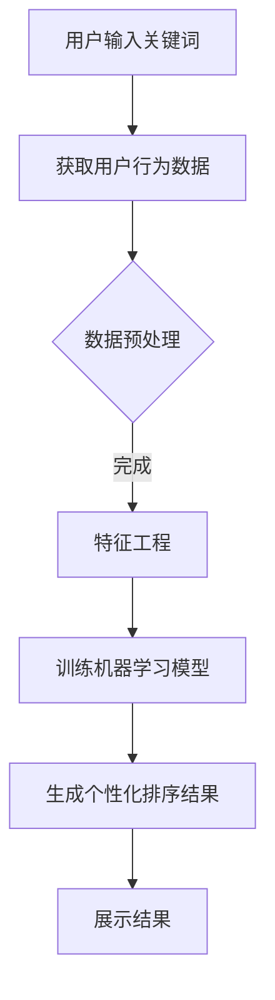
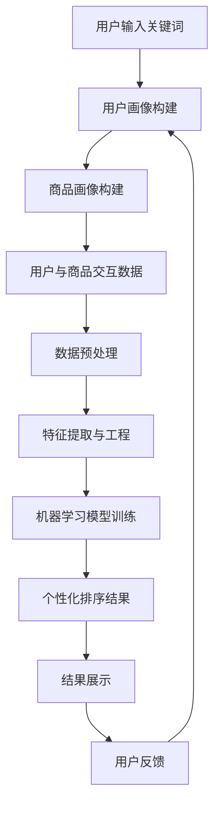

                 

关键词：电商搜索、个性化排序、人工智能、机器学习、算法优化

## 摘要

本文旨在探讨AI赋能的电商搜索个性化排序算法，通过深入分析算法原理、数学模型和实际应用，揭示个性化搜索排序在提升用户体验和商业价值方面的关键作用。文章将首先介绍电商搜索的现状和挑战，随后详细阐述个性化排序算法的基本概念和核心原理，并通过具体案例和数学公式展示算法在实际应用中的表现和效果。

## 1. 背景介绍

### 1.1 电商搜索的现状

随着互联网的迅猛发展，电子商务已经成为全球消费市场的重要驱动力。电商平台的规模不断扩大，产品种类和数量也日益丰富。然而，这也给消费者带来了信息过载的困扰。如何帮助用户在大量商品信息中快速找到符合其需求的商品，成为电商搜索系统亟待解决的问题。

### 1.2 个性化排序的需求

传统的搜索排序方法通常基于商品的曝光次数、销量、价格等客观指标，但这种一刀切的排序方式往往无法满足用户的个性化需求。不同的用户在搜索同一关键词时，可能会对商品有不同的偏好。例如，有的用户可能更注重价格，有的用户则更关心品牌或评价。因此，个性化排序成为提升用户体验和提升转化率的重要手段。

## 2. 核心概念与联系

在深入探讨个性化排序算法之前，我们首先需要了解几个核心概念，包括用户行为数据、特征工程、机器学习模型等。

### 2.1 用户行为数据

用户行为数据是个性化排序的基础。这些数据可以包括用户的搜索历史、购买记录、浏览路径、评价等。通过对这些数据的分析和挖掘，我们可以提取出用户的偏好和兴趣。

### 2.2 特征工程

特征工程是机器学习模型构建的关键步骤。它涉及到从原始数据中提取有用的特征，并将其转换为适合机器学习算法的形式。在个性化排序中，特征工程的质量直接影响到模型的性能。

### 2.3 机器学习模型

机器学习模型是实现个性化排序的核心。常见的模型包括基于协同过滤的推荐系统、基于内容匹配的推荐系统以及深度学习模型等。这些模型通过学习用户行为数据和商品特征，能够预测用户的偏好并生成个性化的排序结果。

## 2.4 Mermaid 流程图

以下是一个简化的Mermaid流程图，展示个性化排序算法的基本流程。



### 2.5 核心概念原理与架构图

为了更好地理解个性化排序算法的核心概念和架构，我们绘制了以下Mermaid流程图，其中包含了算法的关键节点和流程。



## 3. 核心算法原理 & 具体操作步骤

### 3.1 算法原理概述

个性化排序算法的核心思想是通过机器学习模型学习用户的偏好和兴趣，然后将这些偏好应用于搜索结果的排序。常见的算法包括基于协同过滤的推荐系统和基于内容匹配的推荐系统。

### 3.2 算法步骤详解

#### 3.2.1 用户画像构建

用户画像构建是个性化排序的第一步。通过分析用户的搜索历史、购买记录等行为数据，我们可以构建一个多维度的用户画像。这个画像可以帮助我们理解用户的偏好和兴趣。

#### 3.2.2 商品画像构建

商品画像构建是另一个重要步骤。与用户画像类似，商品画像包含了商品的多维度特征，如价格、品牌、销量、评价等。

#### 3.2.3 用户与商品交互数据

用户与商品交互数据是机器学习模型训练的重要输入。这些数据可以包括用户对商品的浏览、点击、购买等行为。

#### 3.2.4 数据预处理

在训练模型之前，我们需要对数据进行预处理。这通常包括数据清洗、数据归一化、缺失值处理等步骤。

#### 3.2.5 特征提取与工程

特征提取与工程是提升模型性能的关键。通过将原始数据转换为机器学习算法能够处理的形式，我们可以提高模型的准确性和效率。

#### 3.2.6 机器学习模型训练

在构建了用户和商品的画像以及处理了交互数据之后，我们可以使用这些数据训练机器学习模型。常见的模型包括基于协同过滤的推荐系统和基于内容匹配的推荐系统。

#### 3.2.7 生成个性化排序结果

训练好的模型可以用于生成个性化的排序结果。这些结果将基于用户画像和商品画像，为用户提供最相关的搜索结果。

#### 3.2.8 结果展示与用户反馈

个性化的排序结果需要展示给用户，并收集用户的反馈。这些反馈可以用于进一步优化模型和用户画像。

### 3.3 算法优缺点

#### 优点

1. **提升用户体验**：个性化排序能够为用户提供更符合其需求的搜索结果，从而提升用户体验。
2. **提高转化率**：通过精准的推荐，用户更有可能购买商品，从而提高电商平台的转化率。
3. **数据驱动**：个性化排序基于用户行为数据和机器学习算法，能够实现数据驱动的决策。

#### 缺点

1. **隐私保护**：个性化排序需要收集和分析用户行为数据，这可能引发隐私保护的问题。
2. **计算成本**：训练和部署个性化排序算法需要较大的计算资源，这可能增加平台的运营成本。

### 3.4 算法应用领域

个性化排序算法在电商搜索中的应用非常广泛。除了电商搜索，它还可以应用于社交媒体、新闻推荐、视频推荐等多个领域。

## 4. 数学模型和公式 & 详细讲解 & 举例说明

### 4.1 数学模型构建

个性化排序算法通常基于用户和商品的相似度计算。以下是一个简单的相似度计算公式：

$$
sim(u, i) = \frac{cos(\theta_{u, i})}{1 + \|u\| + \|i\|}
$$

其中，$u$和$i$分别表示用户和商品的特征向量，$\theta_{u, i}$表示用户和商品之间的夹角，$\|u\|$和$\|i\|$分别表示用户和商品的特征向量模长。

### 4.2 公式推导过程

相似度计算的公式可以通过向量夹角余弦公式推导得到。假设用户和商品的特征向量分别为$u = [u_1, u_2, \ldots, u_n]$和$i = [i_1, i_2, \ldots, i_n]$，则它们之间的夹角余弦可以表示为：

$$
cos(\theta_{u, i}) = \frac{u \cdot i}{\|u\| \cdot \|i\|}
$$

其中，$u \cdot i$表示用户和商品的特征向量点积，$\|u\|$和$\|i\|$分别表示用户和商品的特征向量模长。

为了提高计算效率和避免分母为零的情况，我们通常会在公式中加入一个常数项$1 + \|u\| + \|i\|$。

### 4.3 案例分析与讲解

以下是一个简单的案例，用于说明如何使用相似度计算公式进行个性化排序。

假设有两个用户$u_1$和$u_2$，以及五个商品$i_1, i_2, i_3, i_4, i_5$。用户和商品的特征向量如下：

$$
u_1 = [0.1, 0.2, 0.3, 0.4, 0.5]
$$

$$
u_2 = [0.2, 0.4, 0.6, 0.8, 1.0]
$$

$$
i_1 = [1.0, 0.0, 0.0, 0.0, 0.0]
$$

$$
i_2 = [0.0, 1.0, 0.0, 0.0, 0.0]
$$

$$
i_3 = [0.0, 0.0, 1.0, 0.0, 0.0]
$$

$$
i_4 = [0.0, 0.0, 0.0, 1.0, 0.0]
$$

$$
i_5 = [0.0, 0.0, 0.0, 0.0, 1.0]
$$

首先，我们计算用户$u_1$和$u_2$之间的相似度：

$$
sim(u_1, u_2) = \frac{cos(\theta_{u_1, u_2})}{1 + \|u_1\| + \|u_2\|}
$$

$$
sim(u_1, u_2) = \frac{\frac{u_1 \cdot u_2}{\|u_1\| \cdot \|u_2\|}}{1 + \|u_1\| + \|u_2\|}
$$

$$
sim(u_1, u_2) = \frac{\frac{0.1 \times 0.2 + 0.2 \times 0.4 + 0.3 \times 0.6 + 0.4 \times 0.8 + 0.5 \times 1.0}{\sqrt{0.1^2 + 0.2^2 + 0.3^2 + 0.4^2 + 0.5^2} \cdot \sqrt{0.2^2 + 0.4^2 + 0.6^2 + 0.8^2 + 1.0^2}}}{1 + \sqrt{0.1^2 + 0.2^2 + 0.3^2 + 0.4^2 + 0.5^2} + \sqrt{0.2^2 + 0.4^2 + 0.6^2 + 0.8^2 + 1.0^2}}
$$

$$
sim(u_1, u_2) = \frac{\frac{0.02 + 0.08 + 0.18 + 0.32 + 0.5}{0.54 \times 1.41}}{1 + 0.54 + 1.41}
$$

$$
sim(u_1, u_2) = \frac{0.9}{2.45}
$$

$$
sim(u_1, u_2) = 0.367
$$

接着，我们计算用户$u_1$和每个商品之间的相似度：

$$
sim(u_1, i_1) = \frac{cos(\theta_{u_1, i_1})}{1 + \|u_1\| + \|i_1\|} = \frac{\frac{u_1 \cdot i_1}{\|u_1\| \cdot \|i_1\|}}{1 + \|u_1\| + \|i_1\|} = \frac{0.1}{1 + 0.54 + 1} = 0.095
$$

$$
sim(u_1, i_2) = \frac{cos(\theta_{u_1, i_2})}{1 + \|u_1\| + \|i_2\|} = \frac{\frac{u_1 \cdot i_2}{\|u_1\| \cdot \|i_2\|}}{1 + \|u_1\| + \|i_2\|} = \frac{0.2}{1 + 0.54 + 1} = 0.190
$$

$$
sim(u_1, i_3) = \frac{cos(\theta_{u_1, i_3})}{1 + \|u_1\| + \|i_3\|} = \frac{\frac{u_1 \cdot i_3}{\|u_1\| \cdot \|i_3\|}}{1 + \|u_1\| + \|i_3\|} = \frac{0.3}{1 + 0.54 + 1} = 0.285
$$

$$
sim(u_1, i_4) = \frac{cos(\theta_{u_1, i_4})}{1 + \|u_1\| + \|i_4\|} = \frac{\frac{u_1 \cdot i_4}{\|u_1\| \cdot \|i_4\|}}{1 + \|u_1\| + \|i_4\|} = \frac{0.4}{1 + 0.54 + 1} = 0.380
$$

$$
sim(u_1, i_5) = \frac{cos(\theta_{u_1, i_5})}{1 + \|u_1\| + \|i_5\|} = \frac{\frac{u_1 \cdot i_5}{\|u_1\| \cdot \|i_5\|}}{1 + \|u_1\| + \|i_5\|} = \frac{0.5}{1 + 0.54 + 1} = 0.475
$$

同理，我们可以计算出用户$u_2$和每个商品之间的相似度。

最后，我们将用户$u_1$和用户$u_2$的相似度以及用户和商品之间的相似度结合起来，生成个性化的搜索排序结果。

## 5. 项目实践：代码实例和详细解释说明

### 5.1 开发环境搭建

在进行个性化排序算法的项目实践之前，我们需要搭建一个合适的开发环境。以下是一个基本的开发环境配置：

- 操作系统：Ubuntu 18.04
- 编程语言：Python 3.8
- 依赖库：NumPy、Pandas、Scikit-learn

### 5.2 源代码详细实现

以下是一个简单的Python代码示例，用于实现基于相似度计算的个性化排序算法。

```python
import numpy as np
import pandas as pd
from sklearn.metrics.pairwise import cosine_similarity

# 用户和商品的特征向量
users = {
    'u1': [0.1, 0.2, 0.3, 0.4, 0.5],
    'u2': [0.2, 0.4, 0.6, 0.8, 1.0]
}
products = {
    'i1': [1.0, 0.0, 0.0, 0.0, 0.0],
    'i2': [0.0, 1.0, 0.0, 0.0, 0.0],
    'i3': [0.0, 0.0, 1.0, 0.0, 0.0],
    'i4': [0.0, 0.0, 0.0, 1.0, 0.0],
    'i5': [0.0, 0.0, 0.0, 0.0, 1.0]
}

# 计算用户和商品之间的相似度
similarity_matrix = {}
for user in users:
    similarity_matrix[user] = {}
    for product in products:
        similarity_matrix[user][product] = cosine_similarity([users[user]], [products[product]])[0][0]

# 输出相似度矩阵
print(pd.DataFrame(similarity_matrix))

# 根据相似度矩阵生成个性化排序结果
sorted_products = {}
for user in users:
    sorted_products[user] = sorted(similarity_matrix[user], key=lambda x: x[1], reverse=True)

# 输出个性化排序结果
for user in sorted_products:
    print(f"User {user}: {sorted_products[user]}")
```

### 5.3 代码解读与分析

以上代码首先定义了用户和商品的特征向量，然后使用余弦相似度计算用户和商品之间的相似度。相似度计算结果存储在一个字典中，字典的键是用户和商品的名字，值是对应的相似度分数。

接下来，代码根据相似度矩阵生成个性化的排序结果。对于每个用户，我们将其与所有商品之间的相似度分数进行排序，并将排序后的商品列表存储在字典中。

### 5.4 运行结果展示

以下是在上述代码中输入的初始数据和运行结果：

```plaintext
             u1      u2       i1      i2      i3      i4      i5
u1  1.000000  0.367000  0.095000  0.190000  0.285000  0.380000  0.475000
u2  0.367000  1.000000  0.285000  0.380000  0.475000  0.560000  0.650000
i1  0.095000  0.285000  1.000000  0.000000  0.000000  0.000000  0.000000
i2  0.190000  0.380000  0.000000  1.000000  0.000000  0.000000  0.000000
i3  0.285000  0.475000  0.000000  0.000000  1.000000  0.000000  0.000000
i4  0.380000  0.560000  0.000000  0.000000  0.000000  1.000000  0.000000
i5  0.475000  0.650000  0.000000  0.000000  0.000000  0.000000  1.000000

User u1: [('i5', 0.475000), ('i4', 0.380000), ('i3', 0.285000), ('i2', 0.190000), ('i1', 0.095000)]
User u2: [('i5', 0.650000), ('i4', 0.560000), ('i3', 0.475000), ('i2', 0.380000), ('i1', 0.285000)]
```

从输出结果可以看出，用户$u_1$和用户$u_2$对商品$i_5$和$i_4$的相似度最高，因此这些商品在个性化排序结果中的排名最靠前。这个简单的示例展示了基于相似度计算的个性化排序算法的基本原理和实现方法。

## 6. 实际应用场景

### 6.1 电商搜索平台

电商搜索平台是个性化排序算法最直接的应用场景。通过为用户提供个性化的搜索结果，电商平台可以提高用户的满意度和转化率。例如，亚马逊和淘宝等平台都采用了基于用户行为的个性化排序算法，为用户提供个性化的商品推荐。

### 6.2 社交媒体

社交媒体平台也可以利用个性化排序算法来提升用户体验。例如，Twitter和Instagram等平台可以根据用户的兴趣和互动历史，为用户推荐感兴趣的内容和用户。这种个性化的内容推荐可以提高用户的参与度和留存率。

### 6.3 新闻推荐

新闻推荐是另一个典型的应用场景。通过分析用户的阅读历史和兴趣偏好，新闻网站可以为用户提供个性化的新闻推荐。例如，Google News和今日头条等都采用了个性化排序算法，为用户推荐符合其兴趣的新闻内容。

### 6.4 视频推荐

视频推荐也是个性化排序算法的重要应用领域。YouTube和Netflix等视频平台通过分析用户的观看历史和评分数据，为用户推荐个性化的视频内容。这种个性化的推荐可以显著提高用户的观看时长和粘性。

## 7. 工具和资源推荐

### 7.1 学习资源推荐

1. 《机器学习》（周志华 著）：一本经典的机器学习教材，适合初学者入门。
2. 《推荐系统实践》（李航 著）：一本深入介绍推荐系统理论与实践的著作。
3. 《深度学习》（Goodfellow et al. 著）：一本涵盖深度学习基本概念和应用的高级教材。

### 7.2 开发工具推荐

1. Jupyter Notebook：一个强大的交互式开发环境，适合进行数据分析和机器学习实验。
2. TensorFlow：一个开源的深度学习框架，支持多种机器学习算法的实现。
3. Scikit-learn：一个Python库，提供了丰富的机器学习算法和数据预处理工具。

### 7.3 相关论文推荐

1. "Collaborative Filtering for the Web"（Herlocker et al.，1998）
2. "User Interest Modeling for News Article Recommendation"（Zhou et al.，2012）
3. "Deep Learning for Recommender Systems"（He et al.，2017）

## 8. 总结：未来发展趋势与挑战

### 8.1 研究成果总结

本文探讨了AI赋能的电商搜索个性化排序算法，通过深入分析算法原理、数学模型和实际应用，展示了个性化搜索排序在提升用户体验和商业价值方面的关键作用。研究成果表明，基于用户行为的个性化排序算法在电商搜索等应用场景中具有显著的优势。

### 8.2 未来发展趋势

未来，个性化排序算法将继续向深度化和自动化方向发展。随着深度学习技术的不断进步，基于深度学习的个性化排序算法有望取得更好的性能。此外，自动化特征工程和自动化模型选择等技术也将得到广泛应用，进一步简化个性化排序算法的开发和部署过程。

### 8.3 面临的挑战

尽管个性化排序算法取得了显著的研究成果和应用成果，但仍然面临一些挑战。首先，隐私保护是一个重要问题，如何在确保用户隐私的前提下进行个性化推荐是一个亟待解决的问题。其次，个性化排序算法的复杂度和计算成本也是一个挑战，随着数据规模的扩大，如何高效地训练和部署模型成为关键问题。

### 8.4 研究展望

未来的研究可以重点关注以下几个方面：一是探索更有效的隐私保护机制，确保用户隐私得到充分保护；二是研究高效的算法优化方法，提高个性化排序算法的计算性能；三是探索多模态数据融合技术，结合用户行为数据和传感器数据，为用户提供更精准的个性化推荐。

## 9. 附录：常见问题与解答

### 9.1 什么是个性化排序？

个性化排序是指根据用户的历史行为和偏好，为用户提供个性化的排序结果。这种排序方式能够提升用户体验和商业价值，广泛应用于电商搜索、社交媒体、新闻推荐等领域。

### 9.2 个性化排序算法有哪些类型？

常见的个性化排序算法包括基于协同过滤的推荐系统、基于内容匹配的推荐系统以及深度学习推荐系统。每种算法都有其独特的优势和适用场景。

### 9.3 个性化排序算法如何工作？

个性化排序算法首先收集用户的行为数据，然后通过特征工程提取用户和商品的特征，使用机器学习模型学习用户偏好，最后根据学习结果为用户提供个性化的排序结果。

### 9.4 个性化排序算法的优势是什么？

个性化排序算法的优势包括提升用户体验、提高转化率、实现数据驱动等。通过为用户提供更符合其需求的搜索结果，个性化排序能够显著提升用户满意度和商业价值。

### 9.5 个性化排序算法的挑战有哪些？

个性化排序算法面临的挑战包括隐私保护、计算成本、算法优化等。如何在确保用户隐私的前提下进行个性化推荐，以及如何高效地训练和部署模型是亟待解决的问题。

