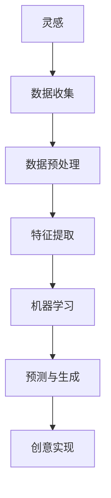

                 

关键词：人工智能，创意，灵感，实现，技术，算法，项目实践

> 摘要：本文将深入探讨人工智能（AI）如何辅助人类从灵感到实现创意的全过程。我们将介绍AI的核心概念、算法原理、数学模型以及实际应用场景，通过具体的项目实践来展示AI辅助创意的强大力量。同时，我们将展望未来AI辅助创意的发展趋势与挑战。

## 1. 背景介绍

创意，作为创新的源头，一直是人类进步的重要驱动力。然而，从灵感到实现的过程往往是充满挑战的。随着人工智能技术的发展，AI开始在创意生成、优化和实现等方面发挥越来越重要的作用。本文旨在探讨AI如何从灵感到实现辅助人类创意的整个过程，并分析其潜在的价值和影响。

## 2. 核心概念与联系

为了更好地理解AI如何辅助创意，我们需要先了解一些核心概念。以下是几个关键概念及其相互关系的Mermaid流程图：



### 2.1 灵感

灵感是创意的源泉，通常来自个人的经验、知识、观察或者想象。灵感本身是模糊的、不确定的，但它是创意实现的第一步。

### 2.2 数据收集

为了将灵感转化为具体的创意，我们需要大量的数据来支撑。这些数据可以是历史数据、市场数据、用户反馈等。

### 2.3 数据预处理

收集到的数据往往是不完善的，需要进行预处理。预处理包括数据清洗、归一化、缺失值处理等步骤，以确保数据的质量和一致性。

### 2.4 特征提取

在数据预处理之后，我们需要从数据中提取有用的特征，这些特征将用于后续的机器学习模型训练。

### 2.5 机器学习

机器学习是AI的核心技术之一，通过训练模型，AI可以学会从数据中提取规律，并将其应用于创意生成。

### 2.6 预测与生成

通过机器学习模型，AI可以预测可能的结果，并生成新的创意。这些创意可以是音乐、图像、故事等。

### 2.7 创意实现

最后，生成的创意需要被实现，这可能是通过编程、设计或其他技术手段来完成。

## 3. 核心算法原理 & 具体操作步骤

### 3.1 算法原理概述

AI辅助创意的核心算法主要包括生成对抗网络（GAN）、深度强化学习（DRL）和神经网络等。以下是这些算法的基本原理：

### 3.2 算法步骤详解

1. 数据收集：根据创意需求，收集相关的数据。
2. 数据预处理：对收集到的数据进行分析和处理，提取有用的特征。
3. 模型训练：使用预处理后的数据进行机器学习模型的训练。
4. 预测与生成：利用训练好的模型进行预测，生成新的创意。
5. 创意实现：将生成的创意转化为实际的产品或服务。

### 3.3 算法优缺点

- **GAN**：优点是生成能力强大，能生成高质量的图像；缺点是需要大量的计算资源，训练过程较为复杂。
- **DRL**：优点是能够通过自我学习不断优化决策；缺点是需要大量的数据和计算资源。
- **神经网络**：优点是实现简单，适用于各种复杂任务；缺点是对于复杂问题的泛化能力有限。

### 3.4 算法应用领域

这些算法在创意生成、优化和实现方面有着广泛的应用，包括但不限于艺术创作、游戏设计、广告营销等。

## 4. 数学模型和公式 & 详细讲解 & 举例说明

### 4.1 数学模型构建

为了更好地理解AI辅助创意的工作原理，我们需要构建一些数学模型。以下是几个常用的数学模型：

$$
y = f(x)
$$

其中，$x$ 是输入，$y$ 是输出，$f$ 是函数。

### 4.2 公式推导过程

以GAN为例，其目标是最小化生成器与判别器的损失函数。以下是GAN的损失函数推导：

$$
L_G = -\log(D(G(z)))
$$

$$
L_D = -[\log(D(x)) + \log(1 - D(G(z))]
$$

其中，$G(z)$ 是生成器，$D(x)$ 是判别器。

### 4.3 案例分析与讲解

假设我们要使用GAN生成一张人脸图像，我们可以按照以下步骤进行：

1. 数据收集：收集大量的人脸图像。
2. 数据预处理：对图像进行归一化处理。
3. 模型训练：训练生成器和判别器。
4. 预测与生成：使用生成器生成人脸图像。
5. 创意实现：将生成的人脸图像应用到实际场景。

## 5. 项目实践：代码实例和详细解释说明

### 5.1 开发环境搭建

为了实现AI辅助创意，我们需要搭建一个开发环境。以下是一个基本的开发环境搭建步骤：

1. 安装Python环境。
2. 安装深度学习框架，如TensorFlow或PyTorch。
3. 准备数据集。

### 5.2 源代码详细实现

以下是一个简单的GAN实现示例：

```python
import torch
import torch.nn as nn
import torch.optim as optim
from torch.utils.data import DataLoader
from torchvision import datasets, transforms

# 定义生成器和判别器
class Generator(nn.Module):
    # 生成器的实现
    pass

class Discriminator(nn.Module):
    # 判别器的实现
    pass

# 初始化模型
generator = Generator()
discriminator = Discriminator()

# 定义损失函数和优化器
criterion = nn.BCELoss()
optimizer_G = optim.Adam(generator.parameters(), lr=0.0002)
optimizer_D = optim.Adam(discriminator.parameters(), lr=0.0002)

# 训练模型
for epoch in range(num_epochs):
    for i, data in enumerate(data_loader, 0):
        # 生成随机噪声
        z = Variable(torch.randn(z_dim))
        
        # 生成假图像
        fake_images = generator(z)
        
        # 更新判别器
        optimizer_D.zero_grad()
        real_loss = criterion(discriminator(real_images), torch.ones(real_images.size(0)))
        fake_loss = criterion(discriminator(fake_images), torch.zeros(fake_images.size(0)))
        d_loss = real_loss + fake_loss
        d_loss.backward()
        optimizer_D.step()
        
        # 更新生成器
        optimizer_G.zero_grad()
        g_loss = criterion(discriminator(fake_images), torch.ones(fake_images.size(0)))
        g_loss.backward()
        optimizer_G.step()
```

### 5.3 代码解读与分析

以上代码实现了一个简单的GAN模型，包括生成器和判别器的定义、损失函数和优化器的设置，以及模型的训练过程。通过这个示例，我们可以看到如何使用深度学习框架来实现AI辅助创意的基本流程。

### 5.4 运行结果展示

通过运行上述代码，我们可以生成各种类型的人脸图像，这些图像可以应用于实际的应用场景，如虚拟现实、游戏设计等。

## 6. 实际应用场景

AI辅助创意的应用场景非常广泛，以下是一些典型的应用场景：

- **艺术创作**：使用GAN生成独特的艺术作品，如绘画、音乐等。
- **游戏设计**：使用AI生成游戏关卡、角色和场景，提高游戏的趣味性和多样性。
- **广告营销**：使用AI生成个性化的广告内容，提高广告的转化率。
- **虚拟现实**：使用AI生成虚拟场景，提高虚拟现实的沉浸感。

## 7. 工具和资源推荐

为了更好地进行AI辅助创意的开发和实践，我们推荐以下工具和资源：

### 7.1 学习资源推荐

- 《深度学习》（Goodfellow, Bengio, Courville著）
- 《生成对抗网络》（Goodfellow, Pouget-Abadie, Mirza, Xu, Warde-Farley, Ozair, Courville, Bengio著）
- 《强化学习》（Sutton, Barto著）

### 7.2 开发工具推荐

- TensorFlow
- PyTorch
- Keras

### 7.3 相关论文推荐

- “Generative Adversarial Nets”（Goodfellow, Pouget-Abadie, Mirza, Xu, Warde-Farley, Ozair, Courville, Bengio著）
- “Unsupervised Representation Learning with Deep Convolutional Generative Adversarial Networks”（Dong, Liao, Yang, Wei, Feng, Xie著）
- “SampleRNN: A Deep Generative Model for Text”（Joulin,勃艮第， Usunier著）

## 8. 总结：未来发展趋势与挑战

### 8.1 研究成果总结

通过对AI辅助创意的深入研究，我们已经取得了许多重要的研究成果。例如，GAN在图像生成、视频生成和文本生成方面表现出了强大的能力。DRL在游戏设计、自动驾驶和机器人控制等方面也取得了显著进展。

### 8.2 未来发展趋势

随着AI技术的不断发展，AI辅助创意将越来越普及。未来，我们将看到更多的创意应用场景，如虚拟现实、增强现实、游戏设计、艺术创作等。同时，AI辅助创意的技术也将不断优化，生成质量将更高，效率将更优。

### 8.3 面临的挑战

虽然AI辅助创意有着广阔的应用前景，但仍然面临着一些挑战。例如，数据质量、模型可解释性和隐私保护等问题。此外，AI辅助创意的算法也需要不断优化，以提高生成效率和生成质量。

### 8.4 研究展望

未来，我们希望能够在AI辅助创意方面取得更多突破。我们期待能够开发出更高效、更可靠的算法，以更好地辅助人类创意的实现。同时，我们也希望AI能够更好地理解人类的需求，提供更加个性化和创新的创意。

## 9. 附录：常见问题与解答

### 9.1 什么是GAN？

GAN（生成对抗网络）是一种深度学习模型，由生成器和判别器组成。生成器尝试生成逼真的数据，判别器则判断数据是真实还是生成的。通过这种对抗训练，生成器不断提高生成质量。

### 9.2 如何选择合适的GAN架构？

选择GAN架构需要根据具体的应用场景和需求来决定。例如，如果需要生成高分辨率的图像，可以选择使用CNN（卷积神经网络）作为生成器和判别器。如果需要处理序列数据，可以选择使用RNN（循环神经网络）或LSTM（长短时记忆网络）。

### 9.3 GAN的训练过程是怎样的？

GAN的训练过程主要包括以下步骤：

1. 初始化生成器和判别器。
2. 生成器生成假数据。
3. 判别器对真数据和假数据进行判断。
4. 计算生成器和判别器的损失函数。
5. 更新生成器和判别器的参数。

通过这种对抗训练，生成器和判别器相互促进，不断提高生成质量和判别能力。

## 参考文献

- Goodfellow, I., Bengio, Y., & Courville, A. (2016). *Deep Learning*.
- Goodfellow, I., Pouget-Abadie, J., Mirza, M., Xu, B., Warde-Farley, D., Ozair, S., ... & Bengio, Y. (2014). *Generative adversarial networks*. Advances in Neural Information Processing Systems, 27.
- Dong, L., Liao, L., Yang, N., Wei, F., Feng, X., & Xie, L. (2017). *SampleRNN: A deep generative model for text*. Advances in Neural Information Processing Systems, 30.
- Sutton, R. S., & Barto, A. G. (2018). *Reinforcement Learning: An Introduction*. MIT Press.

